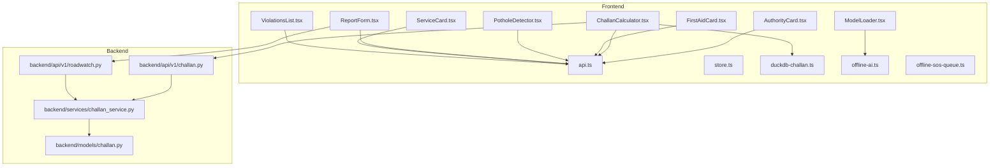
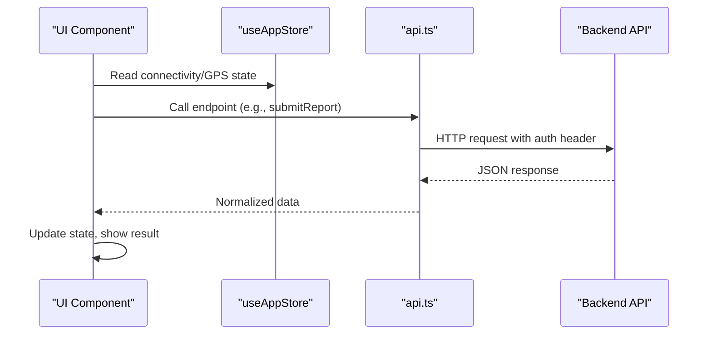
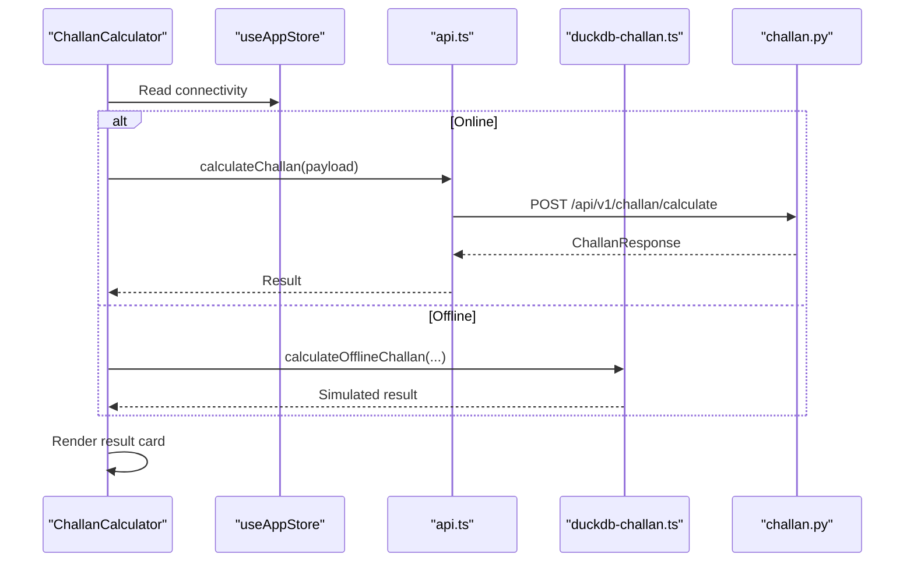
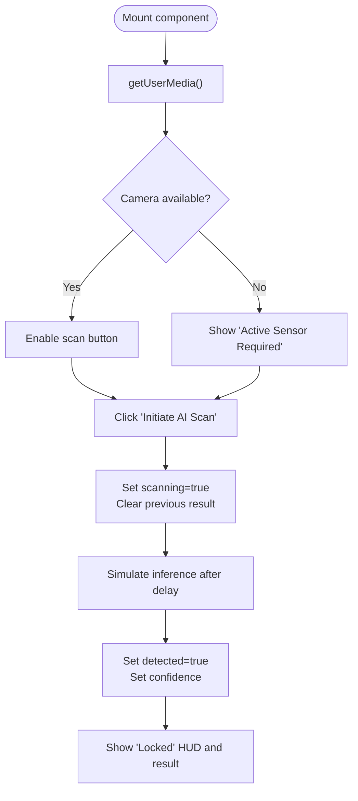
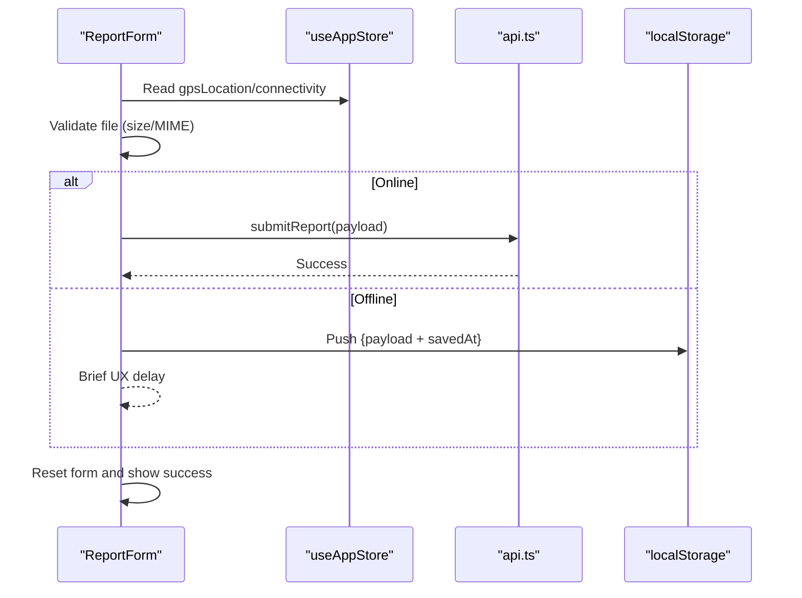
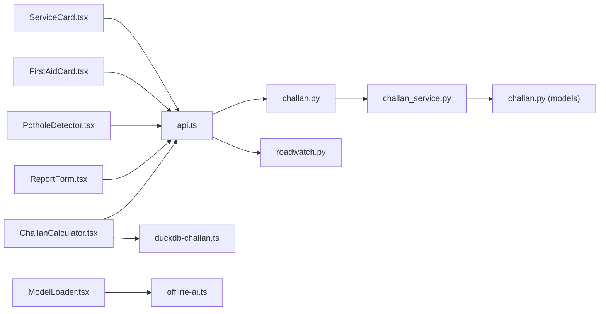

# Specialized Components

<cite>
**Referenced Files in This Document**
- [AuthorityCard.tsx](file://frontend/components/AuthorityCard.tsx)
- [ChallanCalculator.tsx](file://frontend/components/ChallanCalculator.tsx)
- [FirstAidCard.tsx](file://frontend/components/FirstAidCard.tsx)
- [ModelLoader.tsx](file://frontend/components/ModelLoader.tsx)
- [PotholeDetector.tsx](file://frontend/components/PotholeDetector.tsx)
- [ReportForm.tsx](file://frontend/components/ReportForm.tsx)
- [ServiceCard.tsx](file://frontend/components/ServiceCard.tsx)
- [ViolationsList.tsx](file://frontend/components/ViolationsList.tsx)
- [api.ts](file://frontend/lib/api.ts)
- [store.ts](file://frontend/lib/store.ts)
- [duckdb-challan.ts](file://frontend/lib/duckdb-challan.ts)
- [offline-ai.ts](file://frontend/lib/offline-ai.ts)
- [offline-sos-queue.ts](file://frontend/lib/offline-sos-queue.ts)
- [challan.py](file://backend/api/v1/challan.py)
- [roadwatch.py](file://backend/api/v1/roadwatch.py)
- [challan_service.py](file://backend/services/challan_service.py)
- [challan.py](file://backend/models/challan.py)
</cite>

## Table of Contents
1. [Introduction](#introduction)
2. [Project Structure](#project-structure)
3. [Core Components](#core-components)
4. [Architecture Overview](#architecture-overview)
5. [Detailed Component Analysis](#detailed-component-analysis)
6. [Dependency Analysis](#dependency-analysis)
7. [Performance Considerations](#performance-considerations)
8. [Troubleshooting Guide](#troubleshooting-guide)
9. [Conclusion](#conclusion)

## Introduction
This document explains specialized application-specific components that implement unique functionality for SafeVixAI. It focuses on five front-end components—AuthorityCard, ChallanCalculator, FirstAidCard, ModelLoader, PotholeDetector, ReportForm, ServiceCard, and ViolationsList—and how they integrate with backend APIs and offline capabilities. It covers business logic, data processing patterns, offline-first strategies, real-time updates, lifecycle management, error handling, and user interaction patterns.

## Project Structure
The specialized components live in the frontend under components and are supported by shared libraries in lib (API clients, stores, offline engines). Backend APIs expose endpoints for reporting, challan calculations, and emergency services.

**Diagram sources**
- [AuthorityCard.tsx:1-34](file://frontend/components/AuthorityCard.tsx#L1-L34)
- [ChallanCalculator.tsx:1-186](file://frontend/components/ChallanCalculator.tsx#L1-L186)
- [FirstAidCard.tsx:1-121](file://frontend/components/FirstAidCard.tsx#L1-L121)
- [ModelLoader.tsx:1-61](file://frontend/components/ModelLoader.tsx#L1-L61)
- [PotholeDetector.tsx:1-146](file://frontend/components/PotholeDetector.tsx#L1-L146)
- [ReportForm.tsx:1-205](file://frontend/components/ReportForm.tsx#L1-L205)
- [ServiceCard.tsx:1-96](file://frontend/components/ServiceCard.tsx#L1-L96)
- [ViolationsList.tsx:1-54](file://frontend/components/ViolationsList.tsx#L1-L54)
- [api.ts:1-821](file://frontend/lib/api.ts#L1-L821)
- [store.ts:1-226](file://frontend/lib/store.ts#L1-L226)
- [duckdb-challan.ts:1-51](file://frontend/lib/duckdb-challan.ts#L1-L51)
- [offline-ai.ts:1-256](file://frontend/lib/offline-ai.ts#L1-L256)
- [offline-sos-queue.ts:1-138](file://frontend/lib/offline-sos-queue.ts#L1-L138)
- [challan.py:1-26](file://backend/api/v1/challan.py#L1-L26)
- [roadwatch.py:1-97](file://backend/api/v1/roadwatch.py#L1-L97)
- [challan_service.py:1-314](file://backend/services/challan_service.py#L1-L314)
- [challan.py:1-53](file://backend/models/challan.py#L1-L53)

**Section sources**
- [AuthorityCard.tsx:1-34](file://frontend/components/AuthorityCard.tsx#L1-L34)
- [ChallanCalculator.tsx:1-186](file://frontend/components/ChallanCalculator.tsx#L1-L186)
- [FirstAidCard.tsx:1-121](file://frontend/components/FirstAidCard.tsx#L1-L121)
- [ModelLoader.tsx:1-61](file://frontend/components/ModelLoader.tsx#L1-L61)
- [PotholeDetector.tsx:1-146](file://frontend/components/PotholeDetector.tsx#L1-L146)
- [ReportForm.tsx:1-205](file://frontend/components/ReportForm.tsx#L1-L205)
- [ServiceCard.tsx:1-96](file://frontend/components/ServiceCard.tsx#L1-L96)
- [ViolationsList.tsx:1-54](file://frontend/components/ViolationsList.tsx#L1-L54)
- [api.ts:1-821](file://frontend/lib/api.ts#L1-L821)
- [store.ts:1-226](file://frontend/lib/store.ts#L1-L226)
- [duckdb-challan.ts:1-51](file://frontend/lib/duckdb-challan.ts#L1-L51)
- [offline-ai.ts:1-256](file://frontend/lib/offline-ai.ts#L1-L256)
- [offline-sos-queue.ts:1-138](file://frontend/lib/offline-sos-queue.ts#L1-L138)
- [challan.py:1-26](file://backend/api/v1/challan.py#L1-L26)
- [roadwatch.py:1-97](file://backend/api/v1/roadwatch.py#L1-L97)
- [challan_service.py:1-314](file://backend/services/challan_service.py#L1-L314)
- [challan.py:1-53](file://backend/models/challan.py#L1-L53)

## Core Components
- AuthorityCard: Displays assigned authority and SLA for road maintenance.
- ChallanCalculator: Calculates penalties based on violation, vehicle class, state, and repeat status; supports online and offline modes.
- FirstAidCard: Renders first aid instructions with bold-marked emphasis and offline badge.
- ModelLoader: Shows a modal overlay during offline AI model loading with progress.
- PotholeDetector: Simulates camera access and AI scanning for potholes with animated HUD.
- ReportForm: Multi-step form to report road hazards with photo upload and offline queueing.
- ServiceCard: Displays nearby emergency/service providers with category-specific accents and actions.
- ViolationsList: Static directory of common challan violations and amounts.

**Section sources**
- [AuthorityCard.tsx:1-34](file://frontend/components/AuthorityCard.tsx#L1-L34)
- [ChallanCalculator.tsx:1-186](file://frontend/components/ChallanCalculator.tsx#L1-L186)
- [FirstAidCard.tsx:1-121](file://frontend/components/FirstAidCard.tsx#L1-L121)
- [ModelLoader.tsx:1-61](file://frontend/components/ModelLoader.tsx#L1-L61)
- [PotholeDetector.tsx:1-146](file://frontend/components/PotholeDetector.tsx#L1-L146)
- [ReportForm.tsx:1-205](file://frontend/components/ReportForm.tsx#L1-L205)
- [ServiceCard.tsx:1-96](file://frontend/components/ServiceCard.tsx#L1-L96)
- [ViolationsList.tsx:1-54](file://frontend/components/ViolationsList.tsx#L1-L54)

## Architecture Overview
The components rely on a shared Zustand store for connectivity and GPS state, and on API clients for backend integration. Offline engines support AI and challan calculations. The backend exposes REST endpoints for challan calculation and road reporting.

**Diagram sources**
- [api.ts:1-821](file://frontend/lib/api.ts#L1-L821)
- [store.ts:1-226](file://frontend/lib/store.ts#L1-L226)

## Detailed Component Analysis

### AuthorityCard
- Purpose: Present authority assignment and SLA for maintenance.
- Behavior: Static card with authority name and SLA text.
- Integration: No runtime API calls; used for contextual awareness.

**Section sources**
- [AuthorityCard.tsx:1-34](file://frontend/components/AuthorityCard.tsx#L1-L34)

### ChallanCalculator
- Purpose: Calculate challan penalties with state-specific overrides.
- Business logic:
  - Accepts violation code, vehicle class, state code, repeat flag.
  - Online: Calls backend calculate endpoint.
  - Offline: Uses DuckDB-backed simulation.
- Data processing:
  - Maps UI selections to backend query shape.
  - Applies repeat multiplier when applicable.
- Offline engine:
  - DuckDB offline calculation helper simulates DB lookup.
- Real-time updates:
  - Uses store connectivity state to switch modes.
- Lifecycle:
  - Initializes with defaults and manages loading states.
- Error handling:
  - Catches calculation errors and logs them.

**Diagram sources**
- [ChallanCalculator.tsx:1-186](file://frontend/components/ChallanCalculator.tsx#L1-L186)
- [duckdb-challan.ts:1-51](file://frontend/lib/duckdb-challan.ts#L1-L51)
- [challan.py:1-26](file://backend/api/v1/challan.py#L1-L26)
- [challan_service.py:1-314](file://backend/services/challan_service.py#L1-L314)

**Section sources**
- [ChallanCalculator.tsx:1-186](file://frontend/components/ChallanCalculator.tsx#L1-L186)
- [duckdb-challan.ts:1-51](file://frontend/lib/duckdb-challan.ts#L1-L51)
- [challan.py:1-26](file://backend/api/v1/challan.py#L1-L26)
- [challan_service.py:1-314](file://backend/services/challan_service.py#L1-L314)
- [challan.py:1-53](file://backend/models/challan.py#L1-L53)

### FirstAidCard
- Purpose: Display first aid steps with bold emphasis and offline badge.
- Business logic:
  - Parses step text and converts bold markers to strong elements.
  - Renders a card with accent glow and offline indicator.
- User interaction: Minimal; static rendering.

**Section sources**
- [FirstAidCard.tsx:1-121](file://frontend/components/FirstAidCard.tsx#L1-L121)

### ModelLoader
- Purpose: Show model loading overlay during offline AI initialization.
- Lifecycle:
  - Activates when aiMode is loading.
  - Displays spinner, description, and progress bar.
- Integration: Reads modelLoadProgress from store.

**Section sources**
- [ModelLoader.tsx:1-61](file://frontend/components/ModelLoader.tsx#L1-L61)
- [store.ts:1-226](file://frontend/lib/store.ts#L1-L226)
- [offline-ai.ts:1-256](file://frontend/lib/offline-ai.ts#L1-L256)

### PotholeDetector
- Purpose: Simulate camera access and AI scanning for potholes.
- Lifecycle:
  - Acquires camera on mount; cleans up tracks on unmount.
  - Scanning state toggles HUD and confidence overlay.
- Offline engine:
  - Uses simulated inference with a fixed delay and confidence score.
- User interaction:
  - Initiate scan button; disabled when scanning or no camera.

**Diagram sources**
- [PotholeDetector.tsx:1-146](file://frontend/components/PotholeDetector.tsx#L1-L146)

**Section sources**
- [PotholeDetector.tsx:1-146](file://frontend/components/PotholeDetector.tsx#L1-L146)

### ReportForm
- Purpose: Multi-step form to report road hazards with severity, description, and optional photo.
- Business logic:
  - Step 1: Choose issue type and severity.
  - Step 2: Add description and photo; validate MIME and size.
  - Submit: Online uses API; offline queues to localStorage with a timestamp.
- Real-time updates:
  - Uses GPS coordinates from store for location.
  - Connectivity state determines online/offline behavior.
- Error handling:
  - Validates file size/type and shows toast on failure.
  - Clears form on successful submission.

**Diagram sources**
- [ReportForm.tsx:1-205](file://frontend/components/ReportForm.tsx#L1-L205)
- [api.ts:723-750](file://frontend/lib/api.ts#L723-L750)

**Section sources**
- [ReportForm.tsx:1-205](file://frontend/components/ReportForm.tsx#L1-L205)
- [api.ts:723-750](file://frontend/lib/api.ts#L723-L750)
- [store.ts:1-226](file://frontend/lib/store.ts#L1-L226)

### ServiceCard
- Purpose: Display nearby emergency/service providers with category-specific accents.
- Business logic:
  - Maps category to color and label.
  - Formats distance to meters/km.
  - Generates Google Maps directions URL.
- Accessibility:
  - Provides aria labels for actions.

**Section sources**
- [ServiceCard.tsx:1-96](file://frontend/components/ServiceCard.tsx#L1-L96)
- [store.ts:1-226](file://frontend/lib/store.ts#L1-L226)

### ViolationsList
- Purpose: Browse common challan violations and amounts.
- Behavior: Static list with descriptions and MV Act references.

**Section sources**
- [ViolationsList.tsx:1-54](file://frontend/components/ViolationsList.tsx#L1-L54)

## Dependency Analysis
- Frontend components depend on:
  - Zustand store for connectivity and GPS state.
  - API client for backend integration.
  - Offline engines for AI and challan calculations.
- Backend depends on:
  - Challan service for penalty calculations.
  - SQLAlchemy sessions for persistence.
  - CSV datasets for rule and override definitions.

**Diagram sources**
- [ChallanCalculator.tsx:1-186](file://frontend/components/ChallanCalculator.tsx#L1-L186)
- [ReportForm.tsx:1-205](file://frontend/components/ReportForm.tsx#L1-L205)
- [PotholeDetector.tsx:1-146](file://frontend/components/PotholeDetector.tsx#L1-L146)
- [FirstAidCard.tsx:1-121](file://frontend/components/FirstAidCard.tsx#L1-L121)
- [ModelLoader.tsx:1-61](file://frontend/components/ModelLoader.tsx#L1-L61)
- [ServiceCard.tsx:1-96](file://frontend/components/ServiceCard.tsx#L1-L96)
- [api.ts:1-821](file://frontend/lib/api.ts#L1-L821)
- [duckdb-challan.ts:1-51](file://frontend/lib/duckdb-challan.ts#L1-L51)
- [offline-ai.ts:1-256](file://frontend/lib/offline-ai.ts#L1-L256)
- [challan.py:1-26](file://backend/api/v1/challan.py#L1-L26)
- [roadwatch.py:1-97](file://backend/api/v1/roadwatch.py#L1-L97)
- [challan_service.py:1-314](file://backend/services/challan_service.py#L1-L314)
- [challan.py:1-53](file://backend/models/challan.py#L1-L53)

**Section sources**
- [store.ts:1-226](file://frontend/lib/store.ts#L1-L226)
- [api.ts:1-821](file://frontend/lib/api.ts#L1-L821)
- [challan.py:1-26](file://backend/api/v1/challan.py#L1-L26)
- [roadwatch.py:1-97](file://backend/api/v1/roadwatch.py#L1-L97)
- [challan_service.py:1-314](file://backend/services/challan_service.py#L1-L314)
- [challan.py:1-53](file://backend/models/challan.py#L1-L53)

## Performance Considerations
- Offline AI model loading:
  - Prefer system AI when available (0MB download) to minimize latency.
  - Transformers.js path caches models via browser cache storage.
- Challan calculation:
  - DuckDB offline lookup simulates fast response; keep rule sets minimal and indexed by violation code.
- Image uploads:
  - Validate file size and type early to avoid unnecessary uploads.
- Camera access:
  - Clean up media tracks on unmount to prevent resource leaks.

## Troubleshooting Guide
- Camera access denied:
  - The component logs and continues; ensure HTTPS and permissions are granted.
- Offline AI initialization failures:
  - Falls back to keyword-based responses; check browser compatibility and storage availability.
- Challan calculation errors:
  - Backend validates inputs; ensure violation code, vehicle class, and state code conform to accepted formats.
- Report submission failures:
  - Verify connectivity; offline submissions are queued and synced when online.
- Model loader not visible:
  - Ensure aiMode transitions to loading and modelLoadProgress updates.

**Section sources**
- [PotholeDetector.tsx:1-146](file://frontend/components/PotholeDetector.tsx#L1-L146)
- [offline-ai.ts:1-256](file://frontend/lib/offline-ai.ts#L1-L256)
- [challan_service.py:1-314](file://backend/services/challan_service.py#L1-L314)
- [offline-sos-queue.ts:1-138](file://frontend/lib/offline-sos-queue.ts#L1-L138)

## Conclusion
These specialized components implement focused, user-centric features with robust offline-first strategies. They leverage a shared store for state, a unified API client for backend integration, and modular offline engines for AI and calculations. The backend provides reliable endpoints for challan and reporting, ensuring consistent behavior across connectivity scenarios.