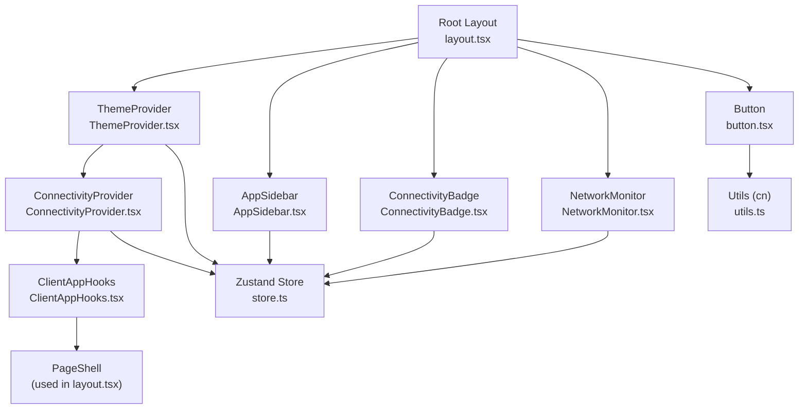
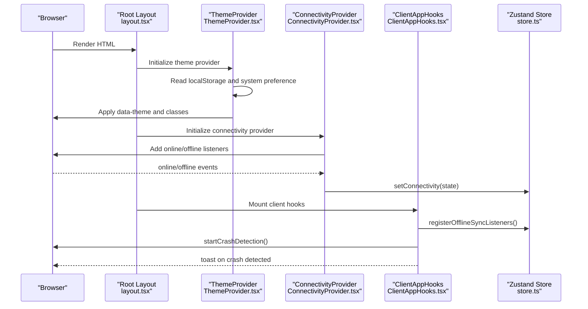
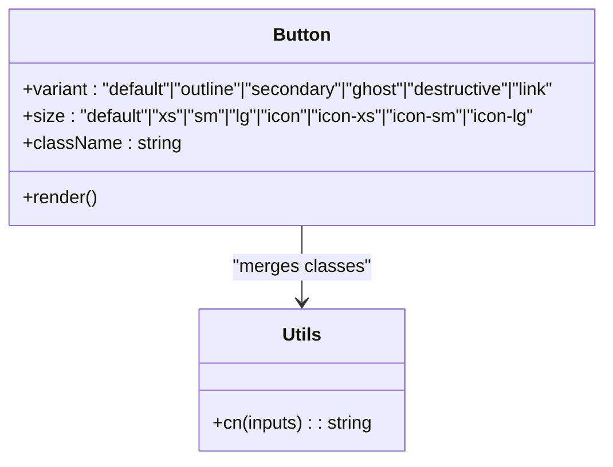
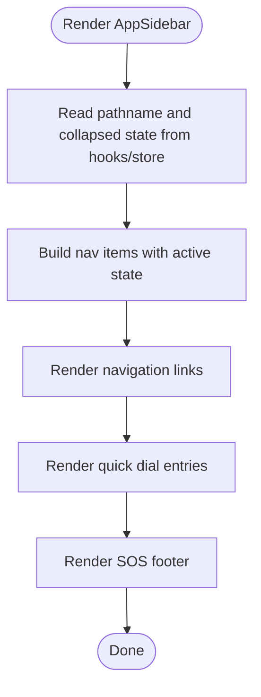
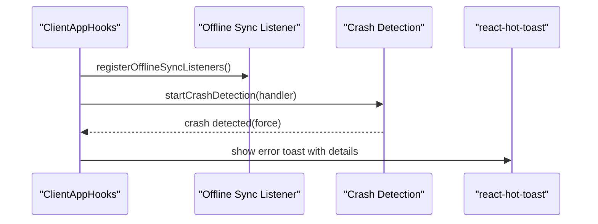
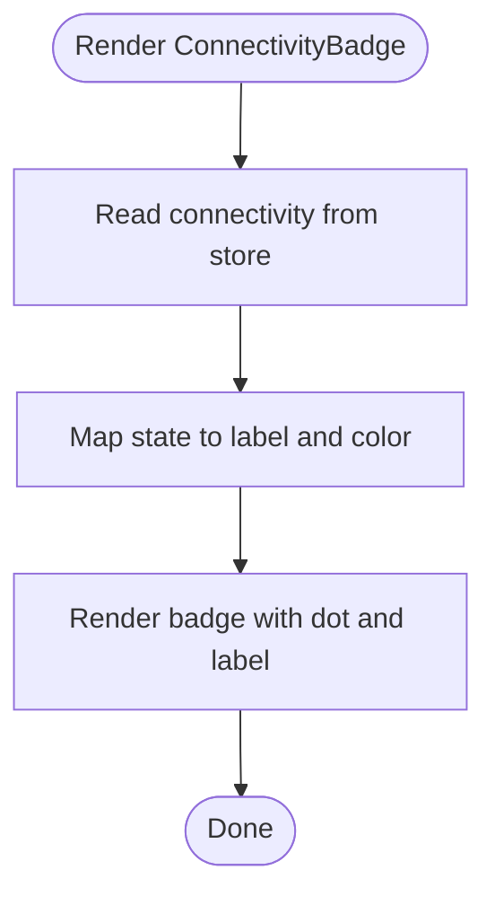
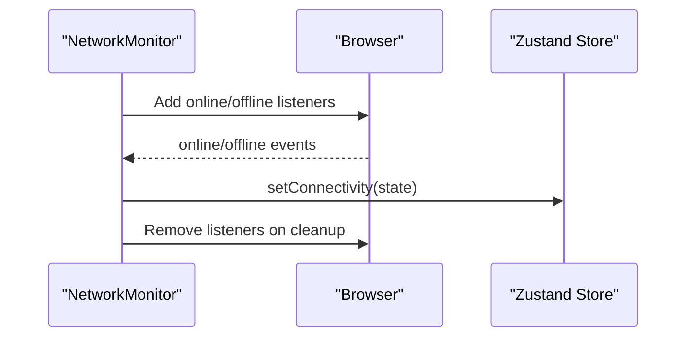
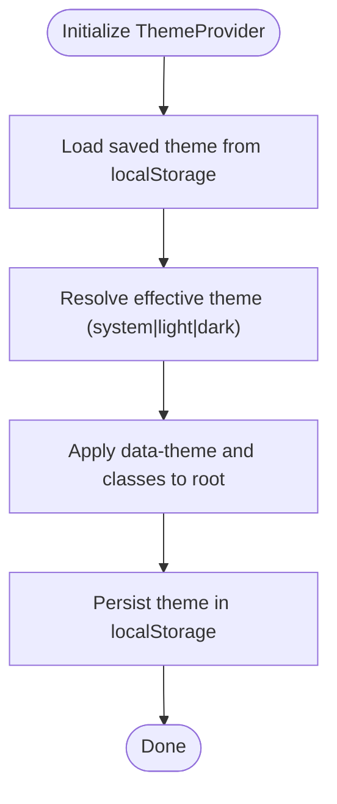
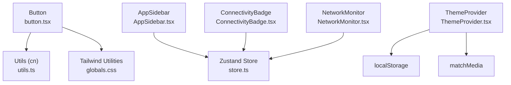

# UI Components

<cite>
**Referenced Files in This Document**
- [button.tsx](file://frontend/components/ui/button.tsx)
- [AppSidebar.tsx](file://frontend/components/AppSidebar.tsx)
- [ClientAppHooks.tsx](file://frontend/components/ClientAppHooks.tsx)
- [ConnectivityBadge.tsx](file://frontend/components/ConnectivityBadge.tsx)
- [NetworkMonitor.tsx](file://frontend/components/NetworkMonitor.tsx)
- [ThemeProvider.tsx](file://frontend/components/ThemeProvider.tsx)
- [ConnectivityProvider.tsx](file://frontend/components/ConnectivityProvider.tsx)
- [store.ts](file://frontend/lib/store.ts)
- [layout.tsx](file://frontend/app/layout.tsx)
- [tailwind.config.js](file://frontend/tailwind.config.js)
- [components.json](file://frontend/components.json)
- [utils.ts](file://frontend/lib/utils.ts)
- [globals.css](file://frontend/app/globals.css)
</cite>

## Table of Contents
1. [Introduction](#introduction)
2. [Project Structure](#project-structure)
3. [Core Components](#core-components)
4. [Architecture Overview](#architecture-overview)
5. [Detailed Component Analysis](#detailed-component-analysis)
6. [Dependency Analysis](#dependency-analysis)
7. [Performance Considerations](#performance-considerations)
8. [Troubleshooting Guide](#troubleshooting-guide)
9. [Conclusion](#conclusion)
10. [Appendices](#appendices)

## Introduction
This document describes the core UI component library used across the SafeVixAI application. It focuses on foundational components that define behavior, styling, and integration patterns: Button, AppSidebar, ClientAppHooks, ConnectivityBadge, NetworkMonitor, and ThemeProvider. It explains component props, TypeScript interfaces, styling approaches with Tailwind CSS, and accessibility implementations. It also provides usage examples, composition patterns, state management integration, performance optimization techniques, and guidelines for extending components while maintaining design consistency.

## Project Structure
The UI components live under the frontend/components directory and integrate with a centralized Zustand store for state, a ThemeProvider for theme resolution, and Tailwind CSS for styling. The Next.js root layout composes providers to establish global behavior.

**Diagram sources**
- [layout.tsx:38-85](file://frontend/app/layout.tsx#L38-L85)
- [ThemeProvider.tsx:19-62](file://frontend/components/ThemeProvider.tsx#L19-L62)
- [ConnectivityProvider.tsx:6-26](file://frontend/components/ConnectivityProvider.tsx#L6-L26)
- [ClientAppHooks.tsx:8-37](file://frontend/components/ClientAppHooks.tsx#L8-L37)
- [AppSidebar.tsx:42-170](file://frontend/components/AppSidebar.tsx#L42-L170)
- [ConnectivityBadge.tsx:16-31](file://frontend/components/ConnectivityBadge.tsx#L16-L31)
- [NetworkMonitor.tsx:6-34](file://frontend/components/NetworkMonitor.tsx#L6-L34)
- [button.tsx:43-58](file://frontend/components/ui/button.tsx#L43-L58)
- [utils.ts:4-6](file://frontend/lib/utils.ts#L4-L6)
- [store.ts:129-225](file://frontend/lib/store.ts#L129-L225)

**Section sources**
- [layout.tsx:38-85](file://frontend/app/layout.tsx#L38-L85)
- [components.json:1-26](file://frontend/components.json#L1-L26)

## Core Components
This section documents the core UI components and their responsibilities, props, styling, and accessibility.

- Button
  - Purpose: A versatile button primitive with variant and size variants powered by class variance authority and styled with Tailwind utilities.
  - Props: Inherits from the underlying button primitive and adds optional variant and size props. It merges className with computed variants.
  - Styling: Uses cva for variants and sizes, Tailwind utilities for responsive sizing and spacing, and focus-visible ring styles.
  - Accessibility: Inherits native button semantics; supports aria-* attributes and focus-visible ring.
  - Usage pattern: Wrap icons and text; use variant "link" for minimal actions; pair with size "icon" for compact controls.

- AppSidebar
  - Purpose: A responsive sidebar with navigation links, quick dial buttons, and a prominent SOS action. Integrates with Zustand for collapse state and Next.js routing for active indicators.
  - Props: None; reads current pathname and state from hooks.
  - Styling: Uses Tailwind utilities for backdrop blur, shadows, transitions, and responsive widths. Animations powered by motion/react.
  - Accessibility: Uses semantic Link and button elements; includes title attributes and aria-labels where appropriate.

- ClientAppHooks
  - Purpose: Initializes offline sync listeners and crash detection, and displays a toast notification on crash detection events.
  - Props: None; runs side effects on mount.
  - Styling: Toast styling is handled by react-hot-toast; component itself renders null.
  - Accessibility: Toasts are announced to assistive technologies; ensure sufficient contrast and readable text.

- ConnectivityBadge
  - Purpose: Displays current connectivity state with a colored dot and label. Reads from Zustand store.
  - Props: Optional className for additional styling.
  - Styling: Uses CSS classes for dot and label; color classes mapped per state.
  - Accessibility: Announces state via aria-live and aria-label.

- NetworkMonitor
  - Purpose: Listens to browser online/offline events and updates Zustand store accordingly.
  - Props: None; runs side effects on mount and unmounts listeners.
  - Styling: Renders nothing; pure behavior.
  - Accessibility: No special accessibility concerns.

- ThemeProvider
  - Purpose: Manages theme selection (light, dark, system) and applies resolved theme to the document element and classes.
  - Props: Children.
  - Styling: Applies data-theme and class toggles; persists selection in localStorage.
  - Accessibility: Respects system preference; ensures smooth transitions.

**Section sources**
- [button.tsx:43-58](file://frontend/components/ui/button.tsx#L43-L58)
- [AppSidebar.tsx:42-170](file://frontend/components/AppSidebar.tsx#L42-L170)
- [ClientAppHooks.tsx:8-37](file://frontend/components/ClientAppHooks.tsx#L8-L37)
- [ConnectivityBadge.tsx:16-31](file://frontend/components/ConnectivityBadge.tsx#L16-L31)
- [NetworkMonitor.tsx:6-34](file://frontend/components/NetworkMonitor.tsx#L6-L34)
- [ThemeProvider.tsx:19-62](file://frontend/components/ThemeProvider.tsx#L19-L62)

## Architecture Overview
The UI components are composed within the Next.js root layout. Providers orchestrate global state and behavior:
- ThemeProvider resolves and applies theme, persists user choice.
- ConnectivityProvider listens to network events and updates store.
- ClientAppHooks initializes offline and crash detection.
- AppSidebar integrates routing and state to reflect active navigation and show quick actions.
- ConnectivityBadge reflects current connectivity state.
- NetworkMonitor mirrors browser online/offline events to store.
- Button uses shared styling utilities and variants.

**Diagram sources**
- [layout.tsx:38-85](file://frontend/app/layout.tsx#L38-L85)
- [ThemeProvider.tsx:19-62](file://frontend/components/ThemeProvider.tsx#L19-L62)
- [ConnectivityProvider.tsx:6-26](file://frontend/components/ConnectivityProvider.tsx#L6-L26)
- [ClientAppHooks.tsx:8-37](file://frontend/components/ClientAppHooks.tsx#L8-L37)
- [store.ts:129-225](file://frontend/lib/store.ts#L129-L225)

## Detailed Component Analysis

### Button Component
- Implementation pattern: Wraps a base UI button primitive and augments it with variant and size logic using class variance authority. Merges computed classes with user-provided className.
- Data structures: Uses cva variants and default variants to compute a class string.
- Dependencies: Imports cn from utils for merging classes; uses Base UI Button primitive.
- Accessibility: Inherits button semantics; supports focus-visible ring and disabled states.
- Performance: Minimal re-renders; variant computation is deterministic.

**Diagram sources**
- [button.tsx:43-58](file://frontend/components/ui/button.tsx#L43-L58)
- [utils.ts:4-6](file://frontend/lib/utils.ts#L4-L6)

**Section sources**
- [button.tsx:6-41](file://frontend/components/ui/button.tsx#L6-L41)
- [button.tsx:43-58](file://frontend/components/ui/button.tsx#L43-L58)
- [utils.ts:4-6](file://frontend/lib/utils.ts#L4-L6)

### AppSidebar Component
- Implementation pattern: Uses Next.js navigation hooks to detect active route and Zustand store to manage collapsed state. Renders navigation items and quick dial entries with icons and labels. Includes animated active indicator and a prominent SOS action.
- Data structures: navItems and quickDials arrays define navigation and emergency contacts.
- Dependencies: motion/react for animations; lucide-react for icons; Zustand store for UI state.
- Accessibility: Uses semantic Link and button elements; includes title attributes; active state indicated visually and via layoutId animation.
- Performance: Uses memoized state reads; animations are optimized with spring physics.

**Diagram sources**
- [AppSidebar.tsx:42-170](file://frontend/components/AppSidebar.tsx#L42-L170)

**Section sources**
- [AppSidebar.tsx:23-40](file://frontend/components/AppSidebar.tsx#L23-L40)
- [AppSidebar.tsx:42-170](file://frontend/components/AppSidebar.tsx#L42-L170)

### ClientAppHooks Component
- Implementation pattern: Runs side effects on mount to initialize offline sync listeners and crash detection. Displays a toast notification when a crash is detected.
- Data structures: None; relies on external libraries for offline and crash detection.
- Dependencies: react-hot-toast for notifications; offline and crash detection utilities.
- Accessibility: Toasts are announced; ensure readable messages and sufficient contrast.
- Performance: Side effects are attached once; no ongoing rendering overhead.

**Diagram sources**
- [ClientAppHooks.tsx:8-37](file://frontend/components/ClientAppHooks.tsx#L8-L37)

**Section sources**
- [ClientAppHooks.tsx:8-37](file://frontend/components/ClientAppHooks.tsx#L8-L37)

### ConnectivityBadge Component
- Implementation pattern: Reads current connectivity state from Zustand store and renders a badge with a colored dot and label. Uses aria-live and aria-label for accessibility.
- Data structures: CONFIG maps ConnectivityState to label and color class.
- Dependencies: Zustand store for connectivity state.
- Accessibility: Announces state changes to assistive technologies.
- Performance: Pure render based on store subscription.

**Diagram sources**
- [ConnectivityBadge.tsx:16-31](file://frontend/components/ConnectivityBadge.tsx#L16-L31)
- [store.ts:61](file://frontend/lib/store.ts#L61)

**Section sources**
- [ConnectivityBadge.tsx:5-10](file://frontend/components/ConnectivityBadge.tsx#L5-L10)
- [ConnectivityBadge.tsx:16-31](file://frontend/components/ConnectivityBadge.tsx#L16-L31)
- [store.ts:90-92](file://frontend/lib/store.ts#L90-L92)

### NetworkMonitor Component
- Implementation pattern: Adds online/offline event listeners on mount and updates Zustand store accordingly. Removes listeners on unmount.
- Data structures: None; uses navigator.onLine to determine initial state.
- Dependencies: Zustand store for connectivity state.
- Accessibility: No special accessibility concerns.
- Performance: Minimal overhead; listeners are removed on unmount.

**Diagram sources**
- [NetworkMonitor.tsx:6-34](file://frontend/components/NetworkMonitor.tsx#L6-L34)
- [store.ts:90-92](file://frontend/lib/store.ts#L90-L92)

**Section sources**
- [NetworkMonitor.tsx:6-34](file://frontend/components/NetworkMonitor.tsx#L6-L34)
- [store.ts:90-92](file://frontend/lib/store.ts#L90-L92)

### ThemeProvider Component
- Implementation pattern: Manages theme selection, resolves system preference, applies data-theme and class toggles, and persists user choice in localStorage. Exposes a context for consumers.
- Data structures: ThemeContext carries theme, resolvedTheme, and setTheme.
- Dependencies: localStorage for persistence; matchMedia for system preference.
- Accessibility: Respects system preference; ensures smooth transitions.
- Performance: Applies theme once on mount and on preference change; efficient class toggling.

**Diagram sources**
- [ThemeProvider.tsx:19-62](file://frontend/components/ThemeProvider.tsx#L19-L62)

**Section sources**
- [ThemeProvider.tsx:5-17](file://frontend/components/ThemeProvider.tsx#L5-L17)
- [ThemeProvider.tsx:19-62](file://frontend/components/ThemeProvider.tsx#L19-L62)

## Dependency Analysis
The components depend on shared utilities and state management:
- Button depends on cn for class merging and Tailwind utilities for styling.
- AppSidebar depends on Zustand store for UI state and Next.js navigation for active routes.
- ClientAppHooks depends on external libraries for offline and crash detection.
- ConnectivityBadge and NetworkMonitor depend on Zustand store for connectivity state.
- ThemeProvider depends on localStorage and matchMedia for theme resolution.

**Diagram sources**
- [button.tsx:4-6](file://frontend/components/ui/button.tsx#L4-L6)
- [utils.ts:4-6](file://frontend/lib/utils.ts#L4-L6)
- [globals.css:1-800](file://frontend/app/globals.css#L1-L800)
- [AppSidebar.tsx:21](file://frontend/components/AppSidebar.tsx#L21)
- [store.ts:129-225](file://frontend/lib/store.ts#L129-L225)
- [ConnectivityBadge.tsx:3](file://frontend/components/ConnectivityBadge.tsx#L3)
- [NetworkMonitor.tsx:4](file://frontend/components/NetworkMonitor.tsx#L4)
- [ThemeProvider.tsx:20-48](file://frontend/components/ThemeProvider.tsx#L20-L48)

**Section sources**
- [button.tsx:4-6](file://frontend/components/ui/button.tsx#L4-L6)
- [utils.ts:4-6](file://frontend/lib/utils.ts#L4-L6)
- [globals.css:1-800](file://frontend/app/globals.css#L1-L800)
- [AppSidebar.tsx:21](file://frontend/components/AppSidebar.tsx#L21)
- [store.ts:129-225](file://frontend/lib/store.ts#L129-L225)
- [ConnectivityBadge.tsx:3](file://frontend/components/ConnectivityBadge.tsx#L3)
- [NetworkMonitor.tsx:4](file://frontend/components/NetworkMonitor.tsx#L4)
- [ThemeProvider.tsx:20-48](file://frontend/components/ThemeProvider.tsx#L20-L48)

## Performance Considerations
- Prefer variant and size props on Button to avoid ad-hoc class concatenation.
- Use cn for class merging to minimize redundant DOM changes.
- Keep AppSidebar navigation arrays static to avoid unnecessary re-renders.
- Debounce or throttle event listeners where appropriate (e.g., resize or scroll).
- Use CSS custom properties for theme tokens to reduce repaint costs.
- Avoid heavy computations inside render; memoize derived values from Zustand store.
- Leverage Tailwind utilities for consistent, atomic styling to reduce CSS bloat.

## Troubleshooting Guide
- Button does not apply variant styles:
  - Verify variant and size props are passed correctly.
  - Ensure Tailwind utilities are included in the build and globals.css is loaded.
- AppSidebar active state not updating:
  - Confirm usePathname hook is used and the active route matches the href.
  - Check Zustand state updates for isDesktopSidebarCollapsed.
- ConnectivityBadge not reflecting state:
  - Ensure store connectivity state is updated by NetworkMonitor or ConnectivityProvider.
  - Verify aria-live and aria-label are present for screen readers.
- NetworkMonitor not updating store:
  - Confirm online/offline listeners are attached and removed on unmount.
  - Check for browser compatibility of navigator.onLine.
- ThemeProvider not applying theme:
  - Verify localStorage persistence and matchMedia listeners.
  - Ensure data-theme attribute and class toggles are applied to the root element.

**Section sources**
- [button.tsx:43-58](file://frontend/components/ui/button.tsx#L43-L58)
- [AppSidebar.tsx:42-170](file://frontend/components/AppSidebar.tsx#L42-L170)
- [ConnectivityBadge.tsx:16-31](file://frontend/components/ConnectivityBadge.tsx#L16-L31)
- [NetworkMonitor.tsx:6-34](file://frontend/components/NetworkMonitor.tsx#L6-L34)
- [ThemeProvider.tsx:19-62](file://frontend/components/ThemeProvider.tsx#L19-L62)
- [store.ts:90-92](file://frontend/lib/store.ts#L90-L92)

## Conclusion
The core UI components form a cohesive system that emphasizes consistency, accessibility, and performance. They leverage Tailwind CSS for styling, Zustand for state, and React primitives for behavior. By following the documented patterns and guidelines, developers can extend components reliably while maintaining design consistency across the application.

## Appendices

### Styling and Design Tokens
- Tailwind configuration extends theme tokens and defines dark mode behavior based on data-theme classes.
- CSS custom properties define semantic colors, shadows, radii, and transitions for consistent theming.
- Utility classes support animations, glassmorphism, and responsive layouts.

**Section sources**
- [tailwind.config.js:1-131](file://frontend/tailwind.config.js#L1-L131)
- [globals.css:25-195](file://frontend/app/globals.css#L25-L195)

### Provider Composition
- Root layout composes ThemeProvider, ConnectivityProvider, ClientAppHooks, and PageShell to establish global behavior and state.

**Section sources**
- [layout.tsx:38-85](file://frontend/app/layout.tsx#L38-L85)