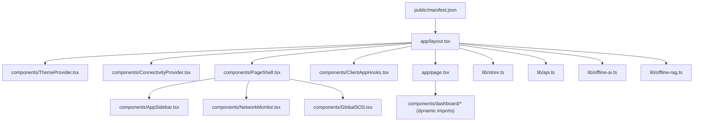
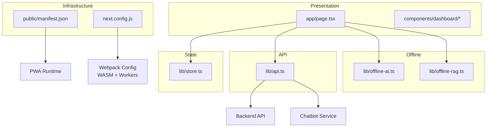
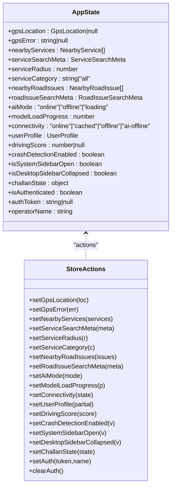
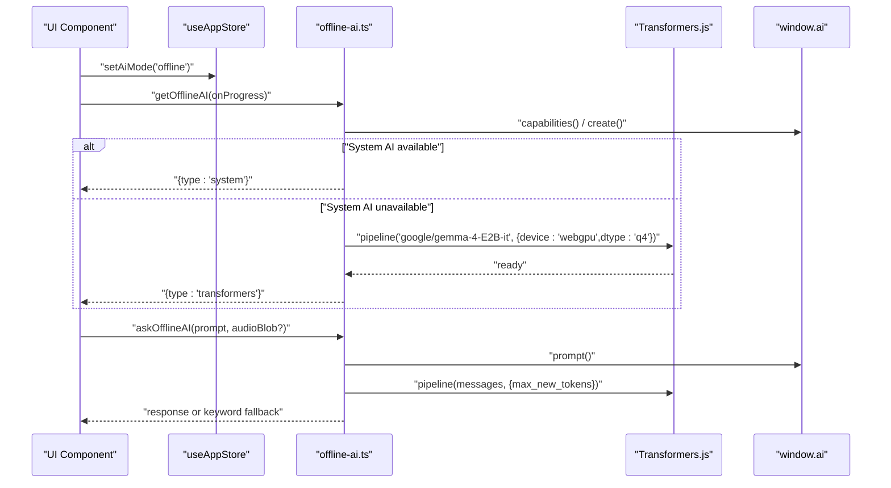
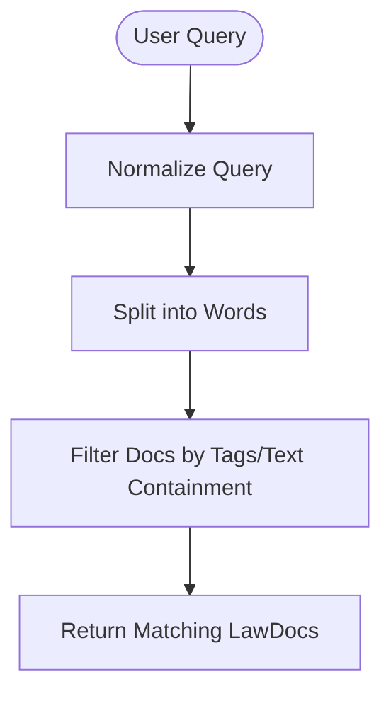
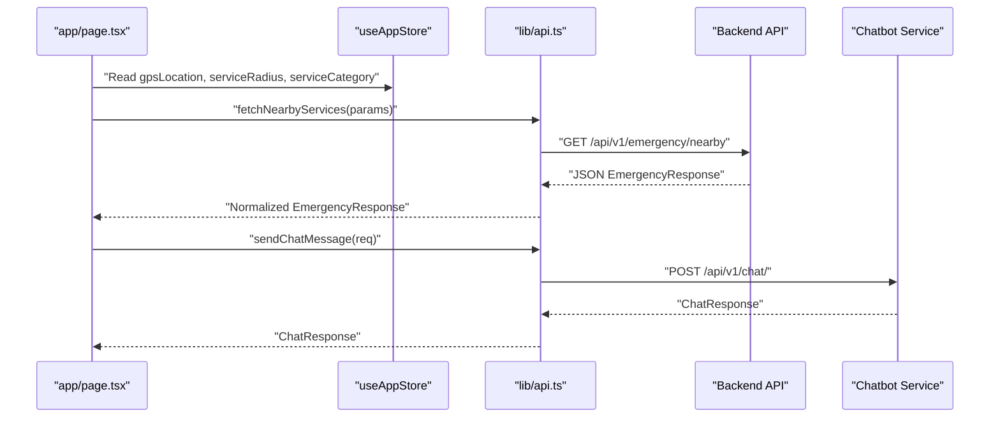
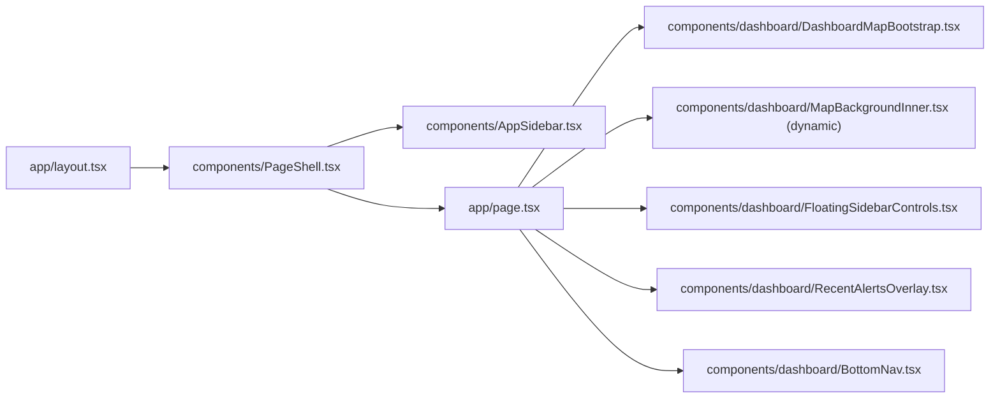
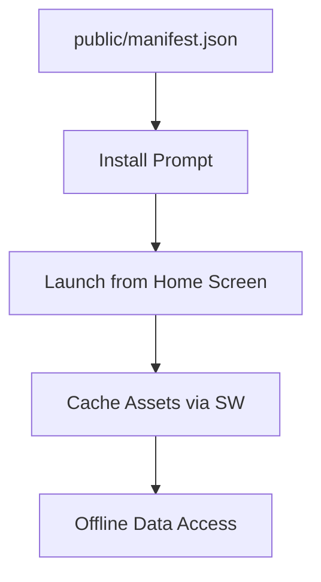
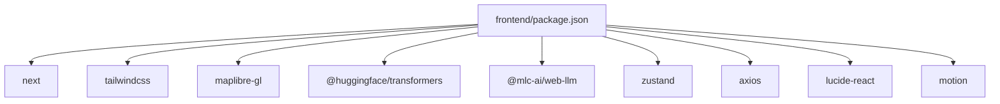

# Frontend Application

<cite>
**Referenced Files in This Document**
- [package.json](https://github.com/SafeVixAI/SafeVixAI/blob/main/frontend/package.json)
- [next.config.js](https://github.com/SafeVixAI/SafeVixAI/blob/main/frontend/next.config.js)
- [manifest.json](https://github.com/SafeVixAI/SafeVixAI/blob/main/frontend/public/manifest.json)
- [layout.tsx](https://github.com/SafeVixAI/SafeVixAI/blob/main/frontend/app/layout.tsx)
- [store.ts](https://github.com/SafeVixAI/SafeVixAI/blob/main/frontend/lib/store.ts)
- [ConnectivityProvider.tsx](https://github.com/SafeVixAI/SafeVixAI/blob/main/frontend/components/ConnectivityProvider.tsx)
- [ThemeProvider.tsx](https://github.com/SafeVixAI/SafeVixAI/blob/main/frontend/components/ThemeProvider.tsx)
- [offline-ai.ts](https://github.com/SafeVixAI/SafeVixAI/blob/main/frontend/lib/offline-ai.ts)
- [offline-rag.ts](https://github.com/SafeVixAI/SafeVixAI/blob/main/frontend/lib/offline-rag.ts)
- [api.ts](https://github.com/SafeVixAI/SafeVixAI/blob/main/frontend/lib/api.ts)
- [page.tsx](https://github.com/SafeVixAI/SafeVixAI/blob/main/frontend/app/page.tsx)
- [ClientAppHooks.tsx](https://github.com/SafeVixAI/SafeVixAI/blob/main/frontend/components/ClientAppHooks.tsx)
- [PageShell.tsx](https://github.com/SafeVixAI/SafeVixAI/blob/main/frontend/components/PageShell.tsx)
- [utils.ts](https://github.com/SafeVixAI/SafeVixAI/blob/main/frontend/lib/utils.ts)
- [map-defaults.ts](https://github.com/SafeVixAI/SafeVixAI/blob/main/frontend/lib/map-defaults.ts)
</cite>

## Table of Contents
1. [Introduction](#introduction)
2. [Project Structure](#project-structure)
3. [Core Components](#core-components)
4. [Architecture Overview](#architecture-overview)
5. [Detailed Component Analysis](#detailed-component-analysis)
6. [Dependency Analysis](#dependency-analysis)
7. [Performance Considerations](#performance-considerations)
8. [Troubleshooting Guide](#troubleshooting-guide)
9. [Conclusion](#conclusion)
10. [Appendices](#appendices)

## Introduction
This document describes the Next.js PWA frontend application for SafeVixAI, focusing on component hierarchy, state management with React hooks, and offline-first architecture. It documents Progressive Web App features (service workers, manifest configuration), offline data caching, component composition, routing patterns, backend API integration, responsive design and accessibility, mobile optimization, Tailwind-based animations/transitions, cross-browser compatibility, performance optimization, and WebAssembly integration for offline AI models.

## Project Structure
The frontend is organized as a Next.js 15 app under the frontend directory. Key areas:
- app/: Next.js App Router pages and shared layout
- components/: reusable UI and providers
- lib/: utilities, stores, offline logic, and API clients
- public/: static assets including manifest.json and icons
- Tailwind CSS, PostCSS, and TypeScript configurations enable responsive, theme-aware UI

**Diagram sources**
- [layout.tsx:1-86](https://github.com/SafeVixAI/SafeVixAI/blob/main/frontend/app/layout.tsx#L1-L86)
- [ThemeProvider.tsx:1-63](https://github.com/SafeVixAI/SafeVixAI/blob/main/frontend/components/ThemeProvider.tsx#L1-L63)
- [ConnectivityProvider.tsx:1-27](https://github.com/SafeVixAI/SafeVixAI/blob/main/frontend/components/ConnectivityProvider.tsx#L1-L27)
- [PageShell.tsx:1-36](https://github.com/SafeVixAI/SafeVixAI/blob/main/frontend/components/PageShell.tsx#L1-L36)
- [ClientAppHooks.tsx:1-38](https://github.com/SafeVixAI/SafeVixAI/blob/main/frontend/components/ClientAppHooks.tsx#L1-L38)
- [page.tsx:1-229](https://github.com/SafeVixAI/SafeVixAI/blob/main/frontend/app/page.tsx#L1-L229)
- [store.ts:1-226](https://github.com/SafeVixAI/SafeVixAI/blob/main/frontend/lib/store.ts#L1-L226)
- [api.ts:1-821](https://github.com/SafeVixAI/SafeVixAI/blob/main/frontend/lib/api.ts#L1-L821)
- [offline-ai.ts:1-256](https://github.com/SafeVixAI/SafeVixAI/blob/main/frontend/lib/offline-ai.ts#L1-L256)
- [offline-rag.ts:1-35](https://github.com/SafeVixAI/SafeVixAI/blob/main/frontend/lib/offline-rag.ts#L1-L35)
- [manifest.json:1-68](https://github.com/SafeVixAI/SafeVixAI/blob/main/frontend/public/manifest.json#L1-L68)

**Section sources**
- [layout.tsx:1-86](https://github.com/SafeVixAI/SafeVixAI/blob/main/frontend/app/layout.tsx#L1-L86)
- [package.json:1-85](https://github.com/SafeVixAI/SafeVixAI/blob/main/frontend/package.json#L1-L85)

## Core Components
- Layout and Providers
  - Root layout sets metadata, viewport, manifest, Apple Web App settings, and composes providers and shell.
  - ThemeProvider manages theme state and applies resolved theme to the document element.
  - ConnectivityProvider listens to online/offline events and updates global connectivity state.
  - PageShell wraps main content, renders sidebar and network monitor, and handles desktop sidebar collapse state.
  - ClientAppHooks initializes offline SOS sync listeners and crash detection.

- State Management
  - Zustand store encapsulates GPS location, nearby services and road issues, AI mode and model load progress, connectivity, user profile, UI toggles, challan calculator state, and auth state. Persistence is selectively applied to user preferences and profile.

- Offline AI and RAG
  - offline-ai.ts orchestrates system AI (Chrome built-in), Transformers.js Gemma 4 E2B with WebGPU/WASM, and keyword fallback. It exposes initialization, querying, status checks, and readiness helpers.
  - offline-rag.ts simulates local law citations retrieval using a keyword-indexed dataset.

- API Layer
  - api.ts defines typed requests for emergency services, geocoding, road issues, routing, and chatbot integration. It injects JWT from persisted store and configures timeouts.

- Dashboard and Pages
  - page.tsx renders the main dashboard with dynamic map bootstrapping, area intelligence cards, stats, recent hazards, and collapsible desktop panel. It integrates with the store and Tailwind classes for responsive design.

**Section sources**
- [layout.tsx:1-86](https://github.com/SafeVixAI/SafeVixAI/blob/main/frontend/app/layout.tsx#L1-L86)
- [ThemeProvider.tsx:1-63](https://github.com/SafeVixAI/SafeVixAI/blob/main/frontend/components/ThemeProvider.tsx#L1-L63)
- [ConnectivityProvider.tsx:1-27](https://github.com/SafeVixAI/SafeVixAI/blob/main/frontend/components/ConnectivityProvider.tsx#L1-L27)
- [PageShell.tsx:1-36](https://github.com/SafeVixAI/SafeVixAI/blob/main/frontend/components/PageShell.tsx#L1-L36)
- [ClientAppHooks.tsx:1-38](https://github.com/SafeVixAI/SafeVixAI/blob/main/frontend/components/ClientAppHooks.tsx#L1-L38)
- [store.ts:1-226](https://github.com/SafeVixAI/SafeVixAI/blob/main/frontend/lib/store.ts#L1-L226)
- [offline-ai.ts:1-256](https://github.com/SafeVixAI/SafeVixAI/blob/main/frontend/lib/offline-ai.ts#L1-L256)
- [offline-rag.ts:1-35](https://github.com/SafeVixAI/SafeVixAI/blob/main/frontend/lib/offline-rag.ts#L1-L35)
- [api.ts:1-821](https://github.com/SafeVixAI/SafeVixAI/blob/main/frontend/lib/api.ts#L1-L821)
- [page.tsx:1-229](https://github.com/SafeVixAI/SafeVixAI/blob/main/frontend/app/page.tsx#L1-L229)

## Architecture Overview
The frontend follows a layered architecture:
- Presentation Layer: Next.js App Router pages and components
- State Layer: Zustand store for global state and persistence
- Offline Layer: Transformers.js and system AI for offline AI, local RAG simulation
- API Layer: Axios clients for backend and chatbot services
- Infrastructure Layer: Manifest, Webpack config for WASM/Web Workers, and dynamic imports for map

**Diagram sources**
- [page.tsx:1-229](https://github.com/SafeVixAI/SafeVixAI/blob/main/frontend/app/page.tsx#L1-L229)
- [store.ts:1-226](https://github.com/SafeVixAI/SafeVixAI/blob/main/frontend/lib/store.ts#L1-L226)
- [offline-ai.ts:1-256](https://github.com/SafeVixAI/SafeVixAI/blob/main/frontend/lib/offline-ai.ts#L1-L256)
- [offline-rag.ts:1-35](https://github.com/SafeVixAI/SafeVixAI/blob/main/frontend/lib/offline-rag.ts#L1-L35)
- [api.ts:1-821](https://github.com/SafeVixAI/SafeVixAI/blob/main/frontend/lib/api.ts#L1-L821)
- [manifest.json:1-68](https://github.com/SafeVixAI/SafeVixAI/blob/main/frontend/public/manifest.json#L1-L68)
- [next.config.js:1-44](https://github.com/SafeVixAI/SafeVixAI/blob/main/frontend/next.config.js#L1-L44)

## Detailed Component Analysis

### State Management with Zustand
The store defines:
- GPS and errors
- Nearby services and road issues with metadata
- AI mode and model load progress
- Connectivity state
- User profile and preferences
- UI toggles (sidebar open/collapsed)
- Challan calculator state
- Authentication state

Persistence is configured to persist only a subset of state (profile, preferences, auth) to localStorage via zustand/persist.

**Diagram sources**
- [store.ts:63-226](https://github.com/SafeVixAI/SafeVixAI/blob/main/frontend/lib/store.ts#L63-L226)

**Section sources**
- [store.ts:1-226](https://github.com/SafeVixAI/SafeVixAI/blob/main/frontend/lib/store.ts#L1-L226)

### Offline AI Engine
The offline AI engine supports three tiers:
1. System AI (Chrome built-in) — zero download, instant
2. Transformers.js Gemma 4 E2B — WebGPU acceleration with WASM fallback, cached via browser cache
3. Keyword fallback — deterministic responses using cached data

**Diagram sources**
- [offline-ai.ts:114-221](https://github.com/SafeVixAI/SafeVixAI/blob/main/frontend/lib/offline-ai.ts#L114-L221)
- [store.ts:84-88](https://github.com/SafeVixAI/SafeVixAI/blob/main/frontend/lib/store.ts#L84-L88)

**Section sources**
- [offline-ai.ts:1-256](https://github.com/SafeVixAI/SafeVixAI/blob/main/frontend/lib/offline-ai.ts#L1-L256)
- [next.config.js:23-36](https://github.com/SafeVixAI/SafeVixAI/blob/main/frontend/next.config.js#L23-L36)

### Offline RAG Simulation
The local RAG retrieves MV Act citations by keyword matching against a small dataset. In production, HNSWlib-wasm would replace this for semantic similarity.

**Diagram sources**
- [offline-rag.ts:22-34](https://github.com/SafeVixAI/SafeVixAI/blob/main/frontend/lib/offline-rag.ts#L22-L34)

**Section sources**
- [offline-rag.ts:1-35](https://github.com/SafeVixAI/SafeVixAI/blob/main/frontend/lib/offline-rag.ts#L1-L35)

### API Integration Patterns
The API client:
- Uses axios with base URLs for backend and chatbot services
- Injects Authorization header from persisted store
- Normalizes backend responses into typed models
- Exposes functions for emergency services, geocoding, road issues, routing, and chat

**Diagram sources**
- [page.tsx:31-37](https://github.com/SafeVixAI/SafeVixAI/blob/main/frontend/app/page.tsx#L31-L37)
- [api.ts:624-800](https://github.com/SafeVixAI/SafeVixAI/blob/main/frontend/lib/api.ts#L624-L800)

**Section sources**
- [api.ts:1-821](https://github.com/SafeVixAI/SafeVixAI/blob/main/frontend/lib/api.ts#L1-L821)

### Dashboard Composition and Routing
- The root page uses dynamic imports for map components to avoid SSR and improve hydration performance.
- The page composes dashboard components, reads from the store, and renders area intelligence cards, stats, and hazards.
- Routing is handled by Next.js App Router pages under app/.

**Diagram sources**
- [layout.tsx:38-84](https://github.com/SafeVixAI/SafeVixAI/blob/main/frontend/app/layout.tsx#L38-L84)
- [page.tsx:17-27](https://github.com/SafeVixAI/SafeVixAI/blob/main/frontend/app/page.tsx#L17-L27)
- [PageShell.tsx:13-35](https://github.com/SafeVixAI/SafeVixAI/blob/main/frontend/components/PageShell.tsx#L13-L35)

**Section sources**
- [page.tsx:1-229](https://github.com/SafeVixAI/SafeVixAI/blob/main/frontend/app/page.tsx#L1-L229)
- [layout.tsx:1-86](https://github.com/SafeVixAI/SafeVixAI/blob/main/frontend/app/layout.tsx#L1-L86)

### Progressive Web App Features
- Manifest: Defines app identity, display mode, orientation, theme/background colors, icons, shortcuts, screenshots, and categories.
- Webpack config: Enables asyncWebAssembly and worker-loader for Transformers.js and WebGPU acceleration.
- Service Worker: Not shown in the provided files; however, the manifest and Next.js build configuration support PWA installation and offline capabilities.

**Diagram sources**
- [manifest.json:1-68](https://github.com/SafeVixAI/SafeVixAI/blob/main/frontend/public/manifest.json#L1-L68)
- [next.config.js:19-39](https://github.com/SafeVixAI/SafeVixAI/blob/main/frontend/next.config.js#L19-L39)

**Section sources**
- [manifest.json:1-68](https://github.com/SafeVixAI/SafeVixAI/blob/main/frontend/public/manifest.json#L1-L68)
- [next.config.js:1-44](https://github.com/SafeVixAI/SafeVixAI/blob/main/frontend/next.config.js#L1-L44)

### Responsive Design, Accessibility, and Mobile Optimization
- Tailwind utilities and responsive breakpoints are used extensively in the dashboard and components.
- Accessibility: skip link for keyboard navigation, semantic markup, and focus-visible patterns.
- Mobile-first design with bottom navigation, collapsible desktop panels, and touch-friendly controls.
- Theme switching and system preference handling for optimal viewing across devices.

**Section sources**
- [page.tsx:77-229](https://github.com/SafeVixAI/SafeVixAI/blob/main/frontend/app/page.tsx#L77-L229)
- [PageShell.tsx:18-32](https://github.com/SafeVixAI/SafeVixAI/blob/main/frontend/components/PageShell.tsx#L18-L32)
- [ThemeProvider.tsx:23-48](https://github.com/SafeVixAI/SafeVixAI/blob/main/frontend/components/ThemeProvider.tsx#L23-L48)

### Animations and Transitions with Tailwind
- Pulse and opacity transitions are used for connectivity indicators and interactive states.
- Collapsible desktop panel with smooth width transitions.
- Loading spinners and animated indicators for async operations.

**Section sources**
- [page.tsx:112-119](https://github.com/SafeVixAI/SafeVixAI/blob/main/frontend/app/page.tsx#L112-L119)
- [page.tsx:94-100](https://github.com/SafeVixAI/SafeVixAI/blob/main/frontend/app/page.tsx#L94-L100)
- [page.tsx:23-26](https://github.com/SafeVixAI/SafeVixAI/blob/main/frontend/app/page.tsx#L23-L26)

## Dependency Analysis
Key runtime dependencies include:
- UI and styling: lucide-react, tailwind-merge, class-variance-authority, next-themes
- Maps: maplibre-gl, dynamic map components
- AI and ML: @huggingface/transformers, @mlc-ai/web-llm, hnswlib-wasm
- State and caching: zustand, idb
- Networking: axios, socket.io-client
- Utilities: fast-deep-equal, geokdbush, @turf/turf
- Motion and animations: motion, tw-animate-css

Build-time dependencies include Next.js, PostCSS, Tailwind CSS, and Jest/Vitest for testing.

**Diagram sources**
- [package.json:14-52](https://github.com/SafeVixAI/SafeVixAI/blob/main/frontend/package.json#L14-L52)

**Section sources**
- [package.json:1-85](https://github.com/SafeVixAI/SafeVixAI/blob/main/frontend/package.json#L1-L85)

## Performance Considerations
- Dynamic imports for heavy map components reduce initial bundle size.
- Webpack config enables asyncWebAssembly and worker-loader for AI model loading.
- Tailwind utilities minimize CSS overhead; use only required classes.
- Persist selective state to localStorage to avoid bloating IndexedDB.
- Use SWR or similar for efficient data fetching and caching.
- Prefer GPU acceleration (WebGPU) for AI inference when available; fallback to WASM is supported.

[No sources needed since this section provides general guidance]

## Troubleshooting Guide
- Offline AI not loading
  - Verify asyncWebAssembly is enabled and worker-loader is configured.
  - Check browser support for WebGPU; fallback to WASM should occur automatically.
  - Confirm model cache storage is permitted by the browser.

- Connectivity state not updating
  - Ensure ConnectivityProvider is mounted in the root layout and event listeners are attached.

- API requests failing
  - Confirm NEXT_PUBLIC_API_URL and NEXT_PUBLIC_CHATBOT_URL are set.
  - Verify Authorization header injection from persisted store.

- Map not rendering
  - Confirm dynamic import is used for map components and SSR is disabled for them.

**Section sources**
- [next.config.js:23-36](https://github.com/SafeVixAI/SafeVixAI/blob/main/frontend/next.config.js#L23-L36)
- [ConnectivityProvider.tsx:9-23](https://github.com/SafeVixAI/SafeVixAI/blob/main/frontend/components/ConnectivityProvider.tsx#L9-L23)
- [api.ts:4-12](https://github.com/SafeVixAI/SafeVixAI/blob/main/frontend/lib/api.ts#L4-L12)
- [page.tsx:17-27](https://github.com/SafeVixAI/SafeVixAI/blob/main/frontend/app/page.tsx#L17-L27)

## Conclusion

> **Enterprise Hardening Notes:**
> - `app/error.tsx` Error Boundary added for graceful crash recovery
> - `EnterpriseClientAppHooks.tsx` added for production monitoring hooks
> - PWA manifest includes `shortcuts` (4 app shortcuts) and `share_target` for Web Share API
> - 45 React components across the component library
> - 16 page routes with full Next.js App Router

The SafeVixAI frontend leverages Next.js App Router, Zustand for state, and a robust offline-first AI stack with Transformers.js and system AI fallbacks. It integrates with backend APIs, supports PWA installation, and emphasizes responsive design, accessibility, and performance. The modular component architecture and typed API clients facilitate maintainability and scalability.

[No sources needed since this section summarizes without analyzing specific files]

## Appendices

### Component States Reference
- GPS: lat, lon, accuracy, timestamp, city, state, displayName
- Services: id, name, category, lat, lon, distance, phone, address, source
- Road Issues: uuid, issueType, severity, lat, lon, distance, status, description, authorityName, roadName, roadType, createdAt
- Search Meta: count, radiusUsed, requestedRadius, source
- User Profile: bloodGroup, vehicleNumber, emergencyContact, name
- UI: isSystemSidebarOpen, isDesktopSidebarCollapsed
- Auth: isAuthenticated, authToken, operatorName

**Section sources**
- [store.ts:4-58](https://github.com/SafeVixAI/SafeVixAI/blob/main/frontend/lib/store.ts#L4-L58)

### Tailwind Utilities and Helpers
- Utility merging: cn(...) from clsx and tailwind-merge
- Map defaults: fallback center and zoom levels configurable via environment variables

**Section sources**
- [utils.ts:1-7](https://github.com/SafeVixAI/SafeVixAI/blob/main/frontend/lib/utils.ts#L1-L7)
- [map-defaults.ts:1-8](https://github.com/SafeVixAI/SafeVixAI/blob/main/frontend/lib/map-defaults.ts#L1-L8)