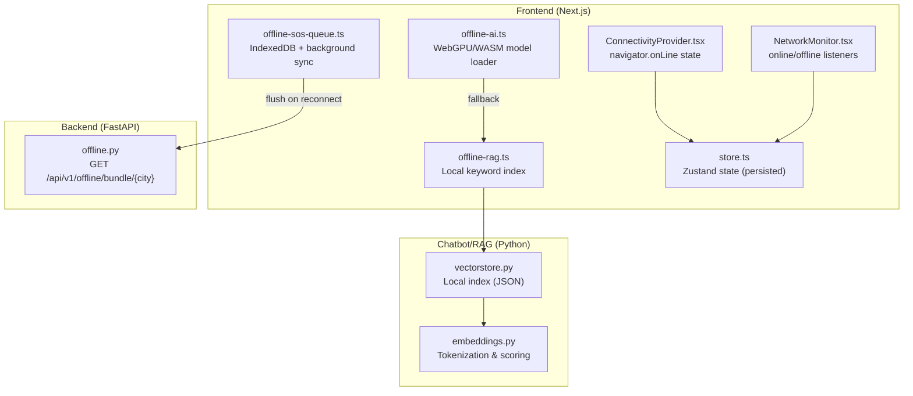
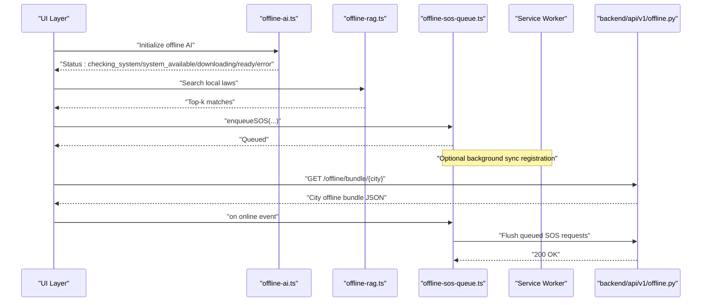
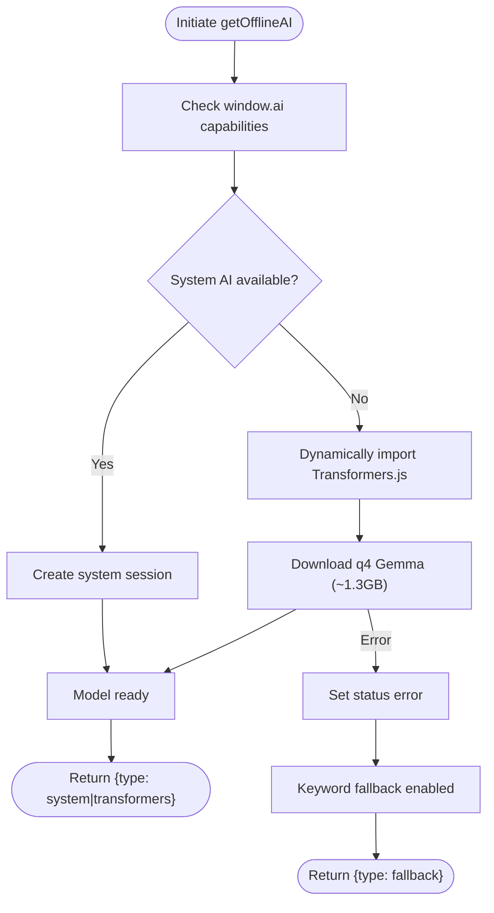
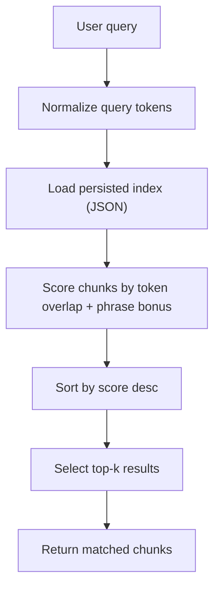
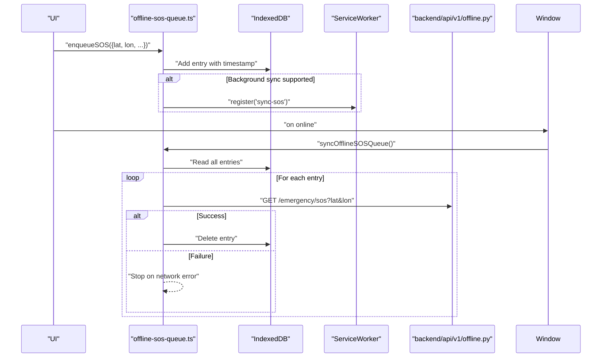
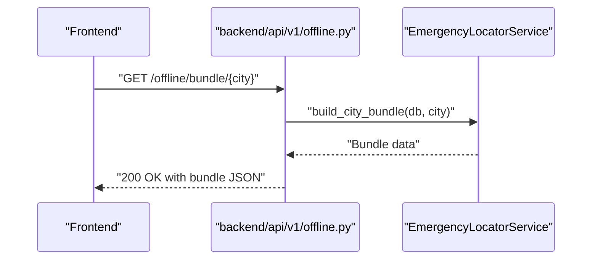
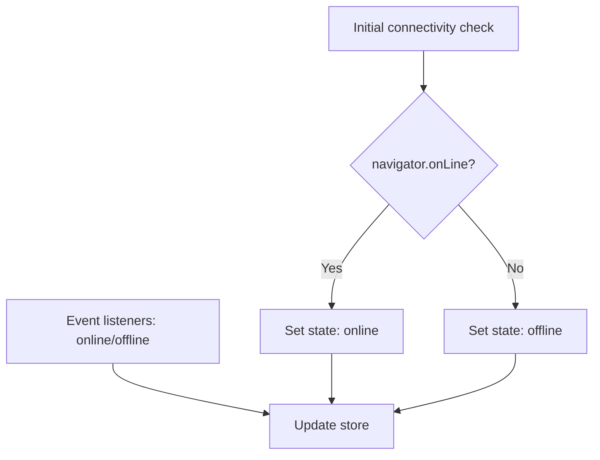
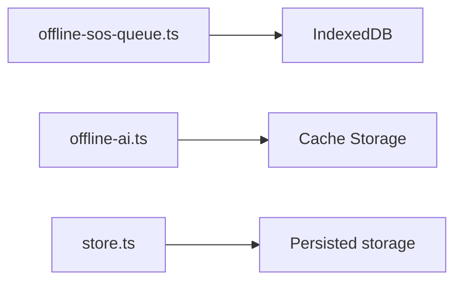
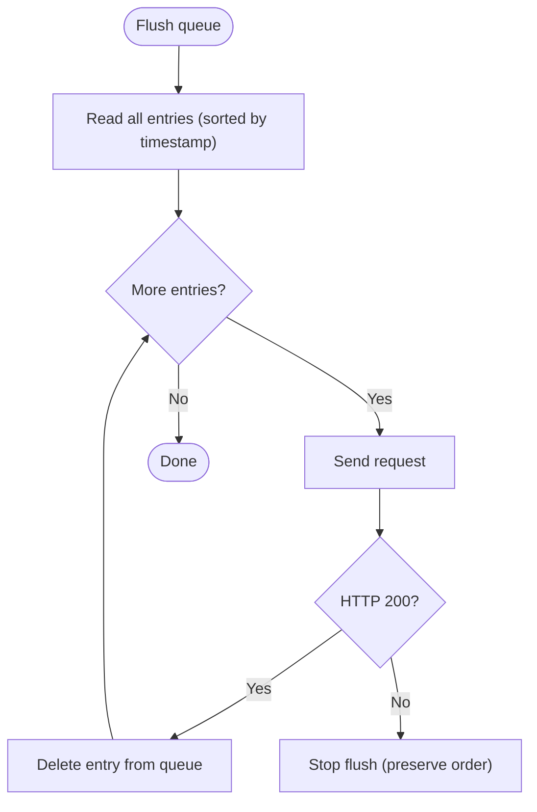
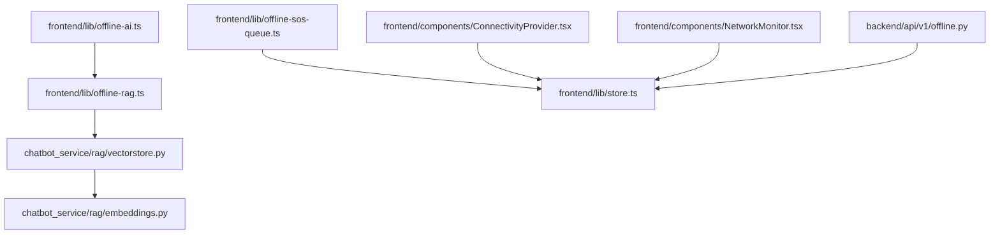

# Offline Capabilities

<cite>
**Referenced Files in This Document**
- [Offline_Architecture.md](file://docs/Offline_Architecture.md)
- [offline-ai.ts](file://frontend/lib/offline-ai.ts)
- [offline-rag.ts](file://frontend/lib/offline-rag.ts)
- [offline-sos-queue.ts](file://frontend/lib/offline-sos-queue.ts)
- [offline.py](file://backend/api/v1/offline.py)
- [ConnectivityProvider.tsx](file://frontend/components/ConnectivityProvider.tsx)
- [NetworkMonitor.tsx](file://frontend/components/NetworkMonitor.tsx)
- [store.ts](file://frontend/lib/store.ts)
- [vectorstore.py](file://chatbot_service/rag/vectorstore.py)
- [embeddings.py](file://chatbot_service/rag/embeddings.py)
- [state_overrides.csv](file://frontend/public/offline-data/state_overrides.csv)
- [violations.csv](file://frontend/public/offline-data/violations.csv)
- [first-aid.json](file://frontend/public/offline-data/first-aid.json)
</cite>

## Table of Contents
1. [Introduction](#introduction)
2. [Project Structure](#project-structure)
3. [Core Components](#core-components)
4. [Architecture Overview](#architecture-overview)
5. [Detailed Component Analysis](#detailed-component-analysis)
6. [Dependency Analysis](#dependency-analysis)
7. [Performance Considerations](#performance-considerations)
8. [Troubleshooting Guide](#troubleshooting-guide)
9. [Conclusion](#conclusion)
10. [Appendices](#appendices)

## Introduction
This document explains the offline-first architecture of SafeVixAI, focusing on offline AI model loading with WebAssembly and browser acceleration, vector store caching strategies, local data synchronization, SOS queue management for emergency reporting, offline data bundling for 25 major Indian cities, and fallback mechanisms for degraded networks. It also covers offline mode detection, data persistence patterns, conflict resolution strategies, performance optimizations, compression techniques, and user experience considerations tailored for offline scenarios.

## Project Structure
The offline capabilities span three layers:
- Frontend (Next.js): offline AI engine, offline RAG simulation, IndexedDB-based SOS queue, connectivity detection, and persistent app state.
- Backend (FastAPI): offline bundle endpoint for city-specific data and future offline sync enhancements.
- Chatbot/RAG (Python): local vector store and embeddings used for offline retrieval.

**Diagram sources**
- [offline-ai.ts:1-256](file://frontend/lib/offline-ai.ts#L1-L256)
- [offline-rag.ts:1-35](file://frontend/lib/offline-rag.ts#L1-L35)
- [offline-sos-queue.ts:1-138](file://frontend/lib/offline-sos-queue.ts#L1-L138)
- [ConnectivityProvider.tsx:1-27](file://frontend/components/ConnectivityProvider.tsx#L1-L27)
- [NetworkMonitor.tsx:1-35](file://frontend/components/NetworkMonitor.tsx#L1-L35)
- [store.ts:1-226](file://frontend/lib/store.ts#L1-L226)
- [offline.py:1-28](file://backend/api/v1/offline.py#L1-L28)
- [vectorstore.py:1-110](file://chatbot_service/rag/vectorstore.py#L1-L110)
- [embeddings.py:1-31](file://chatbot_service/rag/embeddings.py#L1-L31)

**Section sources**
- [offline-ai.ts:1-256](file://frontend/lib/offline-ai.ts#L1-L256)
- [offline-rag.ts:1-35](file://frontend/lib/offline-rag.ts#L1-L35)
- [offline-sos-queue.ts:1-138](file://frontend/lib/offline-sos-queue.ts#L1-L138)
- [offline.py:1-28](file://backend/api/v1/offline.py#L1-L28)
- [vectorstore.py:1-110](file://chatbot_service/rag/vectorstore.py#L1-L110)
- [embeddings.py:1-31](file://chatbot_service/rag/embeddings.py#L1-L31)
- [ConnectivityProvider.tsx:1-27](file://frontend/components/ConnectivityProvider.tsx#L1-L27)
- [NetworkMonitor.tsx:1-35](file://frontend/components/NetworkMonitor.tsx#L1-L35)
- [store.ts:1-226](file://frontend/lib/store.ts#L1-L226)

## Core Components
- Offline AI engine: Detects and uses the system AI (Chrome window.ai) when available, otherwise loads a quantized Gemma model via Transformers.js with WebGPU acceleration and WASM fallback. Includes a keyword fallback for deterministic responses.
- Offline RAG: Simulates vector similarity search using a local keyword index and simple token overlap scoring; production uses HNSWlib-wasm for true similarity.
- IndexedDB-based SOS queue: Persists emergency reports offline and attempts to flush them upon reconnect, optionally leveraging background sync.
- Offline data bundles: City-specific offline data served via backend endpoint for 25 major Indian cities.
- Connectivity detection: React providers and listeners that track online/offline state and propagate it to the app store.
- Persistent app state: Zustand store with selective persistence for user preferences and offline-related flags.

**Section sources**
- [offline-ai.ts:1-256](file://frontend/lib/offline-ai.ts#L1-L256)
- [offline-rag.ts:1-35](file://frontend/lib/offline-rag.ts#L1-L35)
- [offline-sos-queue.ts:1-138](file://frontend/lib/offline-sos-queue.ts#L1-L138)
- [offline.py:1-28](file://backend/api/v1/offline.py#L1-L28)
- [ConnectivityProvider.tsx:1-27](file://frontend/components/ConnectivityProvider.tsx#L1-L27)
- [NetworkMonitor.tsx:1-35](file://frontend/components/NetworkMonitor.tsx#L1-L35)
- [store.ts:1-226](file://frontend/lib/store.ts#L1-L226)

## Architecture Overview
The offline-first architecture combines:
- Model availability detection and fallback to a quantized model with caching.
- Local vector indexing and keyword-based retrieval for legal and first-aid data.
- IndexedDB-backed queueing for emergency reports with automatic flush on connectivity restoration.
- Backend endpoint to serve city-specific offline bundles.
- Connectivity state propagation to inform UI and data-fetching strategies.

**Diagram sources**
- [offline-ai.ts:114-154](file://frontend/lib/offline-ai.ts#L114-L154)
- [offline-rag.ts:22-34](file://frontend/lib/offline-rag.ts#L22-L34)
- [offline-sos-queue.ts:48-69](file://frontend/lib/offline-sos-queue.ts#L48-L69)
- [offline-sos-queue.ts:75-124](file://frontend/lib/offline-sos-queue.ts#L75-L124)
- [offline.py:18-27](file://backend/api/v1/offline.py#L18-L27)

## Detailed Component Analysis

### Offline AI Engine (WebAssembly and Fallback)
The offline AI engine prioritizes:
- System AI (window.ai) for zero-download, instant responses on supported platforms.
- Transformers.js with a quantized Gemma model (q4) using WebGPU acceleration and WASM fallback.
- Keyword fallback for deterministic answers when model loading fails.

Key behaviors:
- Status transitions: idle → checking_system → system_available → downloading → ready → error.
- Progress callbacks report percentage and byte counts.
- Audio prompts supported when audioBlob is provided.
- Graceful degradation to keyword fallback.

**Diagram sources**
- [offline-ai.ts:47-67](file://frontend/lib/offline-ai.ts#L47-L67)
- [offline-ai.ts:71-110](file://frontend/lib/offline-ai.ts#L71-L110)
- [offline-ai.ts:124-154](file://frontend/lib/offline-ai.ts#L124-L154)
- [offline-ai.ts:225-255](file://frontend/lib/offline-ai.ts#L225-L255)

**Section sources**
- [offline-ai.ts:1-256](file://frontend/lib/offline-ai.ts#L1-L256)

### Offline RAG and Vector Store
The frontend provides a lightweight local RAG simulation:
- Maintains a small local law database with tags and searchable text.
- Performs keyword matching and simple token overlap scoring.
- Simulates latency to mimic real vector search.

Production-grade vector store:
- Stores indexed chunks as JSON for portability.
- Builds index from documents and persists to disk.
- Uses tokenization and scoring to rank matches.

**Diagram sources**
- [offline-rag.ts:22-34](file://frontend/lib/offline-rag.ts#L22-L34)
- [vectorstore.py:27-49](file://chatbot_service/rag/vectorstore.py#L27-L49)
- [embeddings.py:17-30](file://chatbot_service/rag/embeddings.py#L17-L30)

**Section sources**
- [offline-rag.ts:1-35](file://frontend/lib/offline-rag.ts#L1-L35)
- [vectorstore.py:1-110](file://chatbot_service/rag/vectorstore.py#L1-L110)
- [embeddings.py:1-31](file://chatbot_service/rag/embeddings.py#L1-L31)

### SOS Queue Management (Emergency Reporting)
The SOS queue persists emergency reports while offline and flushes them when connectivity is restored:
- IndexedDB store with timestamped entries.
- Optional background sync registration via ServiceWorker.
- Iterative flush with per-item error handling and early exit on network failure.
- Automatic flush triggered by online event listener.

**Diagram sources**
- [offline-sos-queue.ts:48-69](file://frontend/lib/offline-sos-queue.ts#L48-L69)
- [offline-sos-queue.ts:75-124](file://frontend/lib/offline-sos-queue.ts#L75-L124)
- [offline.py:18-27](file://backend/api/v1/offline.py#L18-L27)

**Section sources**
- [offline-sos-queue.ts:1-138](file://frontend/lib/offline-sos-queue.ts#L1-L138)

### Offline Data Bundling for 25 Major Indian Cities
The backend exposes an endpoint to serve city-specific offline bundles:
- Endpoint: GET /api/v1/offline/bundle/{city}
- Returns a structured bundle for the requested city, enabling offline navigation, services, and emergency data.

**Diagram sources**
- [offline.py:18-27](file://backend/api/v1/offline.py#L18-L27)

**Section sources**
- [offline.py:1-28](file://backend/api/v1/offline.py#L1-L28)

### Connectivity Detection and State Propagation
Two complementary approaches detect connectivity:
- Provider component sets and updates connectivity state on online/offline events.
- Dedicated monitor component initializes state and listens for changes.

The app store holds a ConnectivityState that informs UI and data-fetching logic.

**Diagram sources**
- [ConnectivityProvider.tsx:9-23](file://frontend/components/ConnectivityProvider.tsx#L9-L23)
- [NetworkMonitor.tsx:9-31](file://frontend/components/NetworkMonitor.tsx#L9-L31)
- [store.ts:60-92](file://frontend/lib/store.ts#L60-L92)

**Section sources**
- [ConnectivityProvider.tsx:1-27](file://frontend/components/ConnectivityProvider.tsx#L1-L27)
- [NetworkMonitor.tsx:1-35](file://frontend/components/NetworkMonitor.tsx#L1-L35)
- [store.ts:1-226](file://frontend/lib/store.ts#L1-L226)

### Local Data Persistence Patterns
- IndexedDB: Used for SOS queue persistence with timestamped entries and optional background sync.
- Browser cache: Transformers.js model stored in Cache Storage to survive page refresh.
- Zustand with persistence: Selected app state (user profile, preferences, connectivity) persisted to storage.

**Diagram sources**
- [offline-sos-queue.ts:25-42](file://frontend/lib/offline-sos-queue.ts#L25-L42)
- [offline-ai.ts:77-85](file://frontend/lib/offline-ai.ts#L77-L85)
- [store.ts:211-224](file://frontend/lib/store.ts#L211-L224)

**Section sources**
- [offline-sos-queue.ts:1-138](file://frontend/lib/offline-sos-queue.ts#L1-L138)
- [offline-ai.ts:1-256](file://frontend/lib/offline-ai.ts#L1-L256)
- [store.ts:1-226](file://frontend/lib/store.ts#L1-L226)

### Conflict Resolution Strategies
- IndexedDB queue ordering by timestamp ensures FIFO flushing.
- Per-item HTTP response handling: successful entries are removed; failures halt further flush to preserve ordering and avoid duplicates.
- Future enhancement: replace REST flush with Supabase Realtime/Postgres logical replication for out-of-the-box conflict resolution.

**Diagram sources**
- [offline-sos-queue.ts:75-124](file://frontend/lib/offline-sos-queue.ts#L75-L124)

**Section sources**
- [offline-sos-queue.ts:1-138](file://frontend/lib/offline-sos-queue.ts#L1-L138)
- [Offline_Architecture.md:20-23](file://docs/Offline_Architecture.md#L20-L23)

### Fallback Mechanisms for Degradated Networks
- Model fallback: System AI → Transformers.js → Keyword fallback.
- Retrieval fallback: Local keyword index → Embedding scoring → Top-k selection.
- Queue fallback: IndexedDB persistence with background sync registration; manual retry on error.

**Section sources**
- [offline-ai.ts:114-154](file://frontend/lib/offline-ai.ts#L114-L154)
- [offline-rag.ts:22-34](file://frontend/lib/offline-rag.ts#L22-L34)
- [offline-sos-queue.ts:60-68](file://frontend/lib/offline-sos-queue.ts#L60-L68)

### Practical Examples
- Offline mode detection: Subscribe to online/offline events and update store; use ConnectivityState to gate network-dependent features.
- Data persistence: Persist user profile and preferences; queue SOS events; cache model assets.
- Conflict resolution: On flush failure, stop and retry later; rely on timestamp ordering to maintain order.

**Section sources**
- [ConnectivityProvider.tsx:1-27](file://frontend/components/ConnectivityProvider.tsx#L1-L27)
- [NetworkMonitor.tsx:1-35](file://frontend/components/NetworkMonitor.tsx#L1-L35)
- [store.ts:211-224](file://frontend/lib/store.ts#L211-L224)
- [offline-sos-queue.ts:75-124](file://frontend/lib/offline-sos-queue.ts#L75-L124)

## Dependency Analysis
- Frontend depends on:
  - offline-ai.ts for model availability and generation.
  - offline-rag.ts for local retrieval.
  - offline-sos-queue.ts for offline emergency reporting.
  - ConnectivityProvider.tsx and NetworkMonitor.tsx for connectivity state.
  - store.ts for persistent state.
- Backend depends on:
  - offline.py for serving city bundles.
- Chatbot/RAG depends on:
  - vectorstore.py for index persistence and retrieval.
  - embeddings.py for tokenization and scoring.

**Diagram sources**
- [offline-ai.ts:1-256](file://frontend/lib/offline-ai.ts#L1-L256)
- [offline-rag.ts:1-35](file://frontend/lib/offline-rag.ts#L1-L35)
- [offline-sos-queue.ts:1-138](file://frontend/lib/offline-sos-queue.ts#L1-L138)
- [ConnectivityProvider.tsx:1-27](file://frontend/components/ConnectivityProvider.tsx#L1-L27)
- [NetworkMonitor.tsx:1-35](file://frontend/components/NetworkMonitor.tsx#L1-L35)
- [store.ts:1-226](file://frontend/lib/store.ts#L1-L226)
- [offline.py:1-28](file://backend/api/v1/offline.py#L1-L28)
- [vectorstore.py:1-110](file://chatbot_service/rag/vectorstore.py#L1-L110)
- [embeddings.py:1-31](file://chatbot_service/rag/embeddings.py#L1-L31)

**Section sources**
- [offline-ai.ts:1-256](file://frontend/lib/offline-ai.ts#L1-L256)
- [offline-rag.ts:1-35](file://frontend/lib/offline-rag.ts#L1-L35)
- [offline-sos-queue.ts:1-138](file://frontend/lib/offline-sos-queue.ts#L1-L138)
- [offline.py:1-28](file://backend/api/v1/offline.py#L1-L28)
- [vectorstore.py:1-110](file://chatbot_service/rag/vectorstore.py#L1-L110)
- [embeddings.py:1-31](file://chatbot_service/rag/embeddings.py#L1-L31)
- [ConnectivityProvider.tsx:1-27](file://frontend/components/ConnectivityProvider.tsx#L1-L27)
- [NetworkMonitor.tsx:1-35](file://frontend/components/NetworkMonitor.tsx#L1-L35)
- [store.ts:1-226](file://frontend/lib/store.ts#L1-L226)

## Performance Considerations
- Model loading:
  - Use quantized q4 model to reduce download size and RAM footprint.
  - Prefer WebGPU acceleration; fallback to WASM automatically.
  - Cache model in Cache Storage to avoid re-download.
- Retrieval:
  - Persist vector index as JSON for fast startup.
  - Tokenization and scoring are lightweight; tune top-k for responsiveness.
- Queueing:
  - Batch flush with per-item error handling to minimize wasted retries.
  - Use background sync where available to offload work to the system.
- Data compression:
  - Compress JSON bundles for offline data (e.g., CSV/JSON gzip) to reduce payload sizes.
  - Serve pre-compressed assets via CDN for faster delivery.
- User experience:
  - Show offline status prominently and provide deterministic fallbacks.
  - Debounce connectivity checks and avoid frequent re-fetches.

[No sources needed since this section provides general guidance]

## Troubleshooting Guide
- Model fails to load:
  - Verify system AI availability; otherwise, ensure sufficient disk space and network for Transformers.js download.
  - Check progress callbacks and error logs for download interruptions.
- RAG returns no results:
  - Confirm local index exists and is built; rebuild if missing.
  - Adjust query normalization and tokenization thresholds.
- SOS queue not flushing:
  - Ensure online event fires and network is reachable.
  - Inspect per-item HTTP responses; failures halt the loop to preserve ordering.
- Connectivity state incorrect:
  - Confirm provider and monitor components are mounted and event listeners attached.
  - Validate store updates and UI bindings.

**Section sources**
- [offline-ai.ts:148-153](file://frontend/lib/offline-ai.ts#L148-L153)
- [vectorstore.py:27-34](file://chatbot_service/rag/vectorstore.py#L27-L34)
- [offline-sos-queue.ts:75-124](file://frontend/lib/offline-sos-queue.ts#L75-L124)
- [ConnectivityProvider.tsx:9-23](file://frontend/components/ConnectivityProvider.tsx#L9-L23)
- [NetworkMonitor.tsx:9-31](file://frontend/components/NetworkMonitor.tsx#L9-L31)

## Conclusion
SafeVixAI’s offline-first design leverages system AI when available, falls back to a quantized WebAssembly model with caching, simulates vector search locally, and persists emergency reports in IndexedDB with automatic flush on reconnect. The backend serves city-specific offline bundles, and the frontend tracks connectivity to adapt behavior. With planned enhancements like Supabase Realtime for conflict resolution and cloud object storage for uploads, the platform can scale to enterprise-grade reliability while maintaining a seamless offline experience.

[No sources needed since this section summarizes without analyzing specific files]

## Appendices

### Offline Data Assets
- State-specific violations and overrides for 25+ Indian states.
- Comprehensive first-aid guidelines categorized for quick response.
- City bundles served via backend endpoint for offline navigation and services.

**Section sources**
- [state_overrides.csv:1-14](file://frontend/public/offline-data/state_overrides.csv#L1-L14)
- [violations.csv:1-27](file://frontend/public/offline-data/violations.csv#L1-L27)
- [first-aid.json:1-388](file://frontend/public/offline-data/first-aid.json#L1-L388)
- [offline.py:18-27](file://backend/api/v1/offline.py#L18-L27)