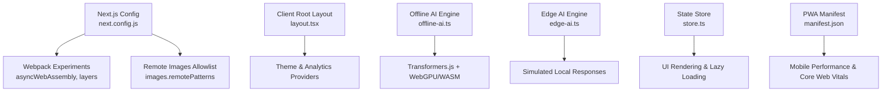
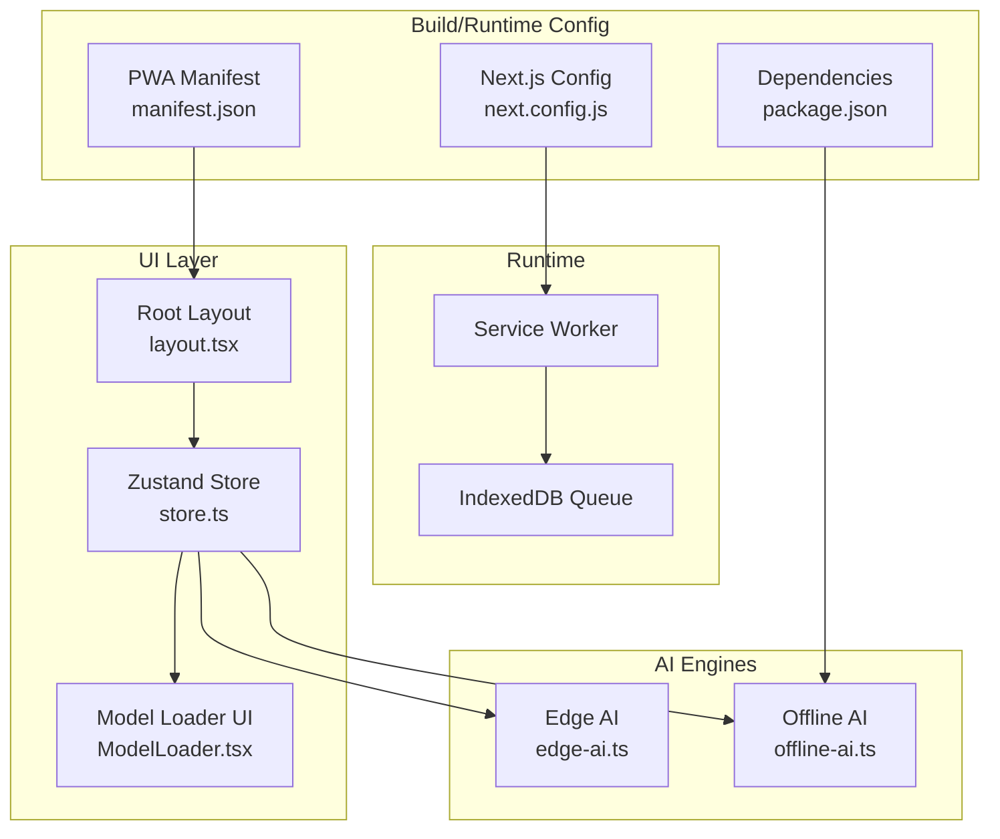
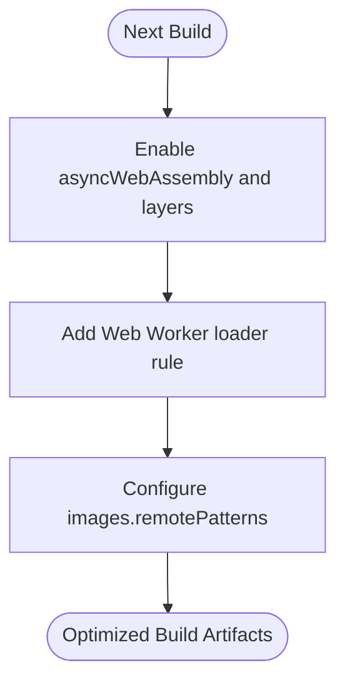
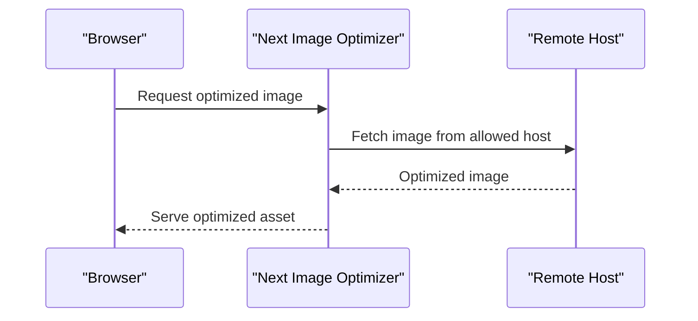
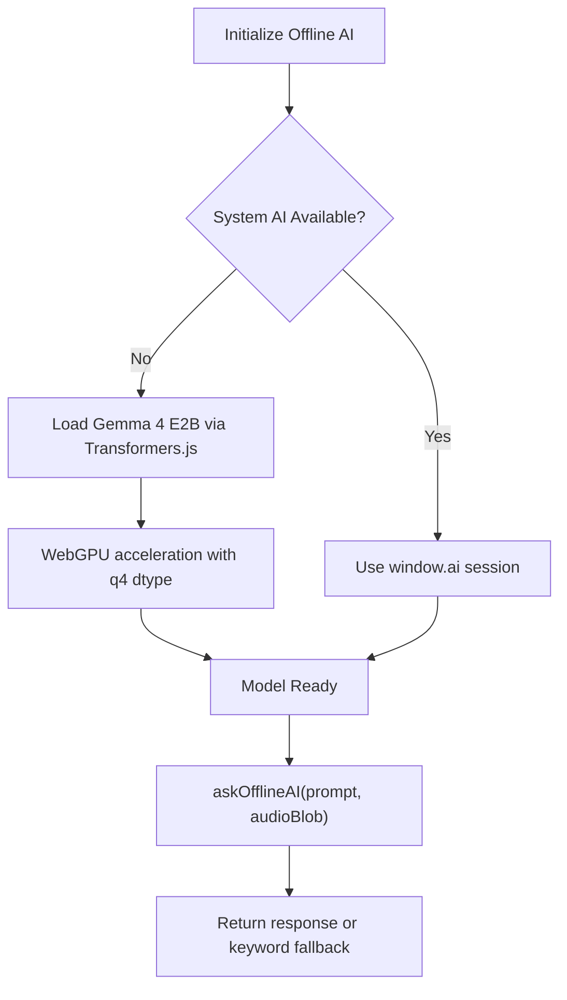
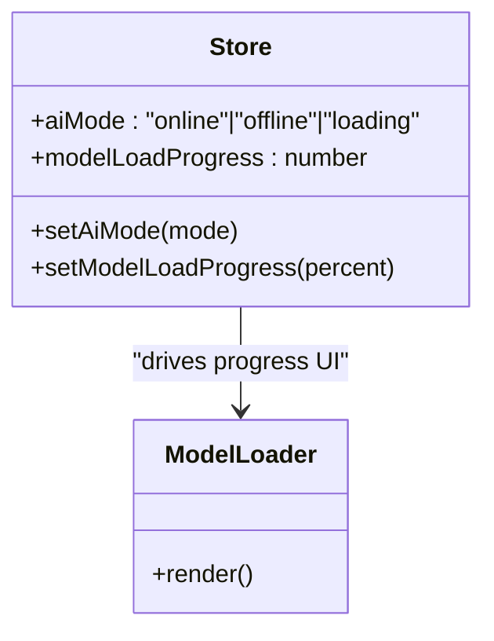
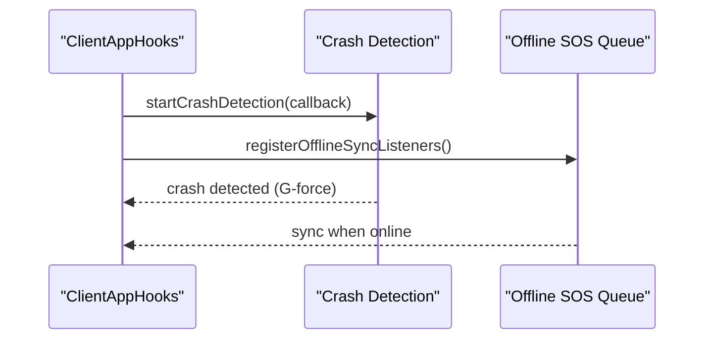
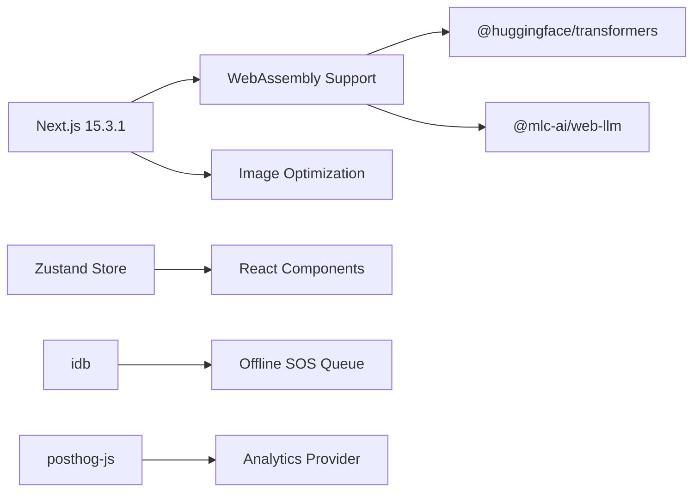

# Performance Optimization

<cite>
**Referenced Files in This Document**
- [next.config.js](file://frontend/next.config.js)
- [package.json](file://frontend/package.json)
- [layout.tsx](file://frontend/app/layout.tsx)
- [globals.css](file://frontend/app/globals.css)
- [offline-ai.ts](file://frontend/lib/offline-ai.ts)
- [edge-ai.ts](file://frontend/lib/edge-ai.ts)
- [store.ts](file://frontend/lib/store.ts)
- [ModelLoader.tsx](file://frontend/components/ModelLoader.tsx)
- [offline-sos-queue.ts](file://frontend/lib/offline-sos-queue.ts)
- [crash-detection.ts](file://frontend/lib/crash-detection.ts)
- [ClientAppHooks.tsx](file://frontend/components/ClientAppHooks.tsx)
- [manifest.json](file://frontend/public/manifest.json)
- [analytics-provider.tsx](file://frontend/lib/analytics-provider.tsx)
</cite>

## Table of Contents
1. [Introduction](#introduction)
2. [Project Structure](#project-structure)
3. [Core Components](#core-components)
4. [Architecture Overview](#architecture-overview)
5. [Detailed Component Analysis](#detailed-component-analysis)
6. [Dependency Analysis](#dependency-analysis)
7. [Performance Considerations](#performance-considerations)
8. [Troubleshooting Guide](#troubleshooting-guide)
9. [Conclusion](#conclusion)
10. [Appendices](#appendices)

## Introduction
This document provides a comprehensive guide to frontend performance optimization for the SafeVixAI project. It focuses on Next.js optimization configurations, image optimization, code splitting, and lazy loading. It also explains Edge AI optimization for WebAssembly models, bundle size reduction techniques, and runtime performance improvements. Guidance is included for profiling tools usage, performance monitoring, optimization metrics, mobile performance considerations, Core Web Vitals optimization, progressive enhancement patterns, and the integration of WebAssembly models with their impact on application performance.

## Project Structure
The frontend is built with Next.js and TypeScript. Key performance-relevant areas include:
- Next.js configuration enabling WebAssembly and Web Workers for AI models
- Client-side stores and state management for efficient rendering
- Progressive offline capabilities using IndexedDB and background sync
- PWA manifest and viewport configuration for mobile-first performance
- CSS utilities and animations optimized for smooth UI transitions

**Diagram sources**
- [next.config.js:1-44](file://frontend/next.config.js#L1-L44)
- [layout.tsx:1-86](file://frontend/app/layout.tsx#L1-L86)
- [offline-ai.ts:1-256](file://frontend/lib/offline-ai.ts#L1-L256)
- [edge-ai.ts:1-29](file://frontend/lib/edge-ai.ts#L1-L29)
- [store.ts:1-226](file://frontend/lib/store.ts#L1-L226)
- [manifest.json:1-68](file://frontend/public/manifest.json#L1-L68)

**Section sources**
- [next.config.js:1-44](file://frontend/next.config.js#L1-L44)
- [layout.tsx:1-86](file://frontend/app/layout.tsx#L1-L86)
- [manifest.json:1-68](file://frontend/public/manifest.json#L1-L68)

## Core Components
- Next.js configuration enabling WebAssembly and Web Workers for AI model loading
- Offline AI engine with system fallback and Transformers.js loader
- Edge AI engine for simulated offline responses
- Zustand store for state management and lazy-loading triggers
- PWA manifest and viewport configuration for mobile performance
- Offline SOS queue with IndexedDB and background sync
- Crash detection using DeviceMotionEvent for progressive enhancement

**Section sources**
- [next.config.js:19-40](file://frontend/next.config.js#L19-L40)
- [offline-ai.ts:47-154](file://frontend/lib/offline-ai.ts#L47-L154)
- [edge-ai.ts:15-28](file://frontend/lib/edge-ai.ts#L15-L28)
- [store.ts:129-225](file://frontend/lib/store.ts#L129-L225)
- [manifest.json:1-68](file://frontend/public/manifest.json#L1-L68)
- [offline-sos-queue.ts:25-137](file://frontend/lib/offline-sos-queue.ts#L25-L137)
- [crash-detection.ts:51-83](file://frontend/lib/crash-detection.ts#L51-L83)

## Architecture Overview
The frontend architecture integrates Next.js with WebAssembly-based AI models, progressive offline capabilities, and a PWA shell optimized for mobile performance.

**Diagram sources**
- [next.config.js:19-40](file://frontend/next.config.js#L19-L40)
- [offline-ai.ts:124-154](file://frontend/lib/offline-ai.ts#L124-L154)
- [edge-ai.ts:15-28](file://frontend/lib/edge-ai.ts#L15-L28)
- [store.ts:129-225](file://frontend/lib/store.ts#L129-L225)
- [ModelLoader.tsx:1-61](file://frontend/components/ModelLoader.tsx#L1-L61)
- [offline-sos-queue.ts:25-137](file://frontend/lib/offline-sos-queue.ts#L25-L137)
- [manifest.json:1-68](file://frontend/public/manifest.json#L1-L68)

## Detailed Component Analysis

### Next.js Optimization Configuration
- Enables async WebAssembly and layers for Transformers.js compatibility
- Adds Web Worker loader for worker files
- Configures remote image hosts for optimized image delivery

**Diagram sources**
- [next.config.js:19-40](file://frontend/next.config.js#L19-L40)

**Section sources**
- [next.config.js:3-18](file://frontend/next.config.js#L3-L18)
- [next.config.js:19-40](file://frontend/next.config.js#L19-L40)

### Image Optimization and Lazy Loading
- Remote image hosts configured for Next.js Image Optimization
- CSS utilities for responsive layouts and reduced layout shifts
- PWA manifest ensures fast startup and installability

**Diagram sources**
- [next.config.js:4-14](file://frontend/next.config.js#L4-L14)
- [globals.css:206-226](file://frontend/app/globals.css#L206-L226)
- [manifest.json:1-68](file://frontend/public/manifest.json#L1-L68)

**Section sources**
- [next.config.js:4-14](file://frontend/next.config.js#L4-L14)
- [globals.css:206-226](file://frontend/app/globals.css#L206-L226)
- [manifest.json:1-68](file://frontend/public/manifest.json#L1-L68)

### Offline AI Engine (WebAssembly)
- Checks for system AI (Chrome/Android AICore) first for zero-download operation
- Falls back to Transformers.js with WebGPU acceleration and 4-bit quantization
- Provides progress callbacks and graceful keyword fallback

**Diagram sources**
- [offline-ai.ts:47-154](file://frontend/lib/offline-ai.ts#L47-L154)
- [offline-ai.ts:160-211](file://frontend/lib/offline-ai.ts#L160-L211)

**Section sources**
- [offline-ai.ts:47-154](file://frontend/lib/offline-ai.ts#L47-L154)
- [offline-ai.ts:160-211](file://frontend/lib/offline-ai.ts#L160-L211)

### Edge AI Engine (Simulated)
- Provides deterministic offline responses without model downloads
- Useful for demos and low-latency scenarios

**Section sources**
- [edge-ai.ts:15-28](file://frontend/lib/edge-ai.ts#L15-L28)

### State Management and Lazy Loading
- Zustand store manages AI mode, model load progress, and UI state
- ModelLoader component renders progress during model initialization
- Progressive enhancement patterns ensure functionality even without AI

**Diagram sources**
- [store.ts:84-88](file://frontend/lib/store.ts#L84-L88)
- [store.ts:160-164](file://frontend/lib/store.ts#L160-L164)
- [ModelLoader.tsx:5-8](file://frontend/components/ModelLoader.tsx#L5-L8)

**Section sources**
- [store.ts:84-88](file://frontend/lib/store.ts#L84-L88)
- [store.ts:160-164](file://frontend/lib/store.ts#L160-L164)
- [ModelLoader.tsx:1-61](file://frontend/components/ModelLoader.tsx#L1-L61)

### Progressive Enhancement Patterns
- Crash detection attaches DeviceMotion listeners with permission handling
- Offline SOS queue persists requests and syncs when online
- ClientAppHooks initializes global listeners safely

**Diagram sources**
- [ClientAppHooks.tsx:8-34](file://frontend/components/ClientAppHooks.tsx#L8-L34)
- [crash-detection.ts:51-83](file://frontend/lib/crash-detection.ts#L51-L83)
- [offline-sos-queue.ts:130-137](file://frontend/lib/offline-sos-queue.ts#L130-L137)

**Section sources**
- [ClientAppHooks.tsx:8-34](file://frontend/components/ClientAppHooks.tsx#L8-L34)
- [crash-detection.ts:51-83](file://frontend/lib/crash-detection.ts#L51-L83)
- [offline-sos-queue.ts:130-137](file://frontend/lib/offline-sos-queue.ts#L130-L137)

### PWA and Mobile Performance
- PWA manifest defines standalone display, theme/background colors, and shortcuts
- Viewport configuration ensures proper scaling and safe-area insets
- CSS utilities reduce layout shifts and optimize animations

**Section sources**
- [manifest.json:1-68](file://frontend/public/manifest.json#L1-L68)
- [layout.tsx:28-36](file://frontend/app/layout.tsx#L28-L36)
- [globals.css:10-23](file://frontend/app/globals.css#L10-L23)

## Dependency Analysis
- Next.js 15.3.1 with Webpack experiments for async WebAssembly
- @huggingface/transformers for WebAssembly model loading
- @mlc-ai/web-llm for optional WebLLM integration
- PostHog for analytics instrumentation
- IndexedDB (idb) for offline persistence

**Diagram sources**
- [package.json:14-52](file://frontend/package.json#L14-L52)
- [next.config.js:26-30](file://frontend/next.config.js#L26-L30)

**Section sources**
- [package.json:14-52](file://frontend/package.json#L14-L52)
- [next.config.js:26-30](file://frontend/next.config.js#L26-L30)

## Performance Considerations
- Bundle size reduction
  - Prefer dynamic imports for AI engines to keep initial bundle small
  - Use WebGPU acceleration to minimize model load time and memory footprint
  - Limit third-party dependencies and scope analytics to opt-in environments
- Runtime performance
  - Use CSS transforms and opacity for animations to avoid layout thrashing
  - Minimize re-renders by structuring state with Zustand and selective updates
  - Defer non-critical features until after initial load
- Mobile performance
  - Configure viewport and safe-area insets for immersive UI
  - Use PWA features to cache assets and enable offline-first experiences
  - Optimize images with Next.js Image Optimization and appropriate sizes
- Core Web Vitals
  - Reduce Largest Contentful Paint by deferring non-critical resources
  - Improve First Input Delay by minimizing main-thread work during initial load
  - Maintain Cumulative Layout Shift by using aspect ratios and skeleton loaders
- Profiling and monitoring
  - Use PostHog for performance event capture and funnel analysis
  - Monitor model load progress and failures to inform users and improve UX
  - Track offline sync success rates and retry behavior

[No sources needed since this section provides general guidance]

## Troubleshooting Guide
- WebAssembly and Web Worker issues
  - Verify asyncWebAssembly and layers are enabled in Next.js config
  - Ensure worker loader handles .worker.js files
- Model loading failures
  - Check system AI availability and fallback to Transformers.js
  - Monitor progress callbacks and error states in the store
- Offline persistence
  - Confirm IndexedDB initialization and transaction handling
  - Validate background sync registration and network conditions
- Analytics initialization
  - Ensure environment variables are present before initializing PostHog

**Section sources**
- [next.config.js:26-36](file://frontend/next.config.js#L26-L36)
- [offline-ai.ts:142-153](file://frontend/lib/offline-ai.ts#L142-L153)
- [offline-sos-queue.ts:25-137](file://frontend/lib/offline-sos-queue.ts#L25-L137)
- [analytics-provider.tsx:8-22](file://frontend/lib/analytics-provider.tsx#L8-L22)

## Conclusion
The SafeVixAI frontend leverages Next.js optimizations, WebAssembly-based AI engines, and progressive offline capabilities to deliver a performant, mobile-first experience. By combining dynamic imports, WebGPU acceleration, PWA features, and robust state management, the application achieves strong runtime performance and resilience. Monitoring and profiling should continue to guide iterative improvements to Core Web Vitals and user experience.

[No sources needed since this section summarizes without analyzing specific files]

## Appendices
- Example profiling tools usage
  - Use browser DevTools Performance panel to record interactions and analyze main-thread work
  - Use Lighthouse for automated audits on build artifacts and deployment previews
  - Use PostHog to track user journeys and identify performance regressions in production
- Optimization metrics
  - Measure TTFB, LCP, FID, CLS, and INP across devices and networks
  - Track model load durations, cache hit rates, and offline sync success rates
- Progressive enhancement patterns
  - Always provide fallbacks for AI features and sensor-based enhancements
  - Ensure core functionality remains usable without WebAssembly or advanced APIs

[No sources needed since this section provides general guidance]