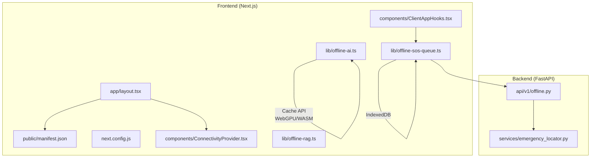
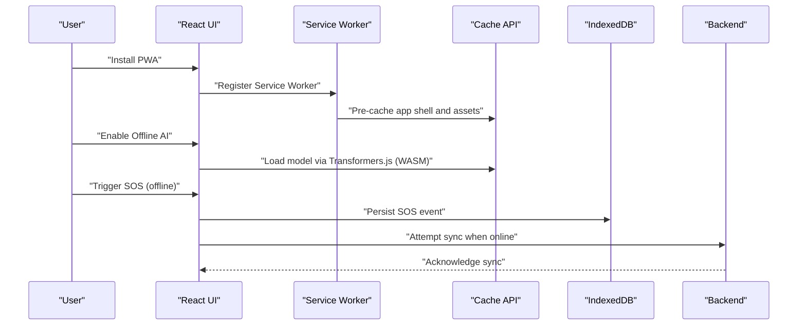
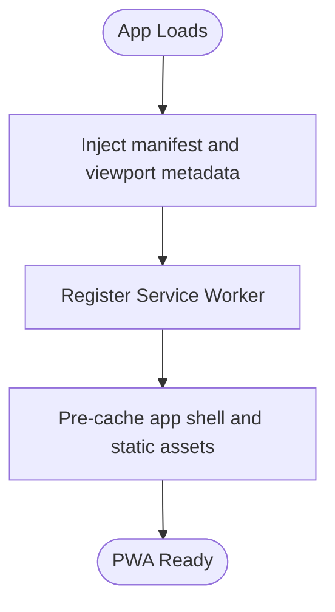
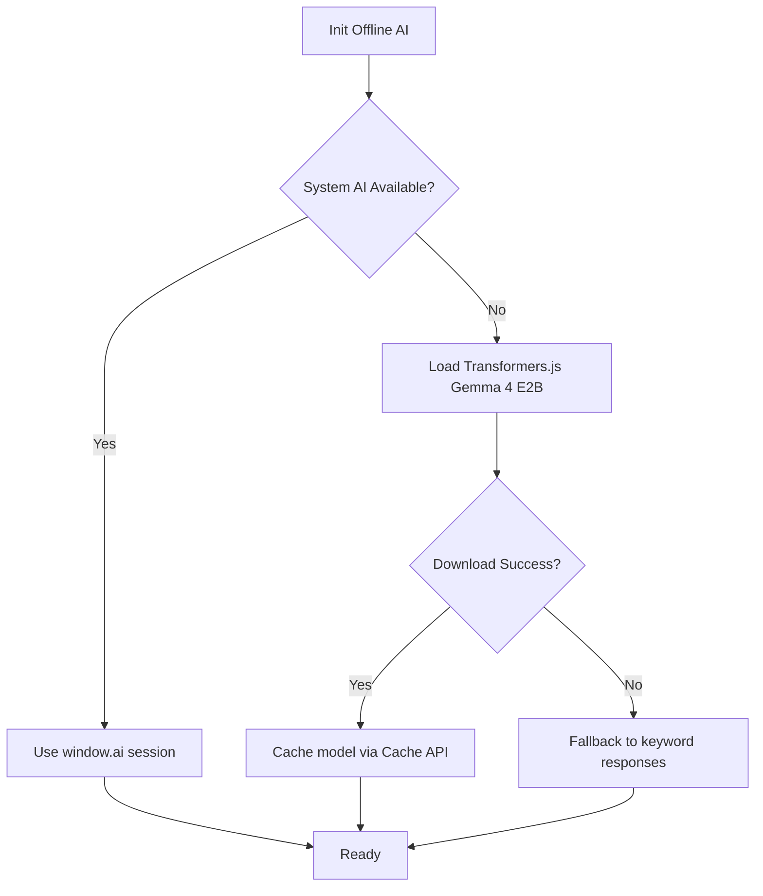
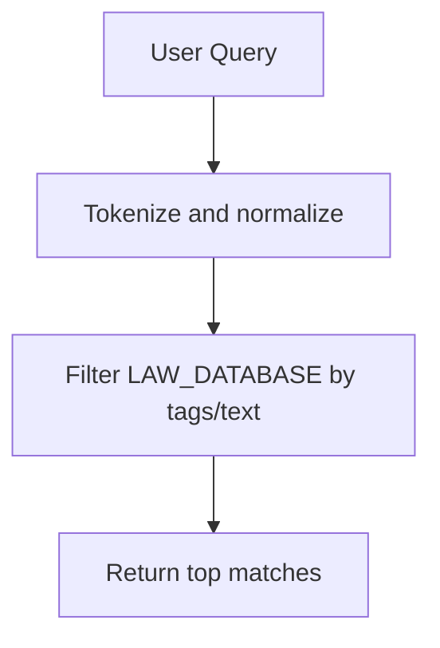
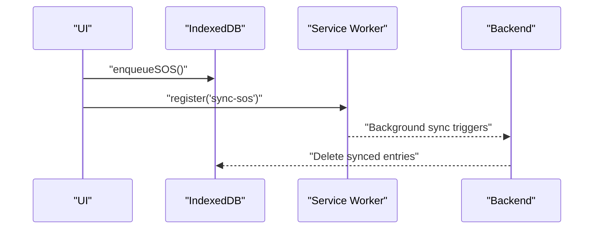
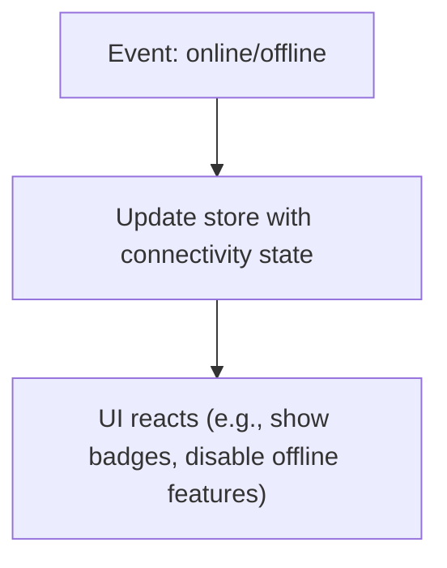
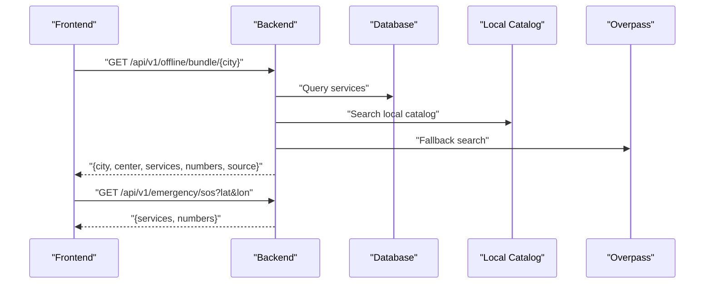
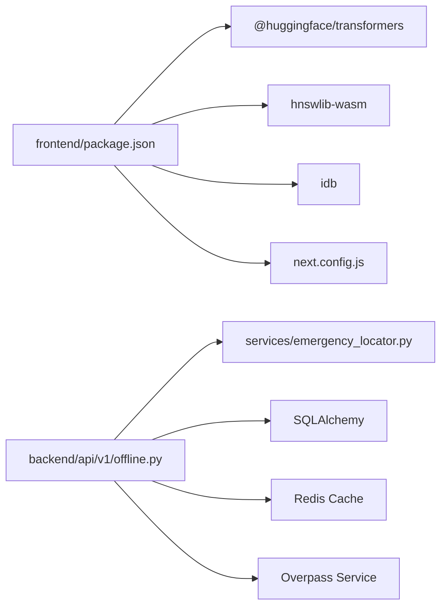

# Progressive Web App Architecture

<cite>
**Referenced Files in This Document**
- [manifest.json](file://frontend/public/manifest.json)
- [next.config.js](file://frontend/next.config.js)
- [layout.tsx](file://frontend/app/layout.tsx)
- [ConnectivityProvider.tsx](file://frontend/components/ConnectivityProvider.tsx)
- [ClientAppHooks.tsx](file://frontend/components/ClientAppHooks.tsx)
- [offline-ai.ts](file://frontend/lib/offline-ai.ts)
- [offline-rag.ts](file://frontend/lib/offline-rag.ts)
- [offline-sos-queue.ts](file://frontend/lib/offline-sos-queue.ts)
- [package.json](file://frontend/package.json)
- [offline.py](file://backend/api/v1/offline.py)
- [emergency_locator.py](file://backend/services/emergency_locator.py)
</cite>

## Table of Contents
1. [Introduction](#introduction)
2. [Project Structure](#project-structure)
3. [Core Components](#core-components)
4. [Architecture Overview](#architecture-overview)
5. [Detailed Component Analysis](#detailed-component-analysis)
6. [Dependency Analysis](#dependency-analysis)
7. [Performance Considerations](#performance-considerations)
8. [Troubleshooting Guide](#troubleshooting-guide)
9. [Conclusion](#conclusion)
10. [Appendices](#appendices)

## Introduction
This document explains the Progressive Web App (PWA) architecture for SafeVixAI, focusing on service worker configuration, manifest.json setup, offline-first design patterns, and offline AI capabilities. It documents the PWA registration process, caching strategies using the Cache API and IndexedDB, offline data synchronization, and offline AI model loading with WebAssembly. Practical examples cover installation, background sync operations, and offline capability detection. Browser compatibility, security considerations for service workers, and performance optimizations for offline scenarios are also addressed.

## Project Structure
The PWA implementation spans the frontend Next.js application and backend FastAPI services:
- Frontend PWA assets and runtime logic reside under frontend/.
- Backend exposes offline-related endpoints and builds offline city bundles.

**Diagram sources**
- [layout.tsx:1-86](file://frontend/app/layout.tsx#L1-L86)
- [manifest.json:1-68](file://frontend/public/manifest.json#L1-L68)
- [next.config.js:1-44](file://frontend/next.config.js#L1-L44)
- [ConnectivityProvider.tsx:1-27](file://frontend/components/ConnectivityProvider.tsx#L1-L27)
- [ClientAppHooks.tsx:1-38](file://frontend/components/ClientAppHooks.tsx#L1-L38)
- [offline-ai.ts:1-256](file://frontend/lib/offline-ai.ts#L1-L256)
- [offline-rag.ts:1-35](file://frontend/lib/offline-rag.ts#L1-L35)
- [offline-sos-queue.ts:1-138](file://frontend/lib/offline-sos-queue.ts#L1-L138)
- [offline.py:1-28](file://backend/api/v1/offline.py#L1-L28)
- [emergency_locator.py:1-507](file://backend/services/emergency_locator.py#L1-L507)

**Section sources**
- [layout.tsx:1-86](file://frontend/app/layout.tsx#L1-L86)
- [manifest.json:1-68](file://frontend/public/manifest.json#L1-L68)
- [next.config.js:1-44](file://frontend/next.config.js#L1-L44)
- [offline-ai.ts:1-256](file://frontend/lib/offline-ai.ts#L1-L256)
- [offline-sos-queue.ts:1-138](file://frontend/lib/offline-sos-queue.ts#L1-L138)
- [offline.py:1-28](file://backend/api/v1/offline.py#L1-L28)
- [emergency_locator.py:1-507](file://backend/services/emergency_locator.py#L1-L507)

## Core Components
- Manifest and PWA Registration: The manifest defines app identity, display mode, icons, shortcuts, and screenshots. The Next.js metadata integrates the manifest and Apple Web App settings.
- Offline AI Engine: Implements a tiered offline AI strategy using Chrome’s built-in AI, Transformers.js with WebGPU/WebAssembly, and a keyword fallback.
- Offline Data Access: Provides a local RAG-like search over cached legal documents.
- Offline Queue and Sync: Uses IndexedDB to persist SOS events and syncs them when online using background sync.
- Connectivity Monitoring: Tracks online/offline state and updates the UI accordingly.

**Section sources**
- [manifest.json:1-68](file://frontend/public/manifest.json#L1-L68)
- [layout.tsx:10-36](file://frontend/app/layout.tsx#L10-L36)
- [offline-ai.ts:1-256](file://frontend/lib/offline-ai.ts#L1-L256)
- [offline-rag.ts:1-35](file://frontend/lib/offline-rag.ts#L1-L35)
- [offline-sos-queue.ts:1-138](file://frontend/lib/offline-sos-queue.ts#L1-L138)
- [ConnectivityProvider.tsx:1-27](file://frontend/components/ConnectivityProvider.tsx#L1-L27)

## Architecture Overview
The PWA architecture follows an offline-first design:
- App shell and resources are cached via the build system and served from the Cache API.
- Offline AI loads models using Transformers.js with WebAssembly and caches them in browser Cache Storage.
- IndexedDB persists offline events (e.g., SOS) and synchronizes them when connectivity is restored.
- Backend provides offline city bundles and emergency SOS endpoints.

**Diagram sources**
- [layout.tsx:16-26](file://frontend/app/layout.tsx#L16-L26)
- [offline-ai.ts:70-110](file://frontend/lib/offline-ai.ts#L70-L110)
- [offline-sos-queue.ts:48-69](file://frontend/lib/offline-sos-queue.ts#L48-L69)
- [offline.py:18-27](file://backend/api/v1/offline.py#L18-L27)

## Detailed Component Analysis

### Service Worker and PWA Registration
- PWA Registration: The root layout injects the manifest link and Apple Web App metadata, enabling standalone display and native app-like behavior.
- Next.js Build and Cache: The Next.js configuration enables async WebAssembly and worker loaders, ensuring Transformers.js and WebGPU work in the browser. These settings support offline AI model caching via the browser’s Cache Storage.

**Diagram sources**
- [layout.tsx:16-36](file://frontend/app/layout.tsx#L16-L36)
- [next.config.js:19-40](file://frontend/next.config.js#L19-L40)

**Section sources**
- [layout.tsx:10-36](file://frontend/app/layout.tsx#L10-L36)
- [next.config.js:19-40](file://frontend/next.config.js#L19-L40)

### Manifest.json Setup
Key manifest fields:
- Identity: name, short_name, description, lang.
- Scope and Display: start_url, scope, display, orientation.
- Theming: theme_color, background_color.
- Icons: sizes and types for installability.
- Shortcuts: quick actions to core features.
- Screenshots: promotional visuals.
- Categories: navigation, utilities, lifestyle.

These settings enable installability, standalone behavior, and discoverability across platforms.

**Section sources**
- [manifest.json:1-68](file://frontend/public/manifest.json#L1-L68)

### Offline AI Engine (Transformers.js + WebGPU/WASM)
Offline AI tiers:
1. System AI: Uses window.ai (Chrome/Android AICore) for instant, zero-download operation.
2. Transformers.js: Downloads and caches a large model (~1.3 GB) using WebGPU with 4-bit quantization. Progress callbacks update UI.
3. Fallback: Keyword-based responses using cached data.

**Diagram sources**
- [offline-ai.ts:47-154](file://frontend/lib/offline-ai.ts#L47-L154)

**Section sources**
- [offline-ai.ts:1-256](file://frontend/lib/offline-ai.ts#L1-L256)
- [next.config.js:23-36](file://frontend/next.config.js#L23-L36)

### Offline RAG (Local Legal Index)
Provides a lightweight local search over cached legal documents. In this prototype, a simple keyword filter simulates vector similarity search. In production, HNSWlib-wasm would replace this logic for true similarity search.

**Diagram sources**
- [offline-rag.ts:22-34](file://frontend/lib/offline-rag.ts#L22-L34)

**Section sources**
- [offline-rag.ts:1-35](file://frontend/lib/offline-rag.ts#L1-L35)

### Offline Queue and Background Sync (IndexedDB + Background Sync)
- IndexedDB: Stores SOS events with timestamps and indexes for efficient retrieval.
- Offline Queue: Persists SOS entries when offline and attempts to sync when online.
- Background Sync: Registers a sync tag to retry transmission when connectivity is restored.

**Diagram sources**
- [offline-sos-queue.ts:48-69](file://frontend/lib/offline-sos-queue.ts#L48-L69)
- [offline-sos-queue.ts:75-124](file://frontend/lib/offline-sos-queue.ts#L75-L124)

**Section sources**
- [offline-sos-queue.ts:1-138](file://frontend/lib/offline-sos-queue.ts#L1-L138)

### Connectivity Detection and UI Updates
The ConnectivityProvider listens to online/offline events and updates the app state, enabling UI to reflect current connectivity.

**Diagram sources**
- [ConnectivityProvider.tsx:9-23](file://frontend/components/ConnectivityProvider.tsx#L9-L23)

**Section sources**
- [ConnectivityProvider.tsx:1-27](file://frontend/components/ConnectivityProvider.tsx#L1-L27)

### Backend Offline Bundle and SOS Endpoint
- Offline Bundle Endpoint: Builds and caches a city-specific emergency bundle containing nearby services and emergency numbers.
- SOS Endpoint: Receives SOS requests and responds with nearby emergency services.

**Diagram sources**
- [offline.py:18-27](file://backend/api/v1/offline.py#L18-L27)
- [emergency_locator.py:241-299](file://backend/services/emergency_locator.py#L241-L299)
- [emergency_locator.py:218-239](file://backend/services/emergency_locator.py#L218-L239)

**Section sources**
- [offline.py:1-28](file://backend/api/v1/offline.py#L1-L28)
- [emergency_locator.py:241-299](file://backend/services/emergency_locator.py#L241-L299)
- [emergency_locator.py:218-239](file://backend/services/emergency_locator.py#L218-L239)

## Dependency Analysis
- Frontend Dependencies: Transformers.js, HNSWlib-wasm, idb, and Next.js WebAssembly/worker configuration enable offline AI and vector search.
- Backend Dependencies: FastAPI, SQLAlchemy, Redis cache, and Overpass service power offline bundle generation and emergency SOS.

**Diagram sources**
- [package.json:14-53](file://frontend/package.json#L14-L53)
- [next.config.js:23-36](file://frontend/next.config.js#L23-L36)
- [offline.py:1-28](file://backend/api/v1/offline.py#L1-L28)
- [emergency_locator.py:1-507](file://backend/services/emergency_locator.py#L1-L507)

**Section sources**
- [package.json:14-53](file://frontend/package.json#L14-L53)
- [next.config.js:23-36](file://frontend/next.config.js#L23-L36)
- [offline.py:1-28](file://backend/api/v1/offline.py#L1-L28)
- [emergency_locator.py:1-507](file://backend/services/emergency_locator.py#L1-L507)

## Performance Considerations
- Model Loading: Use WebGPU acceleration where available; fallback to WASM for broader compatibility. Cache models via Cache API to avoid repeated downloads.
- Vector Search: Replace keyword filtering with HNSWlib-wasm for realistic similarity search and reduce latency.
- IndexedDB Transactions: Batch reads/writes and use indexes to minimize I/O overhead during sync.
- Pre-caching: Ensure critical assets and the offline AI model are precached to improve first-load performance.
- Background Sync: Limit retry frequency and handle partial failures to avoid overwhelming the server.

[No sources needed since this section provides general guidance]

## Troubleshooting Guide
- Service Worker Not Installing:
  - Verify manifest link injection in the root layout.
  - Confirm HTTPS deployment; service workers require secure contexts.
- Offline AI Fails to Load:
  - Ensure Next.js WebAssembly and worker loaders are enabled.
  - Check browser support for WebGPU; fallback to WASM if unsupported.
- IndexedDB Sync Errors:
  - Validate transaction boundaries and error handling in the sync routine.
  - Confirm background sync registration and availability in the browser.
- Connectivity State Not Updating:
  - Ensure the ConnectivityProvider attaches early in the app tree and listens to online/offline events.

**Section sources**
- [layout.tsx:16-26](file://frontend/app/layout.tsx#L16-L26)
- [next.config.js:23-36](file://frontend/next.config.js#L23-L36)
- [offline-sos-queue.ts:75-124](file://frontend/lib/offline-sos-queue.ts#L75-L124)
- [ConnectivityProvider.tsx:9-23](file://frontend/components/ConnectivityProvider.tsx#L9-L23)

## Conclusion
SafeVixAI’s PWA architecture combines a robust manifest and service worker registration with offline-first design patterns. The offline AI engine leverages modern web APIs for model loading and caching, while IndexedDB ensures reliable offline data persistence and background sync. The backend complements this with offline city bundles and SOS endpoints. Together, these components deliver a resilient, installable, and capable application that functions effectively offline.

[No sources needed since this section summarizes without analyzing specific files]

## Appendices

### Practical Examples

- PWA Installation:
  - Install the app from the browser menu after visiting the site.
  - The manifest defines icons, shortcuts, and standalone display.

- Background Sync Operations:
  - Enqueue an SOS while offline; the app persists it to IndexedDB.
  - When online, the app attempts to sync and removes successful entries.

- Offline Capability Detection:
  - Use the connectivity provider to detect online/offline state and adjust UI behavior accordingly.

**Section sources**
- [manifest.json:1-68](file://frontend/public/manifest.json#L1-L68)
- [offline-sos-queue.ts:48-69](file://frontend/lib/offline-sos-queue.ts#L48-L69)
- [ConnectivityProvider.tsx:9-23](file://frontend/components/ConnectivityProvider.tsx#L9-L23)

### Browser Compatibility and Security Notes
- Service Workers: Require HTTPS in production; ensure proper scope and registration.
- WebGPU/WASM: Not universally supported; provide clear fallback messaging and degrade gracefully.
- Permissions: Request user consent before enabling offline AI and sensor-based features.

**Section sources**
- [offline-ai.ts:124-154](file://frontend/lib/offline-ai.ts#L124-L154)
- [layout.tsx:16-26](file://frontend/app/layout.tsx#L16-L26)