# Routing and Navigation

<cite>
**Referenced Files in This Document**
- [layout.tsx](file://frontend/app/layout.tsx)
- [page.tsx](file://frontend/app/page.tsx)
- [AppSidebar.tsx](file://frontend/components/AppSidebar.tsx)
- [SystemSidebar.tsx](file://frontend/components/dashboard/SystemSidebar.tsx)
- [BottomNav.tsx](file://frontend/components/dashboard/BottomNav.tsx)
- [PageShell.tsx](file://frontend/components/PageShell.tsx)
- [login/page.tsx](file://frontend/app/login/page.tsx)
- [emergency-card/[userId]/page.tsx](file://frontend/app/emergency-card/[userId]/page.tsx)
- [store.ts](file://frontend/lib/store.ts)
- [api.ts](file://frontend/lib/api.ts)
- [next.config.js](file://frontend/next.config.js)
</cite>

## Table of Contents
1. [Introduction](#introduction)
2. [Project Structure](#project-structure)
3. [Core Components](#core-components)
4. [Architecture Overview](#architecture-overview)
5. [Detailed Component Analysis](#detailed-component-analysis)
6. [Dependency Analysis](#dependency-analysis)
7. [Performance Considerations](#performance-considerations)
8. [Troubleshooting Guide](#troubleshooting-guide)
9. [Conclusion](#conclusion)

## Introduction
This document explains the Next.js routing system and navigation patterns used in the frontend application. It covers the app directory structure, dynamic routes, page-level components, sidebar navigation, bottom navigation, route parameters handling, programmatic navigation, authentication integration, error handling, SEO and accessibility, and performance optimization strategies such as preloading and WebAssembly support.

## Project Structure
The frontend uses Next.js App Router conventions. Pages are defined under the app directory, with shared layout and shell components wrapping page content. Navigation is implemented via client-side components and Next.js Link/Navigation APIs.

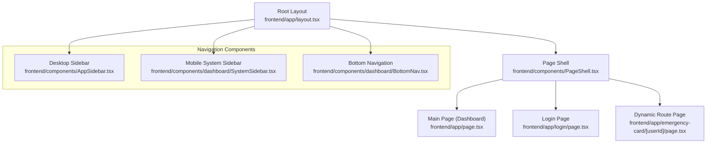

**Diagram sources**
- [layout.tsx:38-85](file://frontend/app/layout.tsx#L38-L85)
- [PageShell.tsx:13-35](file://frontend/components/PageShell.tsx#L13-L35)
- [page.tsx:29-228](file://frontend/app/page.tsx#L29-L228)
- [login/page.tsx:21-345](file://frontend/app/login/page.tsx#L21-L345)
- [emergency-card/[userId]/page.tsx](file://frontend/app/emergency-card/[userId]/page.tsx#L10-L173)
- [AppSidebar.tsx:42-169](file://frontend/components/AppSidebar.tsx#L42-L169)
- [SystemSidebar.tsx:62-205](file://frontend/components/dashboard/SystemSidebar.tsx#L62-L205)
- [BottomNav.tsx:24-102](file://frontend/components/dashboard/BottomNav.tsx#L24-L102)

**Section sources**
- [layout.tsx:1-86](file://frontend/app/layout.tsx#L1-L86)
- [page.tsx:1-229](file://frontend/app/page.tsx#L1-L229)
- [login/page.tsx:1-346](file://frontend/app/login/page.tsx#L1-L346)
- [emergency-card/[userId]/page.tsx](file://frontend/app/emergency-card/[userId]/page.tsx#L1-L174)
- [PageShell.tsx:1-36](file://frontend/components/PageShell.tsx#L1-L36)
- [AppSidebar.tsx:1-171](file://frontend/components/AppSidebar.tsx#L1-L171)
- [SystemSidebar.tsx:1-209](file://frontend/components/dashboard/SystemSidebar.tsx#L1-L209)
- [BottomNav.tsx:1-103](file://frontend/components/dashboard/BottomNav.tsx#L1-L103)

## Core Components
- Root layout defines global metadata, viewport, and providers for theme, connectivity, analytics, and page shell.
- Page shell hosts desktop sidebar, mobile system sidebar, and main content area.
- Navigation components:
  - Desktop sidebar with persistent links and quick dial actions.
  - Mobile system sidebar with animated grid navigation and SOS action.
  - Bottom navigation for mobile-centric tabs.

Key routing and navigation primitives:
- Next.js Link for declarative navigation.
- Next.js usePathname for active state computation.
- Next.js useRouter for programmatic navigation.
- Zustand store for UI state and authentication flags.

**Section sources**
- [layout.tsx:10-36](file://frontend/app/layout.tsx#L10-L36)
- [PageShell.tsx:13-35](file://frontend/components/PageShell.tsx#L13-L35)
- [AppSidebar.tsx:42-169](file://frontend/components/AppSidebar.tsx#L42-L169)
- [SystemSidebar.tsx:62-205](file://frontend/components/dashboard/SystemSidebar.tsx#L62-L205)
- [BottomNav.tsx:24-102](file://frontend/components/dashboard/BottomNav.tsx#L24-L102)
- [store.ts:63-127](file://frontend/lib/store.ts#L63-L127)

## Architecture Overview
The routing architecture combines server-rendered metadata and client-side navigation. The root layout sets global metadata and viewport. Providers wrap the app to supply theme, connectivity, and analytics. The page shell positions navigation components and renders page content. Navigation components compute active states from the current path and trigger programmatic navigation when needed.

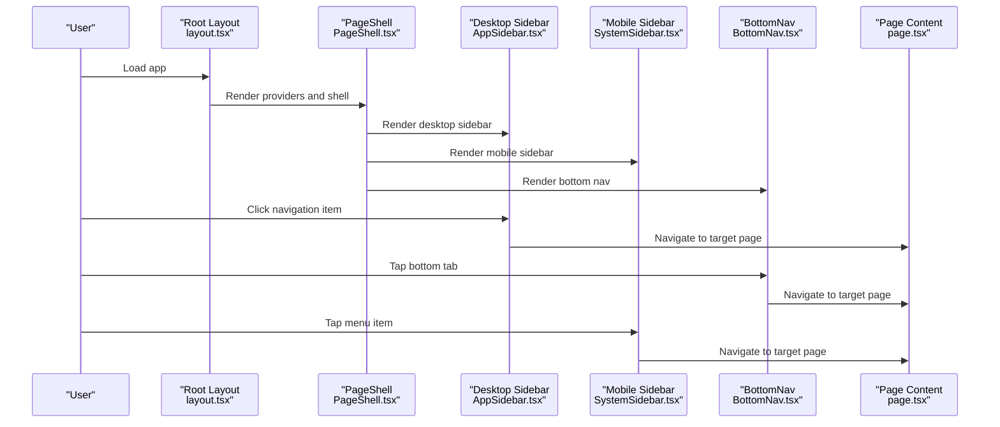

**Diagram sources**
- [layout.tsx:38-85](file://frontend/app/layout.tsx#L38-L85)
- [PageShell.tsx:13-35](file://frontend/components/PageShell.tsx#L13-L35)
- [AppSidebar.tsx:84-112](file://frontend/components/AppSidebar.tsx#L84-L112)
- [SystemSidebar.tsx:122-142](file://frontend/components/dashboard/SystemSidebar.tsx#L122-L142)
- [BottomNav.tsx:49-58](file://frontend/components/dashboard/BottomNav.tsx#L49-L58)
- [page.tsx:29-228](file://frontend/app/page.tsx#L29-L228)

## Detailed Component Analysis

### App Directory Structure and Pages
- Root layout: Defines metadata, viewport, and provider stack.
- Home/dashboard page: Renders map, controls, and panels.
- Login page: Handles authentication and redirects on success.
- Dynamic route page: Accepts route parameters and search params for emergency cards.

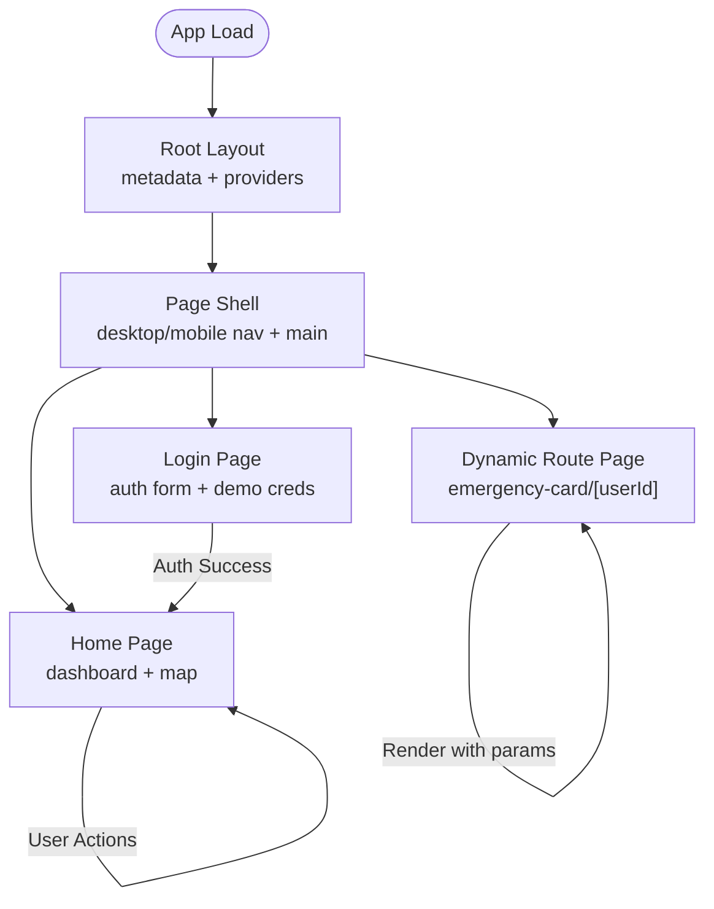

**Diagram sources**
- [layout.tsx:10-36](file://frontend/app/layout.tsx#L10-L36)
- [page.tsx:29-228](file://frontend/app/page.tsx#L29-L228)
- [login/page.tsx:21-345](file://frontend/app/login/page.tsx#L21-L345)
- [emergency-card/[userId]/page.tsx](file://frontend/app/emergency-card/[userId]/page.tsx#L10-L173)

**Section sources**
- [layout.tsx:10-36](file://frontend/app/layout.tsx#L10-L36)
- [page.tsx:29-228](file://frontend/app/page.tsx#L29-L228)
- [login/page.tsx:21-345](file://frontend/app/login/page.tsx#L21-L345)
- [emergency-card/[userId]/page.tsx](file://frontend/app/emergency-card/[userId]/page.tsx#L10-L173)

### Desktop Sidebar Navigation
- Uses Next.js Link for navigation and usePathname to compute active state.
- Stores UI state (collapsed/desktop open) in the Zustand store.
- Provides quick dial links for emergency numbers.

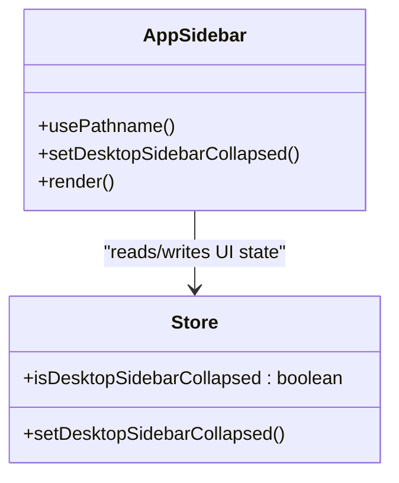

**Diagram sources**
- [AppSidebar.tsx:42-169](file://frontend/components/AppSidebar.tsx#L42-L169)
- [store.ts:109-110](file://frontend/lib/store.ts#L109-L110)

**Section sources**
- [AppSidebar.tsx:42-169](file://frontend/components/AppSidebar.tsx#L42-L169)
- [store.ts:109-110](file://frontend/lib/store.ts#L109-L110)

### Mobile System Sidebar Navigation
- Controlled by a store flag; animates in/out with motion variants.
- Renders a grid of navigation items and quick dial buttons.
- Uses Next.js Link for navigation and closes the drawer after selection.

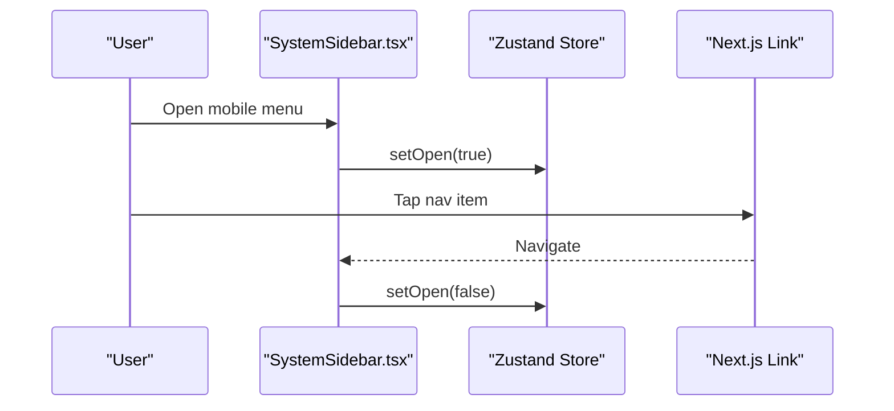

**Diagram sources**
- [SystemSidebar.tsx:62-205](file://frontend/components/dashboard/SystemSidebar.tsx#L62-L205)
- [store.ts:107-108](file://frontend/lib/store.ts#L107-L108)

**Section sources**
- [SystemSidebar.tsx:62-205](file://frontend/components/dashboard/SystemSidebar.tsx#L62-L205)
- [store.ts:107-108](file://frontend/lib/store.ts#L107-L108)

### Bottom Navigation (Mobile)
- Renders a horizontal tab bar with active indicator.
- Computes active tab from current path and supports programmatic vibration feedback.

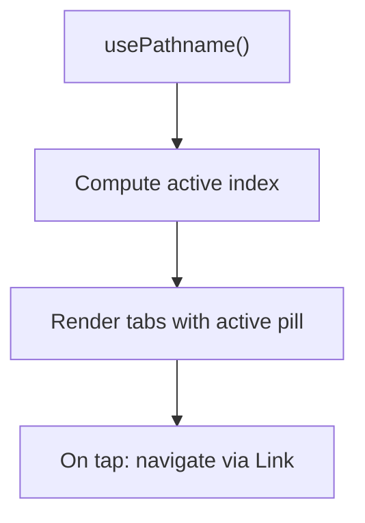

**Diagram sources**
- [BottomNav.tsx:24-102](file://frontend/components/dashboard/BottomNav.tsx#L24-L102)

**Section sources**
- [BottomNav.tsx:24-102](file://frontend/components/dashboard/BottomNav.tsx#L24-L102)

### Dynamic Routes and Route Parameters
- Dynamic route folder [emergency-card/[userId]] receives route parameters and optional search params.
- Page extracts userId and optional name/blood/vehicle/contact and renders an emergency card.

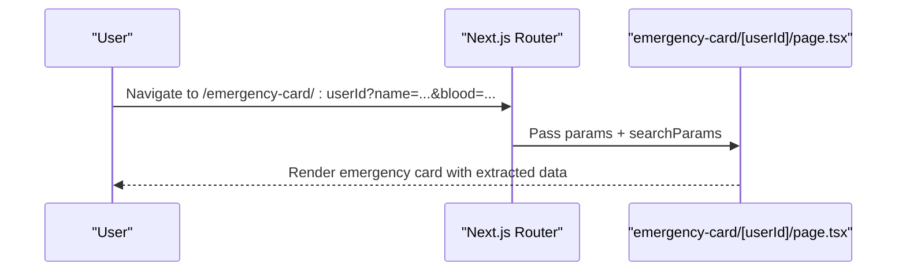

**Diagram sources**
- [emergency-card/[userId]/page.tsx](file://frontend/app/emergency-card/[userId]/page.tsx#L10-L173)

**Section sources**
- [emergency-card/[userId]/page.tsx](file://frontend/app/emergency-card/[userId]/page.tsx#L10-L173)

### Programmatic Navigation and Route Guards
- Programmatic navigation uses Next.js useRouter to redirect after successful login.
- Route guard pattern: on mount, if authenticated, redirect to home.

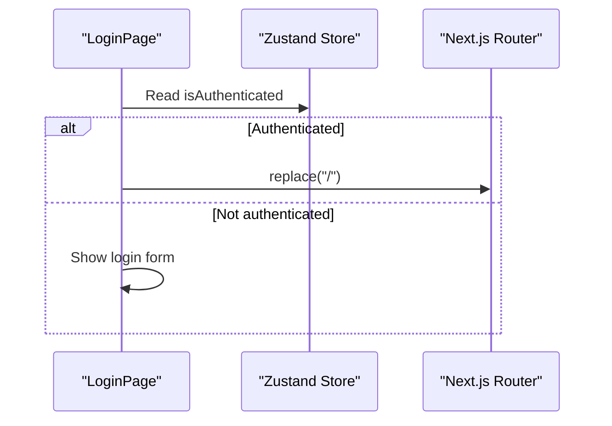

**Diagram sources**
- [login/page.tsx:34-37](file://frontend/app/login/page.tsx#L34-L37)

**Section sources**
- [login/page.tsx:34-37](file://frontend/app/login/page.tsx#L34-L37)

### Authentication Integration and Navigation State
- Authentication state is persisted in the Zustand store and injected into API requests via interceptors.
- Login page updates auth state and navigates to home upon success.

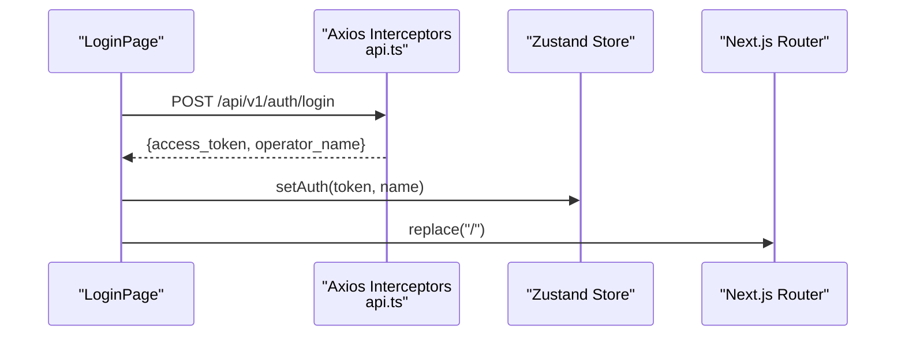

**Diagram sources**
- [login/page.tsx:50-82](file://frontend/app/login/page.tsx#L50-L82)
- [api.ts:19-47](file://frontend/lib/api.ts#L19-L47)
- [store.ts:204-209](file://frontend/lib/store.ts#L204-L209)

**Section sources**
- [login/page.tsx:50-82](file://frontend/app/login/page.tsx#L50-L82)
- [api.ts:19-47](file://frontend/lib/api.ts#L19-L47)
- [store.ts:204-209](file://frontend/lib/store.ts#L204-L209)

### SEO Optimization and Meta Tags
- Root layout exports Metadata and Viewport for title, description, keywords, Open Graph, and theme color behavior.
- Manifest and Apple Web App settings are included in head.

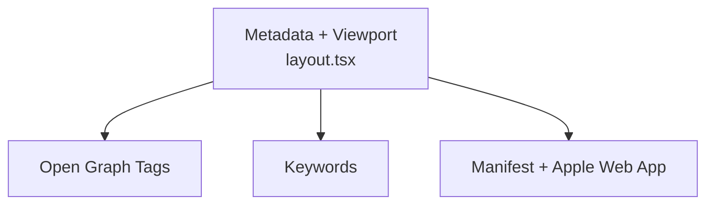

**Diagram sources**
- [layout.tsx:10-36](file://frontend/app/layout.tsx#L10-L36)

**Section sources**
- [layout.tsx:10-36](file://frontend/app/layout.tsx#L10-L36)

### Navigation Accessibility
- Skip link targets main content for keyboard/screen reader users.
- ARIA roles and labels used in mobile sidebar dialog and close button.
- Active states indicated via aria-current and visual highlights.

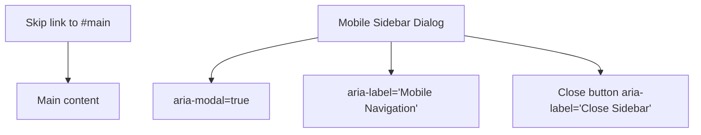

**Diagram sources**
- [PageShell.tsx:18-19](file://frontend/components/PageShell.tsx#L18-L19)
- [SystemSidebar.tsx:81-83](file://frontend/components/dashboard/SystemSidebar.tsx#L81-L83)
- [SystemSidebar.tsx:101-107](file://frontend/components/dashboard/SystemSidebar.tsx#L101-L107)

**Section sources**
- [PageShell.tsx:18-19](file://frontend/components/PageShell.tsx#L18-L19)
- [SystemSidebar.tsx:81-83](file://frontend/components/dashboard/SystemSidebar.tsx#L81-L83)
- [SystemSidebar.tsx:101-107](file://frontend/components/dashboard/SystemSidebar.tsx#L101-L107)

### Error Handling for Navigation Failures
- Login form validates presence of credentials and displays errors.
- Demo mode bypass allows quick testing without backend.
- Axios interceptors provide fallback tokens for development/demo.

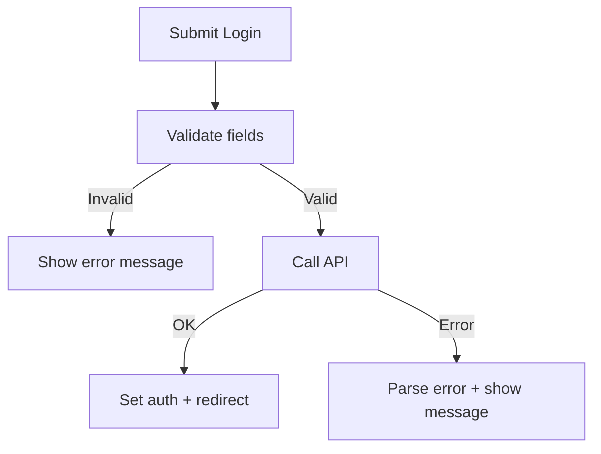

**Diagram sources**
- [login/page.tsx:50-82](file://frontend/app/login/page.tsx#L50-L82)
- [api.ts:19-47](file://frontend/lib/api.ts#L19-L47)

**Section sources**
- [login/page.tsx:50-82](file://frontend/app/login/page.tsx#L50-L82)
- [api.ts:19-47](file://frontend/lib/api.ts#L19-L47)

## Dependency Analysis
- Navigation components depend on Next.js Link and usePathname for declarative navigation and active state.
- The store manages UI state and authentication flags used across navigation components.
- API interceptors rely on persisted store state to attach auth tokens to requests.

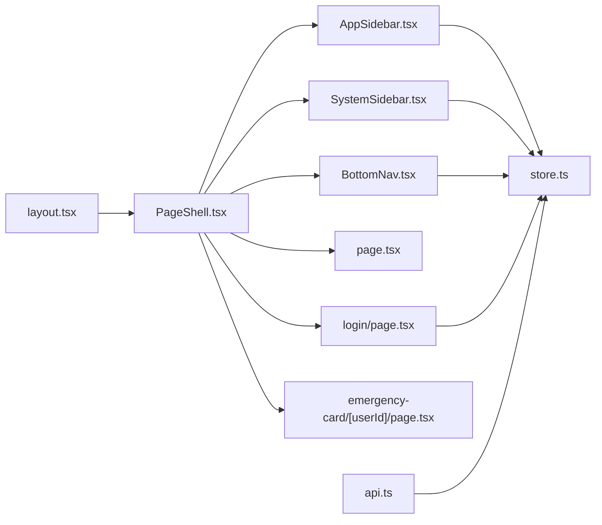

**Diagram sources**
- [layout.tsx:38-85](file://frontend/app/layout.tsx#L38-L85)
- [PageShell.tsx:13-35](file://frontend/components/PageShell.tsx#L13-L35)
- [AppSidebar.tsx:42-169](file://frontend/components/AppSidebar.tsx#L42-L169)
- [SystemSidebar.tsx:62-205](file://frontend/components/dashboard/SystemSidebar.tsx#L62-L205)
- [BottomNav.tsx:24-102](file://frontend/components/dashboard/BottomNav.tsx#L24-L102)
- [page.tsx:29-228](file://frontend/app/page.tsx#L29-L228)
- [login/page.tsx:21-345](file://frontend/app/login/page.tsx#L21-L345)
- [emergency-card/[userId]/page.tsx](file://frontend/app/emergency-card/[userId]/page.tsx#L10-L173)
- [store.ts:63-127](file://frontend/lib/store.ts#L63-L127)
- [api.ts:19-47](file://frontend/lib/api.ts#L19-L47)

**Section sources**
- [store.ts:63-127](file://frontend/lib/store.ts#L63-L127)
- [api.ts:19-47](file://frontend/lib/api.ts#L19-L47)

## Performance Considerations
- WebAssembly and workers: next.config.js enables asyncWebAssembly and worker-loader to support offline AI features.
- Preloading: Root layout includes preconnect directives for fonts and a script to apply theme before first paint.
- Client-side rendering: Dynamic imports are used for heavy map components to defer SSR.

Recommendations:
- Use Next.js static generation or ISR for pages that do not require real-time data.
- Implement route-based code splitting and lazy-load heavy components.
- Add link rel="prefetch" for frequently visited pages.
- Monitor hydration and consider progressive enhancement for critical UI.

**Section sources**
- [next.config.js:19-40](file://frontend/next.config.js#L19-L40)
- [layout.tsx:45-71](file://frontend/app/layout.tsx#L45-L71)
- [page.tsx:18-27](file://frontend/app/page.tsx#L18-L27)

## Troubleshooting Guide
Common issues and resolutions:
- Navigation not updating active state:
  - Ensure usePathname is used consistently in navigation components.
  - Verify that Link href matches the current path exactly.
- Authentication redirect loop:
  - Confirm isAuthenticated is correctly persisted and read on mount.
  - Check that router.replace is called after setting auth state.
- Missing fonts or styles:
  - Verify preconnect links and font URLs in head.
- Offline AI not loading:
  - Confirm asyncWebAssembly and worker-loader are enabled in webpack config.

**Section sources**
- [AppSidebar.tsx:82-88](file://frontend/components/AppSidebar.tsx#L82-L88)
- [login/page.tsx:34-37](file://frontend/app/login/page.tsx#L34-L37)
- [layout.tsx:45-71](file://frontend/app/layout.tsx#L45-L71)
- [next.config.js:23-36](file://frontend/next.config.js#L23-L36)

## Conclusion
The application leverages Next.js App Router to deliver a responsive, accessible, and performant navigation experience. Navigation components integrate with the Zustand store for UI state and with authentication state for guarded navigation. Dynamic routes enable parameterized pages, while SEO metadata and accessibility features improve usability. Performance enhancements through WebAssembly and preloading support offline-first capabilities.