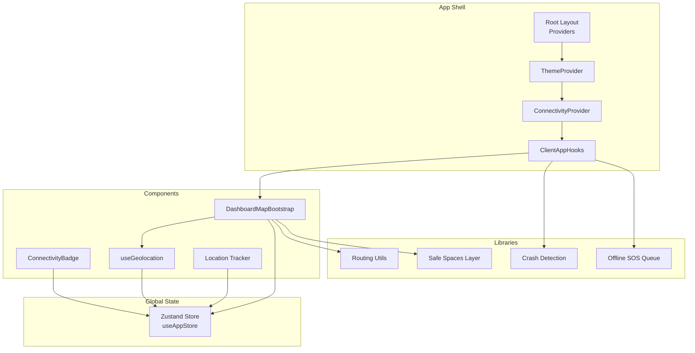
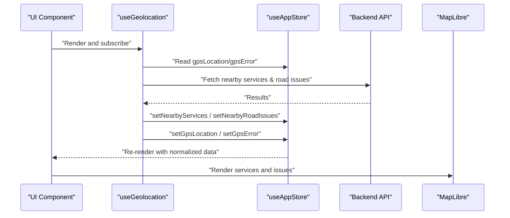
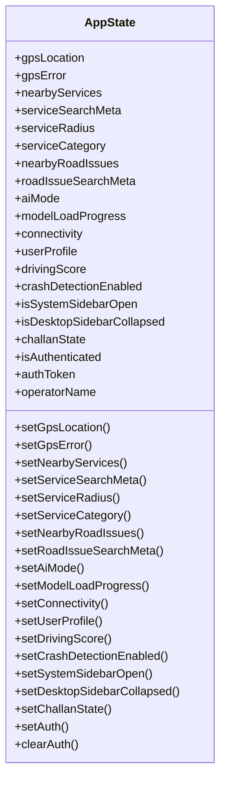
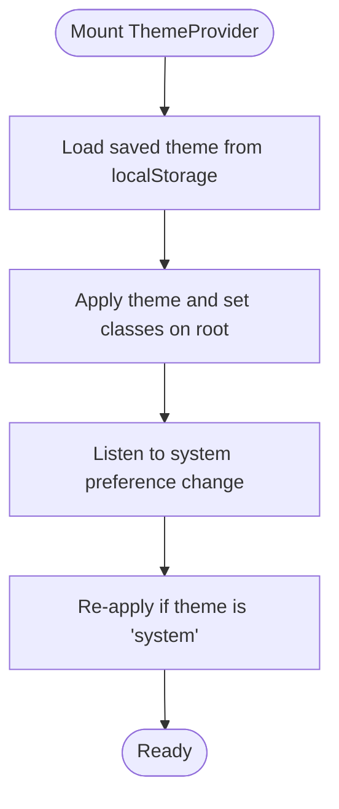
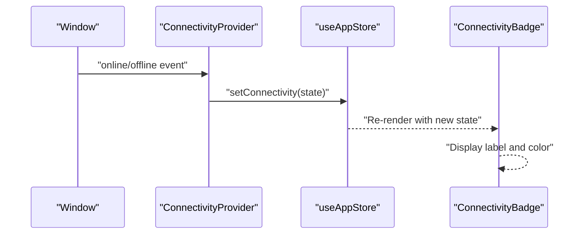
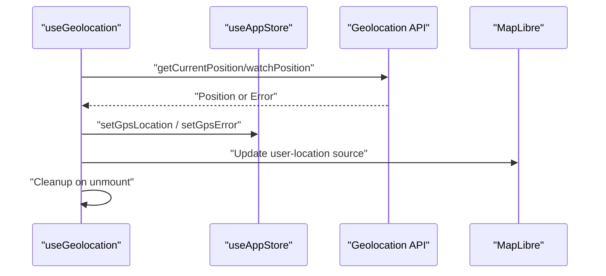
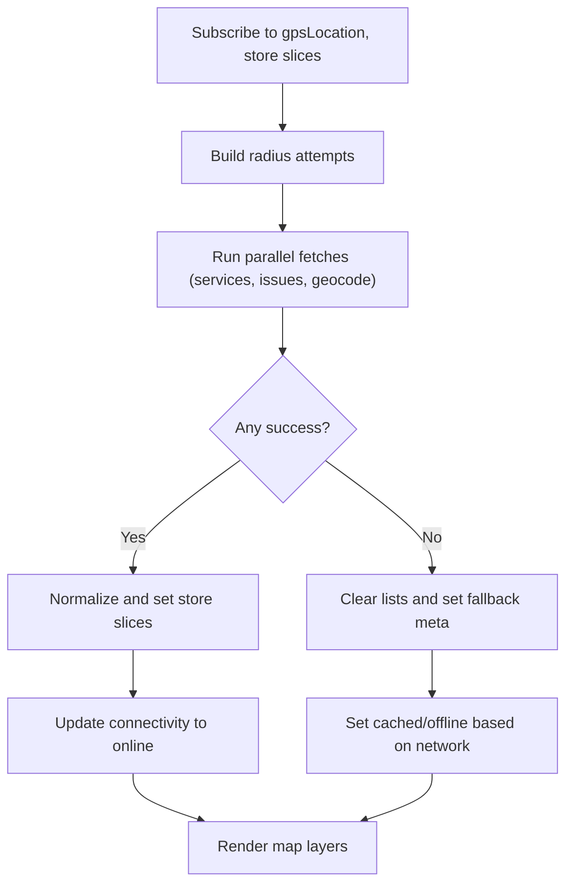
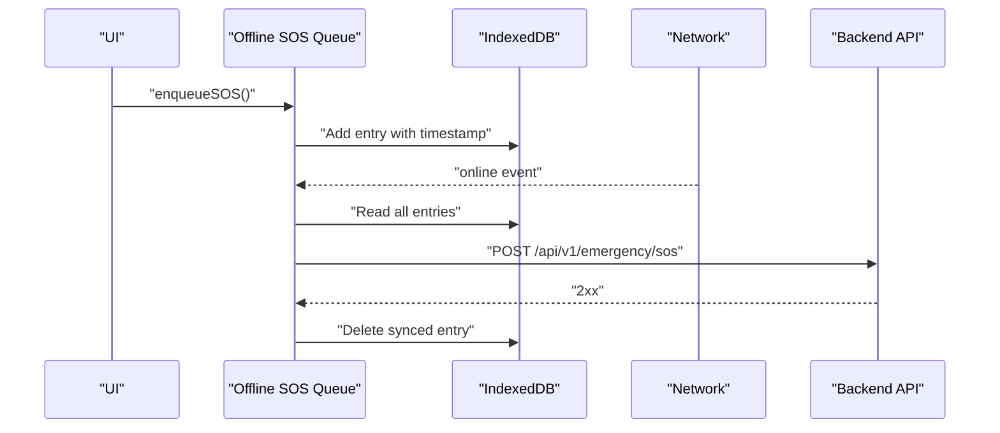
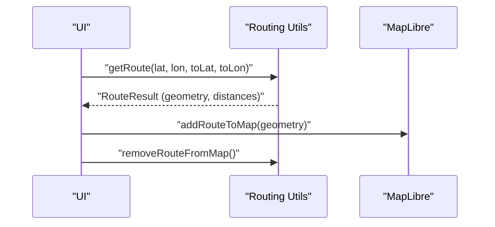
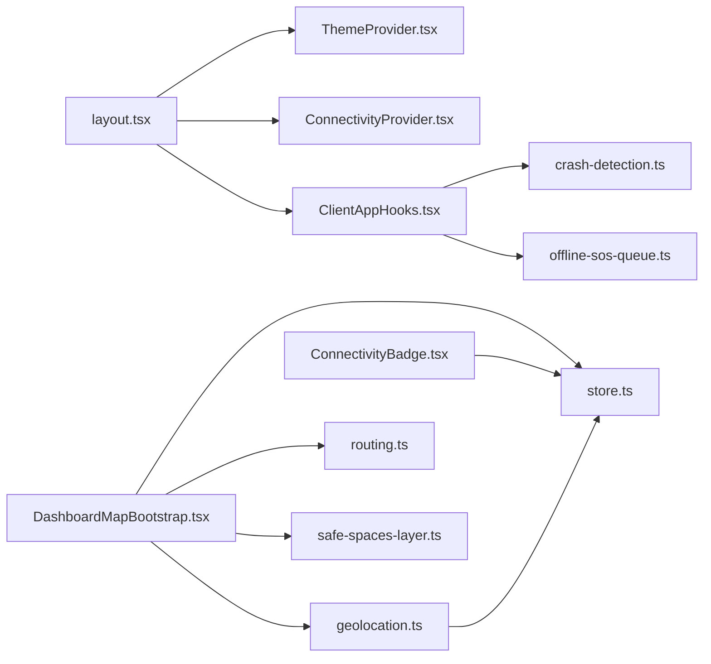

# State Management

<cite>
**Referenced Files in This Document**
- [layout.tsx](file://frontend/app/layout.tsx)
- [ConnectivityProvider.tsx](file://frontend/components/ConnectivityProvider.tsx)
- [ConnectivityBadge.tsx](file://frontend/components/ConnectivityBadge.tsx)
- [ThemeProvider.tsx](file://frontend/components/ThemeProvider.tsx)
- [ClientAppHooks.tsx](file://frontend/components/ClientAppHooks.tsx)
- [store.ts](file://frontend/lib/store.ts)
- [geolocation.ts](file://frontend/lib/geolocation.ts)
- [location-tracker.ts](file://frontend/lib/location-tracker.ts)
- [routing.ts](file://frontend/lib/routing.ts)
- [safe-spaces-layer.ts](file://frontend/lib/safe-spaces-layer.ts)
- [DashboardMapBootstrap.tsx](file://frontend/components/dashboard/DashboardMapBootstrap.tsx)
- [crash-detection.ts](file://frontend/lib/crash-detection.ts)
- [offline-sos-queue.ts](file://frontend/lib/offline-sos-queue.ts)
- [user-profile.ts](file://frontend/lib/user-profile.ts)
</cite>

## Table of Contents
1. [Introduction](#introduction)
2. [Project Structure](#project-structure)
3. [Core Components](#core-components)
4. [Architecture Overview](#architecture-overview)
5. [Detailed Component Analysis](#detailed-component-analysis)
6. [Dependency Analysis](#dependency-analysis)
7. [Performance Considerations](#performance-considerations)
8. [Troubleshooting Guide](#troubleshooting-guide)
9. [Conclusion](#conclusion)

## Introduction
This document explains the state management architecture used in the frontend. It covers:
- Global state via a Zustand store with persistence
- Context providers for theme and connectivity
- Local component state handling with React hooks
- Location tracking and map hydration flows
- Integration with backend APIs and offline capabilities
- Practical patterns for updates, subscriptions, persistence, performance, normalization, and debugging

## Project Structure
The state management spans three layers:
- Providers at the root app level manage global UI and connectivity contexts
- A centralized Zustand store holds application-wide state and persists selected slices
- Local hooks encapsulate component-specific state and side effects

**Diagram sources**
- [layout.tsx:38-85](file://frontend/app/layout.tsx#L38-L85)
- [ThemeProvider.tsx:19-62](file://frontend/components/ThemeProvider.tsx#L19-L62)
- [ConnectivityProvider.tsx:6-26](file://frontend/components/ConnectivityProvider.tsx#L6-L26)
- [ClientAppHooks.tsx:8-34](file://frontend/components/ClientAppHooks.tsx#L8-L34)
- [store.ts:129-225](file://frontend/lib/store.ts#L129-L225)
- [DashboardMapBootstrap.tsx:77-329](file://frontend/components/dashboard/DashboardMapBootstrap.tsx#L77-L329)
- [ConnectivityBadge.tsx:16-31](file://frontend/components/ConnectivityBadge.tsx#L16-L31)
- [geolocation.ts:13-123](file://frontend/lib/geolocation.ts#L13-L123)
- [location-tracker.ts:8-65](file://frontend/lib/location-tracker.ts#L8-L65)
- [routing.ts:31-80](file://frontend/lib/routing.ts#L31-L80)
- [safe-spaces-layer.ts:14-61](file://frontend/lib/safe-spaces-layer.ts#L14-L61)
- [crash-detection.ts:51-83](file://frontend/lib/crash-detection.ts#L51-L83)
- [offline-sos-queue.ts:75-124](file://frontend/lib/offline-sos-queue.ts#L75-L124)

**Section sources**
- [layout.tsx:38-85](file://frontend/app/layout.tsx#L38-L85)

## Core Components
- Zustand store (Redux-like):
  - Holds GPS, nearby services/issues, AI mode, connectivity, user profile, UI toggles, auth, and driving score
  - Persisted slices include user profile, preferences, and auth state
- Theme provider:
  - Manages theme selection and resolves to dark/light based on system preference or explicit choice
  - Persists theme in localStorage
- Connectivity provider:
  - Tracks online/offline state and exposes it to the store
  - Updates badge and UI accordingly

Key store interfaces and actions are defined in the store module. Providers wire these up at the root.

**Section sources**
- [store.ts:63-127](file://frontend/lib/store.ts#L63-L127)
- [store.ts:129-225](file://frontend/lib/store.ts#L129-L225)
- [ThemeProvider.tsx:19-62](file://frontend/components/ThemeProvider.tsx#L19-L62)
- [ConnectivityProvider.tsx:6-26](file://frontend/components/ConnectivityProvider.tsx#L6-L26)

## Architecture Overview
The state architecture follows a unidirectional data flow:
- UI components subscribe to the store via selectors
- Side effects (geolocation, API calls, device sensors) update the store
- Derived UI state (theme, connectivity badges) reacts to store changes

**Diagram sources**
- [geolocation.ts:13-123](file://frontend/lib/geolocation.ts#L13-L123)
- [DashboardMapBootstrap.tsx:222-300](file://frontend/components/dashboard/DashboardMapBootstrap.tsx#L222-L300)
- [store.ts:129-225](file://frontend/lib/store.ts#L129-L225)

## Detailed Component Analysis

### Zustand Store (Redux-like)
- Responsibilities:
  - Centralized state for GPS, services, road issues, AI mode, connectivity, user profile, UI toggles, auth, and driving score
  - Persisted slices for user profile, preferences, and auth
- Patterns:
  - Action creators for setters
  - Selector-based subscriptions in components
  - Normalization helpers for API responses
- Persistence:
  - Uses Zustand middleware to persist selected slices to storage

**Diagram sources**
- [store.ts:63-127](file://frontend/lib/store.ts#L63-L127)

**Section sources**
- [store.ts:129-225](file://frontend/lib/store.ts#L129-L225)

### Theme Provider
- Manages theme state and applies resolved theme to the document element
- Persists theme selection to localStorage
- Resolves system preference via media query

**Diagram sources**
- [ThemeProvider.tsx:23-48](file://frontend/components/ThemeProvider.tsx#L23-L48)

**Section sources**
- [ThemeProvider.tsx:19-62](file://frontend/components/ThemeProvider.tsx#L19-L62)

### Connectivity Provider and Badge
- Provider listens to browser online/offline events and updates store connectivity
- Badge renders current connectivity state with accessible labels

**Diagram sources**
- [ConnectivityProvider.tsx:9-23](file://frontend/components/ConnectivityProvider.tsx#L9-L23)
- [store.ts:91-92](file://frontend/lib/store.ts#L91-L92)
- [ConnectivityBadge.tsx:16-31](file://frontend/components/ConnectivityBadge.tsx#L16-L31)

**Section sources**
- [ConnectivityProvider.tsx:6-26](file://frontend/components/ConnectivityProvider.tsx#L6-L26)
- [ConnectivityBadge.tsx:16-31](file://frontend/components/ConnectivityBadge.tsx#L16-L31)

### Geolocation Hook and Location Tracker
- useGeolocation:
  - Handles permissions, errors, and lifecycle
  - Updates store with GPS location and clears watchers on unmount
- Location tracker:
  - Integrates with MapLibre to render a moving dot and pulse ring
  - Updates GeoJSON source on position updates

**Diagram sources**
- [geolocation.ts:30-108](file://frontend/lib/geolocation.ts#L30-L108)
- [location-tracker.ts:46-64](file://frontend/lib/location-tracker.ts#L46-L64)
- [store.ts:135-136](file://frontend/lib/store.ts#L135-L136)

**Section sources**
- [geolocation.ts:13-123](file://frontend/lib/geolocation.ts#L13-L123)
- [location-tracker.ts:8-65](file://frontend/lib/location-tracker.ts#L8-L65)

### Dashboard Map Hydration (Redux-like Flow)
- Subscribes to GPS and store slices
- Performs fallback radius searches and normalizes API responses
- Updates store slices for services, issues, and geocoded address
- Sets connectivity based on outcomes

**Diagram sources**
- [DashboardMapBootstrap.tsx:160-326](file://frontend/components/dashboard/DashboardMapBootstrap.tsx#L160-L326)
- [store.ts:149-158](file://frontend/lib/store.ts#L149-L158)
- [store.ts:157-158](file://frontend/lib/store.ts#L157-L158)

**Section sources**
- [DashboardMapBootstrap.tsx:77-329](file://frontend/components/dashboard/DashboardMapBootstrap.tsx#L77-L329)

### Offline SOS Queue and Crash Detection
- Offline SOS queue:
  - Stores SOS entries in IndexedDB when offline
  - Syncs on reconnect and deletes successful entries
- Crash detection:
  - Listens to device motion and triggers callbacks when thresholds are exceeded
  - Integrates with global app hooks

**Diagram sources**
- [offline-sos-queue.ts:48-124](file://frontend/lib/offline-sos-queue.ts#L48-L124)
- [ClientAppHooks.tsx:8-34](file://frontend/components/ClientAppHooks.tsx#L8-L34)
- [crash-detection.ts:51-83](file://frontend/lib/crash-detection.ts#L51-L83)

**Section sources**
- [offline-sos-queue.ts:1-138](file://frontend/lib/offline-sos-queue.ts#L1-L138)
- [ClientAppHooks.tsx:8-34](file://frontend/components/ClientAppHooks.tsx#L8-L34)
- [crash-detection.ts:1-101](file://frontend/lib/crash-detection.ts#L1-L101)

### Routing and Safe Spaces Layers
- Routing:
  - Fetches driving routes from a public OSRM endpoint
  - Formats distance/duration and adds a line layer to the map
- Safe spaces:
  - Loads nearby safe spaces from backend and renders categorized circles

**Diagram sources**
- [routing.ts:31-80](file://frontend/lib/routing.ts#L31-L80)
- [routing.ts:86-142](file://frontend/lib/routing.ts#L86-L142)

**Section sources**
- [routing.ts:1-143](file://frontend/lib/routing.ts#L1-L143)
- [safe-spaces-layer.ts:14-61](file://frontend/lib/safe-spaces-layer.ts#L14-L61)

## Dependency Analysis
- Provider hierarchy:
  - Root layout composes AnalyticsProvider -> ThemeProvider -> ConnectivityProvider -> ClientAppHooks -> PageShell
- Component-to-store dependencies:
  - DashboardMapBootstrap subscribes to GPS and service slices
  - ConnectivityBadge subscribes to connectivity
  - useGeolocation reads/writes GPS slices
- External integrations:
  - MapLibre for rendering
  - Browser APIs for geolocation and device motion
  - Backend endpoints for services, issues, SOS, and safe spaces

**Diagram sources**
- [layout.tsx:38-85](file://frontend/app/layout.tsx#L38-L85)
- [DashboardMapBootstrap.tsx:77-102](file://frontend/components/dashboard/DashboardMapBootstrap.tsx#L77-L102)
- [geolocation.ts:13-19](file://frontend/lib/geolocation.ts#L13-L19)
- [ConnectivityBadge.tsx:16-17](file://frontend/components/ConnectivityBadge.tsx#L16-L17)
- [store.ts:129-225](file://frontend/lib/store.ts#L129-L225)

**Section sources**
- [layout.tsx:38-85](file://frontend/app/layout.tsx#L38-L85)

## Performance Considerations
- Selective subscriptions:
  - Components use narrow selectors to minimize re-renders
  - Example: DashboardMapBootstrap selects only needed slices
- Memoization:
  - Radius attempts and hydration keys prevent redundant work
- Debounced or throttled updates:
  - watchPosition with reasonable maximumAge avoids excessive updates
- Normalization:
  - Normalize API responses to store shapes to reduce transform overhead
- Persistence:
  - Persist only necessary slices to reduce storage churn
- Map rendering:
  - Reuse sources/layers and remove stale ones before adding new ones

[No sources needed since this section provides general guidance]

## Troubleshooting Guide
- Connectivity issues:
  - Verify online/offline events are handled and connectivity slice updated
  - Use ConnectivityBadge to confirm current state
- GPS problems:
  - Check permission prompts and error messages from useGeolocation
  - Confirm secure context requirements for geolocation
- Map not updating:
  - Ensure user-location source exists and is updated on position changes
  - Confirm route and safe-spaces layers are added/removed correctly
- Offline SOS not syncing:
  - Confirm IndexedDB initialization and online event listener
  - Inspect network errors and server responses during sync
- Crash detection:
  - On iOS, ensure device motion permission is granted
  - Use demo simulation for testing without real hardware

**Section sources**
- [ConnectivityProvider.tsx:9-23](file://frontend/components/ConnectivityProvider.tsx#L9-L23)
- [ConnectivityBadge.tsx:16-31](file://frontend/components/ConnectivityBadge.tsx#L16-L31)
- [geolocation.ts:30-108](file://frontend/lib/geolocation.ts#L30-L108)
- [location-tracker.ts:46-64](file://frontend/lib/location-tracker.ts#L46-L64)
- [offline-sos-queue.ts:130-137](file://frontend/lib/offline-sos-queue.ts#L130-L137)
- [crash-detection.ts:51-83](file://frontend/lib/crash-detection.ts#L51-L83)

## Conclusion
The frontend employs a pragmatic, layered state management approach:
- A Zustand store centralizes global state with persistence for user preferences and auth
- Providers manage theme and connectivity at the root
- Hooks encapsulate component-local concerns and integrate with external APIs
- Normalization and selective subscriptions keep performance strong
- Offline-first patterns ensure resilience and continuity of critical flows

[No sources needed since this section summarizes without analyzing specific files]