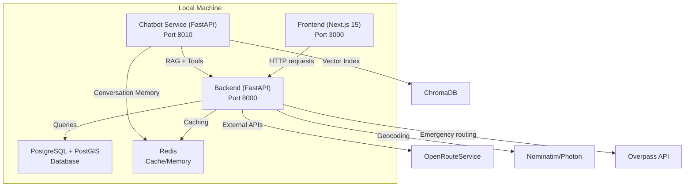
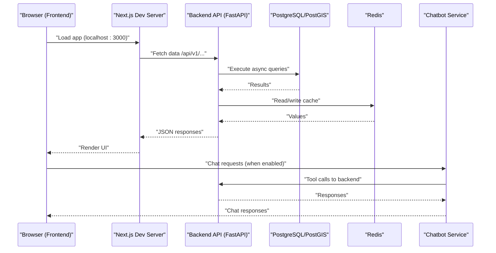

# Getting Started

<cite>
**Referenced Files in This Document**
- [README.md](file://README.md)
- [SETUP.md](file://SETUP.md)
- [backend/main.py](file://backend/main.py)
- [backend/core/config.py](file://backend/core/config.py)
- [backend/core/database.py](file://backend/core/database.py)
- [backend/core/redis_client.py](file://backend/core/redis_client.py)
- [backend/requirements.txt](file://backend/requirements.txt)
- [chatbot_service/main.py](file://chatbot_service/main.py)
- [chatbot_service/config.py](file://chatbot_service/config.py)
- [chatbot_service/requirements.txt](file://chatbot_service/requirements.txt)
- [frontend/package.json](file://frontend/package.json)
- [frontend/next.config.js](file://frontend/next.config.js)
- [docs/Environment.md](file://docs/Environment.md)
- [scripts/data/audit_env.py](file://scripts/data/audit_env.py)
</cite>

## Table of Contents
1. [Introduction](#introduction)
2. [Project Structure](#project-structure)
3. [Prerequisites](#prerequisites)
4. [Installation](#installation)
5. [Environment Variables](#environment-variables)
6. [Database and Redis Setup](#database-and-redis-setup)
7. [Verification and Health Checks](#verification-and-health-checks)
8. [Local Development Workflows](#local-development-workflows)
9. [Architecture Overview](#architecture-overview)
10. [Troubleshooting Guide](#troubleshooting-guide)
11. [Conclusion](#conclusion)

## Introduction
This guide helps you set up the SafeVixAI development environment locally across Windows and Unix-like systems. You will install and run:
- Backend (FastAPI) on port 8000
- Chatbot Service (FastAPI) on port 8010
- Frontend (Next.js PWA) on port 3000

It covers prerequisites, step-by-step installation, environment configuration, database and Redis setup, verification steps, and common troubleshooting.

## Project Structure
SafeVixAI consists of three primary services plus shared documentation and scripts:
- backend/: FastAPI application with PostgreSQL/PostGIS, Redis, DuckDB, and AI services
- chatbot_service/: FastAPI agentic RAG chatbot with 9 LLM providers and ChromaDB
- frontend/: Next.js 15 PWA with offline AI, maps, and React 19
- docs/: Complete technical documentation
- scripts/: Data pipeline and seeding utilities



**Diagram sources**
- [backend/main.py:103-125](file://backend/main.py#L103-L125)
- [chatbot_service/main.py:106-115](file://chatbot_service/main.py#L106-L115)
- [backend/core/config.py:38-48](file://backend/core/config.py#L38-L48)
- [chatbot_service/config.py:82-84](file://chatbot_service/config.py#L82-L84)

**Section sources**
- [README.md:57-70](file://README.md#L57-L70)

## Prerequisites
Ensure the following tools are installed and available on your PATH:
- Python 3.11+ (required by backend and chatbot_service)
- Node.js 20+ (required by frontend)
- Git (for cloning the repository)
- PostgreSQL with PostGIS extension (required by backend)
- Redis (optional but recommended for caching and chatbot memory)

Notes:
- On Windows, use PowerShell or Command Prompt.
- On Unix-like systems (Linux/macOS), use your shell (bash/zsh).

**Section sources**
- [README.md:24-28](file://README.md#L24-L28)
- [SETUP.md:7-16](file://SETUP.md#L7-L16)

## Installation
Follow these steps to install and run all components.

### Step 1: Clone the repository
```bash
cd <your-workspace>
git clone https://github.com/SafeVixAI/SafeVixAI.git
cd SafeVixAI
```

Verify the structure includes backend/, frontend/, chatbot_service/, docs/, and scripts/.

**Section sources**
- [SETUP.md:19-37](file://SETUP.md#L19-L37)

### Step 2: Backend (FastAPI)
1) Create and activate a virtual environment:
```bash
cd backend
python -m venv .venv
# Windows:
.venv\Scripts\activate
# Unix-like:
source .venv/bin/activate
```

2) Install dependencies:
```bash
pip install -r requirements.txt
```

3) Configure environment variables:
```bash
cp .env.example .env
# Edit .env to add required keys (see Environment Variables section)
```

4) Run the backend server:
```bash
uvicorn main:app --reload --port 8000
```

Verify:
- Health: http://localhost:8000/health
- API docs: http://localhost:8000/docs

**Section sources**
- [SETUP.md:41-114](file://SETUP.md#L41-L114)
- [backend/requirements.txt:1-46](file://backend/requirements.txt#L1-L46)
- [backend/main.py:103-125](file://backend/main.py#L103-L125)

### Step 3: Chatbot Service (FastAPI)
1) Create and activate a virtual environment:
```bash
cd chatbot_service
python -m venv .venv
# Windows:
.venv\Scripts\activate
# Unix-like:
source .venv/bin/activate
```

2) Install dependencies:
```bash
pip install -r requirements.txt
```

3) Configure environment variables:
```bash
cp .env.example .env
# Edit .env to add required keys (see Environment Variables section)
```

4) Run the chatbot service:
```bash
uvicorn main:app --reload --port 8010
```

Verify:
- Health: http://localhost:8010/health
- API docs: http://localhost:8010/docs

**Section sources**
- [SETUP.md:117-162](file://SETUP.md#L117-L162)
- [chatbot_service/requirements.txt:1-53](file://chatbot_service/requirements.txt#L1-L53)
- [chatbot_service/main.py:106-115](file://chatbot_service/main.py#L106-L115)

### Step 4: Frontend (Next.js PWA)
1) Install dependencies:
```bash
cd frontend
npm install
```

2) Configure environment variables:
```bash
cp .env.local.example .env.local
# Edit .env.local to set NEXT_PUBLIC_BACKEND_URL=http://localhost:8000
```

3) Run the frontend:
```bash
npm run dev
```

Open http://localhost:3000 in your browser.

Optional offline testing:
- Build and start production server:
  ```bash
  npm run build && npm start
  ```
- In Chrome DevTools, verify Service Worker activation under Application → Service Workers.

**Section sources**
- [SETUP.md:165-236](file://SETUP.md#L165-L236)
- [frontend/package.json:14-13](file://frontend/package.json#L14-L13)
- [frontend/next.config.js:19-39](file://frontend/next.config.js#L19-L39)

## Environment Variables
Configure environment variables per component. The repository includes example files to copy and edit.

### Backend (.env)
Key categories:
- Database connection (PostgreSQL/asyncpg)
- Redis URL (optional)
- External service endpoints (Overpass, Nominatim, OpenRouteService)
- Upload and offline bundle directories
- Chatbot service URL and mode
- CORS origins and timeouts

Notes:
- The backend normalizes database URLs and supports environment-driven overrides.
- The health endpoint reports database availability and cache backend status.

**Section sources**
- [backend/core/config.py:19-70](file://backend/core/config.py#L19-L70)
- [backend/core/config.py:86-96](file://backend/core/config.py#L86-L96)
- [backend/main.py:103-125](file://backend/main.py#L103-L125)
- [docs/Environment.md:87-92](file://docs/Environment.md#L87-L92)

### Chatbot Service (.env)
Key categories:
- LLM provider configuration (GROQ_API_KEY, GOOGLE_API_KEY, etc.)
- MAIN_BACKEND_BASE_URL (points to backend)
- Redis URL (conversation memory)
- ChromaDB persistence and RAG data directories
- Embedding model and retrieval parameters
- Speech model and translation settings
- Weather, W3W, and geocoding API keys

Validation:
- At least one LLM provider key must be set; otherwise startup fails.

**Section sources**
- [chatbot_service/config.py:40-66](file://chatbot_service/config.py#L40-L66)
- [chatbot_service/config.py:71-113](file://chatbot_service/config.py#L71-L113)
- [chatbot_service/config.py:119-125](file://chatbot_service/config.py#L119-L125)
- [docs/Environment.md:67-108](file://docs/Environment.md#L67-L108)

### Frontend (.env.local)
Key variables:
- NEXT_PUBLIC_BACKEND_URL (default: http://localhost:8000)
- Optional map tile API keys if using premium tiles

**Section sources**
- [SETUP.md:200-210](file://SETUP.md#L200-L210)
- [frontend/package.json:14-13](file://frontend/package.json#L14-L13)

## Database and Redis Setup
### PostgreSQL and PostGIS
- Backend expects a PostgreSQL database with asyncpg and uses SQLAlchemy async sessions.
- The default database URL is configurable via environment variables.
- The health endpoint checks connectivity by executing a simple query.

Recommended steps:
- Install PostgreSQL and enable PostGIS extension.
- Create a database and user for the application.
- Set DATABASE_URL in backend/.env accordingly.

**Section sources**
- [backend/core/database.py:21-29](file://backend/core/database.py#L21-L29)
- [backend/core/database.py:43-49](file://backend/core/database.py#L43-L49)
- [backend/core/config.py:19](file://backend/core/config.py#L19)
- [backend/main.py:103-125](file://backend/main.py#L103-L125)

### Redis
- Backend uses Redis for caching and graceful fallback to in-memory storage if unavailable.
- Chatbot service uses Redis for conversation memory and rate limiting.
- Set REDIS_URL in respective .env files to enable persistent cache/memory.

**Section sources**
- [backend/core/redis_client.py:136-139](file://backend/core/redis_client.py#L136-L139)
- [backend/main.py:103-125](file://backend/main.py#L103-L125)
- [chatbot_service/config.py:84](file://chatbot_service/config.py#L84)
- [chatbot_service/main.py:106-115](file://chatbot_service/main.py#L106-L115)

## Verification and Health Checks
- Backend: GET http://localhost:8000/health
  - Returns database and cache availability, environment, and version.
- Chatbot Service: GET http://localhost:8000/health
  - Returns memory availability and service status.
- Frontend: http://localhost:3000
  - Should show the Next.js app with map and navigation.

Additional quick checks:
- Backend API docs: http://localhost:8000/docs
- Chatbot API docs: http://localhost:8010/docs

**Section sources**
- [backend/main.py:103-125](file://backend/main.py#L103-L125)
- [chatbot_service/main.py:106-115](file://chatbot_service/main.py#L106-L115)
- [README.md:42-53](file://README.md#L42-L53)

## Local Development Workflows
- Keep three terminals running:
  - Backend: uvicorn main:app --reload --port 8000
  - Chatbot Service: uvicorn main:app --reload --port 8010
  - Frontend: npm run dev
- Hot reload is enabled for all services:
  - Backend uses Uvicorn reload.
  - Frontend uses Next.js dev server.
  - Chatbot uses Uvicorn reload.

Testing commands:
- Backend tests: pytest tests/ -v
- Frontend tests: npm test
- Chatbot tests: pytest tests/ -v

**Section sources**
- [SETUP.md:240-312](file://SETUP.md#L240-L312)
- [README.md:22-53](file://README.md#L22-L53)

## Architecture Overview
High-level runtime architecture during local development:



**Diagram sources**
- [backend/main.py:103-125](file://backend/main.py#L103-L125)
- [chatbot_service/main.py:106-115](file://chatbot_service/main.py#L106-L115)
- [backend/core/database.py:38-49](file://backend/core/database.py#L38-L49)
- [backend/core/redis_client.py:115-124](file://backend/core/redis_client.py#L115-L124)

## Troubleshooting Guide
Common issues and resolutions:

- ModuleNotFoundError in backend
  - Ensure the Python virtual environment is activated and dependencies installed.
  - Reinstall with pip install -r requirements.txt.

- Map not displaying in browser
  - Confirm dynamic imports for MapLibre components and CSS imports in layout.tsx.

- GROQ_API_KEY missing error
  - Create a free account at console.groq.com and add the key to backend/.env.

- Port already in use
  - On Windows: netstat -ano | findstr :<PORT> followed by taskkill /PID <PID> /F.
  - Change port via command-line flags or environment variables.

- CORS warnings
  - Set CORS_ORIGINS in backend/.env to match frontend origin (localhost:3000).

- Database connectivity
  - Verify DATABASE_URL format and credentials.
  - Use the health endpoint to confirm database availability.

- Redis connectivity
  - Set REDIS_URL in backend/.env and chatbot_service/.env.
  - The backend falls back to in-memory cache if Redis is down.

- LLM provider configuration
  - At least one provider key must be present in chatbot_service/.env.
  - See docs/Environment.md for supported keys.

- Environment audit
  - Use scripts/data/audit_env.py to compare current .env files against expectations.

**Section sources**
- [SETUP.md:316-342](file://SETUP.md#L316-L342)
- [docs/Environment.md:67-108](file://docs/Environment.md#L67-L108)
- [scripts/data/audit_env.py:1-29](file://scripts/data/audit_env.py#L1-L29)

## Conclusion
You now have the SafeVixAI backend, chatbot service, and frontend running locally with hot reload and basic health checks. Proceed to explore the documentation and scripts for data seeding, offline capabilities, and advanced features.