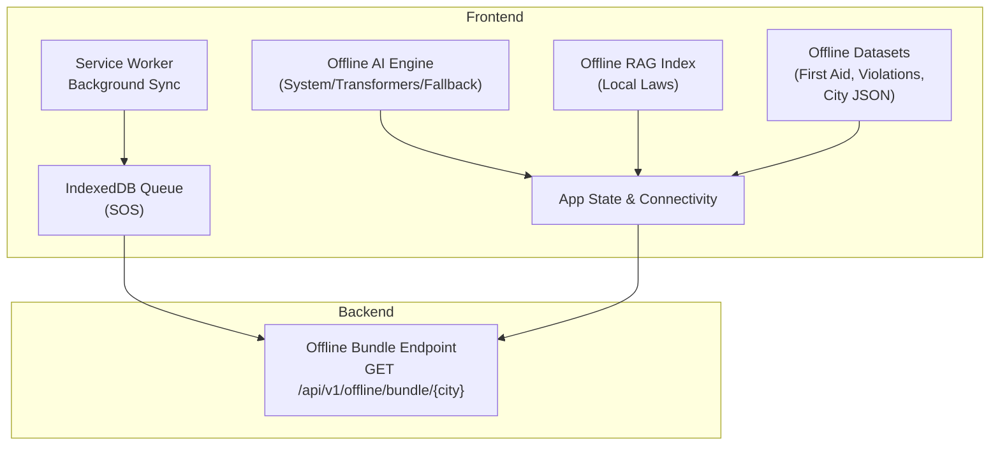
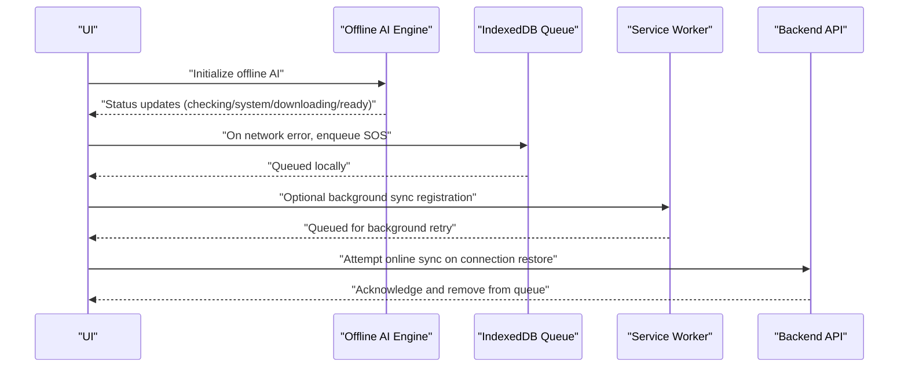
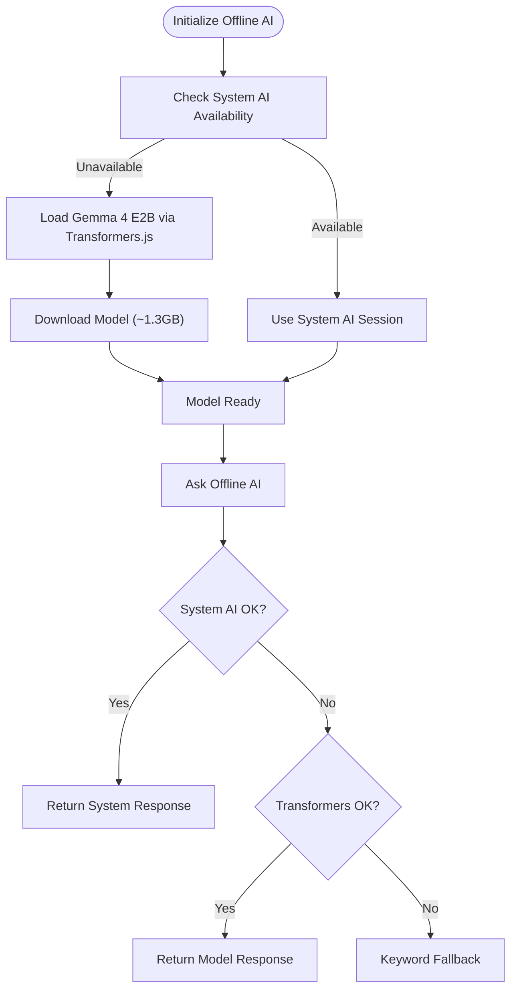
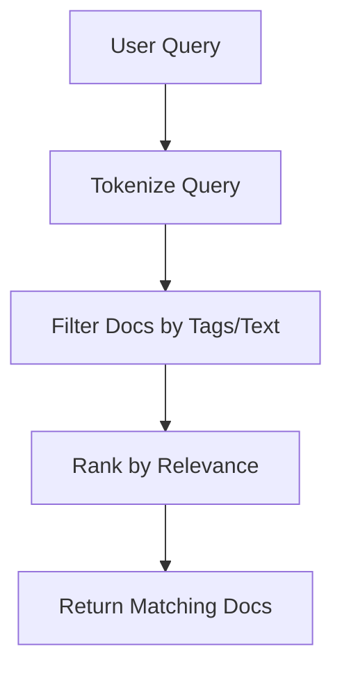
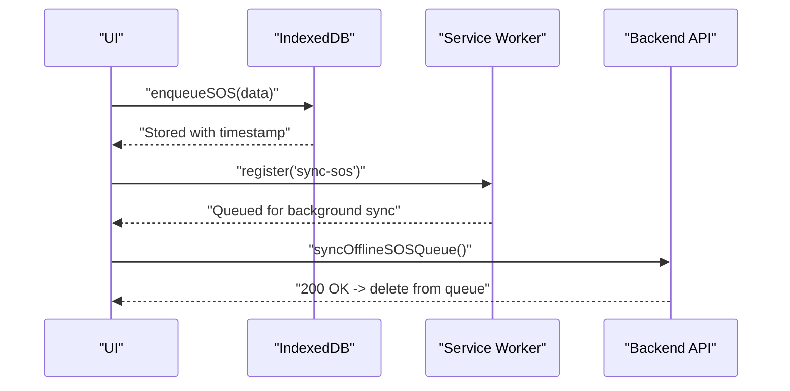
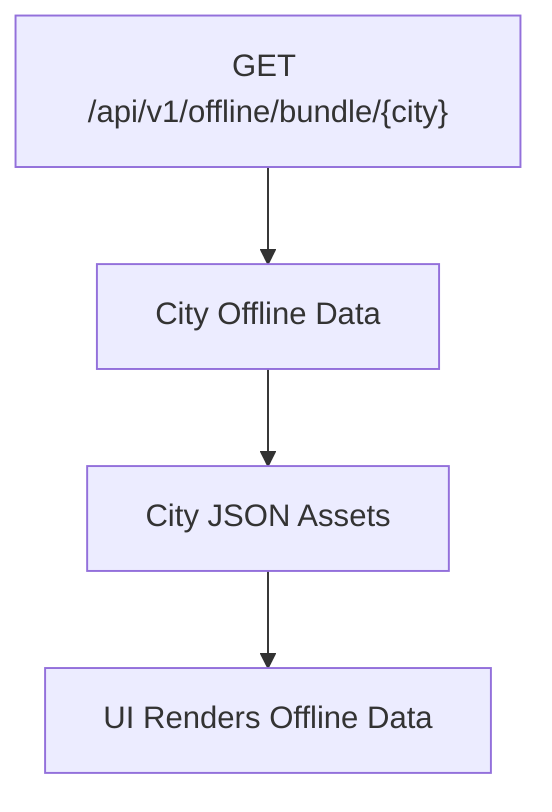
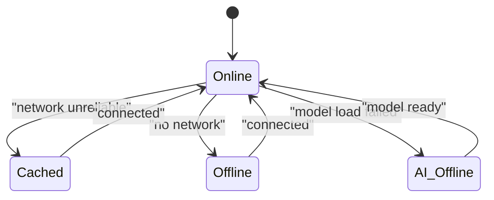
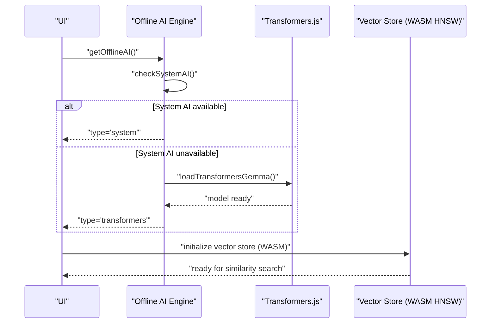
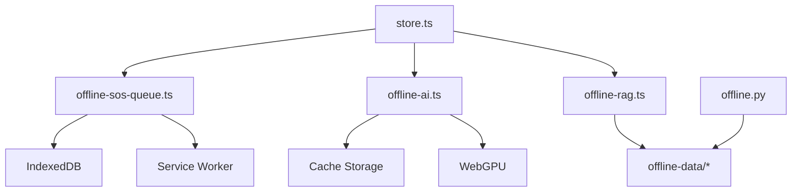

# Offline Architecture

<cite>
**Referenced Files in This Document**
- [Offline_Architecture.md](file://docs/Offline_Architecture.md)
- [offline-ai.ts](file://frontend/lib/offline-ai.ts)
- [offline-rag.ts](file://frontend/lib/offline-rag.ts)
- [offline-sos-queue.ts](file://frontend/lib/offline-sos-queue.ts)
- [OfflineChat.tsx](file://frontend/components/OfflineChat.tsx)
- [store.ts](file://frontend/lib/store.ts)
- [offline.py](file://backend/api/v1/offline.py)
- [first-aid.json](file://frontend/public/offline-data/first-aid.json)
- [violations.csv](file://frontend/public/offline-data/violations.csv)
- [chennai.json](file://frontend/public/offline-data/chennai.json)
</cite>

## Table of Contents
1. [Introduction](#introduction)
2. [Project Structure](#project-structure)
3. [Core Components](#core-components)
4. [Architecture Overview](#architecture-overview)
5. [Detailed Component Analysis](#detailed-component-analysis)
6. [Dependency Analysis](#dependency-analysis)
7. [Performance Considerations](#performance-considerations)
8. [Troubleshooting Guide](#troubleshooting-guide)
9. [Conclusion](#conclusion)
10. [Appendices](#appendices)

## Introduction
This document explains the offline-first architecture implemented in the project. It covers service worker registration, IndexedDB storage strategies, offline data bundling for 25 major Indian cities, and progressive enhancement patterns that preserve core functionality without network connectivity. It documents offline AI model loading, vector store initialization, and emergency service caching. It also outlines configuration options for cache policies, data synchronization, and conflict resolution, and clarifies relationships with online functionality and data consistency mechanisms. Practical guidance is included for storage limits, cache invalidation, and offline queue management.

## Project Structure
The offline architecture spans frontend libraries, backend endpoints, and bundled offline datasets:
- Frontend offline engines and stores:
  - Offline AI engine and fallback logic
  - Offline RAG simulation and keyword index
  - IndexedDB-backed offline SOS queue with background sync hooks
  - Application state and connectivity tracking
- Backend offline bundle endpoint for city-specific data
- Offline datasets for first aid, traffic violations, and city data



**Diagram sources**
- [offline-ai.ts:1-256](file://frontend/lib/offline-ai.ts#L1-L256)
- [offline-rag.ts:1-35](file://frontend/lib/offline-rag.ts#L1-L35)
- [offline-sos-queue.ts:1-138](file://frontend/lib/offline-sos-queue.ts#L1-L138)
- [store.ts:1-226](file://frontend/lib/store.ts#L1-L226)
- [offline.py:18-28](file://backend/api/v1/offline.py#L18-L28)

**Section sources**
- [Offline_Architecture.md:1-23](file://docs/Offline_Architecture.md#L1-L23)
- [offline-ai.ts:1-256](file://frontend/lib/offline-ai.ts#L1-L256)
- [offline-rag.ts:1-35](file://frontend/lib/offline-rag.ts#L1-L35)
- [offline-sos-queue.ts:1-138](file://frontend/lib/offline-sos-queue.ts#L1-L138)
- [store.ts:1-226](file://frontend/lib/store.ts#L1-L226)
- [offline.py:18-28](file://backend/api/v1/offline.py#L18-L28)
- [first-aid.json:1-388](file://frontend/public/offline-data/first-aid.json#L1-L388)
- [violations.csv:1-27](file://frontend/public/offline-data/violations.csv#L1-L27)
- [chennai.json:1-200](file://frontend/public/offline-data/chennai.json#L1-L200)

## Core Components
- Offline AI Engine
  - Progressive fallback: Chrome/Android built-in AI, Transformers.js Gemma 4 E2B, keyword fallback
  - Uses browser cache storage and WebGPU acceleration when available
  - Exposes initialization, querying, readiness checks, and progress callbacks
- Offline RAG Index
  - Local keyword-based similarity search over MV Act citations
  - Simulates vector search behavior for demos; production would use WASM HNSW
- IndexedDB Offline SOS Queue
  - Stores SOS events with timestamps and auto-increments IDs
  - Provides enqueue, sync, and automatic sync-on-online listeners
  - Integrates optional background sync registration
- Application State and Connectivity
  - Tracks GPS, nearby services, road issues, AI mode, connectivity state, and user profile persistence
- Offline Data Bundles
  - City-specific JSON and CSV datasets for first aid, violations, and localized hazard info
  - Backend endpoint to serve per-city offline bundles

**Section sources**
- [offline-ai.ts:114-221](file://frontend/lib/offline-ai.ts#L114-L221)
- [offline-rag.ts:18-34](file://frontend/lib/offline-rag.ts#L18-L34)
- [offline-sos-queue.ts:22-137](file://frontend/lib/offline-sos-queue.ts#L22-L137)
- [store.ts:60-127](file://frontend/lib/store.ts#L60-L127)
- [offline.py:18-28](file://backend/api/v1/offline.py#L18-L28)
- [first-aid.json:1-388](file://frontend/public/offline-data/first-aid.json#L1-L388)
- [violations.csv:1-27](file://frontend/public/offline-data/violations.csv#L1-L27)

## Architecture Overview
The offline-first architecture ensures core functionality remains available without network connectivity:
- Service Worker and Background Sync
  - Queues offline actions (e.g., SOS submissions) and attempts to flush them when online
  - Integrates with browser SyncManager for background retries
- IndexedDB Persistence
  - Stores queued events and metadata reliably across sessions
- Offline AI and RAG
  - Loads models on demand with clear fallbacks and user consent
  - Provides deterministic keyword-based responses when models are unavailable
- Offline Data Bundles
  - Serves city-specific datasets via backend endpoint for offline rendering and search
- Progressive Enhancement
  - UI adapts to connectivity state, prioritizing cached data and local computations



**Diagram sources**
- [offline-ai.ts:114-221](file://frontend/lib/offline-ai.ts#L114-L221)
- [offline-sos-queue.ts:48-137](file://frontend/lib/offline-sos-queue.ts#L48-L137)
- [offline.py:18-28](file://backend/api/v1/offline.py#L18-L28)

## Detailed Component Analysis

### Offline AI Engine
The offline AI engine implements a layered strategy:
- System AI (Chrome/Android AICore): zero-download, instant availability
- Transformers.js Gemma 4 E2B: GPU-accelerated inference with 4-bit quantization
- Keyword fallback: deterministic responses based on cached offline data

Key behaviors:
- Initialization requires explicit user confirmation to avoid large downloads
- Progress callbacks enable UI feedback for long downloads
- Graceful degradation to keyword fallback if model fails to load
- Audio input supported when available



**Diagram sources**
- [offline-ai.ts:47-154](file://frontend/lib/offline-ai.ts#L47-L154)

**Section sources**
- [offline-ai.ts:114-221](file://frontend/lib/offline-ai.ts#L114-L221)
- [Offline_Architecture.md:4](file://docs/Offline_Architecture.md#L4)

### Offline RAG Index
The offline RAG simulates vector similarity search using a local keyword index:
- Local dataset of MV Act citations with tags and text
- Simulated latency to mimic real vector search
- Keyword matching filters documents by tags or text inclusion

Production-ready RAG would replace keyword matching with WASM-based HNSWlib for true similarity search.



**Diagram sources**
- [offline-rag.ts:22-34](file://frontend/lib/offline-rag.ts#L22-L34)

**Section sources**
- [offline-rag.ts:18-34](file://frontend/lib/offline-rag.ts#L18-L34)

### IndexedDB Offline SOS Queue
The SOS queue persists emergency events when offline and synchronizes them upon reconnect:
- IndexedDB schema with auto-incremented keys and timestamp index
- Enqueue operation records location, optional user info, and timestamp
- Sync iterates through queued entries, sends to backend, and deletes successful items
- Automatic sync listener triggers on network restoration
- Optional background sync registration via ServiceWorker SyncManager



**Diagram sources**
- [offline-sos-queue.ts:48-137](file://frontend/lib/offline-sos-queue.ts#L48-L137)

**Section sources**
- [offline-sos-queue.ts:22-137](file://frontend/lib/offline-sos-queue.ts#L22-L137)
- [Offline_Architecture.md:4](file://docs/Offline_Architecture.md#L4)

### Offline Data Bundling for 25 Major Indian Cities
Offline data is organized as city-specific JSON and CSV assets:
- City JSON: localized hazard and service data for offline rendering
- Violations CSV: cached MV Act penalties for offline calculations
- First Aid JSON: cached first aid steps and guidance for offline triage

The backend exposes an endpoint to serve per-city offline bundles, enabling clients to fetch and cache city-specific data for offline use.



**Diagram sources**
- [offline.py:18-28](file://backend/api/v1/offline.py#L18-L28)
- [chennai.json:1-200](file://frontend/public/offline-data/chennai.json#L1-L200)
- [violations.csv:1-27](file://frontend/public/offline-data/violations.csv#L1-L27)
- [first-aid.json:1-388](file://frontend/public/offline-data/first-aid.json#L1-L388)

**Section sources**
- [offline.py:18-28](file://backend/api/v1/offline.py#L18-L28)
- [chennai.json:1-200](file://frontend/public/offline-data/chennai.json#L1-L200)
- [violations.csv:1-27](file://frontend/public/offline-data/violations.csv#L1-L27)
- [first-aid.json:1-388](file://frontend/public/offline-data/first-aid.json#L1-L388)

### Progressive Enhancement Patterns
The application progressively enhances functionality based on connectivity and capability:
- Connectivity state tracked in app state (online/cached/offline/ai-offline)
- Offline AI readiness gates model usage
- Offline RAG provides deterministic results when vector search is unavailable
- Offline datasets power UI rendering and search without network calls
- IndexedDB queues ensure offline submissions are not lost



**Diagram sources**
- [store.ts:60-92](file://frontend/lib/store.ts#L60-L92)
- [offline-ai.ts:213-221](file://frontend/lib/offline-ai.ts#L213-L221)

**Section sources**
- [store.ts:60-92](file://frontend/lib/store.ts#L60-L92)
- [offline-ai.ts:213-221](file://frontend/lib/offline-ai.ts#L213-L221)

### Offline AI Model Loading and Vector Store Initialization
- Offline AI loading:
  - Checks for system AI (zero-download)
  - Falls back to Transformers.js Gemma 4 E2B with WebGPU acceleration
  - Progress callbacks and readiness checks inform UI
- Vector store initialization:
  - Current implementation uses keyword matching
  - Production would initialize WASM HNSWlib for similarity search



**Diagram sources**
- [offline-ai.ts:124-154](file://frontend/lib/offline-ai.ts#L124-L154)
- [offline-rag.ts:22-34](file://frontend/lib/offline-rag.ts#L22-L34)

**Section sources**
- [offline-ai.ts:124-154](file://frontend/lib/offline-ai.ts#L124-L154)
- [offline-rag.ts:22-34](file://frontend/lib/offline-rag.ts#L22-L34)

### Emergency Service Caching
Emergency services are cached locally and rendered without network connectivity:
- First Aid JSON provides offline triage guidance
- Violations CSV enables offline challan calculations
- City JSON provides localized emergency data for offline rendering

```mermaid
graph TB
FA["First Aid JSON"] --> UI["UI"]
VF["Violations CSV"] --> UI
CJ["City JSON"] --> UI
UI --> "Render Offline Services"
```

**Diagram sources**
- [first-aid.json:1-388](file://frontend/public/offline-data/first-aid.json#L1-L388)
- [violations.csv:1-27](file://frontend/public/offline-data/violations.csv#L1-L27)
- [chennai.json:1-200](file://frontend/public/offline-data/chennai.json#L1-L200)

**Section sources**
- [first-aid.json:1-388](file://frontend/public/offline-data/first-aid.json#L1-L388)
- [violations.csv:1-27](file://frontend/public/offline-data/violations.csv#L1-L27)
- [chennai.json:1-200](file://frontend/public/offline-data/chennai.json#L1-L200)

## Dependency Analysis
The offline architecture exhibits clear separation of concerns:
- Frontend libraries depend on browser APIs (Service Worker, IndexedDB, Cache Storage)
- Backend depends on city-specific data and emergency services
- Offline datasets decouple UI rendering from network availability



**Diagram sources**
- [offline-ai.ts:114-221](file://frontend/lib/offline-ai.ts#L114-L221)
- [offline-rag.ts:18-34](file://frontend/lib/offline-rag.ts#L18-L34)
- [offline-sos-queue.ts:22-137](file://frontend/lib/offline-sos-queue.ts#L22-L137)
- [store.ts:60-127](file://frontend/lib/store.ts#L60-L127)
- [offline.py:18-28](file://backend/api/v1/offline.py#L18-L28)

**Section sources**
- [offline-ai.ts:114-221](file://frontend/lib/offline-ai.ts#L114-L221)
- [offline-rag.ts:18-34](file://frontend/lib/offline-rag.ts#L18-L34)
- [offline-sos-queue.ts:22-137](file://frontend/lib/offline-sos-queue.ts#L22-L137)
- [store.ts:60-127](file://frontend/lib/store.ts#L60-L127)
- [offline.py:18-28](file://backend/api/v1/offline.py#L18-L28)

## Performance Considerations
- Model loading
  - Prefer system AI when available to avoid large downloads
  - Use WebGPU acceleration for faster inference
  - Provide progress callbacks to manage perceived performance
- IndexedDB
  - Batch reads/writes to minimize transaction overhead
  - Use indexes (e.g., timestamp) for efficient queries
- Offline data
  - Compress and chunk datasets for faster initial load
  - Cache frequently accessed resources in browser Cache Storage
- Background sync
  - Limit batch sizes and retry intervals to avoid overwhelming the network
  - Respect backoff strategies and user connectivity state

## Troubleshooting Guide
Common issues and resolutions:
- Storage limits
  - IndexedDB quotas vary by browser; implement eviction strategies for older entries
  - Monitor storage usage and warn users when approaching limits
- Cache invalidation
  - Version offline datasets and invalidate old caches on updates
  - Clear model caches when switching between system and Transformers.js modes
- Offline queue management
  - On network errors, retain items and surface retry options
  - Implement per-item backoff and prioritize recent entries
- Conflict resolution
  - Use backend-side reconciliation for overlapping offline events
  - Consider optimistic updates with eventual consistency guarantees
- Service worker registration
  - Fallback gracefully if SyncManager is unavailable
  - Verify HTTPS and proper scope for background sync

**Section sources**
- [offline-sos-queue.ts:60-68](file://frontend/lib/offline-sos-queue.ts#L60-L68)
- [Offline_Architecture.md:8-23](file://docs/Offline_Architecture.md#L8-L23)

## Conclusion
The offline-first architecture delivers resilient functionality across connectivity scenarios. By combining system AI, Transformers.js, and keyword fallbacks, the AI engine remains responsive and accessible. IndexedDB and background sync ensure offline submissions are not lost. Offline datasets power UI rendering and search, while the backend provides city-specific bundles. Progressive enhancement patterns guarantee core features remain functional even without network connectivity. With careful attention to storage limits, cache invalidation, and queue management, the system scales to real-world usage.

## Appendices
- Configuration options
  - Offline AI: user-initiated model loading, progress callbacks, readiness checks
  - IndexedDB: schema versioning, indexes, transaction batching
  - Background sync: registration, retry policy, backoff
  - Cache policies: dataset versioning, browser cache usage, TTL
  - Data synchronization: per-item retries, conflict resolution, reconciliation
- Data consistency
  - Offline queues and IndexedDB provide durability
  - Backend endpoint serves consistent city bundles
  - UI reflects connectivity state and offline capabilities