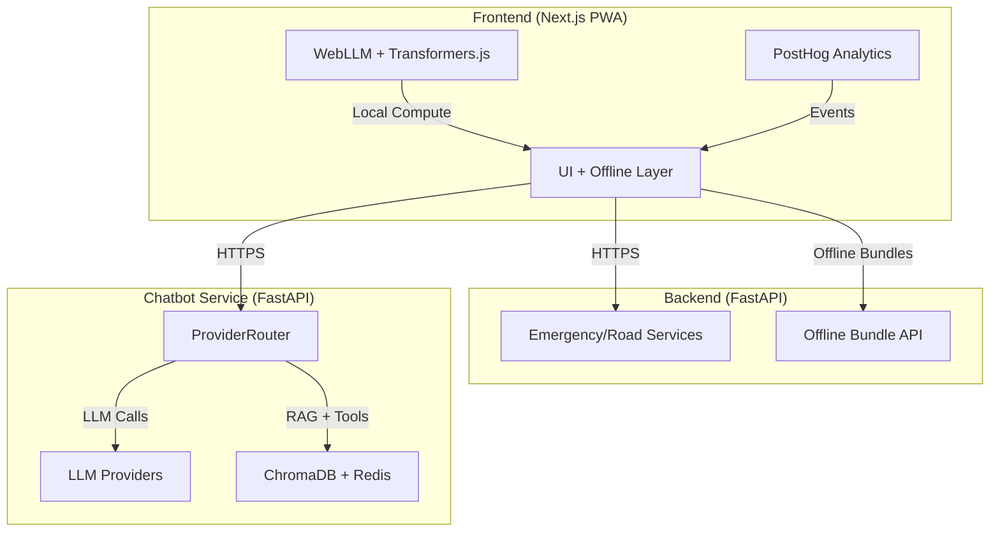
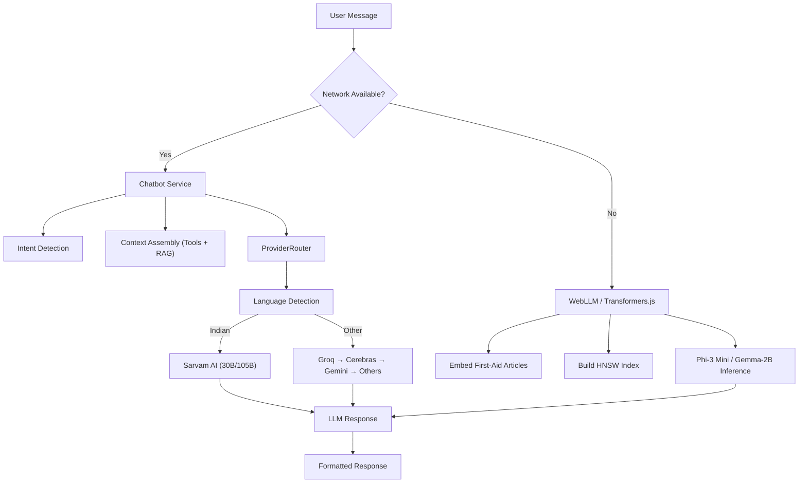
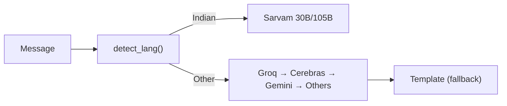
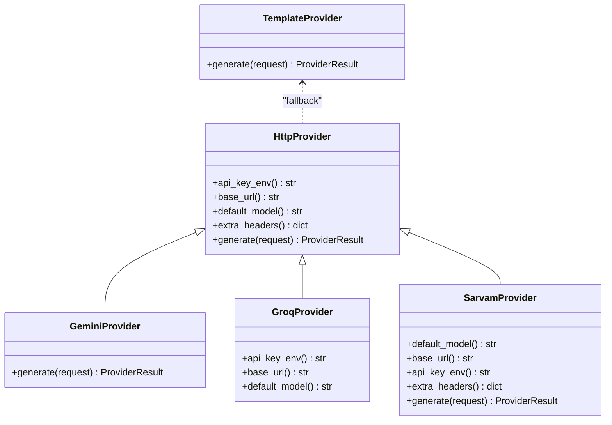
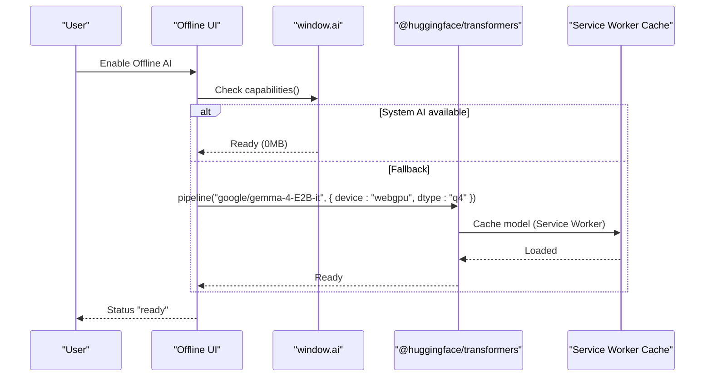
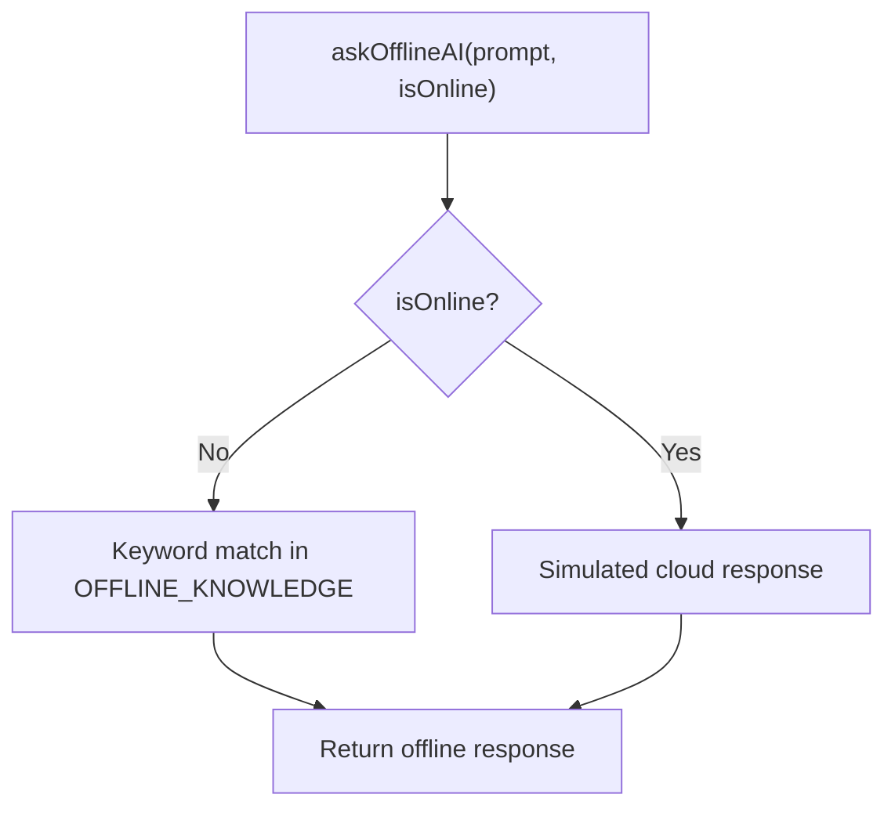
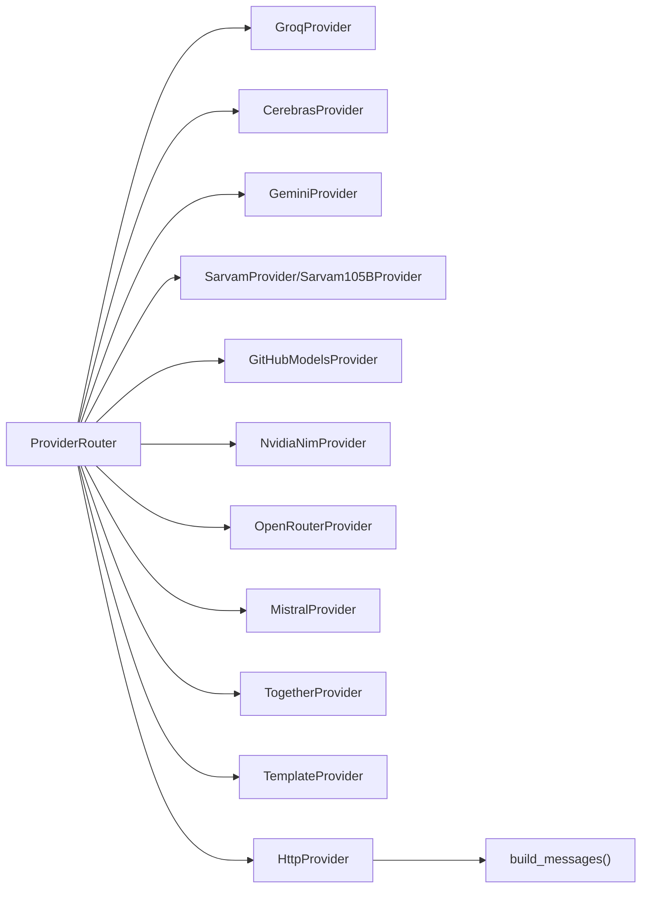

# AI Inference Optimization

<cite>
**Referenced Files in This Document**
- [router.py](file://chatbot_service/providers/router.py)
- [base.py](file://chatbot_service/providers/base.py)
- [config.py](file://chatbot_service/config.py)
- [gemini_provider.py](file://chatbot_service/providers/gemini_provider.py)
- [groq_provider.py](file://chatbot_service/providers/groq_provider.py)
- [sarvam_provider.py](file://chatbot_service/providers/sarvam_provider.py)
- [offline-ai.ts](file://frontend/lib/offline-ai.ts)
- [edge-ai.ts](file://frontend/lib/edge-ai.ts)
- [OfflineChat.tsx](file://frontend/components/OfflineChat.tsx)
- [ModelLoader.tsx](file://frontend/components/ModelLoader.tsx)
- [Architecture.md](file://docs/Architecture.md)
- [AI_Instructions.md](file://docs/AI_Instructions.md)
- [offline.py](file://backend/api/v1/offline.py)
- [AnalyticsProvider.tsx](file://frontend/lib/analytics-provider.tsx)
</cite>

## Table of Contents
1. [Introduction](#introduction)
2. [Project Structure](#project-structure)
3. [Core Components](#core-components)
4. [Architecture Overview](#architecture-overview)
5. [Detailed Component Analysis](#detailed-component-analysis)
6. [Dependency Analysis](#dependency-analysis)
7. [Performance Considerations](#performance-considerations)
8. [Troubleshooting Guide](#troubleshooting-guide)
9. [Conclusion](#conclusion)
10. [Appendices](#appendices)

## Introduction
This document provides a comprehensive guide to AI inference optimization for SafeVixAI’s machine learning components. It explains how the system integrates multiple LLM backends with robust provider routing, quantization and memory management for offline WebAssembly/WebGPU execution, and strategies for latency reduction, batching, edge computing, warm-up procedures, and resource allocation. It also covers performance monitoring and observability for AI model inference.

## Project Structure
SafeVixAI is organized as a three-service monorepo:
- Backend (FastAPI): Emergency locator, challan calculator, road reporting, geocoding.
- Chatbot Service (FastAPI): Agentic RAG chatbot, 9-provider fallback chain, Indian language routing.
- Frontend (Next.js PWA): UI, offline AI (WebLLM, DuckDB-Wasm), analytics.

**Diagram sources**
- [Architecture.md:67-91](file://docs/Architecture.md#L67-L91)
- [Architecture.md:105-122](file://docs/Architecture.md#L105-L122)

**Section sources**
- [Architecture.md:49-58](file://docs/Architecture.md#L49-L58)
- [Architecture.md:63-102](file://docs/Architecture.md#L63-L102)

## Core Components
- ProviderRouter orchestrates multi-backend LLM inference with intelligent routing and fallback.
- HttpProvider and TemplateProvider define the HTTP abstraction and deterministic fallback.
- GeminiProvider and GroqProvider implement OpenAI-compatible endpoints.
- SarvamProvider supports Indian language routing with direct API and OpenRouter fallback.
- Frontend offline engines (WebLLM, Transformers.js) enable WebGPU-accelerated inference with quantization.
- Edge AI simulates on-device inference for development and edge-case scenarios.
- Offline bundle API prepares offline data for the frontend.

**Section sources**
- [router.py:75-199](file://chatbot_service/providers/router.py#L75-L199)
- [base.py:90-206](file://chatbot_service/providers/base.py#L90-L206)
- [gemini_provider.py:18-71](file://chatbot_service/providers/gemini_provider.py#L18-L71)
- [groq_provider.py:10-23](file://chatbot_service/providers/groq_provider.py#L10-L23)
- [sarvam_provider.py:44-125](file://chatbot_service/providers/sarvam_provider.py#L44-L125)
- [offline-ai.ts:1-256](file://frontend/lib/offline-ai.ts#L1-L256)
- [edge-ai.ts:1-29](file://frontend/lib/edge-ai.ts#L1-L29)
- [offline.py:18-28](file://backend/api/v1/offline.py#L18-L28)

## Architecture Overview
SafeVixAI implements a dual-layer AI architecture:
- Online: Agentic RAG with 9-provider fallback chain, Indian language routing via Sarvam AI, and RAG against legal and first-aid documents.
- Offline: WebLLM Phi-3 Mini (4-bit) or Gemma-2B (WASM) with HNSWlib.js vector search and first-aid knowledge.

**Diagram sources**
- [Architecture.md:67-91](file://docs/Architecture.md#L67-L91)
- [router.py:125-199](file://chatbot_service/providers/router.py#L125-L199)
- [AI_Instructions.md:98-149](file://docs/AI_Instructions.md#L98-L149)

## Detailed Component Analysis

### Provider Routing and Fallback Strategy
The ProviderRouter implements a strict, prioritized fallback chain optimized for speed, capacity, and specialization:
- Tier 1 (Critical): Groq (fastest English), Cerebras (speed overflow), Gemini (large context).
- Tier 2 (High): GitHub Models, NVIDIA NIM.
- Tier 3 (Medium): OpenRouter, Mistral, Together.
- Fallback template provider guarantees resilience.

Routing logic:
- Detects Indian languages via Unicode script ranges.
- Routes legal/high-stakes intents to Sarvam-105B.
- Supports explicit provider hints and defaults.

**Diagram sources**
- [router.py:48-73](file://chatbot_service/providers/router.py#L48-L73)
- [router.py:125-153](file://chatbot_service/providers/router.py#L125-L153)
- [router.py:113-123](file://chatbot_service/providers/router.py#L113-L123)

**Section sources**
- [router.py:1-10](file://chatbot_service/providers/router.py#L1-L10)
- [router.py:125-199](file://chatbot_service/providers/router.py#L125-L199)
- [base.py:44-63](file://chatbot_service/providers/base.py#L44-L63)

### Provider Implementations
- HttpProvider: Shared async HTTP transport, prompt building, safety filtering, and OpenAI-compatible payload construction.
- GeminiProvider: Uses Gemini REST endpoint with system instruction translation and OpenAI-style messages conversion.
- GroqProvider: OpenAI-compatible endpoint for English queries.
- SarvamProvider: Dual-mode routing to Sarvam direct API or OpenRouter fallback with model routing headers.

**Diagram sources**
- [base.py:90-160](file://chatbot_service/providers/base.py#L90-L160)
- [gemini_provider.py:18-71](file://chatbot_service/providers/gemini_provider.py#L18-L71)
- [groq_provider.py:10-23](file://chatbot_service/providers/groq_provider.py#L10-L23)
- [sarvam_provider.py:44-125](file://chatbot_service/providers/sarvam_provider.py#L44-L125)

**Section sources**
- [base.py:65-88](file://chatbot_service/providers/base.py#L65-L88)
- [gemini_provider.py:29-71](file://chatbot_service/providers/gemini_provider.py#L29-L71)
- [groq_provider.py:15-23](file://chatbot_service/providers/groq_provider.py#L15-L23)
- [sarvam_provider.py:58-117](file://chatbot_service/providers/sarvam_provider.py#L58-L117)

### Offline Inference with WebAssembly and WebGPU
The frontend provides two offline engines:
- Chrome Built-in AI (window.ai): Zero download, instant availability on supported devices.
- Transformers.js + WebGPU: Downloads Gemma-4-E2B-it (quantized) and caches it; falls back to WASM if GPU unavailable.

**Diagram sources**
- [offline-ai.ts:47-154](file://frontend/lib/offline-ai.ts#L47-L154)

**Section sources**
- [offline-ai.ts:1-256](file://frontend/lib/offline-ai.ts#L1-L256)
- [AI_Instructions.md:98-149](file://docs/AI_Instructions.md#L98-L149)

### Edge Computing Simulation and Warm-Up
The edge-ai module simulates on-device inference behavior and can be used to evaluate latency characteristics during development. It demonstrates:
- Deterministic offline responses for keywords.
- Online response simulation with a delay to mimic API latency.

**Diagram sources**
- [edge-ai.ts:15-28](file://frontend/lib/edge-ai.ts#L15-L28)

**Section sources**
- [edge-ai.ts:1-29](file://frontend/lib/edge-ai.ts#L1-L29)

### Offline Bundle API
The backend exposes an endpoint to build offline bundles for cities, enabling the frontend to cache emergency data and reduce reliance on network connectivity.

**Section sources**
- [offline.py:18-28](file://backend/api/v1/offline.py#L18-L28)

## Dependency Analysis
ProviderRouter depends on:
- Language detection utilities.
- Provider implementations (Groq, Cerebras, Gemini, Sarvam variants, GitHub, NVIDIA, OpenRouter, Mistral, Together).
- Base provider abstractions for HTTP transport and message building.

**Diagram sources**
- [router.py:85-109](file://chatbot_service/providers/router.py#L85-L109)
- [base.py:65-88](file://chatbot_service/providers/base.py#L65-L88)

**Section sources**
- [router.py:16-31](file://chatbot_service/providers/router.py#L16-L31)
- [base.py:90-160](file://chatbot_service/providers/base.py#L90-L160)

## Performance Considerations

### Model Quantization and Memory Management
- WebLLM and Transformers.js use 4-bit quantization to fit large models in browser memory.
- WebGPU acceleration reduces inference latency; fallback to WASM ensures compatibility.
- Model caching via Service Worker persists downloaded assets for reuse.

Optimization tips:
- Prefer WebGPU-capable devices for best latency.
- Use dtype q4 for reduced memory footprint.
- Cache model artifacts to avoid repeated downloads.

**Section sources**
- [offline-ai.ts:87-110](file://frontend/lib/offline-ai.ts#L87-L110)
- [AI_Instructions.md:103-107](file://docs/AI_Instructions.md#L103-L107)

### Provider Routing and Latency Optimization
- Primary English queries route to Groq for highest throughput.
- Large-context or legal queries route to Gemini for extended context windows.
- Sarvam AI handles Indian languages with specialized accuracy.
- Fallback chain ensures resilience under provider failures.

Selection criteria:
- Intent classification and language detection drive provider choice.
- Provider timeouts and rate limits are mitigated by ordered fallback.

**Section sources**
- [router.py:125-153](file://chatbot_service/providers/router.py#L125-L153)
- [router.py:113-123](file://chatbot_service/providers/router.py#L113-L123)
- [gemini_provider.py:29-71](file://chatbot_service/providers/gemini_provider.py#L29-L71)
- [groq_provider.py:10-23](file://chatbot_service/providers/groq_provider.py#L10-L23)

### Batch Processing Strategies
- Frontend offline inference processes one query at a time; batching is not applicable.
- Online chatbot batches tool calls concurrently via context assembly and stores conversation history in Redis for minimal round trips.

Recommendations:
- Use streaming responses where supported to improve perceived latency.
- Aggregate small tool calls into a single context assembly pass.

**Section sources**
- [base.py:129-159](file://chatbot_service/providers/base.py#L129-L159)

### Edge Computing Optimizations
- Use Chrome Built-in AI when available to eliminate model download costs.
- Warm up the model on user consent to avoid cold-start latency.
- Precompute embeddings and indices for offline RAG to minimize runtime work.

**Section sources**
- [offline-ai.ts:124-154](file://frontend/lib/offline-ai.ts#L124-L154)
- [AI_Instructions.md:128-143](file://docs/AI_Instructions.md#L128-L143)

### Resource Allocation for Concurrent Requests
- Chatbot Service uses async HTTP clients and shared transports to minimize overhead.
- Redis-backed conversation history reduces repeated context transmission.
- Provider timeouts configured per provider to bound latency.

**Section sources**
- [base.py:124-127](file://chatbot_service/providers/base.py#L124-L127)
- [config.py:69-113](file://chatbot_service/config.py#L69-L113)

### Model Warm-Up Procedures
- Frontend: Call initialization routines on user confirmation to preload model and build offline indices.
- Backend: Ensure providers’ API keys and endpoints are configured at startup.

**Section sources**
- [offline-ai.ts:124-154](file://frontend/lib/offline-ai.ts#L124-L154)
- [config.py:115-126](file://chatbot_service/config.py#L115-L126)

### Performance Monitoring
- PostHog integration captures user interactions and session events for behavioral insights.
- Use provider metadata (provider_used, fallback_from, detected_lang) to track routing effectiveness and latency distribution.

Recommendations:
- Instrument request/response durations per provider.
- Track fallback frequency and reasons to optimize routing thresholds.

**Section sources**
- [AnalyticsProvider.tsx:7-25](file://frontend/lib/analytics-provider.tsx#L7-L25)
- [router.py:172-178](file://chatbot_service/providers/router.py#L172-L178)

## Troubleshooting Guide

Common issues and resolutions:
- Missing API keys: Ensure at least one provider key is configured; otherwise, startup raises an error.
- Provider failures: The fallback chain automatically retries with next provider.
- Prompt injection attempts: Blocked by safety filter returning a deterministic response.
- Offline model load failures: Falls back to keyword-based responses; verify browser support for WebGPU and sufficient storage.

**Section sources**
- [config.py:115-126](file://chatbot_service/config.py#L115-L126)
- [base.py:129-136](file://chatbot_service/providers/base.py#L129-L136)
- [router.py:179-198](file://chatbot_service/providers/router.py#L179-L198)
- [offline-ai.ts:144-153](file://frontend/lib/offline-ai.ts#L144-L153)

## Conclusion
SafeVixAI achieves robust AI inference optimization through:
- A 9-provider fallback chain with language-aware routing and large-context handling.
- WebAssembly/WebGPU-powered offline inference with quantization and caching.
- Strong safety checks, warm-up procedures, and performance monitoring.
These strategies deliver low-latency, reliable responses across online and offline environments while maintaining cost-effectiveness and scalability.

## Appendices

### Provider Capability Summary
- Groq: Fast English, primary provider.
- Gemini: Large context window, suitable for long-form legal queries.
- Sarvam AI: Specialized for Indian languages; routes legal queries to 105B variant.
- GitHub/NVIDIA/OpenRouter/Mistral/Together: Additional capacity and diversity.

**Section sources**
- [router.py:113-123](file://chatbot_service/providers/router.py#L113-L123)
- [chatbot_docs/Architecture.md:21-39](file://chatbot_docs/Architecture.md#L21-L39)