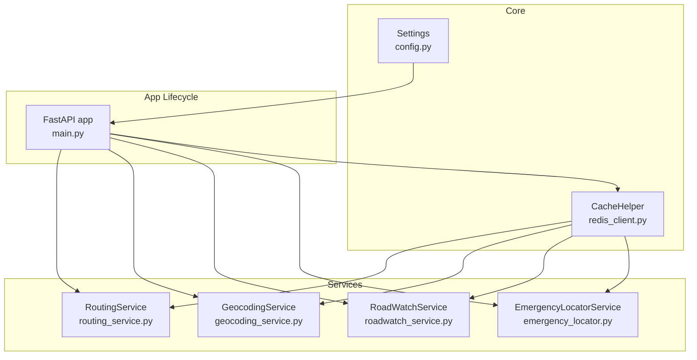
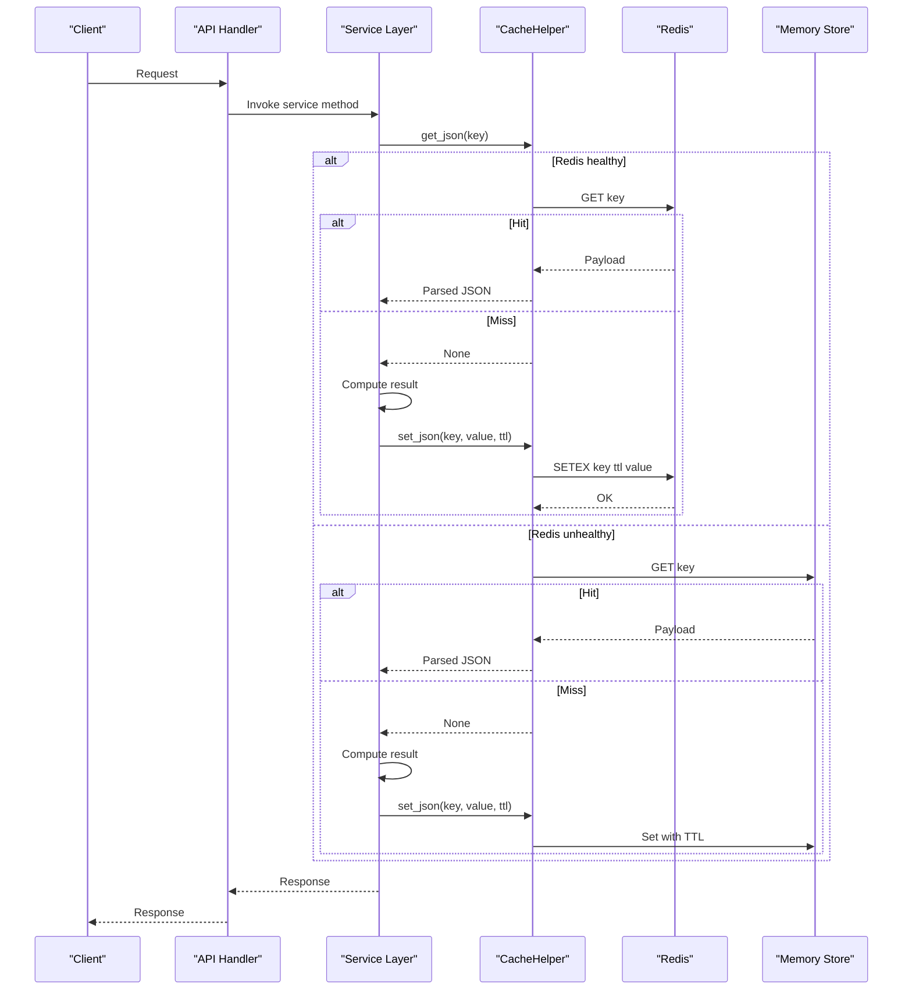
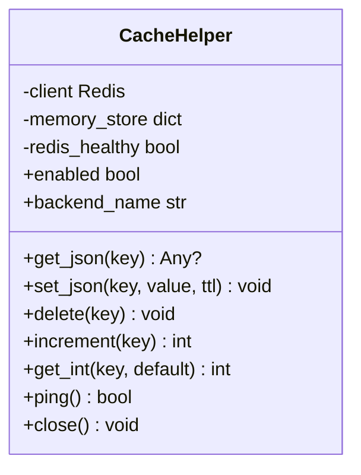
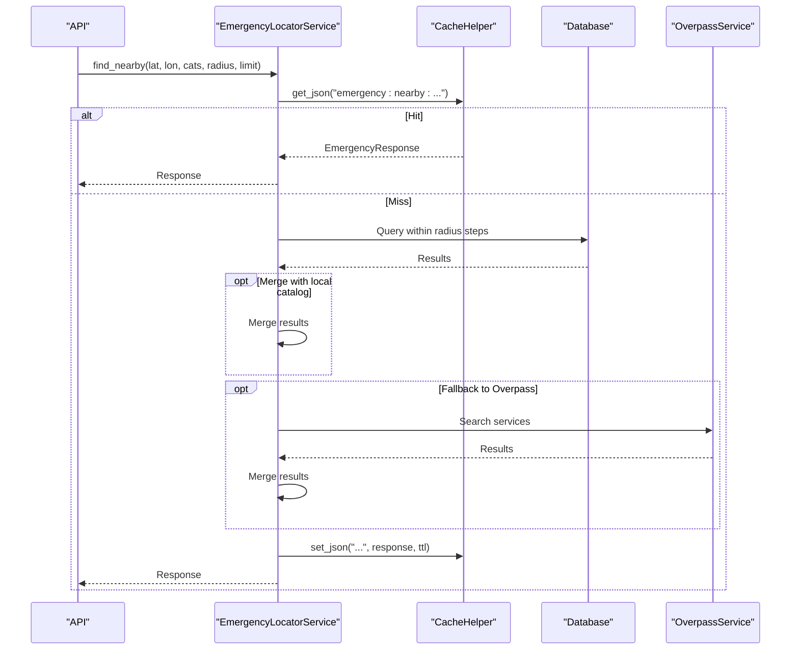
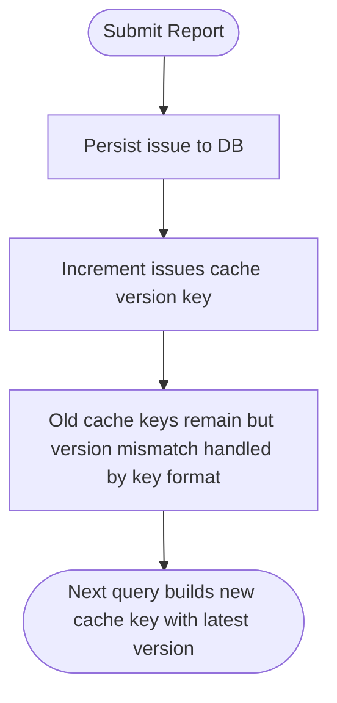
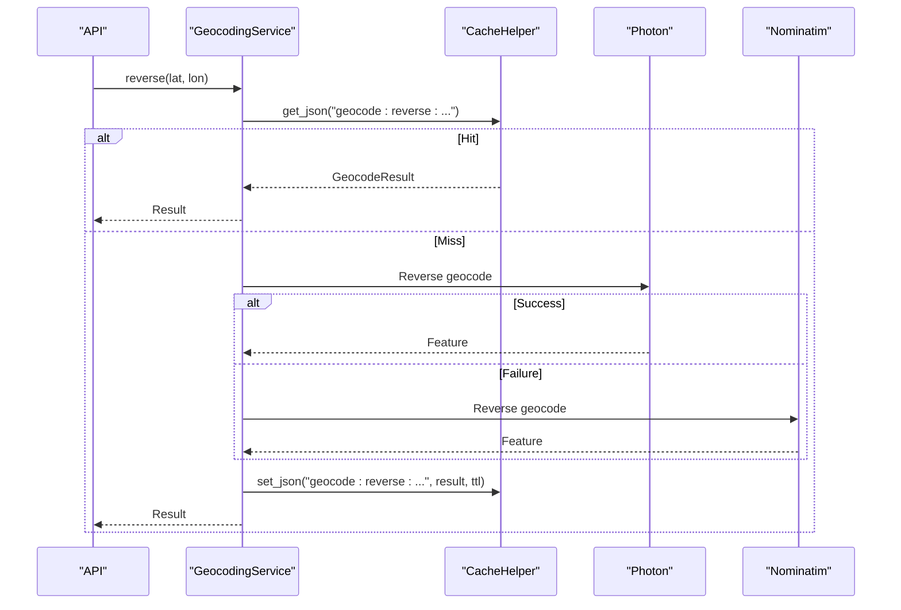
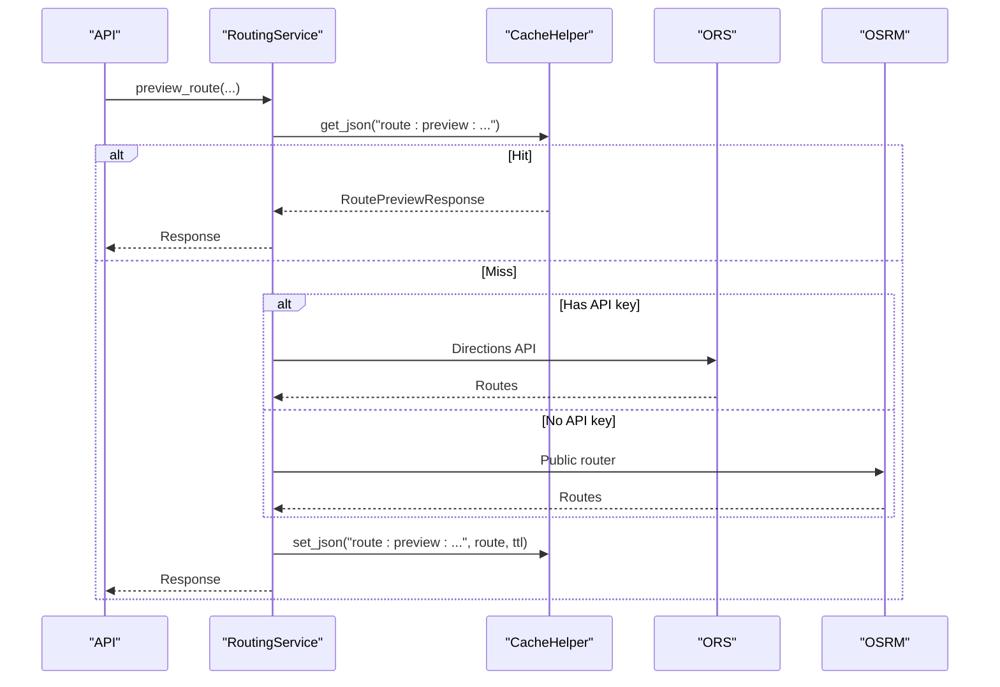
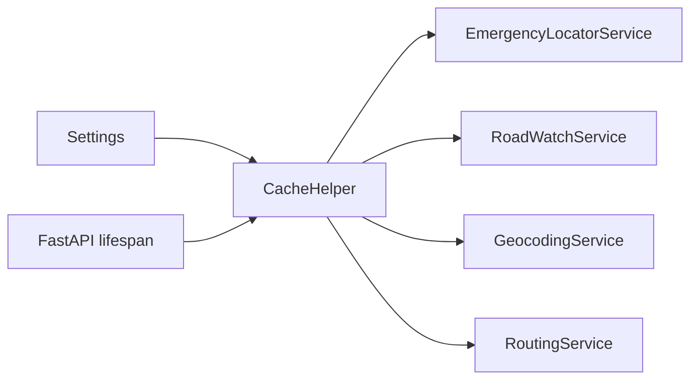

# Caching Strategies

<cite>
**Referenced Files in This Document**
- [redis_client.py](file://backend/core/redis_client.py)
- [config.py](file://backend/core/config.py)
- [main.py](file://backend/main.py)
- [emergency_locator.py](file://backend/services/emergency_locator.py)
- [roadwatch_service.py](file://backend/services/roadwatch_service.py)
- [geocoding_service.py](file://backend/services/geocoding_service.py)
- [routing_service.py](file://backend/services/routing_service.py)
- [user.py](file://backend/api/v1/user.py)
- [user.py](file://backend/models/user.py)
- [seed_emergency.py](file://scripts/app/seed_emergency.py)
</cite>

## Table of Contents
1. [Introduction](#introduction)
2. [Project Structure](#project-structure)
3. [Core Components](#core-components)
4. [Architecture Overview](#architecture-overview)
5. [Detailed Component Analysis](#detailed-component-analysis)
6. [Dependency Analysis](#dependency-analysis)
7. [Performance Considerations](#performance-considerations)
8. [Troubleshooting Guide](#troubleshooting-guide)
9. [Conclusion](#conclusion)
10. [Appendices](#appendices)

## Introduction
This document describes the dual-tier caching strategy used by SafeVixAI’s backend. The system uses Redis as the primary cache backend with an in-memory fallback via the CacheHelper class. Cache keys are designed for emergency services, road infrastructure, geocoding, and routing. TTL strategies and invalidation policies are defined per data domain. Failover behavior is automatic when Redis is unavailable. We also outline cache warming and background refresh patterns, and provide guidance for measuring performance and cache hit ratios.

## Project Structure
The caching strategy spans several backend modules:
- Core cache abstraction and Redis integration
- Service layer implementations that consume cache
- Application lifecycle initialization
- Data models and API endpoints that may benefit from caching
- Scripts for seeding and warming caches

**Diagram sources**
- [config.py:33-36](file://backend/core/config.py#L33-L36)
- [redis_client.py:10-139](file://backend/core/redis_client.py#L10-L139)
- [main.py:24-63](file://backend/main.py#L24-L63)
- [emergency_locator.py:161-507](file://backend/services/emergency_locator.py#L161-L507)
- [roadwatch_service.py:56-325](file://backend/services/roadwatch_service.py#L56-L325)
- [geocoding_service.py:19-170](file://backend/services/geocoding_service.py#L19-L170)
- [routing_service.py:20-356](file://backend/services/routing_service.py#L20-L356)

**Section sources**
- [config.py:33-36](file://backend/core/config.py#L33-L36)
- [redis_client.py:10-139](file://backend/core/redis_client.py#L10-L139)
- [main.py:24-63](file://backend/main.py#L24-L63)

## Core Components
- CacheHelper: Dual-backend cache with Redis and in-memory fallback. Provides JSON get/set/delete, integer get/increment, and health checks. Automatically switches backend when Redis fails.
- Settings: Centralized TTL values for cache domains and other runtime configuration.
- Application lifecycle: Creates CacheHelper from Redis URL and injects it into services.

Key behaviors:
- Redis availability is probed on each operation; failures mark Redis unhealthy and switch to memory backend.
- Memory store entries expire using monotonic timestamps.
- TTL values are drawn from Settings for each domain.

**Section sources**
- [redis_client.py:10-139](file://backend/core/redis_client.py#L10-L139)
- [config.py:33-36](file://backend/core/config.py#L33-L36)
- [main.py:24-63](file://backend/main.py#L24-L63)

## Architecture Overview
The cache sits between the API handlers and external services or databases. It reduces latency and downstream load by serving precomputed or recently fetched data.

**Diagram sources**
- [redis_client.py:43-124](file://backend/core/redis_client.py#L43-L124)
- [emergency_locator.py:196-216](file://backend/services/emergency_locator.py#L196-L216)
- [roadwatch_service.py:70-125](file://backend/services/roadwatch_service.py#L70-L125)
- [geocoding_service.py:33-63](file://backend/services/geocoding_service.py#L33-L63)
- [routing_service.py:48-142](file://backend/services/routing_service.py#L48-L142)

## Detailed Component Analysis

### CacheHelper: Dual-Tier Cache with Failover
- Backend selection: Returns “redis”, “memory”, or “redis+memory” depending on availability.
- Operations:
  - get_json: Try Redis; on failure or miss, fall back to memory.
  - set_json: Write to memory; attempt Redis and mark unhealthy on failure.
  - delete: Remove from memory; attempt Redis deletion and mark unhealthy on failure.
  - increment/get_int: Prefer Redis; on failure, use memory and return current value.
  - ping/close: Probe Redis health and close connection.
- Memory semantics: Stores (expires_at, payload) tuples; expiration checked on retrieval.

**Diagram sources**
- [redis_client.py:10-139](file://backend/core/redis_client.py#L10-L139)

**Section sources**
- [redis_client.py:10-139](file://backend/core/redis_client.py#L10-L139)

### Emergency Services Caching
- Cache keys:
  - Nearby emergency search: emergency:nearby:<lat>:<lon>:<cats>:<radius>:<limit>
  - City offline bundle: offline:bundle:<city>
- TTL: Uses global cache TTL from Settings.
- Invalidation:
  - City bundles are long-lived; no explicit invalidation shown.
  - Nearby results are short-lived and revalidated on subsequent requests.

**Diagram sources**
- [emergency_locator.py:196-216](file://backend/services/emergency_locator.py#L196-L216)
- [emergency_locator.py:241-299](file://backend/services/emergency_locator.py#L241-L299)

**Section sources**
- [emergency_locator.py:196-216](file://backend/services/emergency_locator.py#L196-L216)
- [emergency_locator.py:241-299](file://backend/services/emergency_locator.py#L241-L299)
- [config.py](file://backend/core/config.py#L33)

### Road Infrastructure and Issues Caching
- Cache keys:
  - Authority preview: roads:authority:<lat>:<lon>
  - Infrastructure details: roads:infra:<lat>:<lon>
  - Issues list: roads:issues:v<version>:<lat>:<lon>:<radius>:<statuses>:<limit>
- TTL: Uses authority cache TTL for authority/infrastructure; global cache TTL for issues.
- Invalidation:
  - A shared integer key tracks issues cache version. On new report submission, the version increments, invalidating prior issue lists.

**Diagram sources**
- [roadwatch_service.py:232-233](file://backend/services/roadwatch_service.py#L232-L233)
- [roadwatch_service.py:137-142](file://backend/services/roadwatch_service.py#L137-L142)

**Section sources**
- [roadwatch_service.py:70-125](file://backend/services/roadwatch_service.py#L70-L125)
- [roadwatch_service.py:137-184](file://backend/services/roadwatch_service.py#L137-L184)
- [roadwatch_service.py:232-233](file://backend/services/roadwatch_service.py#L232-L233)
- [config.py](file://backend/core/config.py#L35)

### Geocoding Caching
- Cache keys:
  - Reverse geocode: geocode:reverse:<lat>:<lon>
  - Forward search: geocode:search:<query>
- TTL: Uses geocoding-specific TTL from Settings.
- Behavior: Attempts Photon; falls back to Nominatim if Photon fails. Both results are cached.

**Diagram sources**
- [geocoding_service.py:33-63](file://backend/services/geocoding_service.py#L33-L63)

**Section sources**
- [geocoding_service.py:33-63](file://backend/services/geocoding_service.py#L33-L63)
- [config.py](file://backend/core/config.py#L34)

### Routing Caching
- Cache keys:
  - Route preview: route:preview:<profile>:<alternatives>:<origin>:<destination>
- TTL: Uses routing-specific TTL from Settings.
- Behavior: Queries ORS (with API key) or OSRM (public); normalizes response; caches.

**Diagram sources**
- [routing_service.py:48-142](file://backend/services/routing_service.py#L48-L142)

**Section sources**
- [routing_service.py:48-142](file://backend/services/routing_service.py#L48-L142)
- [config.py](file://backend/core/config.py#L36)

### User Data Caching
- Current implementation: User profile endpoints read/write directly from/to the database without cache usage.
- Recommendation: Apply short TTL caching for profile reads (e.g., user:profile:<id>) with invalidation on write.

**Section sources**
- [user.py:16-83](file://backend/api/v1/user.py#L16-L83)
- [user.py:13-25](file://backend/models/user.py#L13-L25)

## Dependency Analysis
- CacheHelper depends on Redis client and maintains an in-memory dictionary.
- Services depend on Settings for TTL values and on CacheHelper for storage.
- Application lifecycle constructs CacheHelper and injects it into services.

**Diagram sources**
- [config.py:33-36](file://backend/core/config.py#L33-L36)
- [redis_client.py:10-139](file://backend/core/redis_client.py#L10-L139)
- [main.py:24-63](file://backend/main.py#L24-L63)
- [emergency_locator.py:161-507](file://backend/services/emergency_locator.py#L161-L507)
- [roadwatch_service.py:56-325](file://backend/services/roadwatch_service.py#L56-L325)
- [geocoding_service.py:19-170](file://backend/services/geocoding_service.py#L19-L170)
- [routing_service.py:20-356](file://backend/services/routing_service.py#L20-L356)

**Section sources**
- [config.py:33-36](file://backend/core/config.py#L33-L36)
- [redis_client.py:10-139](file://backend/core/redis_client.py#L10-L139)
- [main.py:24-63](file://backend/main.py#L24-L63)

## Performance Considerations
- Latency reduction: Cache hits avoid database queries and external API calls.
- Throughput: Reduced load on Overpass/Nominatim/ORS improves stability under load.
- Memory footprint: In-memory fallback prevents cache blowouts; TTL ensures eviction.
- Hit ratio measurement: Not implemented in code; recommended metrics include cache hits/misses counters and backend health status.

[No sources needed since this section provides general guidance]

## Troubleshooting Guide
- Symptoms of Redis unavailability:
  - Health endpoint shows degraded cache backend and “redis+memory” mode.
  - Cache operations silently fall back to memory.
- Diagnostics:
  - Use the health endpoint to confirm cache availability and backend name.
  - Inspect cache backend_name property and ping status.
- Mitigation:
  - Scale or restart Redis.
  - Monitor cache backend transitions and adjust TTLs accordingly.

**Section sources**
- [main.py:103-125](file://backend/main.py#L103-L125)
- [redis_client.py:115-124](file://backend/core/redis_client.py#L115-L124)

## Conclusion
SafeVixAI employs a robust dual-tier caching strategy centered on CacheHelper. Redis is the primary backend with seamless in-memory fallback, ensuring resilience. Domain-specific TTLs and explicit invalidation (versioned issues) balance freshness and performance. While user profile reads currently bypass cache, adding short-lived caching with write-through invalidation would further improve performance.

[No sources needed since this section summarizes without analyzing specific files]

## Appendices

### Cache Key Patterns and TTLs
- Emergency services
  - Key pattern: emergency:nearby:<lat>:<lon>:<cats>:<radius>:<limit>
  - TTL: global cache TTL
- City offline bundle
  - Key pattern: offline:bundle:<city>
  - TTL: global cache TTL
- Authority and infrastructure
  - Keys: roads:authority:<lat>:<lon>, roads:infra:<lat>:<lon>
  - TTL: authority cache TTL
- Road issues
  - Key pattern: roads:issues:v<version>:<lat>:<lon>:<radius>:<statuses>:<limit>
  - TTL: global cache TTL
- Geocoding
  - Keys: geocode:reverse:<lat>:<lon>, geocode:search:<query>
  - TTL: geocoding cache TTL
- Routing
  - Key pattern: route:preview:<profile>:<alternatives>:<origin>:<destination>
  - TTL: routing cache TTL

**Section sources**
- [emergency_locator.py:196-216](file://backend/services/emergency_locator.py#L196-L216)
- [emergency_locator.py:241-299](file://backend/services/emergency_locator.py#L241-L299)
- [roadwatch_service.py:70-125](file://backend/services/roadwatch_service.py#L70-L125)
- [roadwatch_service.py:137-184](file://backend/services/roadwatch_service.py#L137-L184)
- [geocoding_service.py:33-63](file://backend/services/geocoding_service.py#L33-L63)
- [routing_service.py:48-142](file://backend/services/routing_service.py#L48-L142)
- [config.py:33-36](file://backend/core/config.py#L33-L36)

### Cache Invalidation Policies
- Emergency services: short TTL; stale data refreshed on next request.
- Road issues: versioned cache key; incrementing a version key on report submission invalidates prior caches.
- Authority/infrastructure: short TTL; stale data refreshed on next request.
- Geocoding: short TTL; stale data refreshed on next request.
- Routing: short TTL; stale data refreshed on next request.

**Section sources**
- [roadwatch_service.py:232-233](file://backend/services/roadwatch_service.py#L232-L233)
- [config.py:33-36](file://backend/core/config.py#L33-L36)

### Failover Mechanisms
- Redis failures are detected on each operation; backend_name reflects “redis+memory” when Redis is down.
- All cache operations transparently fall back to memory until Redis recovers.

**Section sources**
- [redis_client.py:20-24](file://backend/core/redis_client.py#L20-L24)
- [redis_client.py:45-51](file://backend/core/redis_client.py#L45-L51)
- [redis_client.py:115-124](file://backend/core/redis_client.py#L115-L124)

### Cache Configuration Examples
- Emergency service coordinates: use emergency:nearby:<lat>:<lon>:<cats>:<radius>:<limit> with global TTL.
- Road issue reports: use roads:issues:v<version>:<lat>:<lon>:<radius>:<statuses>:<limit>; increment version on submit.
- User preferences: introduce user:profile:<id> with short TTL and invalidate on update.

**Section sources**
- [emergency_locator.py:196-216](file://backend/services/emergency_locator.py#L196-L216)
- [roadwatch_service.py:137-142](file://backend/services/roadwatch_service.py#L137-L142)
- [roadwatch_service.py:232-233](file://backend/services/roadwatch_service.py#L232-L233)
- [user.py:16-83](file://backend/api/v1/user.py#L16-L83)

### Cache Warming and Background Refresh
- Startup warming: Seed emergency data to warm emergency:nearby and offline:bundle keys for major cities.
- Background refresh: Periodically re-fetch and re-cache frequently accessed road infrastructure and emergency results.

Note: The repository includes a seed script entry point for emergency data. Extend it to populate cache keys for hotspots.

**Section sources**
- [seed_emergency.py:1-19](file://scripts/app/seed_emergency.py#L1-L19)