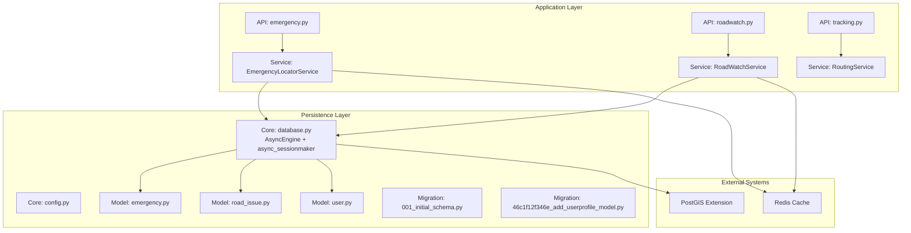
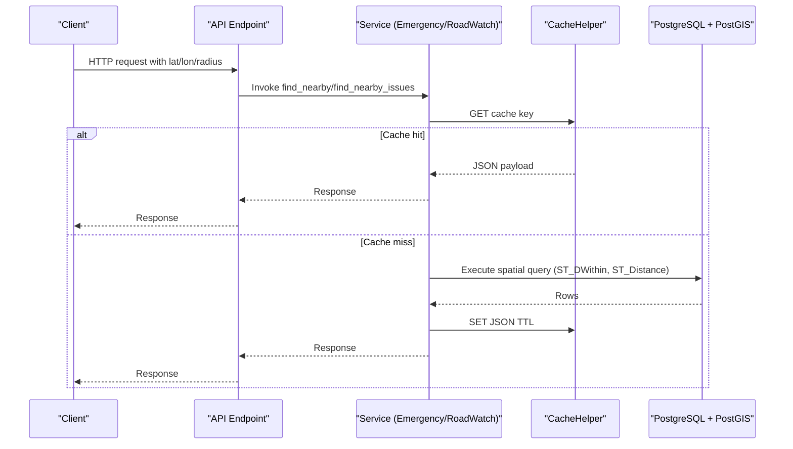
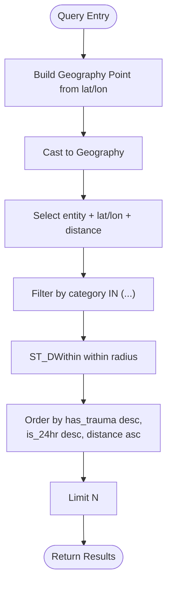
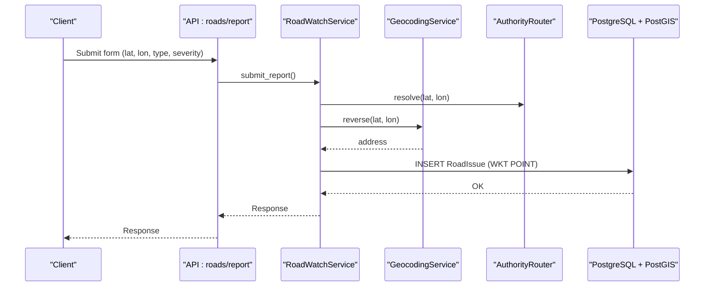
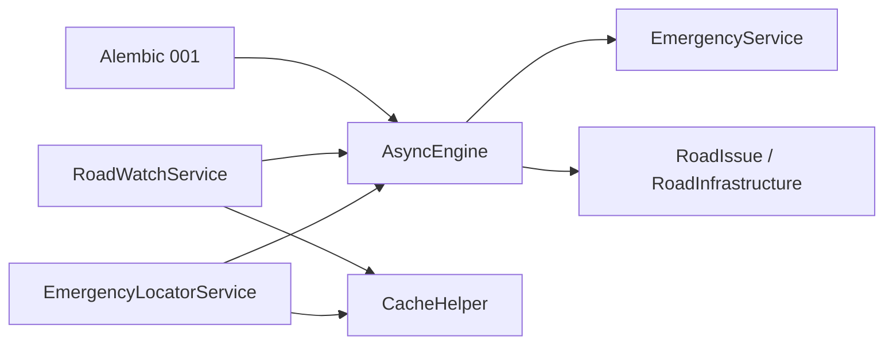

# Database Optimization

<cite>
**Referenced Files in This Document**
- [database.py](file://backend/core/database.py)
- [config.py](file://backend/core/config.py)
- [env.py](file://backend/migrations/env.py)
- [alembic.ini](file://backend/alembic.ini)
- [001_initial_schema.py](file://backend/migrations/versions/001_initial_schema.py)
- [46c1f12f346e_add_userprofile_model.py](file://backend/migrations/versions/46c1f12f346e_add_userprofile_model.py)
- [emergency.py](file://backend/models/emergency.py)
- [road_issue.py](file://backend/models/road_issue.py)
- [user.py](file://backend/models/user.py)
- [emergency_locator.py](file://backend/services/emergency_locator.py)
- [roadwatch_service.py](file://backend/services/roadwatch_service.py)
- [routing_service.py](file://backend/services/routing_service.py)
- [redis_client.py](file://backend/core/redis_client.py)
- [check_db.py](file://backend/scripts/app/check_db.py)
- [seed_db.py](file://backend/scripts/app/seed_db.py)
- [seed_emergency.py](file://backend/scripts/app/seed_emergency.py)
- [import_road_infrastructure.py](file://backend/scripts/app/import_road_infrastructure.py)
- [emergency.py](file://backend/api/v1/emergency.py)
- [roadwatch.py](file://backend/api/v1/roadwatch.py)
- [tracking.py](file://backend/api/v1/tracking.py)
</cite>

## Table of Contents
1. [Introduction](#introduction)
2. [Project Structure](#project-structure)
3. [Core Components](#core-components)
4. [Architecture Overview](#architecture-overview)
5. [Detailed Component Analysis](#detailed-component-analysis)
6. [Dependency Analysis](#dependency-analysis)
7. [Performance Considerations](#performance-considerations)
8. [Troubleshooting Guide](#troubleshooting-guide)
9. [Conclusion](#conclusion)
10. [Appendices](#appendices)

## Introduction
This document provides comprehensive database optimization guidance for SafeVixAI. It focuses on PostgreSQL query optimization, spatial indexing strategies, connection pooling configuration, schema design patterns for emergency services and road infrastructure, and practical examples for optimized queries. It also covers migration strategies, performance monitoring, query execution plan analysis, connection pool sizing, transaction optimization, deadlock prevention, and production maintenance tasks.

## Project Structure
SafeVixAI’s backend uses SQLAlchemy with asyncpg for PostgreSQL connectivity, Alembic for migrations, GeoAlchemy2 for PostGIS spatial data, and Redis for caching. The database layer is centralized via a shared async engine and session factory, with services encapsulating spatial queries and caching.

**Diagram sources**
- [database.py:16-35](file://backend/core/database.py#L16-L35)
- [config.py:19-24](file://backend/core/config.py#L19-L24)
- [emergency.py:12-45](file://backend/models/emergency.py#L12-L45)
- [road_issue.py:14-66](file://backend/models/road_issue.py#L14-L66)
- [user.py:13-25](file://backend/models/user.py#L13-L25)
- [001_initial_schema.py:22-140](file://backend/migrations/versions/001_initial_schema.py#L22-L140)
- [46c1f12f346e_add_userprofile_model.py:19-33](file://backend/migrations/versions/46c1f12f346e_add_userprofile_model.py#L19-L33)
- [emergency_locator.py:161-507](file://backend/services/emergency_locator.py#L161-L507)
- [roadwatch_service.py:56-325](file://backend/services/roadwatch_service.py#L56-L325)
- [redis_client.py:10-140](file://backend/core/redis_client.py#L10-L140)

**Section sources**
- [database.py:16-35](file://backend/core/database.py#L16-L35)
- [config.py:19-24](file://backend/core/config.py#L19-L24)
- [001_initial_schema.py:22-140](file://backend/migrations/versions/001_initial_schema.py#L22-L140)
- [46c1f12f346e_add_userprofile_model.py:19-33](file://backend/migrations/versions/46c1f12f346e_add_userprofile_model.py#L19-L33)

## Core Components
- Database Engine and Session Factory: Asynchronous PostgreSQL engine configured with connection pooling and pre-ping enabled.
- Settings: Centralized configuration for database URL, pool size, overflow, timeouts, and recycle.
- Models: SQLAlchemy declarative models with GeoAlchemy2 Geometry fields and spatial indexes.
- Services: Spatial query services using Geography and ST_Distance/ST_DWithin for proximity searches.
- Caching: Redis-backed cache helper with graceful degradation to in-memory cache.
- Migrations: Alembic migrations enabling PostGIS and creating spatial indexes.

Key configuration highlights:
- Connection pool parameters: pool_size, max_overflow, pool_timeout, pool_recycle.
- Pre-ping enabled to detect broken connections.
- Prepared statement cache disabled for Supabase transaction pooler compatibility.

**Section sources**
- [database.py:16-35](file://backend/core/database.py#L16-L35)
- [config.py:19-24](file://backend/core/config.py#L19-L24)
- [emergency.py:26-29](file://backend/models/emergency.py#L26-L29)
- [road_issue.py:22-25](file://backend/models/road_issue.py#L22-L25)
- [road_issue.py:51-54](file://backend/models/road_issue.py#L51-L54)
- [redis_client.py:10-140](file://backend/core/redis_client.py#L10-L140)
- [env.py:14-16](file://backend/migrations/env.py#L14-L16)
- [alembic.ini:4-4](file://backend/alembic.ini#L4-L4)

## Architecture Overview
The system leverages asynchronous SQLAlchemy sessions bound to a shared async engine. Services encapsulate spatial queries using Geography types and PostGIS functions. Results are cached to reduce database load. Migrations manage PostGIS extension and spatial indexes.

**Diagram sources**
- [emergency_locator.py:196-217](file://backend/services/emergency_locator.py#L196-L217)
- [emergency_locator.py:375-422](file://backend/services/emergency_locator.py#L375-L422)
- [roadwatch_service.py:127-184](file://backend/services/roadwatch_service.py#L127-L184)
- [roadwatch_service.py:147-160](file://backend/services/roadwatch_service.py#L147-L160)
- [redis_client.py:43-58](file://backend/core/redis_client.py#L43-L58)

## Detailed Component Analysis

### Spatial Schema Design and Indexing Strategies
- Emergency services table: Point geometry with GIST index on location; indexes on category, state_code, country_code.
- Road issues table: Point geometry with GIST index on location; index on status.
- Road infrastructure table: Linestring geometry with GIST index on geometry; index on state_code.

Recommendations:
- Keep spatial indexes enabled in production; they are essential for ST_DWithin and ST_Distance performance.
- Consider partial indexes for frequently filtered columns (e.g., status='open').
- Normalize categorical data to reduce cardinality and improve index selectivity.

**Section sources**
- [001_initial_schema.py:55-63](file://backend/migrations/versions/001_initial_schema.py#L55-L63)
- [001_initial_schema.py:86-92](file://backend/migrations/versions/001_initial_schema.py#L86-L92)
- [001_initial_schema.py:117-123](file://backend/migrations/versions/001_initial_schema.py#L117-L123)
- [emergency.py:26-29](file://backend/models/emergency.py#L26-L29)
- [road_issue.py:22-25](file://backend/models/road_issue.py#L22-L25)
- [road_issue.py:51-54](file://backend/models/road_issue.py#L51-L54)

### Connection Pooling Configuration
- Pool parameters: pool_size, max_overflow, pool_timeout, pool_recycle, pool_pre_ping.
- Pre-ping ensures stale connections are detected and recycled.
- Recycle interval helps prevent long-lived connections from causing resource leaks.

Guidance:
- Size pool based on concurrent workload and database capacity. Start with conservative values and monitor wait times.
- Increase max_overflow cautiously; excessive overflow can overload the database.
- Monitor pool_timeout to detect saturation; tune pool_size accordingly.

**Section sources**
- [database.py:16-29](file://backend/core/database.py#L16-L29)
- [config.py:19-24](file://backend/core/config.py#L19-L24)

### Optimized Queries for Emergency Discovery
- Purpose: Find nearby emergency services within a radius, ordered by availability and proximity.
- Key constructs: Geography cast, ST_Distance, ST_DWithin, ordering by attributes and distance.
- Caching: Cache key includes coordinates, categories, radius, and limit.

Optimization tips:
- Ensure category/state_code/country_code indexes are used by EXPLAIN/ANALYZE.
- Limit results early; avoid unnecessary projections.
- Prefer ST_DWithin before distance calculation to reduce candidate set.

**Diagram sources**
- [emergency_locator.py:375-422](file://backend/services/emergency_locator.py#L375-L422)

**Section sources**
- [emergency_locator.py:196-217](file://backend/services/emergency_locator.py#L196-L217)
- [emergency_locator.py:375-422](file://backend/services/emergency_locator.py#L375-L422)

### Optimized Queries for Road Issue Reporting and Discovery
- Purpose: Discover nearby road issues and submit reports with geocoded address and authority routing.
- Key constructs: Geography cast, ST_DWithin, ST_Distance, status filtering, WKT insertion.
- Caching: Issues cache version key increments on new submissions to invalidate caches.

Optimization tips:
- Add partial index on status for active issues.
- Use LIMIT and ORDER BY distance to minimize result set.
- Store POINT geometry with SRID 4326 for consistency.

**Diagram sources**
- [roadwatch.py:73-97](file://backend/api/v1/roadwatch.py#L73-L97)
- [roadwatch_service.py:186-253](file://backend/services/roadwatch_service.py#L186-L253)
- [roadwatch_service.py:255-273](file://backend/services/roadwatch_service.py#L255-L273)

**Section sources**
- [roadwatch_service.py:127-184](file://backend/services/roadwatch_service.py#L127-L184)
- [roadwatch_service.py:147-160](file://backend/services/roadwatch_service.py#L147-L160)
- [roadwatch_service.py:186-253](file://backend/services/roadwatch_service.py#L186-L253)
- [roadwatch_service.py:255-273](file://backend/services/roadwatch_service.py#L255-L273)

### User Location Tracking (Real-Time Broadcasting)
- Purpose: Real-time location sharing among group members via WebSocket.
- Database role: Not used for persistent storage in this endpoint; data is broadcast in-memory.
- Production note: For multi-worker deployments, replace in-memory store with Redis Pub/Sub.

**Section sources**
- [tracking.py:10-45](file://backend/api/v1/tracking.py#L10-L45)
- [tracking.py:47-67](file://backend/api/v1/tracking.py#L47-L67)

### Migration Strategies and Schema Evolution
- Enable PostGIS extension during upgrade.
- Create spatial indexes explicitly in migrations.
- Downgrade safely removes indexes and tables in reverse order.

Best practices:
- Always test migrations in staging with realistic data volumes.
- Use Alembic’s online/offline modes consistently.
- Keep migrations reversible where feasible.

**Section sources**
- [001_initial_schema.py:22-140](file://backend/migrations/versions/001_initial_schema.py#L22-L140)
- [46c1f12f346e_add_userprofile_model.py:19-33](file://backend/migrations/versions/46c1f12f346e_add_userprofile_model.py#L19-L33)
- [env.py:45-63](file://backend/migrations/env.py#L45-L63)
- [alembic.ini:1-37](file://backend/alembic.ini#L1-L37)

### Data Seeding and Bulk Upserts
- Seeders import emergency services and road infrastructure using bulk INSERT with ON CONFLICT DO UPDATE.
- Geo data is inserted as WKTElements with SRID 4326.
- Deduplicate road segments by road_id before upsert.

Guidance:
- Batch inserts to reduce round trips.
- Use ON CONFLICT clauses to maintain idempotency.
- Validate geometry normalization (LineString/MultiLineString) prior to insert.

**Section sources**
- [seed_db.py:147-183](file://backend/scripts/app/seed_db.py#L147-L183)
- [seed_emergency.py:116-139](file://backend/scripts/app/seed_emergency.py#L116-L139)
- [import_road_infrastructure.py:204-251](file://backend/scripts/app/import_road_infrastructure.py#L204-L251)
- [import_road_infrastructure.py:115-130](file://backend/scripts/app/import_road_infrastructure.py#L115-L130)

## Dependency Analysis
- Services depend on AsyncSession for spatial queries.
- Models define spatial columns and indexes.
- Alembic manages PostGIS and spatial indexes.
- Redis cache is injected into services for hot-path caching.

**Diagram sources**
- [emergency_locator.py:161-507](file://backend/services/emergency_locator.py#L161-L507)
- [roadwatch_service.py:56-325](file://backend/services/roadwatch_service.py#L56-L325)
- [database.py:16-35](file://backend/core/database.py#L16-L35)
- [emergency.py:12-45](file://backend/models/emergency.py#L12-L45)
- [road_issue.py:14-66](file://backend/models/road_issue.py#L14-L66)
- [redis_client.py:10-140](file://backend/core/redis_client.py#L10-L140)
- [001_initial_schema.py:22-140](file://backend/migrations/versions/001_initial_schema.py#L22-L140)

**Section sources**
- [emergency_locator.py:161-507](file://backend/services/emergency_locator.py#L161-L507)
- [roadwatch_service.py:56-325](file://backend/services/roadwatch_service.py#L56-L325)
- [database.py:16-35](file://backend/core/database.py#L16-L35)
- [001_initial_schema.py:22-140](file://backend/migrations/versions/001_initial_schema.py#L22-L140)

## Performance Considerations
- Spatial queries
  - Use Geography type and ST_Distance/ST_DWithin for accurate distances.
  - Ensure GIST indexes exist on geometry columns.
  - Filter early with WHERE clauses before computing distance.
- Caching
  - Cache frequent spatial queries keyed by coordinates, categories, radius, and limit.
  - Use cache version keys for invalidation on data changes.
- Connection pooling
  - Tune pool_size and max_overflow based on observed wait times and concurrency.
  - Enable pool_recycle and pool_pre_ping to prevent stale connections.
- Indexing
  - Maintain indexes on frequently filtered columns (category, state_code, country_code, status).
  - Consider partial indexes for active statuses.
- Transactions
  - Keep transactions short; commit promptly after writes.
  - Avoid long-running queries inside transactions.
- Deadlocks
  - Use consistent ordering for multi-row updates.
  - Retry transient deadlocks with exponential backoff.
- Monitoring
  - Use EXPLAIN/ANALYZE to review query plans.
  - Track slow queries and cache hit ratios.

[No sources needed since this section provides general guidance]

## Troubleshooting Guide
- Database connectivity checks
  - Use the provided script to verify tables and row counts.
- Migration issues
  - Confirm PostGIS extension is enabled and spatial indexes created.
  - Run migrations offline vs online consistently.
- Cache failures
  - CacheHelper falls back to in-memory cache if Redis is unavailable.
- Slow spatial queries
  - Verify GIST indexes and filter predicates.
  - Reduce radius or limit results.

**Section sources**
- [check_db.py:8-31](file://backend/scripts/app/check_db.py#L8-L31)
- [env.py:45-63](file://backend/migrations/env.py#L45-L63)
- [redis_client.py:43-58](file://backend/core/redis_client.py#L43-L58)
- [001_initial_schema.py:22-140](file://backend/migrations/versions/001_initial_schema.py#L22-L140)

## Conclusion
SafeVixAI’s database layer is built on robust async PostgreSQL connectivity, PostGIS spatial capabilities, and strategic caching. By maintaining spatial indexes, optimizing queries with Geography and ST_DWithin, tuning connection pools, and leveraging caching, the system achieves responsive emergency discovery and road issue reporting. Apply the migration, monitoring, and maintenance practices outlined here to sustain performance in production.

[No sources needed since this section summarizes without analyzing specific files]

## Appendices

### Appendix A: Example Optimized Queries (Paths)
- Emergency discovery query: [emergency_locator.py:375-422](file://backend/services/emergency_locator.py#L375-L422)
- Road issues discovery query: [roadwatch_service.py:127-184](file://backend/services/roadwatch_service.py#L127-L184)
- Road infrastructure lookup: [roadwatch_service.py:255-273](file://backend/services/roadwatch_service.py#L255-L273)
- Insert road issue with POINT: [roadwatch_service.py:212-227](file://backend/services/roadwatch_service.py#L212-L227)

### Appendix B: Configuration Reference
- Database URL normalization and dialect selection: [config.py:86-96](file://backend/core/config.py#L86-L96)
- Connection pool parameters: [config.py:21-24](file://backend/core/config.py#L21-L24), [database.py:16-29](file://backend/core/database.py#L16-L29)

### Appendix C: Migration Reference
- Enable PostGIS and create spatial indexes: [001_initial_schema.py:22-140](file://backend/migrations/versions/001_initial_schema.py#L22-L140)
- Add user profiles table: [46c1f12f346e_add_userprofile_model.py:19-33](file://backend/migrations/versions/46c1f12f346e_add_userprofile_model.py#L19-L33)
- Alembic configuration: [alembic.ini:1-37](file://backend/alembic.ini#L1-L37), [env.py:14-16](file://backend/migrations/env.py#L14-L16)