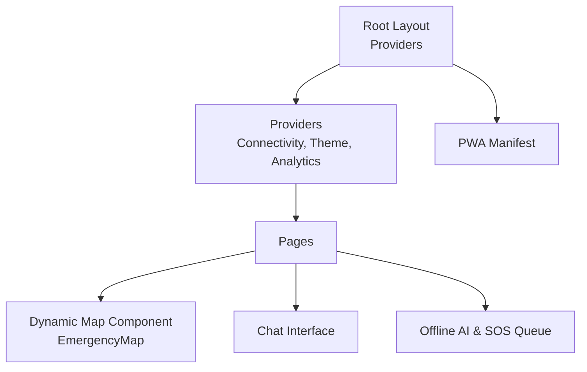
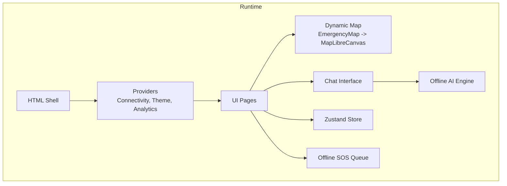
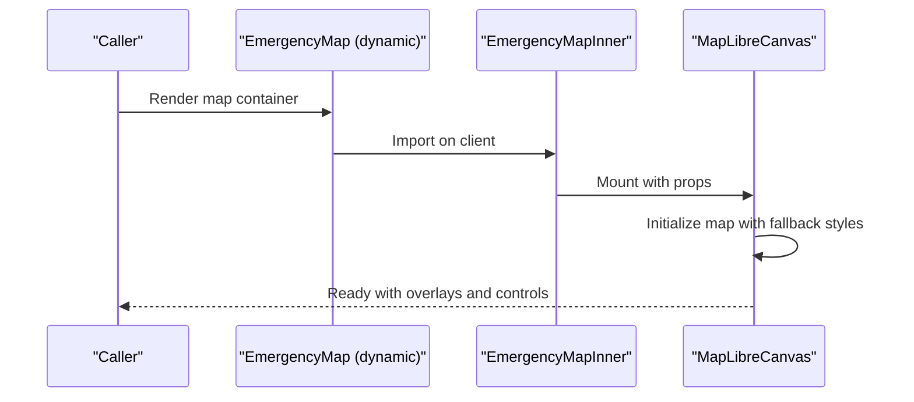
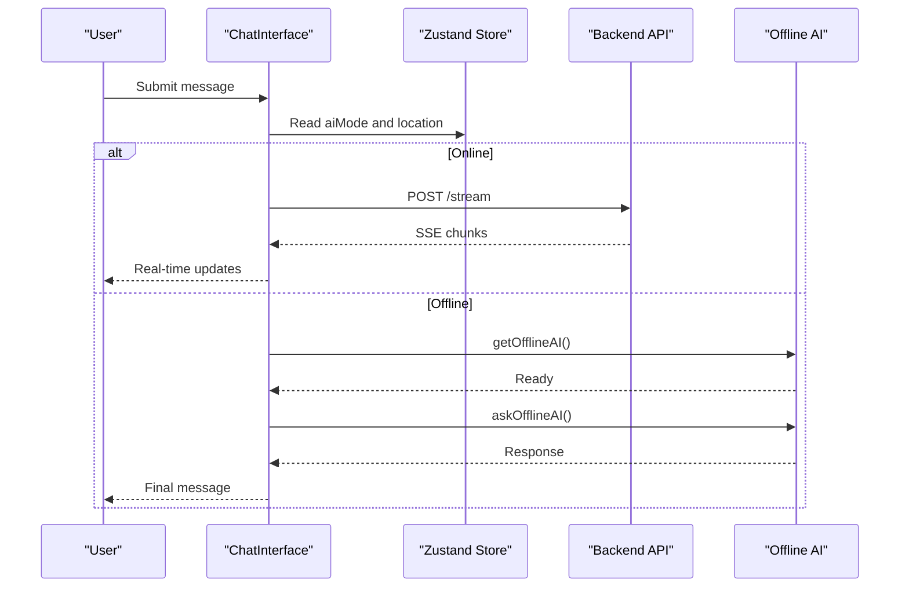
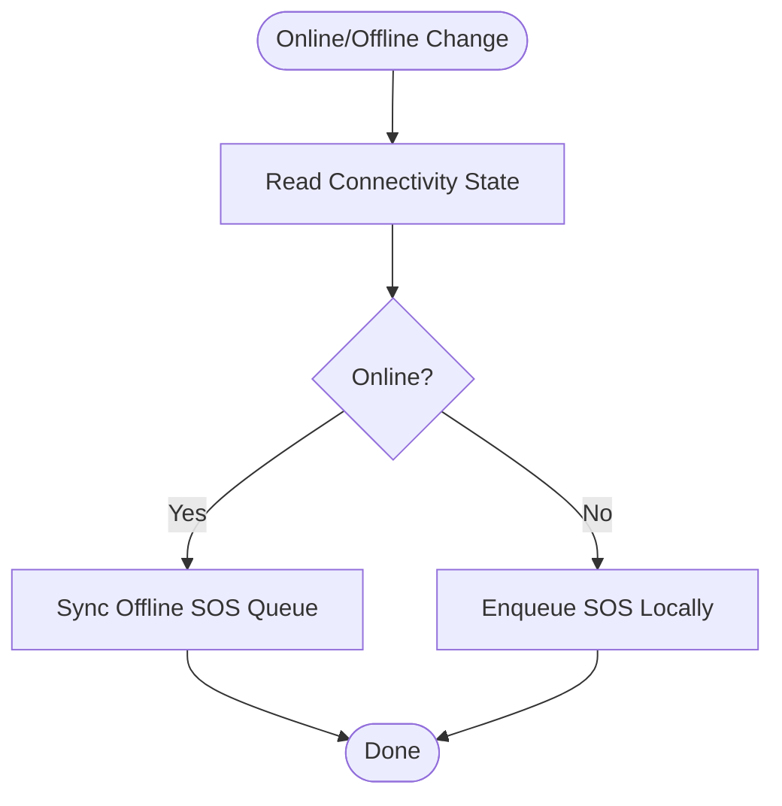
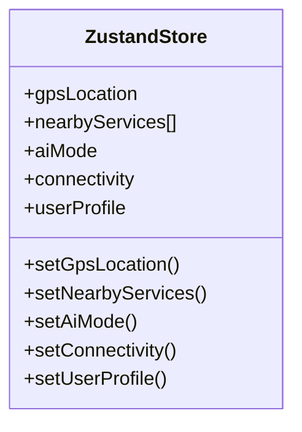
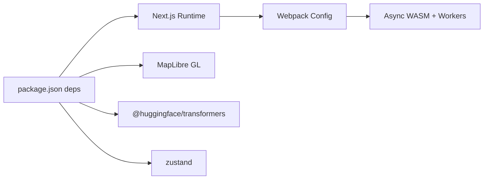

# Frontend Performance

<cite>
**Referenced Files in This Document**
- [package.json](file://frontend/package.json)
- [next.config.js](file://frontend/nexT.config.js)
- [layout.tsx](file://frontend/app/layout.tsx)
- [manifest.json](file://frontend/public/manifest.json)
- [store.ts](file://frontend/lib/store.ts)
- [MapLibreCanvas.tsx](file://frontend/components/maps/MapLibreCanvas.tsx)
- [EmergencyMap.tsx](file://frontend/components/EmergencyMap.tsx)
- [ChatInterface.tsx](file://frontend/components/ChatInterface.tsx)
- [offline-ai.ts](file://frontend/lib/offline-ai.ts)
- [ConnectivityProvider.tsx](file://frontend/components/ConnectivityProvider.tsx)
- [ClientAppHooks.tsx](file://frontend/components/ClientAppHooks.tsx)
- [offline-sos-queue.ts](file://frontend/lib/offline-sos-queue.ts)
- [analytics-provider.tsx](file://frontend/lib/analytics-provider.tsx)
</cite>

## Table of Contents
1. [Introduction](#introduction)
2. [Project Structure](#project-structure)
3. [Core Components](#core-components)
4. [Architecture Overview](#architecture-overview)
5. [Detailed Component Analysis](#detailed-component-analysis)
6. [Dependency Analysis](#dependency-analysis)
7. [Performance Considerations](#performance-considerations)
8. [Troubleshooting Guide](#troubleshooting-guide)
9. [Conclusion](#conclusion)
10. [Appendices](#appendices)

## Introduction
This document provides comprehensive frontend performance optimization guidance for SafeVixAI’s Next.js application. It focuses on code splitting and lazy loading for heavy components (map rendering, AI chatbot, and emergency services), bundle optimization techniques, React performance patterns, efficient state management with Zustand, Next.js-specific optimizations, performance monitoring, and progressive enhancement for offline functionality.

## Project Structure
The frontend is a Next.js 15 application with TypeScript, Tailwind CSS, and a PWA manifest. Key areas relevant to performance:
- Application shell and providers in the root layout
- Dynamic imports for map components
- Zustand store for state management
- Offline-first AI and SOS queue utilities
- Analytics provider initialization

**Diagram sources**
- [layout.tsx:38-85](file://frontend/app/layout.tsx#L38-L85)
- [EmergencyMap.tsx:10-23](file://frontend/components/EmergencyMap.tsx#L10-L23)
- [ChatInterface.tsx:64-316](file://frontend/components/ChatInterface.tsx#L64-L316)
- [offline-ai.ts:124-154](file://frontend/lib/offline-ai.ts#L124-L154)
- [offline-sos-queue.ts:130-137](file://frontend/lib/offline-sos-queue.ts#L130-L137)
- [manifest.json:1-68](file://frontend/public/manifest.json#L1-L68)

**Section sources**
- [layout.tsx:1-86](file://frontend/app/layout.tsx#L1-L86)
- [package.json:1-85](file://frontend/package.json#L1-L85)

## Core Components
- Dynamic map rendering with SSR disabled for the map component to avoid hydration mismatches and reduce server payload.
- Zustand store for minimal, efficient state updates and persistence of user preferences.
- Offline-first AI with dynamic imports and caching to minimize initial bundle size.
- Connectivity-aware UI and offline SOS queue with IndexedDB and optional background sync.

**Section sources**
- [EmergencyMap.tsx:10-23](file://frontend/components/EmergencyMap.tsx#L10-L23)
- [MapLibreCanvas.tsx:300-559](file://frontend/components/maps/MapLibreCanvas.tsx#L300-L559)
- [store.ts:129-225](file://frontend/lib/store.ts#L129-L225)
- [offline-ai.ts:74-110](file://frontend/lib/offline-ai.ts#L74-L110)
- [offline-sos-queue.ts:25-42](file://frontend/lib/offline-sos-queue.ts#L25-L42)

## Architecture Overview
High-level performance-oriented architecture:
- Root layout initializes providers and PWA metadata.
- Dynamic imports defer heavy map rendering until client-side.
- Zustand manages UI and feature flags with selective persistence.
- Offline AI and SOS queue enable progressive enhancement and resilience.

**Diagram sources**
- [layout.tsx:38-85](file://frontend/app/layout.tsx#L38-L85)
- [EmergencyMap.tsx:10-23](file://frontend/components/EmergencyMap.tsx#L10-L23)
- [MapLibreCanvas.tsx:300-559](file://frontend/components/maps/MapLibreCanvas.tsx#L300-L559)
- [ChatInterface.tsx:64-316](file://frontend/components/ChatInterface.tsx#L64-L316)
- [store.ts:129-225](file://frontend/lib/store.ts#L129-L225)
- [offline-ai.ts:124-154](file://frontend/lib/offline-ai.ts#L124-L154)
- [offline-sos-queue.ts:130-137](file://frontend/lib/offline-sos-queue.ts#L130-L137)

## Detailed Component Analysis

### Map Rendering Performance (Code Splitting and Lazy Loading)
- The map component is dynamically imported with SSR disabled to prevent server-side rendering of browser-only libraries.
- The underlying map canvas component encapsulates initialization, style fallbacks, and overlay synchronization with memoization and effect cleanup.
- Progressive fallbacks ensure availability across varying network conditions.

**Diagram sources**
- [EmergencyMap.tsx:10-23](file://frontend/components/EmergencyMap.tsx#L10-L23)
- [MapLibreCanvas.tsx:300-559](file://frontend/components/maps/MapLibreCanvas.tsx#L300-L559)

**Section sources**
- [EmergencyMap.tsx:10-23](file://frontend/components/EmergencyMap.tsx#L10-L23)
- [MapLibreCanvas.tsx:300-559](file://frontend/components/maps/MapLibreCanvas.tsx#L300-L559)

### AI Chatbot Performance (Dynamic Imports and Streaming)
- The chat interface streams responses from the backend via Server-Sent Events and conditionally switches to offline AI when connectivity indicates offline mode.
- Offline AI is lazily loaded with dynamic imports and caching to minimize initial bundle size and improve responsiveness.

**Diagram sources**
- [ChatInterface.tsx:64-316](file://frontend/components/ChatInterface.tsx#L64-L316)
- [offline-ai.ts:124-154](file://frontend/lib/offline-ai.ts#L124-L154)

**Section sources**
- [ChatInterface.tsx:64-316](file://frontend/components/ChatInterface.tsx#L64-L316)
- [offline-ai.ts:74-110](file://frontend/lib/offline-ai.ts#L74-L110)

### Emergency Services and Offline Resilience
- Connectivity state is tracked globally and reflected in UI elements.
- Offline SOS queue persists requests locally and attempts to sync when connectivity is restored.
- Client hooks initialize offline listeners and crash detection.

**Diagram sources**
- [ConnectivityProvider.tsx:9-23](file://frontend/components/ConnectivityProvider.tsx#L9-L23)
- [offline-sos-queue.ts:75-124](file://frontend/lib/offline-sos-queue.ts#L75-L124)

**Section sources**
- [ConnectivityProvider.tsx:1-27](file://frontend/components/ConnectivityProvider.tsx#L1-L27)
- [offline-sos-queue.ts:25-42](file://frontend/lib/offline-sos-queue.ts#L25-L42)
- [offline-sos-queue.ts:75-124](file://frontend/lib/offline-sos-queue.ts#L75-L124)
- [ClientAppHooks.tsx:8-34](file://frontend/components/ClientAppHooks.tsx#L8-L34)

### State Management with Zustand (Efficient Updates and Persistence)
- The store defines slices for GPS, services, AI mode, connectivity, user profile, UI state, and auth.
- Persistence is selectively applied to lightweight preferences to reduce storage overhead.
- Actions are granular to minimize unnecessary re-renders.

**Diagram sources**
- [store.ts:63-127](file://frontend/lib/store.ts#L63-L127)
- [store.ts:129-225](file://frontend/lib/store.ts#L129-L225)

**Section sources**
- [store.ts:129-225](file://frontend/lib/store.ts#L129-L225)

## Dependency Analysis
- Heavy third-party libraries are isolated in dynamic imports or specialized modules to keep the initial bundle small.
- Next.js Webpack configuration enables WASM and workers for offline AI compatibility.
- Remote image domains are whitelisted to leverage optimized image serving.

**Diagram sources**
- [package.json:14-52](file://frontend/package.json#L14-L52)
- [next.config.js:19-39](file://frontend/next.config.js#L19-L39)

**Section sources**
- [package.json:14-52](file://frontend/package.json#L14-L52)
- [next.config.js:19-39](file://frontend/next.config.js#L19-L39)

## Performance Considerations
- Code splitting and dynamic imports
  - Defer heavy map rendering to client-only dynamic imports.
  - Lazy-load offline AI engine and model assets.
  - Keep server-rendered pages lean; only hydrate interactive parts.

- Bundle optimization
  - Tree shaking: Prefer named exports and modularize large libraries.
  - Asset compression: Enable gzip/brotli on the server; ensure Next.js image optimization is configured.
  - Image optimization: Use Next/image with properly sized static assets; rely on remotePatterns for external images.

- React performance patterns
  - Memoize derived data and expensive computations with useMemo/useCallback.
  - Keep renders minimal by splitting concerns and avoiding unnecessary prop drilling.
  - Use selective persistence in Zustand to avoid bloating persisted state.

- Next.js optimizations
  - ISR/SSG: Pre-render static pages where feasible; use revalidation for frequently changing content.
  - CDN: Configure a CDN in front of the Next.js server for static assets and ISR/SSG content.
  - Webpack: Continue leveraging experiments for WASM and workers to support offline AI.

- Monitoring and Core Web Vitals
  - Lighthouse: Run audits regularly during development and CI.
  - Web Vitals: Track observed metrics in production and set up alerts.
  - Core Web Vitals optimization: Improve Largest Contentful Paint (LCP), First Input Delay (FID), and Cumulative Layout Shift (CLS) by deferring non-critical resources and optimizing CLS.

- Progressive enhancement and offline
  - Service workers: Implement a SW to cache critical assets and model bundles; coordinate with offline AI and SOS queue.
  - IndexedDB: Persist offline queues and user preferences; ensure robust sync on reconnect.
  - Fallbacks: Provide graceful degradation when APIs or models are unavailable.

[No sources needed since this section provides general guidance]

## Troubleshooting Guide
- Map fails to load or style errors
  - Verify environment variables for map styles and tiles.
  - Confirm fallback chain and error handling in the map canvas component.

- Offline AI not initializing
  - Ensure dynamic import path is correct and model caching is enabled.
  - Check browser capabilities for system AI or WebGPU/WebAssembly.

- Connectivity state not updating
  - Confirm event listeners are attached and Zustand state is updated.

- Offline SOS not syncing
  - Validate IndexedDB initialization and transaction logic.
  - Ensure background sync registration succeeds and network is available.

**Section sources**
- [MapLibreCanvas.tsx:441-474](file://frontend/components/maps/MapLibreCanvas.tsx#L441-L474)
- [offline-ai.ts:124-154](file://frontend/lib/offline-ai.ts#L124-L154)
- [ConnectivityProvider.tsx:9-23](file://frontend/components/ConnectivityProvider.tsx#L9-L23)
- [offline-sos-queue.ts:75-124](file://frontend/lib/offline-sos-queue.ts#L75-L124)

## Conclusion
By combining dynamic imports, selective persistence, and offline-first strategies, SafeVixAI achieves a responsive, resilient frontend. Prioritize code splitting for heavy modules, optimize bundles with tree shaking and compression, monitor Core Web Vitals, and progressively enhance with service workers and IndexedDB to ensure reliable operation in low-connectivity environments.

[No sources needed since this section summarizes without analyzing specific files]

## Appendices
- PWA configuration and metadata
  - Manifest and viewport settings are defined in the root layout and public manifest.

**Section sources**
- [layout.tsx:10-36](file://frontend/app/layout.tsx#L10-L36)
- [manifest.json:1-68](file://frontend/public/manifest.json#L1-68)