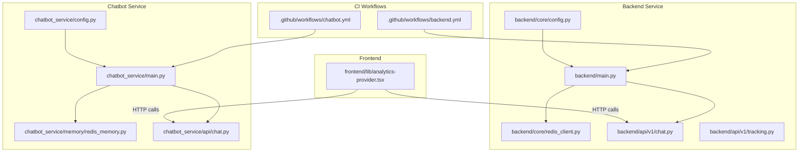
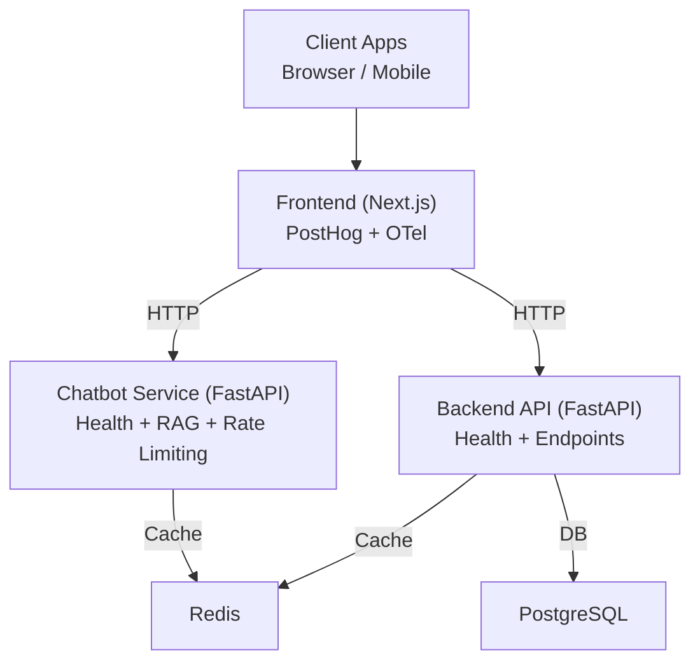
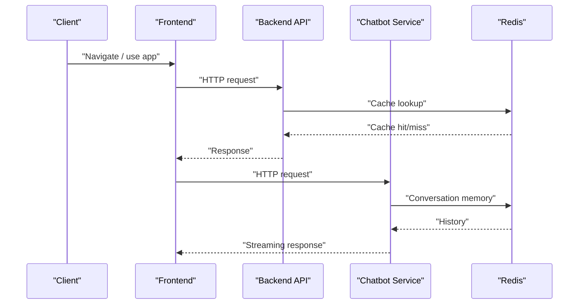
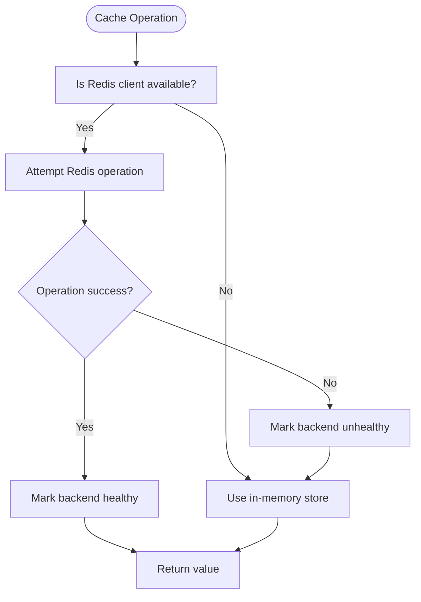
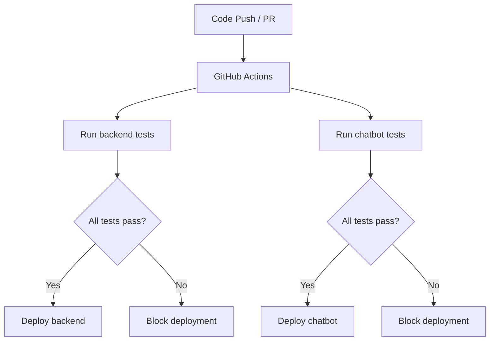
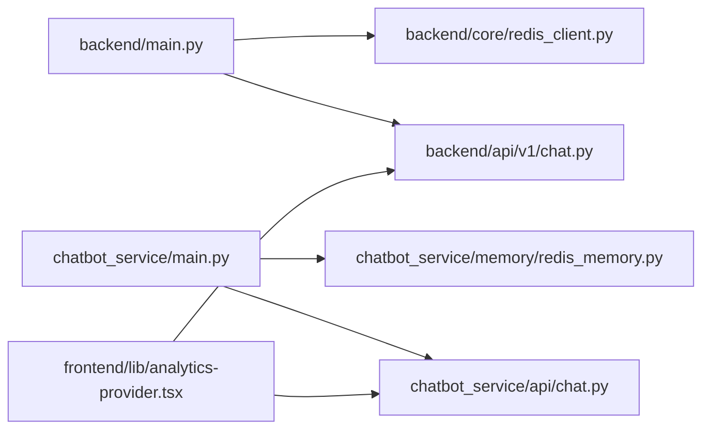

# Monitoring and Metrics

<cite>
**Referenced Files in This Document**
- [backend/main.py](file://backend/main.py)
- [chatbot_service/main.py](file://chatbot_service/main.py)
- [backend/core/config.py](file://backend/core/config.py)
- [chatbot_service/config.py](file://chatbot_service/config.py)
- [backend/core/redis_client.py](file://backend/core/redis_client.py)
- [chatbot_service/memory/redis_memory.py](file://chatbot_service/memory/redis_memory.py)
- [backend/api/v1/chat.py](file://backend/api/v1/chat.py)
- [chatbot_service/api/chat.py](file://chatbot_service/api/chat.py)
- [backend/api/v1/tracking.py](file://backend/api/v1/tracking.py)
- [frontend/lib/analytics-provider.tsx](file://frontend/lib/analytics-provider.tsx)
- [.github/workflows/backend.yml](file://.github/workflows/backend.yml)
- [.github/workflows/chatbot.yml](file://.github/workflows/chatbot.yml)
</cite>

## Table of Contents
1. [Introduction](#introduction)
2. [Project Structure](#project-structure)
3. [Core Components](#core-components)
4. [Architecture Overview](#architecture-overview)
5. [Detailed Component Analysis](#detailed-component-analysis)
6. [Dependency Analysis](#dependency-analysis)
7. [Performance Considerations](#performance-considerations)
8. [Troubleshooting Guide](#troubleshooting-guide)
9. [Conclusion](#conclusion)
10. [Appendices](#appendices)

## Introduction
This document defines monitoring and metrics practices for SafeVixAI, focusing on distributed tracing, KPIs, custom metrics, alerting, dashboards, and observability across microservices. It consolidates the current implementation signals present in the codebase and provides actionable guidance for observability maturity, including Redis caching, database query metrics, frontend user experience tracking, platform integrations, log aggregation, automated performance testing, capacity planning, regression detection, and cost optimization.

## Project Structure
SafeVixAI comprises three primary services:
- Backend API service (FastAPI): exposes REST endpoints, integrates Redis cache, and orchestrates domain services.
- Chatbot service (FastAPI): provides agentic RAG chat with rate limiting, streaming, and Redis-backed conversation memory.
- Frontend (Next.js): captures user analytics via PostHog and integrates OpenTelemetry SDKs.

**Diagram sources**
- [backend/main.py:24-132](file://backend/main.py#L24-L132)
- [chatbot_service/main.py:41-149](file://chatbot_service/main.py#L41-L149)
- [backend/core/config.py:11-181](file://backend/core/config.py#L11-L181)
- [chatbot_service/config.py:39-126](file://chatbot_service/config.py#L39-L126)
- [backend/core/redis_client.py:10-140](file://backend/core/redis_client.py#L10-L140)
- [chatbot_service/memory/redis_memory.py:10-90](file://chatbot_service/memory/redis_memory.py#L10-L90)
- [backend/api/v1/chat.py:10-24](file://backend/api/v1/chat.py#L10-L24)
- [chatbot_service/api/chat.py:16-111](file://chatbot_service/api/chat.py#L16-L111)
- [backend/api/v1/tracking.py:1-29](file://backend/api/v1/tracking.py#L1-L29)
- [frontend/lib/analytics-provider.tsx:1-26](file://frontend/lib/analytics-provider.tsx#L1-L26)
- [.github/workflows/backend.yml:1-55](file://.github/workflows/backend.yml#L1-L55)
- [.github/workflows/chatbot.yml:1-55](file://.github/workflows/chatbot.yml#L1-L55)

**Section sources**
- [backend/main.py:24-132](file://backend/main.py#L24-L132)
- [chatbot_service/main.py:41-149](file://chatbot_service/main.py#L41-L149)
- [backend/core/config.py:11-181](file://backend/core/config.py#L11-L181)
- [chatbot_service/config.py:39-126](file://chatbot_service/config.py#L39-L126)
- [backend/core/redis_client.py:10-140](file://backend/core/redis_client.py#L10-L140)
- [chatbot_service/memory/redis_memory.py:10-90](file://chatbot_service/memory/redis_memory.py#L10-L90)
- [backend/api/v1/chat.py:10-24](file://backend/api/v1/chat.py#L10-L24)
- [chatbot_service/api/chat.py:16-111](file://chatbot_service/api/chat.py#L16-L111)
- [backend/api/v1/tracking.py:1-29](file://backend/api/v1/tracking.py#L1-L29)
- [frontend/lib/analytics-provider.tsx:1-26](file://frontend/lib/analytics-provider.tsx#L1-L26)
- [.github/workflows/backend.yml:1-55](file://.github/workflows/backend.yml#L1-L55)
- [.github/workflows/chatbot.yml:1-55](file://.github/workflows/chatbot.yml#L1-L55)

## Core Components
- Backend API service
  - Application lifecycle manages Redis cache, domain services, and health checks.
  - Exposes REST endpoints including chat, emergency, routing, and geocoding.
  - Health endpoint reports database connectivity and cache availability.
- Chatbot service
  - Agentic RAG chat with rate limiting, streaming responses, and Redis-backed conversation memory.
  - Health endpoint reports memory backend availability.
- Frontend analytics
  - PostHog initialization for user analytics and pageleave capture.
  - OpenTelemetry SDKs present in lockfile indicating telemetry readiness.

Observability signals currently present:
- Health endpoints for backend and chatbot services.
- Redis-backed cache and conversation memory with ping/availability checks.
- Streaming chat API with structured SSE events.
- CI workflows for automated testing.

**Section sources**
- [backend/main.py:103-125](file://backend/main.py#L103-L125)
- [chatbot_service/main.py:106-115](file://chatbot_service/main.py#L106-L115)
- [backend/core/redis_client.py:115-124](file://backend/core/redis_client.py#L115-L124)
- [chatbot_service/memory/redis_memory.py:67-76](file://chatbot_service/memory/redis_memory.py#L67-L76)
- [chatbot_service/api/chat.py:43-97](file://chatbot_service/api/chat.py#L43-L97)
- [frontend/lib/analytics-provider.tsx:7-25](file://frontend/lib/analytics-provider.tsx#L7-L25)

## Architecture Overview
The system consists of two FastAPI services and a frontend, communicating over HTTP. Redis is used for caching and conversation memory. CI workflows run tests for both services.

**Diagram sources**
- [backend/main.py:65-128](file://backend/main.py#L65-L128)
- [chatbot_service/main.py:94-145](file://chatbot_service/main.py#L94-L145)
- [backend/core/redis_client.py:136-140](file://backend/core/redis_client.py#L136-L140)
- [chatbot_service/memory/redis_memory.py:10-16](file://chatbot_service/memory/redis_memory.py#L10-L16)

## Detailed Component Analysis

### Distributed Tracing and Request Correlation
Current state:
- No explicit tracing middleware or propagation libraries are imported in either service.
- Health endpoints and API routers are defined without trace context extraction or injection.

Recommended approach:
- Add OpenTelemetry instrumentation to both services to propagate trace IDs across requests.
- Extract/insert trace headers for outbound HTTP calls to upstream services (e.g., LLM providers).
- Tag spans with semantic attributes (service name, operation, HTTP method, path, status code).

**Diagram sources**
- [backend/api/v1/chat.py:17-23](file://backend/api/v1/chat.py#L17-L23)
- [chatbot_service/api/chat.py:28-40](file://chatbot_service/api/chat.py#L28-L40)
- [backend/core/redis_client.py:43-58](file://backend/core/redis_client.py#L43-L58)
- [chatbot_service/memory/redis_memory.py:23-44](file://chatbot_service/memory/redis_memory.py#L23-L44)

**Section sources**
- [backend/main.py:65-128](file://backend/main.py#L65-L128)
- [chatbot_service/main.py:94-145](file://chatbot_service/main.py#L94-L145)

### Key Performance Indicators (KPIs)
- Emergency response time
  - Backend emergency endpoints: measure end-to-end latency from request to response.
  - Chatbot streaming: track time-to-first-token and total response duration.
- AI chatbot response latency
  - Chat endpoint latency and streaming token delivery pacing.
- User engagement metrics
  - Frontend analytics: page views, page leave, and funnel events.
  - Chatbot session counts and average session length.

**Section sources**
- [chatbot_service/api/chat.py:43-97](file://chatbot_service/api/chat.py#L43-L97)
- [frontend/lib/analytics-provider.tsx:13-21](file://frontend/lib/analytics-provider.tsx#L13-L21)

### Custom Metrics Collection
- Backend
  - Expose Prometheus-compatible metrics endpoint via an ASGI middleware or exporter.
  - Track HTTP request durations, cache hits/misses, and database pool usage.
- Chatbot
  - Track rate-limit triggers, streaming completion, and provider selection success/failure.
- Frontend
  - Capture user action timings and navigation metrics via PostHog and OpenTelemetry.

**Section sources**
- [backend/main.py:103-125](file://backend/main.py#L103-L125)
- [chatbot_service/main.py:106-115](file://chatbot_service/main.py#L106-L115)

### Alerting Strategies
- Health degradation thresholds
  - Backend: database unavailable or cache ping failure.
  - Chatbot: memory backend unreachable.
- Latency SLOs
  - Chatbot: p95/p99 response latency targets.
- Rate limiting
  - Chatbot: rate limit exceeded events.
- Capacity signals
  - Redis memory usage and eviction events; database connection pool exhaustion.

**Section sources**
- [backend/main.py:103-125](file://backend/main.py#L103-L125)
- [chatbot_service/main.py:106-115](file://chatbot_service/main.py#L106-L115)
- [chatbot_service/api/chat.py:29-40](file://chatbot_service/api/chat.py#L29-L40)

### Performance Dashboards
- Backend
  - Requests per second, error rates, cache hit ratio, DB pool usage.
- Chatbot
  - Chat requests, streaming completion, provider latency, rate limit counters.
- Frontend
  - Page views, page leave, conversion funnels, device/region breakdown.

**Section sources**
- [backend/api/v1/chat.py:17-23](file://backend/api/v1/chat.py#L17-L23)
- [chatbot_service/api/chat.py:28-40](file://chatbot_service/api/chat.py#L28-L40)
- [frontend/lib/analytics-provider.tsx:13-21](file://frontend/lib/analytics-provider.tsx#L13-L21)

### Observability Patterns

#### Redis Caching Performance
- Backend cache helper
  - Provides JSON get/set/delete and integer increment with Redis fallback.
  - Tracks backend health flag on exceptions.
- Chatbot conversation memory
  - Uses Redis lists with TTL for sessions and falls back to in-memory storage.

**Diagram sources**
- [backend/core/redis_client.py:43-124](file://backend/core/redis_client.py#L43-L124)
- [chatbot_service/memory/redis_memory.py:23-76](file://chatbot_service/memory/redis_memory.py#L23-L76)

**Section sources**
- [backend/core/redis_client.py:10-140](file://backend/core/redis_client.py#L10-L140)
- [chatbot_service/memory/redis_memory.py:10-90](file://chatbot_service/memory/redis_memory.py#L10-L90)

#### Database Query Metrics
- Backend uses async SQLAlchemy with configurable pool size and timeouts.
- Health endpoint reports database availability.

Recommendations:
- Instrument SQL queries with OpenTelemetry to capture query durations and error rates.
- Track pool usage and timeouts to detect saturation.

**Section sources**
- [backend/core/config.py:19-24](file://backend/core/config.py#L19-L24)
- [backend/main.py:103-125](file://backend/main.py#L103-L125)

#### Frontend User Experience Tracking
- PostHog provider initializes with environment variables and manual pageleave capture.
- OpenTelemetry SDKs present in lockfile for potential browser-side telemetry.

Recommendations:
- Define user journey events (e.g., “Emergency SOS clicked”, “Chat started”).
- Track time-to-interactive and error boundaries.

**Section sources**
- [frontend/lib/analytics-provider.tsx:7-25](file://frontend/lib/analytics-provider.tsx#L7-L25)

### Integration with Monitoring Platforms
- Backend
  - Expose metrics endpoint and integrate with Prometheus/Grafana.
  - Ship logs to centralized aggregator (e.g., Loki) and correlate with traces.
- Chatbot
  - Same pattern as backend with additional rate-limit and streaming metrics.
- Frontend
  - Export telemetry to backend or directly to vendor collectors.

**Section sources**
- [backend/main.py:103-125](file://backend/main.py#L103-L125)
- [chatbot_service/main.py:106-115](file://chatbot_service/main.py#L106-L115)

### Log Aggregation Strategies
- Centralize service logs and correlate by request ID.
- Forward logs to ELK/Fluent Bit/Loki for querying and alerting.
- Include structured context (service, endpoint, user ID) in logs.

**Section sources**
- [backend/api/v1/chat.py:17-23](file://backend/api/v1/chat.py#L17-L23)
- [chatbot_service/api/chat.py:28-40](file://chatbot_service/api/chat.py#L28-L40)

### Automated Performance Testing Workflows
- CI pipelines run tests for backend and chatbot services.
- Extend workflows to include synthetic load tests and SLO validation.

**Diagram sources**
- [.github/workflows/backend.yml:18-55](file://.github/workflows/backend.yml#L18-L55)
- [.github/workflows/chatbot.yml:18-55](file://.github/workflows/chatbot.yml#L18-L55)

**Section sources**
- [.github/workflows/backend.yml:1-55](file://.github/workflows/backend.yml#L1-55)
- [.github/workflows/chatbot.yml:1-55](file://.github/workflows/chatbot.yml#L1-55)

## Dependency Analysis
- Backend depends on Redis cache and domain services; health checks surface cache backend name and availability.
- Chatbot depends on Redis for conversation memory and rate limiting; health checks surface memory availability.
- Both services expose health endpoints suitable for load balancer probes.

**Diagram sources**
- [backend/main.py:24-63](file://backend/main.py#L24-L63)
- [chatbot_service/main.py:44-93](file://chatbot_service/main.py#L44-L93)
- [backend/core/redis_client.py:10-140](file://backend/core/redis_client.py#L10-L140)
- [chatbot_service/memory/redis_memory.py:10-90](file://chatbot_service/memory/redis_memory.py#L10-L90)
- [backend/api/v1/chat.py:17-23](file://backend/api/v1/chat.py#L17-L23)
- [chatbot_service/api/chat.py:28-40](file://chatbot_service/api/chat.py#L28-L40)
- [frontend/lib/analytics-provider.tsx:7-25](file://frontend/lib/analytics-provider.tsx#L7-L25)

**Section sources**
- [backend/main.py:24-63](file://backend/main.py#L24-L63)
- [chatbot_service/main.py:44-93](file://chatbot_service/main.py#L44-L93)

## Performance Considerations
- Redis fallback
  - Both cache helpers fall back to in-memory storage when Redis is unavailable, preventing outages but reducing persistence and sharing across instances.
- Streaming UX
  - Chatbot simulates streaming by emitting tokens at a fixed cadence; ensure upstream providers support true streaming for improved latency.
- Health checks
  - Use health endpoints for readiness/liveness probes; surface cache backend status to inform autoscaling decisions.

**Section sources**
- [backend/core/redis_client.py:115-124](file://backend/core/redis_client.py#L115-L124)
- [chatbot_service/memory/redis_memory.py:67-76](file://chatbot_service/memory/redis_memory.py#L67-L76)
- [chatbot_service/api/chat.py:43-97](file://chatbot_service/api/chat.py#L43-L97)

## Troubleshooting Guide
- Backend health degraded
  - Inspect database connectivity and cache availability; adjust timeouts and retry policies.
- Chatbot memory unavailable
  - Verify Redis connectivity; confirm session TTL and list operations.
- Streaming errors
  - Review SSE event generator error handling and client buffering headers.

**Section sources**
- [backend/main.py:103-125](file://backend/main.py#L103-L125)
- [chatbot_service/main.py:106-115](file://chatbot_service/main.py#L106-L115)
- [chatbot_service/api/chat.py:84-87](file://chatbot_service/api/chat.py#L84-L87)

## Conclusion
SafeVixAI’s services currently provide foundational health signals and Redis-backed caching/memory. To achieve robust observability, integrate OpenTelemetry for distributed tracing, instrument custom metrics for KPIs, and expand log aggregation and alerting. Extend CI with performance tests and SLO validation to support capacity planning and regression detection. Align frontend telemetry with backend metrics for end-to-end visibility.

## Appendices

### Appendix A: Configuration References
- Backend settings include database, Redis, timeouts, and chatbot integration parameters.
- Chatbot settings include Redis, RAG directories, embedding model, retrieval top-k, and provider configuration.

**Section sources**
- [backend/core/config.py:19-60](file://backend/core/config.py#L19-L60)
- [chatbot_service/config.py:40-113](file://chatbot_service/config.py#L40-L113)