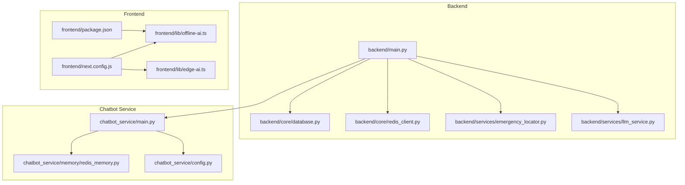
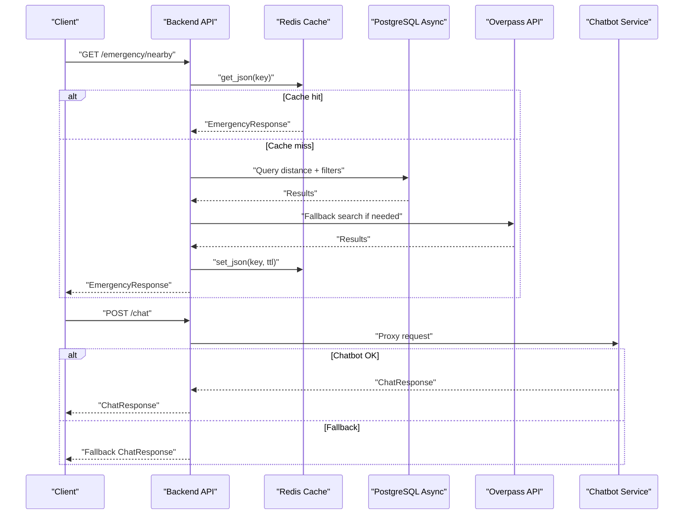
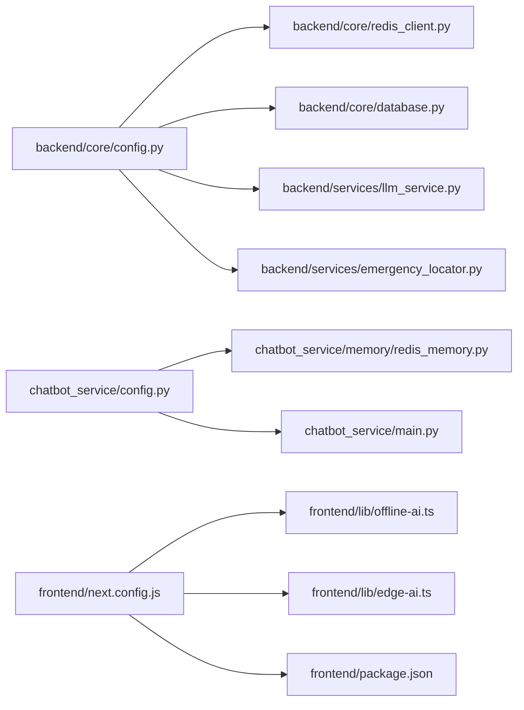

# Performance Optimization

<cite>
**Referenced Files in This Document**
- [backend/main.py](file://backend/main.py)
- [backend/core/redis_client.py](file://backend/core/redis_client.py)
- [backend/core/database.py](file://backend/core/database.py)
- [backend/services/emergency_locator.py](file://backend/services/emergency_locator.py)
- [backend/services/llm_service.py](file://backend/services/llm_service.py)
- [chatbot_service/main.py](file://chatbot_service/main.py)
- [chatbot_service/memory/redis_memory.py](file://chatbot_service/memory/redis_memory.py)
- [chatbot_service/config.py](file://chatbot_service/config.py)
- [frontend/next.config.js](file://frontend/next.config.js)
- [frontend/lib/offline-ai.ts](file://frontend/lib/offline-ai.ts)
- [frontend/lib/edge-ai.ts](file://frontend/lib/edge-ai.ts)
- [frontend/package.json](file://frontend/package.json)
- [backend/core/config.py](file://backend/core/config.py)
</cite>

## Table of Contents
1. [Introduction](#introduction)
2. [Project Structure](#project-structure)
3. [Core Components](#core-components)
4. [Architecture Overview](#architecture-overview)
5. [Detailed Component Analysis](#detailed-component-analysis)
6. [Dependency Analysis](#dependency-analysis)
7. [Performance Considerations](#performance-considerations)
8. [Troubleshooting Guide](#troubleshooting-guide)
9. [Conclusion](#conclusion)
10. [Appendices](#appendices)

## Introduction
This document provides a comprehensive performance optimization guide for SafeVixAI across all components. It covers caching strategies with Redis, database query optimization and connection pooling, AI model inference optimization, WebAssembly and offline model loading, frontend performance improvements, monitoring and metrics, and scalability and cost-effective deployment strategies. The goal is to make actionable insights accessible to beginners while offering sufficient technical depth for performance engineers.

## Project Structure
SafeVixAI consists of:
- Backend API (FastAPI) exposing emergency locator, routing, geocoding, and chat integrations
- Chatbot service (FastAPI) with RAG, vector storage, and provider routing
- Frontend (Next.js) with offline AI, WebAssembly/WebGPU, and PWA capabilities

**Diagram sources**
- [backend/main.py:24-128](file://backend/main.py#L24-L128)
- [backend/core/database.py:16-41](file://backend/core/database.py#L16-L41)
- [backend/core/redis_client.py:136-139](file://backend/core/redis_client.py#L136-L139)
- [backend/services/emergency_locator.py:161-300](file://backend/services/emergency_locator.py#L161-L300)
- [backend/services/llm_service.py:11-68](file://backend/services/llm_service.py#L11-L68)
- [chatbot_service/main.py:41-145](file://chatbot_service/main.py#L41-L145)
- [chatbot_service/memory/redis_memory.py:10-90](file://chatbot_service/memory/redis_memory.py#L10-L90)
- [chatbot_service/config.py:39-113](file://chatbot_service/config.py#L39-L113)
- [frontend/next.config.js:19-39](file://frontend/next.config.js#L19-L39)
- [frontend/lib/offline-ai.ts:124-154](file://frontend/lib/offline-ai.ts#L124-L154)
- [frontend/lib/edge-ai.ts:15-28](file://frontend/lib/edge-ai.ts#L15-L28)
- [frontend/package.json:14-53](file://frontend/package.json#L14-L53)

**Section sources**
- [backend/main.py:24-128](file://backend/main.py#L24-L128)
- [chatbot_service/main.py:41-145](file://chatbot_service/main.py#L41-L145)
- [frontend/next.config.js:19-39](file://frontend/next.config.js#L19-L39)

## Core Components
- Caching layer abstraction with Redis and in-memory fallback
- Database connection pooling and async ORM usage
- Emergency locator with multi-source fallback and caching
- LLM proxy with graceful degradation
- Chatbot memory with Redis-backed sessions
- Frontend offline AI with WebAssembly and WebGPU

Key performance-relevant configurations:
- Database pool sizing and timeouts
- Redis TTLs for emergency, geocoding, routing, and authority caches
- Emergency radius search steps and minimum results thresholds
- Frontend WebAssembly and worker configuration for Transformers.js

**Section sources**
- [backend/core/redis_client.py:10-139](file://backend/core/redis_client.py#L10-L139)
- [backend/core/database.py:16-41](file://backend/core/database.py#L16-L41)
- [backend/services/emergency_locator.py:161-300](file://backend/services/emergency_locator.py#L161-L300)
- [backend/services/llm_service.py:11-68](file://backend/services/llm_service.py#L11-L68)
- [chatbot_service/memory/redis_memory.py:10-90](file://chatbot_service/memory/redis_memory.py#L10-L90)
- [frontend/next.config.js:19-39](file://frontend/next.config.js#L19-L39)

## Architecture Overview
High-level runtime flow:
- Backend FastAPI app initializes services and mounts routers
- Emergency locator queries database with geographic distance, merges with local catalog and Overpass fallback, caches results
- LLM proxy forwards requests to chatbot service with fallback responses
- Frontend supports offline AI via system APIs or Transformers.js with WebGPU/WASM

**Diagram sources**
- [backend/services/emergency_locator.py:187-216](file://backend/services/emergency_locator.py#L187-L216)
- [backend/core/redis_client.py:43-70](file://backend/core/redis_client.py#L43-L70)
- [backend/services/emergency_locator.py:301-373](file://backend/services/emergency_locator.py#L301-L373)
- [backend/services/llm_service.py:26-36](file://backend/services/llm_service.py#L26-L36)
- [chatbot_service/main.py:41-93](file://chatbot_service/main.py#L41-L93)

## Detailed Component Analysis

### Caching Strategies with Redis
- Dual-backend cache abstraction: Redis primary with in-memory fallback on failure
- TTL-driven invalidation for emergency, geocoding, routing, and authority data
- Incremental counters and integer helpers for lightweight metrics
- Health checks surface backend availability

Optimization tips:
- Tune TTLs per data volatility (emergency hotspots vs static numbers)
- Monitor cache hit ratio and adjust TTLs accordingly
- Use cache keys with explicit namespaces to avoid collisions
- Enable Redis cluster/replication for HA and reduced latency

**Section sources**
- [backend/core/redis_client.py:10-139](file://backend/core/redis_client.py#L10-L139)
- [backend/core/config.py:33-36](file://backend/core/config.py#L33-L36)
- [chatbot_service/memory/redis_memory.py:10-90](file://chatbot_service/memory/redis_memory.py#L10-L90)

### Database Query Optimization and Connection Pooling
- Async SQLAlchemy engine with configurable pool size, overflow, and timeouts
- Pre-ping and recycle settings to keep connections healthy
- Geographic distance queries using geography types and ST_Distance/ST_DWithin
- Multi-step radius search to reduce overfetching and improve relevance

Optimization tips:
- Add spatial indexes on geography columns for distance queries
- Use LIMIT and ORDER BY wisely; consider partial indexes for frequent filters
- Batch external service calls (Overpass) and cache intermediate results
- Monitor pool utilization and adjust pool size based on concurrent workload

**Section sources**
- [backend/core/database.py:16-41](file://backend/core/database.py#L16-L41)
- [backend/services/emergency_locator.py:375-421](file://backend/services/emergency_locator.py#L375-L421)

### AI Model Inference Optimization
- Backend LLM proxy with timeout and fallback responses
- Frontend offline AI with three-tier strategy: system AI (Chrome/Android), Transformers.js with WebGPU/WASM, keyword fallback
- Webpack configuration enabling async WebAssembly and worker loaders for Transformers.js

Optimization tips:
- Quantize models (4-bit) and leverage WebGPU for acceleration
- Cache model artifacts in browser Cache Storage to avoid re-download
- Use progressive enhancement: prefer system AI, then Transformers.js, then keyword fallback
- Minimize model size and optimize prompts for deterministic, concise responses

**Section sources**
- [backend/services/llm_service.py:11-68](file://backend/services/llm_service.py#L11-L68)
- [frontend/lib/offline-ai.ts:124-154](file://frontend/lib/offline-ai.ts#L124-L154)
- [frontend/next.config.js:23-30](file://frontend/next.config.js#L23-L30)
- [frontend/package.json:17-18](file://frontend/package.json#L17-L18)

### WebAssembly Integration and Offline Model Loading
- Next.js Webpack config enables asyncWebAssembly and worker-loader for Transformers.js workers
- Offline AI loader dynamically imports @huggingface/transformers and sets browser cache usage
- Status tracking and progress callbacks for user feedback

Optimization tips:
- Serve model files via CDN with long-lived cache headers
- Use Service Worker caching for offline bundles
- Provide granular progress updates to reduce perceived latency
- Graceful degradation to keyword fallback when model fails to load

**Section sources**
- [frontend/next.config.js:19-39](file://frontend/next.config.js#L19-L39)
- [frontend/lib/offline-ai.ts:71-110](file://frontend/lib/offline-ai.ts#L71-L110)

### Frontend Performance Improvements
- Code splitting and lazy loading via dynamic imports (offline AI)
- Webpack experiments for WebAssembly and workers
- Lightweight offline AI engine for minimal footprint
- Bundle optimization through dependency management

Optimization tips:
- Split large pages and components to reduce initial bundle size
- Use React.lazy and Suspense for non-critical features
- Optimize image assets and enable remote patterns
- Prefer lightweight libraries and tree-shaking

**Section sources**
- [frontend/lib/offline-ai.ts:74-75](file://frontend/lib/offline-ai.ts#L74-L75)
- [frontend/next.config.js:23-30](file://frontend/next.config.js#L23-L30)
- [frontend/package.json:14-53](file://frontend/package.json#L14-L53)

### Monitoring, Metrics, and Bottleneck Identification
- Health endpoints expose database and cache availability
- Redis cache health flags indicate backend status
- LLM proxy fallback responses provide resilience signals
- Session TTLs in Redis memory store help track conversation lifecycles

Optimization tips:
- Instrument cache hit rates, database pool utilization, and request latency
- Add structured logs for cache misses and fallback triggers
- Track offline AI initialization time and success rate
- Use APM tools to identify slow routes and external service calls

**Section sources**
- [backend/main.py:103-125](file://backend/main.py#L103-L125)
- [backend/core/redis_client.py:115-124](file://backend/core/redis_client.py#L115-L124)
- [chatbot_service/main.py:106-115](file://chatbot_service/main.py#L106-L115)
- [chatbot_service/memory/redis_memory.py:67-76](file://chatbot_service/memory/redis_memory.py#L67-L76)

### Scalability and Cost-Effective Deployment
- Horizontal scaling: multiple backend and chatbot instances behind a load balancer
- Redis clustering/replication for low-latency caching
- Database connection pooling tuned to instance capacity
- CDN for frontend assets and offline model bundles
- Containerization with resource limits and readiness probes

Optimization tips:
- Auto-scale based on CPU, memory, and queue length metrics
- Use managed Redis and PostgreSQL services for HA and maintenance
- Cache warm-up strategies for emergency bundles and popular routes
- Right-size container resources and enable connection reuse

**Section sources**
- [backend/core/config.py:19-24](file://backend/core/config.py#L19-L24)
- [backend/core/database.py:21-29](file://backend/core/database.py#L21-L29)
- [chatbot_service/config.py:47-66](file://chatbot_service/config.py#L47-L66)

## Dependency Analysis

**Diagram sources**
- [backend/core/config.py:19-68](file://backend/core/config.py#L19-L68)
- [backend/core/redis_client.py:136-139](file://backend/core/redis_client.py#L136-L139)
- [backend/core/database.py:16-41](file://backend/core/database.py#L16-L41)
- [backend/services/llm_service.py:11-22](file://backend/services/llm_service.py#L11-L22)
- [backend/services/emergency_locator.py:161-166](file://backend/services/emergency_locator.py#L161-L166)
- [chatbot_service/config.py:39-113](file://chatbot_service/config.py#L39-L113)
- [chatbot_service/memory/redis_memory.py:10-15](file://chatbot_service/memory/redis_memory.py#L10-L15)
- [chatbot_service/main.py:41-93](file://chatbot_service/main.py#L41-L93)
- [frontend/next.config.js:19-39](file://frontend/next.config.js#L19-L39)
- [frontend/lib/offline-ai.ts:74-110](file://frontend/lib/offline-ai.ts#L74-L110)
- [frontend/lib/edge-ai.ts:15-28](file://frontend/lib/edge-ai.ts#L15-L28)
- [frontend/package.json:14-53](file://frontend/package.json#L14-L53)

**Section sources**
- [backend/core/config.py:19-68](file://backend/core/config.py#L19-L68)
- [chatbot_service/config.py:39-113](file://chatbot_service/config.py#L39-L113)
- [frontend/next.config.js:19-39](file://frontend/next.config.js#L19-L39)

## Performance Considerations
- Caching
  - Use cache keys with explicit namespaces and TTLs aligned to data volatility
  - Monitor cache hit ratios and adjust TTLs proactively
  - Implement cache warming for emergency bundles and popular routes
- Database
  - Add spatial indexes and optimize distance queries with ST_DWithin
  - Tune pool size and timeouts; monitor pool saturation
  - Use multi-step radius search to reduce overfetching
- AI Inference
  - Quantize models and leverage WebGPU acceleration
  - Cache model artifacts and provide user feedback during download
  - Prefer system AI when available to minimize bandwidth and latency
- Frontend
  - Split bundles and lazy-load non-critical features
  - Optimize image assets and enable remote patterns
  - Use lightweight offline engines for minimal footprint
- Observability
  - Expose health endpoints and cache health flags
  - Instrument cache misses, database pool usage, and request latency
  - Track offline AI initialization and fallback triggers

[No sources needed since this section provides general guidance]

## Troubleshooting Guide
Common issues and remedies:
- Cache unavailability
  - Symptoms: degraded performance, fallback to in-memory cache
  - Actions: verify Redis connectivity, increase TTLs, enable cluster/replication
- Database pool exhaustion
  - Symptoms: timeouts, slow queries
  - Actions: increase pool size and timeouts, add indexes, review queries
- Emergency locator failures
  - Symptoms: empty results or slow responses
  - Actions: verify Overpass fallback, adjust radius steps, tune cache TTLs
- LLM proxy errors
  - Symptoms: fallback responses
  - Actions: increase timeouts, configure fallback messages, monitor chatbot service health
- Offline AI not loading
  - Symptoms: fallback to keyword responses
  - Actions: check WebAssembly and worker configuration, verify CDN accessibility, provide progress feedback

**Section sources**
- [backend/core/redis_client.py:115-124](file://backend/core/redis_client.py#L115-L124)
- [backend/core/database.py:43-49](file://backend/core/database.py#L43-L49)
- [backend/services/emergency_locator.py:178-185](file://backend/services/emergency_locator.py#L178-L185)
- [backend/services/llm_service.py:26-36](file://backend/services/llm_service.py#L26-L36)
- [frontend/next.config.js:23-30](file://frontend/next.config.js#L23-L30)

## Conclusion
By combining robust caching with Redis, optimized database queries, efficient AI inference strategies, and frontend performance enhancements, SafeVixAI can achieve high responsiveness and reliability. Implementing the recommendations above—tuning TTLs, adding spatial indexes, leveraging WebGPU, and instrumenting observability—will significantly improve user experience and operational efficiency.

[No sources needed since this section summarizes without analyzing specific files]

## Appendices

### Configuration Reference
- Backend database pool and cache TTLs
  - [backend/core/config.py:19-36](file://backend/core/config.py#L19-L36)
  - [backend/core/database.py:21-29](file://backend/core/database.py#L21-L29)
- Chatbot memory and session TTLs
  - [chatbot_service/config.py:47-66](file://chatbot_service/config.py#L47-L66)
  - [chatbot_service/memory/redis_memory.py:10-15](file://chatbot_service/memory/redis_memory.py#L10-L15)
- Frontend WebAssembly and worker settings
  - [frontend/next.config.js:23-30](file://frontend/next.config.js#L23-L30)

**Section sources**
- [backend/core/config.py:19-36](file://backend/core/config.py#L19-L36)
- [backend/core/database.py:21-29](file://backend/core/database.py#L21-L29)
- [chatbot_service/config.py:47-66](file://chatbot_service/config.py#L47-L66)
- [chatbot_service/memory/redis_memory.py:10-15](file://chatbot_service/memory/redis_memory.py#L10-L15)
- [frontend/next.config.js:23-30](file://frontend/next.config.js#L23-L30)