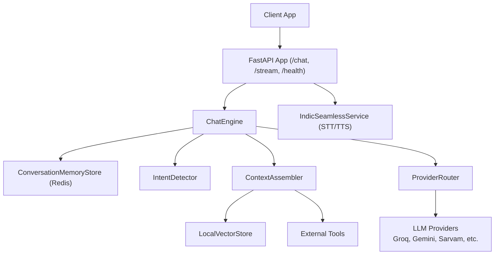
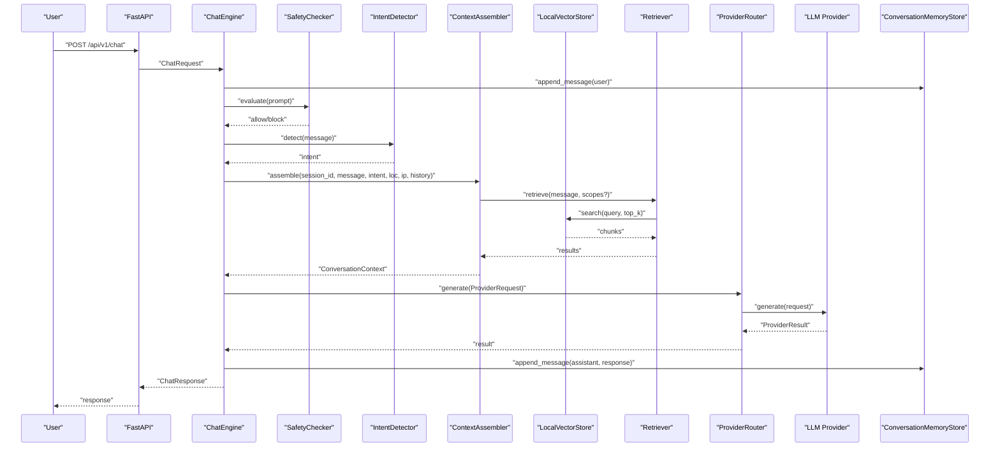
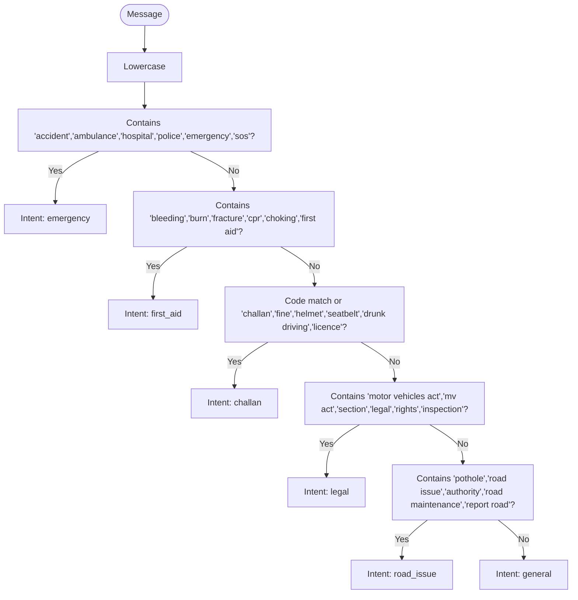
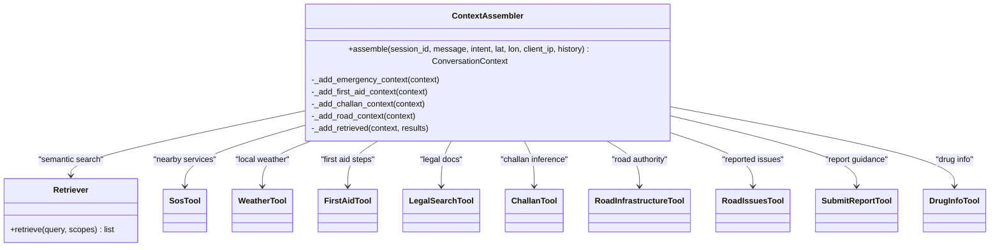
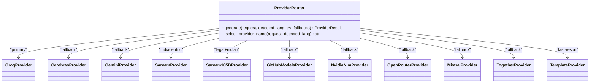
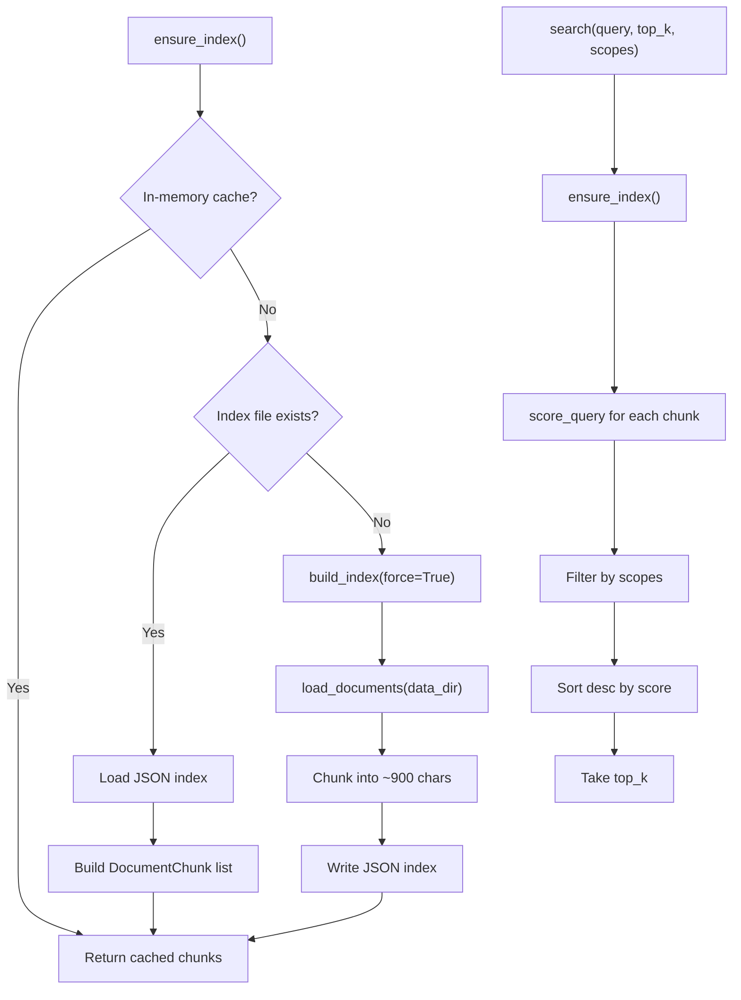
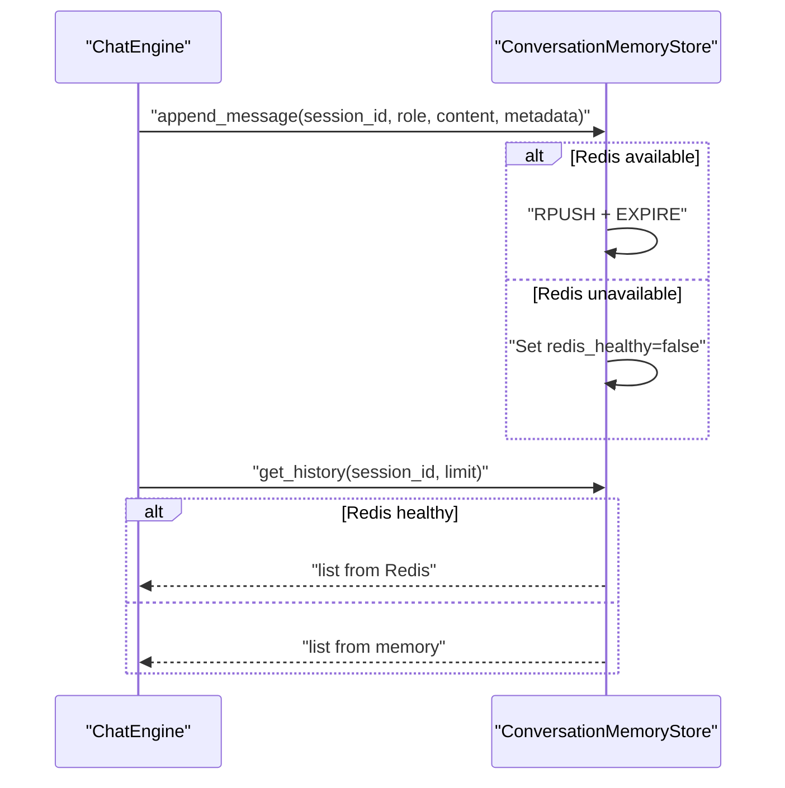
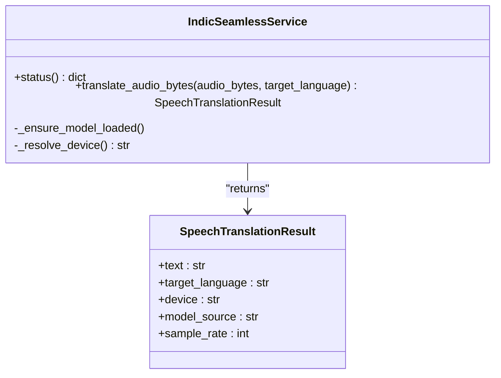
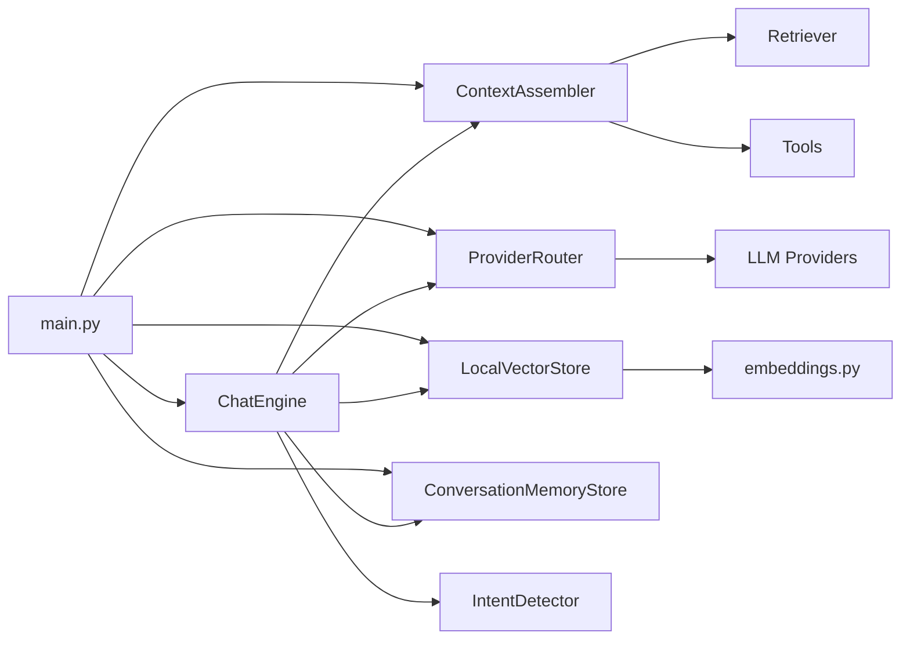

# AI Chatbot Service

<cite>
**Referenced Files in This Document**
- [main.py](file://chatbot_service/main.py)
- [config.py](file://chatbot_service/config.py)
- [intent_detector.py](file://chatbot_service/agent/intent_detector.py)
- [context_assembler.py](file://chatbot_service/agent/context_assembler.py)
- [state.py](file://chatbot_service/agent/state.py)
- [graph.py](file://chatbot_service/agent/graph.py)
- [router.py](file://chatbot_service/providers/router.py)
- [groq_provider.py](file://chatbot_service/providers/groq_provider.py)
- [gemini_provider.py](file://chatbot_service/providers/gemini_provider.py)
- [sarvam_provider.py](file://chatbot_service/providers/sarvam_provider.py)
- [vectorstore.py](file://chatbot_service/rag/vectorstore.py)
- [embeddings.py](file://chatbot_service/rag/embeddings.py)
- [redis_memory.py](file://chatbot_service/memory/redis_memory.py)
- [speech_translation.py](file://chatbot_service/services/speech_translation.py)
- [emergency_tool.py](file://chatbot_service/tools/emergency_tool.py)
</cite>

## Table of Contents
1. [Introduction](#introduction)
2. [Project Structure](#project-structure)
3. [Core Components](#core-components)
4. [Architecture Overview](#architecture-overview)
5. [Detailed Component Analysis](#detailed-component-analysis)
6. [Dependency Analysis](#dependency-analysis)
7. [Performance Considerations](#performance-considerations)
8. [Troubleshooting Guide](#troubleshooting-guide)
9. [Conclusion](#conclusion)
10. [Appendices](#appendices)

## Introduction
This document describes the AI Chatbot Service that powers intelligent legal assistance and first aid guidance for road safety in India. It is an agentic Retrieval-Augmented Generation (RAG) system that:
- Detects user intent across nine classes of queries
- Assembles contextual information from vector retrieval, tools, and conversation history
- Routes to multiple LLM providers with automatic failover
- Integrates external services for emergencies, weather, geocoding, and road infrastructure
- Provides voice input/output capabilities with offline-friendly speech models
- Manages conversation memory with Redis and falls back to in-memory storage
- Supports multilingual interactions with Indian language routing and translation

## Project Structure
The chatbot service is organized around a FastAPI application that wires together:
- Agent orchestration (intent detection, context assembly, safety checks)
- Multi-provider LLM routing with fallback
- Vector store for legal and emergency documents
- Tools for external integrations
- Memory store for conversation history
- Speech translation service for voice I/O

**Diagram sources**
- [main.py:41-145](file://chatbot_service/main.py#L41-L145)
- [graph.py:15-109](file://chatbot_service/agent/graph.py#L15-L109)
- [router.py:75-199](file://chatbot_service/providers/router.py#L75-L199)
- [vectorstore.py:20-110](file://chatbot_service/rag/vectorstore.py#L20-L110)
- [redis_memory.py:10-90](file://chatbot_service/memory/redis_memory.py#L10-L90)
- [speech_translation.py:34-141](file://chatbot_service/services/speech_translation.py#L34-L141)

**Section sources**
- [main.py:41-145](file://chatbot_service/main.py#L41-L145)

## Core Components
- Intent Detection: Classifies incoming messages into nine intent buckets including emergency, first aid, challan, legal, road_issue, and general.
- Context Assembly: Builds a unified prompt by retrieving relevant documents, invoking tools for location-aware services, and enriching with conversation history.
- Provider Routing: Selects the optimal LLM provider based on language, intent, and availability, with a robust fallback chain.
- Vector Store: Loads and indexes legal and emergency documents locally, enabling semantic search.
- Memory Management: Persists chat histories with Redis and falls back to in-memory storage.
- Speech Translation: Provides offline-capable speech-to-text translation for multilingual input.
- Safety Checker: Evaluates prompts for policy compliance before generation.

**Section sources**
- [intent_detector.py:9-25](file://chatbot_service/agent/intent_detector.py#L9-L25)
- [context_assembler.py:17-215](file://chatbot_service/agent/context_assembler.py#L17-L215)
- [router.py:75-199](file://chatbot_service/providers/router.py#L75-L199)
- [vectorstore.py:20-110](file://chatbot_service/rag/vectorstore.py#L20-L110)
- [redis_memory.py:10-90](file://chatbot_service/memory/redis_memory.py#L10-L90)
- [speech_translation.py:34-141](file://chatbot_service/services/speech_translation.py#L34-L141)
- [state.py:9-52](file://chatbot_service/agent/state.py#L9-L52)

## Architecture Overview
The system follows an agentic RAG pattern:
- The ChatEngine orchestrates the lifecycle: safety check, intent detection, context assembly, provider selection, and response formatting.
- ContextAssembler selects tools and retriever scopes per intent and augments the prompt with retrieved snippets and tool summaries.
- ProviderRouter applies language-aware routing and automatic failover across multiple providers.
- VectorStore indexes documents and performs semantic search with scoring.
- MemoryStore persists and retrieves conversation history.
- SpeechTranslationService supports voice input with offline-friendly models.

**Diagram sources**
- [graph.py:33-87](file://chatbot_service/agent/graph.py#L33-L87)
- [context_assembler.py:43-81](file://chatbot_service/agent/context_assembler.py#L43-L81)
- [vectorstore.py:51-68](file://chatbot_service/rag/vectorstore.py#L51-L68)
- [router.py:154-199](file://chatbot_service/providers/router.py#L154-L199)
- [redis_memory.py:23-44](file://chatbot_service/memory/redis_memory.py#L23-L44)

## Detailed Component Analysis

### Intent Detection
The intent detector classifies user messages into nine categories:
- emergency: presence of keywords related to accidents, ambulances, hospitals, police, SOS
- first_aid: keywords for bleeding, burns, fractures, CPR, choking, first aid
- challan: mentions of challan/fine/helmet/seatbelt/drunk driving/licence and specific challan codes
- legal: motor vehicles act, sections, legal rights, inspection
- road_issue: potholes, road issues, authorities, maintenance, reporting roads
- general: default classification

**Diagram sources**
- [intent_detector.py:10-24](file://chatbot_service/agent/intent_detector.py#L10-L24)

**Section sources**
- [intent_detector.py:9-25](file://chatbot_service/agent/intent_detector.py#L9-L25)

### Context Assembly
ContextAssembler builds a unified context per intent:
- emergency: adds nearby emergency services and weather near coordinates; retrieves medical/emergency/healthcare documents
- first_aid: adds first aid steps and optionally FDA drug info extracted from the message; retrieves medical documents
- challan: infers applicable sections and calculates fines; retrieves legal documents
- legal: retrieves legal documents
- road_issue: adds road infrastructure and nearby reported issues; optionally adds submission guidance
- general: retrieves broadly across categories

It also limits retrieved snippets and deduplicates tool and document sources.

**Diagram sources**
- [context_assembler.py:17-215](file://chatbot_service/agent/context_assembler.py#L17-L215)

**Section sources**
- [context_assembler.py:43-215](file://chatbot_service/agent/context_assembler.py#L43-L215)

### Provider Routing and Multi-Provider LLM Support
ProviderRouter implements a 9-provider fallback chain with language-aware routing:
- Primary routing:
  - Indian language input → Sarvam AI (30B or 105B variant)
  - Legal/challan intent in Indian language → Sarvam-105B
  - Explicit provider hint or default provider
- Fallback chain prioritizes speed and capacity:
  - Groq (fastest English), Cerebras (overflow), Gemini (large context), GitHub/NVIDIA/OpenRouter/Mistral/Together, ending with template provider

**Diagram sources**
- [router.py:75-199](file://chatbot_service/providers/router.py#L75-L199)
- [groq_provider.py:10-23](file://chatbot_service/providers/groq_provider.py#L10-L23)
- [gemini_provider.py:18-71](file://chatbot_service/providers/gemini_provider.py#L18-L71)
- [sarvam_provider.py:44-125](file://chatbot_service/providers/sarvam_provider.py#L44-L125)

**Section sources**
- [router.py:1-199](file://chatbot_service/providers/router.py#L1-L199)
- [groq_provider.py:1-23](file://chatbot_service/providers/groq_provider.py#L1-L23)
- [gemini_provider.py:1-71](file://chatbot_service/providers/gemini_provider.py#L1-L71)
- [sarvam_provider.py:1-125](file://chatbot_service/providers/sarvam_provider.py#L1-L125)

### Vector Store Implementation
LocalVectorStore indexes documents from a data directory and persists a JSON index:
- Index loading: loads existing index or builds a new one
- Index building: loads documents, chunks them into fixed-size segments, and writes JSON
- Search: computes token overlap and phrase bonuses, filters by category scopes, sorts by score, returns top-k
- Stats: reports total chunks and unique categories

Embedding utilities:
- normalize_text: collapses whitespace
- tokenize: extracts alpha-numeric tokens
- score_query: overlap + phrase bonus + length normalization

**Diagram sources**
- [vectorstore.py:27-68](file://chatbot_service/rag/vectorstore.py#L27-L68)
- [embeddings.py:9-31](file://chatbot_service/rag/embeddings.py#L9-L31)

**Section sources**
- [vectorstore.py:20-110](file://chatbot_service/rag/vectorstore.py#L20-L110)
- [embeddings.py:1-31](file://chatbot_service/rag/embeddings.py#L1-L31)

### Conversation Memory Management
ConversationMemoryStore manages chat histories with Redis and an in-memory fallback:
- append_message: stores message with timestamp and metadata; pushes to Redis list and sets TTL
- get_history: reads last N messages from Redis or in-memory
- clear_session: deletes Redis key or clears in-memory list
- ping: pings Redis to probe health; toggles redis vs memory backend
- close: closes Redis connection

**Diagram sources**
- [redis_memory.py:23-56](file://chatbot_service/memory/redis_memory.py#L23-L56)

**Section sources**
- [redis_memory.py:10-90](file://chatbot_service/memory/redis_memory.py#L10-L90)

### Voice Input/Output Capabilities
IndicSeamlessService provides offline-friendly speech-to-text translation:
- Device auto-selection (CUDA if available, else CPU)
- Model loading from local directory or WebLLM CDN identifier
- Audio preprocessing (resampling to 16 kHz, mono)
- SeamlessM4Tv2 generation to target language
- Status reporting for configuration and readiness

**Diagram sources**
- [speech_translation.py:34-141](file://chatbot_service/services/speech_translation.py#L34-L141)

**Section sources**
- [speech_translation.py:1-141](file://chatbot_service/services/speech_translation.py#L1-L141)

### Tool Execution System
ContextAssembler integrates several tools:
- SOS/Emergency: finds nearby emergency services and formats What3Words and numbers
- Weather: retrieves local conditions for coordinates
- First Aid: provides steps and optionally FDA drug info
- Challan: infers sections and calculates fines
- Road Infrastructure/Issues: authority and reported hazards near coordinates
- Submit Report: guidance for road hazard reporting

These tools enrich the prompt with structured summaries and sources.

**Section sources**
- [context_assembler.py:83-201](file://chatbot_service/agent/context_assembler.py#L83-L201)
- [emergency_tool.py:6-15](file://chatbot_service/tools/emergency_tool.py#L6-L15)

### Safety Checking and Response Formatting
- SafetyChecker evaluates prompts and blocks unsafe content, returning a policy-compliant response
- ChatEngine formats ChatResponse with response text, intent, de-duplicated sources, and session_id
- Sources are derived from tool summaries and retrieved document sources

**Section sources**
- [graph.py:38-87](file://chatbot_service/agent/graph.py#L38-L87)
- [state.py:17-22](file://chatbot_service/agent/state.py#L17-L22)

## Dependency Analysis
Key internal dependencies:
- main.py constructs ChatEngine, ContextAssembler, ProviderRouter, LocalVectorStore, ConversationMemoryStore, and tools
- ChatEngine depends on IntentDetector, ContextAssembler, ProviderRouter, LocalVectorStore, and ConversationMemoryStore
- ContextAssembler depends on Retriever, tools, and LegalSearchTool
- ProviderRouter composes multiple providers and applies language detection and fallback logic
- LocalVectorStore depends on document loader and embedding utilities

**Diagram sources**
- [main.py:41-93](file://chatbot_service/main.py#L41-L93)
- [graph.py:15-32](file://chatbot_service/agent/graph.py#L15-L32)
- [context_assembler.py:17-42](file://chatbot_service/agent/context_assembler.py#L17-L42)
- [router.py:75-109](file://chatbot_service/providers/router.py#L75-L109)
- [vectorstore.py:7-8](file://chatbot_service/rag/vectorstore.py#L7-L8)
- [embeddings.py:1-31](file://chatbot_service/rag/embeddings.py#L1-L31)

**Section sources**
- [main.py:41-93](file://chatbot_service/main.py#L41-L93)
- [graph.py:15-32](file://chatbot_service/agent/graph.py#L15-L32)
- [context_assembler.py:17-42](file://chatbot_service/agent/context_assembler.py#L17-L42)
- [router.py:75-109](file://chatbot_service/providers/router.py#L75-L109)
- [vectorstore.py:7-8](file://chatbot_service/rag/vectorstore.py#L7-L8)

## Performance Considerations
- Provider selection prioritizes speed (Groq) and capacity (Cerebras/Gemini) with fallbacks to reduce latency and improve reliability
- Vector search limits top_k and filters by category scopes to minimize context size
- Conversation memory uses Redis lists with TTL to cap storage and enable fast retrieval
- Speech translation runs on CUDA if available; otherwise falls back to CPU for offline capability
- Embedding scoring normalizes text and uses token overlap plus phrase bonus to balance relevance and lexical matches

[No sources needed since this section provides general guidance]

## Troubleshooting Guide
- Health checks:
  - Root endpoint provides service metadata and endpoints
  - Health endpoint checks memory backend availability
- Redis connectivity:
  - ping indicates whether Redis is reachable; if not, the system operates in memory-only mode
- Provider configuration:
  - At least one LLM API key must be set; otherwise startup raises a fatal error
- Speech model dependencies:
  - Missing optional dependencies prevent speech translation; status reports availability and configuration

**Section sources**
- [main.py:106-142](file://chatbot_service/main.py#L106-L142)
- [redis_memory.py:67-76](file://chatbot_service/memory/redis_memory.py#L67-L76)
- [config.py:115-126](file://chatbot_service/config.py#L115-L126)
- [speech_translation.py:109-120](file://chatbot_service/services/speech_translation.py#L109-L120)

## Conclusion

> **Enterprise Hardening Notes:**
> - LLM provider calls now use `asyncio.wait_for()` with configurable timeout to prevent hanging
> - Safety checker includes a 12-pattern prompt injection guard
> - Rate limiting enforced via `slowapi` on chat endpoints (5 req/min)
> - Embedding model replaced: `hash-based embeddings` → `LocalHashEmbeddingFunction` (zero ML dependency)

The AI Chatbot Service combines intent-driven orchestration, multilingual provider routing, and a local RAG pipeline to deliver responsive, context-rich assistance for legal queries, first aid, emergencies, road issues, and more. Its modular design enables easy extension of tools, providers, and retrieval strategies while maintaining resilience through automatic failover and memory fallback.

[No sources needed since this section summarizes without analyzing specific files]

## Appendices

### API Endpoints
- GET /: service metadata and endpoints
- GET /health: memory backend health
- POST /api/v1/chat: chat completion
- POST /api/v1/chat/stream: streaming chat completion
- GET /api/v1/chat/history/{session_id}: retrieve chat history
- GET /api/v1/chat/health: chat engine health
- GET /speech/status: speech model status

**Section sources**
- [main.py:117-142](file://chatbot_service/main.py#L117-L142)

### Configuration Keys
- LLM providers: GROQ_API_KEY, GOOGLE_API_KEY, OPENROUTER_API_KEY, HF_TOKEN, MISTRAL_API_KEY, SARVAM_API_KEY, NVIDIA_NIM_API_KEY, CEREBRAS_API_KEY
- Speech: SPEECH_MODEL_ID, SPEECH_MODEL_DIR, SPEECH_DEVICE, SPEECH_DEFAULT_TARGET_LANG
- Data and persistence: CHROMA_PERSIST_DIR, RAG_DATA_DIR, TOP_K_RETRIEVAL, SESSION_TTL_SECONDS
- External APIs: OPENWEATHER_API_KEY, W3W_API_KEY, OPENCAGE_API_KEY

**Section sources**
- [config.py:39-113](file://chatbot_service/config.py#L39-L113)
- [config.py:119-125](file://chatbot_service/config.py#L119-L125)