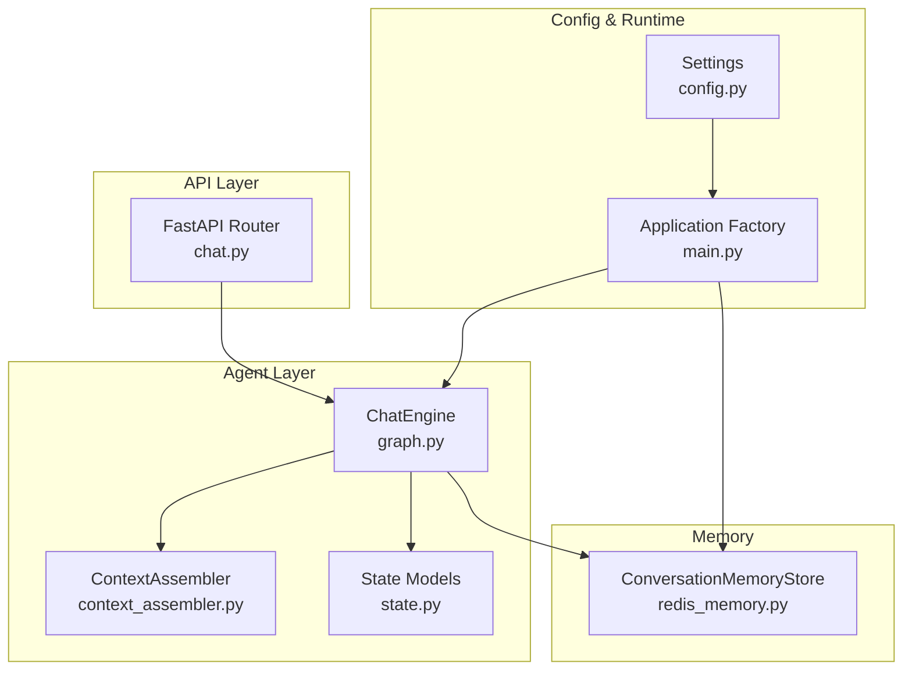
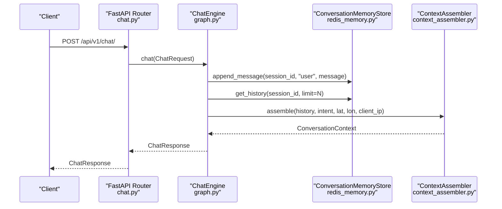
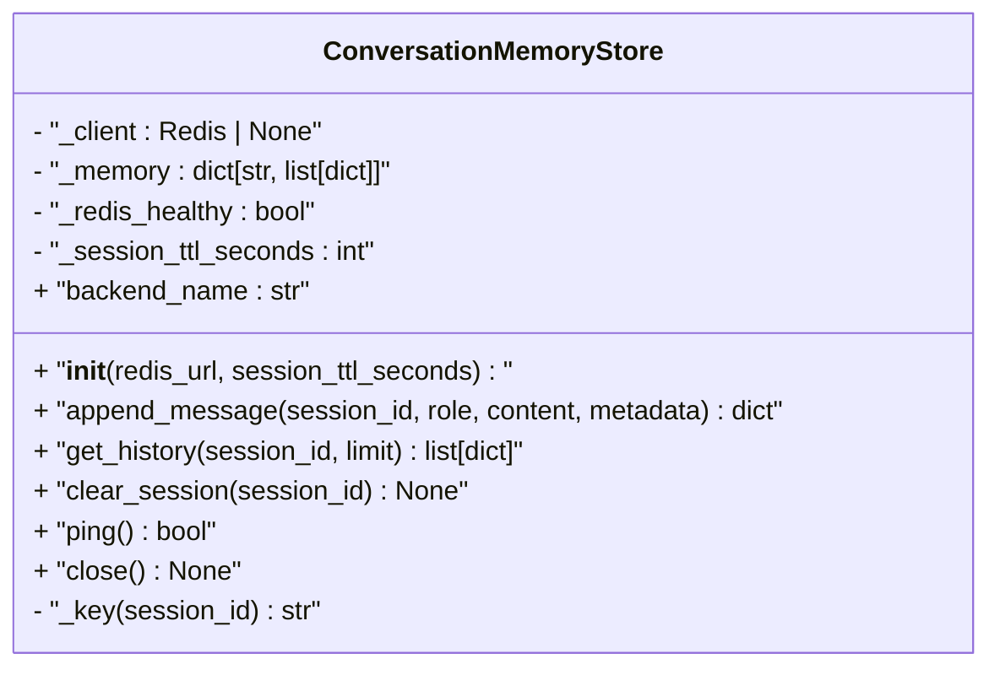
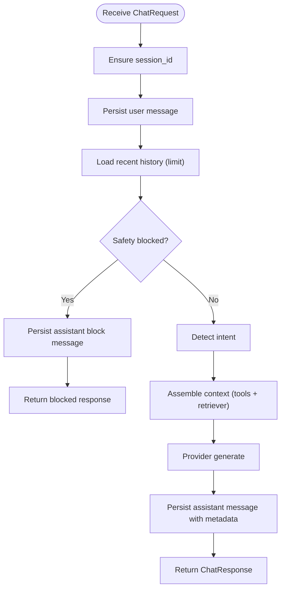
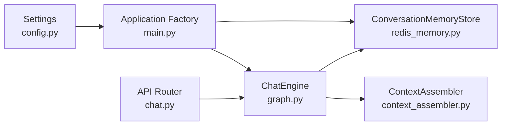
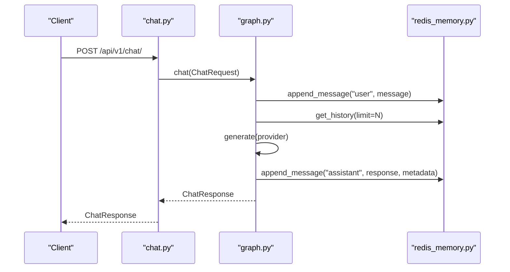

# Conversation Memory and State Management

<cite>
**Referenced Files in This Document**
- [redis_memory.py](file://chatbot_service/memory/redis_memory.py)
- [__init__.py](file://chatbot_service/memory/__init__.py)
- [graph.py](file://chatbot_service/agent/graph.py)
- [context_assembler.py](file://chatbot_service/agent/context_assembler.py)
- [state.py](file://chatbot_service/agent/state.py)
- [chat.py](file://chatbot_service/api/chat.py)
- [main.py](file://chatbot_service/main.py)
- [config.py](file://chatbot_service/config.py)
- [admin.py](file://chatbot_service/api/admin.py)
- [test_e2e.py](file://chatbot_service/tests/test_e2e.py)
</cite>

## Table of Contents
1. [Introduction](#introduction)
2. [Project Structure](#project-structure)
3. [Core Components](#core-components)
4. [Architecture Overview](#architecture-overview)
5. [Detailed Component Analysis](#detailed-component-analysis)
6. [Dependency Analysis](#dependency-analysis)
7. [Performance Considerations](#performance-considerations)
8. [Troubleshooting Guide](#troubleshooting-guide)
9. [Conclusion](#conclusion)
10. [Appendices](#appendices)

## Introduction
This document explains the conversation memory and state management system for the chatbot service. It focuses on Redis-backed persistent storage for session histories, session lifecycle management via TTL, and the state assembly pipeline that builds contextual windows for model generation. It also covers conversation state tracking (user preferences, previous queries, and response history), memory cleanup strategies, concurrency handling, and operational aspects such as backup and recovery.

## Project Structure
The memory subsystem resides under the chatbot service and integrates with the agent graph, API layer, and configuration. The primary module is the Redis-backed memory store, with a fallback to in-memory storage when Redis is unavailable. The agent orchestrates context assembly and state updates, while the API exposes endpoints for chat, streaming, and history retrieval.

**Diagram sources**
- [chat.py:16-111](file://chatbot_service/api/chat.py#L16-L111)
- [graph.py:15-109](file://chatbot_service/agent/graph.py#L15-L109)
- [context_assembler.py:17-215](file://chatbot_service/agent/context_assembler.py#L17-L215)
- [state.py:9-52](file://chatbot_service/agent/state.py#L9-L52)
- [redis_memory.py:10-90](file://chatbot_service/memory/redis_memory.py#L10-L90)
- [config.py:39-113](file://chatbot_service/config.py#L39-L113)
- [main.py:41-149](file://chatbot_service/main.py#L41-L149)

**Section sources**
- [chat.py:16-111](file://chatbot_service/api/chat.py#L16-L111)
- [graph.py:15-109](file://chatbot_service/agent/graph.py#L15-L109)
- [redis_memory.py:10-90](file://chatbot_service/memory/redis_memory.py#L10-L90)
- [config.py:39-113](file://chatbot_service/config.py#L39-L113)
- [main.py:41-149](file://chatbot_service/main.py#L41-L149)

## Core Components
- ConversationMemoryStore: Provides asynchronous append, retrieval, clearing, health checks, and connection lifecycle for Redis-backed conversation history with in-memory fallback.
- ChatEngine: Orchestrates chat requests, manages session IDs, retrieves context windows, invokes intent detection and context assembly, routes to providers, and persists assistant responses.
- ContextAssembler: Builds a rich conversation context by combining prior history, tool-derived facts, and retrieved documents.
- State Models: Define request/response shapes and context containers for conversation state.
- API Layer: Exposes endpoints for chat, streaming, and history retrieval; integrates rate limiting and client IP handling.
- Application Factory and Config: Initialize memory store, vector store, tools, and engines; configure Redis URL, session TTL, and other runtime settings.

**Section sources**
- [redis_memory.py:10-90](file://chatbot_service/memory/redis_memory.py#L10-L90)
- [graph.py:15-109](file://chatbot_service/agent/graph.py#L15-L109)
- [context_assembler.py:17-215](file://chatbot_service/agent/context_assembler.py#L17-L215)
- [state.py:9-52](file://chatbot_service/agent/state.py#L9-L52)
- [chat.py:24-111](file://chatbot_service/api/chat.py#L24-L111)
- [main.py:41-149](file://chatbot_service/main.py#L41-L149)
- [config.py:39-113](file://chatbot_service/config.py#L39-L113)

## Architecture Overview
The memory system is designed around a session-centric model. Each chat interaction is associated with a session_id. The system maintains a Redis list per session and a small in-memory cache as a fallback. The ChatEngine writes user and assistant messages into memory immediately upon receiving a request and reads a bounded context window for generation. ContextAssembler enriches the context with tool outputs and retrieved documents. The API layer handles request parsing, rate limiting, and response streaming.

**Diagram sources**
- [chat.py:28-40](file://chatbot_service/api/chat.py#L28-L40)
- [graph.py:33-87](file://chatbot_service/agent/graph.py#L33-L87)
- [redis_memory.py:23-56](file://chatbot_service/memory/redis_memory.py#L23-L56)
- [context_assembler.py:43-81](file://chatbot_service/agent/context_assembler.py#L43-L81)

## Detailed Component Analysis

### ConversationMemoryStore
Responsibilities:
- Append user/assistant messages with timestamps and optional metadata.
- Retrieve recent history with configurable limits.
- Clear sessions by ID.
- Health checks and graceful degradation to in-memory storage.
- Connection lifecycle management.

Key behaviors:
- Uses Redis list operations to append and slice history.
- Applies TTL per session key to prevent indefinite growth.
- Falls back to an in-memory dictionary when Redis is unavailable.
- Returns a backend identifier indicating current mode (memory, redis, or redis+memory).

**Diagram sources**
- [redis_memory.py:10-90](file://chatbot_service/memory/redis_memory.py#L10-L90)

**Section sources**
- [redis_memory.py:10-90](file://chatbot_service/memory/redis_memory.py#L10-L90)

### ChatEngine
Responsibilities:
- Manage session IDs (generate new ones if absent).
- Persist user messages immediately upon arrival.
- Retrieve bounded context windows for generation.
- Evaluate safety policy and block unsafe requests.
- Detect intent and assemble context.
- Route to provider and persist assistant responses with metadata.

**Diagram sources**
- [graph.py:33-87](file://chatbot_service/agent/graph.py#L33-L87)

**Section sources**
- [graph.py:15-109](file://chatbot_service/agent/graph.py#L15-L109)

### ContextAssembler
Responsibilities:
- Build ConversationContext from incoming message, intent, and geographic context.
- Enrich with tool outputs (emergency, first aid, challan, road infrastructure, weather, etc.).
- Add top-ranked retrieved documents with snippet summaries.
- Limit retrieved context to a fixed number to keep prompts concise.

Behavior highlights:
- Conditional enrichment based on detected intent.
- Tool payloads are summarized and attached to the context.
- Retrieved snippets are truncated to a fixed length to fit context windows.

**Section sources**
- [context_assembler.py:17-215](file://chatbot_service/agent/context_assembler.py#L17-L215)

### State Models
Responsibilities:
- Define the shape of chat requests and responses.
- Provide typed containers for retrieved and tool context within the conversation context.

Highlights:
- ChatRequest enforces message length and optional coordinates/IP.
- ChatResponse carries intent, sources, and session_id.
- ConversationContext aggregates session_id, message, intent, optional geo/IP, history, retrieved snippets, and tool summaries.

**Section sources**
- [state.py:9-52](file://chatbot_service/agent/state.py#L9-L52)

### API Layer
Responsibilities:
- Parse and rate-limit requests.
- Extract client IP from reverse proxy headers when needed.
- Support both blocking and streaming responses.
- Expose endpoints for chat, streaming, and history retrieval.

Notes:
- Streaming endpoint simulates token delivery for any provider.
- History endpoint delegates to ChatEngine.

**Section sources**
- [chat.py:24-111](file://chatbot_service/api/chat.py#L24-L111)

### Application Factory and Configuration
Responsibilities:
- Construct memory store, vector store, tools, and engines during startup.
- Inject settings such as Redis URL, session TTL, and retrieval top-k.
- Register health endpoints and admin endpoints.
- Close resources gracefully on shutdown.

**Section sources**
- [main.py:41-149](file://chatbot_service/main.py#L41-L149)
- [config.py:39-113](file://chatbot_service/config.py#L39-L113)

## Dependency Analysis
The memory store is a thin abstraction over Redis with a simple in-memory fallback. The ChatEngine depends on the memory store for persistence and on ContextAssembler for context construction. The API layer depends on the ChatEngine. Configuration drives Redis connectivity and session TTL.

**Diagram sources**
- [config.py:39-113](file://chatbot_service/config.py#L39-L113)
- [main.py:41-149](file://chatbot_service/main.py#L41-L149)
- [redis_memory.py:10-90](file://chatbot_service/memory/redis_memory.py#L10-L90)
- [graph.py:15-109](file://chatbot_service/agent/graph.py#L15-L109)
- [context_assembler.py:17-215](file://chatbot_service/agent/context_assembler.py#L17-L215)
- [chat.py:16-111](file://chatbot_service/api/chat.py#L16-L111)

**Section sources**
- [config.py:39-113](file://chatbot_service/config.py#L39-L113)
- [main.py:41-149](file://chatbot_service/main.py#L41-L149)
- [redis_memory.py:10-90](file://chatbot_service/memory/redis_memory.py#L10-L90)
- [graph.py:15-109](file://chatbot_service/agent/graph.py#L15-L109)
- [context_assembler.py:17-215](file://chatbot_service/agent/context_assembler.py#L17-L215)
- [chat.py:16-111](file://chatbot_service/api/chat.py#L16-L111)

## Performance Considerations
- Context window sizing: The ChatEngine loads a bounded history (e.g., 12 messages) to keep prompt sizes manageable. Adjust the limit based on model token budgets and latency targets.
- Retrieval top-k: The retriever’s default top-k influences context density; tune via settings to balance recall and compression.
- Redis list operations: History is stored as a Redis list with right push and left-range reads. These operations are efficient for append-heavy workloads.
- TTL-driven cleanup: Per-session TTL prevents unbounded growth; tune SESSION_TTL_SECONDS to match expected session lengths.
- Streaming UX: The streaming endpoint simulates token delivery for any provider, improving perceived responsiveness without changing memory behavior.
- Concurrency: The memory store is thread-safe for single-client usage; ensure proper session scoping per user to avoid cross-talk.

[No sources needed since this section provides general guidance]

## Troubleshooting Guide
Common issues and remedies:
- Redis connectivity failures:
  - Symptoms: Memory backend switches to redis+memory, health checks fail.
  - Actions: Verify REDIS_URL, network reachability, and credentials; confirm Redis server availability.
- Session history missing:
  - Symptoms: get_history returns empty or partial results.
  - Causes: TTL expiration, Redis outage, wrong session_id.
  - Actions: Confirm session_ttl_seconds; ensure session_id is preserved across requests; check Redis keyspace.
- Memory fallback behavior:
  - Behavior: When Redis is down, operations fall back to in-memory storage.
  - Impact: Data is ephemeral and lost on restart.
  - Actions: Prefer Redis for production; monitor health endpoints.
- Admin health endpoint:
  - Use the admin health endpoint to inspect memory backend and availability.

Operational checks:
- Health endpoints:
  - Root health: confirms memory availability.
  - Admin health: reports memory backend and index stats.
- Session cleanup:
  - Use clear_session to remove stale sessions when needed.

**Section sources**
- [redis_memory.py:67-85](file://chatbot_service/memory/redis_memory.py#L67-L85)
- [admin.py:32-42](file://chatbot_service/api/admin.py#L32-L42)
- [main.py:106-115](file://chatbot_service/main.py#L106-L115)

## Conclusion
The conversation memory system provides robust, session-scoped persistence with Redis-backed lists and a resilient in-memory fallback. The ChatEngine ensures immediate persistence of user and assistant turns, bounded context windows, and enriched context assembly. Configuration controls connectivity and TTL, enabling scalable and predictable memory usage. Together, these components deliver reliable context preservation for long and complex conversations.

[No sources needed since this section summarizes without analyzing specific files]

## Appendices

### Memory Retrieval Patterns and Context Expansion
- Retrieval pattern:
  - Use get_history(session_id, limit=N) to fetch recent messages for context assembly.
  - Combine with ContextAssembler to add tool and retrieval context.
- Context expansion:
  - Expand context with tool summaries and top-k retrieved snippets.
  - Keep snippet lengths bounded to fit model constraints.

**Section sources**
- [graph.py:36-57](file://chatbot_service/agent/graph.py#L36-L57)
- [context_assembler.py:43-81](file://chatbot_service/agent/context_assembler.py#L43-L81)

### State Serialization and Metadata
- Message payloads include role, content, metadata, and timestamp.
- Assistant responses persist intent and sources in metadata for provenance and downstream use.

**Section sources**
- [redis_memory.py:29-44](file://chatbot_service/memory/redis_memory.py#L29-L44)
- [graph.py:76-81](file://chatbot_service/agent/graph.py#L76-L81)

### Concurrent Sessions and Fragmentation Prevention
- Concurrency:
  - Each session_id isolates history; ensure clients maintain the session_id across requests.
- Fragmentation prevention:
  - Redis list operations naturally compact history; TTL ensures eventual pruning.
  - Tune session_ttl_seconds to balance retention and storage.

**Section sources**
- [redis_memory.py:39-40](file://chatbot_service/memory/redis_memory.py#L39-L40)
- [config.py:108](file://chatbot_service/config.py#L108)

### Backup Strategies and Recovery
- Backup:
  - Back up Redis snapshots or export lists periodically if needed.
- Recovery:
  - Restore Redis from snapshot; existing TTL and key structure preserve session semantics.
  - On restart, in-memory fallback is temporary until Redis is reachable.

**Section sources**
- [redis_memory.py:18-21](file://chatbot_service/memory/redis_memory.py#L18-L21)
- [main.py:84-92](file://chatbot_service/main.py#L84-L92)

### Example Workflows

#### Chat Request Lifecycle with Memory Persistence

**Diagram sources**
- [chat.py:28-40](file://chatbot_service/api/chat.py#L28-L40)
- [graph.py:33-87](file://chatbot_service/agent/graph.py#L33-L87)
- [redis_memory.py:23-65](file://chatbot_service/memory/redis_memory.py#L23-L65)

#### Admin Health and Index Rebuild
- Health endpoint reports memory backend and availability.
- Admin endpoint allows rebuilding the index and returns stats.

**Section sources**
- [admin.py:32-51](file://chatbot_service/api/admin.py#L32-L51)