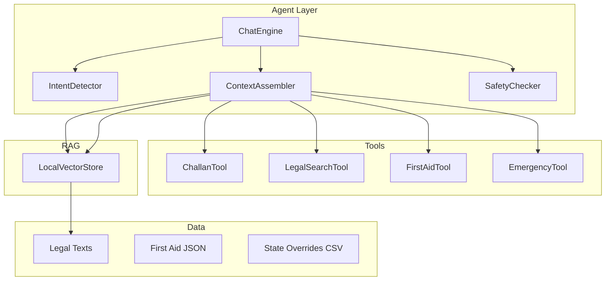
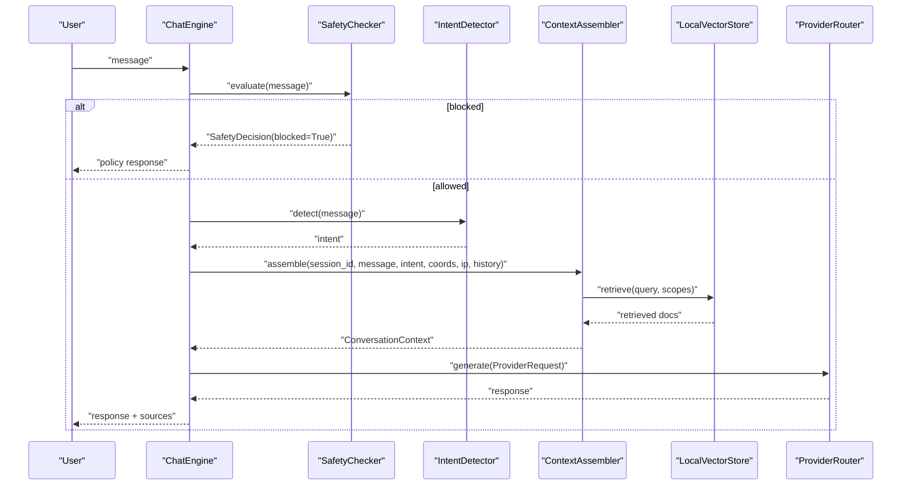
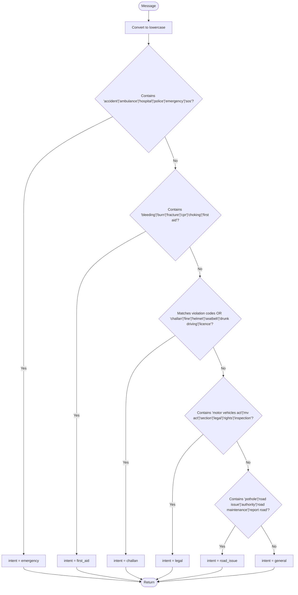
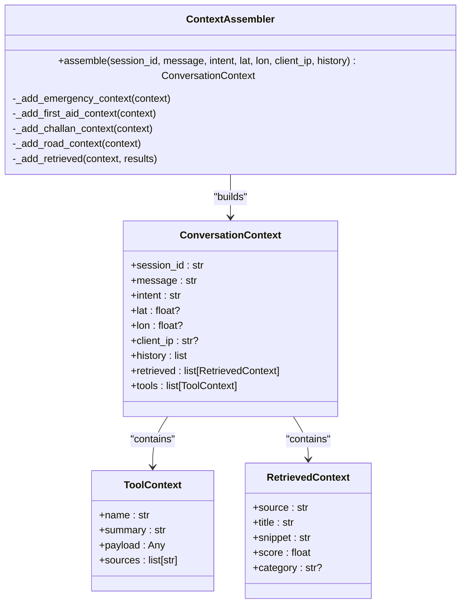
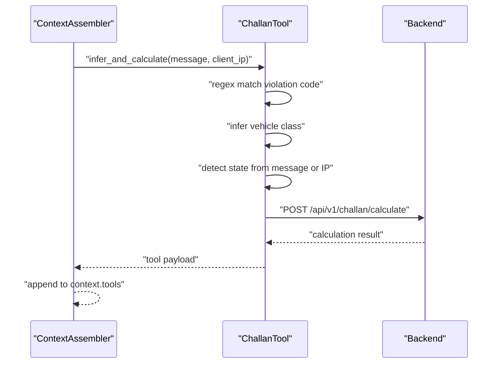
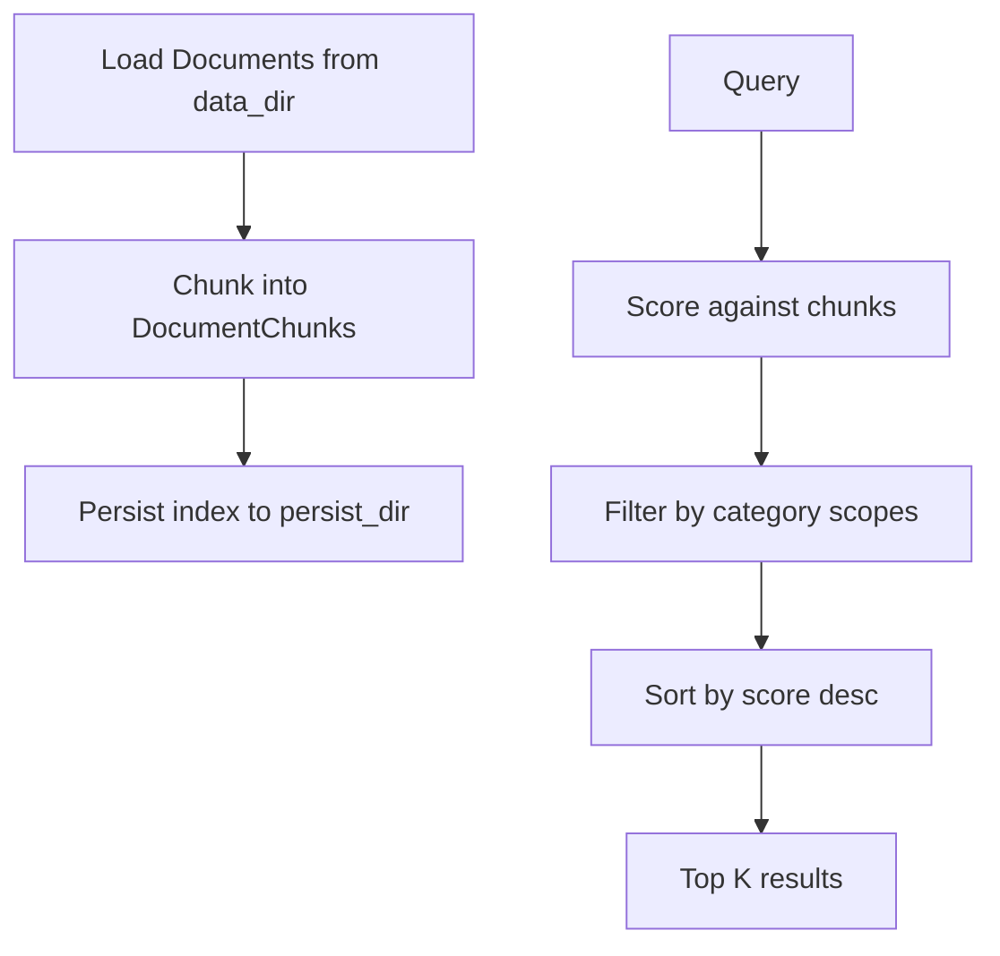
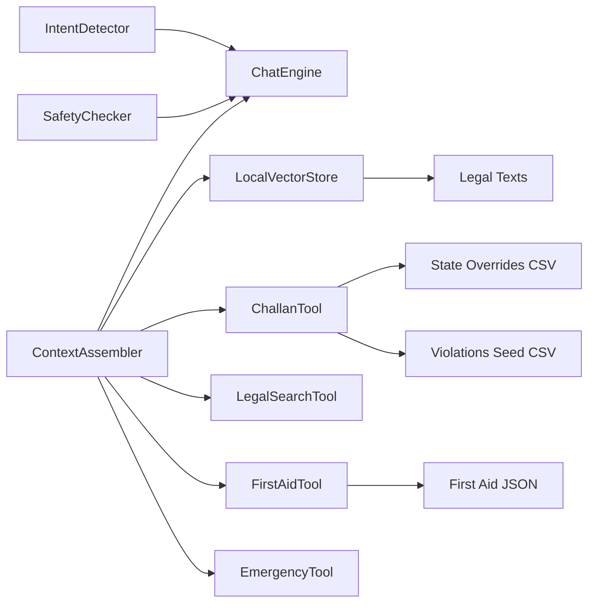

# Intent Detection and Classification

<cite>
**Referenced Files in This Document**
- [intent_detector.py](file://chatbot_service/agent/intent_detector.py)
- [graph.py](file://chatbot_service/agent/graph.py)
- [context_assembler.py](file://chatbot_service/agent/context_assembler.py)
- [state.py](file://chatbot_service/agent/state.py)
- [safety_checker.py](file://chatbot_service/agent/safety_checker.py)
- [challan_tool.py](file://chatbot_service/tools/challan_tool.py)
- [legal_search_tool.py](file://chatbot_service/tools/legal_search_tool.py)
- [first_aid_tool.py](file://chatbot_service/tools/first_aid_tool.py)
- [emergency_tool.py](file://chatbot_service/tools/emergency_tool.py)
- [vectorstore.py](file://chatbot_service/rag/vectorstore.py)
- [motor_vehicles_act_1988_summary.txt](file://chatbot_service/data/legal/motor_vehicles_act_1988_summary.txt)
- [first_aid.json](file://chatbot_service/data/first_aid.json)
- [state_overrides.csv](file://chatbot_service/data/state_overrides.csv)
- [violations_seed.csv](file://chatbot_service/data/violations_seed.csv)
- [test_intent.py](file://chatbot_service/tests/test_intent.py)
</cite>

## Table of Contents
1. [Introduction](#introduction)
2. [Project Structure](#project-structure)
3. [Core Components](#core-components)
4. [Architecture Overview](#architecture-overview)
5. [Detailed Component Analysis](#detailed-component-analysis)
6. [Dependency Analysis](#dependency-analysis)
7. [Performance Considerations](#performance-considerations)
8. [Troubleshooting Guide](#troubleshooting-guide)
9. [Conclusion](#conclusion)
10. [Appendices](#appendices)

## Introduction
This document describes the intent detection and classification system that routes user queries into nine categories for intelligent response generation and tool selection. The system uses a lightweight, rule-based classifier to identify intents such as emergency, first aid, challan/legal queries, road issues, and general assistance. It integrates with tools and retrieval-augmented generation (RAG) to provide accurate, context-aware answers, including state-specific overrides and regional legal variations.

## Project Structure
The intent detection pipeline resides in the chatbot service and orchestrates:
- Intent detection via keyword and regex patterns
- Context assembly combining RAG retrieval and domain tools
- Safety checks and response generation
- Data sources for legal texts, first aid guidelines, and state-specific overrides

**Diagram sources**
- [intent_detector.py:9-25](file://chatbot_service/agent/intent_detector.py#L9-L25)
- [context_assembler.py:17-82](file://chatbot_service/agent/context_assembler.py#L17-L82)
- [graph.py:15-87](file://chatbot_service/agent/graph.py#L15-L87)
- [challan_tool.py:27-81](file://chatbot_service/tools/challan_tool.py#L27-L81)
- [legal_search_tool.py:6-12](file://chatbot_service/tools/legal_search_tool.py#L6-L12)
- [first_aid_tool.py:49-109](file://chatbot_service/tools/first_aid_tool.py#L49-L109)
- [emergency_tool.py:6-15](file://chatbot_service/tools/emergency_tool.py#L6-L15)
- [vectorstore.py:20-110](file://chatbot_service/rag/vectorstore.py#L20-L110)
- [motor_vehicles_act_1988_summary.txt:1-391](file://chatbot_service/data/legal/motor_vehicles_act_1988_summary.txt#L1-L391)
- [first_aid.json:1-388](file://chatbot_service/data/first_aid.json#L1-L388)
- [state_overrides.csv:1-14](file://chatbot_service/data/state_overrides.csv#L1-L14)

**Section sources**
- [intent_detector.py:9-25](file://chatbot_service/agent/intent_detector.py#L9-L25)
- [context_assembler.py:17-82](file://chatbot_service/agent/context_assembler.py#L17-L82)
- [graph.py:15-87](file://chatbot_service/agent/graph.py#L15-L87)
- [vectorstore.py:20-110](file://chatbot_service/rag/vectorstore.py#L20-L110)

## Core Components
- IntentDetector: Rule-based classifier that maps user messages to intents using lowercase keyword matching and compiled regex patterns.
- ContextAssembler: Builds conversation context by selecting relevant tools and retrieving documents from the local vector store based on intent.
- SafetyChecker: Enforces content safety by blocking harmful prompts.
- Tools: Domain-specific capabilities for challan calculation, legal search, first aid guidance, and emergency services discovery.
- RAG VectorStore: Loads and indexes legal and road-related documents for semantic retrieval.

Key intent categories:
- Emergency: Accidents, ambulances, hospitals, police, emergencies, SOS
- First Aid: Bleeding, burns, fractures, CPR, choking
- Challan: Sections 179, 181, 183, 185, 194B, 194D; challan, fine, helmet, seatbelt, drunk driving, licence
- Legal: Motor Vehicles Act, MV Act, sections, legal, rights, inspection
- Road Issue: Potholes, road issues, authorities, road maintenance, reporting roads
- General: Default category for non-matching queries

**Section sources**
- [intent_detector.py:9-25](file://chatbot_service/agent/intent_detector.py#L9-L25)
- [context_assembler.py:43-81](file://chatbot_service/agent/context_assembler.py#L43-L81)
- [safety_checker.py:12-31](file://chatbot_service/agent/safety_checker.py#L12-L31)

## Architecture Overview
The ChatEngine coordinates intent detection, safety evaluation, context assembly, and provider generation. It deduplicates sources and persists intent metadata in conversation history.

**Diagram sources**
- [graph.py:33-87](file://chatbot_service/agent/graph.py#L33-L87)
- [safety_checker.py:12-31](file://chatbot_service/agent/safety_checker.py#L12-L31)
- [intent_detector.py:10-24](file://chatbot_service/agent/intent_detector.py#L10-L24)
- [context_assembler.py:43-81](file://chatbot_service/agent/context_assembler.py#L43-L81)
- [vectorstore.py:51-67](file://chatbot_service/rag/vectorstore.py#L51-L67)

**Section sources**
- [graph.py:33-87](file://chatbot_service/agent/graph.py#L33-L87)
- [context_assembler.py:43-81](file://chatbot_service/agent/context_assembler.py#L43-L81)

## Detailed Component Analysis

### IntentDetector
- Purpose: Fast, deterministic intent classification using keyword presence and compiled regex.
- Patterns:
  - Emergency: accident, ambulance, hospital, police, emergency, SOS
  - First Aid: bleeding, burn, fracture, cpr, choking, first aid
  - Challan: violation codes 179, 181, 183, 185, 194B, 194D; challan, fine, helmet, seatbelt, drunk driving, licence
  - Legal: motor vehicles act, mv act, section, legal, rights, inspection
  - Road Issue: pothole, road issue, authority, road maintenance, report road
  - Default: general

Confidence and thresholds:
- The classifier returns the first matching category in order. There is no explicit confidence threshold; decisions are binary based on pattern matches.

Fallback mechanisms:
- If none match, the intent defaults to general.

**Diagram sources**
- [intent_detector.py:10-24](file://chatbot_service/agent/intent_detector.py#L10-L24)

**Section sources**
- [intent_detector.py:9-25](file://chatbot_service/agent/intent_detector.py#L9-L25)
- [test_intent.py:6-13](file://chatbot_service/tests/test_intent.py#L6-L13)

### ContextAssembler
- Purpose: Build a unified conversation context by selecting tools and retrieving documents based on intent and location/IP.
- Behavior:
  - Emergency: SOS payload, nearby services, emergency numbers, What3Words, weather
  - First Aid: First aid guide lookup, optional drug info extraction
  - Challan: Infer violation code, vehicle class, repeat offense, state from IP or message; call backend for calculation
  - Legal: Retrieve legal documents (scope: legal)
  - Road Issue: Road infrastructure, nearby issues, optional report submission guidance
  - General: General retrieval

**Diagram sources**
- [context_assembler.py:17-82](file://chatbot_service/agent/context_assembler.py#L17-L82)
- [state.py:24-52](file://chatbot_service/agent/state.py#L24-L52)

**Section sources**
- [context_assembler.py:43-215](file://chatbot_service/agent/context_assembler.py#L43-L215)
- [state.py:24-52](file://chatbot_service/agent/state.py#L24-L52)

### Tools and Data Integration
- ChallanTool
  - Infers violation code via regex and vehicle class via keyword matching.
  - Determines state from message or IP; falls back to default state if missing.
  - Calls backend endpoint to compute base/repeat fines and amount due.
- LegalSearchTool
  - Retrieves legal documents scoped to legal category.
- FirstAidTool
  - Loads first aid guidelines from JSON; supports fallback to built-in guides if file is missing or invalid.
  - Normalizes article lists into a keyed dictionary for fast lookup.
- EmergencyTool
  - Finds nearby emergency services given coordinates.

**Diagram sources**
- [challan_tool.py:49-69](file://chatbot_service/tools/challan_tool.py#L49-L69)
- [context_assembler.py:145-160](file://chatbot_service/agent/context_assembler.py#L145-L160)

**Section sources**
- [challan_tool.py:27-81](file://chatbot_service/tools/challan_tool.py#L27-L81)
- [legal_search_tool.py:6-12](file://chatbot_service/tools/legal_search_tool.py#L6-L12)
- [first_aid_tool.py:49-109](file://chatbot_service/tools/first_aid_tool.py#L49-L109)
- [emergency_tool.py:6-15](file://chatbot_service/tools/emergency_tool.py#L6-L15)

### RAG and Knowledge Indexing
- LocalVectorStore loads documents from a data directory, chunks text, persists an index, and supports scoped retrieval.
- Legal knowledge includes the Motor Vehicles Act summary and other road safety documents.
- Retrieval filters by category to align with intent-specific needs.

**Diagram sources**
- [vectorstore.py:36-67](file://chatbot_service/rag/vectorstore.py#L36-L67)
- [motor_vehicles_act_1988_summary.txt:1-391](file://chatbot_service/data/legal/motor_vehicles_act_1988_summary.txt#L1-L391)

**Section sources**
- [vectorstore.py:20-110](file://chatbot_service/rag/vectorstore.py#L20-L110)

### Safety and Blocking
- SafetyChecker evaluates messages for harmful patterns and returns a decision to block with a standardized response.

**Section sources**
- [safety_checker.py:12-31](file://chatbot_service/agent/safety_checker.py#L12-L31)

## Dependency Analysis
- IntentDetector is a standalone component with no external dependencies.
- ContextAssembler depends on tools and retriever; it orchestrates intent-driven retrieval and tool invocation.
- ChatEngine composes all pieces: memory, vectorstore, intent detector, safety checker, context assembler, and provider router.
- Data dependencies include legal texts, first aid JSON, state overrides, and violations seed.

**Diagram sources**
- [graph.py:15-32](file://chatbot_service/agent/graph.py#L15-L32)
- [context_assembler.py:17-42](file://chatbot_service/agent/context_assembler.py#L17-L42)
- [vectorstore.py:20-49](file://chatbot_service/rag/vectorstore.py#L20-L49)
- [first_aid.json:1-388](file://chatbot_service/data/first_aid.json#L1-L388)
- [state_overrides.csv:1-14](file://chatbot_service/data/state_overrides.csv#L1-L14)
- [violations_seed.csv:1-30](file://chatbot_service/data/violations_seed.csv#L1-L30)

**Section sources**
- [graph.py:15-32](file://chatbot_service/agent/graph.py#L15-L32)
- [context_assembler.py:17-42](file://chatbot_service/agent/context_assembler.py#L17-L42)

## Performance Considerations
- Classifier latency: O(n) over the number of patterns; minimal overhead due to compiled regex and short-circuiting.
- Retrieval cost: Linear over indexed chunks; category scoping reduces search space.
- Tool calls: Asynchronous backend calls introduce network latency; cache results where feasible.
- Recommendations:
  - Precompile regex patterns once at module load (already done).
  - Maintain a warm vector index and reuse chunks across sessions.
  - Batch retrieval calls and deduplicate sources to minimize downstream processing.

[No sources needed since this section provides general guidance]

## Troubleshooting Guide
- Queries misclassified as general:
  - Add or refine keywords in the classifier to capture domain-specific phrasing.
  - Verify that violation codes and legal terms are covered by patterns.
- Incorrect state inference:
  - Ensure state abbreviations or names are recognized by the tool’s regex and mapping.
  - Confirm IP-to-state detection returns expected values.
- Missing first aid guidance:
  - Validate the first aid JSON exists and is readable; fallback behavior ensures continuity.
- Blocked responses:
  - Review SafetyChecker patterns and adjust wording to catch similar harmful intents.

**Section sources**
- [intent_detector.py:9-25](file://chatbot_service/agent/intent_detector.py#L9-L25)
- [challan_tool.py:49-69](file://chatbot_service/tools/challan_tool.py#L49-L69)
- [first_aid_tool.py:62-75](file://chatbot_service/tools/first_aid_tool.py#L62-L75)
- [safety_checker.py:12-31](file://chatbot_service/agent/safety_checker.py#L12-L31)

## Conclusion
The intent detection system uses a robust, rule-based classifier integrated with RAG and domain tools to route queries accurately. While currently deterministic, the architecture supports adding confidence thresholds, ML-based classifiers, and continuous learning pipelines. State-specific overrides and legal seeds enable precise, region-aware responses for traffic laws and challan calculations.

[No sources needed since this section summarizes without analyzing specific files]

## Appendices

### Intent Categories and Examples
- Emergency: “I had an accident and need an ambulance”
- First Aid: “How to handle severe bleeding” or “CPR steps”
- Challan: “Fine under section 185 in TN” or “194D helmet law”
- Legal: “MV Act sections” or “driving licence rules”
- Road Issue: “Pothole on main road” or “report road hazard”

**Section sources**
- [intent_detector.py:10-24](file://chatbot_service/agent/intent_detector.py#L10-L24)
- [test_intent.py:6-13](file://chatbot_service/tests/test_intent.py#L6-L13)

### Query Preprocessing and Feature Extraction
- Preprocessing:
  - Convert to lowercase for uniform matching.
  - Extract violation codes and state abbreviations via compiled regex.
- Features:
  - Keyword presence vectors for each intent.
  - Vehicle class heuristics for challan inference.
  - Location and IP for contextual tools.

**Section sources**
- [intent_detector.py:10-24](file://chatbot_service/agent/intent_detector.py#L10-L24)
- [challan_tool.py:49-81](file://chatbot_service/tools/challan_tool.py#L49-L81)

### Classification Results and Routing
- The classifier returns a single intent label; ContextAssembler selects tools and retrieves documents accordingly.
- Sources are deduplicated and returned with the response for transparency.

**Section sources**
- [graph.py:72-87](file://chatbot_service/agent/graph.py#L72-L87)
- [context_assembler.py:203-215](file://chatbot_service/agent/context_assembler.py#L203-L215)

### Model Evaluation Metrics and Accuracy Improvements
- Current implementation: Deterministic rules; no ML model is used.
- Metrics: Manual validation against test cases and domain experts.
- Improvements:
  - Introduce confidence scores and thresholds for ambiguous queries.
  - Train a small ML model on labeled examples to complement rule-based classification.
  - Continuously retrain using logs of misclassified queries and human corrections.

[No sources needed since this section provides general guidance]

### Continuous Learning Strategies
- Collect anonymized conversation logs with intent labels.
- Periodically re-evaluate classifier accuracy and update patterns.
- Incorporate feedback loops to adjust tool selection and retrieval scopes.

[No sources needed since this section provides general guidance]

### Implementation Details for Intent-Aware Response Generation and Tool Selection
- ChatEngine:
  - Evaluates safety, detects intent, assembles context, and generates a response.
  - Persists intent and sources in conversation metadata.
- ContextAssembler:
  - Adds tools and retrieved documents tailored to the intent and location/IP.
- Tools:
  - ChallanTool: Computes fines using state overrides and violation seeds.
  - LegalSearchTool: Retrieves legal documents for context.
  - FirstAidTool: Provides evidence-based first aid steps.
  - EmergencyTool: Locates nearby emergency services.

**Section sources**
- [graph.py:33-87](file://chatbot_service/agent/graph.py#L33-L87)
- [context_assembler.py:43-215](file://chatbot_service/agent/context_assembler.py#L43-L215)
- [challan_tool.py:27-81](file://chatbot_service/tools/challan_tool.py#L27-L81)
- [legal_search_tool.py:6-12](file://chatbot_service/tools/legal_search_tool.py#L6-L12)
- [first_aid_tool.py:49-109](file://chatbot_service/tools/first_aid_tool.py#L49-L109)
- [emergency_tool.py:6-15](file://chatbot_service/tools/emergency_tool.py#L6-L15)