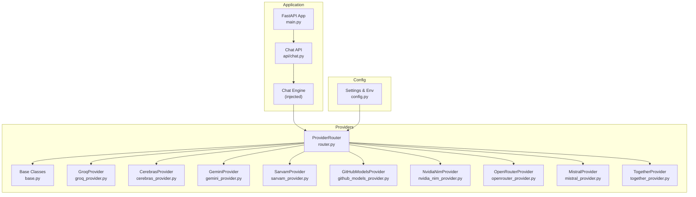
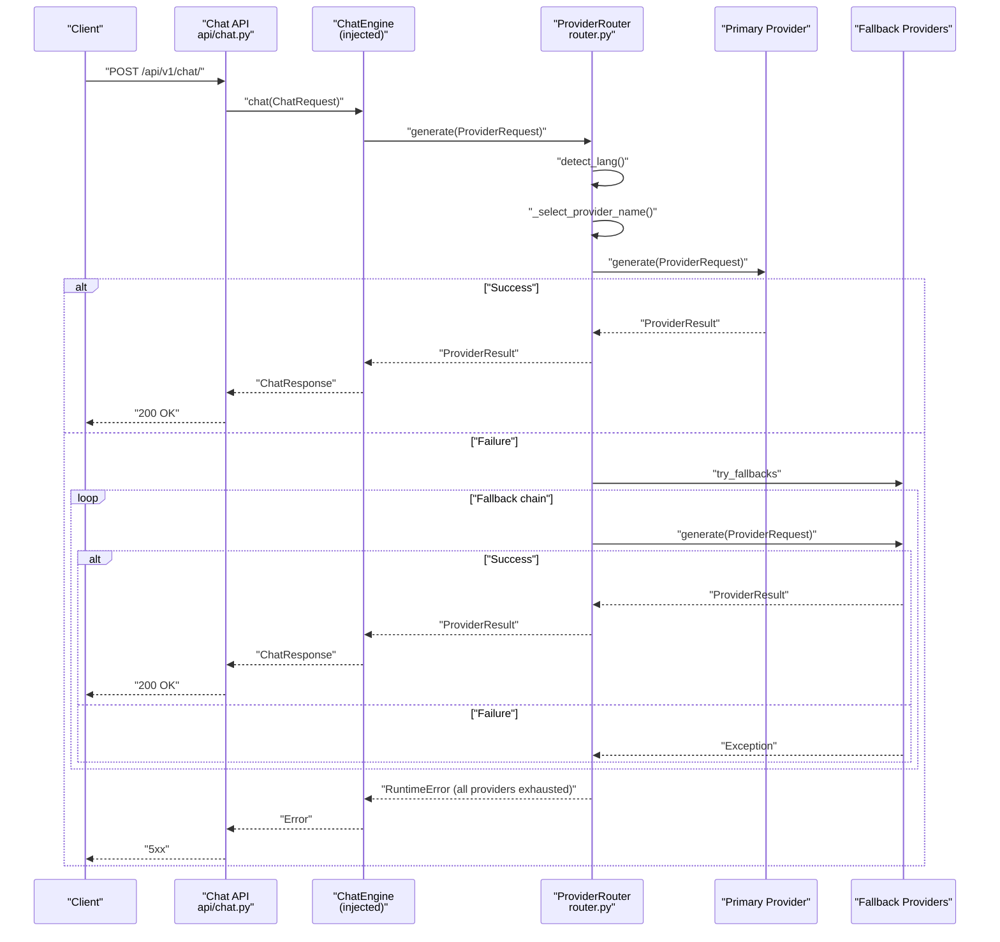
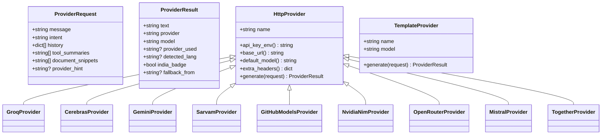
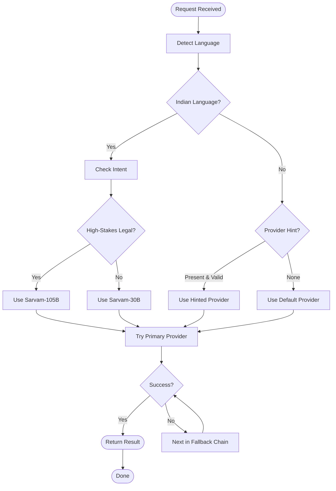
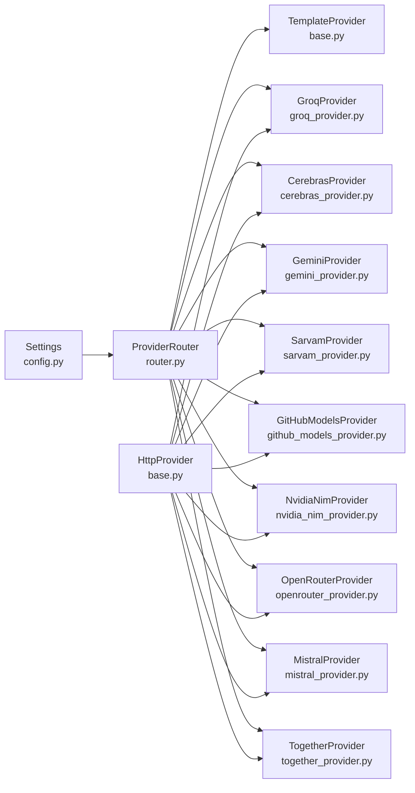

# LLM Providers and Routing

<cite>
**Referenced Files in This Document**
- [router.py](https://github.com/SafeVixAI/SafeVixAI/blob/main/chatbot_service/providers/router.py)
- [base.py](https://github.com/SafeVixAI/SafeVixAI/blob/main/chatbot_service/providers/base.py)
- [config.py](https://github.com/SafeVixAI/SafeVixAI/blob/main/chatbot_service/config.py)
- [groq_provider.py](https://github.com/SafeVixAI/SafeVixAI/blob/main/chatbot_service/providers/groq_provider.py)
- [gemini_provider.py](https://github.com/SafeVixAI/SafeVixAI/blob/main/chatbot_service/providers/gemini_provider.py)
- [sarvam_provider.py](https://github.com/SafeVixAI/SafeVixAI/blob/main/chatbot_service/providers/sarvam_provider.py)
- [cerebras_provider.py](https://github.com/SafeVixAI/SafeVixAI/blob/main/chatbot_service/providers/cerebras_provider.py)
- [github_models_provider.py](https://github.com/SafeVixAI/SafeVixAI/blob/main/chatbot_service/providers/github_models_provider.py)
- [mistral_provider.py](https://github.com/SafeVixAI/SafeVixAI/blob/main/chatbot_service/providers/mistral_provider.py)
- [nvidia_nim_provider.py](https://github.com/SafeVixAI/SafeVixAI/blob/main/chatbot_service/providers/nvidia_nim_provider.py)
- [openrouter_provider.py](https://github.com/SafeVixAI/SafeVixAI/blob/main/chatbot_service/providers/openrouter_provider.py)
- [together_provider.py](https://github.com/SafeVixAI/SafeVixAI/blob/main/chatbot_service/providers/together_provider.py)
- [main.py](https://github.com/SafeVixAI/SafeVixAI/blob/main/chatbot_service/main.py)
- [chat.py](https://github.com/SafeVixAI/SafeVixAI/blob/main/chatbot_service/api/chat.py)
</cite>

## Table of Contents
1. [Introduction](#introduction)
2. [Project Structure](#project-structure)
3. [Core Components](#core-components)
4. [Architecture Overview](#architecture-overview)
5. [Detailed Component Analysis](#detailed-component-analysis)
6. [Dependency Analysis](#dependency-analysis)
7. [Performance Considerations](#performance-considerations)
8. [Troubleshooting Guide](#troubleshooting-guide)
9. [Conclusion](#conclusion)
10. [Appendices](#appendices)

## Introduction
This document describes the multi-provider LLM routing system used by the SafeVixAI chatbot service. It covers the provider abstraction layer, routing strategy with automatic failover and load balancing, configuration of credentials and models, and the fallback mechanism with graceful degradation. It also explains provider-specific features, model selection criteria, response formatting consistency, and health monitoring and failover triggers.

## Project Structure
The routing system lives in the chatbot service and integrates with the FastAPI application lifecycle. Providers are implemented as HTTP clients adhering to a shared base class, and a router orchestrates selection and fallback.

**Diagram sources**
- [main.py:41-93](https://github.com/SafeVixAI/SafeVixAI/blob/main/chatbot_service/main.py#L41-L93)
- [chat.py:24-40](https://github.com/SafeVixAI/SafeVixAI/blob/main/chatbot_service/api/chat.py#L24-L40)
- [router.py:75-123](https://github.com/SafeVixAI/SafeVixAI/blob/main/chatbot_service/providers/router.py#L75-L123)
- [base.py:90-160](https://github.com/SafeVixAI/SafeVixAI/blob/main/chatbot_service/providers/base.py#L90-L160)
- [config.py:39-113](https://github.com/SafeVixAI/SafeVixAI/blob/main/chatbot_service/config.py#L39-L113)

**Section sources**
- [main.py:41-93](https://github.com/SafeVixAI/SafeVixAI/blob/main/chatbot_service/main.py#L41-L93)
- [chat.py:24-40](https://github.com/SafeVixAI/SafeVixAI/blob/main/chatbot_service/api/chat.py#L24-L40)
- [router.py:75-123](https://github.com/SafeVixAI/SafeVixAI/blob/main/chatbot_service/providers/router.py#L75-L123)
- [base.py:90-160](https://github.com/SafeVixAI/SafeVixAI/blob/main/chatbot_service/providers/base.py#L90-L160)
- [config.py:39-113](https://github.com/SafeVixAI/SafeVixAI/blob/main/chatbot_service/config.py#L39-L113)

## Core Components
- Provider abstraction layer: a shared base class defines the unified interface for all providers, including request/result data models, prompt building, and HTTP transport.
- Provider implementations: each provider implements API key retrieval, base URL, and default model, enabling consistent invocation.
- ProviderRouter: selects the initial provider based on language and intent, then executes the request and falls back across a prioritized chain on failure.
- Configuration: environment-driven settings define defaults and validate presence of at least one active provider key.

Key responsibilities:
- Unified interface: ProviderRequest and ProviderResult unify input and output across providers.
- Prompt building: a single function constructs OpenAI-compatible messages with system context, tool summaries, document snippets, and conversation history.
- Safety filtering: prompt injection detection blocks unsafe inputs across providers.
- Deterministic fallback: a template provider ensures graceful degradation when all external providers fail.

**Section sources**
- [base.py:44-87](https://github.com/SafeVixAI/SafeVixAI/blob/main/chatbot_service/providers/base.py#L44-L87)
- [base.py:90-160](https://github.com/SafeVixAI/SafeVixAI/blob/main/chatbot_service/providers/base.py#L90-L160)
- [base.py:162-206](https://github.com/SafeVixAI/SafeVixAI/blob/main/chatbot_service/providers/base.py#L162-L206)
- [router.py:75-123](https://github.com/SafeVixAI/SafeVixAI/blob/main/chatbot_service/providers/router.py#L75-L123)
- [config.py:69-126](https://github.com/SafeVixAI/SafeVixAI/blob/main/chatbot_service/config.py#L69-L126)

## Architecture Overview
The routing system composes a deterministic provider selection with a robust fallback chain. The ChatEngine receives a request, optionally detects language, selects a provider, and executes the request. On failure, it retries across the fallback chain until success or exhaustion.

**Diagram sources**
- [chat.py:28-40](https://github.com/SafeVixAI/SafeVixAI/blob/main/chatbot_service/api/chat.py#L28-L40)
- [router.py:154-199](https://github.com/SafeVixAI/SafeVixAI/blob/main/chatbot_service/providers/router.py#L154-L199)

## Detailed Component Analysis

### Provider Abstraction Layer
The base classes define:
- ProviderRequest: carries the user message, intent, conversation history, tool summaries, document snippets, and optional provider hint.
- ProviderResult: carries the generated text, provider identity, model used, plus routing metadata (provider used, detected language, fallback origin, India badge).
- HttpProvider: a shared async HTTP client that enforces prompt safety, builds OpenAI-compatible messages, injects headers, and returns a standardized ProviderResult.
- TemplateProvider: a deterministic fallback provider that responds without external API calls.

**Diagram sources**
- [base.py:44-87](https://github.com/SafeVixAI/SafeVixAI/blob/main/chatbot_service/providers/base.py#L44-L87)
- [base.py:90-160](https://github.com/SafeVixAI/SafeVixAI/blob/main/chatbot_service/providers/base.py#L90-L160)
- [base.py:162-206](https://github.com/SafeVixAI/SafeVixAI/blob/main/chatbot_service/providers/base.py#L162-L206)
- [groq_provider.py:10-23](https://github.com/SafeVixAI/SafeVixAI/blob/main/chatbot_service/providers/groq_provider.py#L10-L23)
- [cerebras_provider.py:10-23](https://github.com/SafeVixAI/SafeVixAI/blob/main/chatbot_service/providers/cerebras_provider.py#L10-L23)
- [gemini_provider.py:18-71](https://github.com/SafeVixAI/SafeVixAI/blob/main/chatbot_service/providers/gemini_provider.py#L18-L71)
- [sarvam_provider.py:44-125](https://github.com/SafeVixAI/SafeVixAI/blob/main/chatbot_service/providers/sarvam_provider.py#L44-L125)
- [github_models_provider.py:10-26](https://github.com/SafeVixAI/SafeVixAI/blob/main/chatbot_service/providers/github_models_provider.py#L10-L26)
- [nvidia_nim_provider.py:10-26](https://github.com/SafeVixAI/SafeVixAI/blob/main/chatbot_service/providers/nvidia_nim_provider.py#L10-L26)
- [openrouter_provider.py:10-29](https://github.com/SafeVixAI/SafeVixAI/blob/main/chatbot_service/providers/openrouter_provider.py#L10-L29)
- [mistral_provider.py:10-23](https://github.com/SafeVixAI/SafeVixAI/blob/main/chatbot_service/providers/mistral_provider.py#L10-L23)
- [together_provider.py:10-23](https://github.com/SafeVixAI/SafeVixAI/blob/main/chatbot_service/providers/together_provider.py#L10-L23)

**Section sources**
- [base.py:44-87](https://github.com/SafeVixAI/SafeVixAI/blob/main/chatbot_service/providers/base.py#L44-L87)
- [base.py:90-160](https://github.com/SafeVixAI/SafeVixAI/blob/main/chatbot_service/providers/base.py#L90-L160)
- [base.py:162-206](https://github.com/SafeVixAI/SafeVixAI/blob/main/chatbot_service/providers/base.py#L162-L206)

### Routing Strategy and Fallback Chain
ProviderRouter implements:
- Language detection for Indian languages using Unicode ranges.
- Intent-aware routing: high-stakes legal intents route to Sarvam-105B; general Indian-language queries route to Sarvam-30B.
- Explicit provider hints override selection.
- A strict fallback chain ordered by performance and capacity, ending with a deterministic fallback.

**Diagram sources**
- [router.py:125-153](https://github.com/SafeVixAI/SafeVixAI/blob/main/chatbot_service/providers/router.py#L125-L153)
- [router.py:154-199](https://github.com/SafeVixAI/SafeVixAI/blob/main/chatbot_service/providers/router.py#L154-L199)

**Section sources**
- [router.py:125-153](https://github.com/SafeVixAI/SafeVixAI/blob/main/chatbot_service/providers/router.py#L125-L153)
- [router.py:154-199](https://github.com/SafeVixAI/SafeVixAI/blob/main/chatbot_service/providers/router.py#L154-L199)

### Provider Implementations and Capabilities
- Groq: fastest English provider, suitable for low-latency English queries.
- Cerebras: overflow provider for speed-critical scenarios.
- Gemini: large-context provider for long documents and complex reasoning.
- Sarvam: Indian-language specialists with direct API and OpenRouter fallback.
- GitHub Models, OpenRouter, Mistral, Together: free-tier or cost-effective options.
- Nvidia NIM: GPU-optimized inference.

Each provider implements:
- api_key_env(): environment variable name for the API key.
- base_url(): OpenAI-compatible chat completions endpoint.
- default_model(): default model identifier.

Gemini differs by translating OpenAI-style messages into Gemini’s contents format and using a provider-specific endpoint.

**Section sources**
- [groq_provider.py:10-23](https://github.com/SafeVixAI/SafeVixAI/blob/main/chatbot_service/providers/groq_provider.py#L10-L23)
- [cerebras_provider.py:10-23](https://github.com/SafeVixAI/SafeVixAI/blob/main/chatbot_service/providers/cerebras_provider.py#L10-L23)
- [gemini_provider.py:18-71](https://github.com/SafeVixAI/SafeVixAI/blob/main/chatbot_service/providers/gemini_provider.py#L18-L71)
- [sarvam_provider.py:44-125](https://github.com/SafeVixAI/SafeVixAI/blob/main/chatbot_service/providers/sarvam_provider.py#L44-L125)
- [github_models_provider.py:10-26](https://github.com/SafeVixAI/SafeVixAI/blob/main/chatbot_service/providers/github_models_provider.py#L10-L26)
- [openrouter_provider.py:10-29](https://github.com/SafeVixAI/SafeVixAI/blob/main/chatbot_service/providers/openrouter_provider.py#L10-L29)
- [mistral_provider.py:10-23](https://github.com/SafeVixAI/SafeVixAI/blob/main/chatbot_service/providers/mistral_provider.py#L10-L23)
- [together_provider.py:10-23](https://github.com/SafeVixAI/SafeVixAI/blob/main/chatbot_service/providers/together_provider.py#L10-L23)
- [nvidia_nim_provider.py:10-26](https://github.com/SafeVixAI/SafeVixAI/blob/main/chatbot_service/providers/nvidia_nim_provider.py#L10-L26)

### Configuration and Environment
Settings are loaded from environment variables and validated at startup:
- default_llm_provider and default_llm_model configure the baseline.
- At least one active provider key must be present; otherwise, startup fails fast.
- HTTP timeouts and user-agent headers are configurable.

**Section sources**
- [config.py:39-113](https://github.com/SafeVixAI/SafeVixAI/blob/main/chatbot_service/config.py#L39-L113)
- [config.py:115-126](https://github.com/SafeVixAI/SafeVixAI/blob/main/chatbot_service/config.py#L115-L126)

### Health Monitoring and Automatic Failover Triggers
- Application-level health endpoint verifies memory backend availability.
- Provider failures trigger automatic fallback; the router records the original provider and the fallback provider used.
- The deterministic fallback provider ensures graceful degradation when all external providers fail.

Operational signals:
- Memory ping in health endpoint.
- Router attaches metadata to results for observability (provider_used, fallback_from, detected_lang, india_badge).

**Section sources**
- [main.py:106-115](https://github.com/SafeVixAI/SafeVixAI/blob/main/chatbot_service/main.py#L106-L115)
- [router.py:170-199](https://github.com/SafeVixAI/SafeVixAI/blob/main/chatbot_service/providers/router.py#L170-L199)
- [base.py:54-63](https://github.com/SafeVixAI/SafeVixAI/blob/main/chatbot_service/providers/base.py#L54-L63)

## Dependency Analysis
The routing system exhibits low coupling and high cohesion:
- Router depends on Settings and a dictionary of provider instances.
- Providers depend on the shared HttpProvider base for HTTP transport and message building.
- The application wiring injects ProviderRouter into the ChatEngine.

**Diagram sources**
- [router.py:85-109](https://github.com/SafeVixAI/SafeVixAI/blob/main/chatbot_service/providers/router.py#L85-L109)
- [base.py:90-160](https://github.com/SafeVixAI/SafeVixAI/blob/main/chatbot_service/providers/base.py#L90-L160)
- [config.py:39-113](https://github.com/SafeVixAI/SafeVixAI/blob/main/chatbot_service/config.py#L39-L113)

**Section sources**
- [router.py:85-109](https://github.com/SafeVixAI/SafeVixAI/blob/main/chatbot_service/providers/router.py#L85-L109)
- [base.py:90-160](https://github.com/SafeVixAI/SafeVixAI/blob/main/chatbot_service/providers/base.py#L90-L160)
- [config.py:39-113](https://github.com/SafeVixAI/SafeVixAI/blob/main/chatbot_service/config.py#L39-L113)

## Performance Considerations
- Latency optimization: prioritize providers with lower latency for English queries (Groq, Cerebras) and route Indian-language queries to Sarvam variants optimized for Indic languages.
- Throughput overflow: use Cerebras as a speed overflow when Groq is rate-limited.
- Context window: use Gemini for long-context tasks (e.g., legal PDFs) to avoid truncation.
- Cost optimization: leverage free tiers (GitHub Models, OpenRouter free mode, Sarvam/HF fallback) and select models aligned with budget constraints.
- Token limits: keep responses within bounds using max_tokens and trim history to reduce overhead.

[No sources needed since this section provides general guidance]

## Troubleshooting Guide
Common issues and resolutions:
- Missing API keys: Startup validates at least one active provider key; configure the appropriate environment variable for the desired provider.
- Prompt injection attempts: Blocked by the safety filter; adjust input or review safety policy.
- Provider failures: The router automatically falls back; check logs for the primary and fallback providers used.
- Deterministic fallback: If all providers fail, the template provider returns a safe, contextual response.

Operational checks:
- Health endpoint confirms memory backend availability.
- Router metadata helps trace which provider was used and whether a fallback occurred.

**Section sources**
- [config.py:115-126](https://github.com/SafeVixAI/SafeVixAI/blob/main/chatbot_service/config.py#L115-L126)
- [base.py:129-139](https://github.com/SafeVixAI/SafeVixAI/blob/main/chatbot_service/providers/base.py#L129-L139)
- [router.py:170-199](https://github.com/SafeVixAI/SafeVixAI/blob/main/chatbot_service/providers/router.py#L170-L199)
- [main.py:106-115](https://github.com/SafeVixAI/SafeVixAI/blob/main/chatbot_service/main.py#L106-L115)

## Conclusion
The routing system provides a robust, extensible, and observable multi-provider architecture. It balances performance, cost, and availability through intelligent selection and automatic failover, while ensuring consistent response formatting and safety. The modular design allows adding new providers and refining routing heuristics without disrupting the rest of the system.

[No sources needed since this section summarizes without analyzing specific files]

## Appendices

### Provider Selection Criteria and Examples
- English queries: prefer Groq for speed; if rate-limited, fall back to Cerebras.
- Long-context legal documents: use Gemini for large context windows.
- Indian languages: route to Sarvam-30B for general queries; Sarvam-105B for high-stakes legal intents.
- Runtime provider override: pass a provider hint in the request to force a specific provider.
- Quality assessment: monitor fallback_from and provider_used metadata to evaluate routing effectiveness.

**Section sources**
- [router.py:3-10](https://github.com/SafeVixAI/SafeVixAI/blob/main/chatbot_service/providers/router.py#L3-L10)
- [router.py:125-153](https://github.com/SafeVixAI/SafeVixAI/blob/main/chatbot_service/providers/router.py#L125-L153)
- [sarvam_provider.py:15-25](https://github.com/SafeVixAI/SafeVixAI/blob/main/chatbot_service/providers/sarvam_provider.py#L15-L25)

### Response Formatting Consistency
All providers return a standardized ProviderResult with:
- text: normalized response content.
- provider: provider identity.
- model: model used.
- provider_used: the provider that fulfilled the request.
- detected_lang: language detected from input.
- fallback_from: the previous provider when a fallback occurred.
- india_badge: indicator when Sarvam is used.

**Section sources**
- [base.py:54-63](https://github.com/SafeVixAI/SafeVixAI/blob/main/chatbot_service/providers/base.py#L54-L63)
- [router.py:170-178](https://github.com/SafeVixAI/SafeVixAI/blob/main/chatbot_service/providers/router.py#L170-L178)
- [sarvam_provider.py:114-116](https://github.com/SafeVixAI/SafeVixAI/blob/main/chatbot_service/providers/sarvam_provider.py#L114-L116)