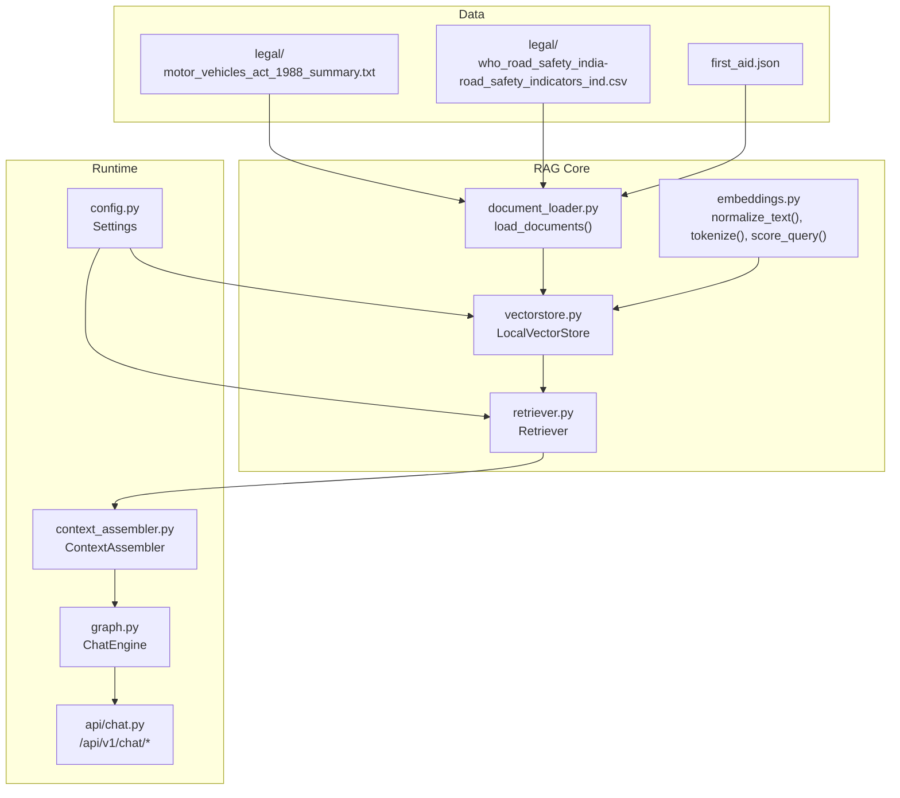
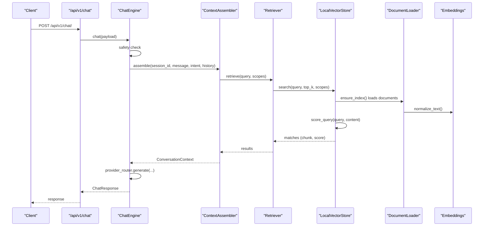
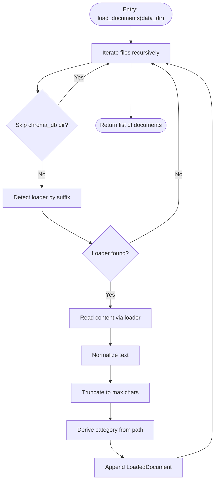
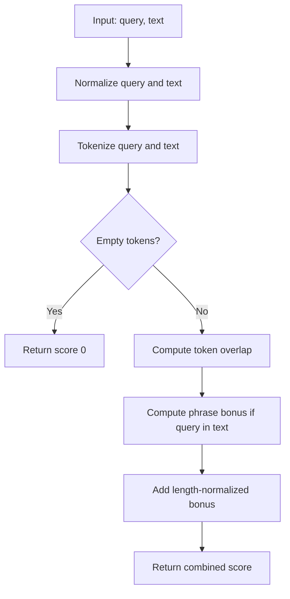
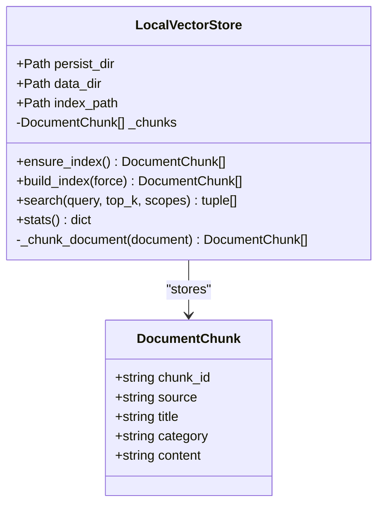
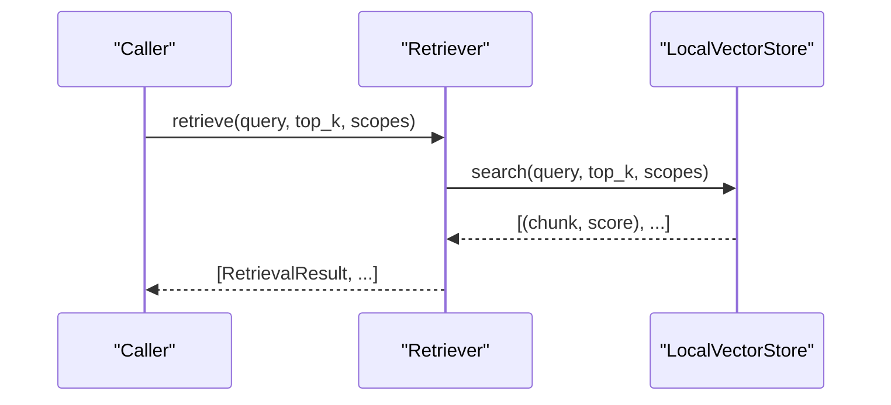
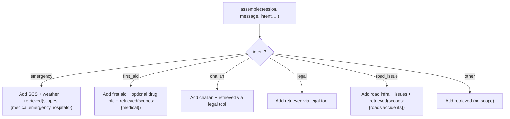
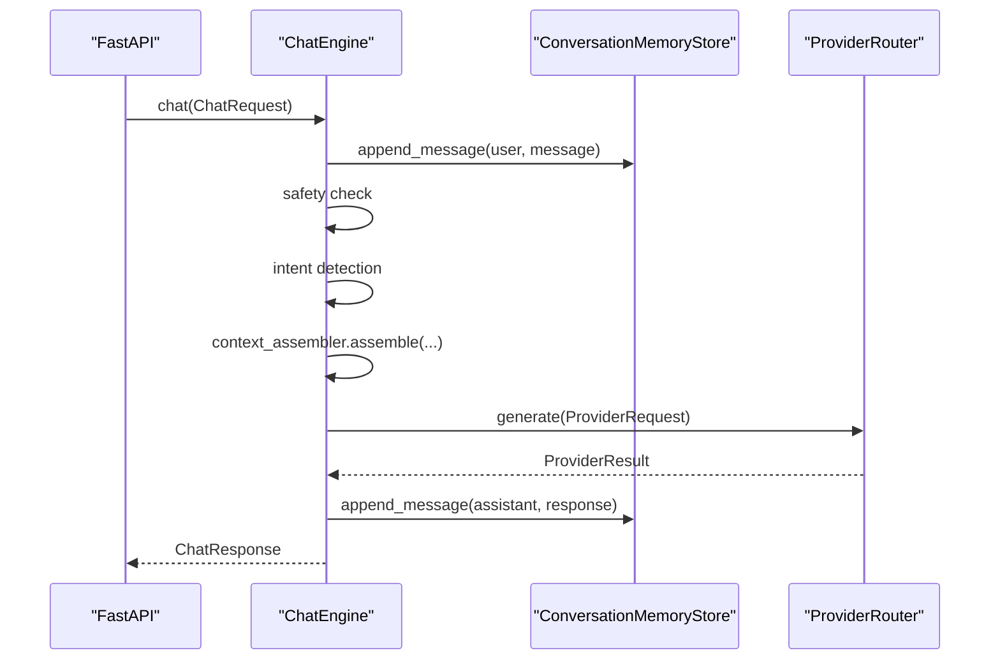
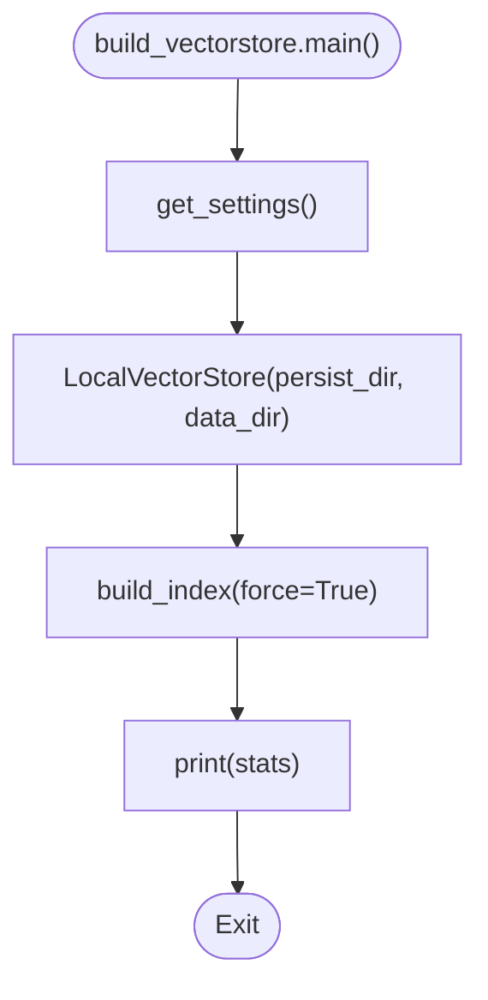
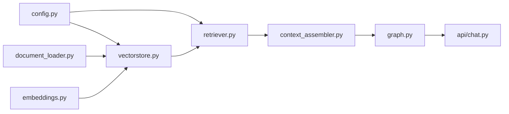

# RAG Architecture and Vector Store

<cite>
**Referenced Files in This Document**
- [vectorstore.py](file://chatbot_service/rag/vectorstore.py)
- [embeddings.py](file://chatbot_service/rag/embeddings.py)
- [document_loader.py](file://chatbot_service/rag/document_loader.py)
- [retriever.py](file://chatbot_service/rag/retriever.py)
- [build_vectorstore.py](file://chatbot_service/data/build_vectorstore.py)
- [config.py](file://chatbot_service/config.py)
- [context_assembler.py](file://chatbot_service/agent/context_assembler.py)
- [graph.py](file://chatbot_service/agent/graph.py)
- [state.py](file://chatbot_service/agent/state.py)
- [main.py](file://chatbot_service/main.py)
- [chat.py](file://chatbot_service/api/chat.py)
- [motor_vehicles_act_1988_summary.txt](file://chatbot_service/data/legal/motor_vehicles_act_1988_summary.txt)
- [who_road_safety_india-road_safety_indicators_ind.csv](file://chatbot_service/data/legal/who_road_safety_india-road_safety_indicators_ind.csv)
- [first_aid.json](file://chatbot_service/data/first_aid.json)
</cite>

## Table of Contents
1. [Introduction](#introduction)
2. [Project Structure](#project-structure)
3. [Core Components](#core-components)
4. [Architecture Overview](#architecture-overview)
5. [Detailed Component Analysis](#detailed-component-analysis)
6. [Dependency Analysis](#dependency-analysis)
7. [Performance Considerations](#performance-considerations)
8. [Troubleshooting Guide](#troubleshooting-guide)
9. [Conclusion](#conclusion)
10. [Appendices](#appendices)

## Introduction
This document describes the Retrieval-Augmented Generation (RAG) architecture with a focus on the vector store implementation and document retrieval system. The system ingests legal documents, emergency procedures, and first aid guidelines from diverse sources (PDFs, CSVs, and text), builds a lightweight local index, and supports hybrid-like retrieval by combining semantic similarity scoring with category scoping. It integrates with a broader chat agent pipeline to assemble context for LLM generation, enabling accurate, localized, and timely responses for road safety scenarios in India.

## Project Structure
The RAG stack resides in the chatbot service and is composed of:
- Data ingestion and preprocessing: document loader and normalization
- Embedding and scoring: tokenization and similarity scoring
- Indexing and retrieval: local vector store and retriever
- Runtime orchestration: context assembler and chat engine
- Configuration and lifecycle: settings and index builder
- Example datasets: legal texts, WHO indicators, and first aid protocols

**Diagram sources**
- [document_loader.py:28-57](file://chatbot_service/rag/document_loader.py#L28-L57)
- [embeddings.py:9-30](file://chatbot_service/rag/embeddings.py#L9-L30)
- [vectorstore.py:20-109](file://chatbot_service/rag/vectorstore.py#L20-L109)
- [retriever.py:17-39](file://chatbot_service/rag/retriever.py#L17-L39)
- [config.py:39-113](file://chatbot_service/config.py#L39-L113)
- [context_assembler.py:43-81](file://chatbot_service/agent/context_assembler.py#L43-L81)
- [graph.py:33-87](file://chatbot_service/agent/graph.py#L33-L87)
- [chat.py:28-40](file://chatbot_service/api/chat.py#L28-L40)

**Section sources**
- [document_loader.py:28-57](file://chatbot_service/rag/document_loader.py#L28-L57)
- [vectorstore.py:20-109](file://chatbot_service/rag/vectorstore.py#L20-L109)
- [retriever.py:17-39](file://chatbot_service/rag/retriever.py#L17-L39)
- [config.py:39-113](file://chatbot_service/config.py#L39-L113)
- [context_assembler.py:43-81](file://chatbot_service/agent/context_assembler.py#L43-L81)
- [graph.py:33-87](file://chatbot_service/agent/graph.py#L33-L87)
- [chat.py:28-40](file://chatbot_service/api/chat.py#L28-L40)

## Core Components
- Document Loader: Reads and normalizes text from TXT/MD/JSON/CSV/PDF, infers category from folder, and truncates to safe lengths.
- Embedding and Scoring: Normalizes whitespace, tokenizes by pattern, computes overlap-based similarity, and adds phrase bonus and length normalization.
- Local Vector Store: Builds a simple JSON index of normalized chunks, supports category-scoped search, and exposes statistics.
- Retriever: Wraps the vector store to return structured results with metadata.
- Context Assembler: Orchestrates retrieval and tool augmentation based on intent, scoping by categories for targeted domains.
- Chat Engine: Coordinates safety checks, context assembly, provider generation, and history persistence.
- Configuration: Provides environment-driven paths, model identifiers, and defaults for RAG.

**Section sources**
- [document_loader.py:28-57](file://chatbot_service/rag/document_loader.py#L28-L57)
- [embeddings.py:9-30](file://chatbot_service/rag/embeddings.py#L9-L30)
- [vectorstore.py:20-109](file://chatbot_service/rag/vectorstore.py#L20-L109)
- [retriever.py:17-39](file://chatbot_service/rag/retriever.py#L17-L39)
- [context_assembler.py:43-81](file://chatbot_service/agent/context_assembler.py#L43-L81)
- [graph.py:33-87](file://chatbot_service/agent/graph.py#L33-L87)
- [config.py:39-113](file://chatbot_service/config.py#L39-L113)

## Architecture Overview
The RAG pipeline is a local-first, file-backed system optimized for offline operation and reproducible builds. It avoids external vector databases by maintaining a compact JSON index of document chunks. Retrieval is performed via a custom scoring function that combines token overlap, phrase containment, and length normalization. The system augments retrieval results with domain-specific tools and contextual information.

**Diagram sources**
- [chat.py:28-40](file://chatbot_service/api/chat.py#L28-L40)
- [graph.py:33-87](file://chatbot_service/agent/graph.py#L33-L87)
- [context_assembler.py:43-81](file://chatbot_service/agent/context_assembler.py#L43-L81)
- [retriever.py:22-39](file://chatbot_service/rag/retriever.py#L22-L39)
- [vectorstore.py:51-67](file://chatbot_service/rag/vectorstore.py#L51-L67)
- [document_loader.py:28-57](file://chatbot_service/rag/document_loader.py#L28-L57)
- [embeddings.py:9-30](file://chatbot_service/rag/embeddings.py#L9-L30)

## Detailed Component Analysis

### Document Loading Pipeline
- Supported formats: TXT, MD, JSON, CSV, PDF.
- Normalization: Whitespace collapsing and trimming; text truncated to a maximum length.
- Category inference: Derived from the relative path’s first directory level.
- CSV handling: Emits column names and a capped number of rows as structured text.
- PDF handling: Uses a lazy-imported PDF reader; extracts page text with normalization.

**Diagram sources**
- [document_loader.py:28-57](file://chatbot_service/rag/document_loader.py#L28-L57)
- [document_loader.py:60-93](file://chatbot_service/rag/document_loader.py#L60-L93)
- [document_loader.py:96-102](file://chatbot_service/rag/document_loader.py#L96-L102)

**Section sources**
- [document_loader.py:28-57](file://chatbot_service/rag/document_loader.py#L28-L57)
- [document_loader.py:60-93](file://chatbot_service/rag/document_loader.py#L60-L93)
- [document_loader.py:96-102](file://chatbot_service/rag/document_loader.py#L96-L102)

### Embedding Strategies and Similarity Scoring
- Tokenization: Extracts sequences of alphanumeric characters with underscore, lowercased.
- Normalization: Collapses whitespace and trims.
- Scoring: Overlap between query and document tokens; adds phrase bonus if query appears in normalized document; normalizes by document length to favor concise matches.

**Diagram sources**
- [embeddings.py:17-30](file://chatbot_service/rag/embeddings.py#L17-L30)

**Section sources**
- [embeddings.py:9-30](file://chatbot_service/rag/embeddings.py#L9-L30)

### Vector Store and Chunking
- Index storage: JSON file containing normalized chunks with source, title, category, and content.
- Chunking: Splits documents into overlapping paragraphs respecting a target length threshold; assigns monotonically increasing chunk IDs per source.
- Search: Filters by category scopes, scores with the custom function, sorts descending, and returns top-k results.
- Stats: Reports total chunks and unique categories.

**Diagram sources**
- [vectorstore.py:11-26](file://chatbot_service/rag/vectorstore.py#L11-L26)
- [vectorstore.py:20-109](file://chatbot_service/rag/vectorstore.py#L20-L109)

**Section sources**
- [vectorstore.py:20-109](file://chatbot_service/rag/vectorstore.py#L20-L109)

### Retriever and Hybrid-like Search
- Wraps the vector store and exposes a simplified interface.
- Supports category scoping to constrain retrieval to relevant domains (e.g., medical, emergency, roads).
- Returns structured results enriched with source metadata and scores.

**Diagram sources**
- [retriever.py:17-39](file://chatbot_service/rag/retriever.py#L17-L39)
- [vectorstore.py:51-67](file://chatbot_service/rag/vectorstore.py#L51-L67)

**Section sources**
- [retriever.py:17-39](file://chatbot_service/rag/retriever.py#L17-L39)
- [vectorstore.py:51-67](file://chatbot_service/rag/vectorstore.py#L51-L67)

### Context Assembly and Intent-driven Retrieval
- Determines intent and augments conversation context with:
  - Emergency: Nearby SOS services and weather.
  - First aid: First aid protocol summaries and optional drug info.
  - Road issues: Infrastructure and reported hazards.
- Applies category scoping for targeted retrieval (e.g., medical/emergency, roads/accidents).
- Merges tool outputs and retrieved snippets into a unified prompt for the LLM.

**Diagram sources**
- [context_assembler.py:43-81](file://chatbot_service/agent/context_assembler.py#L43-L81)

**Section sources**
- [context_assembler.py:43-81](file://chatbot_service/agent/context_assembler.py#L43-L81)

### Chat Engine and Lifecycle
- Manages session history, safety checks, intent detection, and provider generation.
- Rebuilds the index on demand and reports stats.
- Deduplicates sources for attribution.

**Diagram sources**
- [graph.py:33-87](file://chatbot_service/agent/graph.py#L33-L87)
- [main.py:59-78](file://chatbot_service/main.py#L59-L78)

**Section sources**
- [graph.py:33-87](file://chatbot_service/agent/graph.py#L33-L87)
- [main.py:59-78](file://chatbot_service/main.py#L59-L78)

### Configuration and Index Builder
- Settings define persistent directories for data and index, embedding model identifier, and retrieval top-K.
- Index builder initializes the vector store and forces a rebuild, printing stats.

**Diagram sources**
- [config.py:39-113](file://chatbot_service/config.py#L39-L113)
- [build_vectorstore.py:7-11](file://chatbot_service/data/build_vectorstore.py#L7-L11)

**Section sources**
- [config.py:39-113](file://chatbot_service/config.py#L39-L113)
- [build_vectorstore.py:7-11](file://chatbot_service/data/build_vectorstore.py#L7-L11)

### Example Datasets and Content Types
- Legal documents: A summarized legal corpus for traffic laws and road safety.
- WHO indicators: Structured CSV data on road safety metrics and laws.
- First aid protocols: Structured JSON with step-by-step guidelines and warnings.

These files demonstrate ingestion of heterogeneous formats and inform the categorization and retrieval strategies.

**Section sources**
- [motor_vehicles_act_1988_summary.txt:1-391](file://chatbot_service/data/legal/motor_vehicles_act_1988_summary.txt#L1-L391)
- [who_road_safety_india-road_safety_indicators_ind.csv:1-25](file://chatbot_service/data/legal/who_road_safety_india-road_safety_indicators_ind.csv#L1-L25)
- [first_aid.json:1-388](file://chatbot_service/data/first_aid.json#L1-L388)

## Dependency Analysis
- Cohesion: RAG components are cohesive around document ingestion, chunking, scoring, and retrieval.
- Coupling: The retriever depends on the vector store; the context assembler depends on the retriever and tools; the chat engine orchestrates all.
- External dependencies: Optional PDF parsing; otherwise pure Python standard library and JSON.

**Diagram sources**
- [config.py:39-113](file://chatbot_service/config.py#L39-L113)
- [vectorstore.py:20-109](file://chatbot_service/rag/vectorstore.py#L20-L109)
- [retriever.py:17-39](file://chatbot_service/rag/retriever.py#L17-L39)
- [document_loader.py:28-57](file://chatbot_service/rag/document_loader.py#L28-L57)
- [embeddings.py:9-30](file://chatbot_service/rag/embeddings.py#L9-L30)
- [context_assembler.py:43-81](file://chatbot_service/agent/context_assembler.py#L43-L81)
- [graph.py:33-87](file://chatbot_service/agent/graph.py#L33-L87)
- [chat.py:28-40](file://chatbot_service/api/chat.py#L28-L40)

**Section sources**
- [main.py:51-78](file://chatbot_service/main.py#L51-L78)
- [graph.py:33-87](file://chatbot_service/agent/graph.py#L33-L87)

## Performance Considerations
- Index size and chunk length: Adjust chunking thresholds to balance recall and processing overhead.
- Scoring cost: The current scoring is linear in the number of chunks; consider pre-tokenization caches if scaling.
- Category scoping: Narrow scopes reduce search space and improve latency.
- Batch ingestion: The loader processes files sequentially; for large datasets, consider parallelism with safeguards.
- Persistence: JSON index is human-readable and portable; ensure disk IO is not a bottleneck in deployment environments.
- Streaming: The chat endpoint simulates streaming for UX; actual LLM streaming would further reduce perceived latency.

[No sources needed since this section provides general guidance]

## Troubleshooting Guide
- PDF parsing missing: If PDFs are not indexed, confirm the optional PDF dependency is installed; the loader gracefully skips when unavailable.
- Empty results: Verify that the index exists or trigger a rebuild; ensure documents are placed outside the reserved data directory for vector store persistence.
- Unexpected categories: Confirm the dataset directory structure so categories derive from the first-level subfolder.
- Slow retrieval: Reduce top-K or enable category scoping; consider increasing chunk size cautiously to maintain relevance.

**Section sources**
- [document_loader.py:84-87](file://chatbot_service/rag/document_loader.py#L84-L87)
- [build_vectorstore.py:7-11](file://chatbot_service/data/build_vectorstore.py#L7-L11)
- [vectorstore.py:27-34](file://chatbot_service/rag/vectorstore.py#L27-L34)

## Conclusion
The RAG system implements a pragmatic, local-first approach to document retrieval for road safety applications. By combining robust document ingestion, simple but effective similarity scoring, and category-aware retrieval, it enables accurate, context-rich responses. The modular design supports easy extension to additional content types and retrieval strategies, while the configuration-driven setup simplifies deployment and maintenance.

[No sources needed since this section summarizes without analyzing specific files]

## Appendices

### Data Ingestion Workflows and Maintenance
- Initial build: Use the index builder to construct the JSON index from the data directory.
- Runtime rebuild: Trigger rebuild via the chat engine to refresh the index after content updates.
- Maintenance: Periodically review categories and chunk sizes; prune or restructure content to improve recall and precision.

**Section sources**
- [build_vectorstore.py:7-11](file://chatbot_service/data/build_vectorstore.py#L7-L11)
- [graph.py:92-94](file://chatbot_service/agent/graph.py#L92-L94)

### Retrieval Patterns and Context Assembly Examples
- Emergency intents: Combine nearby SOS services and weather with scoped retrieval for medical/emergency content.
- First aid intents: Augment with first aid protocols and optional drug information, scoped to medical content.
- Road issues: Combine infrastructure and reported hazards with road/accident-scoped retrieval.
- General intents: Use broad retrieval without category scoping.

**Section sources**
- [context_assembler.py:64-79](file://chatbot_service/agent/context_assembler.py#L64-L79)
- [graph.py:48-57](file://chatbot_service/agent/graph.py#L48-L57)