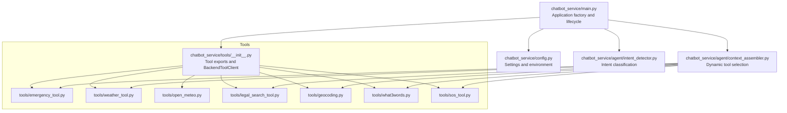
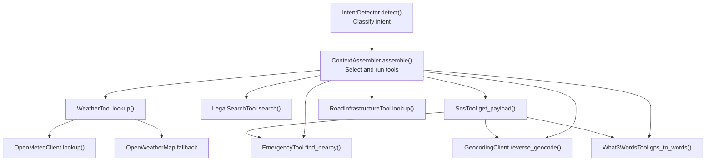
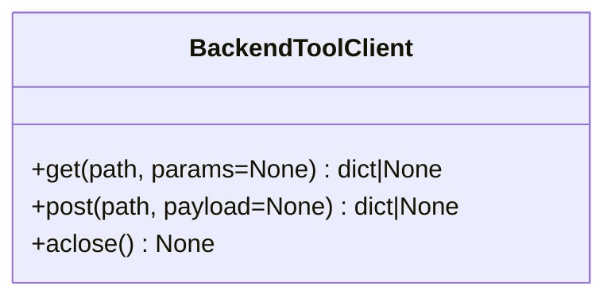
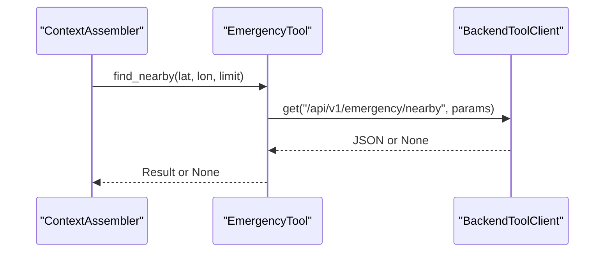
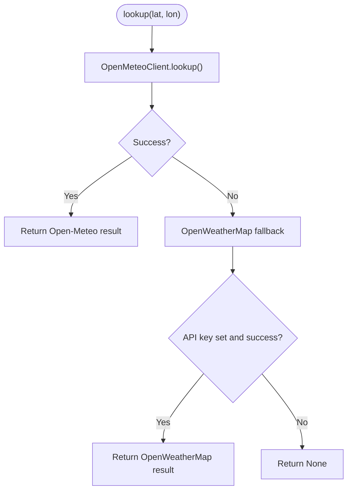
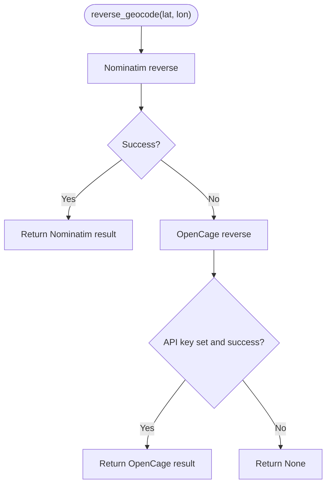
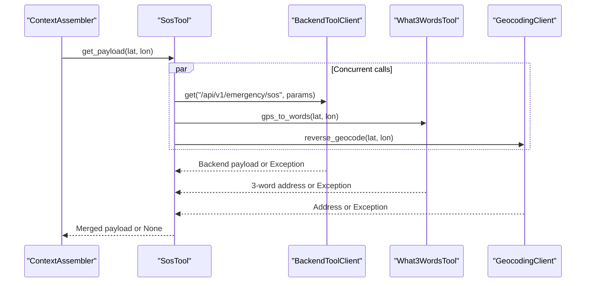
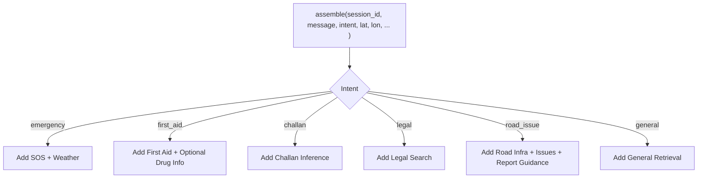
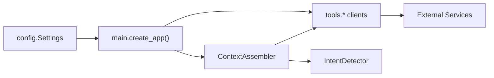
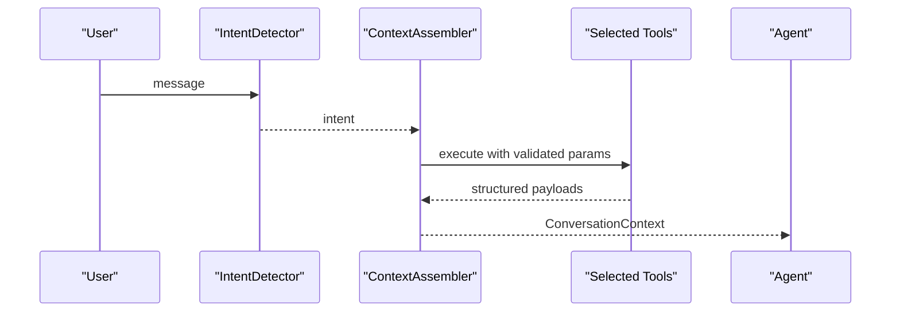

# Tool Execution and External Integrations

<cite>
**Referenced Files in This Document**
- [chatbot_service/main.py](file://chatbot_service/main.py)
- [chatbot_service/config.py](file://chatbot_service/config.py)
- [chatbot_service/tools/__init__.py](file://chatbot_service/tools/__init__.py)
- [chatbot_service/tools/emergency_tool.py](file://chatbot_service/tools/emergency_tool.py)
- [chatbot_service/tools/weather_tool.py](file://chatbot_service/tools/weather_tool.py)
- [chatbot_service/tools/open_meteo.py](file://chatbot_service/tools/open_meteo.py)
- [chatbot_service/tools/legal_search_tool.py](file://chatbot_service/tools/legal_search_tool.py)
- [chatbot_service/tools/geocoding.py](file://chatbot_service/tools/geocoding.py)
- [chatbot_service/tools/what3words.py](file://chatbot_service/tools/what3words.py)
- [chatbot_service/tools/sos_tool.py](file://chatbot_service/tools/sos_tool.py)
- [chatbot_service/agent/context_assembler.py](file://chatbot_service/agent/context_assembler.py)
- [chatbot_service/agent/intent_detector.py](file://chatbot_service/agent/intent_detector.py)
</cite>

## Table of Contents
1. [Introduction](#introduction)
2. [Project Structure](#project-structure)
3. [Core Components](#core-components)
4. [Architecture Overview](#architecture-overview)
5. [Detailed Component Analysis](#detailed-component-analysis)
6. [Dependency Analysis](#dependency-analysis)
7. [Performance Considerations](#performance-considerations)
8. [Troubleshooting Guide](#troubleshooting-guide)
9. [Conclusion](#conclusion)
10. [Appendices](#appendices)

## Introduction
This document describes the tool execution system for external service integration and automated workflows in the SafeVixAI chatbot service. It focuses on standardized interfaces for emergency services, legal databases, weather APIs, and geocoding services, and explains the tool execution pipeline including parameter validation, error handling, and response formatting. It also documents each tool implementation, the tool registry system, dynamic tool selection based on intent classification, examples of tool chaining, parallel execution, and timeout management, along with authentication, rate limiting, and fallback strategies. Finally, it provides guidelines for adding new tools and maintaining compatibility.

## Project Structure
The tool system is organized under the chatbot service with a dedicated tools module and an agent-driven context assembly layer. The main application initializes tool clients and integrates them into the chat engine lifecycle.

**Diagram sources**
- [chatbot_service/main.py:41-93](file://chatbot_service/main.py#L41-L93)
- [chatbot_service/config.py:39-113](file://chatbot_service/config.py#L39-L113)
- [chatbot_service/tools/__init__.py:8-70](file://chatbot_service/tools/__init__.py#L8-L70)
- [chatbot_service/agent/context_assembler.py:17-81](file://chatbot_service/agent/context_assembler.py#L17-L81)
- [chatbot_service/agent/intent_detector.py:9-25](file://chatbot_service/agent/intent_detector.py#L9-L25)

**Section sources**
- [chatbot_service/main.py:41-149](file://chatbot_service/main.py#L41-L149)
- [chatbot_service/config.py:39-126](file://chatbot_service/config.py#L39-L126)
- [chatbot_service/tools/__init__.py:1-70](file://chatbot_service/tools/__init__.py#L1-L70)

## Core Components
- BackendToolClient: Shared HTTP client for backend API calls with timeouts and user-agent headers.
- Tool Registry: Centralized exports of all tools via the tools package initializer.
- Tool Clients: Specialized clients for emergency lookup, weather, legal search, geocoding, what3words, SOS payload assembly, and road infrastructure queries.
- Context Assembler: Dynamically selects and executes tools based on intent classification.
- Intent Detector: Classifies incoming messages into intents such as emergency, first aid, challan, legal, road_issue, and general.

Key responsibilities:
- Parameter validation: Tools accept typed parameters (lat/lon, limit, query, etc.) and pass them to external services.
- Error handling: Tools wrap external calls in try/except blocks and return None on failure to allow graceful degradation.
- Response formatting: Tools normalize responses into consistent dictionaries with optional metadata (e.g., source attribution).
- Parallel execution: Tools leverage asyncio.gather for concurrent calls where appropriate.
- Fallback strategies: WeatherTool and GeocodingClient implement primary/fallback providers.

**Section sources**
- [chatbot_service/tools/__init__.py:8-70](file://chatbot_service/tools/__init__.py#L8-L70)
- [chatbot_service/agent/context_assembler.py:43-215](file://chatbot_service/agent/context_assembler.py#L43-L215)
- [chatbot_service/agent/intent_detector.py:9-25](file://chatbot_service/agent/intent_detector.py#L9-L25)

## Architecture Overview
The system orchestrates tool execution around a central intent detector and context assembler. The application lifecycle creates tool instances and wires them into the chat engine. Tools communicate with external services and the main backend, returning structured payloads consumed by the agent.

**Diagram sources**
- [chatbot_service/agent/intent_detector.py:9-25](file://chatbot_service/agent/intent_detector.py#L9-L25)
- [chatbot_service/agent/context_assembler.py:43-215](file://chatbot_service/agent/context_assembler.py#L43-L215)
- [chatbot_service/tools/weather_tool.py:15-64](file://chatbot_service/tools/weather_tool.py#L15-L64)
- [chatbot_service/tools/open_meteo.py:61-127](file://chatbot_service/tools/open_meteo.py#L61-L127)
- [chatbot_service/tools/sos_tool.py:10-44](file://chatbot_service/tools/sos_tool.py#L10-L44)
- [chatbot_service/tools/emergency_tool.py:6-15](file://chatbot_service/tools/emergency_tool.py#L6-L15)
- [chatbot_service/tools/geocoding.py:17-125](file://chatbot_service/tools/geocoding.py#L17-L125)
- [chatbot_service/tools/what3words.py:19-89](file://chatbot_service/tools/what3words.py#L19-L89)
- [chatbot_service/tools/legal_search_tool.py:6-12](file://chatbot_service/tools/legal_search_tool.py#L6-L12)
- [chatbot_service/tools/road_infra_tool.py:6-15](file://chatbot_service/tools/road_infra_tool.py#L6-L15)

## Detailed Component Analysis

### BackendToolClient
- Purpose: Unified HTTP client for backend API calls with configurable base URL, timeout, and user-agent.
- Behavior: Provides GET and POST helpers that return JSON or None on errors, ensuring robustness against transient failures.
- Lifecycle: Managed by the application factory and closed during shutdown.

**Diagram sources**
- [chatbot_service/tools/__init__.py:8-37](file://chatbot_service/tools/__init__.py#L8-L37)

**Section sources**
- [chatbot_service/tools/__init__.py:8-37](file://chatbot_service/tools/__init__.py#L8-L37)
- [chatbot_service/main.py:46-92](file://chatbot_service/main.py#L46-L92)

### EmergencyTool
- Purpose: Retrieve nearby emergency services for a given coordinate pair.
- Parameters: lat, lon, limit (default 5).
- Behavior: Delegates to BackendToolClient to call the backend emergency endpoint and returns the parsed JSON or None.

**Diagram sources**
- [chatbot_service/tools/emergency_tool.py:6-15](file://chatbot_service/tools/emergency_tool.py#L6-L15)
- [chatbot_service/tools/__init__.py:19-33](file://chatbot_service/tools/__init__.py#L19-L33)

**Section sources**
- [chatbot_service/tools/emergency_tool.py:6-15](file://chatbot_service/tools/emergency_tool.py#L6-L15)

### WeatherTool and OpenMeteoClient
- Purpose: Provide weather conditions for risk assessment with a primary free provider and a fallback.
- Primary: OpenMeteoClient (no API key required) returns current weather, hourly precipitation probability, visibility, and a risk multiplier.
- Fallback: WeatherTool attempts OpenWeatherMap if OpenMeteo fails, requiring an API key and units configuration.
- Behavior: Returns normalized dictionary with summary, temperature, wind speed, precipitation probability, visibility, weather code, risk multiplier, and source.

**Diagram sources**
- [chatbot_service/tools/weather_tool.py:15-64](file://chatbot_service/tools/weather_tool.py#L15-L64)
- [chatbot_service/tools/open_meteo.py:61-127](file://chatbot_service/tools/open_meteo.py#L61-L127)

**Section sources**
- [chatbot_service/tools/weather_tool.py:15-64](file://chatbot_service/tools/weather_tool.py#L15-L64)
- [chatbot_service/tools/open_meteo.py:61-127](file://chatbot_service/tools/open_meteo.py#L61-L127)

### LegalSearchTool
- Purpose: Search legal documents and regulations using a retriever scoped to legal content.
- Parameters: query string, top_k (default 4).
- Behavior: Returns a list of retrieval results suitable for downstream context assembly.

**Section sources**
- [chatbot_service/tools/legal_search_tool.py:6-12](file://chatbot_service/tools/legal_search_tool.py#L6-L12)

### GeocodingClient (Nominatim + OpenCage)
- Purpose: Convert coordinates to human-readable addresses with a primary free provider and a fallback.
- Primary: Nominatim reverse geocoding with strict rate limits and required user-agent.
- Fallback: OpenCage with a daily free quota and API key requirement.
- Behavior: Returns a normalized dictionary containing road, city, state, postcode, display string, and source.

**Diagram sources**
- [chatbot_service/tools/geocoding.py:17-125](file://chatbot_service/tools/geocoding.py#L17-L125)

**Section sources**
- [chatbot_service/tools/geocoding.py:17-125](file://chatbot_service/tools/geocoding.py#L17-L125)

### What3WordsTool
- Purpose: Convert GPS coordinates to a 3-word address and back for precise location sharing.
- Authentication: Requires an API key; returns None if missing.
- Behavior: Returns formatted 3-word address and map URL on forward conversion; returns lat/lng on reverse conversion.

**Section sources**
- [chatbot_service/tools/what3words.py:19-89](file://chatbot_service/tools/what3words.py#L19-L89)

### SosTool (Tool Chaining and Parallel Execution)
- Purpose: Assemble an SOS payload by concurrently fetching backend emergency data, 3-word address, and reverse geocoding.
- Parallelism: Uses asyncio.gather to execute three coroutines concurrently, reducing latency.
- Error handling: Proceeds even if one or more tasks fail; merges successful results into the payload.

**Diagram sources**
- [chatbot_service/tools/sos_tool.py:10-44](file://chatbot_service/tools/sos_tool.py#L10-L44)
- [chatbot_service/tools/what3words.py:26-57](file://chatbot_service/tools/what3words.py#L26-L57)
- [chatbot_service/tools/geocoding.py:36-81](file://chatbot_service/tools/geocoding.py#L36-L81)

**Section sources**
- [chatbot_service/tools/sos_tool.py:10-44](file://chatbot_service/tools/sos_tool.py#L10-L44)

### RoadInfrastructureTool
- Purpose: Query road infrastructure metadata near a coordinate pair.
- Parameters: lat, lon.
- Behavior: Calls backend roads infrastructure endpoint and returns structured data.

**Section sources**
- [chatbot_service/tools/road_infra_tool.py:6-15](file://chatbot_service/tools/road_infra_tool.py#L6-L15)

### ContextAssembler and Dynamic Tool Selection
- Purpose: Dynamically assemble conversation context by selecting tools based on intent.
- Intents:
  - emergency: Adds SOS payload and weather context.
  - first_aid: Adds first aid guidance and optional drug info.
  - challan: Adds challan inference and calculation.
  - legal: Adds legal search results.
  - road_issue: Adds road infrastructure and issues, plus submission guidance.
  - general: Adds general retrieval results.
- Behavior: Normalizes tool outputs into ToolContext entries with summaries, payloads, and sources.

**Diagram sources**
- [chatbot_service/agent/context_assembler.py:43-215](file://chatbot_service/agent/context_assembler.py#L43-L215)

**Section sources**
- [chatbot_service/agent/context_assembler.py:43-215](file://chatbot_service/agent/context_assembler.py#L43-L215)

### IntentDetector
- Purpose: Classify user messages into intents for tool selection.
- Classification rules: Pattern-based matching for emergency, first aid, challan, legal, and road_issue categories.

**Section sources**
- [chatbot_service/agent/intent_detector.py:9-25](file://chatbot_service/agent/intent_detector.py#L9-L25)

## Dependency Analysis
The tool system exhibits clear separation of concerns:
- Application lifecycle constructs tool clients and injects them into the context assembler.
- Context assembler depends on intent detector and tool clients.
- Tools depend on shared HTTP clients and external services, with explicit fallbacks.

**Diagram sources**
- [chatbot_service/config.py:39-113](file://chatbot_service/config.py#L39-L113)
- [chatbot_service/main.py:41-93](file://chatbot_service/main.py#L41-L93)
- [chatbot_service/agent/context_assembler.py:17-42](file://chatbot_service/agent/context_assembler.py#L17-L42)
- [chatbot_service/agent/intent_detector.py:9-25](file://chatbot_service/agent/intent_detector.py#L9-L25)

**Section sources**
- [chatbot_service/main.py:41-93](file://chatbot_service/main.py#L41-L93)
- [chatbot_service/agent/context_assembler.py:17-42](file://chatbot_service/agent/context_assembler.py#L17-L42)

## Performance Considerations
- Parallel execution: SosTool uses asyncio.gather to reduce latency by running multiple external calls concurrently.
- Timeouts: Tools configure timeouts via Settings and per-client timeouts to avoid blocking.
- Fallbacks: Free providers (Open-Meteo, Nominatim) minimize cost and latency; paid providers serve as fallbacks.
- Graceful degradation: Returning None on failures allows the system to continue assembling context without external data.

[No sources needed since this section provides general guidance]

## Troubleshooting Guide
Common issues and resolutions:
- Missing API keys:
  - OpenWeatherMap fallback requires an API key; absence disables fallback.
  - What3Words requires an API key; absence disables 3-word address conversion.
  - OpenCage requires an API key; absence disables fallback reverse geocoding.
- Rate limiting:
  - Nominatim enforces a strict request rate; consider caching or increasing delays if needed.
  - OpenCage offers a daily free quota; monitor usage to avoid throttling.
- Timeout errors:
  - Adjust Settings.http_timeout_seconds and per-tool timeouts to accommodate network variability.
- Backend connectivity:
  - BackendToolClient wraps calls and returns None on exceptions; verify backend base URL and network reachability.

**Section sources**
- [chatbot_service/tools/weather_tool.py:37-38](file://chatbot_service/tools/weather_tool.py#L37-L38)
- [chatbot_service/tools/what3words.py:33-34](file://chatbot_service/tools/what3words.py#L33-L34)
- [chatbot_service/tools/geocoding.py:85-86](file://chatbot_service/tools/geocoding.py#L85-L86)
- [chatbot_service/config.py:63-108](file://chatbot_service/config.py#L63-L108)

## Conclusion
The tool execution system integrates external services through standardized interfaces, robust error handling, and dynamic tool selection driven by intent classification. It emphasizes resilience via fallback strategies, performance via parallel execution, and maintainability through a centralized tool registry and lifecycle management.

[No sources needed since this section summarizes without analyzing specific files]

## Appendices

### Tool Execution Pipeline Overview
- Input: Message, optional coordinates, client IP, and conversation history.
- Intent classification: Determined by IntentDetector.
- Tool selection: ContextAssembler chooses tools based on intent.
- Execution: Tools call external services or backend endpoints with validated parameters.
- Output: Structured payloads merged into conversation context for the agent.

**Diagram sources**
- [chatbot_service/agent/intent_detector.py:9-25](file://chatbot_service/agent/intent_detector.py#L9-L25)
- [chatbot_service/agent/context_assembler.py:43-215](file://chatbot_service/agent/context_assembler.py#L43-L215)

### Adding a New Tool: Step-by-Step
- Define a new tool class under chatbot_service/tools with a clear interface and error-handling pattern.
- Add the tool to the tools package initializer exports.
- Instantiate the tool in the application factory with required dependencies (e.g., Settings, BackendToolClient, or retrievers).
- Wire the tool into ContextAssembler and select it based on intent.
- Ensure timeouts and authentication are configured via Settings or constructor parameters.
- Test with unit tests and integration checks for parameter validation, error handling, and response formatting.

**Section sources**
- [chatbot_service/tools/__init__.py:39-70](file://chatbot_service/tools/__init__.py#L39-L70)
- [chatbot_service/main.py:53-70](file://chatbot_service/main.py#L53-L70)
- [chatbot_service/agent/context_assembler.py:17-42](file://chatbot_service/agent/context_assembler.py#L17-L42)

### Maintaining Tool Compatibility
- Keep parameter names and response shapes consistent across tools to simplify ContextAssembler logic.
- Prefer optional fallbacks and guard clauses for authentication to avoid breaking the pipeline.
- Centralize configuration via Settings to enable environment-specific tuning without code changes.
- Use lifecycle hooks (e.g., aclose) to properly manage resources and connections.

**Section sources**
- [chatbot_service/config.py:39-113](file://chatbot_service/config.py#L39-L113)
- [chatbot_service/tools/weather_tool.py:61-63](file://chatbot_service/tools/weather_tool.py#L61-L63)
- [chatbot_service/tools/open_meteo.py:125-127](file://chatbot_service/tools/open_meteo.py#L125-L127)
- [chatbot_service/tools/geocoding.py:123-125](file://chatbot_service/tools/geocoding.py#L123-L125)
- [chatbot_service/tools/what3words.py:87-89](file://chatbot_service/tools/what3words.py#L87-L89)