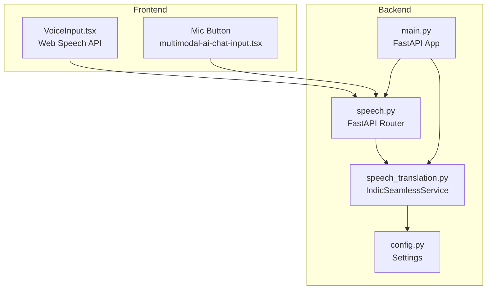
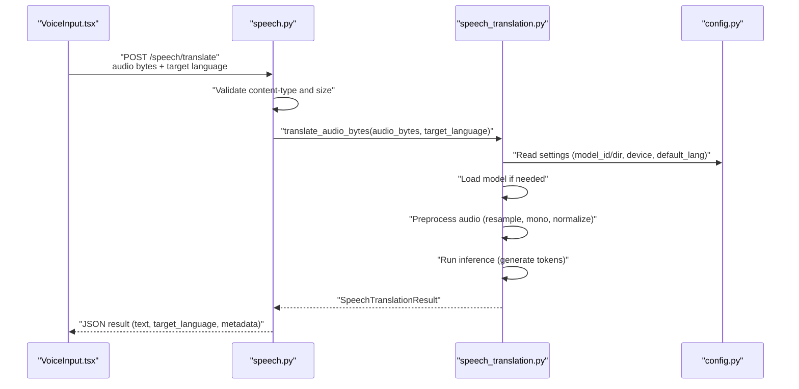
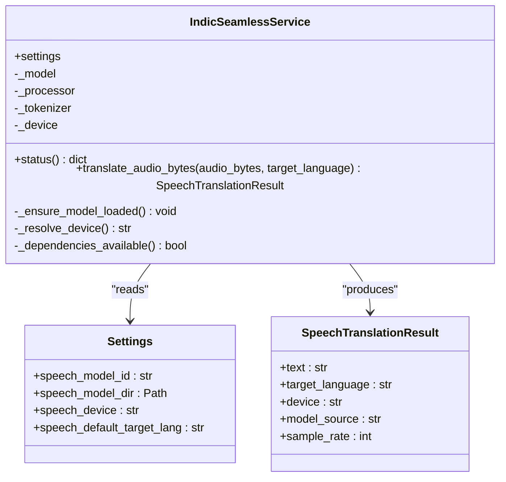
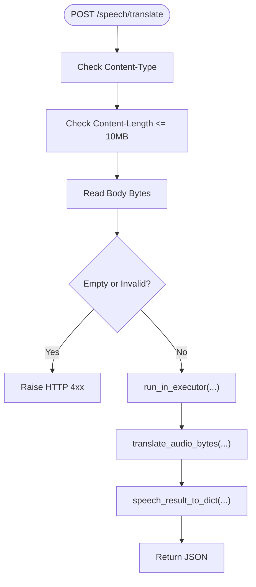
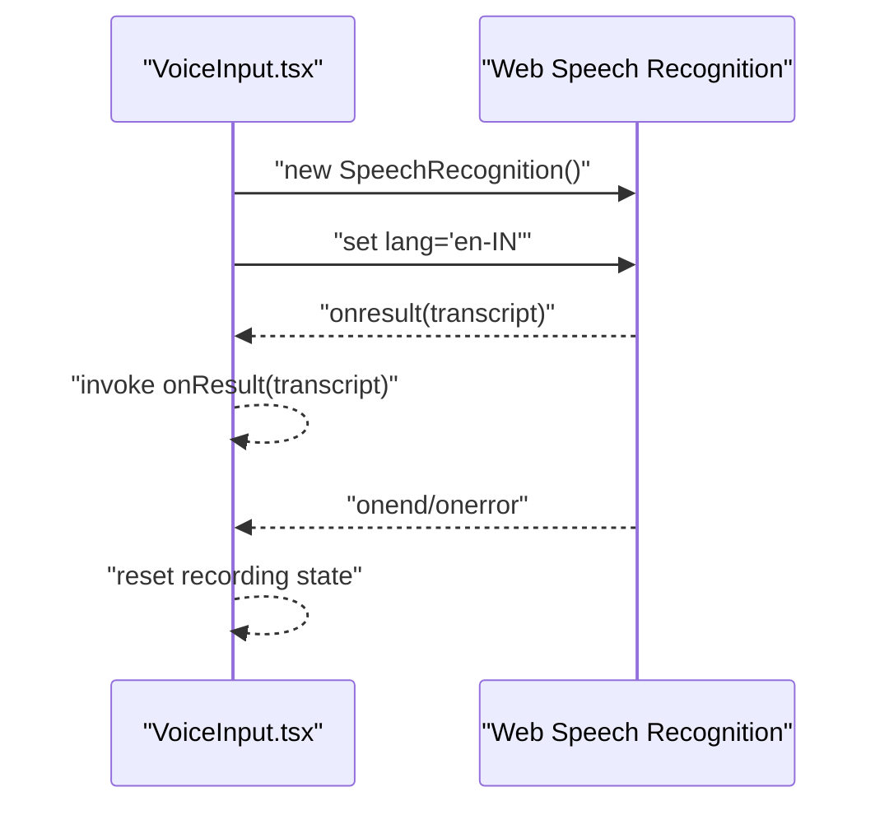
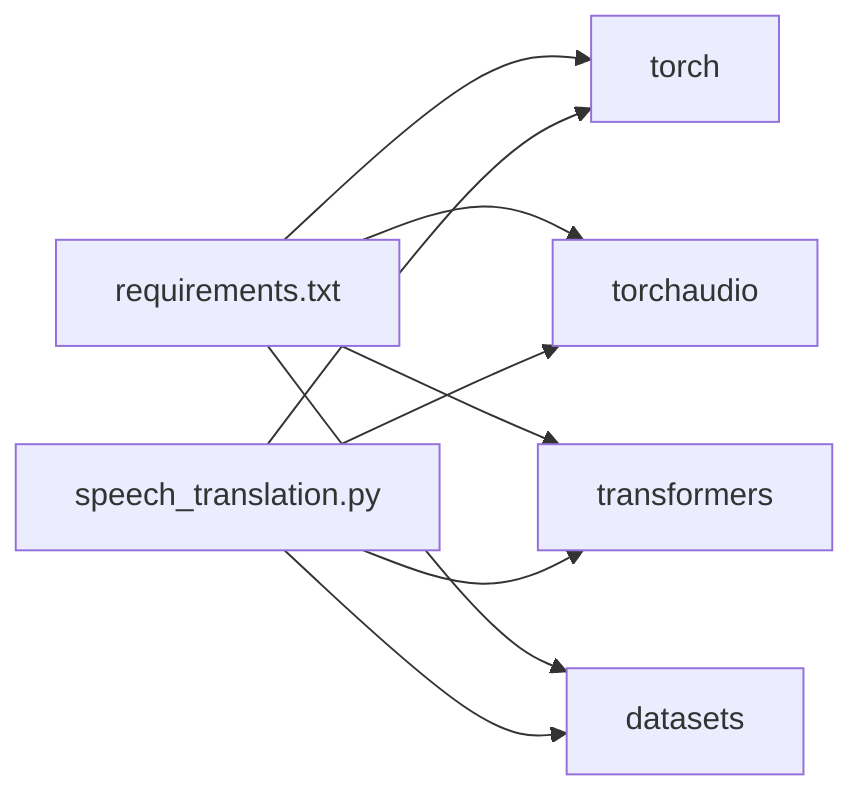

# Voice Input/Output and Speech Processing

<cite>
**Referenced Files in This Document**
- [main.py](file://chatbot_service/main.py)
- [speech.py](file://chatbot_service/api/speech.py)
- [speech_translation.py](file://chatbot_service/services/speech_translation.py)
- [config.py](file://chatbot_service/config.py)
- [VoiceInput.tsx](file://frontend/components/VoiceInput.tsx)
- [multimodal-ai-chat-input.tsx](file://frontend/components/chat/multimodal-ai-chat-input.tsx)
- [test_voice.py](file://chatbot_service/tests/test_voice.py)
- [requirements.txt](file://chatbot_service/requirements.txt)
- [Features.md](file://chatbot_docs/Features.md)
</cite>

## Table of Contents
1. [Introduction](#introduction)
2. [Project Structure](#project-structure)
3. [Core Components](#core-components)
4. [Architecture Overview](#architecture-overview)
5. [Detailed Component Analysis](#detailed-component-analysis)
6. [Dependency Analysis](#dependency-analysis)
7. [Performance Considerations](#performance-considerations)
8. [Troubleshooting Guide](#troubleshooting-guide)
9. [Conclusion](#conclusion)
10. [Appendices](#appendices)

## Introduction
This document details the voice processing capabilities of the SafeVixAI system with a focus on speech-to-text, speech translation, and multilingual support. It explains the speech recognition pipeline, real-time audio ingestion, transcription accuracy considerations, and the translation service that converts speech into text in target languages. It also outlines the multilingual speech processing approach, regional accents and dialects, language detection, and practical examples for voice command interpretation, speech feedback generation, audio quality enhancement, noise cancellation, echo suppression, microphone handling, speech buffer management, latency optimization, and accessibility compliance.

## Project Structure
The voice processing spans the frontend and backend services:
- Frontend: Voice input capture using the Web Speech API and UI controls for voice activation.
- Backend: A FastAPI service exposing a speech translation endpoint backed by a machine learning model for speech-to-text translation.

**Diagram sources**
- [main.py:41-145](file://chatbot_service/main.py#L41-L145)
- [speech.py:12-77](file://chatbot_service/api/speech.py#L12-L77)
- [speech_translation.py:34-141](file://chatbot_service/services/speech_translation.py#L34-L141)
- [config.py:39-113](file://chatbot_service/config.py#L39-L113)
- [VoiceInput.tsx:48-144](file://frontend/components/VoiceInput.tsx#L48-L144)
- [multimodal-ai-chat-input.tsx:143-181](file://frontend/components/chat/multimodal-ai-chat-input.tsx#L143-L181)

**Section sources**
- [main.py:41-145](file://chatbot_service/main.py#L41-L145)
- [speech.py:12-77](file://chatbot_service/api/speech.py#L12-L77)
- [speech_translation.py:34-141](file://chatbot_service/services/speech_translation.py#L34-L141)
- [config.py:39-113](file://chatbot_service/config.py#L39-L113)
- [VoiceInput.tsx:48-144](file://frontend/components/VoiceInput.tsx#L48-L144)
- [multimodal-ai-chat-input.tsx:143-181](file://frontend/components/chat/multimodal-ai-chat-input.tsx#L143-L181)

## Core Components
- Speech Translation Service: Implements speech-to-text translation using a pretrained model, handles audio preprocessing, device selection, and returns structured results.
- Speech API Endpoint: Validates audio uploads, enforces limits, offloads heavy inference to a thread pool, and returns translation results.
- Frontend Voice Input: Uses the Web Speech API to capture speech and emit transcribed text to the application.
- Configuration: Centralized settings for model identifiers, device selection, and default target language.

Key implementation references:
- Speech service initialization and model loading: [speech_translation.py:34-136](file://chatbot_service/services/speech_translation.py#L34-L136)
- Audio preprocessing and translation: [speech_translation.py:61-107](file://chatbot_service/services/speech_translation.py#L61-L107)
- API endpoint for translation: [speech.py:34-75](file://chatbot_service/api/speech.py#L34-L75)
- Frontend voice capture: [VoiceInput.tsx:48-144](file://frontend/components/VoiceInput.tsx#L48-L144)
- Settings for speech: [config.py:54-100](file://chatbot_service/config.py#L54-L100)

**Section sources**
- [speech_translation.py:34-136](file://chatbot_service/services/speech_translation.py#L34-L136)
- [speech_translation.py:61-107](file://chatbot_service/services/speech_translation.py#L61-L107)
- [speech.py:34-75](file://chatbot_service/api/speech.py#L34-L75)
- [VoiceInput.tsx:48-144](file://frontend/components/VoiceInput.tsx#L48-L144)
- [config.py:54-100](file://chatbot_service/config.py#L54-L100)

## Architecture Overview
The voice processing architecture integrates frontend voice capture with backend speech translation. The frontend emits audio or text to the backend, which performs translation and returns results.

**Diagram sources**
- [speech.py:34-75](file://chatbot_service/api/speech.py#L34-L75)
- [speech_translation.py:61-107](file://chatbot_service/services/speech_translation.py#L61-L107)
- [config.py:54-100](file://chatbot_service/config.py#L54-L100)

## Detailed Component Analysis

### Speech Translation Service
The service encapsulates:
- Device resolution (CUDA/CPU) with fallback.
- Lazy model loading from a configured model ID or local directory.
- Audio preprocessing: mono mix, resampling to 16 kHz.
- Inference using a pretrained model to produce translated text.
- Structured result with metadata for diagnostics and consumption.

**Diagram sources**
- [speech_translation.py:25-136](file://chatbot_service/services/speech_translation.py#L25-L136)
- [config.py:54-100](file://chatbot_service/config.py#L54-L100)

**Section sources**
- [speech_translation.py:25-136](file://chatbot_service/services/speech_translation.py#L25-L136)
- [config.py:54-100](file://chatbot_service/config.py#L54-L100)

### Speech API Endpoint
The endpoint:
- Validates content type and enforces maximum audio size.
- Reads the request body and delegates translation to the service.
- Offloads synchronous inference to a thread pool to avoid blocking the event loop.
- Returns standardized JSON with the result and content-type metadata.

**Diagram sources**
- [speech.py:34-75](file://chatbot_service/api/speech.py#L34-L75)

**Section sources**
- [speech.py:34-75](file://chatbot_service/api/speech.py#L34-L75)

### Frontend Voice Input
The frontend component:
- Initializes the Web Speech Recognition interface.
- Sets language to a region appropriate for the domain.
- Emits final transcripts to the parent component.
- Provides graceful fallback when the API is unavailable.

**Diagram sources**
- [VoiceInput.tsx:48-144](file://frontend/components/VoiceInput.tsx#L48-L144)

**Section sources**
- [VoiceInput.tsx:48-144](file://frontend/components/VoiceInput.tsx#L48-L144)

### Multilingual Speech Processing and Language Detection
- The backend supports translating speech into a configurable default target language.
- The frontend sets a locale-appropriate language for speech recognition.
- The system’s documentation highlights multilingual support for Indian languages and routing to specialized providers for quality.

References:
- Default target language setting: [config.py:100](file://chatbot_service/config.py#L100)
- Speech recognition language: [VoiceInput.tsx:65](file://frontend/components/VoiceInput.tsx#L65)
- Multilingual feature statement: [Features.md:24](file://chatbot_docs/Features.md#L24)

**Section sources**
- [config.py:100](file://chatbot_service/config.py#L100)
- [VoiceInput.tsx:65](file://frontend/components/VoiceInput.tsx#L65)
- [Features.md:24](file://chatbot_docs/Features.md#L24)

### Examples and Use Cases
- Voice command interpretation: The frontend captures speech and forwards the transcript to the application for intent processing.
  - Reference: [VoiceInput.tsx:75-78](file://frontend/components/VoiceInput.tsx#L75-L78)
- Speech feedback generation: The backend translates speech to text; the UI can integrate synthesized speech for read-back in emergencies.
  - Reference: [Features.md:22](file://chatbot_docs/Features.md#L22)
- Audio quality enhancement: The backend normalizes audio to mono and resamples to 16 kHz for consistent model input.
  - Reference: [speech_translation.py:76-85](file://chatbot_service/services/speech_translation.py#L76-L85)
- Noise cancellation and echo suppression: Not implemented in the referenced code; recommended to apply pre-processing at the client level before sending audio.
- Microphone handling: The frontend component manages lifecycle and graceful fallback.
  - Reference: [VoiceInput.tsx:91-93](file://frontend/components/VoiceInput.tsx#L91-L93)
- Speech buffer management and latency optimization: The API offloads inference to a thread pool to prevent blocking the event loop.
  - Reference: [speech.py:60-64](file://chatbot_service/api/speech.py#L60-L64)
- Accessibility compliance: The component exposes aria-labels and visual feedback for recording state.
  - Reference: [VoiceInput.tsx:113](file://frontend/components/VoiceInput.tsx#L113), [VoiceInput.tsx:130-135](file://frontend/components/VoiceInput.tsx#L130-L135)

**Section sources**
- [VoiceInput.tsx:75-78](file://frontend/components/VoiceInput.tsx#L75-L78)
- [Features.md:22](file://chatbot_docs/Features.md#L22)
- [speech_translation.py:76-85](file://chatbot_service/services/speech_translation.py#L76-L85)
- [speech.py:60-64](file://chatbot_service/api/speech.py#L60-L64)
- [VoiceInput.tsx:113](file://frontend/components/VoiceInput.tsx#L113)
- [VoiceInput.tsx:130-135](file://frontend/components/VoiceInput.tsx#L130-L135)

## Dependency Analysis
Runtime dependencies for speech processing include PyTorch, torchaudio, and Transformers. These are declared in the requirements file.

**Diagram sources**
- [requirements.txt:4-8](file://chatbot_service/requirements.txt#L4-L8)
- [speech_translation.py:9-22](file://chatbot_service/services/speech_translation.py#L9-L22)

**Section sources**
- [requirements.txt:4-8](file://chatbot_service/requirements.txt#L4-L8)
- [speech_translation.py:9-22](file://chatbot_service/services/speech_translation.py#L9-L22)

## Performance Considerations
- Device selection: The service automatically selects CUDA if available; otherwise falls back to CPU. This minimizes inference latency on capable hardware.
  - Reference: [speech_translation.py:130-136](file://chatbot_service/services/speech_translation.py#L130-L136)
- Lazy model loading: Models are loaded only when needed, reducing cold-start overhead.
  - Reference: [speech_translation.py:122-128](file://chatbot_service/services/speech_translation.py#L122-L128)
- Thread pool offloading: Heavy inference runs in a thread pool to avoid blocking the event loop.
  - Reference: [speech.py:60-64](file://chatbot_service/api/speech.py#L60-L64)
- Audio normalization: Resampling to 16 kHz and mono mixing ensures consistent model input, improving reliability.
  - Reference: [speech_translation.py:76-85](file://chatbot_service/services/speech_translation.py#L76-L85)

[No sources needed since this section provides general guidance]

## Troubleshooting Guide
- Missing dependencies: If the required ML libraries are not installed, the service raises a runtime error indicating missing dependencies.
  - Reference: [speech_translation.py:69-73](file://chatbot_service/services/speech_translation.py#L69-L73)
- Empty audio payload: The API validates the request body and raises a 400 error for empty payloads.
  - Reference: [speech.py:53-54](file://chatbot_service/api/speech.py#L53-L54)
- Unsupported content type: The API rejects unsupported audio formats with a 415 error.
  - Reference: [speech.py:42-43](file://chatbot_service/api/speech.py#L42-L43)
- Excessive audio size: The API enforces a 10 MB limit and returns a 413 error if exceeded.
  - Reference: [speech.py:47-52](file://chatbot_service/api/speech.py#L47-L52)
- Model directory status verification: Tests confirm the service reports model directory existence and default language correctly.
  - Reference: [test_voice.py:10-26](file://chatbot_service/tests/test_voice.py#L10-L26)

**Section sources**
- [speech_translation.py:69-73](file://chatbot_service/services/speech_translation.py#L69-L73)
- [speech.py:42-54](file://chatbot_service/api/speech.py#L42-L54)
- [test_voice.py:10-26](file://chatbot_service/tests/test_voice.py#L10-L26)

## Conclusion
The SafeVixAI voice processing pipeline integrates a Web Speech API-based frontend with a backend speech translation service powered by a pretrained model. The system supports multilingual translation, configurable device selection, and robust error handling. While the current implementation focuses on speech-to-text translation and recognition, additional enhancements such as noise cancellation, echo suppression, and TTS synthesis can be layered to further improve user experience in real-world conditions.

[No sources needed since this section summarizes without analyzing specific files]

## Appendices

### Configuration Options for Speech
- speech_model_id: Identifier for the pretrained model.
- speech_model_dir: Optional local directory containing the model.
- speech_device: Target device ('auto', 'cuda', 'cpu').
- speech_default_target_lang: Default language for translation.

**Section sources**
- [config.py:54-100](file://chatbot_service/config.py#L54-L100)