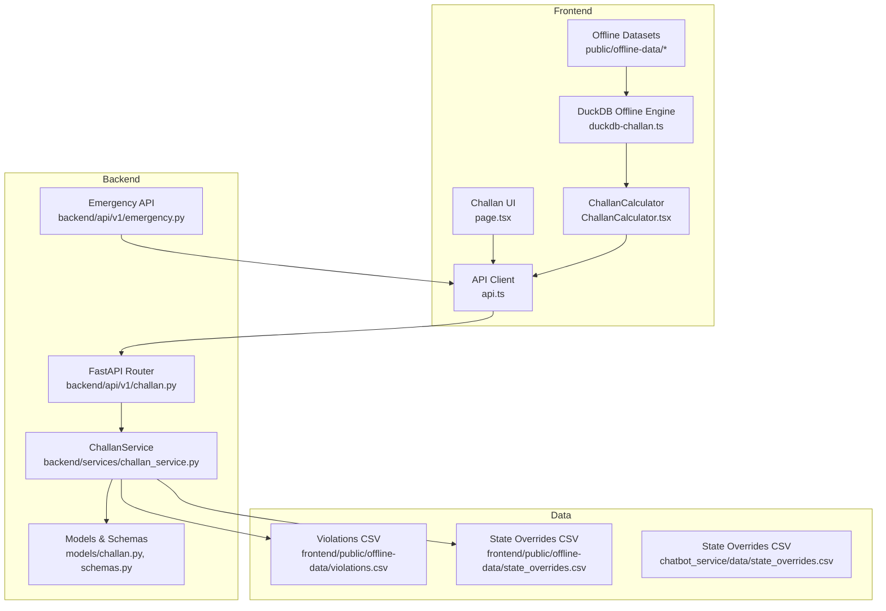
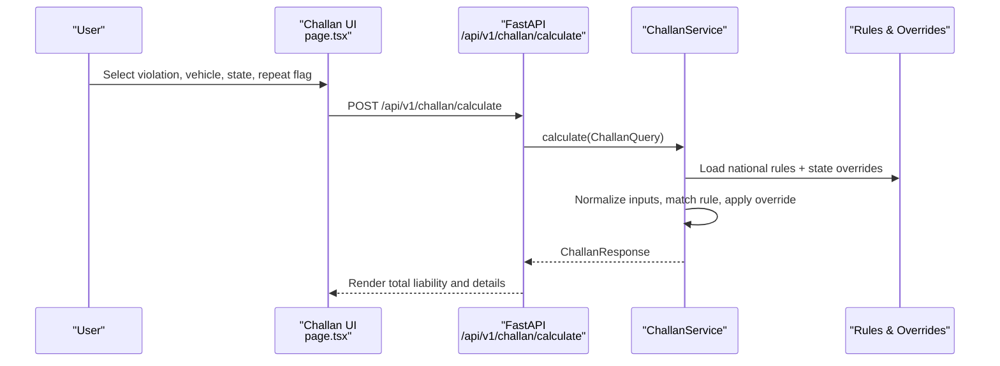
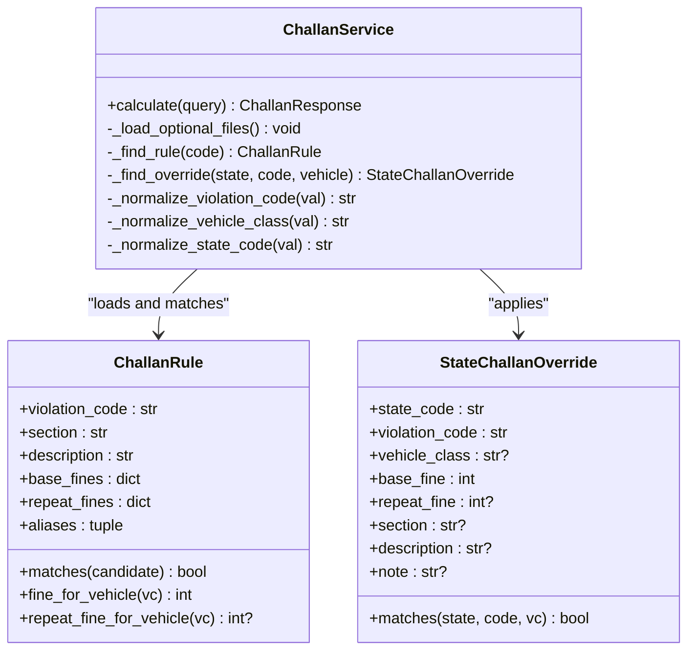
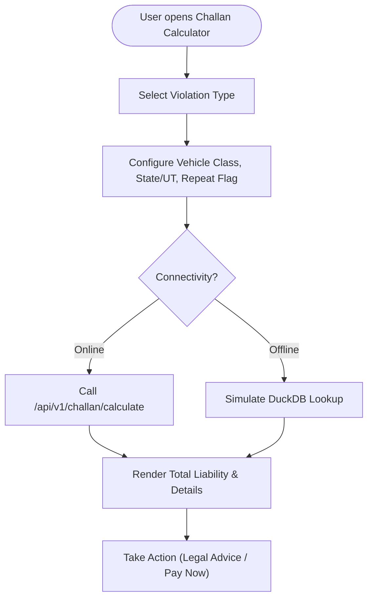
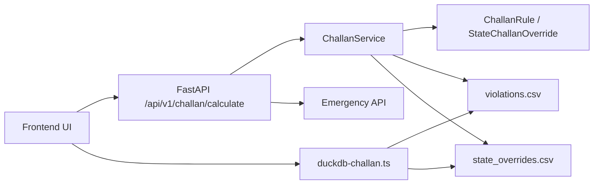

# Challan Calculator (DriveLegal)

<cite>
**Referenced Files in This Document**
- [challan.py](file://backend/api/v1/challan.py)
- [challan_service.py](file://backend/services/challan_service.py)
- [challan.py](file://backend/models/challan.py)
- [schemas.py](file://backend/models/schemas.py)
- [page.tsx](file://frontend/app/challan/page.tsx)
- [ChallanCalculator.tsx](file://frontend/components/ChallanCalculator.tsx)
- [duckdb-challan.ts](file://frontend/lib/duckdb-challan.ts)
- [api.ts](file://frontend/lib/api.ts)
- [state_overrides.csv](file://chatbot_service/data/state_overrides.csv)
- [violations.csv](file://frontend/public/offline-data/violations.csv)
- [state_overrides.csv](file://frontend/public/offline-data/state_overrides.csv)
- [emergency.py](file://backend/api/v1/emergency.py)
- [motor_vehicles_act_1988_summary.txt](file://chatbot_service/data/legal/motor_vehicles_act_1988_summary.txt)
</cite>

## Table of Contents
1. [Introduction](#introduction)
2. [Project Structure](#project-structure)
3. [Core Components](#core-components)
4. [Architecture Overview](#architecture-overview)
5. [Detailed Component Analysis](#detailed-component-analysis)
6. [Dependency Analysis](#dependency-analysis)
7. [Performance Considerations](#performance-considerations)
8. [Troubleshooting Guide](#troubleshooting-guide)
9. [Conclusion](#conclusion)
10. [Appendices](#appendices)

## Introduction
The Challan Calculator (DriveLegal) module provides accurate, state-aware fine calculation for traffic violations under the Motor Vehicles Act 2019. It integrates national violation categories with state-specific overrides, supports online and offline operation via DuckDB, and offers a real-time user interface for quick estimations. The system also includes emergency services integration for immediate assistance alongside fine calculation.

## Project Structure
The module spans backend APIs and services, frontend UI and offline logic, and curated datasets for violations and state overrides.

**Diagram sources**
- [challan.py:10-26](file://backend/api/v1/challan.py#L10-L26)
- [challan_service.py:96-101](file://backend/services/challan_service.py#L96-L101)
- [page.tsx:45-80](file://frontend/app/challan/page.tsx#L45-L80)
- [ChallanCalculator.tsx:32-62](file://frontend/components/ChallanCalculator.tsx#L32-L62)
- [duckdb-challan.ts:20-50](file://frontend/lib/duckdb-challan.ts#L20-L50)
- [api.ts:1-50](file://frontend/lib/api.ts#L1-L50)
- [violations.csv:1-27](file://frontend/public/offline-data/violations.csv#L1-L27)
- [state_overrides.csv:1-14](file://frontend/public/offline-data/state_overrides.csv#L1-L14)
- [state_overrides.csv:1-14](file://chatbot_service/data/state_overrides.csv#L1-L14)
- [emergency.py:12-17](file://backend/api/v1/emergency.py#L12-L17)

**Section sources**
- [challan.py:10-26](file://backend/api/v1/challan.py#L10-L26)
- [challan_service.py:96-101](file://backend/services/challan_service.py#L96-L101)
- [page.tsx:45-80](file://frontend/app/challan/page.tsx#L45-L80)
- [ChallanCalculator.tsx:32-62](file://frontend/components/ChallanCalculator.tsx#L32-L62)
- [duckdb-challan.ts:20-50](file://frontend/lib/duckdb-challan.ts#L20-L50)
- [api.ts:1-50](file://frontend/lib/api.ts#L1-L50)
- [violations.csv:1-27](file://frontend/public/offline-data/violations.csv#L1-L27)
- [state_overrides.csv:1-14](file://frontend/public/offline-data/state_overrides.csv#L1-L14)
- [state_overrides.csv:1-14](file://chatbot_service/data/state_overrides.csv#L1-L14)
- [emergency.py:12-17](file://backend/api/v1/emergency.py#L12-L17)

## Core Components
- Backend API: Exposes a single endpoint to calculate challans based on violation, vehicle class, state, and repeat status.
- ChallanService: Loads national and state-specific rules, normalizes inputs, selects applicable rule, applies overrides, and computes amounts.
- Models and Schemas: Define rule structures, override matching, and request/response contracts.
- Frontend UI: Provides a real-time calculator with state selection, repeat flag, and live result display.
- DuckDB Offline Engine: Simulates offline fine lookup using bundled datasets.
- Emergency Services Integration: Provides nearby emergency services and SOS payload for immediate assistance.

**Section sources**
- [challan.py:17-26](file://backend/api/v1/challan.py#L17-L26)
- [challan_service.py:96-150](file://backend/services/challan_service.py#L96-L150)
- [challan.py:6-32](file://backend/models/challan.py#L6-L32)
- [schemas.py:240-257](file://backend/models/schemas.py#L240-L257)
- [page.tsx:45-80](file://frontend/app/challan/page.tsx#L45-L80)
- [ChallanCalculator.tsx:32-62](file://frontend/components/ChallanCalculator.tsx#L32-L62)
- [duckdb-challan.ts:20-50](file://frontend/lib/duckdb-challan.ts#L20-L50)
- [emergency.py:19-76](file://backend/api/v1/emergency.py#L19-L76)

## Architecture Overview
The system follows a clean separation of concerns:
- Frontend captures inputs and renders results.
- API validates and delegates to the service layer.
- Service resolves national and state-specific rules and calculates penalties.
- Offline engine supports DuckDB-based lookups using bundled datasets.
- Emergency endpoints integrate with nearby services and SOS workflows.

**Diagram sources**
- [page.tsx:71-80](file://frontend/app/challan/page.tsx#L71-L80)
- [challan.py:17-26](file://backend/api/v1/challan.py#L17-L26)
- [challan_service.py:103-149](file://backend/services/challan_service.py#L103-L149)
- [challan.py:6-32](file://backend/models/challan.py#L6-L32)
- [schemas.py:240-257](file://backend/models/schemas.py#L240-L257)

## Detailed Component Analysis

### Backend API: Challan Calculation Endpoint
- Defines a POST endpoint to compute challans.
- Uses dependency injection to access the shared service instance.
- Returns structured response or raises validation errors.

**Section sources**
- [challan.py:10-26](file://backend/api/v1/challan.py#L10-L26)

### ChallanService: Rule Resolution and Overrides
- Maintains national default rules and loads optional CSV datasets.
- Normalizes violation codes, vehicle classes, and state codes.
- Matches rules by violation code or aliases and applies state-specific overrides.
- Computes base/repeat fines and constructs the response.

**Diagram sources**
- [challan_service.py:96-101](file://backend/services/challan_service.py#L96-L101)
- [challan.py:6-32](file://backend/models/challan.py#L6-L32)
- [challan.py:34-52](file://backend/models/challan.py#L34-L52)

**Section sources**
- [challan_service.py:96-150](file://backend/services/challan_service.py#L96-L150)
- [challan.py:6-32](file://backend/models/challan.py#L6-L32)
- [challan.py:34-52](file://backend/models/challan.py#L34-L52)

### Frontend UI: Real-Time Challan Calculator
- Provides a grid of common violations and a configuration panel for vehicle class, state/UT, and repeat status.
- On calculate, sends request to backend or simulates offline calculation.
- Displays total liability with section and description, and highlights repeat penalties.

**Diagram sources**
- [ChallanCalculator.tsx:32-62](file://frontend/components/ChallanCalculator.tsx#L32-L62)
- [page.tsx:71-80](file://frontend/app/challan/page.tsx#L71-L80)

**Section sources**
- [ChallanCalculator.tsx:13-62](file://frontend/components/ChallanCalculator.tsx#L13-L62)
- [page.tsx:45-80](file://frontend/app/challan/page.tsx#L45-L80)

### DuckDB Offline Engine
- Initializes offline capability and performs simulated lookups against bundled datasets.
- Returns base and repeat fines along with section and description.

**Section sources**
- [duckdb-challan.ts:4-18](file://frontend/lib/duckdb-challan.ts#L4-L18)
- [duckdb-challan.ts:20-50](file://frontend/lib/duckdb-challan.ts#L20-L50)

### Emergency Services Integration
- Provides nearby emergency services and SOS payload for immediate assistance.
- Supports categories like hospital, police, ambulance, fire, and others.

**Section sources**
- [emergency.py:19-76](file://backend/api/v1/emergency.py#L19-L76)

## Dependency Analysis
- Frontend depends on FastAPI backend for online calculations and DuckDB for offline.
- Backend depends on CSV datasets for national and state-specific rules.
- Emergency endpoints complement the calculator with immediate assistance.

**Diagram sources**
- [challan.py:17-26](file://backend/api/v1/challan.py#L17-L26)
- [challan_service.py:151-158](file://backend/services/challan_service.py#L151-L158)
- [page.tsx:71-80](file://frontend/app/challan/page.tsx#L71-L80)
- [duckdb-challan.ts:20-50](file://frontend/lib/duckdb-challan.ts#L20-L50)
- [emergency.py:19-76](file://backend/api/v1/emergency.py#L19-L76)

**Section sources**
- [challan.py:17-26](file://backend/api/v1/challan.py#L17-L26)
- [challan_service.py:151-158](file://backend/services/challan_service.py#L151-L158)
- [page.tsx:71-80](file://frontend/app/challan/page.tsx#L71-L80)
- [duckdb-challan.ts:20-50](file://frontend/lib/duckdb-challan.ts#L20-L50)
- [emergency.py:19-76](file://backend/api/v1/emergency.py#L19-L76)

## Performance Considerations
- Online calculation: Minimal latency due to lightweight rule matching and CSV loading.
- Offline calculation: DuckDB simulation is fast; production would benefit from compiled WASM and indexed datasets.
- Caching: Reuse loaded CSVs in service instances to avoid repeated disk reads.
- Dataset size: Keep violations and overrides lean; split by state if needed for scalability.

## Troubleshooting Guide
- Unsupported violation code: Service raises validation errors for unknown codes; ensure the violation code exists in national or state datasets.
- Missing state code: Validation enforces required state code; support normalization for common formats.
- Vehicle class issues: Ensure aliases map to supported classes; otherwise validation fails.
- Offline mode: DuckDB initialization is environment-dependent; verify browser context and asset availability.

**Section sources**
- [challan_service.py:109-113](file://backend/services/challan_service.py#L109-L113)
- [challan_service.py:294-313](file://backend/services/challan_service.py#L294-L313)
- [duckdb-challan.ts:4-18](file://frontend/lib/duckdb-challan.ts#L4-L18)

## Conclusion
The Challan Calculator integrates national and state-specific traffic violation enforcement with robust rule resolution and a user-friendly interface. It supports online and offline modes, ensuring accessibility across connectivity scenarios, while integrating emergency services for immediate assistance.

## Appendices

### Legal Framework Integration
- Motor Vehicles Act 2019 baseline penalties and sections inform national rules.
- State-specific overrides reflect regional enforcement schedules and rates.

**Section sources**
- [motor_vehicles_act_1988_summary.txt:349-390](file://chatbot_service/data/legal/motor_vehicles_act_1988_summary.txt#L349-L390)
- [state_overrides.csv:1-14](file://chatbot_service/data/state_overrides.csv#L1-L14)

### Offline Data Bundling Strategy
- Datasets include violations and state overrides for 25+ major cities and states.
- Bundled CSVs enable DuckDB-based offline calculations without external dependencies.

**Section sources**
- [violations.csv:1-27](file://frontend/public/offline-data/violations.csv#L1-L27)
- [state_overrides.csv:1-14](file://frontend/public/offline-data/state_overrides.csv#L1-L14)

### User Interface Inputs and Outputs
- Inputs: Violation code, vehicle class, state/UT, repeat flag.
- Outputs: Base fine, repeat fine, total amount due, section, description, and state override note.

**Section sources**
- [schemas.py:240-257](file://backend/models/schemas.py#L240-L257)
- [page.tsx:71-80](file://frontend/app/challan/page.tsx#L71-L80)
- [ChallanCalculator.tsx:32-62](file://frontend/components/ChallanCalculator.tsx#L32-L62)