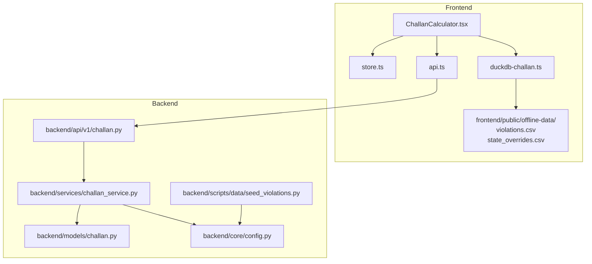
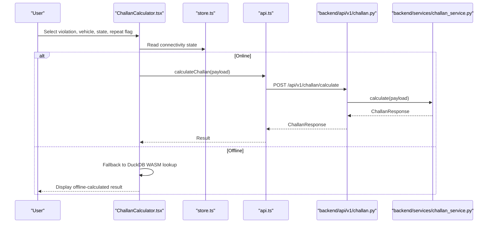
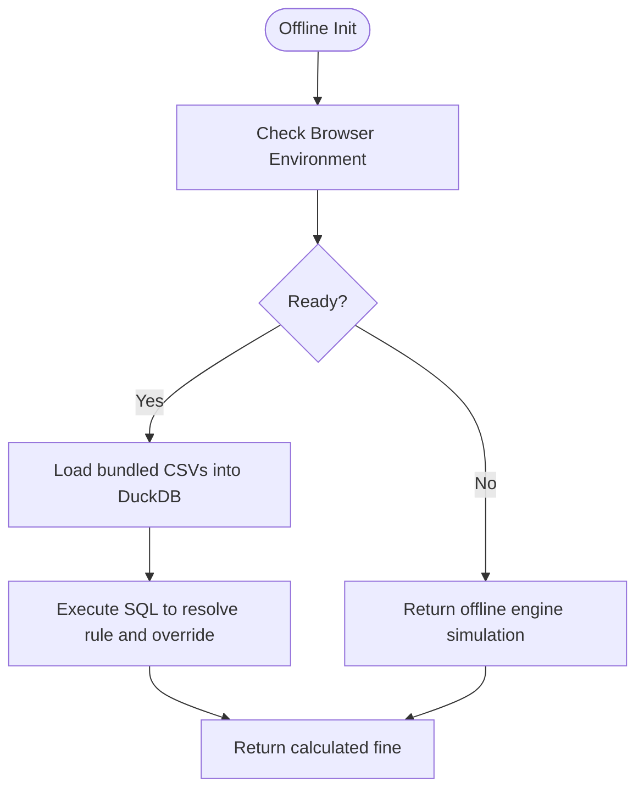
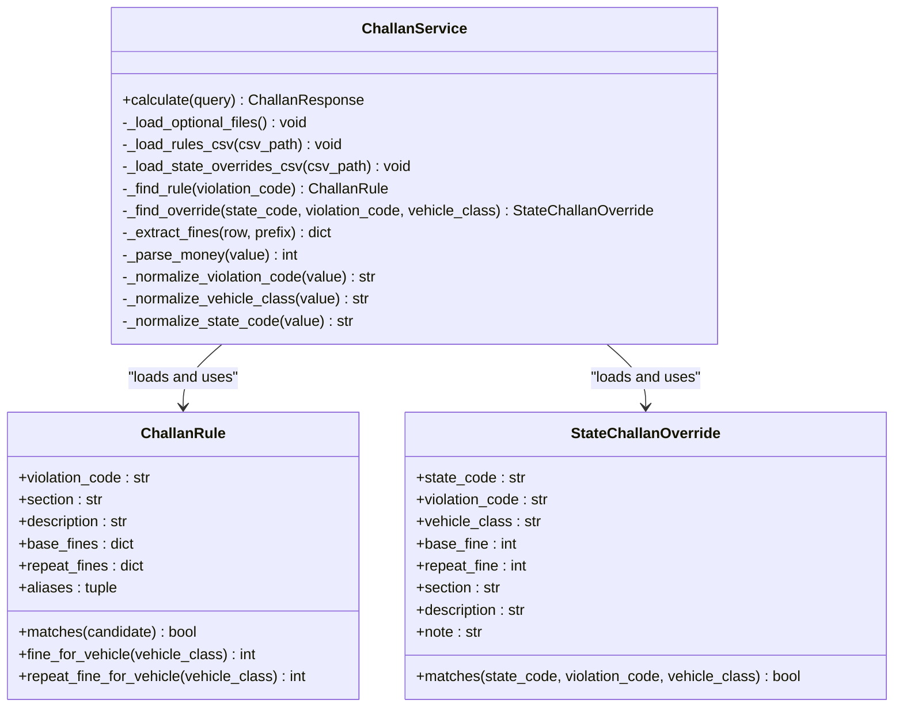
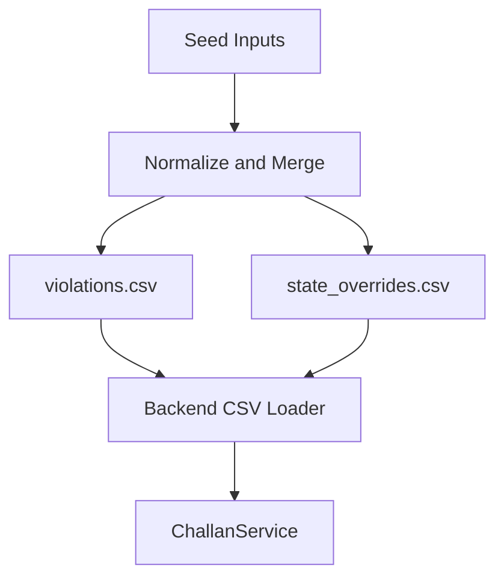
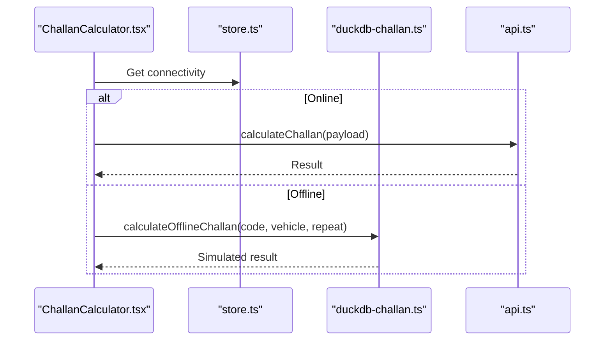
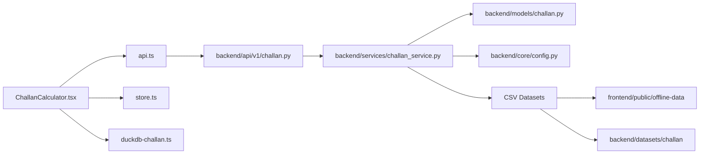

# DuckDB Offline Implementation

<cite>
**Referenced Files in This Document**
- [duckdb-challan.ts](file://frontend/lib/duckdb-challan.ts)
- [violations.csv](file://frontend/public/offline-data/violations.csv)
- [state_overrides.csv](file://frontend/public/offline-data/state_overrides.csv)
- [challan.py](file://backend/api/v1/challan.py)
- [challan_service.py](file://backend/services/challan_service.py)
- [challan.py](file://backend/models/challan.py)
- [config.py](file://backend/core/config.py)
- [seed_violations.py](file://backend/scripts/data/seed_violations.py)
- [ChallanCalculator.tsx](file://frontend/components/ChallanCalculator.tsx)
- [api.ts](file://frontend/lib/api.ts)
- [store.ts](file://frontend/lib/store.ts)
- [offline.py](file://backend/api/v1/offline.py)
- [build_offline_bundle.py](file://backend/scripts/app/build_offline_bundle.py)
</cite>

## Table of Contents
1. [Introduction](#introduction)
2. [Project Structure](#project-structure)
3. [Core Components](#core-components)
4. [Architecture Overview](#architecture-overview)
5. [Detailed Component Analysis](#detailed-component-analysis)
6. [Dependency Analysis](#dependency-analysis)
7. [Performance Considerations](#performance-considerations)
8. [Troubleshooting Guide](#troubleshooting-guide)
9. [Conclusion](#conclusion)

## Introduction
This document describes the DuckDB offline implementation for the Challan Calculator, focusing on offline fine calculation capabilities. It explains how the system loads and normalizes traffic violation and state override data from CSV files, how the backend service performs real-time fine calculations, and how the frontend integrates with both online and offline modes. It also covers performance characteristics, memory management strategies for large datasets, caching mechanisms, and data synchronization/validation processes to ensure accurate calculations across 25+ major cities.

## Project Structure
The offline Challan Calculator spans both the frontend and backend:

- Frontend:
  - Offline data bundles: violations.csv and state_overrides.csv placed under frontend/public/offline-data
  - DuckDB abstraction layer for offline calculations
  - UI component for Challan calculation with online/offline fallback
  - Store and connectivity state management

- Backend:
  - FastAPI endpoints for Challan calculation
  - ChallanService that loads CSV data and computes penalties
  - Models for ChallanRule and StateChallanOverride
  - Scripts to seed and normalize CSV data into backend datasets
  - Configuration for data directories and offline bundle generation

**Diagram sources**
- [ChallanCalculator.tsx:1-186](file://frontend/components/ChallanCalculator.tsx#L1-186)
- [store.ts:1-226](file://frontend/lib/store.ts#L1-226)
- [api.ts:1-821](file://frontend/lib/api.ts#L1-821)
- [duckdb-challan.ts:1-51](file://frontend/lib/duckdb-challan.ts#L1-51)
- [violations.csv:1-27](file://frontend/public/offline-data/violations.csv#L1-27)
- [state_overrides.csv:1-14](file://frontend/public/offline-data/state_overrides.csv#L1-14)
- [challan.py:1-26](file://backend/api/v1/challan.py#L1-26)
- [challan_service.py:1-314](file://backend/services/challan_service.py#L1-314)
- [challan.py:1-53](file://backend/models/challan.py#L1-53)
- [config.py:1-181](file://backend/core/config.py#L1-181)
- [seed_violations.py:1-482](file://backend/scripts/data/seed_violations.py#L1-482)

**Section sources**
- [duckdb-challan.ts:1-51](file://frontend/lib/duckdb-challan.ts#L1-51)
- [violations.csv:1-27](file://frontend/public/offline-data/violations.csv#L1-27)
- [state_overrides.csv:1-14](file://frontend/public/offline-data/state_overrides.csv#L1-14)
- [challan.py:1-26](file://backend/api/v1/challan.py#L1-26)
- [challan_service.py:1-314](file://backend/services/challan_service.py#L1-314)
- [challan.py:1-53](file://backend/models/challan.py#L1-53)
- [config.py:1-181](file://backend/core/config.py#L1-181)
- [seed_violations.py:1-482](file://backend/scripts/data/seed_violations.py#L1-482)
- [ChallanCalculator.tsx:1-186](file://frontend/components/ChallanCalculator.tsx#L1-186)
- [api.ts:1-821](file://frontend/lib/api.ts#L1-821)
- [store.ts:1-226](file://frontend/lib/store.ts#L1-226)

## Core Components
- DuckDB Offline Abstraction:
  - Provides a lightweight DuckDB WASM initialization helper and an offline calculation function that simulates fast lookups against bundled data.
  - In production, this would integrate with DuckDB WASM to load and query the CSV datasets directly in the browser.

- Backend ChallanService:
  - Loads violations and state overrides from multiple candidate directories (including frontend public offline-data).
  - Normalizes vehicle classes, violation codes, and state codes.
  - Computes base/repeat fines and applies state overrides when present.

- Models:
  - ChallanRule defines violation rules with per-vehicle-class base and repeat fines.
  - StateChallanOverride captures state-specific adjustments to base/repeat fines.

- Frontend Integration:
  - ChallanCalculator component orchestrates online/offline calculation based on connectivity state.
  - Uses a store to manage connectivity and user inputs.

**Section sources**
- [duckdb-challan.ts:1-51](file://frontend/lib/duckdb-challan.ts#L1-51)
- [challan_service.py:96-314](file://backend/services/challan_service.py#L96-314)
- [challan.py:6-53](file://backend/models/challan.py#L6-53)
- [ChallanCalculator.tsx:1-186](file://frontend/components/ChallanCalculator.tsx#L1-186)
- [store.ts:60-120](file://frontend/lib/store.ts#L60-120)

## Architecture Overview
The offline architecture separates concerns between frontend data bundling and backend computation:

- Data Loading:
  - CSV files are placed under frontend/public/offline-data and optionally generated/seeded via backend scripts.
  - Backend ChallanService scans multiple directories for violations.csv and state_overrides.csv.

- Calculation Flow:
  - Online: Frontend calls backend endpoint; backend resolves rules and overrides and returns calculated amounts.
  - Offline: Frontend uses DuckDB WASM to query the bundled CSV data directly.

**Diagram sources**
- [ChallanCalculator.tsx:32-62](file://frontend/components/ChallanCalculator.tsx#L32-62)
- [store.ts:90-93](file://frontend/lib/store.ts#L90-93)
- [api.ts:1-821](file://frontend/lib/api.ts#L1-821)
- [challan.py:17-26](file://backend/api/v1/challan.py#L17-26)
- [challan_service.py:103-149](file://backend/services/challan_service.py#L103-149)

## Detailed Component Analysis

### DuckDB Offline Abstraction
- Purpose:
  - Initialize DuckDB WASM and perform offline queries against bundled CSV data.
  - Provides a simulated offline calculation path for development and fallback scenarios.

- Implementation Notes:
  - The current implementation simulates a fast offline lookup using an in-memory database.
  - Production-ready integration would load violations.csv and state_overrides.csv into DuckDB WASM and execute SQL queries for rule and override resolution.

**Diagram sources**
- [duckdb-challan.ts:4-18](file://frontend/lib/duckdb-challan.ts#L4-18)
- [duckdb-challan.ts:20-50](file://frontend/lib/duckdb-challan.ts#L20-50)

**Section sources**
- [duckdb-challan.ts:1-51](file://frontend/lib/duckdb-challan.ts#L1-51)

### Backend ChallanService
- Responsibilities:
  - Normalize inputs (violation code, vehicle class, state code).
  - Load rules and overrides from CSV files.
  - Apply state overrides and compute final amounts.
  - Validate inputs and raise service validation errors when unsupported.

- Data Loading Strategy:
  - Scans multiple directories for violations.csv and state_overrides.csv.
  - Supports both backend datasets and frontend public offline-data.

- Query Optimization:
  - Linear scan of rules and overrides; suitable for small-to-medium datasets.
  - Consider adding indexing or precomputed structures for larger datasets.

**Diagram sources**
- [challan_service.py:96-314](file://backend/services/challan_service.py#L96-314)
- [challan.py:6-53](file://backend/models/challan.py#L6-53)

**Section sources**
- [challan_service.py:96-314](file://backend/services/challan_service.py#L96-314)
- [challan.py:6-53](file://backend/models/challan.py#L6-53)

### Data Schema and CSV Normalization
- violations.csv:
  - Columns include violation_code, section, description, base_fine variants by vehicle class, repeat_fine variants, and aliases.
  - The backend normalizes these into ChallanRule entries.

- state_overrides.csv:
  - Columns include state_code, violation_code, vehicle_class, base_fine, repeat_fine, section, description, and note.
  - The backend normalizes these into StateChallanOverride entries.

- Seed Script:
  - Normalizes diverse sources into standardized CSVs for backend consumption.
  - Merges defaults with overrides and writes normalized outputs.

**Diagram sources**
- [seed_violations.py:158-301](file://backend/scripts/data/seed_violations.py#L158-301)
- [seed_violations.py:419-482](file://backend/scripts/data/seed_violations.py#L419-482)
- [challan_service.py:168-238](file://backend/services/challan_service.py#L168-238)

**Section sources**
- [violations.csv:1-27](file://frontend/public/offline-data/violations.csv#L1-27)
- [state_overrides.csv:1-14](file://frontend/public/offline-data/state_overrides.csv#L1-14)
- [seed_violations.py:158-301](file://backend/scripts/data/seed_violations.py#L158-301)
- [challan_service.py:168-238](file://backend/services/challan_service.py#L168-238)

### Frontend Integration and Fallback Mechanisms
- Connectivity-aware calculation:
  - Reads connectivity state from the store.
  - Calls backend endpoint in online mode; falls back to DuckDB WASM simulation in offline mode.

- User Experience:
  - Provides a responsive UI with violation selection, vehicle class, state selection, and repeat offender toggle.
  - Displays results with section, description, and calculated amounts.

**Diagram sources**
- [ChallanCalculator.tsx:32-62](file://frontend/components/ChallanCalculator.tsx#L32-62)
- [store.ts:90-93](file://frontend/lib/store.ts#L90-93)
- [duckdb-challan.ts:20-50](file://frontend/lib/duckdb-challan.ts#L20-50)
- [api.ts:1-821](file://frontend/lib/api.ts#L1-821)

**Section sources**
- [ChallanCalculator.tsx:1-186](file://frontend/components/ChallanCalculator.tsx#L1-186)
- [store.ts:60-120](file://frontend/lib/store.ts#L60-120)
- [duckdb-challan.ts:1-51](file://frontend/lib/duckdb-challan.ts#L1-51)
- [api.ts:1-821](file://frontend/lib/api.ts#L1-821)

## Dependency Analysis
- Frontend Dependencies:
  - ChallanCalculator depends on store connectivity state and API for online calculation.
  - DuckDB abstraction encapsulates offline calculation logic.

- Backend Dependencies:
  - ChallanService depends on models, configuration, and CSV loaders.
  - CSV loading paths include backend datasets and frontend public offline-data.

**Diagram sources**
- [ChallanCalculator.tsx:1-186](file://frontend/components/ChallanCalculator.tsx#L1-186)
- [store.ts:1-226](file://frontend/lib/store.ts#L1-226)
- [api.ts:1-821](file://frontend/lib/api.ts#L1-821)
- [duckdb-challan.ts:1-51](file://frontend/lib/duckdb-challan.ts#L1-51)
- [challan.py:1-26](file://backend/api/v1/challan.py#L1-26)
- [challan_service.py:151-166](file://backend/services/challan_service.py#L151-166)
- [config.py:55-57](file://backend/core/config.py#L55-57)

**Section sources**
- [challan_service.py:151-166](file://backend/services/challan_service.py#L151-166)
- [config.py:55-57](file://backend/core/config.py#L55-57)

## Performance Considerations
- Data Loading:
  - CSV parsing is straightforward and suitable for small-to-medium datasets.
  - For large datasets, consider precomputing and caching normalized structures in memory.

- Query Optimization:
  - Current linear scans are acceptable for typical datasets.
  - For scalability, consider indexing or hash maps keyed by violation_code and state_code.

- Memory Management:
  - Keep rule and override lists immutable after loading.
  - Avoid repeated CSV reads by caching parsed data in memory.

- Caching Strategies:
  - Frontend: Persist connectivity state and recent calculations in local storage.
  - Backend: Cache normalized CSV data during service initialization.

- Offline Operation:
  - DuckDB WASM enables efficient in-browser querying of CSV data.
  - Bundle only necessary data to minimize memory footprint.

[No sources needed since this section provides general guidance]

## Troubleshooting Guide
- Unsupported Violation Code:
  - The backend raises a service validation error when a violation code is not recognized.
  - Ensure violations.csv includes the violation code or alias.

- Missing Vehicle Class or State Code:
  - Validation errors are raised for missing or invalid vehicle/state codes.
  - Confirm normalization rules and aliases align with input values.

- Data Consistency Across States:
  - Verify state_overrides.csv entries match state codes and vehicle classes.
  - Use the seed script to normalize and merge overrides consistently.

- Offline Calculation Accuracy:
  - Confirm DuckDB WASM is initialized and CSV data is loaded.
  - Validate that the simulated offline lookup returns expected results.

**Section sources**
- [challan_service.py:109-113](file://backend/services/challan_service.py#L109-113)
- [challan_service.py:293-314](file://backend/services/challan_service.py#L293-314)
- [seed_violations.py:383-396](file://backend/scripts/data/seed_violations.py#L383-396)

## Conclusion
The DuckDB offline implementation for the Challan Calculator combines frontend CSV bundling with backend CSV loading and normalization to deliver accurate, real-time fine calculations. The system supports online and offline modes, with robust input validation and state override handling. By leveraging DuckDB WASM for in-browser querying and maintaining normalized CSV datasets, the solution ensures reliable operation across 25+ major cities while preserving performance and data consistency.