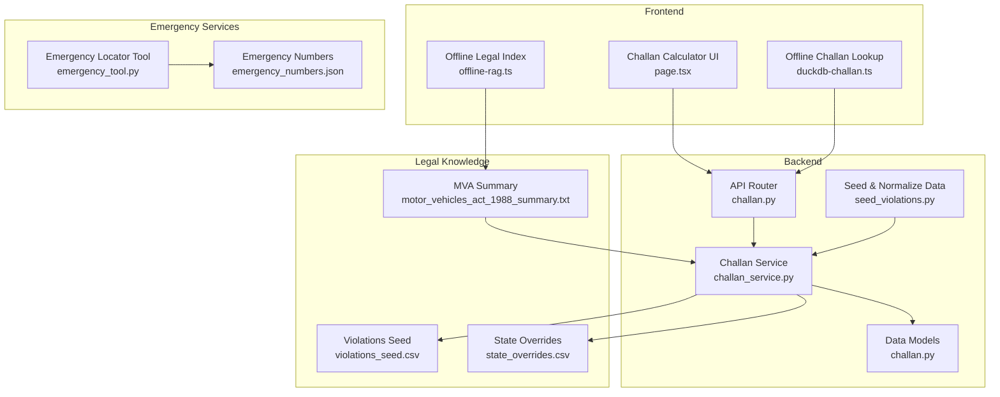
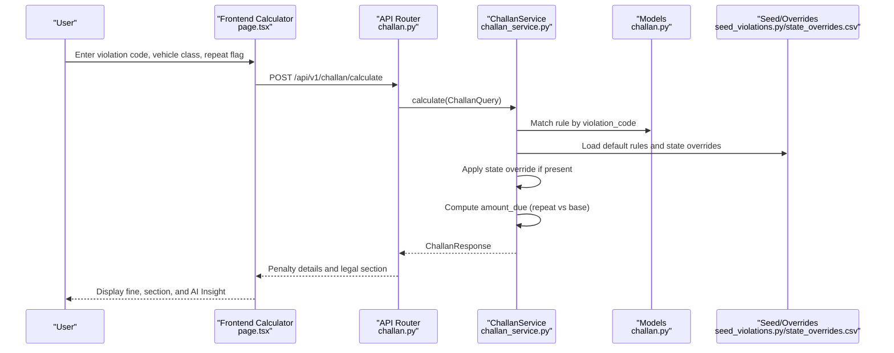
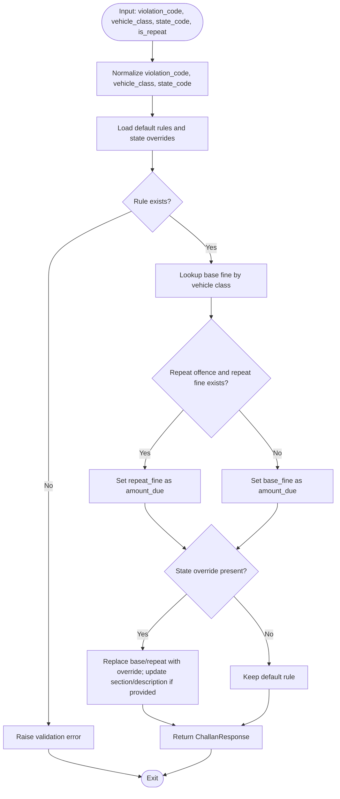
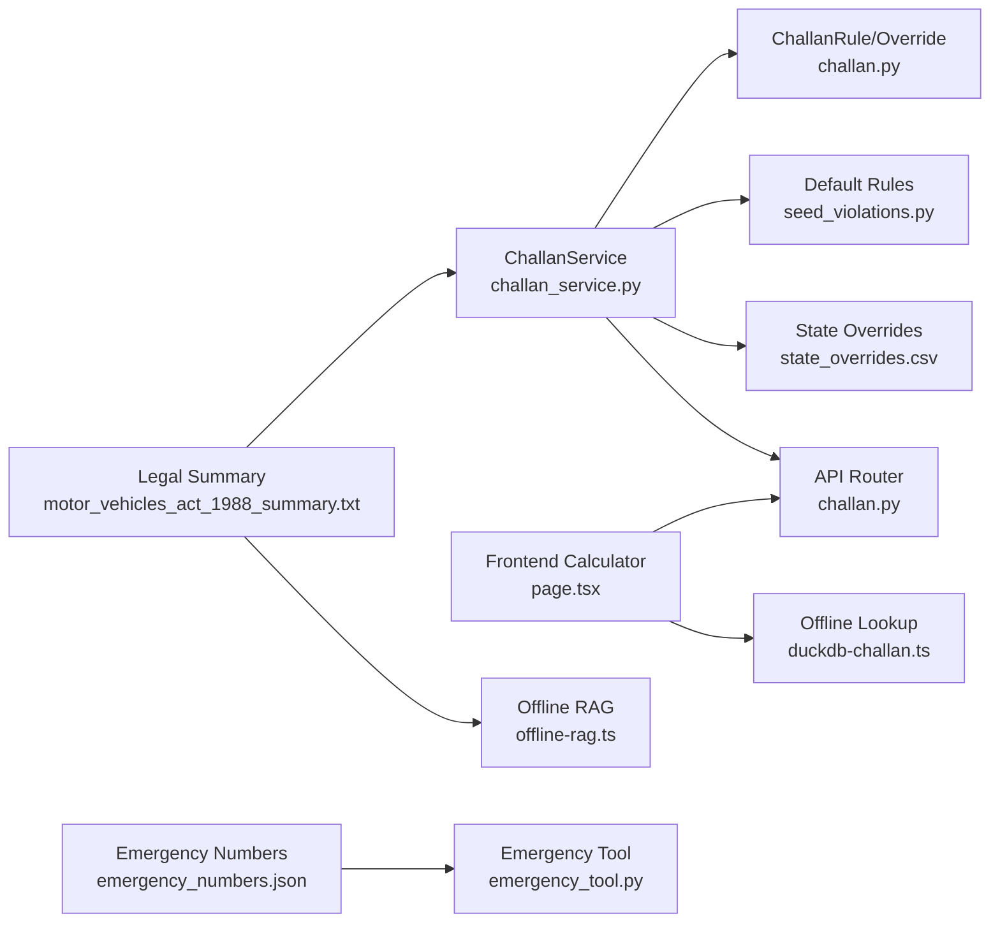

# Legal Framework Integration

<cite>
**Referenced Files in This Document**
- [challan.py](file://backend/api/v1/challan.py)
- [challan_service.py](file://backend/services/challan_service.py)
- [challan.py](file://backend/models/challan.py)
- [seed_violations.py](file://backend/scripts/data/seed_violations.py)
- [violations_seed.csv](file://chatbot_service/data/violations_seed.csv)
- [state_overrides.csv](file://chatbot_service/data/state_overrides.csv)
- [motor_vehicles_act_1988_summary.txt](file://chatbot_service/data/legal/motor_vehicles_act_1988_summary.txt)
- [duckdb-challan.ts](file://frontend/lib/duckdb-challan.ts)
- [page.tsx](file://frontend/app/challan/page.tsx)
- [challan_tool.py](file://chatbot_service/tools/challan_tool.py)
- [legal_search_tool.py](file://chatbot_service/tools/legal_search_tool.py)
- [emergency_numbers.json](file://chatbot_service/data/emergency_numbers.json)
- [emergency_tool.py](file://chatbot_service/tools/emergency_tool.py)
- [offline-rag.ts](file://frontend/lib/offline-rag.ts)
- [Database.md](file://docs/Database.md)
</cite>

## Table of Contents
1. [Introduction](#introduction)
2. [Project Structure](#project-structure)
3. [Core Components](#core-components)
4. [Architecture Overview](#architecture-overview)
5. [Detailed Component Analysis](#detailed-component-analysis)
6. [Dependency Analysis](#dependency-analysis)
7. [Performance Considerations](#performance-considerations)
8. [Troubleshooting Guide](#troubleshooting-guide)
9. [Conclusion](#conclusion)

## Introduction
This document details the legal framework integration for Motor Vehicle Act 2019 compliance and traffic violation categorization. It documents the comprehensive violation database, mapping of violations to legal sections (§112/183, §179, §185, §181, and §129/194D), state-specific legal variations, penalty calculation algorithms, compliance verification, and integration with emergency services and AI-driven tactical insights.

## Project Structure
The legal framework spans backend services, frontend calculators, chatbot legal search, and offline RAG capabilities:
- Backend API and service orchestrate violation classification, state overrides, and deterministic penalty calculations.
- Frontend provides an offline-capable challan calculator and displays AI tactical insights.
- Chatbot legal search retrieves precise legal citations from the Motor Vehicles Act and state-specific notifications.
- Emergency services integration provides immediate legal assistance channels.

**Diagram sources**
- [challan.py:10-26](file://backend/api/v1/challan.py#L10-L26)
- [challan_service.py:96-150](file://backend/services/challan_service.py#L96-L150)
- [challan.py:6-53](file://backend/models/challan.py#L6-L53)
- [seed_violations.py:43-106](file://backend/scripts/data/seed_violations.py#L43-L106)
- [violations_seed.csv:1-30](file://chatbot_service/data/violations_seed.csv#L1-L30)
- [state_overrides.csv:1-14](file://chatbot_service/data/state_overrides.csv#L1-L14)
- [motor_vehicles_act_1988_summary.txt:224-390](file://chatbot_service/data/legal/motor_vehicles_act_1988_summary.txt#L224-L390)
- [duckdb-challan.ts:20-50](file://frontend/lib/duckdb-challan.ts#L20-L50)
- [page.tsx:301-319](file://frontend/app/challan/page.tsx#L301-L319)
- [emergency_tool.py:6-15](file://chatbot_service/tools/emergency_tool.py#L6-L15)
- [emergency_numbers.json:1-70](file://chatbot_service/data/emergency_numbers.json#L1-L70)
- [offline-rag.ts:6-34](file://frontend/lib/offline-rag.ts#L6-L34)

**Section sources**
- [challan.py:10-26](file://backend/api/v1/challan.py#L10-L26)
- [challan_service.py:96-150](file://backend/services/challan_service.py#L96-L150)
- [challan.py:6-53](file://backend/models/challan.py#L6-L53)
- [seed_violations.py:43-106](file://backend/scripts/data/seed_violations.py#L43-L106)
- [violations_seed.csv:1-30](file://chatbot_service/data/violations_seed.csv#L1-L30)
- [state_overrides.csv:1-14](file://chatbot_service/data/state_overrides.csv#L1-L14)
- [motor_vehicles_act_1988_summary.txt:224-390](file://chatbot_service/data/legal/motor_vehicles_act_1988_summary.txt#L224-L390)
- [duckdb-challan.ts:20-50](file://frontend/lib/duckdb-challan.ts#L20-L50)
- [page.tsx:301-319](file://frontend/app/challan/page.tsx#L301-L319)
- [emergency_tool.py:6-15](file://chatbot_service/tools/emergency_tool.py#L6-L15)
- [emergency_numbers.json:1-70](file://chatbot_service/data/emergency_numbers.json#L1-L70)
- [offline-rag.ts:6-34](file://frontend/lib/offline-rag.ts#L6-L34)

## Core Components
- Violation database model: Centralized representation of violation codes, legal sections, descriptions, and base/repeat fines.
- State-specific overrides: Mechanism to apply state-level modifications to national defaults.
- Penalty calculation service: Normalizes inputs, selects appropriate rule, applies state overrides, and computes final amount due.
- Legal knowledge base: Structured summary of the Motor Vehicles Act and state-specific notifications for RAG retrieval.
- Emergency services integration: Unified access to national and state-specific emergency numbers and nearby service discovery.

Key implementation references:
- Data models for rules and overrides
  - [ChallanRule:6-32](file://backend/models/challan.py#L6-L32)
  - [StateChallanOverride:34-53](file://backend/models/challan.py#L34-L53)
- Service logic for calculation and overrides
  - [ChallanService.calculate:103-149](file://backend/services/challan_service.py#L103-L149)
  - [ChallanService._find_override:246-260](file://backend/services/challan_service.py#L246-L260)
- Seed and normalization of violations
  - [DEFAULT_RULES:43-106](file://backend/scripts/data/seed_violations.py#L43-L106)
  - [State overrides mapping:1-14](file://chatbot_service/data/state_overrides.csv#L1-L14)
- Legal citations and summaries
  - [MVA 1988 summary:224-390](file://chatbot_service/data/legal/motor_vehicles_act_1988_summary.txt#L224-L390)
- Frontend offline calculator and AI insight
  - [Offline lookup:20-50](file://frontend/lib/duckdb-challan.ts#L20-L50)
  - [AI Insight footer:301-312](file://frontend/app/challan/page.tsx#L301-L312)

**Section sources**
- [challan.py:6-53](file://backend/models/challan.py#L6-L53)
- [challan_service.py:96-150](file://backend/services/challan_service.py#L96-L150)
- [seed_violations.py:43-106](file://backend/scripts/data/seed_violations.py#L43-L106)
- [state_overrides.csv:1-14](file://chatbot_service/data/state_overrides.csv#L1-L14)
- [motor_vehicles_act_1988_summary.txt:224-390](file://chatbot_service/data/legal/motor_vehicles_act_1988_summary.txt#L224-L390)
- [duckdb-challan.ts:20-50](file://frontend/lib/duckdb-challan.ts#L20-L50)
- [page.tsx:301-312](file://frontend/app/challan/page.tsx#L301-L312)

## Architecture Overview
The system integrates legal compliance verification with state-specific enforcement and deterministic penalty calculation. Inputs include violation code, vehicle class, repeat status, and state. Outputs include base/repeat fines, legal section, description, and state override notes.

**Diagram sources**
- [challan.py:17-26](file://backend/api/v1/challan.py#L17-L26)
- [challan_service.py:103-149](file://backend/services/challan_service.py#L103-L149)
- [challan.py:6-53](file://backend/models/challan.py#L6-L53)
- [seed_violations.py:43-106](file://backend/scripts/data/seed_violations.py#L43-L106)
- [state_overrides.csv:1-14](file://chatbot_service/data/state_overrides.csv#L1-L14)
- [page.tsx:301-312](file://frontend/app/challan/page.tsx#L301-L312)

## Detailed Component Analysis

### Violation Database and Legal Sections
The system catalogs violations aligned with the Motor Vehicles Act, 2019, and state-specific modifications. The primary sections covered include:
- §112/183: Overspeeding (with aliases mapping to 112/183)
- §179: Disobedience of lawful directions
- §185: Driving under the influence (DUI)
- §181: Driving without a valid licence
- §129/194D: Failure to wear protective headgear (including pillion riders)

Legal descriptions and penalties are derived from:
- Central Motor Vehicles Act 2019 summary
- State-specific overrides (e.g., Tamil Nadu, Delhi, Karnataka, Kerala, Maharashtra, Gujarat, Andhra Pradesh, Telangana, West Bengal, Uttar Pradesh)

Representative mappings:
- [MVA summary sections:224-390](file://chatbot_service/data/legal/motor_vehicles_act_1988_summary.txt#L224-L390)
- [State overrides:1-14](file://chatbot_service/data/state_overrides.csv#L1-L14)

**Section sources**
- [motor_vehicles_act_1988_summary.txt:224-390](file://chatbot_service/data/legal/motor_vehicles_act_1988_summary.txt#L224-L390)
- [state_overrides.csv:1-14](file://chatbot_service/data/state_overrides.csv#L1-L14)

### State-Specific Legal Variations
State overrides enable localized enforcement by modifying base/repeat fines and adding legal section/description notes. The system supports:
- State code normalization (e.g., TN, DL, KA, KL, MH, GJ, AP, TS, WB, UP)
- Optional vehicle-class scoping for overrides
- Notes linking to authoritative sources and effective dates

Key references:
- [State overrides loader:209-238](file://backend/services/challan_service.py#L209-L238)
- [State overrides CSV schema:1-14](file://chatbot_service/data/state_overrides.csv#L1-L14)
- [Normalization helpers:300-313](file://backend/services/challan_service.py#L300-L313)

**Section sources**
- [challan_service.py:209-238](file://backend/services/challan_service.py#L209-L238)
- [state_overrides.csv:1-14](file://chatbot_service/data/state_overrides.csv#L1-L14)
- [challan_service.py:300-313](file://backend/services/challan_service.py#L300-L313)

### Penalty Calculation Algorithms
The penalty calculation is deterministic and considers:
- Violation code matching (including aliases)
- Vehicle class normalization
- Repeat offence flag
- State override precedence over defaults

Algorithm flow:

**Diagram sources**
- [challan_service.py:103-149](file://backend/services/challan_service.py#L103-L149)
- [challan.py:6-53](file://backend/models/challan.py#L6-L53)

Implementation highlights:
- [Default rules and aliases:30-93](file://backend/services/challan_service.py#L30-L93)
- [Override resolution:119-136](file://backend/services/challan_service.py#L119-L136)
- [Vehicle class normalization:294-298](file://backend/services/challan_service.py#L294-L298)
- [State code normalization:300-313](file://backend/services/challan_service.py#L300-L313)

**Section sources**
- [challan_service.py:103-149](file://backend/services/challan_service.py#L103-L149)
- [challan.py:6-53](file://backend/models/challan.py#L6-L53)

### Legal Compliance Verification Process
To ensure adherence to current MVA regulations:
- Central Act and 2019 Amendment text are indexed for RAG retrieval.
- State-specific overrides are stored with authority, effective date, and source URL for traceability.
- Seed scripts merge default rules with state overrides and write normalized CSVs consumed by the service.

Verification references:
- [Legal summary indexing:1-391](file://chatbot_service/data/legal/motor_vehicles_act_1988_summary.txt#L1-L391)
- [State overrides schema:72-83](file://docs/Database.md#L72-L83)
- [Seed normalization:419-482](file://backend/scripts/data/seed_violations.py#L419-L482)

**Section sources**
- [motor_vehicles_act_1988_summary.txt:1-391](file://chatbot_service/data/legal/motor_vehicles_act_1988_summary.txt#L1-L391)
- [Database.md:72-83](file://docs/Database.md#L72-L83)
- [seed_violations.py:419-482](file://backend/scripts/data/seed_violations.py#L419-L482)

### Integration with Emergency Services and AI Tactical Insights
- Emergency services integration provides unified access to national and state-specific emergency numbers and nearby service discovery.
- AI tactical insights are surfaced in the frontend to guide users on high-risk offences and disqualification protocols.

References:
- [Emergency numbers catalog:1-70](file://chatbot_service/data/emergency_numbers.json#L1-L70)
- [Emergency locator tool:6-15](file://chatbot_service/tools/emergency_tool.py#L6-L15)
- [AI Insight footer:301-312](file://frontend/app/challan/page.tsx#L301-L312)
- [Offline legal index:6-34](file://frontend/lib/offline-rag.ts#L6-L34)

**Section sources**
- [emergency_numbers.json:1-70](file://chatbot_service/data/emergency_numbers.json#L1-L70)
- [emergency_tool.py:6-15](file://chatbot_service/tools/emergency_tool.py#L6-L15)
- [page.tsx:301-312](file://frontend/app/challan/page.tsx#L301-L312)
- [offline-rag.ts:6-34](file://frontend/lib/offline-rag.ts#L6-L34)

## Dependency Analysis
The legal framework relies on:
- Backend models and service for rule matching and state overrides
- CSV datasets for default rules and state overrides
- Legal summary for RAG retrieval
- Frontend offline calculator and AI insights
- Emergency tools and numbers for immediate assistance

**Diagram sources**
- [challan_service.py:96-150](file://backend/services/challan_service.py#L96-L150)
- [challan.py:6-53](file://backend/models/challan.py#L6-L53)
- [seed_violations.py:43-106](file://backend/scripts/data/seed_violations.py#L43-L106)
- [state_overrides.csv:1-14](file://chatbot_service/data/state_overrides.csv#L1-L14)
- [challan.py:10-26](file://backend/api/v1/challan.py#L10-L26)
- [page.tsx:301-312](file://frontend/app/challan/page.tsx#L301-L312)
- [duckdb-challan.ts:20-50](file://frontend/lib/duckdb-challan.ts#L20-L50)
- [motor_vehicles_act_1988_summary.txt:224-390](file://chatbot_service/data/legal/motor_vehicles_act_1988_summary.txt#L224-L390)
- [offline-rag.ts:6-34](file://frontend/lib/offline-rag.ts#L6-L34)
- [emergency_numbers.json:1-70](file://chatbot_service/data/emergency_numbers.json#L1-L70)
- [emergency_tool.py:6-15](file://chatbot_service/tools/emergency_tool.py#L6-L15)

**Section sources**
- [challan_service.py:96-150](file://backend/services/challan_service.py#L96-L150)
- [challan.py:6-53](file://backend/models/challan.py#L6-L53)
- [seed_violations.py:43-106](file://backend/scripts/data/seed_violations.py#L43-L106)
- [state_overrides.csv:1-14](file://chatbot_service/data/state_overrides.csv#L1-L14)
- [challan.py:10-26](file://backend/api/v1/challan.py#L10-L26)
- [page.tsx:301-312](file://frontend/app/challan/page.tsx#L301-L312)
- [duckdb-challan.ts:20-50](file://frontend/lib/duckdb-challan.ts#L20-L50)
- [motor_vehicles_act_1988_summary.txt:224-390](file://chatbot_service/data/legal/motor_vehicles_act_1988_summary.txt#L224-L390)
- [offline-rag.ts:6-34](file://frontend/lib/offline-rag.ts#L6-L34)
- [emergency_numbers.json:1-70](file://chatbot_service/data/emergency_numbers.json#L1-L70)
- [emergency_tool.py:6-15](file://chatbot_service/tools/emergency_tool.py#L6-L15)

## Performance Considerations
- Deterministic calculations avoid LLM overhead and ensure reproducible outcomes.
- State overrides are loaded once and matched via linear scan; consider indexing for large datasets.
- Frontend offline calculator simulates fast responses for remote scenarios.
- Legal RAG uses lightweight keyword matching for demos; production can leverage vector similarity.

[No sources needed since this section provides general guidance]

## Troubleshooting Guide
Common issues and resolutions:
- Unsupported violation code: Ensure the code matches defaults or aliases; see [DEFAULT_RULES:30-93](file://backend/services/challan_service.py#L30-L93).
- Missing vehicle class: Validation raises errors for empty values; see [vehicle normalization:294-298](file://backend/services/challan_service.py#L294-L298).
- Invalid state code: Normalize state codes to two-letter codes; see [state normalization:300-313](file://backend/services/challan_service.py#L300-L313).
- Missing state override: Overrides are optional; defaults apply when not found; see [override loading:209-238](file://backend/services/challan_service.py#L209-L238).
- Legal citation retrieval: Verify legal summary indexing and RAG scope; see [legal summary:1-391](file://chatbot_service/data/legal/motor_vehicles_act_1988_summary.txt#L1-L391).

**Section sources**
- [challan_service.py:30-93](file://backend/services/challan_service.py#L30-L93)
- [challan_service.py:294-298](file://backend/services/challan_service.py#L294-L298)
- [challan_service.py:300-313](file://backend/services/challan_service.py#L300-L313)
- [challan_service.py:209-238](file://backend/services/challan_service.py#L209-L238)
- [motor_vehicles_act_1988_summary.txt:1-391](file://chatbot_service/data/legal/motor_vehicles_act_1988_summary.txt#L1-L391)

## Conclusion
The legal framework integration ensures MVA 2019 compliance by combining deterministic penalty calculations, state-specific overrides, and legal citations. Emergency services integration and AI tactical insights further enhance user safety and informed decision-making. The modular architecture supports scalability, traceability, and offline resilience.

[No sources needed since this section summarizes without analyzing specific files]