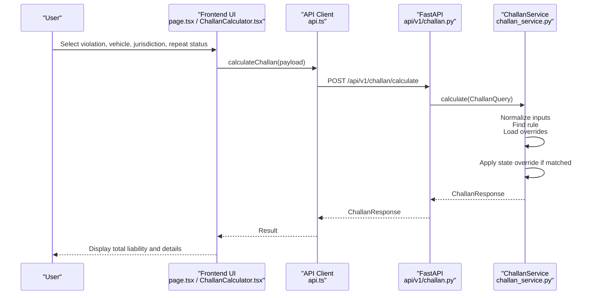
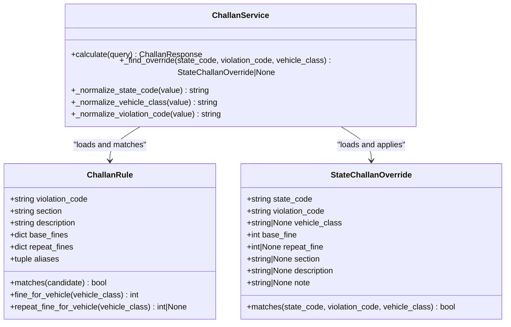
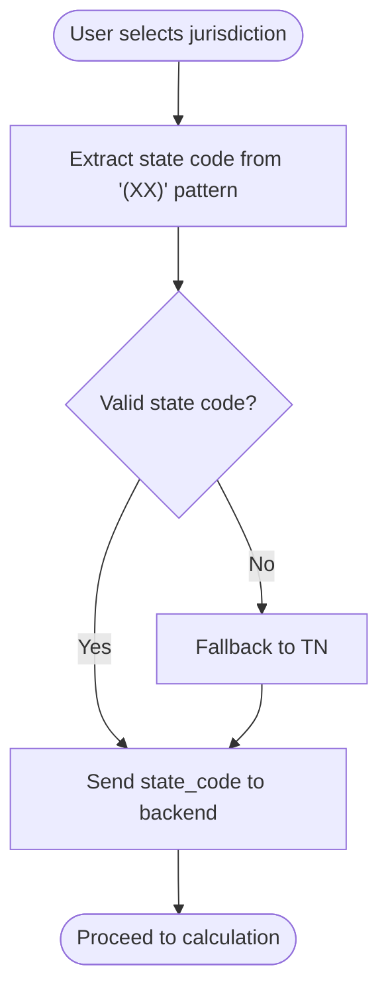
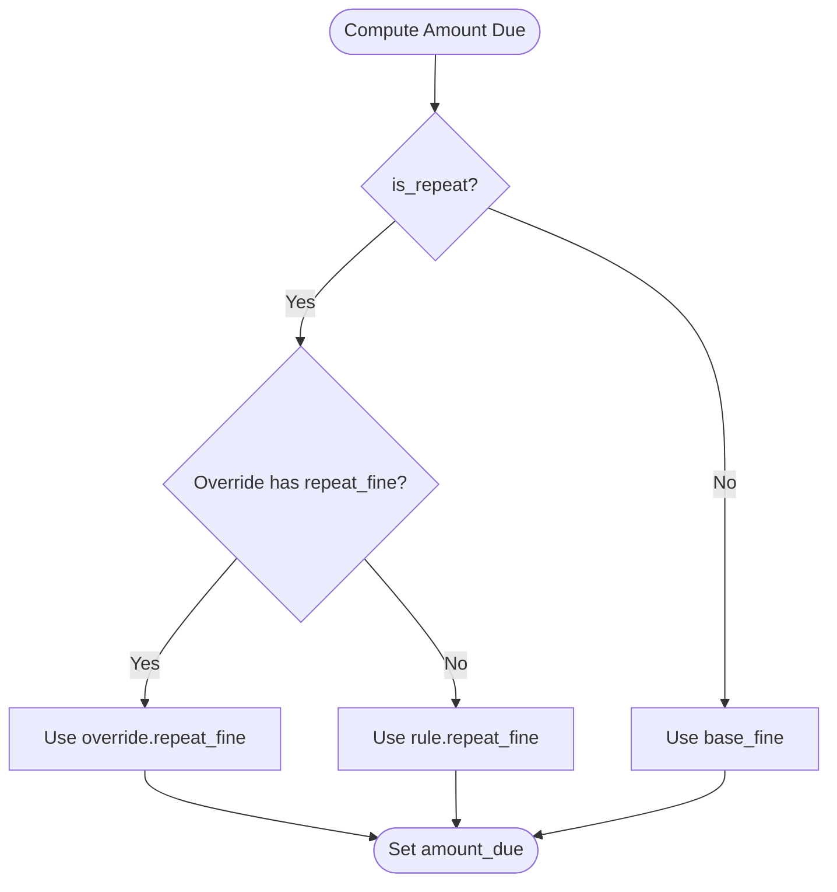
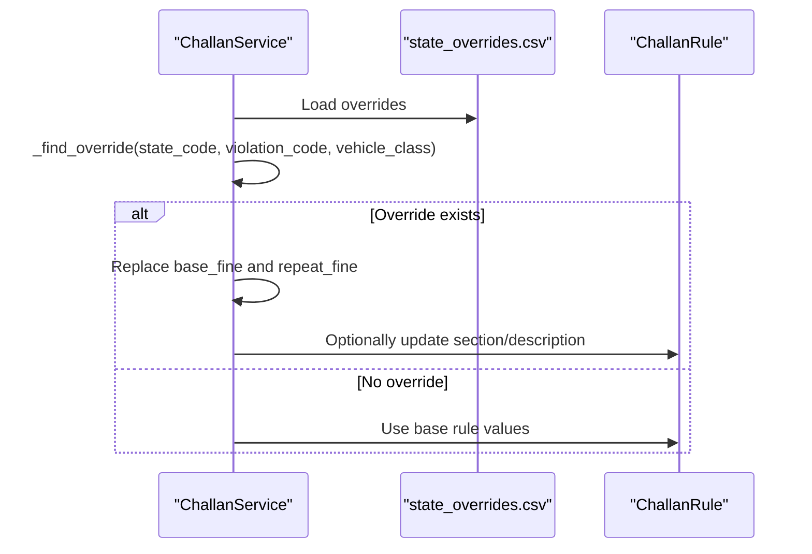
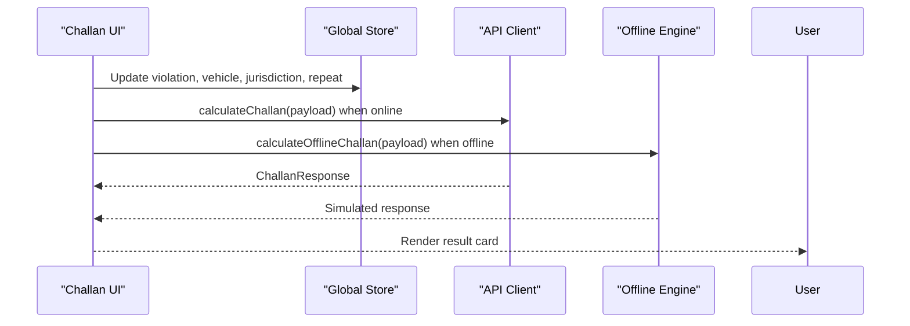
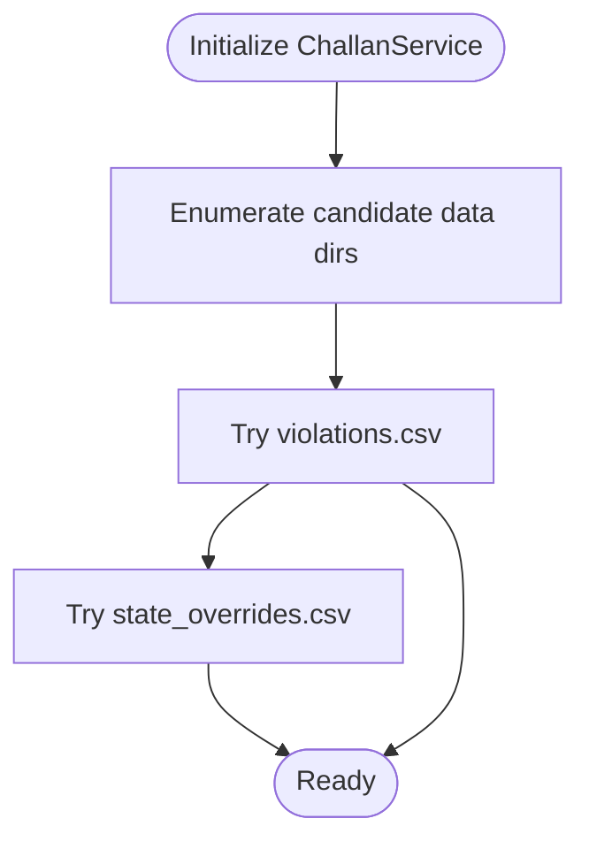
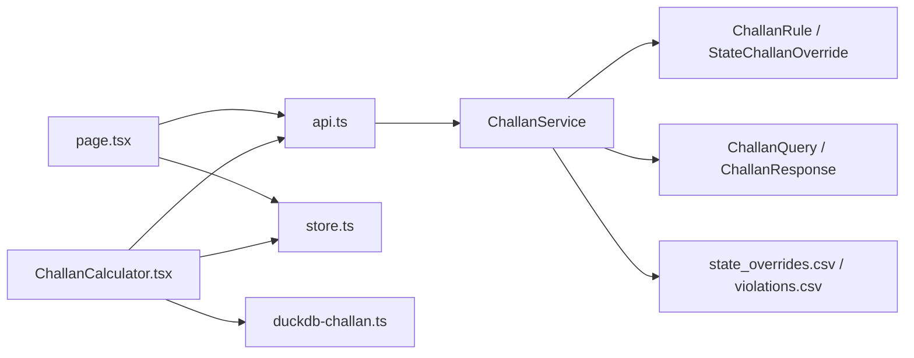

# State-Specific Calculations

<cite>
**Referenced Files in This Document**
- [challan.py](file://backend/api/v1/challan.py)
- [challan_service.py](file://backend/services/challan_service.py)
- [challan.py](file://backend/models/challan.py)
- [schemas.py](file://backend/models/schemas.py)
- [challan.py](file://frontend/app/challan/page.tsx)
- [ChallanCalculator.tsx](file://frontend/components/ChallanCalculator.tsx)
- [api.ts](file://frontend/lib/api.ts)
- [duckdb-challan.ts](file://frontend/lib/duckdb-challan.ts)
- [state_overrides.csv](file://chatbot_service/data/state_overrides.csv)
- [state_overrides.csv](file://frontend/public/offline-data/state_overrides.csv)
- [violations.csv](file://frontend/public/offline-data/violations.csv)
- [store.ts](file://frontend/lib/store.ts)
</cite>

## Table of Contents
1. [Introduction](#introduction)
2. [Project Structure](#project-structure)
3. [Core Components](#core-components)
4. [Architecture Overview](#architecture-overview)
5. [Detailed Component Analysis](#detailed-component-analysis)
6. [Dependency Analysis](#dependency-analysis)
7. [Performance Considerations](#performance-considerations)
8. [Troubleshooting Guide](#troubleshooting-guide)
9. [Conclusion](#conclusion)

## Introduction
This document explains the state-specific calculation mechanisms powering the Challan Calculator across 25 major Indian states. It covers:
- How state overrides modify base penalties and repeat offender fines
- The jurisdiction selection interface and state code normalization
- Repeat offender penalties that vary by state and offense
- Backend service implementation and frontend dynamic adjustments
- Maintaining accurate state-specific data and fallback mechanisms

## Project Structure
The Challan Calculator spans backend and frontend layers:
- Backend: FastAPI endpoint, service layer, models, and CSV-driven rule loading
- Frontend: Interactive calculator UI, jurisdiction selection, and offline fallback
- Shared datasets: Online and offline CSVs for violations and state overrides

```mermaid
graph TB
subgraph "Frontend"
FE_UI["Challan UI<br/>page.tsx / ChallanCalculator.tsx"]
FE_API["API Client<br/>api.ts"]
FE_OFFLINE["Offline Engine<br/>duckdb-challan.ts"]
FE_STORE["Global Store<br/>store.ts"]
end
subgraph "Backend"
BE_API["FastAPI Endpoint<br/>api/v1/challan.py"]
BE_SERVICE["ChallanService<br/>challan_service.py"]
BE_MODELS["Models<br/>models/challan.py"]
BE_SCHEMAS["Pydantic Schemas<br/>models/schemas.py"]
end
subgraph "Data"
DATA_ONLINE["Online CSVs<br/>state_overrides.csv<br/>violations.csv"]
DATA_OFFLINE["Offline CSVs<br/>public/offline-data/*"]
end
FE_UI --> FE_API
FE_API --> BE_API
BE_API --> BE_SERVICE
BE_SERVICE --> BE_MODELS
BE_SERVICE --> BE_SCHEMAS
BE_SERVICE <- --> DATA_ONLINE
FE_UI <- --> DATA_OFFLINE
FE_OFFLINE --> DATA_OFFLINE
FE_STORE -.-> FE_UI
```

**Diagram sources**
- [challan.py:17-26](file://backend/api/v1/challan.py#L17-L26)
- [challan_service.py:96-150](file://backend/services/challan_service.py#L96-L150)
- [challan.py:6-53](file://backend/models/challan.py#L6-L53)
- [schemas.py:240-257](file://backend/models/schemas.py#L240-L257)
- [challan.py:45-80](file://frontend/app/challan/page.tsx#L45-L80)
- [ChallanCalculator.tsx:13-62](file://frontend/components/ChallanCalculator.tsx#L13-L62)
- [api.ts:1-50](file://frontend/lib/api.ts#L1-L50)
- [duckdb-challan.ts:20-50](file://frontend/lib/duckdb-challan.ts#L20-L50)
- [state_overrides.csv:1-14](file://chatbot_service/data/state_overrides.csv#L1-L14)
- [state_overrides.csv:1-14](file://frontend/public/offline-data/state_overrides.csv#L1-L14)
- [violations.csv:1-27](file://frontend/public/offline-data/violations.csv#L1-L27)

**Section sources**
- [challan.py:10-26](file://backend/api/v1/challan.py#L10-L26)
- [challan_service.py:96-150](file://backend/services/challan_service.py#L96-L150)
- [challan.py:20-36](file://frontend/app/challan/page.tsx#L20-L36)
- [ChallanCalculator.tsx:13-62](file://frontend/components/ChallanCalculator.tsx#L13-L62)

## Core Components
- Backend ChallanService: Loads base rules and state overrides from CSVs, normalizes inputs, computes penalties, and applies state-specific modifications.
- Models: Immutable dataclasses representing base rules and state overrides.
- Pydantic Schemas: Request/response contracts for the calculator API.
- Frontend UI: Interactive calculator with jurisdiction selection, repeat-offender toggle, and online/offline modes.

Key responsibilities:
- Normalize violation codes, vehicle classes, and state codes
- Match rules and apply state overrides
- Compute base and repeat fines, with optional override metadata
- Provide offline fallback via DuckDB simulation

**Section sources**
- [challan_service.py:96-150](file://backend/services/challan_service.py#L96-L150)
- [challan.py:6-53](file://backend/models/challan.py#L6-L53)
- [schemas.py:240-257](file://backend/models/schemas.py#L240-L257)
- [challan.py:45-80](file://frontend/app/challan/page.tsx#L45-L80)
- [ChallanCalculator.tsx:13-62](file://frontend/components/ChallanCalculator.tsx#L13-L62)

## Architecture Overview
The system integrates frontend user inputs with backend computation and dataset loading.



**Diagram sources**
- [challan.py:71-80](file://frontend/app/challan/page.tsx#L71-L80)
- [ChallanCalculator.tsx:32-62](file://frontend/components/ChallanCalculator.tsx#L32-L62)
- [api.ts:1-50](file://frontend/lib/api.ts#L1-L50)
- [challan.py:17-26](file://backend/api/v1/challan.py#L17-L26)
- [challan_service.py:103-149](file://backend/services/challan_service.py#L103-L149)

## Detailed Component Analysis

### Backend Service: ChallanService
Responsibilities:
- Load base rules and state overrides from multiple locations
- Normalize violation codes, vehicle classes, and state codes
- Find matching rule and apply state override
- Compute final amount due based on repeat status

State override matching:
- Matches by state_code, violation_code, and optional vehicle_class
- Supports wildcard “default” vehicle class when vehicle_class is None or empty
- Override note and metadata can update rule description/section



**Diagram sources**
- [challan.py:6-53](file://backend/models/challan.py#L6-L53)
- [challan_service.py:96-150](file://backend/services/challan_service.py#L96-L150)
- [challan_service.py:246-260](file://backend/services/challan_service.py#L246-L260)

**Section sources**
- [challan_service.py:96-150](file://backend/services/challan_service.py#L96-L150)
- [challan.py:6-53](file://backend/models/challan.py#L6-L53)

### Jurisdiction Selection and State Codes
Frontend jurisdiction selection supports six states/UTs with codes TN, DL, MH, KA, UP, WB. The page extracts the state code from the selected jurisdiction string and passes it to the backend.



**Diagram sources**
- [challan.py:20-27](file://frontend/app/challan/page.tsx#L20-L27)
- [challan.py:62-63](file://frontend/app/challan/page.tsx#L62-L63)
- [challan.py:71-80](file://frontend/app/challan/page.tsx#L71-L80)

**Section sources**
- [challan.py:20-36](file://frontend/app/challan/page.tsx#L20-L36)
- [challan.py:62-63](file://frontend/app/challan/page.tsx#L62-L63)
- [challan.py:71-80](file://frontend/app/challan/page.tsx#L71-L80)

### Repeat Offender Penalties
Repeat penalties are derived from the matched rule’s repeat_fines. If a state override defines repeat_fine, it takes precedence; otherwise, the rule’s repeat_fine is used. If repeat is false, base_fine is used regardless.



**Diagram sources**
- [challan_service.py:138-149](file://backend/services/challan_service.py#L138-L149)

**Section sources**
- [challan_service.py:138-149](file://backend/services/challan_service.py#L138-L149)

### State-Specific Legal Variations and Overrides
State overrides are loaded from CSV files and applied when state_code, violation_code, and vehicle_class match. Examples include:
- TN: Helmet/headgear violations with higher base fine
- MH: Enhanced speeding fine in Mumbai Metropolitan Region
- DL: Emergency vehicle obstruction fine
- KA/KL/GJ/AP/TS/WB/UP: Standardized compounding rates aligned with central MV Amendment 2019



**Diagram sources**
- [challan_service.py:103-149](file://backend/services/challan_service.py#L103-L149)
- [challan_service.py:209-238](file://backend/services/challan_service.py#L209-L238)
- [state_overrides.csv:1-14](file://chatbot_service/data/state_overrides.csv#L1-L14)
- [state_overrides.csv:1-14](file://frontend/public/offline-data/state_overrides.csv#L1-L14)

**Section sources**
- [challan_service.py:103-149](file://backend/services/challan_service.py#L103-L149)
- [state_overrides.csv:1-14](file://chatbot_service/data/state_overrides.csv#L1-L14)
- [state_overrides.csv:1-14](file://frontend/public/offline-data/state_overrides.csv#L1-L14)

### Frontend Dynamic Adjustments
The frontend provides:
- Violation selector grid and vehicle class dropdown
- Jurisdiction selector with six states/UTs
- Repeat-offender toggle
- Online/offline calculation modes

Online mode calls the backend endpoint; offline mode simulates DuckDB lookup.



**Diagram sources**
- [ChallanCalculator.tsx:32-62](file://frontend/components/ChallanCalculator.tsx#L32-L62)
- [challan.py:71-80](file://frontend/app/challan/page.tsx#L71-L80)
- [duckdb-challan.ts:20-50](file://frontend/lib/duckdb-challan.ts#L20-L50)
- [store.ts:195-202](file://frontend/lib/store.ts#L195-L202)

**Section sources**
- [ChallanCalculator.tsx:13-62](file://frontend/components/ChallanCalculator.tsx#L13-L62)
- [challan.py:45-80](file://frontend/app/challan/page.tsx#L45-L80)
- [duckdb-challan.ts:20-50](file://frontend/lib/duckdb-challan.ts#L20-L50)
- [store.ts:195-202](file://frontend/lib/store.ts#L195-L202)

### Data Loading and Fallback Mechanisms
Backend loads data from three candidate directories:
- Application data directory
- Frontend public offline data
- Backend datasets

If a file is missing in one location, loading continues from others. Offline engine simulates DuckDB lookup when the app is offline.



**Diagram sources**
- [challan_service.py:151-166](file://backend/services/challan_service.py#L151-L166)
- [challan_service.py:168-208](file://backend/services/challan_service.py#L168-L208)
- [challan_service.py:209-238](file://backend/services/challan_service.py#L209-L238)

**Section sources**
- [challan_service.py:151-166](file://backend/services/challan_service.py#L151-L166)
- [challan_service.py:168-208](file://backend/services/challan_service.py#L168-L208)
- [challan_service.py:209-238](file://backend/services/challan_service.py#L209-L238)
- [duckdb-challan.ts:20-50](file://frontend/lib/duckdb-challan.ts#L20-L50)

## Dependency Analysis
- Backend depends on CSV datasets for base rules and state overrides
- Frontend depends on backend API for online mode and DuckDB simulation for offline mode
- Global store persists user selections across navigation



**Diagram sources**
- [challan_service.py:96-150](file://backend/services/challan_service.py#L96-L150)
- [challan.py:6-53](file://backend/models/challan.py#L6-L53)
- [schemas.py:240-257](file://backend/models/schemas.py#L240-L257)
- [challan.py:45-80](file://frontend/app/challan/page.tsx#L45-L80)
- [ChallanCalculator.tsx:13-62](file://frontend/components/ChallanCalculator.tsx#L13-L62)
- [api.ts:1-50](file://frontend/lib/api.ts#L1-L50)
- [store.ts:195-202](file://frontend/lib/store.ts#L195-L202)
- [duckdb-challan.ts:20-50](file://frontend/lib/duckdb-challan.ts#L20-L50)

**Section sources**
- [challan_service.py:96-150](file://backend/services/challan_service.py#L96-L150)
- [challan.py:45-80](file://frontend/app/challan/page.tsx#L45-L80)
- [ChallanCalculator.tsx:13-62](file://frontend/components/ChallanCalculator.tsx#L13-L62)
- [api.ts:1-50](file://frontend/lib/api.ts#L1-L50)
- [store.ts:195-202](file://frontend/lib/store.ts#L195-L202)
- [duckdb-challan.ts:20-50](file://frontend/lib/duckdb-challan.ts#L20-L50)

## Performance Considerations
- CSV parsing and matching are linear in the number of rules and overrides; keep datasets lean and normalized
- Use caching or preloading for frequently accessed jurisdictions
- Normalize state codes early to reduce repeated regex work
- Prefer default vehicle class entries to minimize per-vehicle overrides

## Troubleshooting Guide
Common issues and resolutions:
- Unsupported violation code: Ensure the code exists in base rules or CSVs; the service raises a validation error with known examples
- Missing state data: Verify presence in online or offline CSVs; fallback to defaults or base rule values
- Incorrect state code: The service normalizes codes and extracts codes from parentheses; confirm input format
- Repeat-offender mismatch: Confirm repeat_fine is defined in state override or base rule

Operational checks:
- Validate CSV headers and money fields
- Confirm vehicle class aliases align with frontend selections
- Test offline DuckDB simulation when network is unavailable

**Section sources**
- [challan_service.py:109-113](file://backend/services/challan_service.py#L109-L113)
- [challan_service.py:300-313](file://backend/services/challan_service.py#L300-L313)
- [duckdb-challan.ts:20-50](file://frontend/lib/duckdb-challan.ts#L20-L50)

## Conclusion
The Challan Calculator integrates robust state-specific logic with a clean frontend/backend separation. Base rules and repeat-offender penalties are augmented by state overrides, ensuring compliance with regional traffic laws. The system gracefully handles missing data through defaults and offline simulation, enabling reliable operation across diverse jurisdictions.