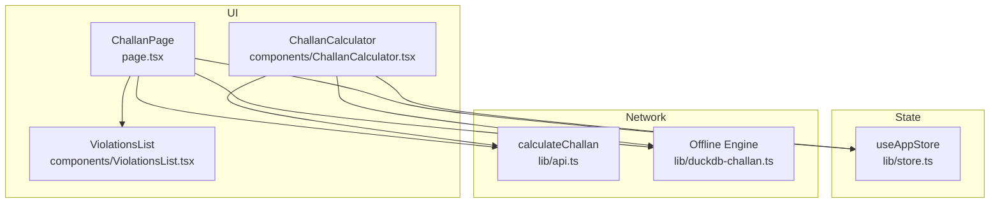
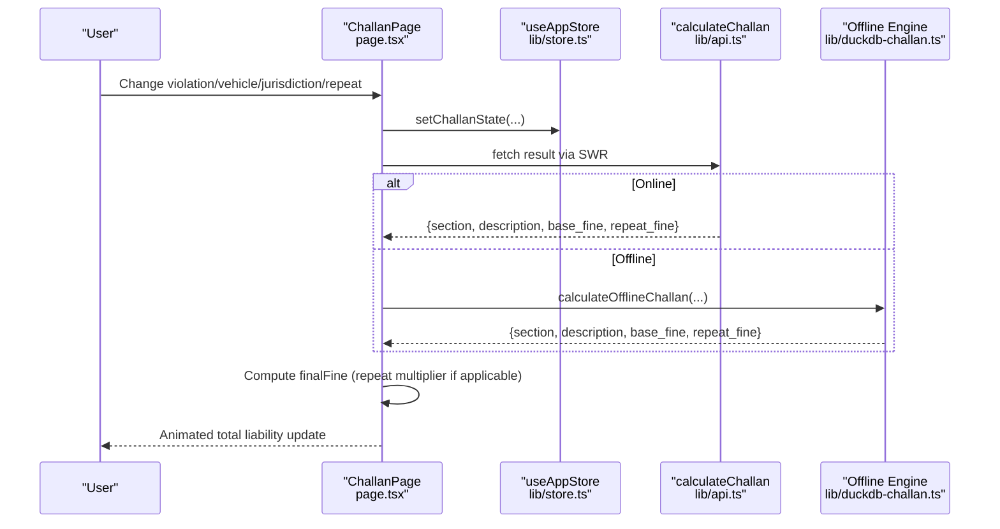
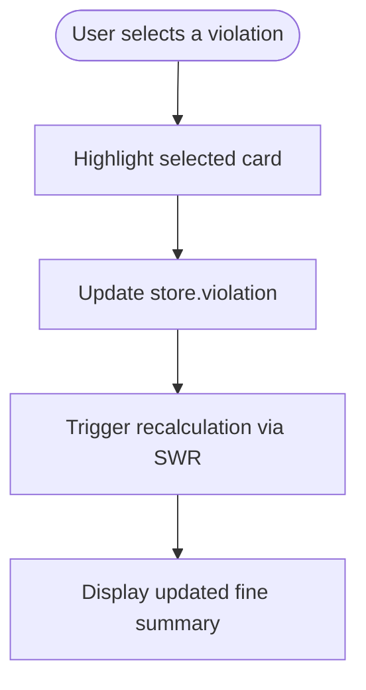
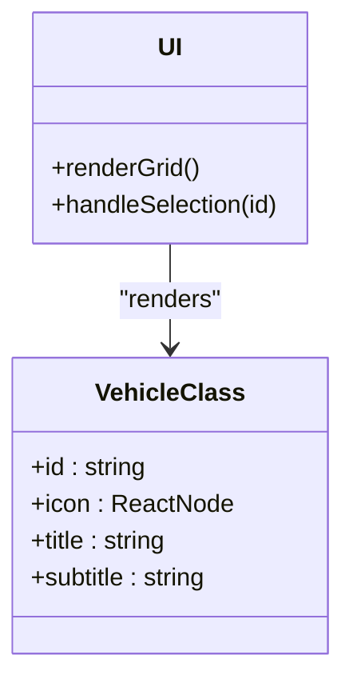
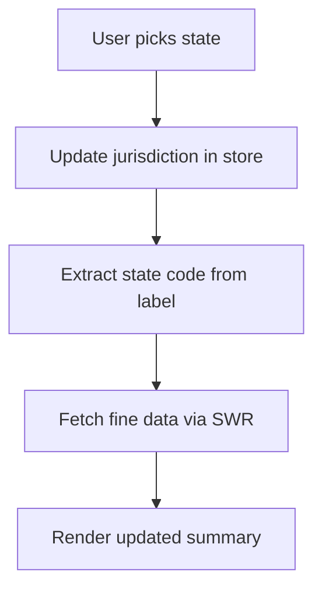
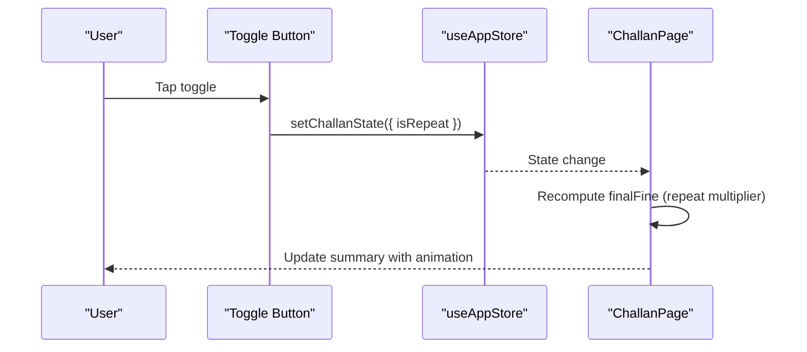
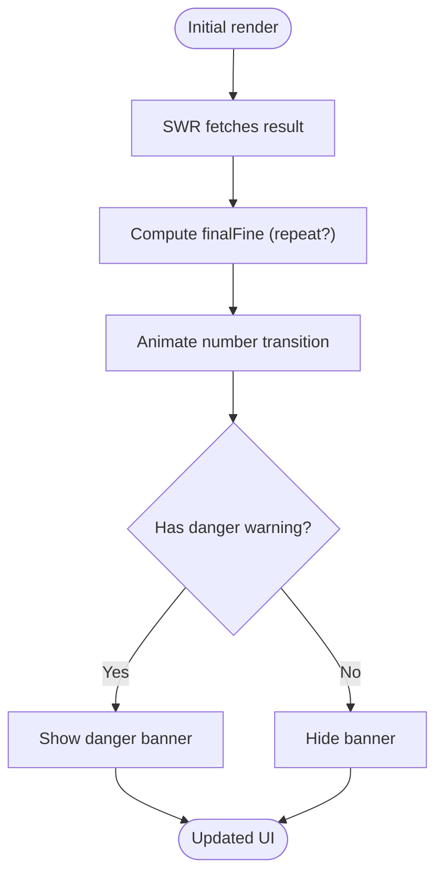
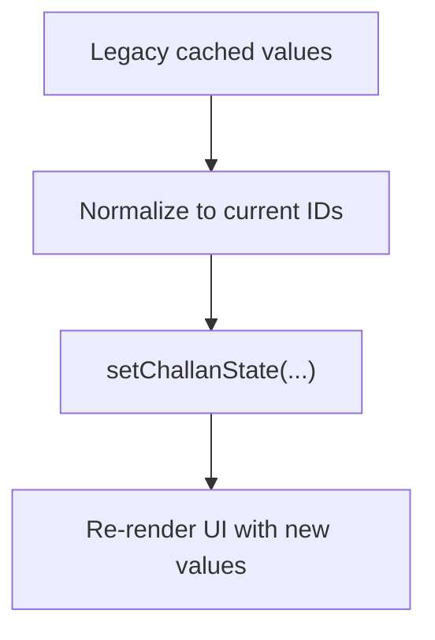
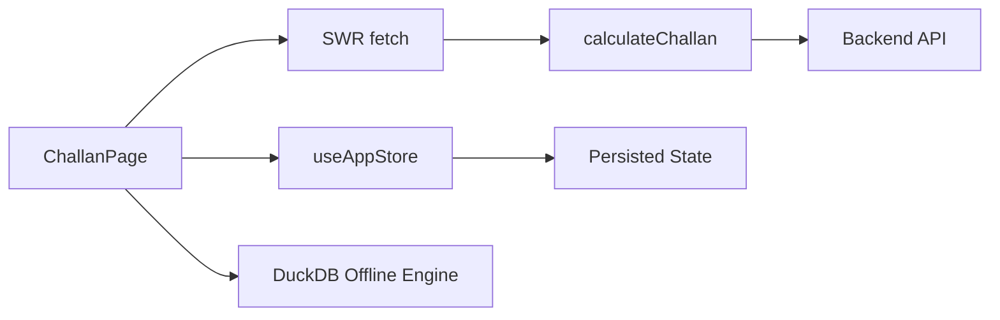

# User Interface and Interaction

<cite>
**Referenced Files in This Document**
- [ChallanPage](file://frontend/app/challan/page.tsx)
- [ChallanCalculator](file://frontend/components/ChallanCalculator.tsx)
- [store](file://frontend/lib/store.ts)
- [api](file://frontend/lib/api.ts)
- [duckdb-challan](file://frontend/lib/duckdb-challan.ts)
- [ViolationsList](file://frontend/components/ViolationsList.tsx)
- [UIUX](file://docs/UIUX.md)
- [globals.css](file://frontend/app/globals.css)
</cite>

## Table of Contents
1. [Introduction](#introduction)
2. [Project Structure](#project-structure)
3. [Core Components](#core-components)
4. [Architecture Overview](#architecture-overview)
5. [Detailed Component Analysis](#detailed-component-analysis)
6. [Dependency Analysis](#dependency-analysis)
7. [Performance Considerations](#performance-considerations)
8. [Troubleshooting Guide](#troubleshooting-guide)
9. [Conclusion](#conclusion)

## Introduction
This document describes the user interface and interaction design of the Challan Calculator, focusing on intuitive violation selection, vehicle classification, jurisdiction selection, repeat offender toggling, real-time fine calculation with animated transitions, detailed report affordances, and the AI tactical insight footer. It also documents state management via the shared store, backwards compatibility for cached values, responsive design adaptations, error handling, loading states, and accessibility features.

## Project Structure
The Challan Calculator is implemented as two complementary UI surfaces:
- A streamlined calculator component for quick selection and calculation
- A comprehensive page with a live summary panel, detailed inputs, and AI insights

Key files:
- [ChallanPage](file://frontend/app/challan/page.tsx): Full-featured page with live summary, inputs, and AI footer
- [ChallanCalculator](file://frontend/components/ChallanCalculator.tsx): Compact calculator with grid-based violation selection and result display
- [store](file://frontend/lib/store.ts): Shared Zustand store with persisted state for violation, vehicle class, jurisdiction, and repeat status
- [api](file://frontend/lib/api.ts): API client and calculateChallan endpoint
- [duckdb-challan](file://frontend/lib/duckdb-challan.ts): Offline calculation helper for DuckDB-backed fine lookup
- [ViolationsList](file://frontend/components/ViolationsList.tsx): Reference list of common violations
- [UIUX](file://docs/UIUX.md): Accessibility and animation guidelines
- [globals.css](file://frontend/app/globals.css): Theming, typography, animations, and responsive utilities

**Diagram sources**
- [ChallanPage:45-320](file://frontend/app/challan/page.tsx#L45-L320)
- [ChallanCalculator:13-186](file://frontend/components/ChallanCalculator.tsx#L13-L186)
- [store:129-226](file://frontend/lib/store.ts#L129-L226)
- [api:817-821](file://frontend/lib/api.ts#L817-L821)
- [duckdb-challan:1-51](file://frontend/lib/duckdb-challan.ts#L1-L51)
- [ViolationsList:1-54](file://frontend/components/ViolationsList.tsx#L1-L54)

**Section sources**
- [ChallanPage:45-320](file://frontend/app/challan/page.tsx#L45-L320)
- [ChallanCalculator:13-186](file://frontend/components/ChallanCalculator.tsx#L13-L186)
- [store:129-226](file://frontend/lib/store.ts#L129-L226)
- [api:817-821](file://frontend/lib/api.ts#L817-L821)
- [duckdb-challan:1-51](file://frontend/lib/duckdb-challan.ts#L1-L51)
- [ViolationsList:1-54](file://frontend/components/ViolationsList.tsx#L1-L54)
- [UIUX:225-279](file://docs/UIUX.md#L225-L279)
- [globals.css:1-1045](file://frontend/app/globals.css#L1-L1045)

## Core Components
- Violation selection grid: Six predefined violations with icons and labels, with visual selection feedback and keyboard-friendly interaction.
- Vehicle class selector: Dropdown with four classifications mapped to concise labels and descriptions.
- Jurisdiction dropdown: State/UT selection with human-readable labels and codes.
- Repeat offender toggle: Animated switch with clear visual state and accessible labeling.
- Real-time fine calculation: Live summary panel with animated number transitions, danger warnings, and detailed report affordance.
- AI tactical insight footer: Contextual legal insight with dynamic content based on selected violation and jurisdiction.
- State persistence: Shared store persists user selections across sessions and navigations.
- Backwards compatibility: Legacy cached values are normalized to current field names and values.
- Responsive design: Mobile-first layout with sticky summary, large touch targets, and adaptive grids.
- Accessibility: Focus rings, ARIA roles, keyboard navigation, and WCAG-compliant contrast.

**Section sources**
- [ChallanPage:20-36](file://frontend/app/challan/page.tsx#L20-L36)
- [ChallanPage:38-43](file://frontend/app/challan/page.tsx#L38-L43)
- [ChallanPage:209-298](file://frontend/app/challan/page.tsx#L209-L298)
- [ChallanPage:111-180](file://frontend/app/challan/page.tsx#L111-L180)
- [ChallanPage:301-312](file://frontend/app/challan/page.tsx#L301-L312)
- [store:195-202](file://frontend/lib/store.ts#L195-L202)
- [store:53-58](file://frontend/lib/store.ts#L53-L58)
- [UIUX:225-279](file://docs/UIUX.md#L225-L279)
- [globals.css:1-1045](file://frontend/app/globals.css#L1-L1045)

## Architecture Overview
The UI integrates with a shared store and network layer to compute and display fines in real time. The page orchestrates live updates via SWR, while the compact calculator triggers manual calculations.

**Diagram sources**
- [ChallanPage:49-82](file://frontend/app/challan/page.tsx#L49-L82)
- [store:195-202](file://frontend/lib/store.ts#L195-L202)
- [api:817-821](file://frontend/lib/api.ts#L817-L821)
- [duckdb-challan:20-50](file://frontend/lib/duckdb-challan.ts#L20-L50)

## Detailed Component Analysis

### Violation Selection Interface
- Predefined options include speeding, red light violations, drunk driving, driving without license, seatbelt/helmet violations, and disobedience.
- Grid layout with icon, label, and selection feedback.
- Visual selection highlights the active option with a bright accent and subtle glow.
- Accessible via keyboard and touch; large hit areas and clear focus states.

**Diagram sources**
- [ChallanPage:209-222](file://frontend/app/challan/page.tsx#L209-L222)
- [store:195-202](file://frontend/lib/store.ts#L195-L202)

**Section sources**
- [ChallanPage:20-36](file://frontend/app/challan/page.tsx#L20-L36)
- [ChallanPage:209-222](file://frontend/app/challan/page.tsx#L209-L222)

### Vehicle Class Selection System
- Four classifications: 2W, 4W, HTV, BUS.
- Visual representation uses Lucide icons and concise labels.
- Selected state applies accent background, glow, and ring highlight.
- Large touch targets and hover/focus feedback for desktop.

**Diagram sources**
- [ChallanPage:38-43](file://frontend/app/challan/page.tsx#L38-L43)
- [ChallanPage:232-256](file://frontend/app/challan/page.tsx#L232-L256)

**Section sources**
- [ChallanPage:38-43](file://frontend/app/challan/page.tsx#L38-L43)
- [ChallanPage:232-256](file://frontend/app/challan/page.tsx#L232-L256)

### Jurisdiction Selection Dropdown
- State/UT selection with human-readable labels and codes.
- Controlled select element updates jurisdiction in the shared store.
- Sticky summary shows the selected state abbreviation.

**Diagram sources**
- [ChallanPage:264-274](file://frontend/app/challan/page.tsx#L264-L274)
- [ChallanPage:62-63](file://frontend/app/challan/page.tsx#L62-L63)

**Section sources**
- [ChallanPage:20-27](file://frontend/app/challan/page.tsx#L20-L27)
- [ChallanPage:264-274](file://frontend/app/challan/page.tsx#L264-L274)

### Repeat Offender Toggle Mechanism
- Animated switch with spring physics for smooth state transitions.
- Visual indicators include color, pulse, and label emphasis.
- Updates store.isRepeat and triggers recalculation.

**Diagram sources**
- [ChallanPage:279-298](file://frontend/app/challan/page.tsx#L279-L298)
- [store:195-202](file://frontend/lib/store.ts#L195-L202)

**Section sources**
- [ChallanPage:279-298](file://frontend/app/challan/page.tsx#L279-L298)
- [store:195-202](file://frontend/lib/store.ts#L195-L202)

### Real-Time Fine Calculation Display
- Live summary panel shows total liability with animated number transitions.
- Danger warnings appear conditionally for high-risk violations.
- Detailed report affordance provides contextual help; currently offline notice is shown.
- Repeat offender multipliers are applied automatically.

**Diagram sources**
- [ChallanPage:71-82](file://frontend/app/challan/page.tsx#L71-L82)
- [ChallanPage:121-128](file://frontend/app/challan/page.tsx#L121-L128)
- [ChallanPage:140-152](file://frontend/app/challan/page.tsx#L140-L152)
- [ChallanPage:156-178](file://frontend/app/challan/page.tsx#L156-L178)

**Section sources**
- [ChallanPage:71-82](file://frontend/app/challan/page.tsx#L71-L82)
- [ChallanPage:111-180](file://frontend/app/challan/page.tsx#L111-L180)
- [ChallanPage:156-178](file://frontend/app/challan/page.tsx#L156-L178)

### Detailed Report Functionality
- DETAILED REPORT button triggers a brief toast notification indicating offline status.
- Animated entrance/exit for the tooltip using AnimatePresence.
- Intended to guide users to next steps when the detailed report is unavailable.

**Section sources**
- [ChallanPage:156-178](file://frontend/app/challan/page.tsx#L156-L178)

### AI Tactical Insight Footer
- Gradient-styled footer with zap icon and contextual legal insight.
- Dynamic content pulls from the latest calculation result and jurisdiction.
- Reinforces trust by providing actionable, law-aware guidance.

**Section sources**
- [ChallanPage:301-312](file://frontend/app/challan/page.tsx#L301-L312)

### State Management Using the Shared Store
- Centralized state for violation, vehicle class, jurisdiction, and repeat status.
- Persisted across sessions and navigations.
- Backwards compatibility: legacy keys (e.g., dui, speeding, nolicense, helmet_seatbelt, redlight) are normalized to current IDs.

**Diagram sources**
- [store:195-202](file://frontend/lib/store.ts#L195-L202)
- [ChallanPage:51-60](file://frontend/app/challan/page.tsx#L51-L60)

**Section sources**
- [store:195-202](file://frontend/lib/store.ts#L195-L202)
- [ChallanPage:51-60](file://frontend/app/challan/page.tsx#L51-L60)

### Backwards Compatibility for Cached Values
- Legacy values are mapped to current violation IDs.
- Ensures continuity for users upgrading from older versions.

**Section sources**
- [ChallanPage:51-57](file://frontend/app/challan/page.tsx#L51-L57)

### Responsive Design Adaptations
- Mobile-first layout with sticky summary on larger screens.
- Adaptive grids for inputs and vehicle classes.
- Safe area insets and bottom navigation placement optimized for phones.
- Large touch targets and reduced reliance on hover.

**Section sources**
- [ChallanPage:96-193](file://frontend/app/challan/page.tsx#L96-L193)
- [UIUX:254-262](file://docs/UIUX.md#L254-L262)
- [globals.css:10-23](file://frontend/app/globals.css#L10-L23)

### Error Handling, Loading States, and Accessibility
- Loading states: Skeletons and disabled states prevent misleading empty UI.
- Error states: Never silent; errors surface via toasts or inline messaging.
- Accessibility: Focus-visible rings, ARIA roles, keyboard navigation, and WCAG-compliant contrast ratios.
- Animations: Subtle, purposeful, and non-animated elements remain static to preserve clarity.

**Section sources**
- [ChallanPage:140-152](file://frontend/app/challan/page.tsx#L140-L152)
- [UIUX:225-279](file://docs/UIUX.md#L225-L279)
- [globals.css:290-370](file://frontend/app/globals.css#L290-L370)

## Dependency Analysis
- UI components depend on the shared store for state and on SWR for data fetching.
- Network requests are routed through the API client; offline fallbacks are handled by the DuckDB helper.
- The page’s live summary depends on the store’s persisted values and the connectivity state.

**Diagram sources**
- [ChallanPage:49-82](file://frontend/app/challan/page.tsx#L49-L82)
- [store:195-202](file://frontend/lib/store.ts#L195-L202)
- [api:817-821](file://frontend/lib/api.ts#L817-L821)
- [duckdb-challan:1-51](file://frontend/lib/duckdb-challan.ts#L1-L51)

**Section sources**
- [ChallanPage:49-82](file://frontend/app/challan/page.tsx#L49-L82)
- [store:195-202](file://frontend/lib/store.ts#L195-L202)
- [api:817-821](file://frontend/lib/api.ts#L817-L821)
- [duckdb-challan:1-51](file://frontend/lib/duckdb-challan.ts#L1-L51)

## Performance Considerations
- Keep previous data during refetch to avoid flicker.
- Debounce or batch rapid input changes to reduce unnecessary recalculations.
- Prefer controlled components for inputs to minimize re-renders.
- Use SWR caching and deduplication to avoid redundant network calls.
- Inline SVGs and minimal DOM for animated elements to maintain smooth transitions.

[No sources needed since this section provides general guidance]

## Troubleshooting Guide
- If totals do not update after changing inputs, verify SWR key includes all parameters and that the store updates correctly.
- If offline mode does not trigger, confirm the DuckDB helper resolves readiness and that the fallback path is executed.
- If animations feel sluggish, reduce the number of animated elements or simplify easing curves.
- For accessibility issues, ensure focus rings are visible, labels are descriptive, and interactive elements are reachable via keyboard.

**Section sources**
- [ChallanPage:71-82](file://frontend/app/challan/page.tsx#L71-L82)
- [duckdb-challan:4-18](file://frontend/lib/duckdb-challan.ts#L4-L18)
- [UIUX:225-279](file://docs/UIUX.md#L225-L279)

## Conclusion
The Challan Calculator delivers a fast, intuitive, and trustworthy experience for estimating penalties. Its dual UI surfaces—compact calculator and comprehensive page—support both quick checks and detailed analysis. The shared store ensures continuity across sessions, while SWR and optional offline engines power responsive, resilient calculations. Accessibility and animation guidelines reinforce clarity and usability across devices.