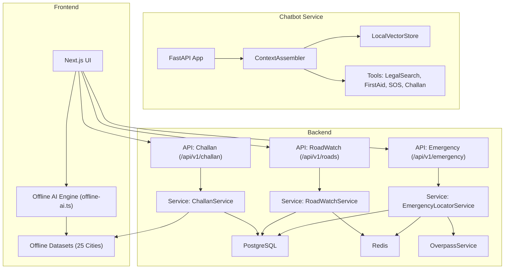
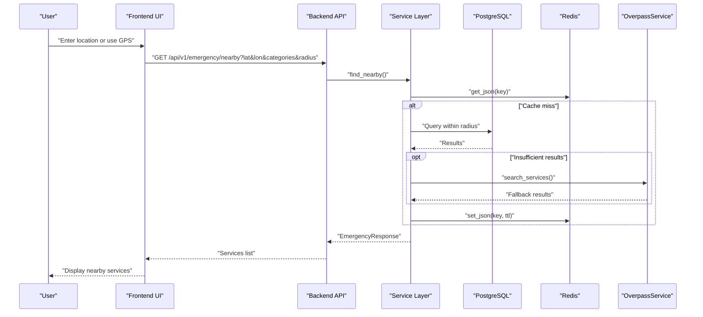
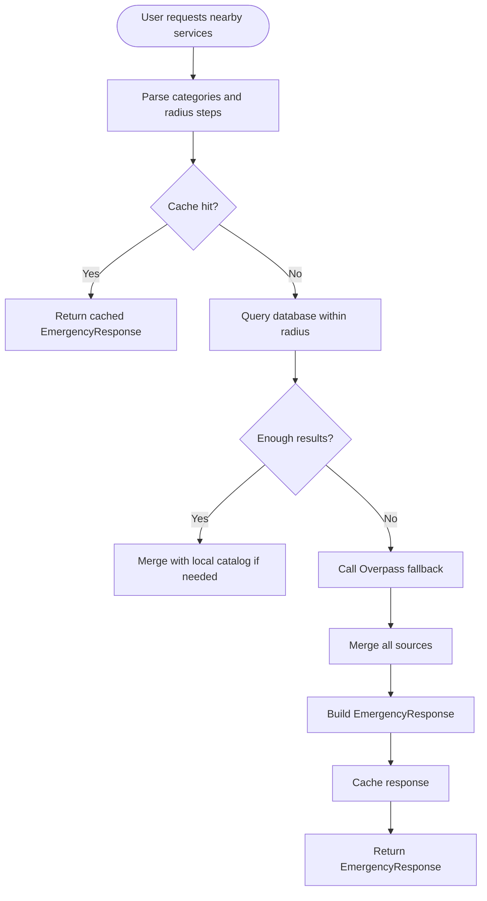
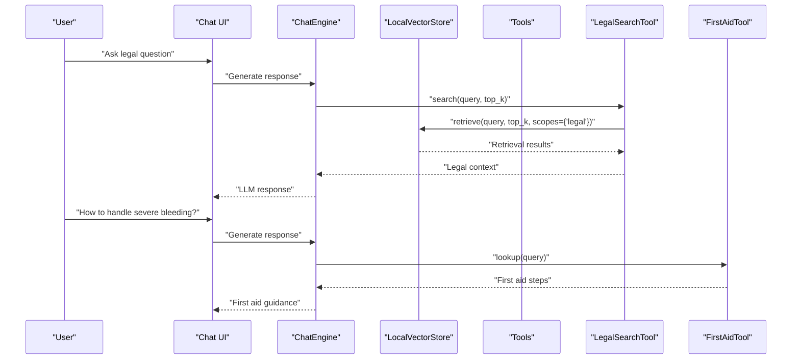
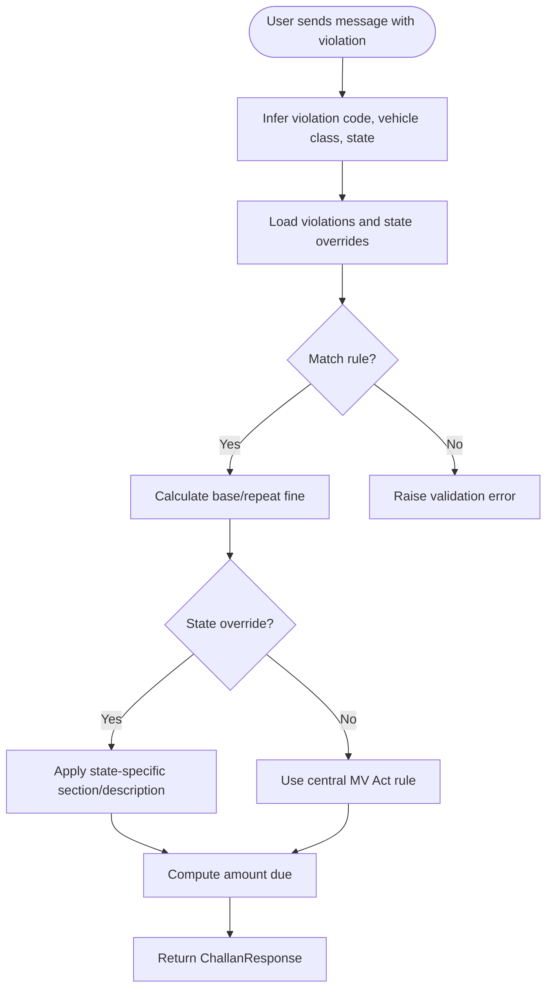
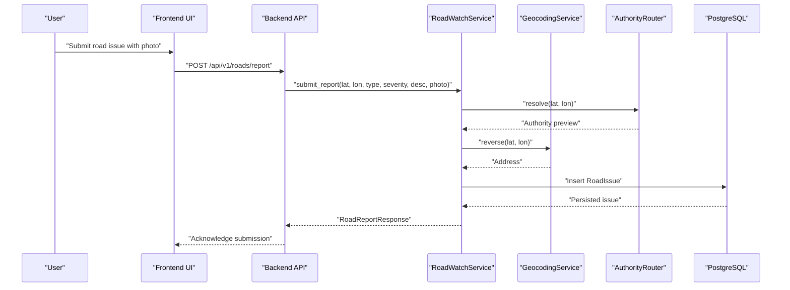
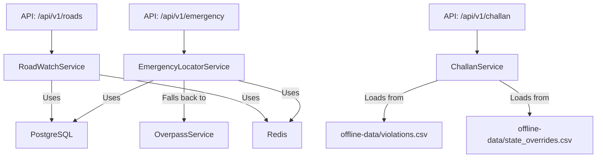

# Core Modules Overview

<cite>
**Referenced Files in This Document**
- [emergency_locator.py](file://backend/services/emergency_locator.py)
- [emergency.py](file://backend/api/v1/emergency.py)
- [roadwatch_service.py](file://backend/services/roadwatch_service.py)
- [roadwatch.py](file://backend/api/v1/roadwatch.py)
- [challan_service.py](file://backend/services/challan_service.py)
- [challan.py](file://backend/api/v1/challan.py)
- [challan_tool.py](file://chatbot_service/tools/challan_tool.py)
- [main.py](file://chatbot_service/main.py)
- [vectorstore.py](file://chatbot_service/rag/vectorstore.py)
- [legal_search_tool.py](file://chatbot_service/tools/legal_search_tool.py)
- [first_aid_tool.py](file://chatbot_service/tools/first_aid_tool.py)
- [offline-ai.ts](file://frontend/lib/offline-ai.ts)
- [offline-data/violations.csv](file://frontend/public/offline-data/violations.csv)
- [offline-data/state_overrides.csv](file://frontend/public/offline-data/state_overrides.csv)
- [offline-data/first-aid.json](file://frontend/public/offline-data/first-aid.json)
- [build_offline_bundle.py](file://backend/scripts/app/build_offline_bundle.py)
- [Offline_Architecture.md](file://docs/Offline_Architecture.md)
</cite>

## Table of Contents
1. [Introduction](#introduction)
2. [Project Structure](#project-structure)
3. [Core Components](#core-components)
4. [Architecture Overview](#architecture-overview)
5. [Detailed Component Analysis](#detailed-component-analysis)
6. [Dependency Analysis](#dependency-analysis)
7. [Performance Considerations](#performance-considerations)
8. [Troubleshooting Guide](#troubleshooting-guide)
9. [Conclusion](#conclusion)

## Introduction
This document presents the SafeVixAI core modules overview, focusing on the four primary modules that define platform functionality. It explains how each module operates conceptually for users and technically for developers, with emphasis on offline capabilities supporting 25 major Indian cities. The modules covered are:
- Emergency Locator: finds nearest emergency services with GPS-based location detection and tiered radius fallback.
- AI Chatbot: provides multilingual legal assistance and first aid guidance with retrieval-augmented generation (RAG).
- Challan Calculator (DriveLegal): calculates accurate fines based on the Motor Vehicles Act 2019 with state-specific overrides.
- Road Reporter (RoadWatch): enables community-driven road infrastructure reporting with automatic authority routing.

## Project Structure
SafeVixAI is organized into three main areas:
- Backend: FastAPI services exposing REST APIs for emergency, roadwatch, and challan calculations; integrates with PostgreSQL, Redis, and Overpass for offline fallback.
- Chatbot Service: an agentic RAG system with tools for legal search, first aid, SOS, and challan calculation; powered by local vector storage and streaming providers.
- Frontend: Next.js application with offline-first capabilities, including an offline AI engine and cached datasets for 25 Indian cities.

**Diagram sources**
- [emergency.py:12-75](file://backend/api/v1/emergency.py#L12-L75)
- [roadwatch.py:19-96](file://backend/api/v1/roadwatch.py#L19-L96)
- [challan.py:10-25](file://backend/api/v1/challan.py#L10-L25)
- [emergency_locator.py:161-373](file://backend/services/emergency_locator.py#L161-L373)
- [roadwatch_service.py:56-324](file://backend/services/roadwatch_service.py#L56-L324)
- [challan_service.py:96-313](file://backend/services/challan_service.py#L96-L313)
- [offline-ai.ts:1-256](file://frontend/lib/offline-ai.ts#L1-L256)
- [offline-data/violations.csv:1-27](file://frontend/public/offline-data/violations.csv#L1-L27)
- [offline-data/state_overrides.csv:1-14](file://frontend/public/offline-data/state_overrides.csv#L1-L14)

**Section sources**
- [emergency.py:12-75](file://backend/api/v1/emergency.py#L12-L75)
- [roadwatch.py:19-96](file://backend/api/v1/roadwatch.py#L19-L96)
- [challan.py:10-25](file://backend/api/v1/challan.py#L10-L25)
- [offline-ai.ts:1-256](file://frontend/lib/offline-ai.ts#L1-L256)

## Core Components
This section introduces each module’s purpose, capabilities, and offline support.

- Emergency Locator
  - Purpose: Find nearest emergency services (hospital, police, ambulance, fire, towing, pharmacy, puncture, showroom) using GPS coordinates.
  - Features:
    - Tiered radius fallback to ensure results even in sparse regions.
    - Hybrid sourcing: database, local catalog, and Overpass fallback.
    - Emergency numbers aggregation and SOS payload composition.
    - Offline bundle building for 25 major Indian cities.
  - Offline capability: Pre-built city bundles with cached services and emergency numbers for offline use.

- AI Chatbot
  - Purpose: Multilingual legal assistance and first aid guidance powered by RAG.
  - Features:
    - Legal search via vector similarity over cached legal documents.
    - First aid guidance from structured JSON datasets.
    - Tools for SOS, challan calculation, road infrastructure, and weather.
    - Multi-provider LLM fallback (Groq, Gemini, OpenRouter, Cerebras, Mistral, NVIDIA NIM, Sarvam, Together AI, GitHub Models).
  - Offline capability: Local vector index, cached datasets, and keyword fallback for offline AI.

- Challan Calculator (DriveLegal)
  - Purpose: Accurate fine calculations based on the Motor Vehicles Act 2019 with state-specific overrides.
  - Features:
    - Rule-based calculation with vehicle class and repeat-offence logic.
    - State-specific overrides loaded from CSV files.
    - Automatic inference of violation code, vehicle class, and state from user messages.
  - Offline capability: Full dataset caching for violations and state overrides.

- Road Reporter (RoadWatch)
  - Purpose: Community-driven reporting of road infrastructure issues with automatic authority routing.
  - Features:
    - Nearby issues discovery with configurable statuses and radius.
    - Authority preview and infrastructure metadata lookup.
    - Photo upload with magic-byte validation and size limits.
    - Complaint reference generation and status lifecycle management.
  - Offline capability: Queued uploads and offline metadata persistence handled by frontend and backend scripts.

**Section sources**
- [emergency_locator.py:28-158](file://backend/services/emergency_locator.py#L28-L158)
- [offline-ai.ts:1-256](file://frontend/lib/offline-ai.ts#L1-L256)
- [challan_service.py:96-313](file://backend/services/challan_service.py#L96-L313)
- [roadwatch_service.py:56-324](file://backend/services/roadwatch_service.py#L56-L324)

## Architecture Overview
The platform integrates backend APIs, chatbot services, and frontend capabilities with robust offline support.

**Diagram sources**
- [emergency.py:19-70](file://backend/api/v1/emergency.py#L19-L70)
- [emergency_locator.py:187-373](file://backend/services/emergency_locator.py#L187-L373)

**Section sources**
- [emergency.py:19-70](file://backend/api/v1/emergency.py#L19-L70)
- [emergency_locator.py:187-373](file://backend/services/emergency_locator.py#L187-L373)

## Detailed Component Analysis

### Emergency Locator Module
- Purpose: Provide nearest emergency services with robust fallback and offline support.
- Key behaviors:
  - Category parsing and radius step computation.
  - Multi-source merging: database, local catalog, Overpass fallback.
  - SOS payload composition with emergency numbers.
  - Offline bundle builder for 25 major Indian cities.
- Offline support:
  - City center coordinates and emergency numbers cached per city.
  - Bundles persisted to disk and served to the frontend.

**Diagram sources**
- [emergency_locator.py:187-373](file://backend/services/emergency_locator.py#L187-L373)

Practical examples:
- Finding hospitals, police, and ambulances within 2 km radius around a user’s location.
- Building an offline bundle for Chennai with 150 services and emergency numbers.

**Section sources**
- [emergency_locator.py:161-373](file://backend/services/emergency_locator.py#L161-L373)
- [emergency.py:19-75](file://backend/api/v1/emergency.py#L19-L75)
- [build_offline_bundle.py:14-46](file://backend/scripts/app/build_offline_bundle.py#L14-L46)

### AI Chatbot Module
- Purpose: Multilingual legal assistance and first aid guidance with RAG.
- Key behaviors:
  - Legal search via vector similarity over cached legal documents.
  - First aid guidance from structured JSON datasets.
  - Tools for SOS, challan calculation, road infrastructure, and weather.
  - Offline AI engine with system AI, Transformers.js Gemma, and keyword fallback.
- Offline support:
  - Local vector index built from cached documents.
  - First aid JSON and legal datasets cached in the frontend.

**Diagram sources**
- [main.py:41-93](file://chatbot_service/main.py#L41-L93)
- [vectorstore.py:51-67](file://chatbot_service/rag/vectorstore.py#L51-L67)
- [legal_search_tool.py:6-11](file://chatbot_service/tools/legal_search_tool.py#L6-L11)
- [first_aid_tool.py:49-109](file://chatbot_service/tools/first_aid_tool.py#L49-L109)

Practical examples:
- Legal search for “helmet fine” returns MV Act sections and penalties.
- First aid guidance for “burns” with step-by-step instructions and warnings.

**Section sources**
- [main.py:41-93](file://chatbot_service/main.py#L41-L93)
- [vectorstore.py:20-110](file://chatbot_service/rag/vectorstore.py#L20-L110)
- [legal_search_tool.py:6-11](file://chatbot_service/tools/legal_search_tool.py#L6-L11)
- [first_aid_tool.py:49-109](file://chatbot_service/tools/first_aid_tool.py#L49-L109)
- [offline-ai.ts:1-256](file://frontend/lib/offline-ai.ts#L1-L256)

### Challan Calculator (DriveLegal) Module
- Purpose: Calculate accurate fines based on the Motor Vehicles Act 2019 with state-specific overrides.
- Key behaviors:
  - Rule-based calculation with vehicle class and repeat-offence logic.
  - State-specific overrides loaded from CSV files.
  - Automatic inference of violation code, vehicle class, and state from user messages.
- Offline support:
  - Full dataset caching for violations and state overrides.

**Diagram sources**
- [challan_tool.py:31-69](file://chatbot_service/tools/challan_tool.py#L31-L69)
- [challan_service.py:103-149](file://backend/services/challan_service.py#L103-L149)

Practical examples:
- Calculating a helmet fine for a two-wheeler in Tamil Nadu with repeat-offence logic.
- Determining drunk driving penalties with state-specific overrides.

**Section sources**
- [challan_tool.py:27-81](file://chatbot_service/tools/challan_tool.py#L27-L81)
- [challan_service.py:96-313](file://backend/services/challan_service.py#L96-L313)
- [offline-data/violations.csv:1-27](file://frontend/public/offline-data/violations.csv#L1-L27)
- [offline-data/state_overrides.csv:1-14](file://frontend/public/offline-data/state_overrides.csv#L1-L14)

### Road Reporter (RoadWatch) Module
- Purpose: Enable community-driven reporting of road infrastructure issues with automatic authority routing.
- Key behaviors:
  - Nearby issues discovery with configurable statuses and radius.
  - Authority preview and infrastructure metadata lookup.
  - Photo upload with magic-byte validation and size limits.
  - Complaint reference generation and status lifecycle management.
- Offline support:
  - Queued uploads and offline metadata persistence handled by frontend and backend scripts.

**Diagram sources**
- [roadwatch.py:73-96](file://backend/api/v1/roadwatch.py#L73-L96)
- [roadwatch_service.py:186-253](file://backend/services/roadwatch_service.py#L186-L253)

Practical examples:
- Reporting a pothole with a photo; the system routes to the correct authority and generates a complaint reference.
- Discovering open and acknowledged road issues within a 5 km radius.

**Section sources**
- [roadwatch.py:26-96](file://backend/api/v1/roadwatch.py#L26-L96)
- [roadwatch_service.py:56-324](file://backend/services/roadwatch_service.py#L56-L324)

## Dependency Analysis
The modules interact through well-defined boundaries: backend APIs, service layers, and shared offline datasets.

**Diagram sources**
- [emergency_locator.py:161-373](file://backend/services/emergency_locator.py#L161-L373)
- [challan_service.py:96-313](file://backend/services/challan_service.py#L96-L313)
- [roadwatch_service.py:56-324](file://backend/services/roadwatch_service.py#L56-L324)
- [emergency.py:12-75](file://backend/api/v1/emergency.py#L12-L75)
- [challan.py:10-25](file://backend/api/v1/challan.py#L10-L25)
- [roadwatch.py:19-96](file://backend/api/v1/roadwatch.py#L19-L96)
- [offline-data/violations.csv:1-27](file://frontend/public/offline-data/violations.csv#L1-L27)
- [offline-data/state_overrides.csv:1-14](file://frontend/public/offline-data/state_overrides.csv#L1-L14)

**Section sources**
- [emergency_locator.py:161-373](file://backend/services/emergency_locator.py#L161-L373)
- [challan_service.py:96-313](file://backend/services/challan_service.py#L96-L313)
- [roadwatch_service.py:56-324](file://backend/services/roadwatch_service.py#L56-L324)

## Performance Considerations
- Caching: Redis caches emergency results and road issues with versioned keys to invalidate efficiently.
- Indexing: Local vector store builds a simple JSON index of legal documents for fast retrieval.
- Database queries: Spatial queries use geography types and ST_DWithin for efficient radius searches.
- Offline bundles: Pre-built city bundles reduce cold-start latency and network dependency.
- Image uploads: Magic-byte validation and size checks prevent invalid or oversized uploads.

[No sources needed since this section provides general guidance]

## Troubleshooting Guide
Common issues and resolutions:
- Emergency services not found:
  - Verify GPS coordinates and increase radius.
  - Check Redis connectivity and cache TTL.
  - Confirm Overpass fallback availability and network access.
- Challan calculation errors:
  - Ensure violation code matches known codes (e.g., 183, 185, 181, 194D, 194B, 179).
  - Validate vehicle class normalization and state code formatting.
- Road report upload failures:
  - Confirm content type is JPEG/PNG/WebP and file size under limit.
  - Check magic bytes validation and backend upload directory permissions.
- Offline AI not responding:
  - Ensure user consent for model download and sufficient storage.
  - Verify browser support for system AI or Transformers.js availability.

**Section sources**
- [emergency_locator.py:342-373](file://backend/services/emergency_locator.py#L342-L373)
- [challan_service.py:103-149](file://backend/services/challan_service.py#L103-L149)
- [roadwatch_service.py:275-324](file://backend/services/roadwatch_service.py#L275-L324)
- [offline-ai.ts:1-256](file://frontend/lib/offline-ai.ts#L1-L256)

## Conclusion
SafeVixAI’s core modules deliver a comprehensive, offline-capable platform for emergency response, legal guidance, fine calculation, and road infrastructure reporting. The backend APIs and services integrate seamlessly with the frontend’s offline-first design, ensuring reliable functionality across 25 major Indian cities. Developers can extend and maintain these modules by leveraging the existing caching, vector indexing, and offline dataset strategies.