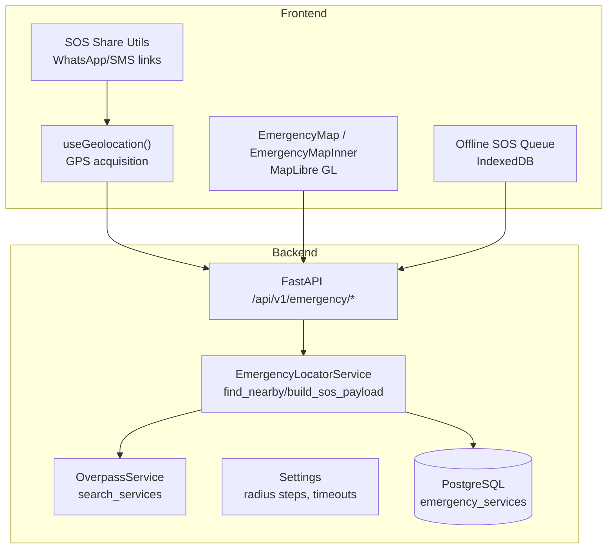
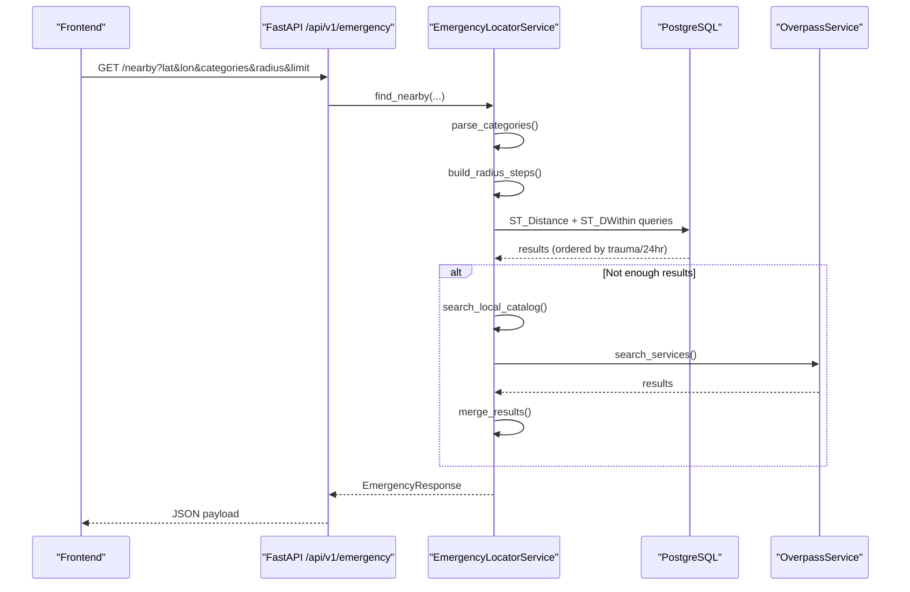
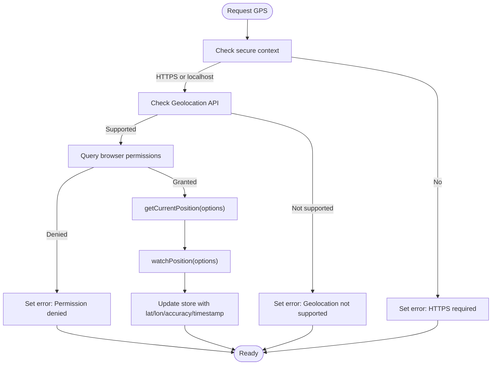
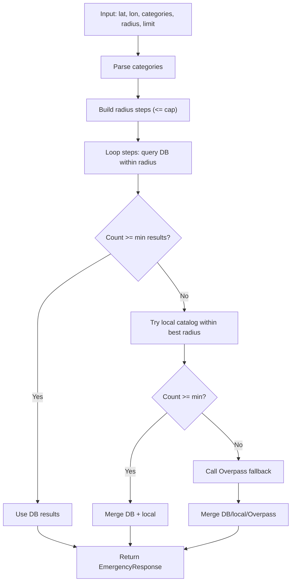
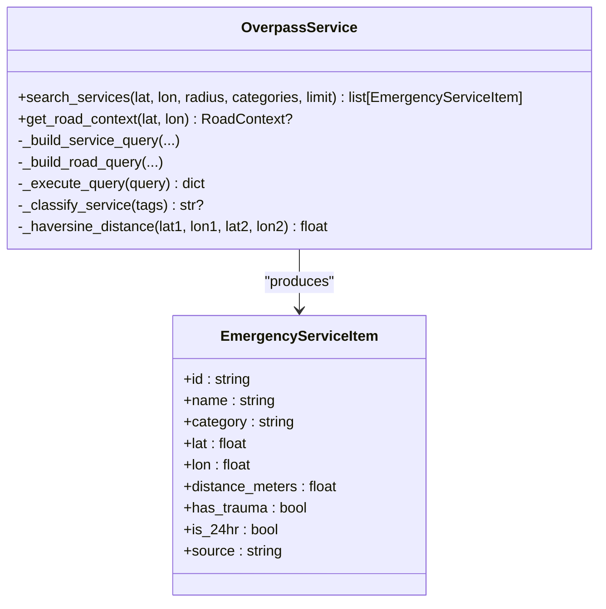
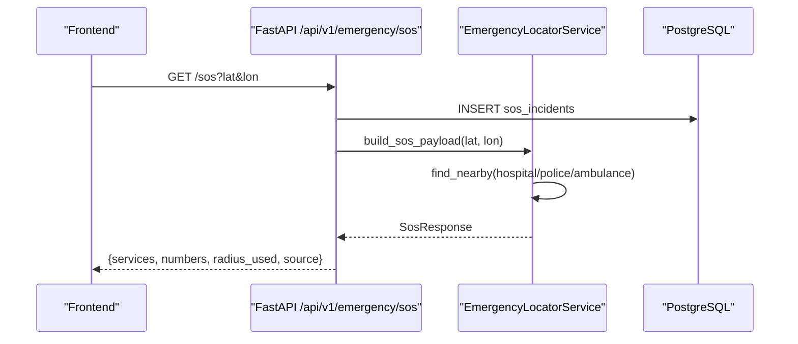
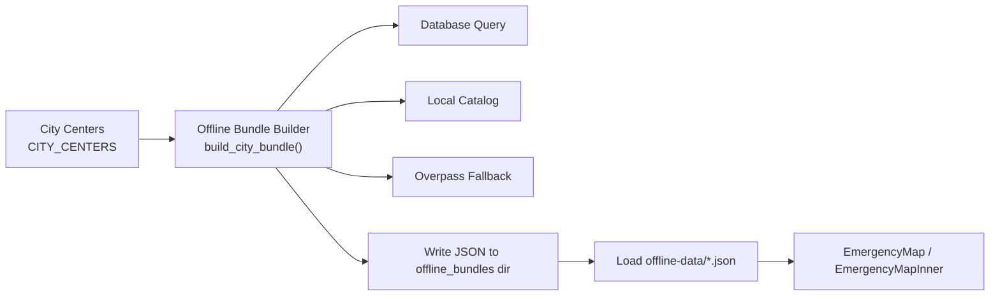
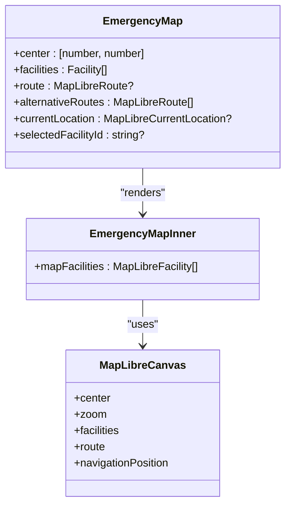
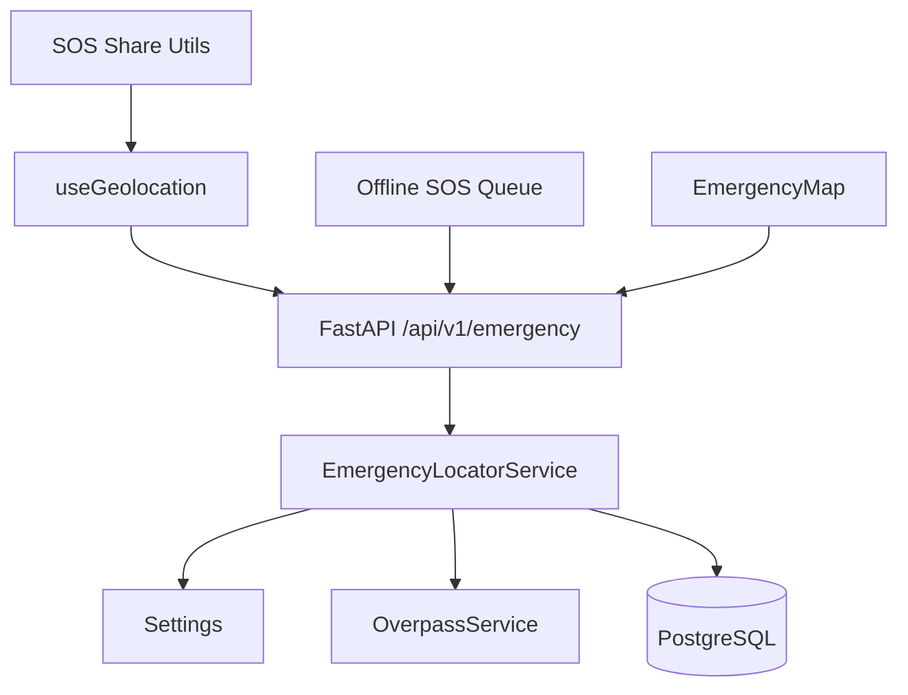

# Emergency Locator Module

<cite>
**Referenced Files in This Document**
- [emergency_locator.py](file://backend/services/emergency_locator.py)
- [overpass_service.py](file://backend/services/overpass_service.py)
- [config.py](file://backend/core/config.py)
- [emergency.py](file://backend/api/v1/emergency.py)
- [schemas.py](file://backend/models/schemas.py)
- [emergency.py](file://backend/models/emergency.py)
- [geolocation.ts](file://frontend/lib/geolocation.ts)
- [sos-share.ts](file://frontend/lib/sos-share.ts)
- [offline-sos-queue.ts](file://frontend/lib/offline-sos-queue.ts)
- [EmergencyMap.tsx](file://frontend/components/EmergencyMap.tsx)
- [EmergencyMapInner.tsx](file://frontend/components/EmergencyMapInner.tsx)
- [map-defaults.ts](file://frontend/lib/map-defaults.ts)
- [GlobalSOS.tsx](file://frontend/components/GlobalSOS.tsx)
- [location-utils.ts](file://frontend/lib/location-utils.ts)
- [chennai.json](file://frontend/public/offline-data/chennai.json)
</cite>

## Table of Contents
1. [Introduction](#introduction)
2. [Project Structure](#project-structure)
3. [Core Components](#core-components)
4. [Architecture Overview](#architecture-overview)
5. [Detailed Component Analysis](#detailed-component-analysis)
6. [Dependency Analysis](#dependency-analysis)
7. [Performance Considerations](#performance-considerations)
8. [Troubleshooting Guide](#troubleshooting-guide)
9. [Conclusion](#conclusion)
10. [Appendices](#appendices)

## Introduction
The Emergency Locator module provides a robust, layered emergency response system for India. It detects user location, finds nearby emergency services (hospitals, police, ambulances, fire, towing, pharmacies), integrates with Overpass API for fallback discovery, and enables SOS sharing via WhatsApp/SMS. It also includes offline capabilities for 25 major Indian cities with prebuilt bundles and an offline SOS queue for connectivity loss scenarios. The frontend integrates MapLibre GL for interactive maps and provides accessibility-friendly UI components.

## Project Structure
The module spans backend services, API endpoints, models, and frontend components:
- Backend: EmergencyLocatorService orchestrates database queries, local catalog search, and Overpass fallback; OverpassService handles external service calls; FastAPI endpoints expose emergency services and SOS payloads.
- Frontend: Geolocation hook manages GPS acquisition; SOS share utilities generate links; Offline SOS queue persists requests; Map components render emergency facilities.

**Diagram sources**
- [emergency_locator.py:161-507](file://backend/services/emergency_locator.py#L161-L507)
- [overpass_service.py:24-249](file://backend/services/overpass_service.py#L24-L249)
- [config.py:26-108](file://backend/core/config.py#L26-L108)
- [emergency.py:12-83](file://backend/api/v1/emergency.py#L12-L83)
- [geolocation.ts:13-124](file://frontend/lib/geolocation.ts#L13-L124)
- [sos-share.ts:9-68](file://frontend/lib/sos-share.ts#L9-L68)
- [EmergencyMap.tsx:25-58](file://frontend/components/EmergencyMap.tsx#L25-L58)
- [EmergencyMapInner.tsx:44-83](file://frontend/components/EmergencyMapInner.tsx#L44-L83)
- [offline-sos-queue.ts:25-138](file://frontend/lib/offline-sos-queue.ts#L25-L138)

**Section sources**
- [emergency_locator.py:161-507](file://backend/services/emergency_locator.py#L161-L507)
- [overpass_service.py:24-249](file://backend/services/overpass_service.py#L24-L249)
- [config.py:26-108](file://backend/core/config.py#L26-L108)
- [emergency.py:12-83](file://backend/api/v1/emergency.py#L12-L83)
- [geolocation.ts:13-124](file://frontend/lib/geolocation.ts#L13-L124)
- [sos-share.ts:9-68](file://frontend/lib/sos-share.ts#L9-L68)
- [EmergencyMap.tsx:25-58](file://frontend/components/EmergencyMap.tsx#L25-L58)
- [EmergencyMapInner.tsx:44-83](file://frontend/components/EmergencyMapInner.tsx#L44-L83)
- [offline-sos-queue.ts:25-138](file://frontend/lib/offline-sos-queue.ts#L25-L138)

## Core Components
- EmergencyLocatorService: Parses categories, builds radius steps, queries database with PostGIS, merges results from local catalog and Overpass fallback, and caches responses.
- OverpassService: Executes Overpass API queries for amenities and emergency services, classifies tags, computes distances, and retries across multiple endpoints.
- Settings: Defines emergency radius steps, min results threshold, cache TTLs, and Overpass endpoints.
- FastAPI Endpoints: Expose /nearby, /sos, and /numbers for emergency discovery and SOS payload generation.
- Frontend Geolocation Hook: Acquires high-accuracy GPS with permission checks and error handling.
- SOS Share Utilities: Generate WhatsApp/SMS links with profile and location context.
- Offline SOS Queue: Persist and sync SOS events when offline.
- Map Integration: Dynamic MapLibre GL rendering with facility markers and route overlays.

**Section sources**
- [emergency_locator.py:161-507](file://backend/services/emergency_locator.py#L161-L507)
- [overpass_service.py:24-249](file://backend/services/overpass_service.py#L24-L249)
- [config.py:26-108](file://backend/core/config.py#L26-L108)
- [emergency.py:19-75](file://backend/api/v1/emergency.py#L19-L75)
- [geolocation.ts:13-124](file://frontend/lib/geolocation.ts#L13-L124)
- [sos-share.ts:9-68](file://frontend/lib/sos-share.ts#L9-L68)
- [offline-sos-queue.ts:25-138](file://frontend/lib/offline-sos-queue.ts#L25-L138)
- [EmergencyMap.tsx:25-58](file://frontend/components/EmergencyMap.tsx#L25-L58)
- [EmergencyMapInner.tsx:44-83](file://frontend/components/EmergencyMapInner.tsx#L44-L83)

## Architecture Overview
The Emergency Locator follows a tiered discovery pattern:
- Database-first search within increasing radii until minimum results are found.
- Local catalog augmentation for city-specific entries.
- Overpass fallback for broader discovery when database/local results are insufficient.
- Caching and response normalization for performance and consistency.

**Diagram sources**
- [emergency_locator.py:187-373](file://backend/services/emergency_locator.py#L187-L373)
- [overpass_service.py:35-78](file://backend/services/overpass_service.py#L35-L78)
- [emergency.py:19-40](file://backend/api/v1/emergency.py#L19-L40)

**Section sources**
- [emergency_locator.py:187-373](file://backend/services/emergency_locator.py#L187-L373)
- [overpass_service.py:35-78](file://backend/services/overpass_service.py#L35-L78)
- [emergency.py:19-40](file://backend/api/v1/emergency.py#L19-L40)

## Detailed Component Analysis

### GPS Auto-Detection and Accuracy Thresholds
- High-accuracy GPS acquisition with permission checks and error mapping.
- Accuracy threshold determines approximate vs precise location labeling.
- Automatic watchPosition updates for continuous tracking.

**Diagram sources**
- [geolocation.ts:30-108](file://frontend/lib/geolocation.ts#L30-L108)

**Section sources**
- [geolocation.ts:13-124](file://frontend/lib/geolocation.ts#L13-L124)
- [location-utils.ts:17-57](file://frontend/lib/location-utils.ts#L17-L57)

### Tiered Radius Fallback System
- Radius steps configurable via environment; defaults include 500m, 1km, 5km, 10km, 25km, 50km.
- Minimum results threshold ensures sufficient services are returned before stopping.
- Results are ordered by trauma availability, 24-hour availability, and proximity.

**Diagram sources**
- [emergency_locator.py:178-373](file://backend/services/emergency_locator.py#L178-L373)
- [config.py:26-32](file://backend/core/config.py#L26-L32)

**Section sources**
- [emergency_locator.py:178-373](file://backend/services/emergency_locator.py#L178-L373)
- [config.py:26-32](file://backend/core/config.py#L26-L32)

### Overpass API Integration
- Queries amenities and emergency services around a point with a given radius.
- Classifies tags into categories (hospital, police, fire, pharmacy, ambulance, towing).
- Computes Haversine distance and sorts by trauma/24hr availability and proximity.
- Retries across multiple Overpass endpoints with backoff.

**Diagram sources**
- [overpass_service.py:24-249](file://backend/services/overpass_service.py#L24-L249)
- [schemas.py:36-51](file://backend/models/schemas.py#L36-L51)

**Section sources**
- [overpass_service.py:35-249](file://backend/services/overpass_service.py#L35-L249)
- [schemas.py:36-51](file://backend/models/schemas.py#L36-L51)

### SOS Sharing and Emergency Contact Notifications
- Generates WhatsApp/SMS links with location, readable address (BigDataCloud), and user profile details.
- Provides both async reverse-geocoding and synchronous variants.
- Stores SOS incidents in database upon /sos requests.

**Diagram sources**
- [emergency.py:42-71](file://backend/api/v1/emergency.py#L42-L71)
- [emergency_locator.py:218-239](file://backend/services/emergency_locator.py#L218-L239)

**Section sources**
- [sos-share.ts:9-68](file://frontend/lib/sos-share.ts#L9-L68)
- [emergency.py:42-71](file://backend/api/v1/emergency.py#L42-L71)
- [emergency_locator.py:218-239](file://backend/services/emergency_locator.py#L218-L239)

### Offline Emergency Map Implementation
- Prebuilt offline bundles for 25 major Indian cities; each bundle includes center coordinates, services, and emergency numbers.
- City centers and offline city lists define supported areas.
- Frontend loads offline JSON for rendering emergency facilities on the map.

**Diagram sources**
- [emergency_locator.py:241-299](file://backend/services/emergency_locator.py#L241-L299)
- [emergency_locator.py:39-115](file://backend/services/emergency_locator.py#L39-L115)
- [chennai.json:1-100](file://frontend/public/offline-data/chennai.json#L1-L100)
- [EmergencyMap.tsx:25-58](file://frontend/components/EmergencyMap.tsx#L25-L58)
- [EmergencyMapInner.tsx:44-83](file://frontend/components/EmergencyMapInner.tsx#L44-L83)

**Section sources**
- [emergency_locator.py:241-299](file://backend/services/emergency_locator.py#L241-L299)
- [emergency_locator.py:39-115](file://backend/services/emergency_locator.py#L39-L115)
- [chennai.json:1-100](file://frontend/public/offline-data/chennai.json#L1-L100)
- [EmergencyMap.tsx:25-58](file://frontend/components/EmergencyMap.tsx#L25-L58)
- [EmergencyMapInner.tsx:44-83](file://frontend/components/EmergencyMapInner.tsx#L44-L83)

### User Interface and Accessibility
- Dynamic map loading with SSR-safe placeholder.
- MapLibre Canvas integration with facility markers, route overlays, and selection highlighting.
- Global SOS button appears on most pages; hidden on dedicated emergency pages.
- Location accuracy formatting and approximate location labeling improve clarity.

**Diagram sources**
- [EmergencyMap.tsx:25-58](file://frontend/components/EmergencyMap.tsx#L25-L58)
- [EmergencyMapInner.tsx:35-83](file://frontend/components/EmergencyMapInner.tsx#L35-L83)
- [map-defaults.ts:1-8](file://frontend/lib/map-defaults.ts#L1-L8)

**Section sources**
- [EmergencyMap.tsx:25-58](file://frontend/components/EmergencyMap.tsx#L25-L58)
- [EmergencyMapInner.tsx:44-83](file://frontend/components/EmergencyMapInner.tsx#L44-L83)
- [map-defaults.ts:1-8](file://frontend/lib/map-defaults.ts#L1-L8)
- [GlobalSOS.tsx:7-56](file://frontend/components/GlobalSOS.tsx#L7-L56)
- [location-utils.ts:17-57](file://frontend/lib/location-utils.ts#L17-L57)

## Dependency Analysis
- Backend depends on Settings for configuration, Redis for caching, PostgreSQL for persistence, and OverpassService for external data.
- Frontend depends on browser APIs for geolocation, IndexedDB for offline SOS queue, and MapLibre GL for rendering.

**Diagram sources**
- [emergency_locator.py:161-507](file://backend/services/emergency_locator.py#L161-L507)
- [config.py:26-108](file://backend/core/config.py#L26-L108)
- [emergency.py:12-83](file://backend/api/v1/emergency.py#L12-L83)
- [geolocation.ts:13-124](file://frontend/lib/geolocation.ts#L13-L124)
- [sos-share.ts:9-68](file://frontend/lib/sos-share.ts#L9-L68)
- [offline-sos-queue.ts:25-138](file://frontend/lib/offline-sos-queue.ts#L25-L138)
- [EmergencyMap.tsx:25-58](file://frontend/components/EmergencyMap.tsx#L25-L58)

**Section sources**
- [emergency_locator.py:161-507](file://backend/services/emergency_locator.py#L161-L507)
- [config.py:26-108](file://backend/core/config.py#L26-L108)
- [emergency.py:12-83](file://backend/api/v1/emergency.py#L12-L83)
- [geolocation.ts:13-124](file://frontend/lib/geolocation.ts#L13-L124)
- [sos-share.ts:9-68](file://frontend/lib/sos-share.ts#L9-L68)
- [offline-sos-queue.ts:25-138](file://frontend/lib/offline-sos-queue.ts#L25-L138)
- [EmergencyMap.tsx:25-58](file://frontend/components/EmergencyMap.tsx#L25-L58)

## Performance Considerations
- Database queries leverage PostGIS functions (ST_Distance, ST_DWithin) and ordering by trauma/24hr to reduce client-side sorting overhead.
- Caching reduces repeated external calls; cache TTL configured centrally.
- Overpass queries include timeouts and retry logic to mitigate upstream failures.
- Map rendering is SSR-safe with dynamic imports to avoid server-side canvas usage.

## Troubleshooting Guide
Common issues and resolutions:
- Location permission denied: Prompt users to enable location in browser settings; the geolocation hook maps error codes to actionable messages.
- Low accuracy GPS: Approximate locations are labeled accordingly; encourage moving outdoors for better satellite reception.
- Overpass API unavailable: The service retries across multiple endpoints with backoff; backend returns 503 on failure.
- Offline SOS not sent: IndexedDB queue persists requests; background sync triggers on network restoration.

**Section sources**
- [geolocation.ts:63-71](file://frontend/lib/geolocation.ts#L63-L71)
- [location-utils.ts:17-57](file://frontend/lib/location-utils.ts#L17-L57)
- [overpass_service.py:123-134](file://backend/services/overpass_service.py#L123-L134)
- [emergency.py:38-40](file://backend/api/v1/emergency.py#L38-L40)
- [offline-sos-queue.ts:75-124](file://frontend/lib/offline-sos-queue.ts#L75-L124)

## Conclusion
The Emergency Locator module delivers a resilient, layered emergency response system with accurate GPS detection, tiered discovery, and robust fallbacks. It integrates seamlessly with MapLibre GL for visualization, supports offline city bundles, and provides practical SOS sharing and queueing for connectivity loss. The modular design and centralized configuration enable easy tuning and deployment across diverse environments.

## Appendices

### Practical Scenarios
- Medical emergency: Use /sos endpoint to gather nearby hospitals, police, and ambulances; share WhatsApp/SMS link with location and profile.
- Road accident: Locate nearest police and hospital within radius; call 112 and share coordinates.
- Fire incident: Find nearby fire stations and call 101; avoid vehicle fumes and move upwind.

### Configuration Reference
- Emergency radius steps: Configure via environment variable; defaults include 500m, 1km, 5km, 10km, 25km, 50km.
- Min results threshold: Ensures a minimum number of services are returned before stopping.
- Cache TTL: Controls response caching for performance.

**Section sources**
- [config.py:26-36](file://backend/core/config.py#L26-L36)
- [config.py:99-108](file://backend/core/config.py#L99-L108)