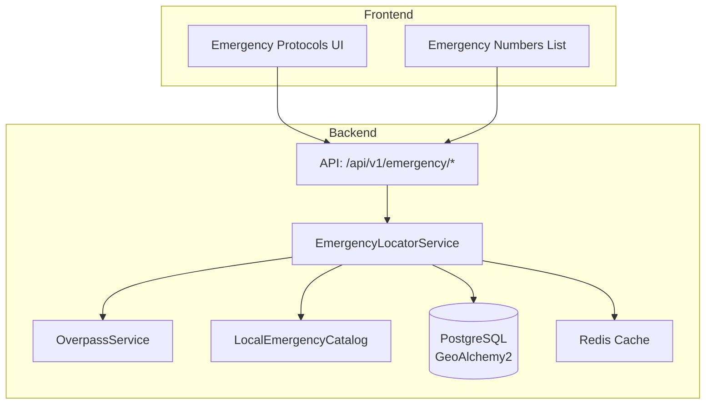
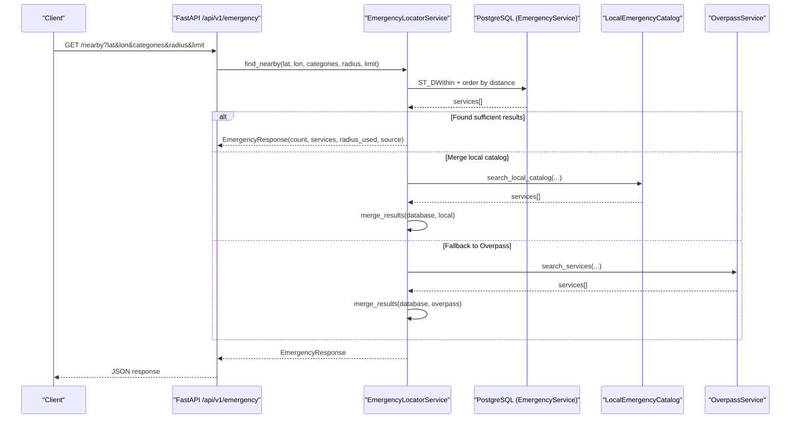
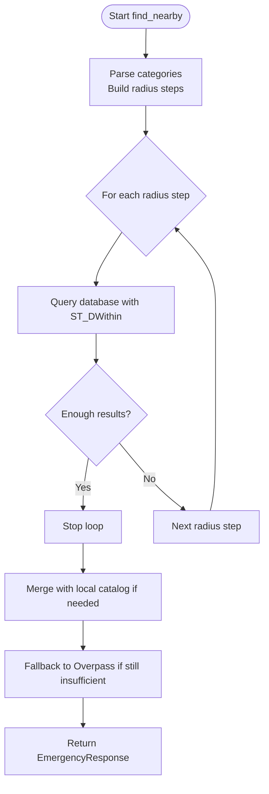
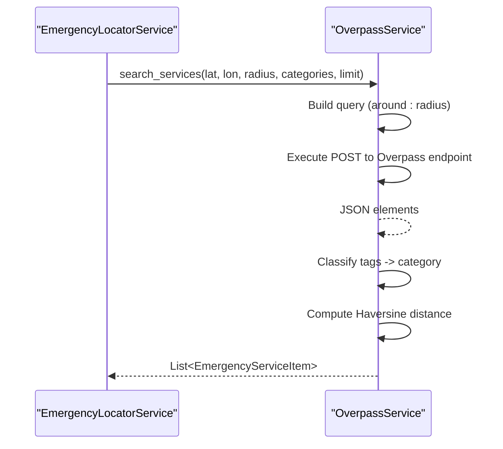
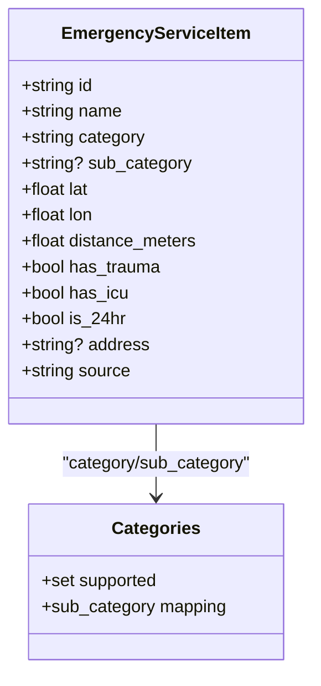
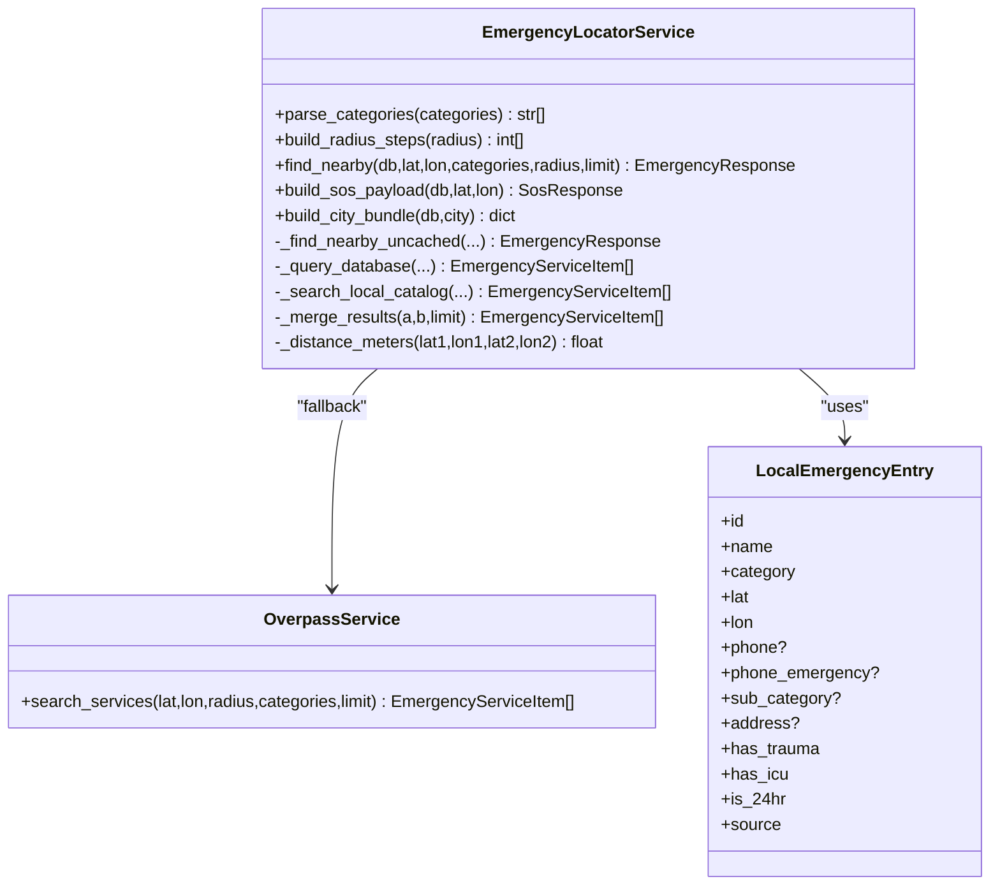
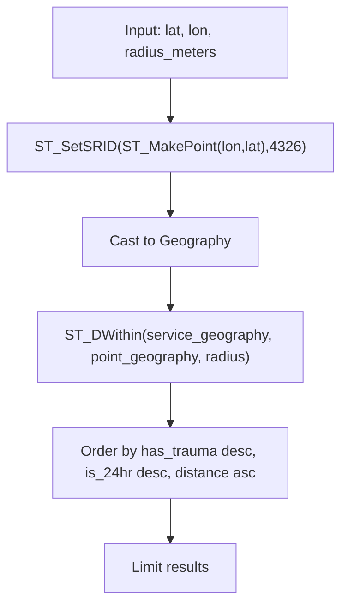
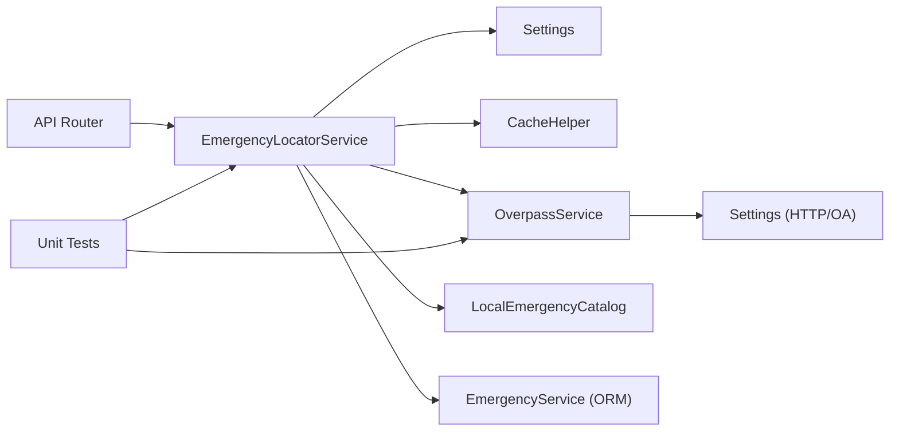

# Emergency Service Discovery

<cite>
**Referenced Files in This Document**
- [emergency.py](file://backend/api/v1/emergency.py)
- [emergency_locator.py](file://backend/services/emergency_locator.py)
- [overpass_service.py](file://backend/services/overpass_service.py)
- [local_emergency_catalog.py](file://backend/services/local_emergency_catalog.py)
- [emergency.py](file://backend/models/emergency.py)
- [schemas.py](file://backend/models/schemas.py)
- [config.py](file://backend/core/config.py)
- [emergency_numbers.json](file://chatbot_service/data/emergency_numbers.json)
- [emergency_numbers.ts](file://frontend/lib/emergency-numbers.ts)
- [EmergencyNumbers.tsx](file://frontend/components/EmergencyNumbers.tsx)
- [page.tsx](file://frontend/app/emergency/page.tsx)
- [test_emergency.py](file://backend/tests/test_emergency.py)
- [fetch_hospitals.py](file://scripts/data/fetch_hospitals.py)
</cite>

## Table of Contents
1. [Introduction](#introduction)
2. [Project Structure](#project-structure)
3. [Core Components](#core-components)
4. [Architecture Overview](#architecture-overview)
5. [Detailed Component Analysis](#detailed-component-analysis)
6. [Dependency Analysis](#dependency-analysis)
7. [Performance Considerations](#performance-considerations)
8. [Troubleshooting Guide](#troubleshooting-guide)
9. [Conclusion](#conclusion)
10. [Appendices](#appendices)

## Introduction
This document describes the Emergency Service Discovery system that locates nearby emergency services around a user’s coordinates. It covers the tiered radius fallback mechanism, integration with OpenStreetMap via Overpass API, service categorization, emergency numbers database, backend locator service, spatial indexing and query optimization, real-time availability checks, filtering, distance calculation, and user preference handling.

## Project Structure
The Emergency Service Discovery spans backend APIs, services, models, configuration, and frontend components:
- Backend API exposes endpoints for nearby services, SOS payloads, and emergency numbers.
- Services implement the emergency locator, Overpass integration, and local catalog loading.
- Models define the emergency service entity and Pydantic schemas for requests/responses.
- Configuration controls radius steps, caching, timeouts, and Overpass endpoints.
- Frontend integrates emergency numbers and displays protocols.

**Diagram sources**
- [emergency.py:19-82](file://backend/api/v1/emergency.py#L19-L82)
- [emergency_locator.py:161-507](file://backend/services/emergency_locator.py#L161-L507)
- [overpass_service.py:24-249](file://backend/services/overpass_service.py#L24-L249)
- [local_emergency_catalog.py:25-243](file://backend/services/local_emergency_catalog.py#L25-L243)
- [emergency.py:12-45](file://backend/models/emergency.py#L12-L45)
- [config.py:26-108](file://backend/core/config.py#L26-L108)
- [page.tsx:109-418](file://frontend/app/emergency/page.tsx#L109-L418)
- [EmergencyNumbers.tsx:7-41](file://frontend/components/EmergencyNumbers.tsx#L7-L41)

**Section sources**
- [emergency.py:19-82](file://backend/api/v1/emergency.py#L19-L82)
- [emergency_locator.py:161-507](file://backend/services/emergency_locator.py#L161-L507)
- [overpass_service.py:24-249](file://backend/services/overpass_service.py#L24-L249)
- [local_emergency_catalog.py:25-243](file://backend/services/local_emergency_catalog.py#L25-L243)
- [emergency.py:12-45](file://backend/models/emergency.py#L12-L45)
- [config.py:26-108](file://backend/core/config.py#L26-L108)
- [page.tsx:109-418](file://frontend/app/emergency/page.tsx#L109-L418)
- [EmergencyNumbers.tsx:7-41](file://frontend/components/EmergencyNumbers.tsx#L7-L41)

## Core Components
- EmergencyLocatorService orchestrates the search across database, local CSV catalog, and Overpass fallback, with tiered radius expansion and merging results.
- OverpassService queries OpenStreetMap for hospitals, police, fire stations, ambulances, towing, and pharmacies.
- LocalEmergencyCatalog loads curated local entries from CSV files.
- EmergencyService model stores point geometry and attributes for services.
- Pydantic schemas define request/response contracts for emergency endpoints.
- Configuration defines radius steps, limits, timeouts, and cache TTL.
- Emergency numbers are loaded from JSON and exposed via API and rendered in the frontend.

**Section sources**
- [emergency_locator.py:161-507](file://backend/services/emergency_locator.py#L161-L507)
- [overpass_service.py:24-249](file://backend/services/overpass_service.py#L24-L249)
- [local_emergency_catalog.py:25-243](file://backend/services/local_emergency_catalog.py#L25-L243)
- [emergency.py:12-45](file://backend/models/emergency.py#L12-L45)
- [schemas.py:36-66](file://backend/models/schemas.py#L36-L66)
- [config.py:26-108](file://backend/core/config.py#L26-L108)
- [emergency_numbers.json:1-70](file://chatbot_service/data/emergency_numbers.json#L1-L70)

## Architecture Overview
The backend API delegates to EmergencyLocatorService, which:
- Parses categories and builds radius steps from configuration.
- Queries the spatial database with ST_DWithin and distance ordering.
- Merges with local catalog results and optionally falls back to OverpassService.
- Returns a unified list with source attribution and radius used.

**Diagram sources**
- [emergency.py:19-40](file://backend/api/v1/emergency.py#L19-L40)
- [emergency_locator.py:187-374](file://backend/services/emergency_locator.py#L187-L374)
- [overpass_service.py:35-79](file://backend/services/overpass_service.py#L35-L79)
- [local_emergency_catalog.py:429-447](file://backend/services/local_emergency_catalog.py#L429-L447)

**Section sources**
- [emergency.py:19-40](file://backend/api/v1/emergency.py#L19-L40)
- [emergency_locator.py:187-374](file://backend/services/emergency_locator.py#L187-L374)
- [overpass_service.py:35-79](file://backend/services/overpass_service.py#L35-L79)
- [local_emergency_catalog.py:429-447](file://backend/services/local_emergency_catalog.py#L429-L447)

## Detailed Component Analysis

### Tiered Radius Fallback System
- Radius steps are configured and can be capped by the caller’s radius parameter.
- The service iterates increasing radii until a minimum threshold of results is met.
- Results from each step are merged, prioritizing services with trauma/icu availability and 24-hour status, then distance.

**Diagram sources**
- [emergency_locator.py:178-185](file://backend/services/emergency_locator.py#L178-L185)
- [emergency_locator.py:316-329](file://backend/services/emergency_locator.py#L316-L329)
- [emergency_locator.py:330-364](file://backend/services/emergency_locator.py#L330-L364)

**Section sources**
- [emergency_locator.py:178-185](file://backend/services/emergency_locator.py#L178-L185)
- [emergency_locator.py:316-364](file://backend/services/emergency_locator.py#L316-L364)
- [config.py:26-32](file://backend/core/config.py#L26-L32)

### Integration with Overpass API
- OverpassService constructs queries for amenities and emergency facilities around a point.
- It parses OSM elements, classifies categories, computes distances, and enriches attributes like trauma/icu/24h.
- It retries across multiple Overpass endpoints with backoff and raises a typed external service error on failure.

**Diagram sources**
- [overpass_service.py:35-79](file://backend/services/overpass_service.py#L35-L79)
- [overpass_service.py:136-151](file://backend/services/overpass_service.py#L136-L151)
- [overpass_service.py:24-34](file://backend/services/overpass_service.py#L24-L34)

**Section sources**
- [overpass_service.py:35-79](file://backend/services/overpass_service.py#L35-L79)
- [overpass_service.py:136-151](file://backend/services/overpass_service.py#L136-L151)
- [overpass_service.py:24-34](file://backend/services/overpass_service.py#L24-L34)

### Service Categorization and Sub-categories
- Supported categories include hospital, police, ambulance, fire, towing, pharmacy, puncture, showroom.
- Sub-categories are derived from tags (e.g., trauma_centre, icu, healthcare type).
- Sorting prioritizes trauma availability, ICU presence, 24-hour operation, then distance.

**Diagram sources**
- [schemas.py:36-51](file://backend/models/schemas.py#L36-L51)
- [emergency_locator.py:28-37](file://backend/services/emergency_locator.py#L28-L37)
- [overpass_service.py:204-211](file://backend/services/overpass_service.py#L204-L211)

**Section sources**
- [schemas.py:10-12](file://backend/models/schemas.py#L10-L12)
- [emergency_locator.py:28-37](file://backend/services/emergency_locator.py#L28-L37)
- [overpass_service.py:184-211](file://backend/services/overpass_service.py#L184-L211)

### Emergency Numbers Database and Frontend Integration
- Emergency numbers are loaded from JSON and validated into a typed response.
- The backend exposes a static endpoint returning the numbers.
- Frontend renders a primary bar of emergency numbers and links to call directly.

**Diagram sources**
- [emergency_locator.py:134-158](file://backend/services/emergency_locator.py#L134-L158)
- [emergency_numbers.json:1-70](file://chatbot_service/data/emergency_numbers.json#L1-L70)
- [emergency.py:73-75](file://backend/api/v1/emergency.py#L73-L75)
- [EmergencyNumbers.tsx:7-41](file://frontend/components/EmergencyNumbers.tsx#L7-L41)
- [emergency_numbers.ts:10-124](file://frontend/lib/emergency-numbers.ts#L10-L124)

**Section sources**
- [emergency_locator.py:134-158](file://backend/services/emergency_locator.py#L134-L158)
- [emergency_numbers.json:1-70](file://chatbot_service/data/emergency_numbers.json#L1-L70)
- [emergency.py:73-75](file://backend/api/v1/emergency.py#L73-L75)
- [EmergencyNumbers.tsx:7-41](file://frontend/components/EmergencyNumbers.tsx#L7-L41)
- [emergency_numbers.ts:10-124](file://frontend/lib/emergency-numbers.ts#L10-L124)

### Backend Emergency Locator Service
- Parses categories, normalizes to supported set.
- Builds cache key and returns cached results when available.
- Executes spatial query using Geography type and ST_Distance/ST_DWithin.
- Merges results across database, local catalog, and Overpass with deduplication and sorting.

**Diagram sources**
- [emergency_locator.py:161-507](file://backend/services/emergency_locator.py#L161-L507)
- [overpass_service.py:24-249](file://backend/services/overpass_service.py#L24-L249)
- [local_emergency_catalog.py:8-23](file://backend/services/local_emergency_catalog.py#L8-L23)

**Section sources**
- [emergency_locator.py:161-507](file://backend/services/emergency_locator.py#L161-L507)
- [overpass_service.py:24-249](file://backend/services/overpass_service.py#L24-L249)
- [local_emergency_catalog.py:8-23](file://backend/services/local_emergency_catalog.py#L8-L23)

### Spatial Indexing, Query Optimization, and Distance Calculations
- The EmergencyService model uses a Point geometry with a spatial index enabled.
- Queries leverage ST_DWithin for radius filtering and ST_Distance for accurate meters.
- Results are ordered by availability flags and distance to surface nearest, most capable services.
- Local catalog uses Haversine distance computation for fallback results.

**Diagram sources**
- [emergency.py:26-29](file://backend/models/emergency.py#L26-L29)
- [emergency_locator.py:384-398](file://backend/services/emergency_locator.py#L384-L398)
- [emergency_locator.py:468-479](file://backend/services/emergency_locator.py#L468-L479)

**Section sources**
- [emergency.py:26-29](file://backend/models/emergency.py#L26-L29)
- [emergency_locator.py:384-398](file://backend/services/emergency_locator.py#L384-L398)
- [emergency_locator.py:468-479](file://backend/services/emergency_locator.py#L468-L479)

### Real-time Availability Checking and Filtering
- Availability flags (has_trauma, has_icu, is_24hr) are extracted from tags or dataset fields.
- OverpassService infers 24/7 from opening_hours and classifies sub-categories from tags.
- Local catalog parsing detects trauma/icu keywords and 24-hour mentions.

**Section sources**
- [overpass_service.py:232-237](file://backend/services/overpass_service.py#L232-L237)
- [overpass_service.py:204-211](file://backend/services/overpass_service.py#L204-L211)
- [local_emergency_catalog.py:76-87](file://backend/services/local_emergency_catalog.py#L76-L87)

### User Preference Handling and Frontend Protocols
- Frontend organizes emergency protocols by categories (Medical, Fire, Accident, Criminal).
- Users can filter and expand protocol cards; primary emergency numbers are prominently displayed.
- The SOS UI provides quick access to emergency numbers and calls.

**Section sources**
- [page.tsx:17-107](file://frontend/app/emergency/page.tsx#L17-L107)
- [EmergencyNumbers.tsx:7-41](file://frontend/components/EmergencyNumbers.tsx#L7-L41)
- [emergency_numbers.ts:10-124](file://frontend/lib/emergency-numbers.ts#L10-L124)

## Dependency Analysis
- API depends on EmergencyLocatorService and SQLAlchemy session.
- EmergencyLocatorService depends on Settings, CacheHelper, OverpassService, and local catalog loader.
- OverpassService depends on Settings and httpx client.
- Models depend on GeoAlchemy2 for Geography and spatial index.
- Tests validate radius fallback, merging, and error handling.

**Diagram sources**
- [emergency.py:15-16](file://backend/api/v1/emergency.py#L15-L16)
- [emergency_locator.py:161-166](file://backend/services/emergency_locator.py#L161-L166)
- [config.py:38-48](file://backend/core/config.py#L38-L48)
- [overpass_service.py:25-30](file://backend/services/overpass_service.py#L25-L30)
- [test_emergency.py:125-222](file://backend/tests/test_emergency.py#L125-L222)

**Section sources**
- [emergency.py:15-16](file://backend/api/v1/emergency.py#L15-L16)
- [emergency_locator.py:161-166](file://backend/services/emergency_locator.py#L161-L166)
- [config.py:38-48](file://backend/core/config.py#L38-L48)
- [overpass_service.py:25-30](file://backend/services/overpass_service.py#L25-L30)
- [test_emergency.py:125-222](file://backend/tests/test_emergency.py#L125-L222)

## Performance Considerations
- Spatial index on the point geometry ensures efficient ST_DWithin and distance computations.
- Caching reduces repeated database and Overpass calls; cache TTL is configurable.
- Radius steps avoid overly broad queries initially; results are merged incrementally.
- Limiting results per step and merging with deduplication prevents excessive downstream processing.
- Overpass retries and backoff mitigate upstream failures and improve resilience.

[No sources needed since this section provides general guidance]

## Troubleshooting Guide
Common issues and mitigations:
- Overpass API unavailability: The service raises a typed external error; fallback merges previous results if any; otherwise, callers receive an error response.
- Insufficient results: Verify radius steps and minimum result thresholds; increase radius or adjust categories.
- Cache connectivity: Memory cache is used as fallback; ensure cache backend is reachable or accept degraded performance.
- Local catalog missing: Ensure CSV files exist under the chatbot data directory; otherwise, local results are omitted.

**Section sources**
- [overpass_service.py:123-134](file://backend/services/overpass_service.py#L123-L134)
- [emergency_locator.py:351-354](file://backend/services/emergency_locator.py#L351-L354)
- [test_emergency.py:173-222](file://backend/tests/test_emergency.py#L173-L222)

## Conclusion
The Emergency Service Discovery system combines spatial database queries, a local catalog, and Overpass fallback to deliver robust, tiered results. It supports flexible categories, real-time availability signals, and user-friendly presentation of emergency numbers and protocols. Configuration enables tuning of radius steps, limits, and caching to balance accuracy and performance.

[No sources needed since this section summarizes without analyzing specific files]

## Appendices

### API Endpoints
- GET /api/v1/emergency/nearby: Returns nearby emergency services with radius-used and source attribution.
- GET /api/v1/emergency/sos: Builds an SOS payload including nearby services and emergency numbers.
- GET /api/v1/emergency/numbers: Returns emergency numbers database.
- GET /api/v1/emergency/safe-spaces: Returns nearby safe public spaces for women safety.

**Section sources**
- [emergency.py:19-82](file://backend/api/v1/emergency.py#L19-L82)

### Data Seeding and Overpass Fetching
- Scripts exist to fetch hospitals and clinics from Overpass and normalize to CSV for ingestion.

**Section sources**
- [fetch_hospitals.py:22-34](file://scripts/data/fetch_hospitals.py#L22-L34)