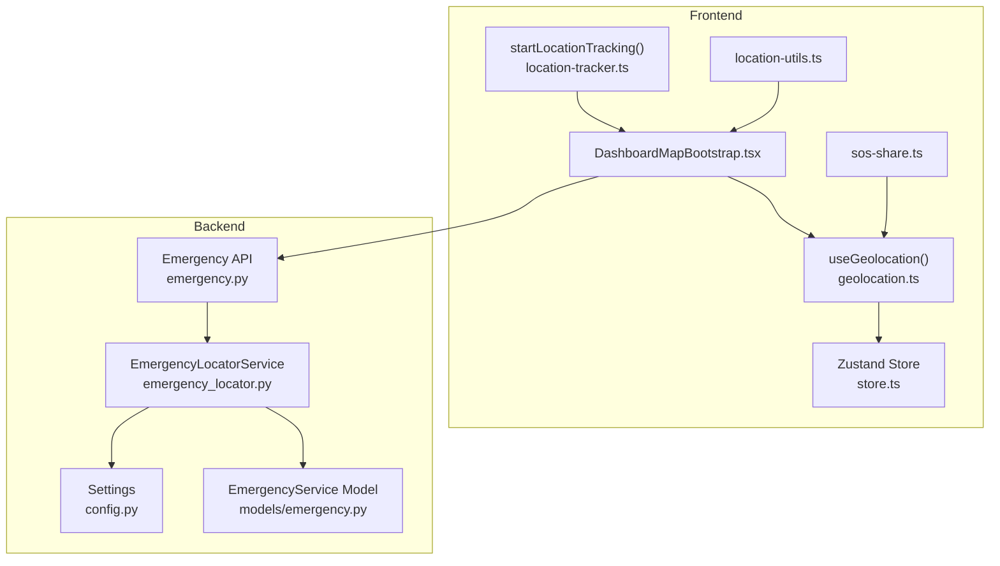
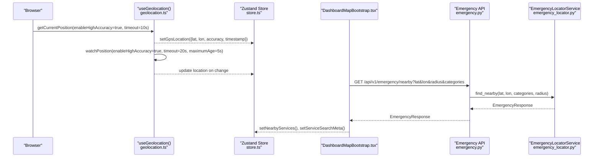
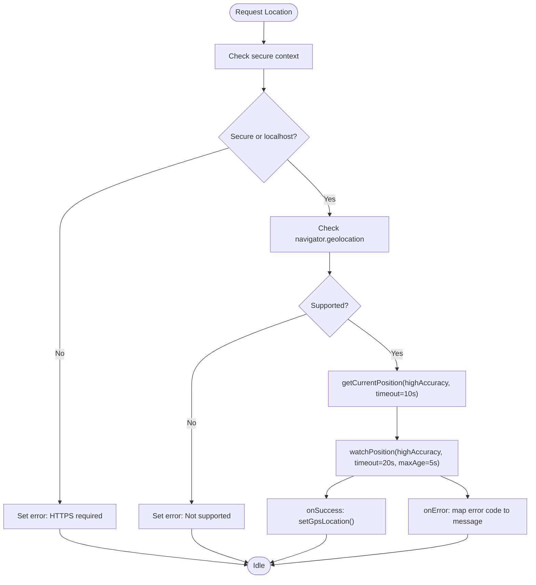
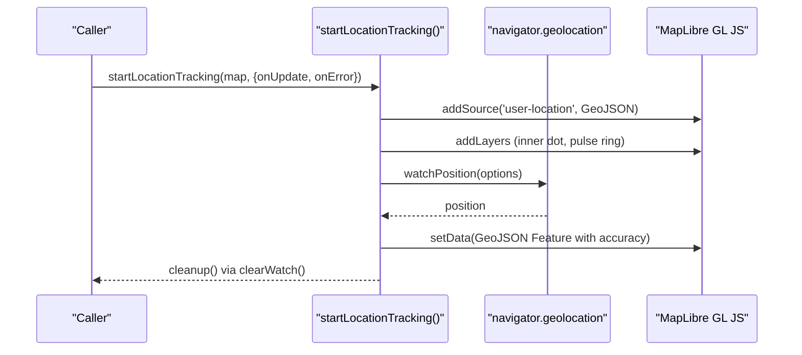
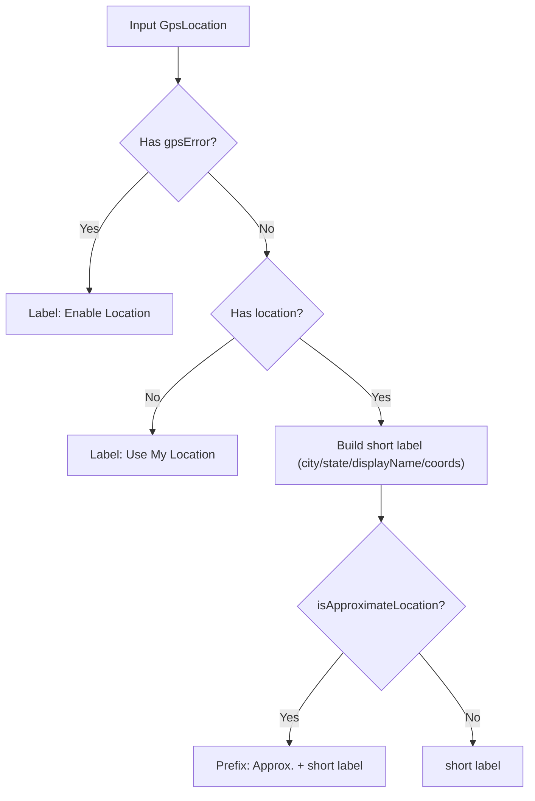
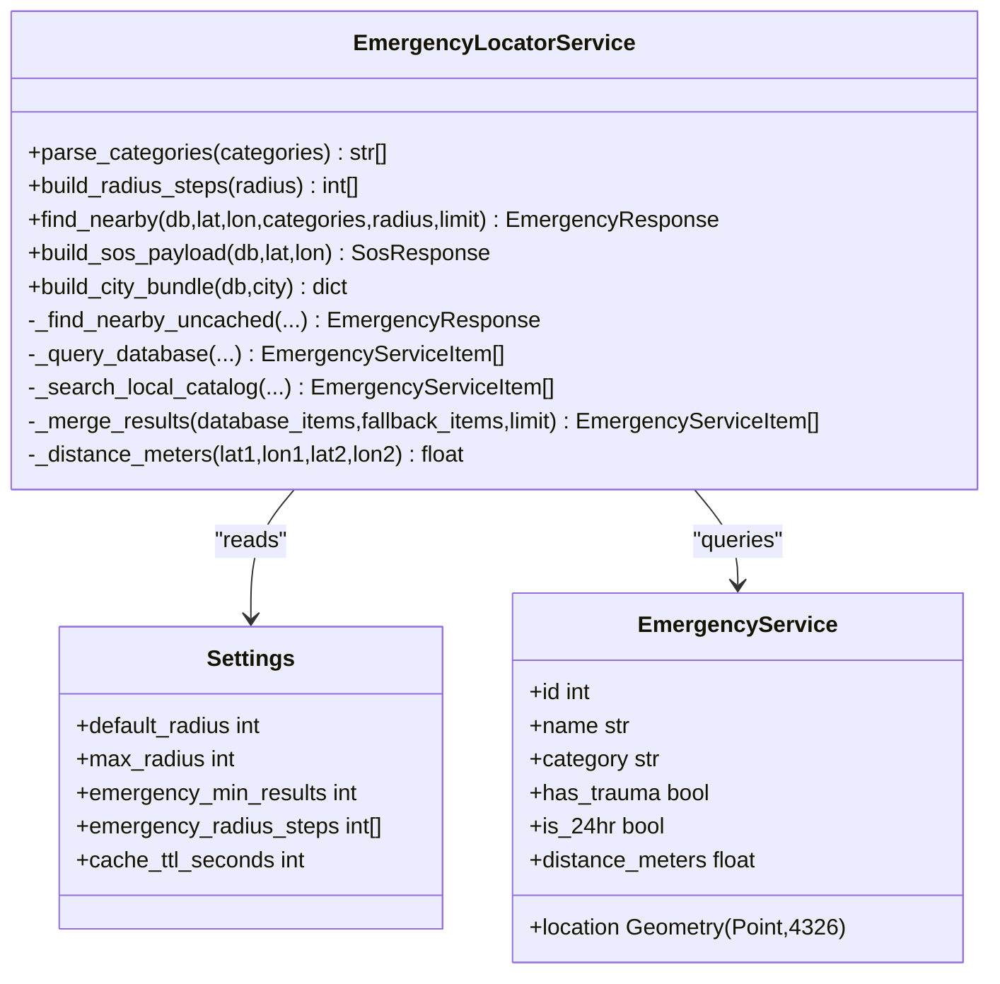
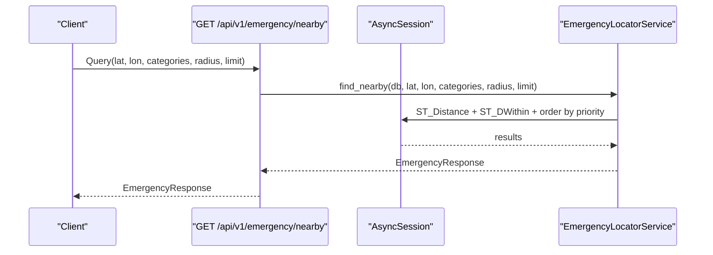
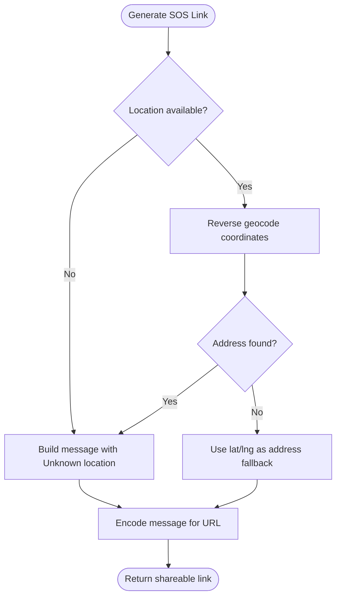
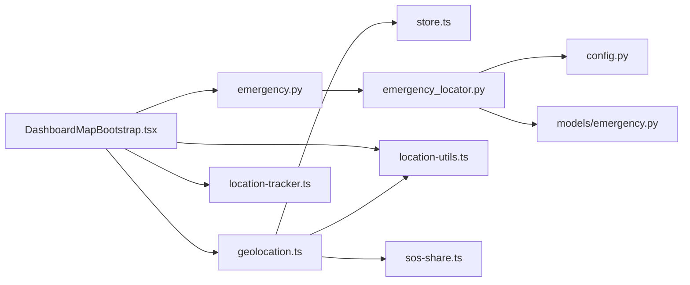

# GPS Location Detection System

<cite>
**Referenced Files in This Document**
- [geolocation.ts](file://frontend/lib/geolocation.ts)
- [location-tracker.ts](file://frontend/lib/location-tracker.ts)
- [location-utils.ts](file://frontend/lib/location-utils.ts)
- [store.ts](file://frontend/lib/store.ts)
- [DashboardMapBootstrap.tsx](file://frontend/components/dashboard/DashboardMapBootstrap.tsx)
- [emergency.ts](file://backend/api/v1/emergency.py)
- [emergency_locator.py](file://backend/services/emergency_locator.py)
- [emergency.py](file://backend/models/emergency.py)
- [config.py](file://backend/core/config.py)
- [sos-share.ts](file://frontend/lib/sos-share.ts)
- [maps-fallback.ts](file://frontend/lib/maps-fallback.ts)
</cite>

## Table of Contents
1. [Introduction](#introduction)
2. [Project Structure](#project-structure)
3. [Core Components](#core-components)
4. [Architecture Overview](#architecture-overview)
5. [Detailed Component Analysis](#detailed-component-analysis)
6. [Dependency Analysis](#dependency-analysis)
7. [Performance Considerations](#performance-considerations)
8. [Troubleshooting Guide](#troubleshooting-guide)
9. [Conclusion](#conclusion)

## Introduction
This document describes the GPS Location Detection System powering SafeVixAI’s real-time location awareness and emergency services discovery. It covers:
- Frontend GPS auto-detection with accuracy thresholds and permission handling
- Continuous location tracking and update intervals
- Location utilities for coordinate conversion, distance calculations, and proximity detection
- Backend emergency locator service that processes location requests and validates coordinates
- Technical specifications for GPS accuracy requirements, battery optimization strategies, and location permission handling
- Troubleshooting procedures for poor GPS reception scenarios

## Project Structure
The GPS and location system spans the frontend React application and the backend FastAPI service:
- Frontend: React hooks and utilities manage geolocation, accuracy validation, and map overlays
- Backend: FastAPI routes accept coordinates, validate ranges, and serve emergency services near a user’s location

**Diagram sources**
- [geolocation.ts:13-124](file://frontend/lib/geolocation.ts#L13-L124)
- [store.ts:4-226](file://frontend/lib/store.ts#L4-L226)
- [DashboardMapBootstrap.tsx:77-330](file://frontend/components/dashboard/DashboardMapBootstrap.tsx#L77-L330)
- [location-tracker.ts:8-66](file://frontend/lib/location-tracker.ts#L8-L66)
- [location-utils.ts:1-57](file://frontend/lib/location-utils.ts#L1-L57)
- [sos-share.ts:9-69](file://frontend/lib/sos-share.ts#L9-L69)
- [emergency.py:19-83](file://backend/api/v1/emergency.py#L19-L83)
- [emergency_locator.py:161-507](file://backend/services/emergency_locator.py#L161-L507)
- [config.py:11-181](file://backend/core/config.py#L11-L181)
- [emergency.py:12-45](file://backend/models/emergency.py#L12-L45)

**Section sources**
- [geolocation.ts:13-124](file://frontend/lib/geolocation.ts#L13-L124)
- [location-tracker.ts:8-66](file://frontend/lib/location-tracker.ts#L8-L66)
- [location-utils.ts:1-57](file://frontend/lib/location-utils.ts#L1-L57)
- [store.ts:4-226](file://frontend/lib/store.ts#L4-L226)
- [DashboardMapBootstrap.tsx:77-330](file://frontend/components/dashboard/DashboardMapBootstrap.tsx#L77-L330)
- [emergency.py:19-83](file://backend/api/v1/emergency.py#L19-L83)
- [emergency_locator.py:161-507](file://backend/services/emergency_locator.py#L161-L507)
- [emergency.py:12-45](file://backend/models/emergency.py#L12-L45)
- [config.py:11-181](file://backend/core/config.py#L11-L181)
- [sos-share.ts:9-69](file://frontend/lib/sos-share.ts#L9-L69)

## Core Components
- Frontend geolocation hook: Requests high-accuracy location with timeouts and permission checks; maintains state in a global store and watches updates continuously
- Location tracker: Adds a live dot overlay on the map and updates coordinates with a fixed interval
- Location utilities: Formats accuracy labels, detects approximate locations, and builds human-friendly labels
- Store: Defines the GPS location shape and exposes setters for location and errors
- Backend emergency locator: Accepts coordinates, validates ranges, and returns nearby emergency services with fallback strategies
- Configuration: Centralizes radius steps, limits, and caching TTL for robustness

**Section sources**
- [geolocation.ts:13-124](file://frontend/lib/geolocation.ts#L13-L124)
- [location-tracker.ts:8-66](file://frontend/lib/location-tracker.ts#L8-L66)
- [location-utils.ts:1-57](file://frontend/lib/location-utils.ts#L1-L57)
- [store.ts:4-226](file://frontend/lib/store.ts#L4-L226)
- [emergency_locator.py:161-507](file://backend/services/emergency_locator.py#L161-L507)
- [config.py:26-100](file://backend/core/config.py#L26-L100)

## Architecture Overview
The GPS system integrates frontend and backend:
- Frontend obtains a single high-accuracy position and then continuously watches for updates
- Dashboard hydrates services and road issues around the current location with progressive fallbacks
- Backend validates coordinates, applies radius steps, caches results, and merges database, local, and external sources

**Diagram sources**
- [geolocation.ts:30-108](file://frontend/lib/geolocation.ts#L30-L108)
- [store.ts:63-136](file://frontend/lib/store.ts#L63-L136)
- [DashboardMapBootstrap.tsx:171-300](file://frontend/components/dashboard/DashboardMapBootstrap.tsx#L171-L300)
- [emergency.py:19-40](file://backend/api/v1/emergency.py#L19-L40)
- [emergency_locator.py:187-217](file://backend/services/emergency_locator.py#L187-L217)

## Detailed Component Analysis

### Frontend GPS Auto-Detection and Accuracy Validation
- Permission and context checks: Requires secure context (HTTPS or localhost) and verifies browser geolocation support
- Single-shot acquisition: Uses high accuracy with a 10-second timeout and zero maximum age to avoid stale data
- Continuous watching: Watches position with extended timeout and 5-second maximum age to balance freshness and battery usage
- Error handling: Maps browser error codes to actionable messages and clears watchers on cleanup
- Accuracy threshold: A location is considered approximate if its accuracy exceeds a predefined threshold (used by UI formatting)

**Diagram sources**
- [geolocation.ts:30-108](file://frontend/lib/geolocation.ts#L30-L108)

**Section sources**
- [geolocation.ts:30-108](file://frontend/lib/geolocation.ts#L30-L108)
- [location-utils.ts:3,17-19](file://frontend/lib/location-utils.ts#L3,L17-L19)
- [store.ts:4,63-68](file://frontend/lib/store.ts#L4,L63-L68)

### Location Tracker Implementation
- Adds a GeoJSON source and concentric circle layers to visualize the user’s location and accuracy
- Updates the source data on each watched position and invokes optional callbacks
- Returns a cleanup function to clear the watcher

**Diagram sources**
- [location-tracker.ts:8-66](file://frontend/lib/location-tracker.ts#L8-L66)

**Section sources**
- [location-tracker.ts:8-66](file://frontend/lib/location-tracker.ts#L8-L66)

### Location Utilities: Coordinate Conversion, Distance, Proximity
- Approximate location detection: Flags a location as approximate if its accuracy meets or exceeds a threshold
- Accuracy labeling: Converts meters to kilometers for display and formats human-readable labels
- Location labeling: Builds short labels from city/state or coordinates; prefixes “Approx.” when accuracy is high
- Distance calculation: The backend computes distances using spherical trigonometry for merging and ranking

**Diagram sources**
- [location-utils.ts:33-56](file://frontend/lib/location-utils.ts#L33-L56)

**Section sources**
- [location-utils.ts:1-57](file://frontend/lib/location-utils.ts#L1-L57)
- [emergency_locator.py:468-479](file://backend/services/emergency_locator.py#L468-L479)

### Backend Emergency Locator Service
- Validates coordinates and categories, normalizes inputs, and constructs radius steps from configuration
- Caches responses keyed by coordinates, categories, and radius to reduce latency and load
- Searches in three tiers:
  1) Database with PostGIS geography and distance ordering
  2) Local catalog entries filtered by distance and category
  3) Overpass service as a fallback with graceful degradation
- Merges results, deduplicates by name/category/rounded coordinates, and sorts by priority (trauma availability, 24hr availability, distance)

**Diagram sources**
- [emergency_locator.py:161-507](file://backend/services/emergency_locator.py#L161-L507)
- [config.py:26-100](file://backend/core/config.py#L26-L100)
- [emergency.py:12-45](file://backend/models/emergency.py#L12-L45)

**Section sources**
- [emergency_locator.py:161-507](file://backend/services/emergency_locator.py#L161-L507)
- [config.py:26-100](file://backend/core/config.py#L26-L100)
- [emergency.py:12-45](file://backend/models/emergency.py#L12-L45)

### Backend API: Location Request Processing and Validation
- Exposes endpoints to discover nearby services, build SOS payloads, and fetch emergency numbers
- Validates latitude (-90..90), longitude (-180..180), radius (min 100, max 50000), and limit (1..50)
- Inserts SOS incidents into a table for audit and user-agent tracking

**Diagram sources**
- [emergency.py:19-40](file://backend/api/v1/emergency.py#L19-L40)
- [emergency_locator.py:187-217](file://backend/services/emergency_locator.py#L187-L217)

**Section sources**
- [emergency.py:19-83](file://backend/api/v1/emergency.py#L19-L83)

### SOS Sharing with Coordinates and Reverse Geocoding
- Generates pre-filled links for WhatsApp and SMS with coordinates and optional address derived from reverse geocoding
- Provides a synchronous variant for instant links without waiting for geocoding

**Diagram sources**
- [sos-share.ts:9-69](file://frontend/lib/sos-share.ts#L9-L69)

**Section sources**
- [sos-share.ts:9-69](file://frontend/lib/sos-share.ts#L9-L69)

## Dependency Analysis
- Frontend depends on:
  - Geolocation API for acquiring and watching positions
  - Zustand store for centralized state
  - MapLibre GL JS for live dot overlay
  - Reverse geocoding for human-readable labels
- Backend depends on:
  - SQLAlchemy async ORM and PostGIS for spatial queries
  - Redis cache for response caching
  - Overpass service for fallback emergency data
  - Pydantic settings for configuration

**Diagram sources**
- [geolocation.ts:13-124](file://frontend/lib/geolocation.ts#L13-L124)
- [store.ts:4-226](file://frontend/lib/store.ts#L4-L226)
- [DashboardMapBootstrap.tsx:77-330](file://frontend/components/dashboard/DashboardMapBootstrap.tsx#L77-L330)
- [location-utils.ts:1-57](file://frontend/lib/location-utils.ts#L1-L57)
- [location-tracker.ts:8-66](file://frontend/lib/location-tracker.ts#L8-L66)
- [emergency.py:19-83](file://backend/api/v1/emergency.py#L19-L83)
- [emergency_locator.py:161-507](file://backend/services/emergency_locator.py#L161-L507)
- [config.py:11-181](file://backend/core/config.py#L11-L181)
- [emergency.py:12-45](file://backend/models/emergency.py#L12-L45)
- [sos-share.ts:9-69](file://frontend/lib/sos-share.ts#L9-L69)

**Section sources**
- [geolocation.ts:13-124](file://frontend/lib/geolocation.ts#L13-L124)
- [DashboardMapBootstrap.tsx:77-330](file://frontend/components/dashboard/DashboardMapBootstrap.tsx#L77-L330)
- [emergency_locator.py:161-507](file://backend/services/emergency_locator.py#L161-L507)
- [config.py:11-181](file://backend/core/config.py#L11-L181)
- [emergency.py:12-45](file://backend/models/emergency.py#L12-L45)

## Performance Considerations
- Frontend
  - High-accuracy single-shot with short maximum age ensures fresh data without excessive polling
  - Continuous watch with moderate timeout and 5-second maximum age balances responsiveness and battery life
  - UI avoids unnecessary re-renders by updating only when the hydration key changes
- Backend
  - Radius steps progressively increase to minimize database scans and improve hit rates
  - Caching reduces repeated computation and network calls
  - PostGIS spatial indexing and distance expressions optimize queries
  - Fallback to Overpass is gated behind external service error handling

[No sources needed since this section provides general guidance]

## Troubleshooting Guide
- Common location detection issues
  - Permission denied: Prompt users to enable location in browser settings
  - Unavailable or timeout: Advise retrying or moving outdoors for better GPS reception
  - Mixed content errors: Ensure the site is served over HTTPS or run on localhost
- Accuracy limitations
  - Approximate locations: The UI flags locations with accuracy exceeding the threshold; rely on address geocoding for context
  - Indoor/outdoor reception: Use fallbacks like reverse geocoding and city bundles when GPS accuracy is poor
- Battery optimization strategies
  - Prefer watchPosition with reasonable maximumAge and timeout
  - Debounce UI updates and avoid frequent re-fetching of nearby services
  - Limit map overlays to essential layers during low-power modes
- Backend validation
  - Verify coordinates are within accepted ranges
  - Confirm categories are supported and radius does not exceed maximum
  - Inspect cache keys and TTL to diagnose stale or missing results

**Section sources**
- [geolocation.ts:63-71](file://frontend/lib/geolocation.ts#L63-L71)
- [location-utils.ts:17-19](file://frontend/lib/location-utils.ts#L17-L19)
- [DashboardMapBootstrap.tsx:131-158](file://frontend/components/dashboard/DashboardMapBootstrap.tsx#L131-L158)
- [emergency.py:20-26](file://backend/api/v1/emergency.py#L20-L26)
- [config.py:26-36](file://backend/core/config.py#L26-L36)

## Conclusion
The GPS Location Detection System combines robust frontend geolocation with resilient backend emergency discovery. It enforces accuracy-aware UX, optimizes for battery life, and provides fallback strategies for degraded environments. Together with SOS sharing and caching, it delivers reliable location-based services for emergency scenarios.