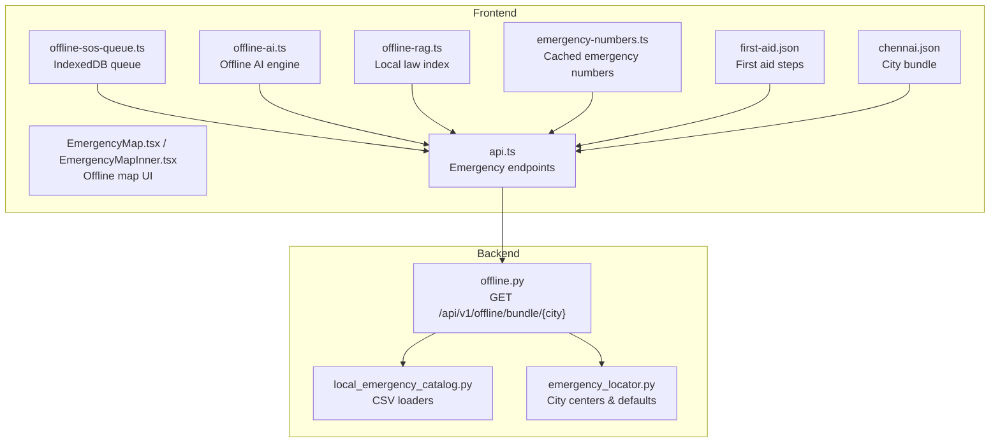
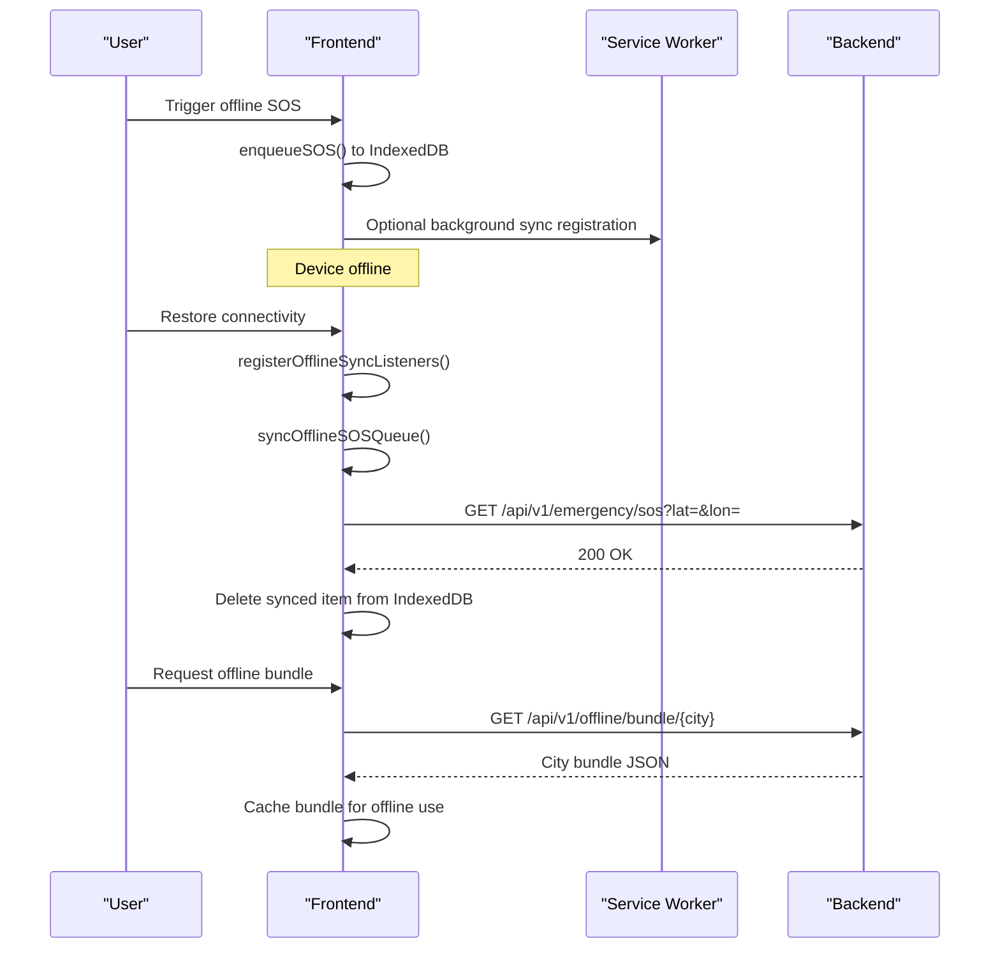
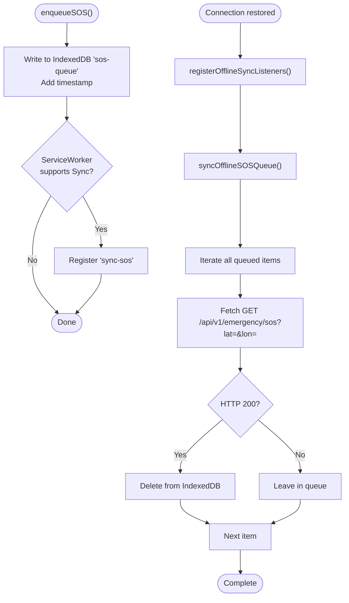
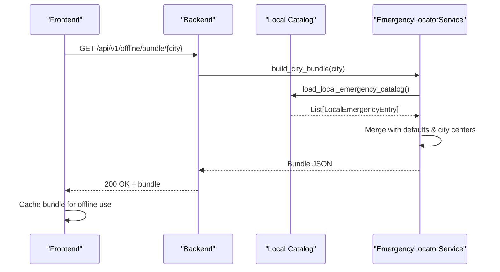
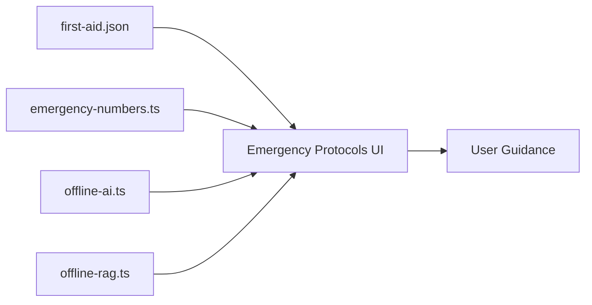
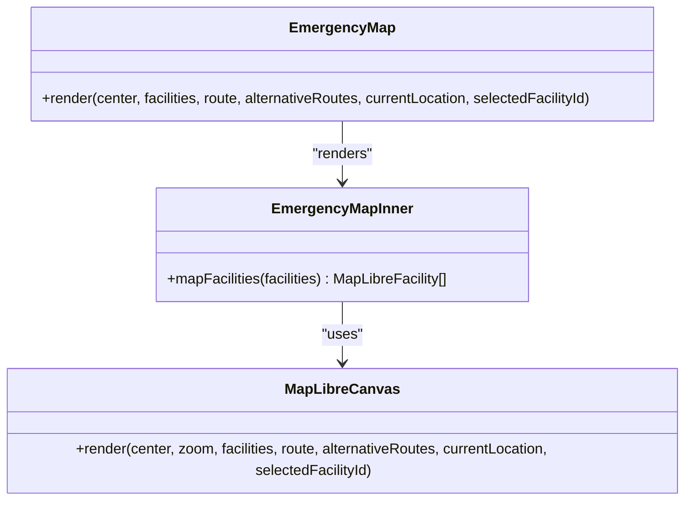
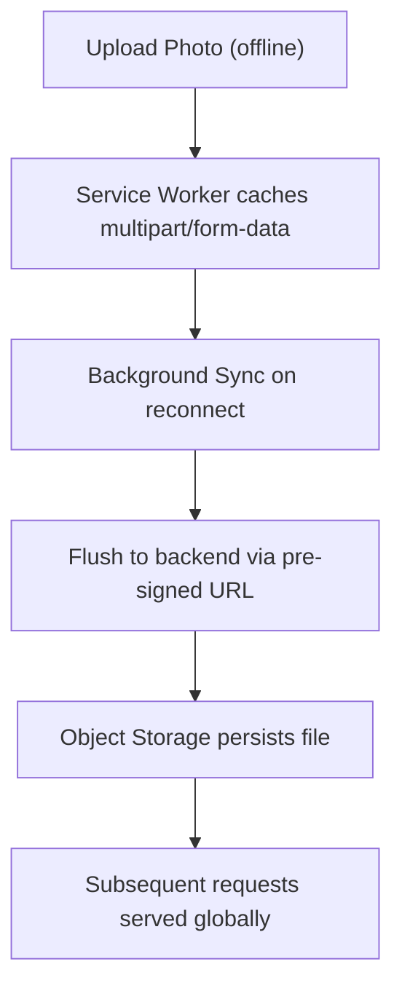
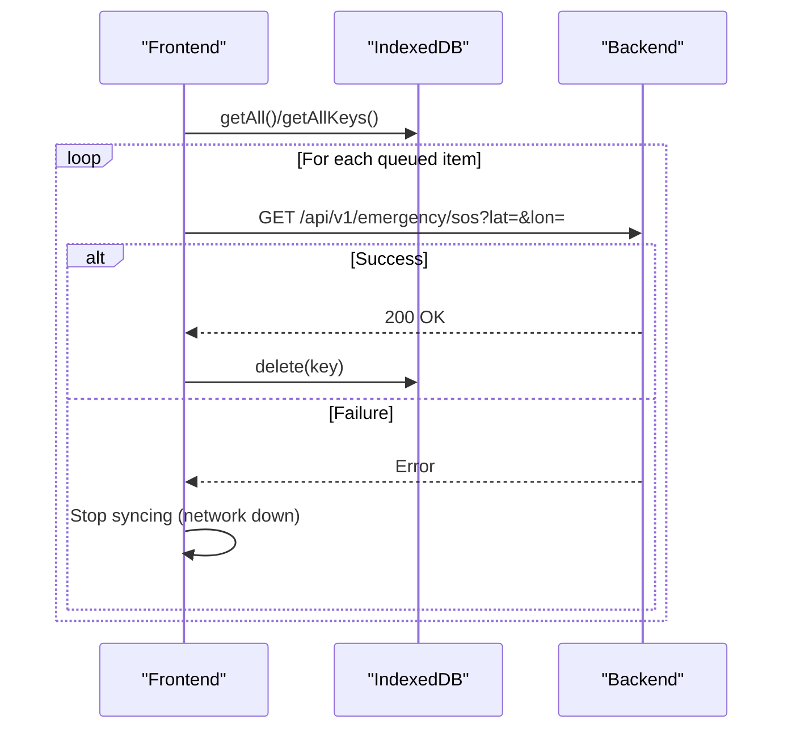
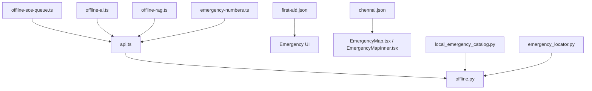

# Offline Emergency Capabilities

<cite>
**Referenced Files in This Document**
- [Offline_Architecture.md](file://docs/Offline_Architecture.md)
- [offline-sos-queue.ts](file://frontend/lib/offline-sos-queue.ts)
- [offline-ai.ts](file://frontend/lib/offline-ai.ts)
- [offline-rag.ts](file://frontend/lib/offline-rag.ts)
- [emergency-numbers.ts](file://frontend/lib/emergency-numbers.ts)
- [emergency-numbers.json](file://frontend/public/offline-data/state_overrides.csv)
- [first-aid.json](file://frontend/public/offline-data/first-aid.json)
- [chennai.json](file://frontend/public/offline-data/chennai.json)
- [offline.py](file://backend/api/v1/offline.py)
- [local_emergency_catalog.py](file://backend/services/local_emergency_catalog.py)
- [emergency_locator.py](file://backend/services/emergency_locator.py)
- [api.ts](file://frontend/lib/api.ts)
- [EmergencyMap.tsx](file://frontend/components/EmergencyMap.tsx)
- [EmergencyMapInner.tsx](file://frontend/components/EmergencyMapInner.tsx)
- [page.tsx](file://frontend/app/emergency/page.tsx)
</cite>

## Table of Contents
1. [Introduction](#introduction)
2. [Project Structure](#project-structure)
3. [Core Components](#core-components)
4. [Architecture Overview](#architecture-overview)
5. [Detailed Component Analysis](#detailed-component-analysis)
6. [Dependency Analysis](#dependency-analysis)
7. [Performance Considerations](#performance-considerations)
8. [Troubleshooting Guide](#troubleshooting-guide)
9. [Conclusion](#conclusion)
10. [Appendices](#appendices)

## Introduction
This document details the Offline Emergency Capabilities of the system with a focus on emergency functionality without internet connectivity. It covers the offline SOS queue, offline data bundling for 25 major Indian cities, offline-first architecture, emergency protocols and first aid guidance, service worker caching, synchronization when connectivity is restored, offline storage limits, emergency data refresh strategies, offline emergency map functionality, local emergency service discovery, and user guidance for offline emergency scenarios.

## Project Structure
The offline emergency system spans both frontend and backend components:
- Frontend: offline SOS queue, offline AI engine, offline RAG, emergency numbers, first aid content, offline city bundles, and map rendering.
- Backend: offline bundle generation endpoint and local emergency catalog ingestion.

**Diagram sources**
- [offline-sos-queue.ts:1-138](file://frontend/lib/offline-sos-queue.ts#L1-L138)
- [offline-ai.ts:1-256](file://frontend/lib/offline-ai.ts#L1-L256)
- [offline-rag.ts:1-35](file://frontend/lib/offline-rag.ts#L1-L35)
- [emergency-numbers.ts:1-124](file://frontend/lib/emergency-numbers.ts#L1-L124)
- [first-aid.json:1-388](file://frontend/public/offline-data/first-aid.json#L1-L388)
- [chennai.json:1-800](file://frontend/public/offline-data/chennai.json#L1-L800)
- [EmergencyMap.tsx:1-58](file://frontend/components/EmergencyMap.tsx#L1-L58)
- [EmergencyMapInner.tsx:1-83](file://frontend/components/EmergencyMapInner.tsx#L1-L83)
- [api.ts:623-671](file://frontend/lib/api.ts#L623-L671)
- [offline.py:1-28](file://backend/api/v1/offline.py#L1-L28)
- [local_emergency_catalog.py:1-243](file://backend/services/local_emergency_catalog.py#L1-L243)
- [emergency_locator.py:83-129](file://backend/services/emergency_locator.py#L83-L129)

**Section sources**
- [offline-sos-queue.ts:1-138](file://frontend/lib/offline-sos-queue.ts#L1-L138)
- [offline-ai.ts:1-256](file://frontend/lib/offline-ai.ts#L1-L256)
- [offline-rag.ts:1-35](file://frontend/lib/offline-rag.ts#L1-L35)
- [emergency-numbers.ts:1-124](file://frontend/lib/emergency-numbers.ts#L1-L124)
- [first-aid.json:1-388](file://frontend/public/offline-data/first-aid.json#L1-L388)
- [chennai.json:1-800](file://frontend/public/offline-data/chennai.json#L1-L800)
- [EmergencyMap.tsx:1-58](file://frontend/components/EmergencyMap.tsx#L1-L58)
- [EmergencyMapInner.tsx:1-83](file://frontend/components/EmergencyMapInner.tsx#L1-L83)
- [api.ts:623-671](file://frontend/lib/api.ts#L623-L671)
- [offline.py:1-28](file://backend/api/v1/offline.py#L1-L28)
- [local_emergency_catalog.py:1-243](file://backend/services/local_emergency_catalog.py#L1-L243)
- [emergency_locator.py:83-129](file://backend/services/emergency_locator.py#L83-L129)

## Core Components
- Offline SOS Queue: Stores emergency requests locally and syncs when online.
- Offline AI Engine: Provides offline-first AI responses with fallbacks.
- Offline RAG: Local legal citation retrieval for MV Act.
- Emergency Numbers: Cached national/state emergency numbers.
- First Aid Content: Preloaded first aid guidance.
- City Bundles: Offline data for 25 major Indian cities.
- Emergency Locator Service: Builds offline bundles and merges local catalogs.
- Emergency Map: Renders offline emergency services on a map UI.

**Section sources**
- [offline-sos-queue.ts:1-138](file://frontend/lib/offline-sos-queue.ts#L1-L138)
- [offline-ai.ts:1-256](file://frontend/lib/offline-ai.ts#L1-L256)
- [offline-rag.ts:1-35](file://frontend/lib/offline-rag.ts#L1-L35)
- [emergency-numbers.ts:1-124](file://frontend/lib/emergency-numbers.ts#L1-L124)
- [first-aid.json:1-388](file://frontend/public/offline-data/first-aid.json#L1-L388)
- [chennai.json:1-800](file://frontend/public/offline-data/chennai.json#L1-L800)
- [offline.py:1-28](file://backend/api/v1/offline.py#L1-L28)
- [local_emergency_catalog.py:1-243](file://backend/services/local_emergency_catalog.py#L1-L243)
- [EmergencyMap.tsx:1-58](file://frontend/components/EmergencyMap.tsx#L1-L58)
- [EmergencyMapInner.tsx:1-83](file://frontend/components/EmergencyMapInner.tsx#L1-L83)

## Architecture Overview
The offline emergency architecture prioritizes local resources and cached data. When offline, the frontend uses IndexedDB for SOS queue persistence, offline AI engines, cached emergency numbers, first aid content, and city-specific bundles. When connectivity is restored, the system syncs queued SOS events and refreshes data via backend-generated bundles.

**Diagram sources**
- [offline-sos-queue.ts:48-124](file://frontend/lib/offline-sos-queue.ts#L48-L124)
- [offline.py:18-27](file://backend/api/v1/offline.py#L18-L27)
- [api.ts:638-647](file://frontend/lib/api.ts#L638-L647)

**Section sources**
- [Offline_Architecture.md:1-23](file://docs/Offline_Architecture.md#L1-L23)
- [offline-sos-queue.ts:1-138](file://frontend/lib/offline-sos-queue.ts#L1-L138)
- [offline.py:1-28](file://backend/api/v1/offline.py#L1-L28)
- [api.ts:623-671](file://frontend/lib/api.ts#L623-L671)

## Detailed Component Analysis

### Offline SOS Queue
- Purpose: Persist emergency requests when offline and flush them upon connectivity restoration.
- Implementation highlights:
  - IndexedDB store named “sos-queue” with auto-increment key and timestamp index.
  - enqueueSOS adds a record with lat/lon, optional user info, and ISO timestamp.
  - syncOfflineSOSQueue iterates stored items, sends GET requests to backend SOS endpoint, and deletes successful transmissions.
  - registerOfflineSyncListeners triggers sync on “online” event.
  - Optional background sync registration via ServiceWorker SyncManager.

**Diagram sources**
- [offline-sos-queue.ts:25-137](file://frontend/lib/offline-sos-queue.ts#L25-L137)

**Section sources**
- [offline-sos-queue.ts:1-138](file://frontend/lib/offline-sos-queue.ts#L1-L138)

### Offline Data Bundling Strategy (25 Major Indian Cities)
- Endpoint: GET /api/v1/offline/bundle/{city}
- Backend service: EmergencyLocatorService.build_city_bundle(...) delegates to local catalog loaders and merges with defaults.
- Local catalog ingestion:
  - CSV-based loaders for hospitals and generic emergency services.
  - Coordinate parsing, address joining, and feature flags (trauma/icu/24hr).
- City centers and defaults:
  - OFFLINE_CITY_CENTERS defines offline city centers for bundling.
  - DEFAULT_EMERGENCY_NUMBERS_DATA provides default emergency numbers.
- Frontend consumption:
  - City bundles are cached locally (e.g., chennai.json) and used for offline map and service discovery.

**Diagram sources**
- [offline.py:18-27](file://backend/api/v1/offline.py#L18-L27)
- [local_emergency_catalog.py:25-34](file://backend/services/local_emergency_catalog.py#L25-L34)
- [emergency_locator.py:89-115](file://backend/services/emergency_locator.py#L89-L115)

**Section sources**
- [offline.py:1-28](file://backend/api/v1/offline.py#L1-L28)
- [local_emergency_catalog.py:1-243](file://backend/services/local_emergency_catalog.py#L1-L243)
- [emergency_locator.py:83-129](file://backend/services/emergency_locator.py#L83-L129)
- [chennai.json:1-800](file://frontend/public/offline-data/chennai.json#L1-L800)

### Offline-First Architecture and Emergency Protocols
- Offline-first priorities:
  - Emergency protocols and first aid guidance are preloaded (first-aid.json).
  - Emergency numbers are cached (emergency-numbers.ts).
  - Offline AI engine provides deterministic responses and keyword fallback.
  - Offline RAG simulates local legal citations.
- User guidance:
  - Emergency page presents step-by-step protocols with call-to-action numbers.
  - Offline readiness indicators and tactical UI reinforce offline capability.

**Diagram sources**
- [page.tsx:36-107](file://frontend/app/emergency/page.tsx#L36-L107)
- [first-aid.json:1-388](file://frontend/public/offline-data/first-aid.json#L1-L388)
- [emergency-numbers.ts:1-124](file://frontend/lib/emergency-numbers.ts#L1-L124)
- [offline-ai.ts:1-256](file://frontend/lib/offline-ai.ts#L1-L256)
- [offline-rag.ts:1-35](file://frontend/lib/offline-rag.ts#L1-L35)

**Section sources**
- [page.tsx:1-418](file://frontend/app/emergency/page.tsx#L1-L418)
- [first-aid.json:1-388](file://frontend/public/offline-data/first-aid.json#L1-L388)
- [emergency-numbers.ts:1-124](file://frontend/lib/emergency-numbers.ts#L1-L124)
- [offline-ai.ts:1-256](file://frontend/lib/offline-ai.ts#L1-L256)
- [offline-rag.ts:1-35](file://frontend/lib/offline-rag.ts#L1-L35)

### Offline Emergency Map Functionality
- Map UI:
  - EmergencyMap renders a dynamic map component.
  - EmergencyMapInner maps facility types to icons and displays routes and current location.
- Offline data:
  - City bundles (e.g., chennai.json) include services with coordinates, categories, and flags.
- Integration:
  - Facilities array passed to EmergencyMapInner is transformed to MapLibreFacility records for rendering.

**Diagram sources**
- [EmergencyMap.tsx:25-57](file://frontend/components/EmergencyMap.tsx#L25-L57)
- [EmergencyMapInner.tsx:44-82](file://frontend/components/EmergencyMapInner.tsx#L44-L82)

**Section sources**
- [EmergencyMap.tsx:1-58](file://frontend/components/EmergencyMap.tsx#L1-L58)
- [EmergencyMapInner.tsx:1-83](file://frontend/components/EmergencyMapInner.tsx#L1-L83)
- [chennai.json:1-800](file://frontend/public/offline-data/chennai.json#L1-L800)

### Service Worker Implementation for Caching Critical Emergency Data
- Current state:
  - Offline metadata (queued SOS events and cached chat logs) is managed in the browser using IndexedDB.
  - When offline, multipart form data for uploads is cached using service workers (via Workbox background sync).
  - On reconnect, posthog-js queue and offline SOS queue flush payloads to the backend.
- Enterprise-scale concerns:
  - Ephemeral disks on Render can lose locally saved images.
  - Distributed processing across workers can cause 404s for images uploaded to a different worker.
- Proposed solution:
  - Use AWS S3 or Supabase Storage with pre-signed URLs for stateless, globally persisted uploads.
  - Use Supabase Realtime/Postgres logical replication to synchronize offline queues on reconnect with built-in conflict resolution.

**Diagram sources**
- [Offline_Architecture.md:3-23](file://docs/Offline_Architecture.md#L3-L23)

**Section sources**
- [Offline_Architecture.md:1-23](file://docs/Offline_Architecture.md#L1-L23)

### Data Synchronization When Connectivity Is Restored
- SOS queue:
  - syncOfflineSOSQueue iterates all queued items and attempts transmission.
  - On HTTP 200, the item is deleted from IndexedDB.
  - On network error, the loop stops to avoid retry storms.
- Bundle refresh:
  - Frontend requests GET /api/v1/offline/bundle/{city} to refresh cached city data.
  - City bundles include emergency services, coordinates, and flags for offline map rendering.

**Diagram sources**
- [offline-sos-queue.ts:75-124](file://frontend/lib/offline-sos-queue.ts#L75-L124)
- [api.ts:638-647](file://frontend/lib/api.ts#L638-L647)

**Section sources**
- [offline-sos-queue.ts:75-124](file://frontend/lib/offline-sos-queue.ts#L75-L124)
- [offline.py:18-27](file://backend/api/v1/offline.py#L18-L27)
- [api.ts:638-647](file://frontend/lib/api.ts#L638-L647)

### Offline Storage Limits and Refresh Strategies
- IndexedDB:
  - sos-queue store uses auto-increment key and timestamp index; no explicit upper bound is enforced in code.
  - Items are removed after successful sync; network failures halt iteration to prevent accumulation.
- City Bundles:
  - Frontend caches city bundles (e.g., chennai.json) for offline use.
  - Refresh via GET /api/v1/offline/bundle/{city} when connectivity is restored.
- Emergency Numbers and First Aid:
  - Cached in frontend modules and JSON files; refreshed on demand or via application lifecycle.

**Section sources**
- [offline-sos-queue.ts:12-42](file://frontend/lib/offline-sos-queue.ts#L12-L42)
- [offline.py:18-27](file://backend/api/v1/offline.py#L18-L27)
- [emergency-numbers.ts:1-124](file://frontend/lib/emergency-numbers.ts#L1-L124)
- [first-aid.json:1-388](file://frontend/public/offline-data/first-aid.json#L1-L388)

### Local Emergency Service Discovery
- Local catalog:
  - load_local_emergency_catalog aggregates CSV sources for hospitals and generic emergency services.
  - _load_hospital_directory and _load_nin_facilities parse coordinates, addresses, and flags.
- EmergencyLocatorService:
  - OFFLINE_CITY_CENTERS provides offline city centers.
  - DEFAULT_EMERGENCY_NUMBERS_DATA supplies default emergency numbers.
- Frontend integration:
  - City bundles include services with lat/lon, category, phone, address, and flags.
  - Map UI renders services with appropriate icons and distances.

**Section sources**
- [local_emergency_catalog.py:25-243](file://backend/services/local_emergency_catalog.py#L25-L243)
- [emergency_locator.py:89-129](file://backend/services/emergency_locator.py#L89-L129)
- [EmergencyMapInner.tsx:12-22](file://frontend/components/EmergencyMapInner.tsx#L12-L22)
- [chennai.json:1-800](file://frontend/public/offline-data/chennai.json#L1-L800)

### User Guidance for Offline Emergency Scenarios
- Emergency Protocols:
  - Step-by-step guidance for CPR, severe bleeding, fire, and road accidents.
  - Prominent call-to-action numbers (112, 108, 101, 100).
- Offline Readiness:
  - UI indicates offline readiness and satellite lock status.
  - Tactical filters and categories help users quickly access relevant protocols.

**Section sources**
- [page.tsx:36-107](file://frontend/app/emergency/page.tsx#L36-L107)

## Dependency Analysis
The offline emergency system exhibits clear separation of concerns:
- Frontend depends on backend endpoints for bundle generation and SOS submission.
- Backend depends on local catalog loaders and default configurations.
- Map UI depends on city bundles for rendering services.

**Diagram sources**
- [api.ts:623-671](file://frontend/lib/api.ts#L623-L671)
- [offline.py:1-28](file://backend/api/v1/offline.py#L1-L28)
- [offline-sos-queue.ts:1-138](file://frontend/lib/offline-sos-queue.ts#L1-L138)
- [offline-ai.ts:1-256](file://frontend/lib/offline-ai.ts#L1-L256)
- [offline-rag.ts:1-35](file://frontend/lib/offline-rag.ts#L1-L35)
- [emergency-numbers.ts:1-124](file://frontend/lib/emergency-numbers.ts#L1-L124)
- [first-aid.json:1-388](file://frontend/public/offline-data/first-aid.json#L1-L388)
- [chennai.json:1-800](file://frontend/public/offline-data/chennai.json#L1-L800)
- [EmergencyMap.tsx:1-58](file://frontend/components/EmergencyMap.tsx#L1-L58)
- [EmergencyMapInner.tsx:1-83](file://frontend/components/EmergencyMapInner.tsx#L1-L83)
- [local_emergency_catalog.py:1-243](file://backend/services/local_emergency_catalog.py#L1-L243)
- [emergency_locator.py:83-129](file://backend/services/emergency_locator.py#L83-L129)

**Section sources**
- [api.ts:623-671](file://frontend/lib/api.ts#L623-L671)
- [offline.py:1-28](file://backend/api/v1/offline.py#L1-L28)
- [offline-sos-queue.ts:1-138](file://frontend/lib/offline-sos-queue.ts#L1-L138)
- [offline-ai.ts:1-256](file://frontend/lib/offline-ai.ts#L1-L256)
- [offline-rag.ts:1-35](file://frontend/lib/offline-rag.ts#L1-L35)
- [emergency-numbers.ts:1-124](file://frontend/lib/emergency-numbers.ts#L1-L124)
- [first-aid.json:1-388](file://frontend/public/offline-data/first-aid.json#L1-L388)
- [chennai.json:1-800](file://frontend/public/offline-data/chennai.json#L1-L800)
- [EmergencyMap.tsx:1-58](file://frontend/components/EmergencyMap.tsx#L1-L58)
- [EmergencyMapInner.tsx:1-83](file://frontend/components/EmergencyMapInner.tsx#L1-L83)
- [local_emergency_catalog.py:1-243](file://backend/services/local_emergency_catalog.py#L1-L243)
- [emergency_locator.py:83-129](file://backend/services/emergency_locator.py#L83-L129)

## Performance Considerations
- IndexedDB throughput: Batch operations are sequential; consider transaction batching for large queues.
- Model downloads: Transformers.js Gemma 4 E2B (~1.3GB) is cached in browser cache storage; prefer user-initiated downloads to avoid background bandwidth usage.
- Map rendering: Use memoization and selective updates for facility lists to minimize re-renders.
- Bundle size: Compress city bundles and lazy-load only the active city’s data.

## Troubleshooting Guide
- SOS sync fails repeatedly:
  - Verify network connectivity and backend availability.
  - Check IndexedDB entries; items remain if HTTP errors occur.
- Service worker background sync not triggering:
  - Confirm browser support and registration success.
  - Inspect browser devtools for sync registration errors.
- City bundle missing services:
  - Ensure GET /api/v1/offline/bundle/{city} returns 200 and includes expected services.
  - Validate local catalog CSVs and coordinate parsing.
- Offline AI not responding:
  - Confirm getOfflineAI() initialization and status checks.
  - Verify fallback keyword responses when model is unavailable.

**Section sources**
- [offline-sos-queue.ts:75-124](file://frontend/lib/offline-sos-queue.ts#L75-L124)
- [offline-ai.ts:124-154](file://frontend/lib/offline-ai.ts#L124-L154)
- [offline.py:18-27](file://backend/api/v1/offline.py#L18-L27)
- [local_emergency_catalog.py:180-226](file://backend/services/local_emergency_catalog.py#L180-L226)

## Conclusion
The Offline Emergency Capabilities leverage an offline-first design to ensure reliable emergency support without connectivity. The SOS queue, offline AI, cached emergency numbers, first aid content, city bundles, and map UI work together to provide actionable guidance and local resource discovery. The backend’s offline bundle endpoint and local catalog loaders enable scalable, stateless offline data distribution. Future enhancements include secure, globally persisted uploads and robust queue synchronization via Supabase Realtime.

## Appendices
- Emergency Numbers Reference:
  - National Emergency: 112
  - Ambulance: 102
  - Police: 100
  - Fire: 101
  - Medical Emergency: 108
  - National Highway: 1033
  - State Highway: 1073
  - Health Helpline: 104
  - Women Helpline: 1091
  - Child Helpline: 1098
  - Disaster Management: 1099
  - AIIMS Trauma: 011-26588500
  - CPGRAMS: 1800-11-0012

**Section sources**
- [emergency-numbers.ts:10-124](file://frontend/lib/emergency-numbers.ts#L10-L124)