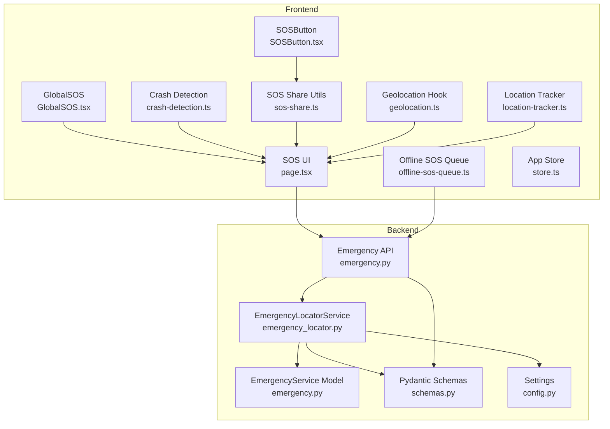
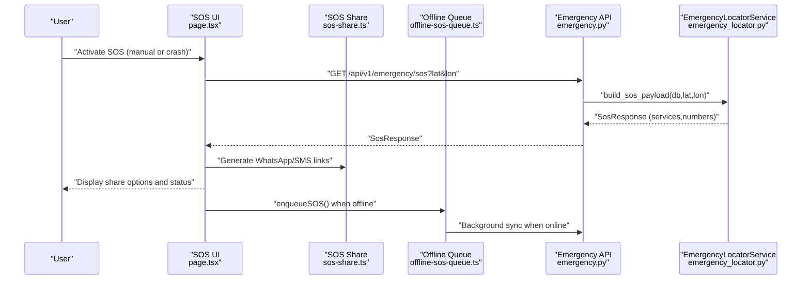
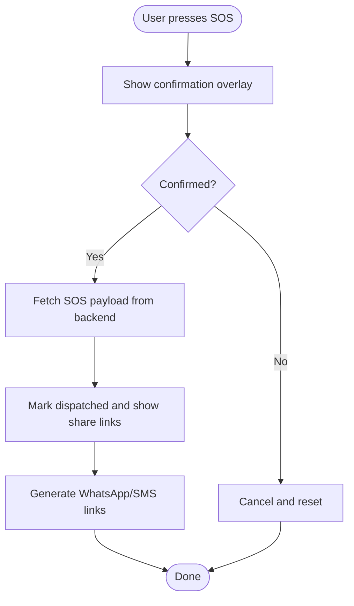
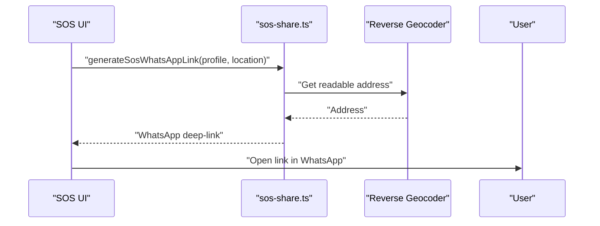
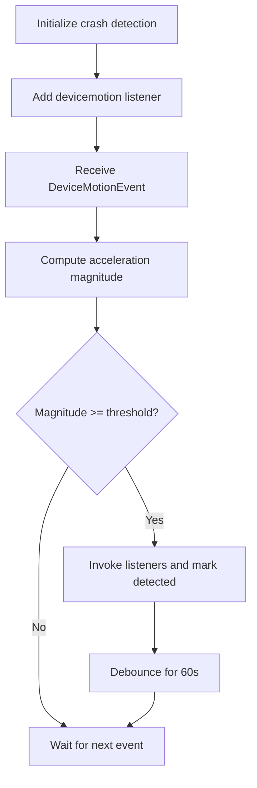
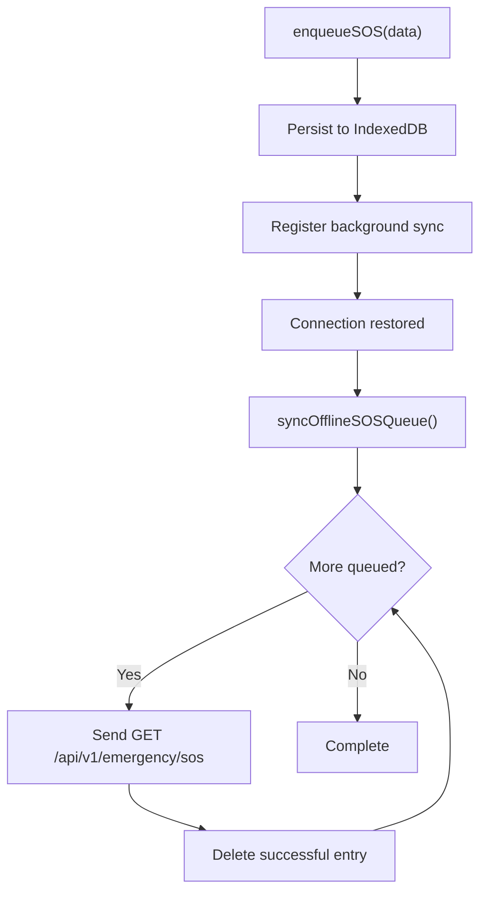
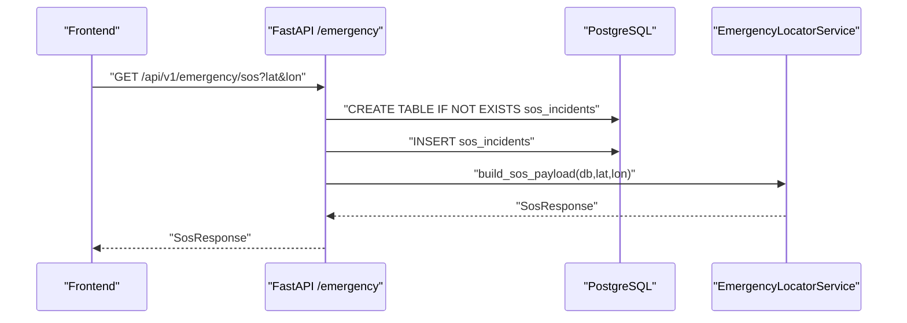
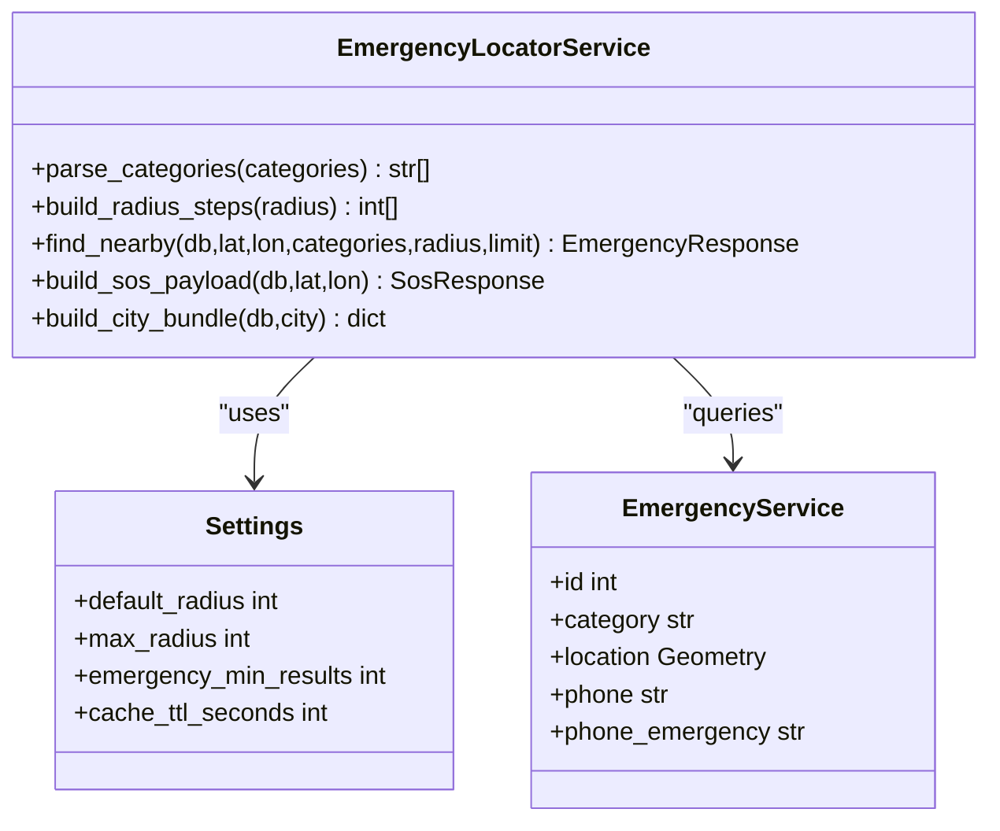
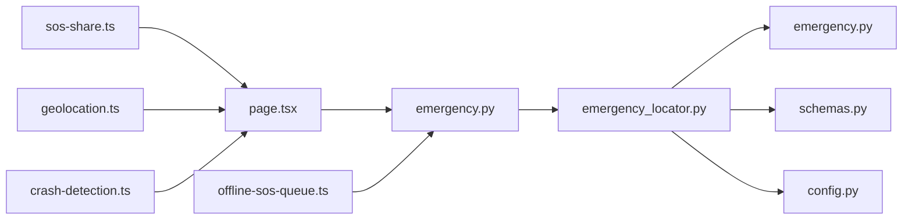

# SOS Sharing and Communication

<cite>
**Referenced Files in This Document**
- [emergency.py](file://backend/api/v1/emergency.py)
- [emergency_locator.py](file://backend/services/emergency_locator.py)
- [emergency.py](file://backend/models/emergency.py)
- [schemas.py](file://backend/models/schemas.py)
- [config.py](file://backend/core/config.py)
- [SOSButton.tsx](file://frontend/components/SOSButton.tsx)
- [GlobalSOS.tsx](file://frontend/components/GlobalSOS.tsx)
- [page.tsx](file://frontend/app/sos/page.tsx)
- [crash-detection.ts](file://frontend/lib/crash-detection.ts)
- [offline-sos-queue.ts](file://frontend/lib/offline-sos-queue.ts)
- [sos-share.ts](file://frontend/lib/sos-share.ts)
- [store.ts](file://frontend/lib/store.ts)
- [geolocation.ts](file://frontend/lib/geolocation.ts)
- [location-tracker.ts](file://frontend/lib/location-tracker.ts)
</cite>

## Table of Contents
1. [Introduction](#introduction)
2. [Project Structure](#project-structure)
3. [Core Components](#core-components)
4. [Architecture Overview](#architecture-overview)
5. [Detailed Component Analysis](#detailed-component-analysis)
6. [Dependency Analysis](#dependency-analysis)
7. [Performance Considerations](#performance-considerations)
8. [Troubleshooting Guide](#troubleshooting-guide)
9. [Conclusion](#conclusion)

## Introduction
This document describes the SOS Sharing and Communication system designed for emergency notification and coordination. It covers the SOS activation mechanisms (manual and automatic), SOS sharing via WhatsApp and SMS, crash detection for autonomous SOS triggering, offline SOS queuing, backend SOS processing endpoints, and integration with emergency response systems. It also documents technical specifications for alert protocols, notification delivery guarantees, fallback methods, user confirmation prompts, location accuracy requirements, and integration touchpoints with emergency services.

## Project Structure
The SOS system spans frontend React components and libraries, and a FastAPI backend service:
- Frontend:
  - SOS activation UI and global SOS trigger
  - Crash detection using DeviceMotion sensors
  - Offline SOS queue with IndexedDB and background sync
  - SOS sharing utilities for WhatsApp and SMS
  - Location services and store for GPS and user profile
- Backend:
  - Emergency API endpoints for SOS payload generation and nearby services
  - EmergencyLocatorService orchestrating emergency data sources
  - SQLAlchemy models for emergency services
  - Pydantic schemas for API responses

**Diagram sources**
- [page.tsx:14-343](file://frontend/app/sos/page.tsx#L14-L343)
- [SOSButton.tsx:13-126](file://frontend/components/SOSButton.tsx#L13-L126)
- [GlobalSOS.tsx:7-56](file://frontend/components/GlobalSOS.tsx#L7-L56)
- [crash-detection.ts:51-83](file://frontend/lib/crash-detection.ts#L51-L83)
- [offline-sos-queue.ts:25-42](file://frontend/lib/offline-sos-queue.ts#L25-L42)
- [sos-share.ts:9-35](file://frontend/lib/sos-share.ts#L9-L35)
- [store.ts:129-225](file://frontend/lib/store.ts#L129-L225)
- [geolocation.ts:13-124](file://frontend/lib/geolocation.ts#L13-L124)
- [location-tracker.ts:8-66](file://frontend/lib/location-tracker.ts#L8-L66)
- [emergency.py:12-83](file://backend/api/v1/emergency.py#L12-L83)
- [emergency_locator.py:161-507](file://backend/services/emergency_locator.py#L161-L507)
- [emergency.py:12-45](file://backend/models/emergency.py#L12-L45)
- [schemas.py:26-66](file://backend/models/schemas.py#L26-L66)
- [config.py:26-36](file://backend/core/config.py#L26-L36)

**Section sources**
- [emergency.py:12-83](file://backend/api/v1/emergency.py#L12-L83)
- [emergency_locator.py:161-507](file://backend/services/emergency_locator.py#L161-L507)
- [emergency.py:12-45](file://backend/models/emergency.py#L12-L45)
- [schemas.py:26-66](file://backend/models/schemas.py#L26-L66)
- [config.py:26-36](file://backend/core/config.py#L26-L36)
- [SOSButton.tsx:13-126](file://frontend/components/SOSButton.tsx#L13-L126)
- [GlobalSOS.tsx:7-56](file://frontend/components/GlobalSOS.tsx#L7-L56)
- [page.tsx:14-343](file://frontend/app/sos/page.tsx#L14-L343)
- [crash-detection.ts:51-83](file://frontend/lib/crash-detection.ts#L51-L83)
- [offline-sos-queue.ts:25-42](file://frontend/lib/offline-sos-queue.ts#L25-L42)
- [sos-share.ts:9-35](file://frontend/lib/sos-share.ts#L9-L35)
- [store.ts:129-225](file://frontend/lib/store.ts#L129-L225)
- [geolocation.ts:13-124](file://frontend/lib/geolocation.ts#L13-L124)
- [location-tracker.ts:8-66](file://frontend/lib/location-tracker.ts#L8-L66)

## Core Components
- SOS Activation UI:
  - Manual activation with confirmation prompt and visual feedback
  - Automatic crash detection via DeviceMotion sensor thresholds
- SOS Sharing:
  - WhatsApp deep-link with pre-filled message including coordinates, address, and user profile
  - SMS link for immediate dispatch to emergency numbers
- Offline SOS Queue:
  - IndexedDB persistence and background sync when online
  - Background sync registration via Service Worker Sync
- Backend SOS Endpoint:
  - Records incident and returns nearest emergency services and numbers
  - Integrates with emergency locator service and caching

**Section sources**
- [SOSButton.tsx:13-126](file://frontend/components/SOSButton.tsx#L13-L126)
- [page.tsx:62-114](file://frontend/app/sos/page.tsx#L62-L114)
- [crash-detection.ts:51-83](file://frontend/lib/crash-detection.ts#L51-L83)
- [sos-share.ts:9-35](file://frontend/lib/sos-share.ts#L9-L35)
- [offline-sos-queue.ts:48-69](file://frontend/lib/offline-sos-queue.ts#L48-L69)
- [emergency.py:42-71](file://backend/api/v1/emergency.py#L42-L71)
- [emergency_locator.py:218-239](file://backend/services/emergency_locator.py#L218-L239)

## Architecture Overview
The SOS system integrates frontend user actions with backend emergency services discovery and delivery channels.

**Diagram sources**
- [page.tsx:102-114](file://frontend/app/sos/page.tsx#L102-L114)
- [sos-share.ts:9-35](file://frontend/lib/sos-share.ts#L9-L35)
- [offline-sos-queue.ts:75-124](file://frontend/lib/offline-sos-queue.ts#L75-L124)
- [emergency.py:42-71](file://backend/api/v1/emergency.py#L42-L71)
- [emergency_locator.py:218-239](file://backend/services/emergency_locator.py#L218-L239)

## Detailed Component Analysis

### SOS Button Implementation and Visual Indicators
- Manual activation:
  - Confirmation overlay with location preview and action buttons
  - Animated pulse and glow effects with expandable action sheet
- Automatic activation:
  - Crash detection monitors G-force spikes and triggers callbacks
- State management:
  - Tracks holding progress, activation state, and dispatch status
  - Integrates with geolocation hook for coordinate acquisition

**Diagram sources**
- [SOSButton.tsx:13-126](file://frontend/components/SOSButton.tsx#L13-L126)
- [page.tsx:62-114](file://frontend/app/sos/page.tsx#L62-L114)

**Section sources**
- [SOSButton.tsx:13-126](file://frontend/components/SOSButton.tsx#L13-L126)
- [page.tsx:62-114](file://frontend/app/sos/page.tsx#L62-L114)

### SOS Sharing Functionality (WhatsApp Integration, SMS Dispatch, Emergency Contacts)
- WhatsApp link generation:
  - Pre-filled message with coordinates, readable address, user profile, and emergency number
  - Asynchronous reverse geocoding for human-readable address
- SMS link generation:
  - Direct tel: link to primary emergency number
- Emergency contacts:
  - User profile stored in Zustand store; used to enrich SOS messages

**Diagram sources**
- [sos-share.ts:9-35](file://frontend/lib/sos-share.ts#L9-L35)
- [geolocation.ts:13-124](file://frontend/lib/geolocation.ts#L13-L124)

**Section sources**
- [sos-share.ts:9-35](file://frontend/lib/sos-share.ts#L9-L35)
- [store.ts:53-58](file://frontend/lib/store.ts#L53-L58)

### Crash Detection System (Automatic SOS Triggering)
- Thresholds:
  - G-force threshold configured to detect severe impacts
- Sensor handling:
  - DeviceMotionEvent API usage with permission handling on iOS
  - Debounce mechanism to prevent repeated triggers
- Callbacks:
  - Listeners invoked upon crash detection for UI and SOS activation

**Diagram sources**
- [crash-detection.ts:22-45](file://frontend/lib/crash-detection.ts#L22-L45)
- [crash-detection.ts:51-83](file://frontend/lib/crash-detection.ts#L51-L83)

**Section sources**
- [crash-detection.ts:51-83](file://frontend/lib/crash-detection.ts#L51-L83)

### SOS Queue Management (Offline Handling)
- IndexedDB storage:
  - Stores SOS entries with user profile and timestamps
- Background sync:
  - Attempts to transmit queued SOS requests when online
  - Stops on network errors and persists entries
- Service Worker Sync:
  - Registers background sync to retry transmission

**Diagram sources**
- [offline-sos-queue.ts:48-69](file://frontend/lib/offline-sos-queue.ts#L48-L69)
- [offline-sos-queue.ts:75-124](file://frontend/lib/offline-sos-queue.ts#L75-L124)

**Section sources**
- [offline-sos-queue.ts:25-42](file://frontend/lib/offline-sos-queue.ts#L25-L42)
- [offline-sos-queue.ts:75-124](file://frontend/lib/offline-sos-queue.ts#L75-L124)

### Backend Emergency API Endpoints for SOS Processing
- Endpoint: GET /api/v1/emergency/sos
  - Creates sos_incidents record with lat, lon, and user agent
  - Returns SosResponse containing nearby emergency services and emergency numbers
- Nearby services endpoint: GET /api/v1/emergency/nearby
  - Supports category filtering, radius, and limit
  - Returns EmergencyResponse with services and metadata
- Emergency numbers endpoint: GET /api/v1/emergency/numbers
  - Returns standardized emergency numbers

**Diagram sources**
- [emergency.py:42-71](file://backend/api/v1/emergency.py#L42-L71)
- [emergency_locator.py:218-239](file://backend/services/emergency_locator.py#L218-L239)

**Section sources**
- [emergency.py:19-71](file://backend/api/v1/emergency.py#L19-L71)
- [emergency_locator.py:187-239](file://backend/services/emergency_locator.py#L187-L239)

### Emergency Locator Service and Data Sources
- Categories supported: hospital, police, ambulance, fire, towing, pharmacy, puncture, showroom
- Radius steps and limits configurable via Settings
- Data sources:
  - Database-backed emergency services with geographic indexing
  - Local catalog merging
  - Overpass fallback for broader coverage
- Payload composition:
  - Builds SosResponse with services, count, radius used, source, and emergency numbers

**Diagram sources**
- [emergency_locator.py:161-507](file://backend/services/emergency_locator.py#L161-L507)
- [config.py:26-36](file://backend/core/config.py#L26-L36)
- [emergency.py:12-45](file://backend/models/emergency.py#L12-L45)

**Section sources**
- [emergency_locator.py:28-37](file://backend/services/emergency_locator.py#L28-L37)
- [emergency_locator.py:187-239](file://backend/services/emergency_locator.py#L187-L239)
- [config.py:26-36](file://backend/core/config.py#L26-L36)

### Location Accuracy and User Confirmation
- Location accuracy:
  - Geolocation hook requests high accuracy with timeouts and watch updates
  - GPS coordinates displayed with 4 decimal places in UI
- User confirmation:
  - Manual SOS activation requires explicit confirmation before dispatch
  - Crash detection triggers automatic activation with visual feedback

**Section sources**
- [geolocation.ts:74-86](file://frontend/lib/geolocation.ts#L74-L86)
- [page.tsx:117-120](file://frontend/app/sos/page.tsx#L117-L120)
- [SOSButton.tsx:13-126](file://frontend/components/SOSButton.tsx#L13-L126)

### Integration with Emergency Response Systems
- Emergency numbers:
  - Centralized emergency numbers response with coverage and notes
- Nearby services:
  - Priority ordering by trauma availability, 24-hour availability, and proximity
- Offline bundles:
  - City-specific bundles for offline use with merged sources

**Section sources**
- [emergency_locator.py:117-131](file://backend/services/emergency_locator.py#L117-L131)
- [emergency_locator.py:241-299](file://backend/services/emergency_locator.py#L241-L299)

## Dependency Analysis
- Frontend dependencies:
  - SOS UI depends on SOS share utilities and geolocation hook
  - Crash detection integrates with SOS UI lifecycle
  - Offline queue depends on IndexedDB and Service Worker Sync
- Backend dependencies:
  - Emergency API depends on EmergencyLocatorService and database
  - EmergencyLocatorService depends on Settings, Redis cache, Overpass service, and local catalog

**Diagram sources**
- [page.tsx:14-343](file://frontend/app/sos/page.tsx#L14-L343)
- [sos-share.ts:9-35](file://frontend/lib/sos-share.ts#L9-L35)
- [geolocation.ts:13-124](file://frontend/lib/geolocation.ts#L13-L124)
- [crash-detection.ts:51-83](file://frontend/lib/crash-detection.ts#L51-L83)
- [offline-sos-queue.ts:75-124](file://frontend/lib/offline-sos-queue.ts#L75-L124)
- [emergency.py:12-83](file://backend/api/v1/emergency.py#L12-L83)
- [emergency_locator.py:161-507](file://backend/services/emergency_locator.py#L161-L507)
- [emergency.py:12-45](file://backend/models/emergency.py#L12-L45)
- [schemas.py:26-66](file://backend/models/schemas.py#L26-L66)
- [config.py:26-36](file://backend/core/config.py#L26-L36)

**Section sources**
- [emergency.py:12-83](file://backend/api/v1/emergency.py#L12-L83)
- [emergency_locator.py:161-507](file://backend/services/emergency_locator.py#L161-L507)
- [emergency.py:12-45](file://backend/models/emergency.py#L12-L45)
- [schemas.py:26-66](file://backend/models/schemas.py#L26-L66)
- [config.py:26-36](file://backend/core/config.py#L26-L36)
- [page.tsx:14-343](file://frontend/app/sos/page.tsx#L14-L343)
- [sos-share.ts:9-35](file://frontend/lib/sos-share.ts#L9-L35)
- [geolocation.ts:13-124](file://frontend/lib/geolocation.ts#L13-L124)
- [crash-detection.ts:51-83](file://frontend/lib/crash-detection.ts#L51-L83)
- [offline-sos-queue.ts:75-124](file://frontend/lib/offline-sos-queue.ts#L75-L124)

## Performance Considerations
- Frontend:
  - Use requestAnimationFrame for smooth hold progress animations
  - Debounce crash detection to avoid repeated triggers
  - Cache geocoding results to reduce network calls
- Backend:
  - Configure emergency_radius_steps and cache TTL for optimal latency
  - Use geographic indexing on emergency services location column
  - Merge and deduplicate results from multiple sources to minimize overfetching

## Troubleshooting Guide
- SOS activation fails:
  - Verify geolocation permissions and HTTPS context
  - Check network connectivity and backend reachability
- WhatsApp/SMS links not opening:
  - Ensure device supports deep links and proper messaging apps
  - Validate generated URLs and user agent restrictions
- Offline SOS not syncing:
  - Confirm Service Worker registration and background sync capability
  - Review IndexedDB persistence and error logs during sync attempts
- Crash detection not triggering:
  - On iOS, ensure DeviceMotion permission granted
  - Adjust thresholds for device sensitivity

**Section sources**
- [geolocation.ts:35-108](file://frontend/lib/geolocation.ts#L35-L108)
- [page.tsx:102-114](file://frontend/app/sos/page.tsx#L102-L114)
- [offline-sos-queue.ts:118-123](file://frontend/lib/offline-sos-queue.ts#L118-L123)
- [crash-detection.ts:57-69](file://frontend/lib/crash-detection.ts#L57-L69)

## Conclusion
The SOS Sharing and Communication system combines robust frontend activation mechanisms (manual and automatic), reliable SOS sharing channels, resilient offline handling, and a scalable backend emergency locator service. By leveraging device sensors, geolocation, and standardized emergency APIs, it provides a comprehensive framework for emergency notification and coordination with fallback strategies and user-centric UX.