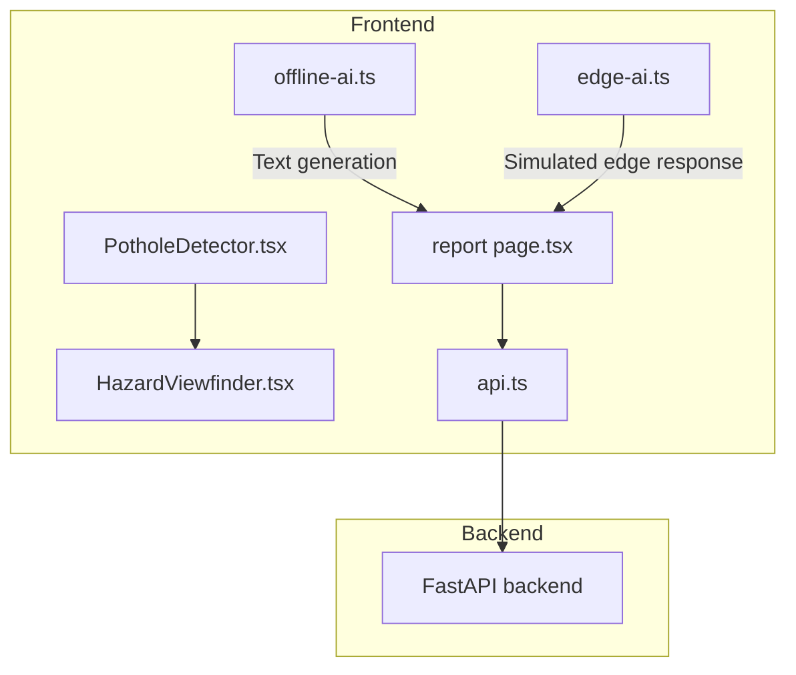
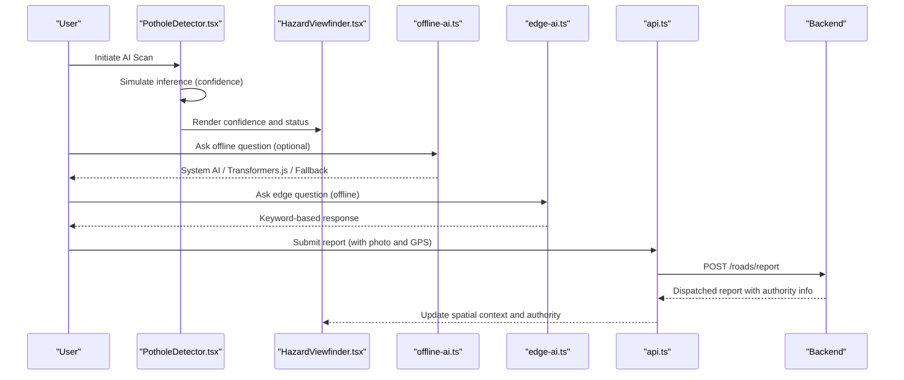
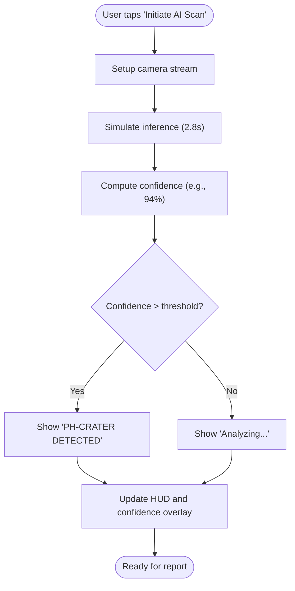
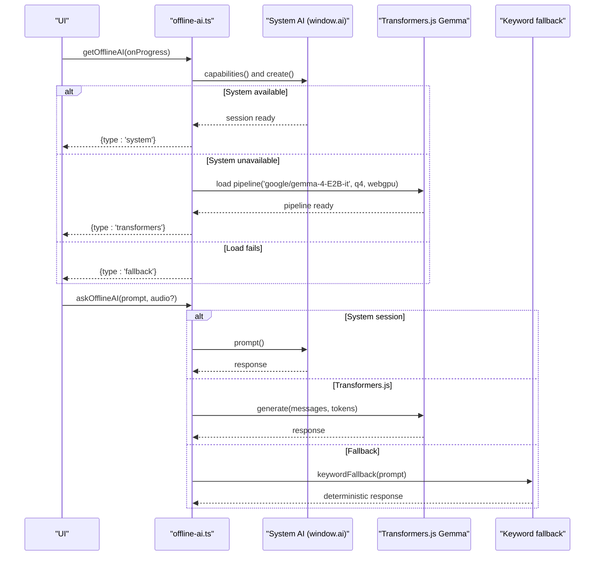
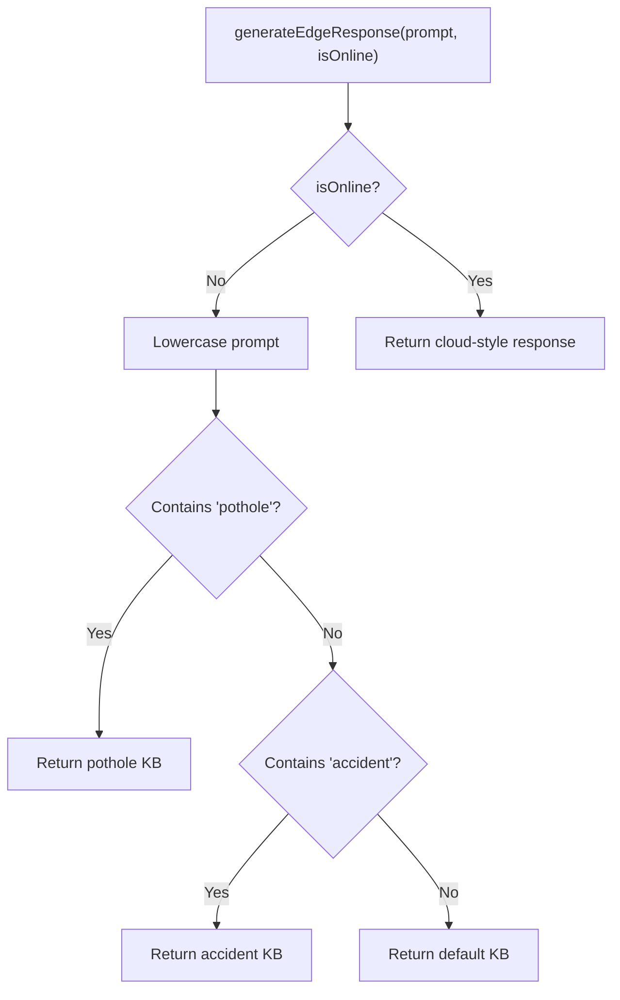
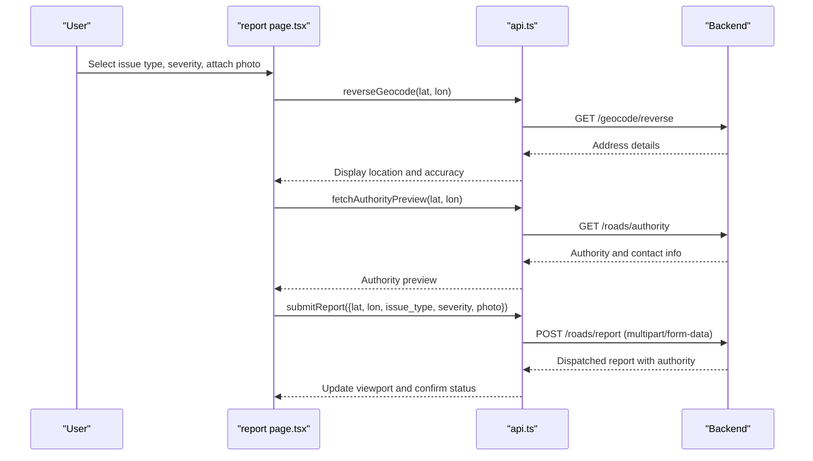
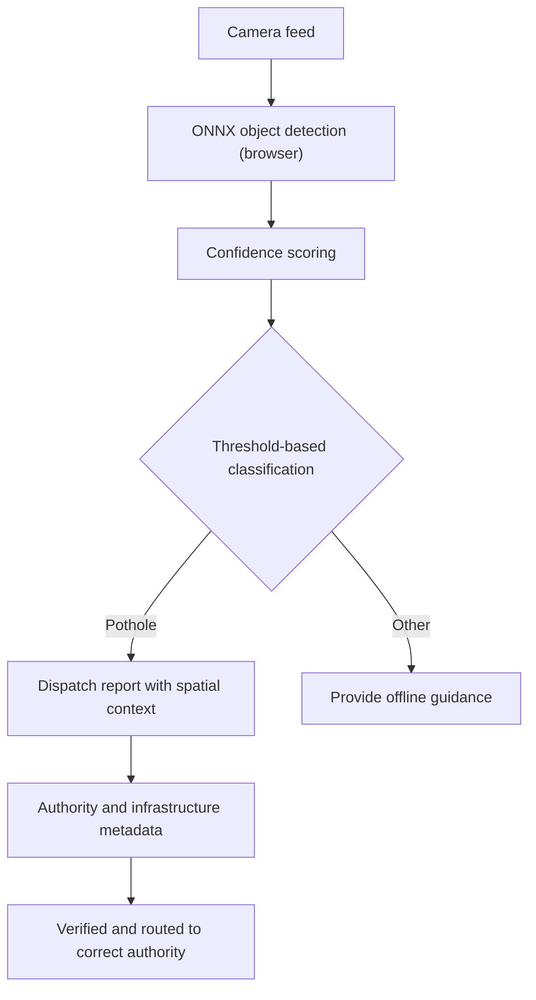
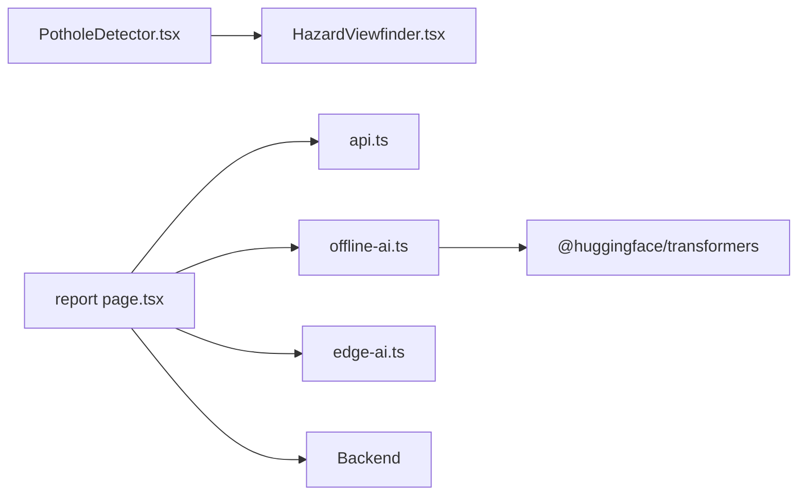

# AI-Powered Detection

<cite>
**Referenced Files in This Document**
- [edge-ai.ts](file://frontend/lib/edge-ai.ts)
- [offline-ai.ts](file://frontend/lib/offline-ai.ts)
- [PotholeDetector.tsx](file://frontend/components/PotholeDetector.tsx)
- [HazardViewfinder.tsx](file://frontend/components/report/HazardViewfinder.tsx)
- [report page.tsx](file://frontend/app/report/page.tsx)
- [api.ts](file://frontend/lib/api.ts)
- [Offline_Architecture.md](file://docs/Offline_Architecture.md)
- [AI_Instructions.md](file://docs/AI_Instructions.md)
- [offline-sos-queue.ts](file://frontend/lib/offline-sos-queue.ts)
</cite>

## Table of Contents
1. [Introduction](#introduction)
2. [Project Structure](#project-structure)
3. [Core Components](#core-components)
4. [Architecture Overview](#architecture-overview)
5. [Detailed Component Analysis](#detailed-component-analysis)
6. [Dependency Analysis](#dependency-analysis)
7. [Performance Considerations](#performance-considerations)
8. [Troubleshooting Guide](#troubleshooting-guide)
9. [Conclusion](#conclusion)

## Introduction
This document describes the AI-powered detection system for in-browser pothole and road hazard identification. The system emphasizes:
- Real-time, on-device computer vision using Edge AI and lightweight object detection
- Confidence scoring and threshold-based classification for pothole detection
- Offline-first AI capabilities powered by WebLLM-compatible engines and browser caching
- Spatial analysis for hazard localization and authority routing
- Fallback mechanisms for degraded connectivity and robust offline workflows

## Project Structure
The detection pipeline spans the frontend Next.js application and integrates with backend APIs for spatial context and reporting. The most relevant modules are:
- Computer vision and UI for hazard detection
- Offline AI engine for on-device reasoning
- Reporting UI and API integration for spatial context and dispatch

**Diagram sources**
- [PotholeDetector.tsx:1-146](file://frontend/components/PotholeDetector.tsx#L1-L146)
- [HazardViewfinder.tsx:1-105](file://frontend/components/report/HazardViewfinder.tsx#L1-L105)
- [report page.tsx:1-557](file://frontend/app/report/page.tsx#L1-L557)
- [offline-ai.ts:1-256](file://frontend/lib/offline-ai.ts#L1-L256)
- [edge-ai.ts:1-29](file://frontend/lib/edge-ai.ts#L1-L29)
- [api.ts:1-821](file://frontend/lib/api.ts#L1-L821)

**Section sources**
- [PotholeDetector.tsx:1-146](file://frontend/components/PotholeDetector.tsx#L1-L146)
- [HazardViewfinder.tsx:1-105](file://frontend/components/report/HazardViewfinder.tsx#L1-L105)
- [report page.tsx:1-557](file://frontend/app/report/page.tsx#L1-L557)
- [offline-ai.ts:1-256](file://frontend/lib/offline-ai.ts#L1-L256)
- [edge-ai.ts:1-29](file://frontend/lib/edge-ai.ts#L1-L29)
- [api.ts:1-821](file://frontend/lib/api.ts#L1-L821)

## Core Components
- PotholeDetector: In-browser camera capture and simulated AI scan with confidence overlay
- HazardViewfinder: Live viewport with AI confidence indicator and spatial status
- Offline AI Engine: Multi-path offline reasoning with system AI, Transformers.js, and keyword fallback
- Edge AI Engine: Lightweight, deterministic offline response for keywords like “pothole”
- Reporting UI: Integrates camera capture, optional photo upload, spatial context, and authority routing

**Section sources**
- [PotholeDetector.tsx:1-146](file://frontend/components/PotholeDetector.tsx#L1-L146)
- [HazardViewfinder.tsx:1-105](file://frontend/components/report/HazardViewfinder.tsx#L1-L105)
- [offline-ai.ts:1-256](file://frontend/lib/offline-ai.ts#L1-L256)
- [edge-ai.ts:1-29](file://frontend/lib/edge-ai.ts#L1-L29)
- [report page.tsx:1-557](file://frontend/app/report/page.tsx#L1-L557)

## Architecture Overview
The system combines:
- In-browser object detection for pothole localization
- Confidence scoring and threshold-based classification
- Offline AI for reasoning and keyword-driven responses
- Spatial context retrieval and authority routing via backend APIs
- Fallbacks for offline scenarios and degraded connectivity

**Diagram sources**
- [PotholeDetector.tsx:43-54](file://frontend/components/PotholeDetector.tsx#L43-L54)
- [HazardViewfinder.tsx:17-25](file://frontend/components/report/HazardViewfinder.tsx#L17-L25)
- [offline-ai.ts:124-154](file://frontend/lib/offline-ai.ts#L124-L154)
- [edge-ai.ts:15-28](file://frontend/lib/edge-ai.ts#L15-L28)
- [api.ts:723-750](file://frontend/lib/api.ts#L723-L750)
- [report page.tsx:232-258](file://frontend/app/report/page.tsx#L232-L258)

## Detailed Component Analysis

### Pothole Detection UI and Confidence Scoring
- Camera capture with environment-facing video stream
- Simulated inference with confidence percentage and visual feedback
- Threshold-based classification overlay for pothole confirmation

**Diagram sources**
- [PotholeDetector.tsx:43-54](file://frontend/components/PotholeDetector.tsx#L43-L54)

**Section sources**
- [PotholeDetector.tsx:1-146](file://frontend/components/PotholeDetector.tsx#L1-L146)

### Offline AI Engine (Text Generation)
- Path selection: Chrome Built-in AI (system), Transformers.js Gemma 4 E2B, or keyword fallback
- Quantization and device acceleration for efficient inference
- Progress callbacks and graceful degradation

**Diagram sources**
- [offline-ai.ts:47-67](file://frontend/lib/offline-ai.ts#L47-L67)
- [offline-ai.ts:71-110](file://frontend/lib/offline-ai.ts#L71-L110)
- [offline-ai.ts:124-154](file://frontend/lib/offline-ai.ts#L124-L154)
- [offline-ai.ts:160-211](file://frontend/lib/offline-ai.ts#L160-L211)
- [offline-ai.ts:225-255](file://frontend/lib/offline-ai.ts#L225-L255)

**Section sources**
- [offline-ai.ts:1-256](file://frontend/lib/offline-ai.ts#L1-L256)

### Edge AI Engine (Deterministic Offline Responses)
- Lightweight offline keyword matching for common queries
- Simulated latency to mimic model loading or API calls
- Deterministic responses for “pothole” and “accident”

**Diagram sources**
- [edge-ai.ts:15-28](file://frontend/lib/edge-ai.ts#L15-L28)
- [edge-ai.ts:6-10](file://frontend/lib/edge-ai.ts#L6-L10)

**Section sources**
- [edge-ai.ts:1-29](file://frontend/lib/edge-ai.ts#L1-L29)

### Reporting UI and Spatial Analysis
- Live viewport with AI confidence and GPS signal status
- Reverse geocoding and authority preview for road ownership
- Severity selection and optional photo upload for faster verification
- Submission to backend with spatial context and optional media

**Diagram sources**
- [report page.tsx:134-210](file://frontend/app/report/page.tsx#L134-L210)
- [report page.tsx:232-258](file://frontend/app/report/page.tsx#L232-L258)
- [api.ts:655-671](file://frontend/lib/api.ts#L655-L671)
- [api.ts:707-721](file://frontend/lib/api.ts#L707-L721)
- [api.ts:723-750](file://frontend/lib/api.ts#L723-L750)

**Section sources**
- [report page.tsx:1-557](file://frontend/app/report/page.tsx#L1-L557)
- [api.ts:1-821](file://frontend/lib/api.ts#L1-L821)

### Conceptual Overview
- In-browser pothole detection uses a compact ONNX model (as documented) to run object detection locally
- Confidence thresholds classify detections into low/possible/confirmed categories
- Offline AI complements detection with contextual reasoning and keyword fallbacks
- Spatial analysis enriches reports with authority routing and infrastructure metadata

[No sources needed since this diagram shows conceptual workflow, not actual code structure]

[No sources needed since this section doesn't analyze specific source files]

## Dependency Analysis
- PotholeDetector depends on camera permissions and renders a simulated inference result
- HazardViewfinder consumes props for confidence, status, and location to reflect system state
- offline-ai.ts encapsulates model loading, device selection, and fallback logic
- edge-ai.ts provides a lightweight offline response mechanism
- report page.tsx orchestrates spatial context retrieval and report submission
- api.ts abstracts backend calls for geocoding, authority preview, and reporting

**Diagram sources**
- [PotholeDetector.tsx:1-146](file://frontend/components/PotholeDetector.tsx#L1-L146)
- [HazardViewfinder.tsx:1-105](file://frontend/components/report/HazardViewfinder.tsx#L1-L105)
- [report page.tsx:1-557](file://frontend/app/report/page.tsx#L1-L557)
- [offline-ai.ts:75-109](file://frontend/lib/offline-ai.ts#L75-L109)
- [api.ts:1-821](file://frontend/lib/api.ts#L1-L821)

**Section sources**
- [PotholeDetector.tsx:1-146](file://frontend/components/PotholeDetector.tsx#L1-L146)
- [HazardViewfinder.tsx:1-105](file://frontend/components/report/HazardViewfinder.tsx#L1-L105)
- [offline-ai.ts:1-256](file://frontend/lib/offline-ai.ts#L1-L256)
- [edge-ai.ts:1-29](file://frontend/lib/edge-ai.ts#L1-L29)
- [report page.tsx:1-557](file://frontend/app/report/page.tsx#L1-L557)
- [api.ts:1-821](file://frontend/lib/api.ts#L1-L821)

## Performance Considerations
- Device acceleration: WebGPU preferred, with WASM fallback for broader compatibility
- Quantization: 4-bit quantization reduces model footprint and improves throughput
- Browser caching: Transformers.js cache persists across sessions to minimize repeated downloads
- Battery efficiency: Prefer system AI when available (zero download), reduce inference frequency, and throttle camera usage
- Offline-first design: Minimize network requests and leverage IndexedDB for queued actions

[No sources needed since this section provides general guidance]

## Troubleshooting Guide
- Camera access denied: Verify permissions and environment-facing camera selection
- Offline AI unavailable: Check browser support for window.ai; fallback to Transformers.js; ensure cache storage is enabled
- Model load failures: Confirm network availability and sufficient storage; retry after clearing cache
- Report submission errors: Validate GPS accuracy and required fields; ensure multipart/form-data is constructed properly
- Offline SOS sync: IndexedDB queue persists events; background sync triggers on connection restoration

**Section sources**
- [PotholeDetector.tsx:18-41](file://frontend/components/PotholeDetector.tsx#L18-L41)
- [offline-ai.ts:142-153](file://frontend/lib/offline-ai.ts#L142-L153)
- [offline-ai.ts:77-79](file://frontend/lib/offline-ai.ts#L77-L79)
- [api.ts:729-750](file://frontend/lib/api.ts#L729-L750)
- [offline-sos-queue.ts:48-124](file://frontend/lib/offline-sos-queue.ts#L48-L124)

## Conclusion
The AI-powered detection system achieves real-time, on-device pothole and hazard identification with confidence scoring and threshold-based classification. By combining in-browser object detection, offline AI engines, and spatial analysis, it delivers resilient, privacy-preserving, and efficient road safety workflows. Fallback mechanisms and offline-first design ensure reliable operation under degraded connectivity, while quantization and device acceleration optimize performance and battery life.