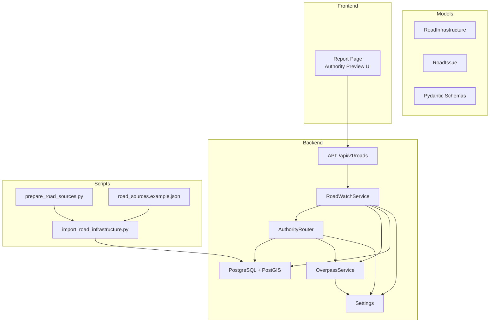
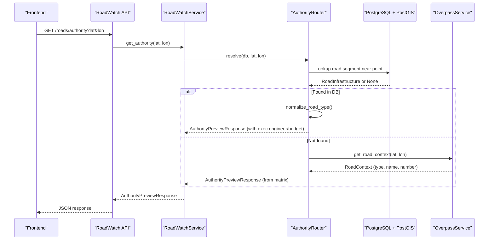
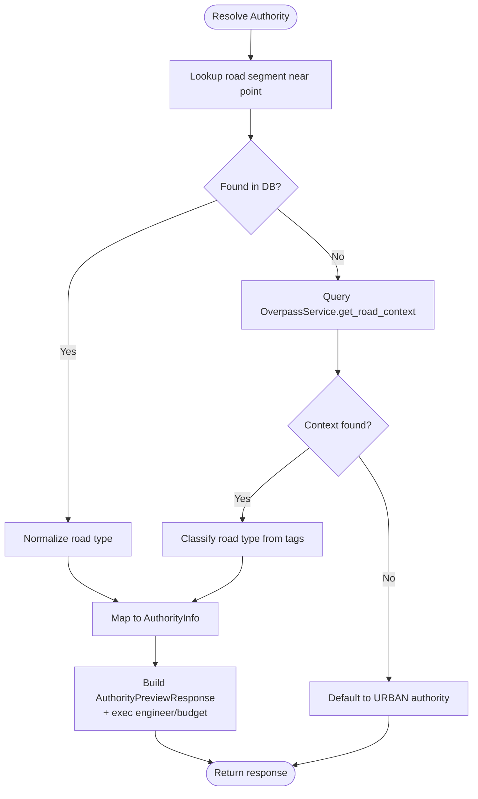
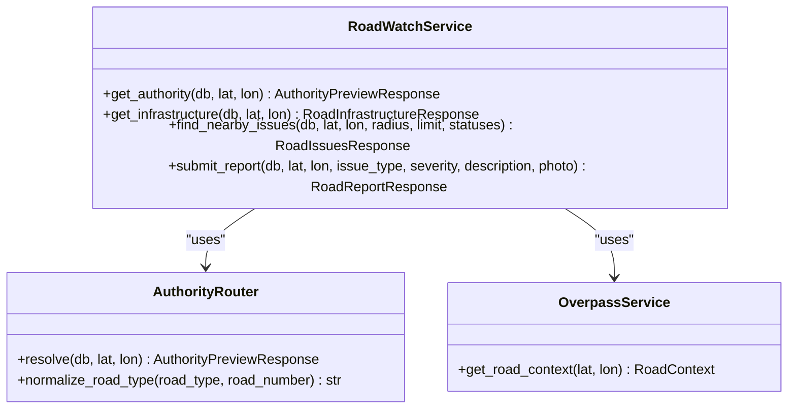
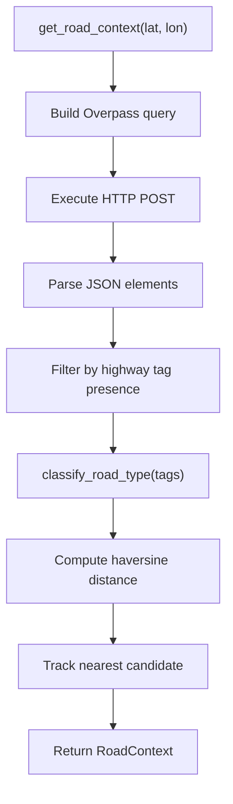
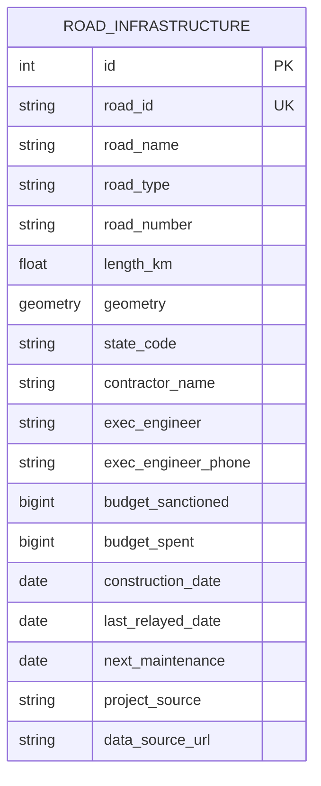
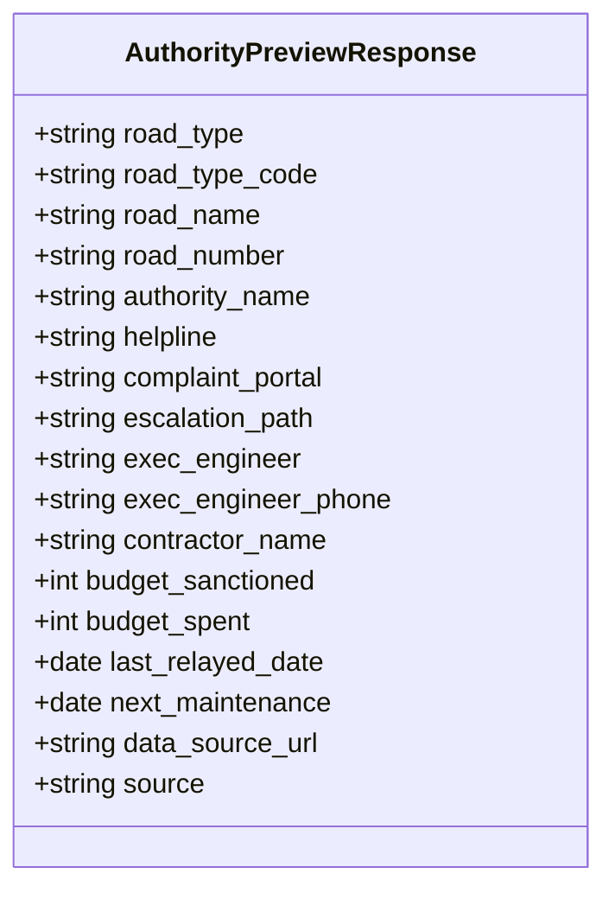
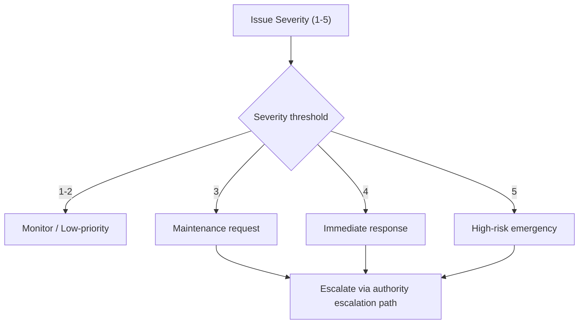
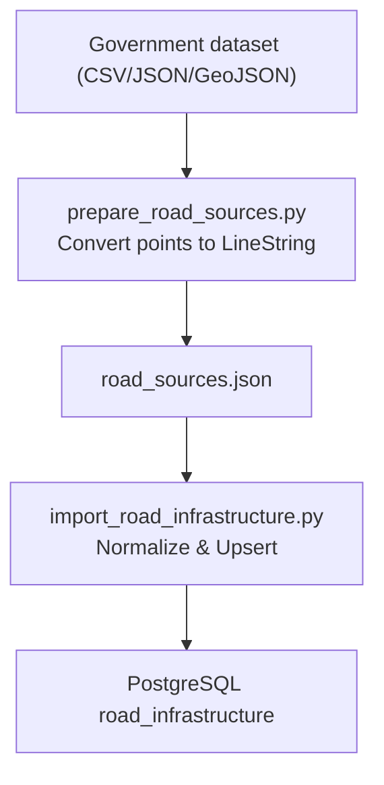
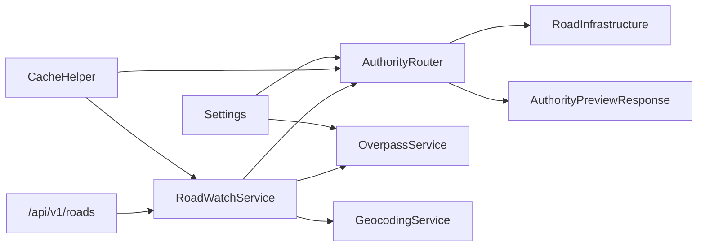

# Authority Routing System

<cite>
**Referenced Files in This Document**
- [authority_router.py](file://backend/services/authority_router.py)
- [roadwatch_service.py](file://backend/services/roadwatch_service.py)
- [overpass_service.py](file://backend/services/overpass_service.py)
- [road_issue.py](file://backend/models/road_issue.py)
- [schemas.py](file://backend/models/schemas.py)
- [roadwatch.py](file://backend/api/v1/roadwatch.py)
- [config.py](file://backend/core/config.py)
- [import_road_infrastructure.py](file://backend/scripts/app/import_road_infrastructure.py)
- [prepare_road_sources.py](file://backend/scripts/data/prepare_road_sources.py)
- [road_sources.example.json](file://backend/data/road_sources.example.json)
- [page.tsx](file://frontend/app/report/page.tsx)
- [emergency-numbers.ts](file://frontend/lib/emergency-numbers.ts)
</cite>

## Table of Contents
1. [Introduction](#introduction)
2. [Project Structure](#project-structure)
3. [Core Components](#core-components)
4. [Architecture Overview](#architecture-overview)
5. [Detailed Component Analysis](#detailed-component-analysis)
6. [Dependency Analysis](#dependency-analysis)
7. [Performance Considerations](#performance-considerations)
8. [Troubleshooting Guide](#troubleshooting-guide)
9. [Conclusion](#conclusion)

## Introduction
This document describes the Authority Routing System responsible for intelligent government department assignment for road issues. It integrates a road ownership database with state-specific highway departments and municipal corporations, automatically identifies authorities using GPS coordinates and road infrastructure metadata, determines escalation paths for different issue severities, assigns executive engineers, links to complaint portals and helplines, and exposes an authority preview API enriched with road asset intelligence. It also covers fallback mechanisms for unknown ownership and manual override capabilities for complex jurisdictional boundaries.

## Project Structure
The system spans backend services, APIs, models, and scripts for importing government datasets, and a frontend that consumes the authority preview API.

**Diagram sources**
- [roadwatch.py:53-70](file://backend/api/v1/roadwatch.py#L53-L70)
- [roadwatch_service.py:70-125](file://backend/services/roadwatch_service.py#L70-L125)
- [authority_router.py:48-114](file://backend/services/authority_router.py#L48-L114)
- [overpass_service.py:80-107](file://backend/services/overpass_service.py#L80-L107)
- [road_issue.py:42-66](file://backend/models/road_issue.py#L42-L66)
- [schemas.py:83-116](file://backend/models/schemas.py#L83-L116)
- [import_road_infrastructure.py:204-250](file://backend/scripts/app/import_road_infrastructure.py#L204-L250)
- [prepare_road_sources.py:145-194](file://backend/scripts/data/prepare_road_sources.py#L145-L194)
- [road_sources.example.json:1-69](file://backend/data/road_sources.example.json#L1-L69)
- [page.tsx:504-508](file://frontend/app/report/page.tsx#L504-L508)

**Section sources**
- [roadwatch.py:19-70](file://backend/api/v1/roadwatch.py#L19-L70)
- [roadwatch_service.py:56-125](file://backend/services/roadwatch_service.py#L56-L125)
- [authority_router.py:42-114](file://backend/services/authority_router.py#L42-L114)
- [overpass_service.py:24-107](file://backend/services/overpass_service.py#L24-L107)
- [road_issue.py:42-66](file://backend/models/road_issue.py#L42-L66)
- [schemas.py:83-116](file://backend/models/schemas.py#L83-L116)
- [import_road_infrastructure.py:204-250](file://backend/scripts/app/import_road_infrastructure.py#L204-L250)
- [prepare_road_sources.py:145-194](file://backend/scripts/data/prepare_road_sources.py#L145-L194)
- [road_sources.example.json:1-69](file://backend/data/road_sources.example.json#L1-L69)
- [page.tsx:504-508](file://frontend/app/report/page.tsx#L504-L508)

## Core Components
- AuthorityRouter: Central algorithm that resolves road ownership and authority based on spatial lookup and OpenStreetMap context.
- RoadWatchService: Orchestrates authority resolution, caching, infrastructure inspection, and issue submission.
- OverpassService: Queries OpenStreetMap Overpass API to derive road context when spatial database lacks precise metadata.
- RoadInfrastructure and RoadIssue models: Define the road ownership database schema and road issue reporting schema.
- Pydantic schemas: Define API response contracts for authority preview and infrastructure details.
- Import pipeline: Scripts to normalize and import government datasets into the road_infrastructure table.

**Section sources**
- [authority_router.py:42-143](file://backend/services/authority_router.py#L42-L143)
- [roadwatch_service.py:56-125](file://backend/services/roadwatch_service.py#L56-L125)
- [overpass_service.py:24-122](file://backend/services/overpass_service.py#L24-L122)
- [road_issue.py:42-66](file://backend/models/road_issue.py#L42-L66)
- [schemas.py:83-116](file://backend/models/schemas.py#L83-L116)
- [import_road_infrastructure.py:132-163](file://backend/scripts/app/import_road_infrastructure.py#L132-L163)

## Architecture Overview
The authority routing process combines a spatial database lookup with a fallback to OSM-based road classification. The system caches results and enriches the response with executive engineer and budget details when available.

**Diagram sources**
- [roadwatch.py:53-60](file://backend/api/v1/roadwatch.py#L53-L60)
- [roadwatch_service.py:70-77](file://backend/services/roadwatch_service.py#L70-L77)
- [authority_router.py:48-79](file://backend/services/authority_router.py#L48-L79)
- [overpass_service.py:80-107](file://backend/services/overpass_service.py#L80-L107)
- [road_issue.py:42-66](file://backend/models/road_issue.py#L42-L66)

## Detailed Component Analysis

### AuthorityRouter: Automatic Authority Identification
- Spatial lookup: Finds the nearest road segment within a small radius and normalizes its type to a road ownership code.
- Road type normalization: Converts road_type and road_number heuristics into NH, SH, MDR, VILLAGE, or URBAN.
- Matrix mapping: Maps each code to an authority name, helpline, complaint portal, and escalation path.
- Fallback: If no road segment is found or external service fails, defaults to URBAN authority.
- OSM fallback: Uses OverpassService to classify road type when database lacks metadata.

**Diagram sources**
- [authority_router.py:48-126](file://backend/services/authority_router.py#L48-L126)
- [overpass_service.py:80-122](file://backend/services/overpass_service.py#L80-L122)

**Section sources**
- [authority_router.py:42-143](file://backend/services/authority_router.py#L42-L143)
- [overpass_service.py:80-122](file://backend/services/overpass_service.py#L80-L122)

### RoadWatchService: Caching, Escalation, and Submission
- Caching: Uses Redis to cache authority and infrastructure responses for performance.
- Authority preview: Calls AuthorityRouter and caches the result.
- Infrastructure preview: Attempts DB lookup; if not found, mirrors authority preview without asset fields.
- Issue submission: Resolves authority, reverse-geocodes location, saves photo if provided, and persists a RoadIssue with authority metadata.

**Diagram sources**
- [roadwatch_service.py:56-125](file://backend/services/roadwatch_service.py#L56-L125)
- [authority_router.py:42-143](file://backend/services/authority_router.py#L42-L143)
- [overpass_service.py:24-107](file://backend/services/overpass_service.py#L24-L107)

**Section sources**
- [roadwatch_service.py:56-325](file://backend/services/roadwatch_service.py#L56-L325)

### OverpassService: OpenStreetMap Road Context
- Extracts road candidates around a point, classifies highway tags, and returns the closest match with road type, name, and number.
- Provides robust error handling with retries across multiple Overpass endpoints.

**Diagram sources**
- [overpass_service.py:80-122](file://backend/services/overpass_service.py#L80-L122)

**Section sources**
- [overpass_service.py:24-249](file://backend/services/overpass_service.py#L24-L249)

### Road Ownership Database and Executive Engineer Assignment
- RoadInfrastructure table stores road segments with geometry, ownership classification fields, and asset intelligence (executive engineer, contractor, budgets, dates).
- Executive engineer and contact details are included in the authority preview when available.

**Diagram sources**
- [road_issue.py:42-66](file://backend/models/road_issue.py#L42-L66)

**Section sources**
- [road_issue.py:42-66](file://backend/models/road_issue.py#L42-L66)

### Authority Preview API Response Structure
The authority preview response includes road classification, authority contact, escalation path, and optional asset intelligence.

**Diagram sources**
- [schemas.py:83-101](file://backend/models/schemas.py#L83-L101)

**Section sources**
- [schemas.py:83-101](file://backend/models/schemas.py#L83-L101)

### Escalation Path Determination and Severity Mapping
- The system maps road ownership codes to escalation paths (e.g., Ministry of Road Transport, State Transport Minister, District Magistrate).
- Severity levels are defined in the frontend and used during issue submission; higher severities trigger more urgent handling and clearer escalation expectations.

**Section sources**
- [page.tsx:55-61](file://frontend/app/report/page.tsx#L55-L61)

### Complaint Portal Linking and Helpline Integration
- AuthorityRouter provides a complaint portal URL and helpline number per road ownership code.
- Frontend displays the portal link and escalation path for quick action.

**Section sources**
- [authority_router.py:25-31](file://backend/services/authority_router.py#L25-L31)
- [page.tsx:504-508](file://frontend/app/report/page.tsx#L504-L508)
- [emergency-numbers.ts:104-119](file://frontend/lib/emergency-numbers.ts#L104-L119)

### Fallback Mechanisms and Manual Override Capabilities
- Unknown road ownership: If no road segment is found in the database and OverpassService fails, the system falls back to URBAN authority with default contact details.
- Manual override: The system’s design allows administrators to update the authority matrix and import pipeline to reflect jurisdictional overrides or new datasets.

**Section sources**
- [authority_router.py:73-126](file://backend/services/authority_router.py#L73-L126)
- [road_sources.example.json:1-69](file://backend/data/road_sources.example.json#L1-L69)

### Government Dataset Integration
- Import pipeline: Normalizes diverse CSV/JSON/GeoJSON sources into a unified RoadInfrastructure table with standardized fields.
- Preparation script: Converts point-based datasets into LineString-compatible GeoJSON for PostGIS compatibility.
- Example sources: Multiple state road datasets and PMGSY assets are configured via a manifest.

**Diagram sources**
- [prepare_road_sources.py:145-194](file://backend/scripts/data/prepare_road_sources.py#L145-L194)
- [import_road_infrastructure.py:204-250](file://backend/scripts/app/import_road_infrastructure.py#L204-L250)
- [road_sources.example.json:1-69](file://backend/data/road_sources.example.json#L1-L69)

**Section sources**
- [prepare_road_sources.py:1-195](file://backend/scripts/data/prepare_road_sources.py#L1-L195)
- [import_road_infrastructure.py:132-163](file://backend/scripts/app/import_road_infrastructure.py#L132-L163)
- [road_sources.example.json:1-69](file://backend/data/road_sources.example.json#L1-L69)

## Dependency Analysis
- AuthorityRouter depends on Settings, OverpassService, CacheHelper, RoadInfrastructure model, and Pydantic schemas.
- RoadWatchService depends on AuthorityRouter, OverpassService, Redis cache, and GeocodingService.
- OverpassService depends on Settings and HTTP client.
- API layer depends on RoadWatchService and FastAPI.

**Diagram sources**
- [authority_router.py:42-46](file://backend/services/authority_router.py#L42-L46)
- [roadwatch_service.py:56-68](file://backend/services/roadwatch_service.py#L56-L68)
- [overpass_service.py:24-26](file://backend/services/overpass_service.py#L24-L26)
- [roadwatch.py:53-60](file://backend/api/v1/roadwatch.py#L53-L60)

**Section sources**
- [authority_router.py:42-46](file://backend/services/authority_router.py#L42-L46)
- [roadwatch_service.py:56-68](file://backend/services/roadwatch_service.py#L56-L68)
- [overpass_service.py:24-26](file://backend/services/overpass_service.py#L24-L26)
- [roadwatch.py:53-60](file://backend/api/v1/roadwatch.py#L53-L60)

## Performance Considerations
- Spatial indexing: RoadInfrastructure geometry is indexed in PostGIS to accelerate ST_DWithin and ST_Distance queries.
- Caching: Authority and infrastructure previews are cached with configurable TTLs to reduce repeated database and external API calls.
- Batch upserts: Import scripts deduplicate and batch upsert records to minimize write overhead.
- External service resilience: OverpassService retries across multiple endpoints with backoff.

[No sources needed since this section provides general guidance]

## Troubleshooting Guide
- Authority not resolved:
  - Verify spatial data import and geometry validity.
  - Check OverpassService availability and network connectivity.
  - Confirm cache TTL and Redis connectivity.
- Incorrect authority mapping:
  - Review road type normalization logic and ensure road_type/road_number fields are populated.
  - Update the authority matrix for jurisdictional overrides.
- Missing executive engineer details:
  - Confirm RoadInfrastructure entries include exec_engineer/exec_engineer_phone.
- API errors:
  - Inspect ServiceValidationError and ExternalServiceError handling in RoadWatchService and OverpassService.
  - Validate Settings for timeouts, URLs, and allowed content types.

**Section sources**
- [roadwatch_service.py:186-253](file://backend/services/roadwatch_service.py#L186-L253)
- [overpass_service.py:123-134](file://backend/services/overpass_service.py#L123-L134)
- [config.py:35-47](file://backend/core/config.py#L35-L47)

## Conclusion
The Authority Routing System provides a robust, extensible framework for assigning the correct government authority to road issues. By combining spatially-aware road ownership data with OSM-based fallbacks, it ensures reliable authority identification even in areas with incomplete datasets. The system’s caching, escalation-aware responses, and integration with complaint portals and helplines streamline citizen engagement and improve maintenance outcomes. Administrators can evolve the system by updating the authority matrix and importing new government datasets to reflect changing jurisdictions and asset ownership.