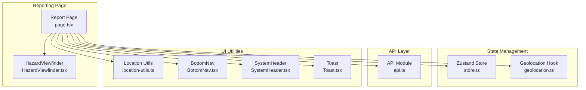
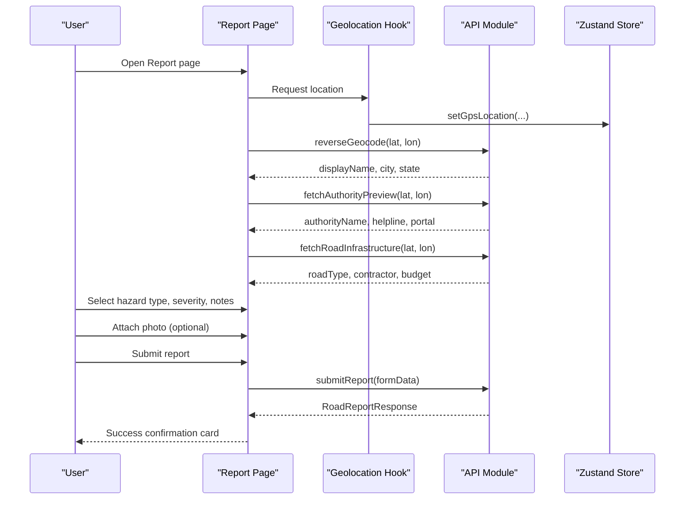
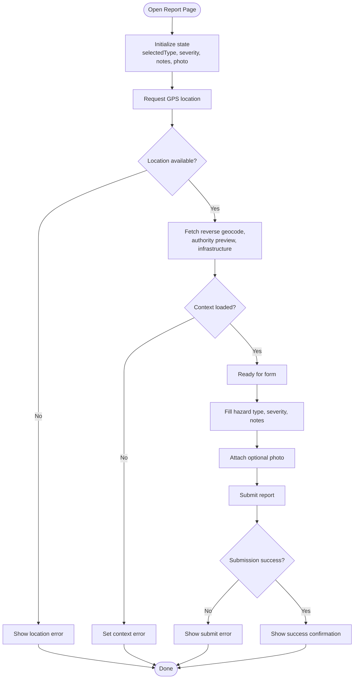
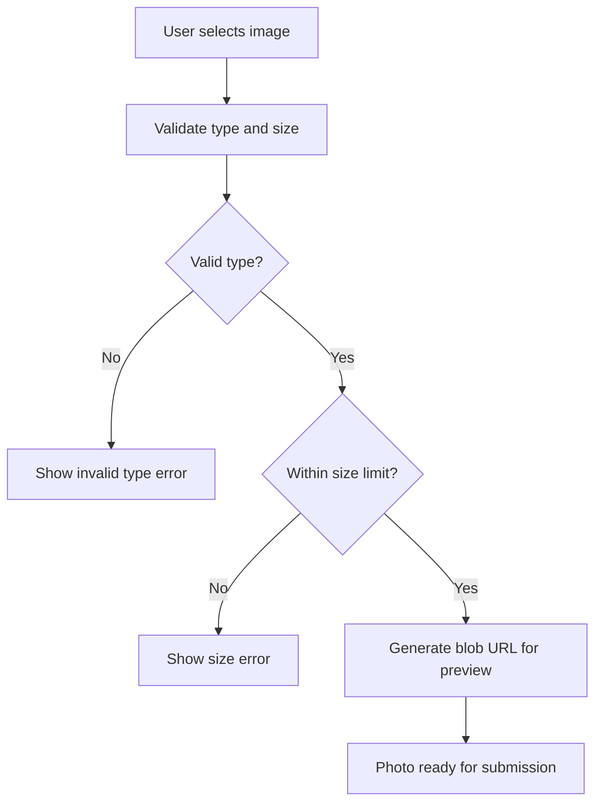
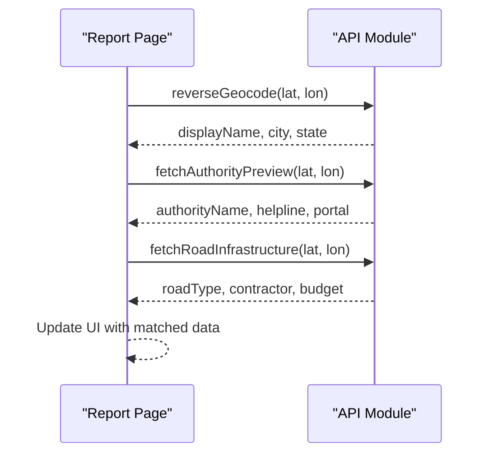
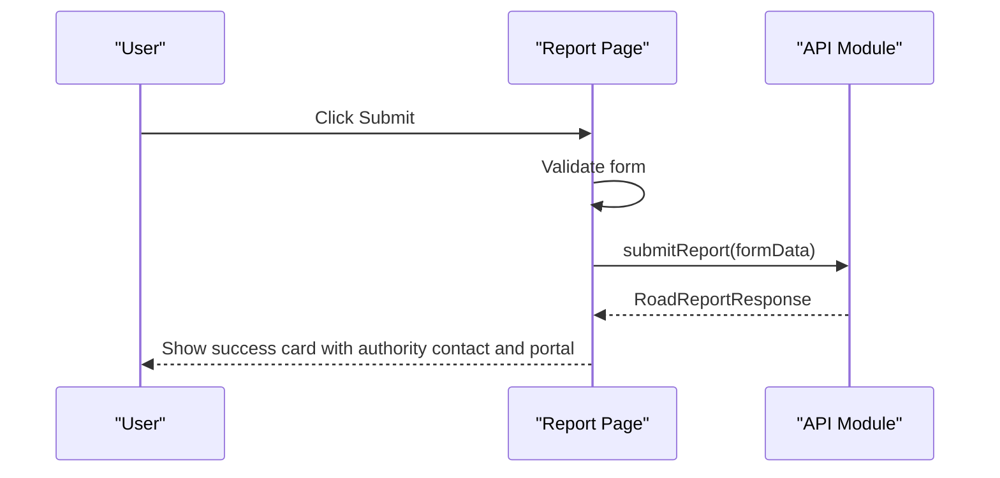
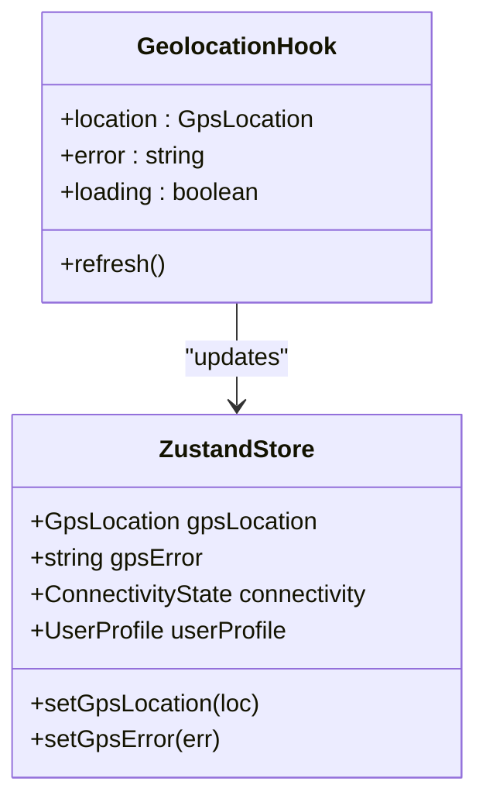
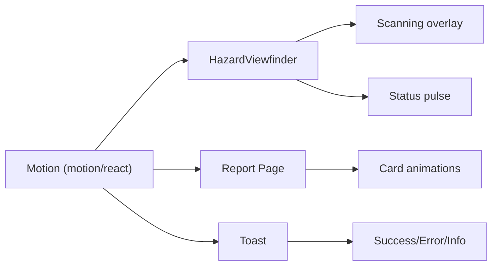
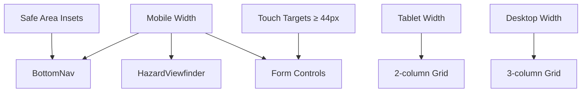
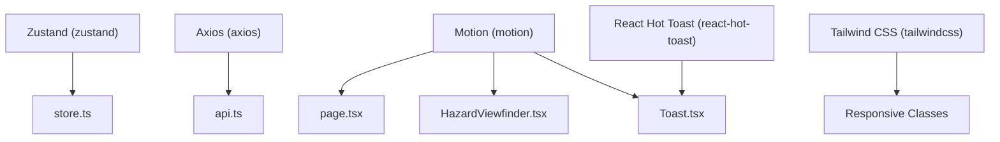

# Community Reporting Interface

<cite>
**Referenced Files in This Document**
- [page.tsx](file://frontend/app/report/page.tsx)
- [ReportForm.tsx](file://frontend/components/ReportForm.tsx)
- [HazardViewfinder.tsx](file://frontend/components/report/HazardViewfinder.tsx)
- [store.ts](file://frontend/lib/store.ts)
- [api.ts](file://frontend/lib/api.ts)
- [geolocation.ts](file://frontend/lib/geolocation.ts)
- [location-utils.ts](file://frontend/lib/location-utils.ts)
- [Tailwind config](file://frontend/tailwind.config.js)
- [UI/UX guidelines](file://docs/UIUX.md)
- [Toast component](file://frontend/components/dashboard/Toast.tsx)
- [BottomNav component](file://frontend/components/dashboard/BottomNav.tsx)
- [SystemHeader component](file://frontend/components/dashboard/SystemHeader.tsx)
- [package.json](file://frontend/package.json)
</cite>

## Table of Contents
1. [Introduction](#introduction)
2. [Project Structure](#project-structure)
3. [Core Components](#core-components)
4. [Architecture Overview](#architecture-overview)
5. [Detailed Component Analysis](#detailed-component-analysis)
6. [Dependency Analysis](#dependency-analysis)
7. [Performance Considerations](#performance-considerations)
8. [Troubleshooting Guide](#troubleshooting-guide)
9. [Conclusion](#conclusion)

## Introduction
This document describes the community reporting interface designed for user-friendly hazard submission and real-time feedback. It covers the multi-step reporting form, photo upload system, real-time authority matching, submission workflow, state management with Zustand, animations, responsive design, and accessibility features.

## Project Structure
The reporting interface is implemented as a Next.js app page with supporting components and utilities:
- Main page orchestrates location context, authority matching, and submission flow
- Report form components provide alternative UI patterns
- Viewfinder component visualizes live hazard capture
- Zustand store manages global state and persistence
- API module handles backend communication
- Geolocation hook integrates with the store
- Tailwind and UI/UX guidelines define responsive and accessible design

**Diagram sources**
- [page.tsx:101-555](file://frontend/app/report/page.tsx#L101-L555)
- [HazardViewfinder.tsx:17-104](file://frontend/components/report/HazardViewfinder.tsx#L17-L104)
- [store.ts:129-225](file://frontend/lib/store.ts#L129-L225)
- [geolocation.ts:13-123](file://frontend/lib/geolocation.ts#L13-L123)
- [api.ts:14-821](file://frontend/lib/api.ts#L14-L821)
- [location-utils.ts:1-57](file://frontend/lib/location-utils.ts#L1-L57)
- [BottomNav.tsx:24-102](file://frontend/components/dashboard/BottomNav.tsx#L24-L102)
- [SystemHeader.tsx:16-169](file://frontend/components/dashboard/SystemHeader.tsx#L16-L169)
- [Toast.tsx:17-53](file://frontend/components/dashboard/Toast.tsx#L17-L53)

**Section sources**
- [page.tsx:101-555](file://frontend/app/report/page.tsx#L101-L555)
- [store.ts:129-225](file://frontend/lib/store.ts#L129-L225)

## Core Components
- Report Page: Orchestrates the entire workflow, including location acquisition, authority matching, photo preview, form submission, and success confirmation.
- Hazard Viewfinder: Visual viewport for live hazard capture with animated overlays and status indicators.
- Zustand Store: Centralized state for GPS location, errors, UI toggles, and persisted preferences.
- API Module: Provides typed functions for reverse geocoding, authority preview, infrastructure data, and report submission.
- Geolocation Hook: Manages browser geolocation lifecycle and integrates with the store.
- UI Utilities: Formatting helpers for location labels, accuracy, and approximate location detection.
- Responsive and Accessibility: Tailwind configuration and UI/UX guidelines ensure mobile-first design and inclusive interactions.

**Section sources**
- [page.tsx:101-555](file://frontend/app/report/page.tsx#L101-L555)
- [HazardViewfinder.tsx:17-104](file://frontend/components/report/HazardViewfinder.tsx#L17-L104)
- [store.ts:129-225](file://frontend/lib/store.ts#L129-L225)
- [api.ts:654-750](file://frontend/lib/api.ts#L654-L750)
- [geolocation.ts:13-123](file://frontend/lib/geolocation.ts#L13-L123)
- [location-utils.ts:1-57](file://frontend/lib/location-utils.ts#L1-L57)
- [Tailwind config:1-131](file://frontend/tailwind.config.js#L1-L131)
- [UI/UX guidelines:225-264](file://docs/UIUX.md#L225-L264)

## Architecture Overview
The reporting interface follows a reactive pattern:
- Location context is fetched and normalized, then used to query authority and infrastructure data
- Users fill the multi-step form with hazard type, severity, and notes
- Optional photo is previewed and validated before submission
- Submission triggers a multipart form post to the backend
- On success, a confirmation card displays authority contact and portal links

**Diagram sources**
- [page.tsx:147-258](file://frontend/app/report/page.tsx#L147-L258)
- [geolocation.ts:30-108](file://frontend/lib/geolocation.ts#L30-L108)
- [api.ts:654-750](file://frontend/lib/api.ts#L654-L750)
- [store.ts:133-136](file://frontend/lib/store.ts#L133-L136)

## Detailed Component Analysis

### Report Page Workflow
The main page coordinates:
- Location context loading and error handling
- Authority and infrastructure previews
- Photo attachment with preview and validation hints
- Multi-step form with hazard type selection, severity rating, and descriptive notes
- Submission with progress indicators and error handling
- Success confirmation with authority contact and portal links

**Diagram sources**
- [page.tsx:101-555](file://frontend/app/report/page.tsx#L101-L555)

**Section sources**
- [page.tsx:101-555](file://frontend/app/report/page.tsx#L101-L555)

### Photo Upload System
- Accepts JPG, PNG, or WEBP images
- Generates a blob URL for immediate preview
- Validates file type and size before submission
- Provides user feedback with filename and size hint

**Diagram sources**
- [page.tsx:260-262](file://frontend/app/report/page.tsx#L260-L262)
- [page.tsx:223-223](file://frontend/app/report/page.tsx#L223-L223)

**Section sources**
- [page.tsx:260-262](file://frontend/app/report/page.tsx#L260-L262)
- [page.tsx:358-370](file://frontend/app/report/page.tsx#L358-L370)

### Real-time Authority Matching
- Reverse geocoding provides readable address and locality
- Authority preview returns road ownership, helpline, and complaint portal
- Infrastructure data adds contractor, budget, and maintenance details
- Errors are aggregated and displayed with contextual messaging

**Diagram sources**
- [page.tsx:151-202](file://frontend/app/report/page.tsx#L151-L202)
- [api.ts:707-721](file://frontend/lib/api.ts#L707-L721)

**Section sources**
- [page.tsx:151-202](file://frontend/app/report/page.tsx#L151-L202)
- [api.ts:707-721](file://frontend/lib/api.ts#L707-L721)

### Submission Workflow
- Validates presence of location and hazard type
- Builds multipart form data with lat/lon, issue type, severity, description, and optional photo
- Handles errors with user-friendly messages
- Displays success confirmation with authority details and portal link

**Diagram sources**
- [page.tsx:232-258](file://frontend/app/report/page.tsx#L232-L258)
- [api.ts:723-750](file://frontend/lib/api.ts#L723-L750)

**Section sources**
- [page.tsx:232-258](file://frontend/app/report/page.tsx#L232-L258)
- [api.ts:723-750](file://frontend/lib/api.ts#L723-L750)

### State Management with Zustand
- GPS location and errors are stored centrally
- The geolocation hook updates the store and exposes loading/error states
- The store persists user profile and preferences across sessions

**Diagram sources**
- [store.ts:63-127](file://frontend/lib/store.ts#L63-L127)
- [geolocation.ts:13-123](file://frontend/lib/geolocation.ts#L13-L123)

**Section sources**
- [store.ts:129-225](file://frontend/lib/store.ts#L129-L225)
- [geolocation.ts:13-123](file://frontend/lib/geolocation.ts#L13-L123)

### Animation Systems
- Motion library powers entrance animations, transitions, and interactive feedback
- Animated status indicators and scanning overlays in the viewport
- Toast notifications provide contextual feedback

**Diagram sources**
- [HazardViewfinder.tsx:27-104](file://frontend/components/report/HazardViewfinder.tsx#L27-L104)
- [page.tsx:448-456](file://frontend/app/report/page.tsx#L448-L456)
- [Toast.tsx:35-53](file://frontend/components/dashboard/Toast.tsx#L35-L53)

**Section sources**
- [HazardViewfinder.tsx:27-104](file://frontend/components/report/HazardViewfinder.tsx#L27-L104)
- [page.tsx:448-456](file://frontend/app/report/page.tsx#L448-L456)
- [Toast.tsx:17-53](file://frontend/components/dashboard/Toast.tsx#L17-L53)

### Responsive Design Adaptations
- Mobile-first layout with bottom navigation and fixed-position controls
- Grid-based cards adapt to tablet and desktop layouts
- Safe area insets and minimum touch targets ensure usability on mobile devices
- Typography scales with browser font preferences

**Diagram sources**
- [BottomNav.tsx:32-98](file://frontend/components/dashboard/BottomNav.tsx#L32-L98)
- [Tailwind config:125-127](file://frontend/tailwind.config.js#L125-L127)
- [UI/UX guidelines:254-262](file://docs/UIUX.md#L254-L262)

**Section sources**
- [BottomNav.tsx:24-102](file://frontend/components/dashboard/BottomNav.tsx#L24-L102)
- [Tailwind config:1-131](file://frontend/tailwind.config.js#L1-L131)
- [UI/UX guidelines:225-264](file://docs/UIUX.md#L225-L264)

### Accessibility Features
- Minimum 44x44px touch targets for all interactive elements
- WCAG AA contrast ratios for text and backgrounds
- Screen reader support with aria-labels and roles
- Keyboard navigable forms and buttons
- Error states are never silent; toast or inline messages are always shown
- Loading states use skeleton screens instead of blank states

**Section sources**
- [UI/UX guidelines:225-264](file://docs/UIUX.md#L225-L264)
- [page.tsx:332-334](file://frontend/app/report/page.tsx#L332-L334)

## Dependency Analysis
Key dependencies and their roles:
- Zustand: State management for GPS, UI, and persisted preferences
- Axios: HTTP client for API requests with interceptors for auth
- Motion: Animation library for smooth transitions and feedback
- Tailwind CSS: Utility-first styling with responsive breakpoints
- React Hot Toast: Lightweight toast notifications

**Diagram sources**
- [store.ts:1-2](file://frontend/lib/store.ts#L1-L2)
- [api.ts:1-1](file://frontend/lib/api.ts#L1-L1)
- [page.tsx:7-7](file://frontend/app/report/page.tsx#L7-L7)
- [HazardViewfinder.tsx:3-3](file://frontend/components/report/HazardViewfinder.tsx#L3-L3)
- [Toast.tsx:4-4](file://frontend/components/dashboard/Toast.tsx#L4-L4)
- [Tailwind config:1-131](file://frontend/tailwind.config.js#L1-L131)
- [package.json:52-52](file://frontend/package.json#L52-L52)

**Section sources**
- [package.json:14-53](file://frontend/package.json#L14-L53)

## Performance Considerations
- Debounce or throttle geolocation updates to reduce unnecessary re-renders
- Use lazy loading for heavy assets in the viewport
- Optimize photo uploads with client-side compression where appropriate
- Cache authority and infrastructure data for repeated visits
- Minimize re-renders by isolating state slices and using memoization

## Troubleshooting Guide
Common issues and resolutions:
- Location permission denied: Prompt users to enable location in browser settings
- Approximate location detected: Inform users that a sharper GPS fix improves matching
- Photo validation errors: Ensure file type is JPEG/PNG/WEBP and under the size limit
- Submission failures: Show extracted error messages and allow retry
- Network connectivity: Use toast notifications to inform users of online/offline status

**Section sources**
- [geolocation.ts:63-70](file://frontend/lib/geolocation.ts#L63-L70)
- [page.tsx:223-223](file://frontend/app/report/page.tsx#L223-L223)
- [page.tsx:252-254](file://frontend/app/report/page.tsx#L252-L254)
- [Toast.tsx:17-53](file://frontend/components/dashboard/Toast.tsx#L17-L53)

## Conclusion
The community reporting interface combines a streamlined multi-step form, robust photo handling, real-time authority matching, and resilient submission workflow. With Zustand for state management, Motion for animations, and Tailwind/Turbo for responsive design, it delivers a user-friendly experience optimized for mobile devices and diverse accessibility needs.