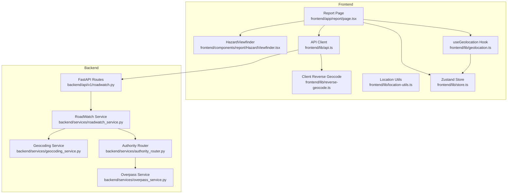
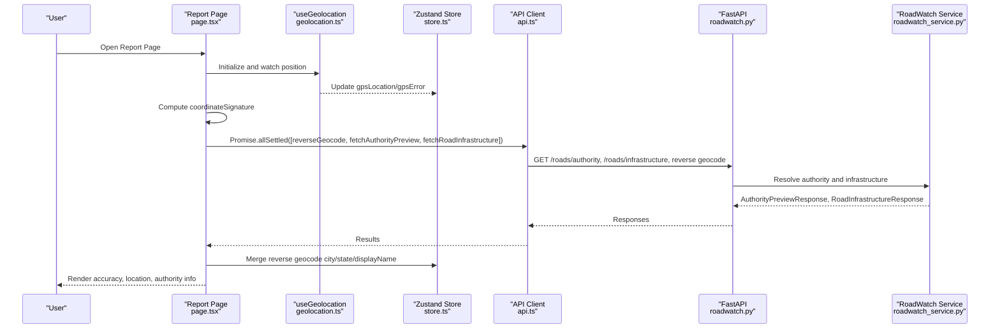
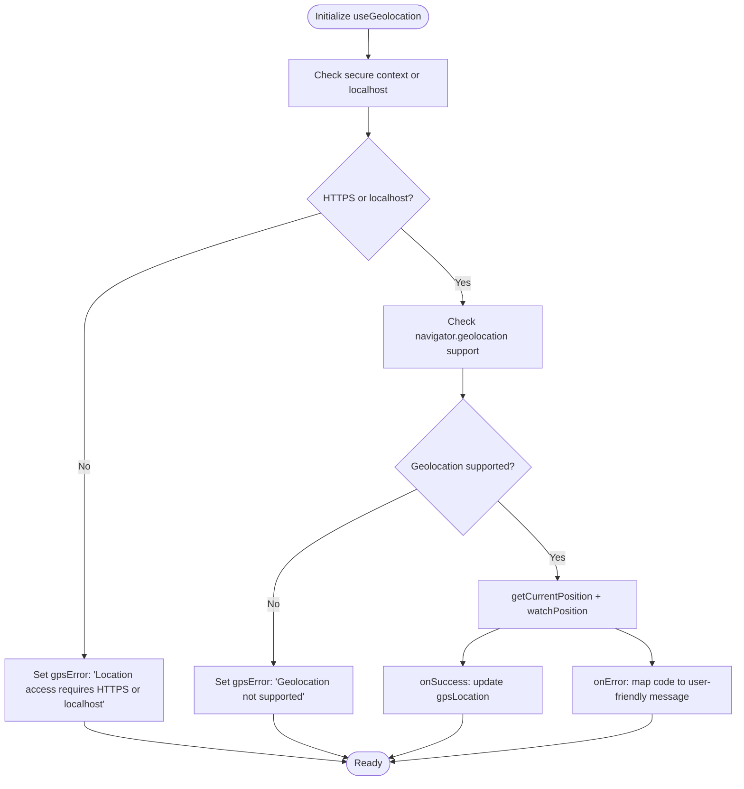
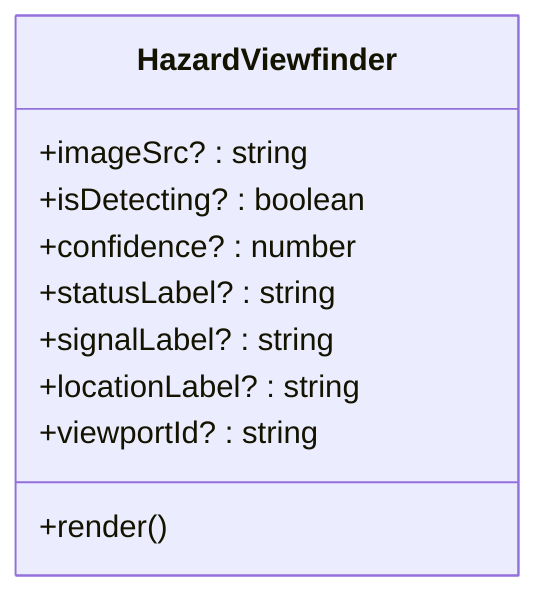
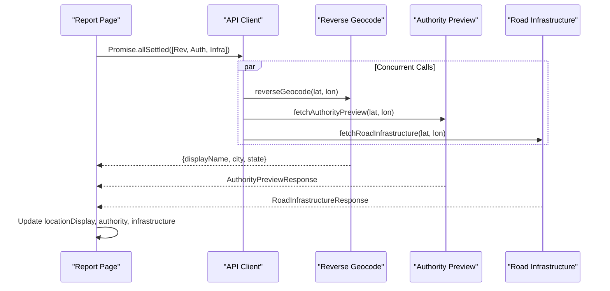
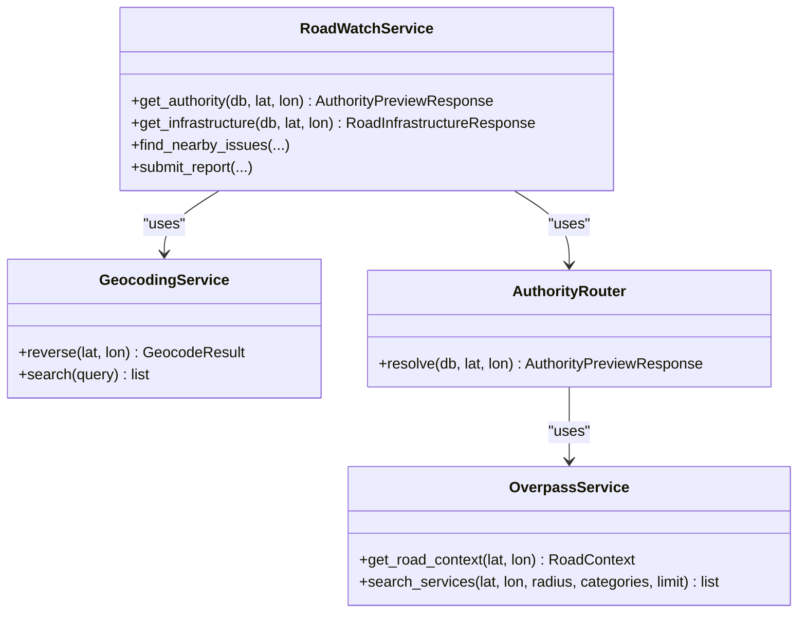
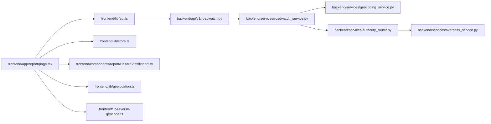

# Geotagged Reporting System

<cite>
**Referenced Files in This Document**
- [HazardViewfinder.tsx](file://frontend/components/report/HazardViewfinder.tsx)
- [report page.tsx](file://frontend/app/report/page.tsx)
- [geolocation.ts](file://frontend/lib/geolocation.ts)
- [reverse-geocode.ts](file://frontend/lib/reverse-geocode.ts)
- [location-utils.ts](file://frontend/lib/location-utils.ts)
- [api.ts](file://frontend/lib/api.ts)
- [store.ts](file://frontend/lib/store.ts)
- [roadwatch.py](file://backend/api/v1/roadwatch.py)
- [roadwatch_service.py](file://backend/services/roadwatch_service.py)
- [geocoding_service.py](file://backend/services/geocoding_service.py)
- [overpass_service.py](file://backend/services/overpass_service.py)
- [authority_router.py](file://backend/services/authority_router.py)
</cite>

## Table of Contents
1. [Introduction](#introduction)
2. [Project Structure](#project-structure)
3. [Core Components](#core-components)
4. [Architecture Overview](#architecture-overview)
5. [Detailed Component Analysis](#detailed-component-analysis)
6. [Dependency Analysis](#dependency-analysis)
7. [Performance Considerations](#performance-considerations)
8. [Troubleshooting Guide](#troubleshooting-guide)
9. [Conclusion](#conclusion)

## Introduction
This document describes the geotagged reporting system for precise location-based road hazard submission. It covers GPS auto-detection with accuracy indicators and approximate location handling, the hazard viewfinder interface with real-time camera feed, confidence scoring, and location overlay, the coordinate signature system for location synchronization, and the multi-API context loading for reverse geocoding, authority preview, and infrastructure data. It also documents location accuracy visualization with color-coded indicators (green/yellow/red), the user feedback system for location quality assessment, concurrent API call implementation, error handling strategies, location refresh mechanisms, and integration with OpenStreetMap and Overpass API for infrastructure transparency.

## Project Structure
The geotagged reporting system spans the frontend Next.js application and the backend FastAPI service. The frontend handles GPS acquisition, UI presentation, and concurrent context loading. The backend provides APIs for road authority preview, infrastructure metadata, reverse geocoding, and report submission, integrating OpenStreetMap/Overpass for road context and authority routing.

**Diagram sources**
- [report page.tsx:101-557](file://frontend/app/report/page.tsx#L101-L557)
- [HazardViewfinder.tsx:1-105](file://frontend/components/report/HazardViewfinder.tsx#L1-L105)
- [geolocation.ts:1-124](file://frontend/lib/geolocation.ts#L1-L124)
- [reverse-geocode.ts:1-49](file://frontend/lib/reverse-geocode.ts#L1-L49)
- [location-utils.ts:1-57](file://frontend/lib/location-utils.ts#L1-L57)
- [api.ts:1-821](file://frontend/lib/api.ts#L1-L821)
- [store.ts:1-226](file://frontend/lib/store.ts#L1-L226)
- [roadwatch.py:1-97](file://backend/api/v1/roadwatch.py#L1-L97)
- [roadwatch_service.py:1-325](file://backend/services/roadwatch_service.py#L1-L325)
- [geocoding_service.py:1-170](file://backend/services/geocoding_service.py#L1-L170)
- [overpass_service.py:1-249](file://backend/services/overpass_service.py#L1-L249)
- [authority_router.py:61-120](file://backend/services/authority_router.py#L61-L120)

**Section sources**
- [report page.tsx:101-557](file://frontend/app/report/page.tsx#L101-L557)
- [api.ts:654-721](file://frontend/lib/api.ts#L654-L721)
- [roadwatch.py:53-97](file://backend/api/v1/roadwatch.py#L53-L97)

## Core Components
- GPS Auto-Detection and Refresh: The frontend uses a React hook to acquire high-accuracy GPS with continuous watching, error handling, and manual refresh capability.
- Hazard Viewfinder UI: A real-time viewport component overlays confidence scoring, location vector, and status signals on optional photo evidence.
- Multi-API Context Loading: On coordinate change, the system concurrently resolves reverse geocoding, authority preview, and infrastructure metadata.
- Coordinate Signature: A stable string signature derived from rounded coordinates enables efficient caching and synchronization.
- Accuracy Visualization: Color-coded labels indicate GPS accuracy thresholds (green <10m, amber <30m, red otherwise).
- Approximate Location Handling: Threshold-based detection warns users when device/browser provides coarse location.
- Backend Integration: Reverse geocoding, authority preview, infrastructure lookup, and report submission are exposed via FastAPI endpoints and services.

**Section sources**
- [geolocation.ts:13-124](file://frontend/lib/geolocation.ts#L13-L124)
- [HazardViewfinder.tsx:17-105](file://frontend/components/report/HazardViewfinder.tsx#L17-L105)
- [report page.tsx:147-210](file://frontend/app/report/page.tsx#L147-L210)
- [location-utils.ts:17-57](file://frontend/lib/location-utils.ts#L17-L57)
- [api.ts:654-721](file://frontend/lib/api.ts#L654-L721)
- [roadwatch.py:53-97](file://backend/api/v1/roadwatch.py#L53-L97)

## Architecture Overview
The system orchestrates location acquisition, concurrent context resolution, and report submission through a clean separation of concerns between frontend UI and backend services.

**Diagram sources**
- [report page.tsx:147-210](file://frontend/app/report/page.tsx#L147-L210)
- [geolocation.ts:30-108](file://frontend/lib/geolocation.ts#L30-L108)
- [api.ts:654-721](file://frontend/lib/api.ts#L654-L721)
- [roadwatch.py:53-97](file://backend/api/v1/roadwatch.py#L53-L97)
- [roadwatch_service.py:70-125](file://backend/services/roadwatch_service.py#L70-L125)

## Detailed Component Analysis

### GPS Auto-Detection Mechanism
The GPS hook requests high-accuracy position with strict timeouts and continuous watching. It normalizes browser permission states, handles errors, and updates the global store. Manual refresh triggers a new acquisition cycle.

**Diagram sources**
- [geolocation.ts:30-108](file://frontend/lib/geolocation.ts#L30-L108)

**Section sources**
- [geolocation.ts:13-124](file://frontend/lib/geolocation.ts#L13-L124)

### Hazard Viewfinder Interface
The viewfinder displays a live viewport with optional photo overlay, confidence indicator, status label, and location vector. It animates scanning visuals during context loading and provides a stable viewport identifier.

**Diagram sources**
- [HazardViewfinder.tsx:7-25](file://frontend/components/report/HazardViewfinder.tsx#L7-L25)

**Section sources**
- [HazardViewfinder.tsx:17-105](file://frontend/components/report/HazardViewfinder.tsx#L17-L105)

### Multi-API Context Loading
On coordinate change, the system concurrently resolves three contexts:
- Reverse geocoding: Human-readable address and locality data.
- Authority preview: Road type, ownership, helpline, and escalation path.
- Infrastructure: Contractor, executive engineer, budgets, and maintenance schedule.

Results are merged into the UI with graceful degradation on failures.

**Diagram sources**
- [report page.tsx:151-203](file://frontend/app/report/page.tsx#L151-L203)
- [api.ts:654-721](file://frontend/lib/api.ts#L654-L721)

**Section sources**
- [report page.tsx:147-210](file://frontend/app/report/page.tsx#L147-L210)
- [api.ts:654-721](file://frontend/lib/api.ts#L654-L721)

### Coordinate Signature System
A coordinate signature is computed from rounded coordinates to uniquely identify a location for caching and synchronization. It is derived from the current GPS location and used to trigger context reloads.

**Section sources**
- [report page.tsx:120-120](file://frontend/app/report/page.tsx#L120-L120)
- [store.ts:4-12](file://frontend/lib/store.ts#L4-L12)

### Location Accuracy Visualization
Accuracy thresholds drive color-coded labels:
- Green: <10 meters
- Amber: <30 meters
- Red: ≥30 meters

The UI renders the accuracy label and a small badge indicating approximate location when the threshold is exceeded.

**Section sources**
- [report page.tsx:217-222](file://frontend/app/report/page.tsx#L217-L222)
- [location-utils.ts:21-31](file://frontend/lib/location-utils.ts#L21-L31)

### Approximate Location Handling
The system detects approximate locations using a configurable threshold (2.5 km). When detected, a warning is shown advising users to improve GPS fix for better authority matching.

**Section sources**
- [location-utils.ts:3-19](file://frontend/lib/location-utils.ts#L3-L19)
- [report page.tsx:301-306](file://frontend/app/report/page.tsx#L301-L306)
- [report page.tsx:347-347](file://frontend/app/report/page.tsx#L347-L347)

### Backend Reverse Geocoding and Authority Routing
The backend integrates Photon/Nominatim for reverse geocoding and Overpass for road context and nearby services. Authority routing maps road context to the appropriate road ownership and contact information.

**Diagram sources**
- [geocoding_service.py:33-97](file://backend/services/geocoding_service.py#L33-L97)
- [overpass_service.py:80-107](file://backend/services/overpass_service.py#L80-L107)
- [authority_router.py:73-79](file://backend/services/authority_router.py#L73-L79)
- [roadwatch_service.py:70-125](file://backend/services/roadwatch_service.py#L70-L125)

**Section sources**
- [geocoding_service.py:19-170](file://backend/services/geocoding_service.py#L19-L170)
- [overpass_service.py:24-134](file://backend/services/overpass_service.py#L24-L134)
- [authority_router.py:61-120](file://backend/services/authority_router.py#L61-L120)
- [roadwatch_service.py:56-125](file://backend/services/roadwatch_service.py#L56-L125)

### OpenStreetMap and Overpass Integration
The Overpass service queries OSM data to classify road types, compute distances, and enrich road context. Authority routing uses this context to determine the responsible authority and escalation path.

**Section sources**
- [overpass_service.py:80-107](file://backend/services/overpass_service.py#L80-L107)
- [overpass_service.py:110-122](file://backend/services/overpass_service.py#L110-L122)
- [authority_router.py:102-114](file://backend/services/authority_router.py#L102-L114)

### User Feedback System for Location Quality
The UI surfaces:
- Status label indicating current state (acquiring, syncing, ready).
- Signal label reflecting GPS acquisition progress.
- Location vector overlay with coordinates.
- Confidence badge for AI-assisted hazard detection.
- Approximate location warning with guidance.

**Section sources**
- [HazardViewfinder.tsx:48-98](file://frontend/components/report/HazardViewfinder.tsx#L48-L98)
- [report page.tsx:321-321](file://frontend/app/report/page.tsx#L321-L321)
- [report page.tsx:332-334](file://frontend/app/report/page.tsx#L332-L334)

## Dependency Analysis
The frontend depends on the backend APIs for context resolution and report submission. The backend composes multiple services: geocoding, authority routing, and Overpass for road context.

**Diagram sources**
- [report page.tsx:101-557](file://frontend/app/report/page.tsx#L101-L557)
- [api.ts:654-721](file://frontend/lib/api.ts#L654-L721)
- [roadwatch.py:53-97](file://backend/api/v1/roadwatch.py#L53-L97)
- [roadwatch_service.py:56-125](file://backend/services/roadwatch_service.py#L56-L125)
- [geocoding_service.py:19-97](file://backend/services/geocoding_service.py#L19-L97)
- [authority_router.py:73-79](file://backend/services/authority_router.py#L73-L79)
- [overpass_service.py:80-107](file://backend/services/overpass_service.py#L80-L107)

**Section sources**
- [report page.tsx:101-557](file://frontend/app/report/page.tsx#L101-L557)
- [api.ts:654-721](file://frontend/lib/api.ts#L654-L721)
- [roadwatch.py:53-97](file://backend/api/v1/roadwatch.py#L53-L97)

## Performance Considerations
- Concurrent API Calls: Using Promise.allSettled ensures the UI remains responsive even if one or more context APIs fail.
- Client-Side Reverse Geocoding: Frontend uses a free client-side API to avoid backend load and latency.
- Caching: Backend services cache geocoding and authority/infrastucture responses to reduce repeated external calls.
- Rate Limiting: Backend geocoding service enforces rate limits for Nominatim to prevent throttling.
- Approximate Location Threshold: Detecting coarse positions early avoids unnecessary backend work and informs the user.

[No sources needed since this section provides general guidance]

## Troubleshooting Guide
Common issues and remedies:
- Location Permission Denied: Prompt users to enable location in browser settings; the hook maps error codes to actionable messages.
- No GPS Fix: Advise moving outdoors or waiting for satellite lock; the UI shows “Acquiring GPS” until a fix is obtained.
- Approximate Location Warning: Inform users that a sharper GPS fix improves authority matching; suggest moving to an open area.
- Context API Failures: The UI gracefully handles failures by setting fallback messages and allowing retries.
- Report Submission Errors: Validation errors are surfaced with user-friendly messages; photos are validated for type and size.

**Section sources**
- [geolocation.ts:63-71](file://frontend/lib/geolocation.ts#L63-L71)
- [report page.tsx:67-74](file://frontend/app/report/page.tsx#L67-L74)
- [report page.tsx:169-199](file://frontend/app/report/page.tsx#L169-L199)
- [roadwatch_service.py:196-208](file://backend/services/roadwatch_service.py#L196-L208)

## Conclusion
The geotagged reporting system combines robust GPS acquisition, real-time UI feedback, and concurrent context resolution to deliver precise, location-aware road hazard reporting. By leveraging OpenStreetMap and Overpass for infrastructure transparency, the system ensures accurate authority matching and enhances community-driven road safety initiatives.