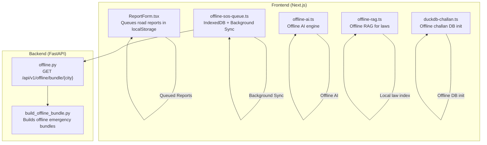
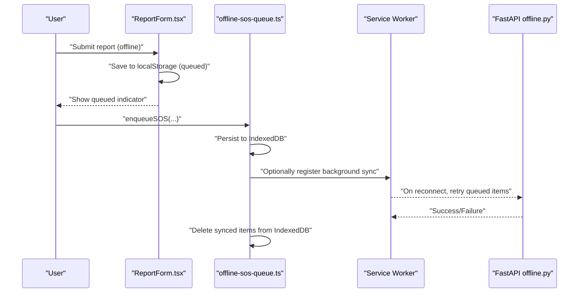
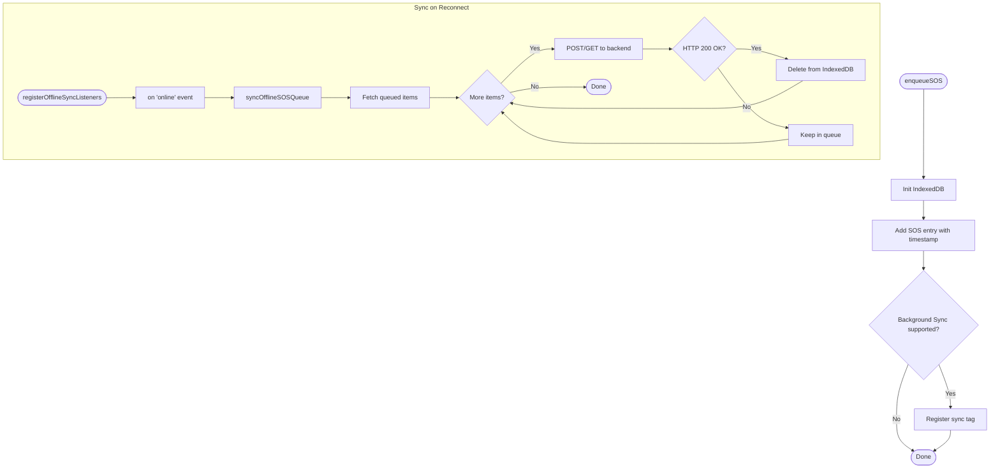
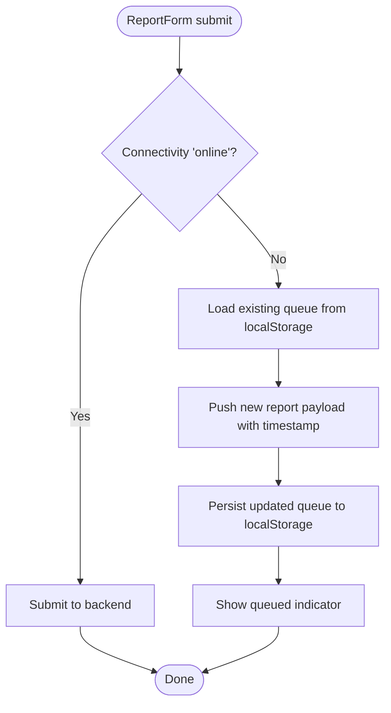
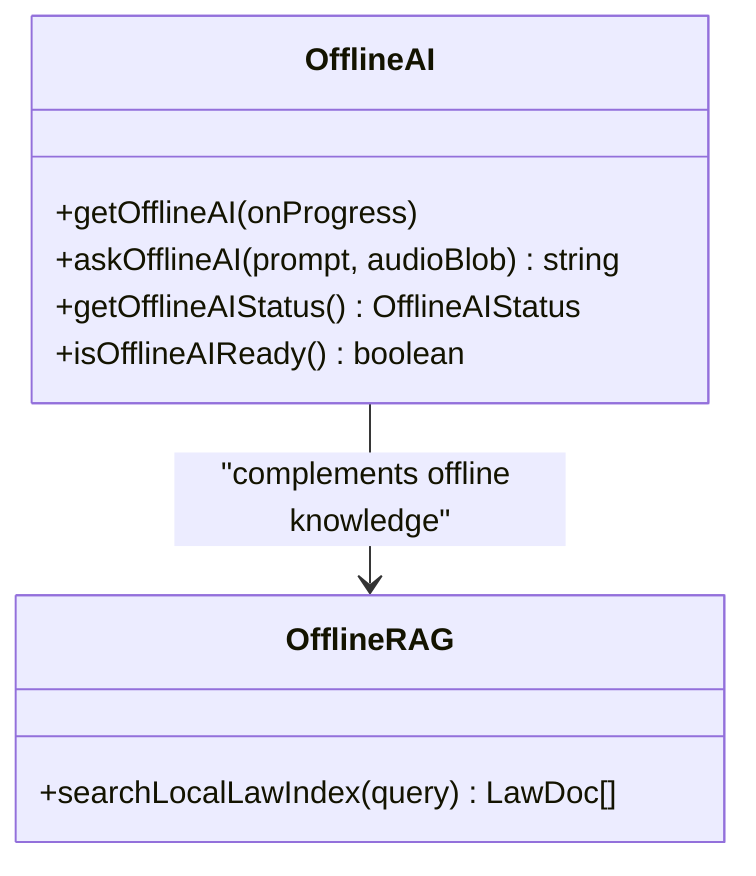
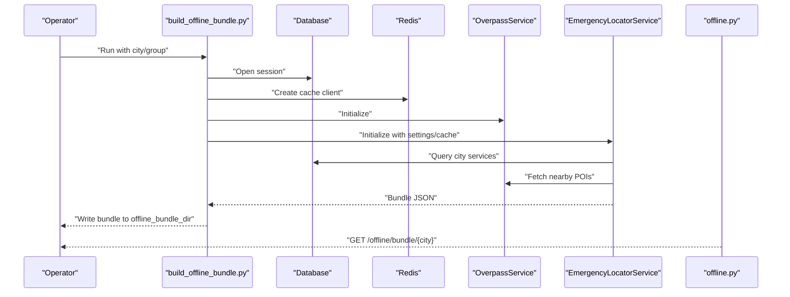
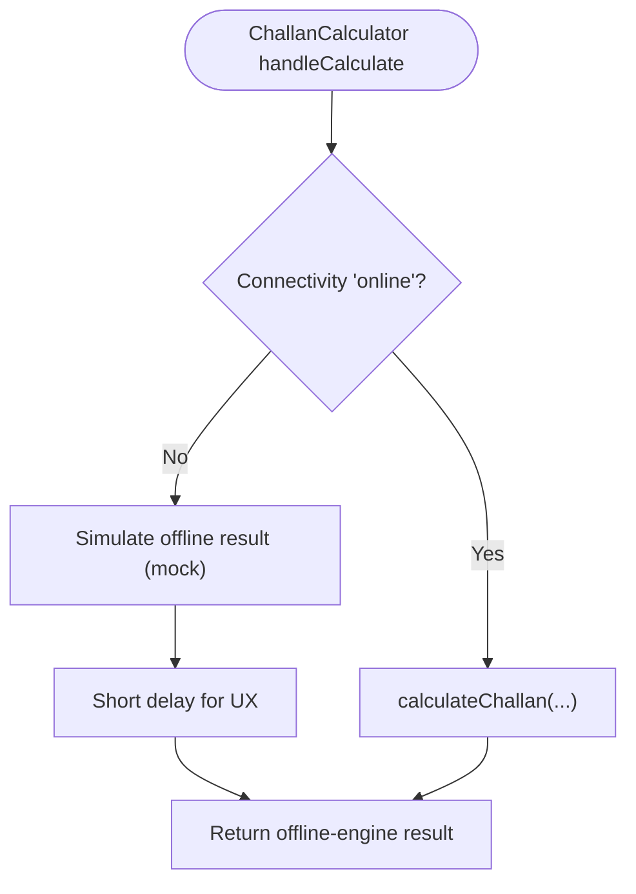
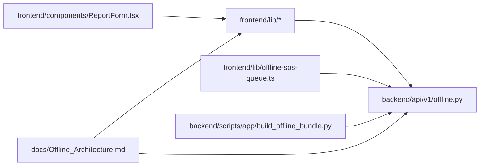

# Offline Report Functionality

<cite>
**Referenced Files in This Document**
- [offline-sos-queue.ts](file://frontend/lib/offline-sos-queue.ts)
- [offline-ai.ts](file://frontend/lib/offline-ai.ts)
- [offline-rag.ts](file://frontend/lib/offline-rag.ts)
- [ReportForm.tsx](file://frontend/components/ReportForm.tsx)
- [offline.py](file://backend/api/v1/offline.py)
- [build_offline_bundle.py](file://backend/scripts/app/build_offline_bundle.py)
- [Offline_Architecture.md](file://docs/Offline_Architecture.md)
- [TechStack.md](file://docs/TechStack.md)
- [duckdb-challan.ts](file://frontend/lib/duckdb-challan.ts)
- [ChallanCalculator.tsx](file://frontend/components/ChallanCalculator.tsx)
</cite>

## Table of Contents
1. [Introduction](#introduction)
2. [Project Structure](#project-structure)
3. [Core Components](#core-components)
4. [Architecture Overview](#architecture-overview)
5. [Detailed Component Analysis](#detailed-component-analysis)
6. [Dependency Analysis](#dependency-analysis)
7. [Performance Considerations](#performance-considerations)
8. [Troubleshooting Guide](#troubleshooting-guide)
9. [Conclusion](#conclusion)
10. [Appendices](#appendices)

## Introduction
This document explains the offline report functionality with a focus on report queuing and asynchronous processing for areas with poor connectivity. It covers:
- IndexedDB-backed offline storage for queued reports and SOS events
- Background synchronization using browser APIs and service workers
- Offline queue management, retry behavior, and reconnection-triggered batch submission
- Offline data bundling for emergency services and road infrastructure
- Conflict resolution strategies, user notifications, and graceful degradation patterns

## Project Structure
The offline report capability spans the frontend (Next.js) and backend (FastAPI). The frontend handles local persistence, background sync triggers, and offline-aware UI behaviors. The backend exposes endpoints for offline data bundling and emergency SOS handling.

**Diagram sources**
- [offline-sos-queue.ts:1-138](file://frontend/lib/offline-sos-queue.ts#L1-L138)
- [offline-ai.ts:1-256](file://frontend/lib/offline-ai.ts#L1-L256)
- [offline-rag.ts:1-35](file://frontend/lib/offline-rag.ts#L1-L35)
- [ReportForm.tsx:40-204](file://frontend/components/ReportForm.tsx#L40-L204)
- [offline.py:1-28](file://backend/api/v1/offline.py#L1-L28)
- [build_offline_bundle.py:1-51](file://backend/scripts/app/build_offline_bundle.py#L1-L51)

**Section sources**
- [offline-sos-queue.ts:1-138](file://frontend/lib/offline-sos-queue.ts#L1-L138)
- [offline-ai.ts:1-256](file://frontend/lib/offline-ai.ts#L1-L256)
- [offline-rag.ts:1-35](file://frontend/lib/offline-rag.ts#L1-L35)
- [ReportForm.tsx:40-204](file://frontend/components/ReportForm.tsx#L40-L204)
- [offline.py:1-28](file://backend/api/v1/offline.py#L1-L28)
- [build_offline_bundle.py:1-51](file://backend/scripts/app/build_offline_bundle.py#L1-L51)

## Core Components
- Offline SOS Queue: Stores SOS events in IndexedDB and attempts to sync upon reconnection. It optionally triggers background sync via the browser’s SyncManager.
- Offline Report Queue: Queues road reports in localStorage when offline; later submitted when connectivity returns.
- Offline AI and RAG: Provides offline-capable AI responses and local legal document retrieval for road safety queries.
- Offline Data Bundles: Backend endpoint and script to build offline emergency bundles for cities, enabling offline discovery of nearby services.

**Section sources**
- [offline-sos-queue.ts:1-138](file://frontend/lib/offline-sos-queue.ts#L1-L138)
- [offline-ai.ts:1-256](file://frontend/lib/offline-ai.ts#L1-L256)
- [offline-rag.ts:1-35](file://frontend/lib/offline-rag.ts#L1-L35)
- [ReportForm.tsx:40-204](file://frontend/components/ReportForm.tsx#L40-L204)
- [offline.py:1-28](file://backend/api/v1/offline.py#L1-L28)
- [build_offline_bundle.py:1-51](file://backend/scripts/app/build_offline_bundle.py#L1-L51)

## Architecture Overview
The offline architecture combines browser-native capabilities with backend-provided offline bundles:
- IndexedDB persists queued SOS events and can be extended for queued road reports.
- Service Worker + Background Sync can trigger retries for queued items when connectivity is restored.
- Offline bundles enable offline discovery of emergency services and road infrastructure.

**Diagram sources**
- [offline-sos-queue.ts:48-69](file://frontend/lib/offline-sos-queue.ts#L48-L69)
- [offline-sos-queue.ts:75-124](file://frontend/lib/offline-sos-queue.ts#L75-L124)
- [offline.py:18-27](file://backend/api/v1/offline.py#L18-L27)

## Detailed Component Analysis

### Offline SOS Queue (IndexedDB + Background Sync)
- IndexedDB schema defines a store for SOS entries with a timestamp index.
- Enqueue adds a new SOS with a timestamp and optionally registers a background sync tag.
- Sync iterates queued items, sends them to the backend, and deletes successful submissions.
- Reconnection listener triggers automatic sync when the network returns.

**Diagram sources**
- [offline-sos-queue.ts:25-42](file://frontend/lib/offline-sos-queue.ts#L25-L42)
- [offline-sos-queue.ts:48-69](file://frontend/lib/offline-sos-queue.ts#L48-L69)
- [offline-sos-queue.ts:75-124](file://frontend/lib/offline-sos-queue.ts#L75-L124)
- [offline-sos-queue.ts:130-137](file://frontend/lib/offline-sos-queue.ts#L130-L137)

**Section sources**
- [offline-sos-queue.ts:1-138](file://frontend/lib/offline-sos-queue.ts#L1-L138)

### Offline Report Queue (localStorage)
- When offline, the report form saves a normalized payload to localStorage under a dedicated queue key.
- The UI indicates that the report is queued and will be transmitted when connectivity returns.

**Diagram sources**
- [ReportForm.tsx:40-64](file://frontend/components/ReportForm.tsx#L40-L64)

**Section sources**
- [ReportForm.tsx:40-204](file://frontend/components/ReportForm.tsx#L40-L204)

### Offline AI Engine and RAG
- Offline AI supports three tiers: system AI (Chrome built-in), Transformers.js Gemma 4 E2B, and keyword fallback.
- Offline RAG simulates vector-like similarity search over a small local dataset of road safety laws.

**Diagram sources**
- [offline-ai.ts:124-154](file://frontend/lib/offline-ai.ts#L124-L154)
- [offline-ai.ts:160-211](file://frontend/lib/offline-ai.ts#L160-L211)
- [offline-rag.ts:22-34](file://frontend/lib/offline-rag.ts#L22-L34)

**Section sources**
- [offline-ai.ts:1-256](file://frontend/lib/offline-ai.ts#L1-L256)
- [offline-rag.ts:1-35](file://frontend/lib/offline-rag.ts#L1-L35)

### Offline Data Bundling for Emergency Services
- Backend exposes a GET endpoint to build and return an offline bundle for a given city.
- A script orchestrates building bundles using the emergency locator service, Overpass service, and Redis cache.

**Diagram sources**
- [offline.py:18-27](file://backend/api/v1/offline.py#L18-L27)
- [build_offline_bundle.py:14-31](file://backend/scripts/app/build_offline_bundle.py#L14-L31)

**Section sources**
- [offline.py:1-28](file://backend/api/v1/offline.py#L1-L28)
- [build_offline_bundle.py:1-51](file://backend/scripts/app/build_offline_bundle.py#L1-L51)

### Offline Challan Calculation (Graceful Degradation)
- When offline, the challan calculator provides a deterministic offline result after a short delay.
- DuckDB initialization is abstracted for offline DB setup; the UI reflects offline calculation.

**Diagram sources**
- [ChallanCalculator.tsx:32-62](file://frontend/components/ChallanCalculator.tsx#L32-L62)
- [duckdb-challan.ts:3-18](file://frontend/lib/duckdb-challan.ts#L3-L18)

**Section sources**
- [ChallanCalculator.tsx:32-62](file://frontend/components/ChallanCalculator.tsx#L32-L62)
- [duckdb-challan.ts:3-18](file://frontend/lib/duckdb-challan.ts#L3-L18)

## Dependency Analysis
- Frontend depends on browser APIs (IndexedDB, Service Worker, Background Sync) and environment variables for backend URLs.
- Backend depends on emergency locator services, Overpass service, and Redis cache to assemble offline bundles.
- The offline architecture doc outlines current limitations and proposes enterprise-grade improvements.

**Diagram sources**
- [offline-sos-queue.ts:1-138](file://frontend/lib/offline-sos-queue.ts#L1-L138)
- [offline.py:1-28](file://backend/api/v1/offline.py#L1-L28)
- [build_offline_bundle.py:1-51](file://backend/scripts/app/build_offline_bundle.py#L1-L51)
- [Offline_Architecture.md:1-23](file://docs/Offline_Architecture.md#L1-L23)

**Section sources**
- [offline-sos-queue.ts:1-138](file://frontend/lib/offline-sos-queue.ts#L1-L138)
- [offline.py:1-28](file://backend/api/v1/offline.py#L1-L28)
- [build_offline_bundle.py:1-51](file://backend/scripts/app/build_offline_bundle.py#L1-L51)
- [Offline_Architecture.md:1-23](file://docs/Offline_Architecture.md#L1-L23)

## Performance Considerations
- IndexedDB transactions and getAll/getAllKeys are used to enumerate queued items; consider batching and backoff strategies for large queues.
- Background Sync availability varies by browser; the implementation includes a fallback to manual reconnection-triggered sync.
- Offline AI model downloads are large; leverage browser caching and prefer system AI when available to minimize bandwidth and latency.
- Offline bundles should be compressed and cached locally to reduce initial load time.

## Troubleshooting Guide
- IndexedDB initialization failures: Verify browser support and SSR guards; ensure the DB upgrade path creates stores and indexes.
- Background Sync registration failures: Confirm service worker readiness and SyncManager availability; log warnings and continue with manual sync.
- Network errors during sync: The sync loop stops on the first failure; reconnecting restores further attempts.
- Offline bundle build failures: Validate city names, Overpass service availability, and Redis connectivity; check write permissions for the offline bundle directory.
- Offline report queue not transmitting: Confirm localStorage persistence and that the UI triggers submission when connectivity returns.

**Section sources**
- [offline-sos-queue.ts:25-42](file://frontend/lib/offline-sos-queue.ts#L25-L42)
- [offline-sos-queue.ts:61-68](file://frontend/lib/offline-sos-queue.ts#L61-L68)
- [offline-sos-queue.ts:118-123](file://frontend/lib/offline-sos-queue.ts#L118-L123)
- [offline.py:24-27](file://backend/api/v1/offline.py#L24-L27)
- [build_offline_bundle.py:14-31](file://backend/scripts/app/build_offline_bundle.py#L14-L31)

## Conclusion
The offline report functionality leverages IndexedDB for persistent queuing, optional background sync for retries, and offline-aware UI behaviors. The backend contributes by providing offline data bundles for emergency services and road infrastructure. Together, these components ensure core functionality remains available and data consistency is maintained during connectivity issues.

## Appendices

### Offline Technologies Overview
- Browser-native technologies used for offline capabilities include IndexedDB, Service Worker + Workbox, Cache Storage API, Background Sync API, and Notification API.

**Section sources**
- [TechStack.md:56-70](file://docs/TechStack.md#L56-L70)

### Offline Architecture Notes
- Current MVP uses ephemeral disks and local uploads, which are unsuitable for enterprise-scale distribution. The proposed V2 solution migrates to object storage and uses Supabase Realtime for robust offline resync and conflict resolution.

**Section sources**
- [Offline_Architecture.md:1-23](file://docs/Offline_Architecture.md#L1-L23)