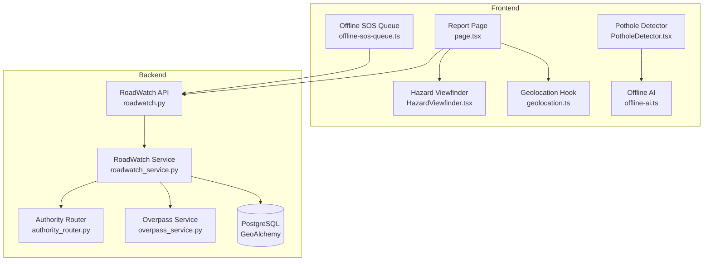
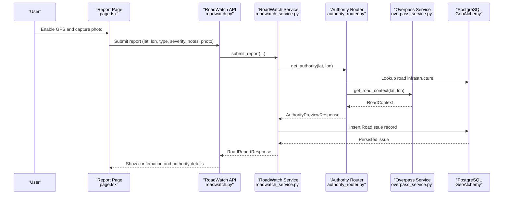
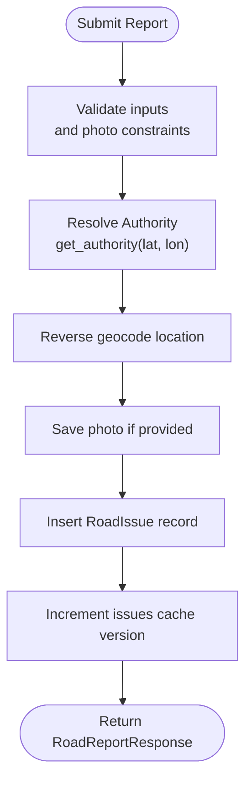
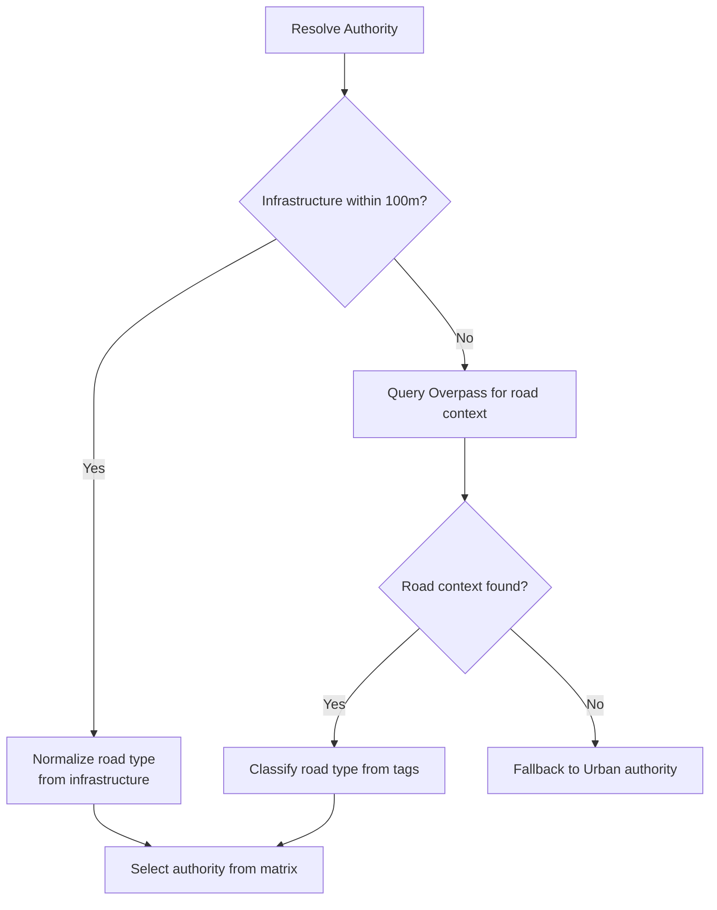
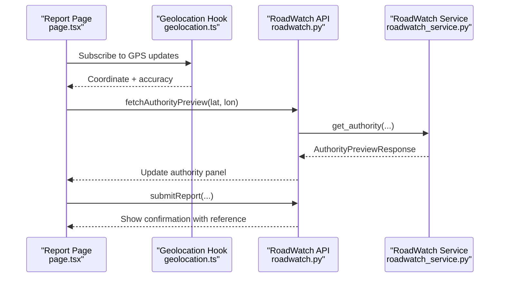
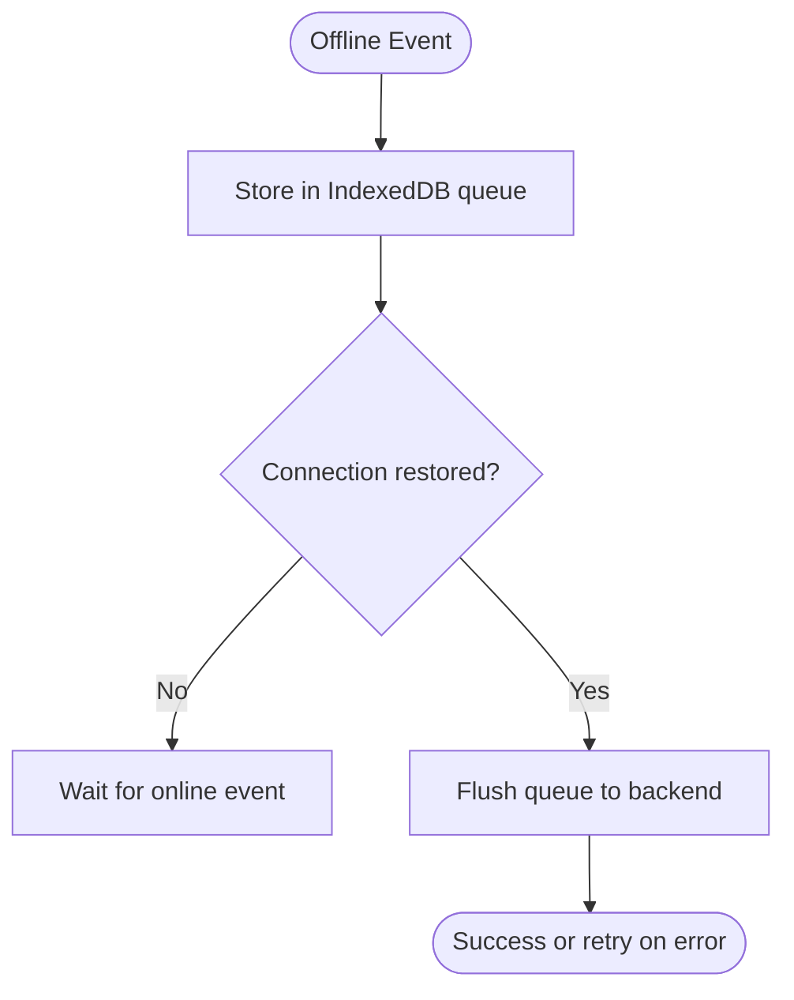
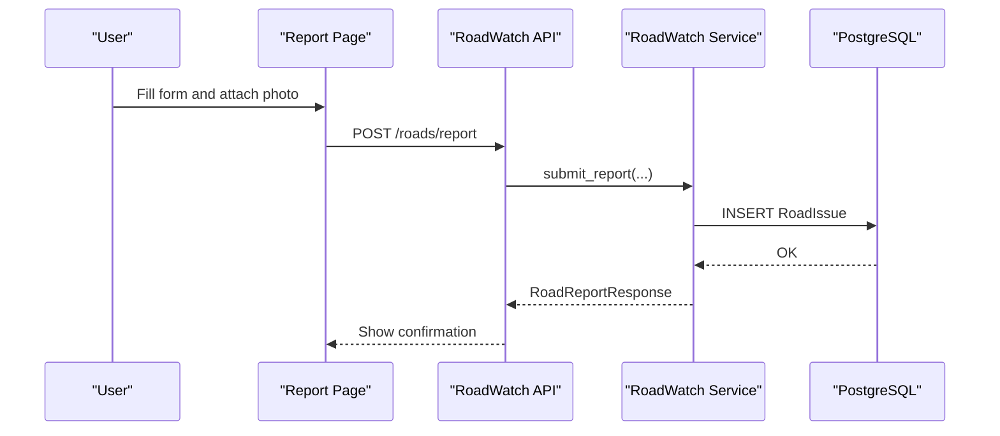
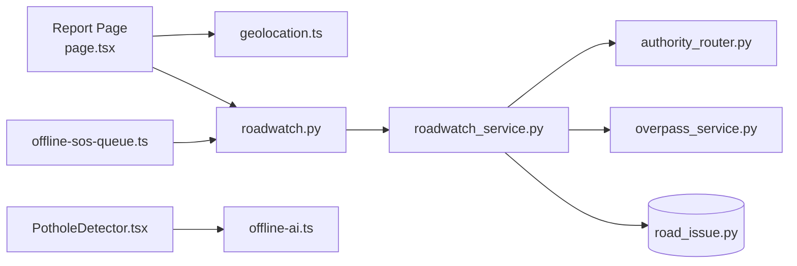

# Road Reporter (RoadWatch)

<cite>
**Referenced Files in This Document**
- [roadwatch.py](file://backend/api/v1/roadwatch.py)
- [roadwatch_service.py](file://backend/services/roadwatch_service.py)
- [authority_router.py](file://backend/services/authority_router.py)
- [overpass_service.py](file://backend/services/overpass_service.py)
- [road_issue.py](file://backend/models/road_issue.py)
- [page.tsx](file://frontend/app/report/page.tsx)
- [HazardViewfinder.tsx](file://frontend/components/report/HazardViewfinder.tsx)
- [PotholeDetector.tsx](file://frontend/components/PotholeDetector.tsx)
- [offline-ai.ts](file://frontend/lib/offline-ai.ts)
- [offline-sos-queue.ts](file://frontend/lib/offline-sos-queue.ts)
- [api.ts](file://frontend/lib/api.ts)
- [geolocation.ts](file://frontend/lib/geolocation.ts)
- [AI_Instructions.md](file://docs/AI_Instructions.md)
</cite>

## Table of Contents
1. [Introduction](#introduction)
2. [Project Structure](#project-structure)
3. [Core Components](#core-components)
4. [Architecture Overview](#architecture-overview)
5. [Detailed Component Analysis](#detailed-component-analysis)
6. [Dependency Analysis](#dependency-analysis)
7. [Performance Considerations](#performance-considerations)
8. [Troubleshooting Guide](#troubleshooting-guide)
9. [Conclusion](#conclusion)
10. [Appendices](#appendices)

## Introduction
Road Reporter (RoadWatch) enables community-driven, geotagged road infrastructure reporting with transparency. It integrates automatic location detection, optional photo capture, AI-powered pothole detection, automatic authority routing, and a community reporting interface with real-time updates. It also supports offline scenarios with a report queue for areas with poor connectivity and integrates with OpenStreetMap and Overpass API for infrastructure transparency.

## Project Structure
RoadWatch spans backend APIs and services, a frontend reporting interface, and offline capabilities:
- Backend FastAPI routes expose endpoints for nearby issues, authority preview, infrastructure lookup, and report submission.
- Services implement spatial queries, authority routing, reverse geocoding, and Overpass integration.
- Frontend pages and components provide the hazard viewfinder, camera-based pothole detection, and a comprehensive reporting form.
- Offline support includes an IndexedDB queue for SOS reports and an offline AI engine for conversational assistance.

**Diagram sources**
- [roadwatch.py:19-97](file://backend/api/v1/roadwatch.py#L19-L97)
- [roadwatch_service.py:56-325](file://backend/services/roadwatch_service.py#L56-L325)
- [authority_router.py:42-143](file://backend/services/authority_router.py#L42-L143)
- [overpass_service.py:24-249](file://backend/services/overpass_service.py#L24-L249)
- [page.tsx:101-557](file://frontend/app/report/page.tsx#L101-L557)
- [HazardViewfinder.tsx:17-105](file://frontend/components/report/HazardViewfinder.tsx#L17-L105)
- [PotholeDetector.tsx:11-146](file://frontend/components/PotholeDetector.tsx#L11-L146)
- [offline-ai.ts:124-154](file://frontend/lib/offline-ai.ts#L124-L154)
- [offline-sos-queue.ts:25-42](file://frontend/lib/offline-sos-queue.ts#L25-L42)

**Section sources**
- [roadwatch.py:19-97](file://backend/api/v1/roadwatch.py#L19-L97)
- [roadwatch_service.py:56-325](file://backend/services/roadwatch_service.py#L56-L325)
- [page.tsx:101-557](file://frontend/app/report/page.tsx#L101-L557)

## Core Components
- RoadWatch API: Exposes endpoints for nearby issues, authority preview, infrastructure lookup, and report submission.
- RoadWatch Service: Handles spatial queries, reverse geocoding, photo saving, and report creation with authority tagging.
- Authority Router: Determines responsible authority based on road infrastructure or Overpass data.
- Overpass Service: Queries OpenStreetMap/Overpass for road context and nearby services.
- Frontend Reporting Page: Provides hazard viewfinder, camera capture, severity selection, notes, and real-time authority preview.
- Offline Support: IndexedDB queue for SOS reports and offline AI engine for conversational assistance.

**Section sources**
- [roadwatch.py:26-97](file://backend/api/v1/roadwatch.py#L26-L97)
- [roadwatch_service.py:70-253](file://backend/services/roadwatch_service.py#L70-L253)
- [authority_router.py:48-126](file://backend/services/authority_router.py#L48-L126)
- [overpass_service.py:80-122](file://backend/services/overpass_service.py#L80-L122)
- [page.tsx:101-557](file://frontend/app/report/page.tsx#L101-L557)

## Architecture Overview
The system follows a layered architecture:
- Presentation: Next.js frontend with React components and hooks.
- API: FastAPI routes for RoadWatch operations.
- Services: Business logic for spatial analysis, authority routing, and external integrations.
- Persistence: PostgreSQL with GeoAlchemy for geospatial data.
- External Integrations: Overpass API for road context and OpenStreetMap data.

**Diagram sources**
- [roadwatch.py:73-97](file://backend/api/v1/roadwatch.py#L73-L97)
- [roadwatch_service.py:186-253](file://backend/services/roadwatch_service.py#L186-L253)
- [authority_router.py:48-126](file://backend/services/authority_router.py#L48-L126)
- [overpass_service.py:80-122](file://backend/services/overpass_service.py#L80-L122)
- [road_issue.py:14-40](file://backend/models/road_issue.py#L14-L40)

## Detailed Component Analysis

### Backend API: RoadWatch Endpoints
- GET /api/v1/roads/issues: Fetch nearby issues within a radius, filtered by status.
- GET /api/v1/roads/authority: Get authority preview for a coordinate.
- GET /api/v1/roads/infrastructure: Get road infrastructure metadata near a coordinate.
- POST /api/v1/roads/report: Submit a road issue report with geotag, severity, description, and optional photo.

Validation and caching are applied for robustness and performance.

**Section sources**
- [roadwatch.py:26-97](file://backend/api/v1/roadwatch.py#L26-L97)

### RoadWatch Service: Spatial Analysis and Submission
- Authority Resolution: Uses cached authority preview derived from road infrastructure or Overpass road context.
- Infrastructure Lookup: Proximity search within a small radius to enrich road metadata.
- Reverse Geocoding: Attempts to derive a readable address for the reported location.
- Photo Handling: Validates content type and magic bytes, enforces size limits, and persists to configured upload directory.
- Report Creation: Inserts a RoadIssue record with status, authority info, and complaint reference.

**Diagram sources**
- [roadwatch_service.py:186-253](file://backend/services/roadwatch_service.py#L186-L253)

**Section sources**
- [roadwatch_service.py:70-253](file://backend/services/roadwatch_service.py#L70-L253)
- [road_issue.py:14-40](file://backend/models/road_issue.py#L14-L40)

### Authority Routing: Automatic Authority Assignment
- Road Infrastructure Priority: If a road segment exists within a small radius, use its type and number to normalize to a road type code.
- Overpass Fallback: If no infrastructure found, query Overpass for the nearest highway tag and classify road type.
- Authority Matrix: Maps normalized road type codes to responsible authority, helpline, and escalation path.

**Diagram sources**
- [authority_router.py:48-126](file://backend/services/authority_router.py#L48-L126)
- [overpass_service.py:80-122](file://backend/services/overpass_service.py#L80-L122)

**Section sources**
- [authority_router.py:42-143](file://backend/services/authority_router.py#L42-L143)
- [overpass_service.py:80-122](file://backend/services/overpass_service.py#L80-L122)

### Community Reporting Interface: Hazard Viewfinder and Real-Time Updates
- Hazard Viewfinder: Live viewport with GPS status, signal strength, and optional photo overlay; displays AI confidence and hazard status.
- Real-Time Authority Preview: Shows road type, authority, helpline, and portal; updates as GPS coordinates change.
- Severity Selection: Intuitive slider with risk levels guiding urgency.
- Notes Field: Optional narrative for situational context.
- Submission Feedback: Confirmation screen with complaint reference and authority contact.

**Diagram sources**
- [page.tsx:134-210](file://frontend/app/report/page.tsx#L134-L210)
- [geolocation.ts:13-123](file://frontend/lib/geolocation.ts#L13-L123)
- [roadwatch.py:53-97](file://backend/api/v1/roadwatch.py#L53-L97)
- [roadwatch_service.py:70-125](file://backend/services/roadwatch_service.py#L70-L125)

**Section sources**
- [page.tsx:101-557](file://frontend/app/report/page.tsx#L101-L557)
- [HazardViewfinder.tsx:17-105](file://frontend/components/report/HazardViewfinder.tsx#L17-L105)
- [geolocation.ts:13-123](file://frontend/lib/geolocation.ts#L13-L123)

### AI-Powered Pothole Detection: In-Browser Computer Vision
- In-Browser Detection: Uses a 15MB ONNX model (YOLOv8n) via Transformers.js to detect potholes and road damage directly in the browser.
- Offline Capability: Model is cached in browser storage; detection works without server round trips.
- Confidence Scoring: Displays confidence thresholds for low, possible, and confirmed detections.
- Integration Point: The PotholeDetector component demonstrates the UI and lifecycle for initiating detection.

Note: The in-browser YOLO model is referenced in the project documentation and implemented in the frontend component.

**Section sources**
- [PotholeDetector.tsx:11-146](file://frontend/components/PotholeDetector.tsx#L11-L146)
- [AI_Instructions.md:181-213](file://docs/AI_Instructions.md#L181-L213)

### Offline Report Queue: Connectivity Resilience
- IndexedDB Queue: Stores SOS events offline; syncs automatically when connectivity is restored.
- Background Sync: Attempts to register service worker background sync for queued items.
- RoadWatch Context: While the primary RoadWatch submission logic resides in the backend, the offline queue pattern is established for resilient reporting under poor connectivity.

**Diagram sources**
- [offline-sos-queue.ts:48-124](file://frontend/lib/offline-sos-queue.ts#L48-L124)

**Section sources**
- [offline-sos-queue.ts:25-138](file://frontend/lib/offline-sos-queue.ts#L25-L138)

### Integration with OpenStreetMap and Overpass API
- Road Context: Overpass queries return the nearest highway-tagged ways and classifies road type codes.
- Infrastructure Metadata: Authority router can leverage road infrastructure records; otherwise falls back to Overpass-derived context.
- Service Search: Overpass service also supports nearby emergency services, demonstrating broader OSM integration.

**Section sources**
- [overpass_service.py:80-122](file://backend/services/overpass_service.py#L80-L122)
- [authority_router.py:73-126](file://backend/services/authority_router.py#L73-L126)

### Reporting Workflow: From Submission to Authority Notification
- Location Detection: GPS hook provides coordinates with accuracy; reverse geocoding augments address context.
- Photo Capture: Optional photo upload with validation and persistence.
- Authority Routing: Determined via infrastructure or Overpass context.
- Submission: API endpoint persists the issue and returns a structured response with authority contact and complaint reference.
- User Feedback: Confirmation screen displays reference, authority, and portal link.

**Diagram sources**
- [page.tsx:232-258](file://frontend/app/report/page.tsx#L232-L258)
- [roadwatch.py:73-97](file://backend/api/v1/roadwatch.py#L73-L97)
- [roadwatch_service.py:186-253](file://backend/services/roadwatch_service.py#L186-L253)
- [road_issue.py:14-40](file://backend/models/road_issue.py#L14-L40)

**Section sources**
- [page.tsx:232-258](file://frontend/app/report/page.tsx#L232-L258)
- [roadwatch.py:73-97](file://backend/api/v1/roadwatch.py#L73-L97)
- [roadwatch_service.py:186-253](file://backend/services/roadwatch_service.py#L186-L253)

## Dependency Analysis
- Backend Dependencies:
  - FastAPI routes depend on RoadWatch Service.
  - RoadWatch Service depends on Authority Router, Overpass Service, and database models.
  - Authority Router depends on Overpass Service and database for infrastructure.
- Frontend Dependencies:
  - Report Page depends on geolocation hook, API helpers, and UI components.
  - PotholeDetector depends on Transformers.js for in-browser detection.
  - Offline AI and SOS queue demonstrate offline resilience patterns.

**Diagram sources**
- [page.tsx:101-557](file://frontend/app/report/page.tsx#L101-L557)
- [roadwatch.py:19-97](file://backend/api/v1/roadwatch.py#L19-L97)
- [roadwatch_service.py:56-325](file://backend/services/roadwatch_service.py#L56-L325)
- [authority_router.py:42-143](file://backend/services/authority_router.py#L42-L143)
- [overpass_service.py:24-249](file://backend/services/overpass_service.py#L24-L249)
- [road_issue.py:14-40](file://backend/models/road_issue.py#L14-L40)
- [PotholeDetector.tsx:11-146](file://frontend/components/PotholeDetector.tsx#L11-L146)
- [offline-ai.ts:124-154](file://frontend/lib/offline-ai.ts#L124-L154)
- [offline-sos-queue.ts:25-42](file://frontend/lib/offline-sos-queue.ts#L25-L42)

**Section sources**
- [roadwatch_service.py:56-69](file://backend/services/roadwatch_service.py#L56-L69)
- [authority_router.py:42-46](file://backend/services/authority_router.py#L42-L46)
- [overpass_service.py:24-31](file://backend/services/overpass_service.py#L24-L31)
- [road_issue.py:14-40](file://backend/models/road_issue.py#L14-L40)

## Performance Considerations
- Spatial Queries: Distance calculations and ST_DWithin are used to efficiently bound nearby issues and infrastructure lookups.
- Caching: Authority and issues responses are cached with versioned keys to minimize repeated work.
- Image Validation: Magic-byte checks and size limits prevent malformed uploads and excessive disk usage.
- Offline Resilience: IndexedDB queues and offline AI reduce reliance on network availability.

[No sources needed since this section provides general guidance]

## Troubleshooting Guide
- GPS Issues: Verify secure context (HTTPS) and permissions; the geolocation hook surfaces explicit error messages for denial, unavailability, and timeouts.
- Overpass Unavailable: Authority resolution falls back to a default urban authority when external service errors occur.
- Photo Upload Errors: Ensure allowed content types and size limits; validation raises descriptive errors for unsupported formats or oversized files.
- Offline Sync: IndexedDB queue stores SOS events; background sync attempts to transmit when connectivity returns.

**Section sources**
- [geolocation.ts:30-108](file://frontend/lib/geolocation.ts#L30-L108)
- [authority_router.py:73-79](file://backend/services/authority_router.py#L73-L79)
- [roadwatch_service.py:280-318](file://backend/services/roadwatch_service.py#L280-L318)
- [offline-sos-queue.ts:75-124](file://frontend/lib/offline-sos-queue.ts#L75-L124)

## Conclusion
RoadWatch delivers a robust, community-driven road reporting platform with automatic location detection, optional photo capture, AI-powered pothole detection, and seamless authority routing. Its integration with OpenStreetMap and Overpass ensures transparency and accuracy, while offline capabilities and resilient queues enhance usability in challenging connectivity environments.

[No sources needed since this section summarizes without analyzing specific files]

## Appendices

### API Definitions
- GET /api/v1/roads/issues
  - Query: lat, lon, radius, limit, statuses
  - Response: RoadIssuesResponse
- GET /api/v1/roads/authority
  - Query: lat, lon
  - Response: AuthorityPreviewResponse
- GET /api/v1/roads/infrastructure
  - Query: lat, lon
  - Response: RoadInfrastructureResponse
- POST /api/v1/roads/report
  - Form: lat, lon, issue_type, severity, description, photo
  - Response: RoadReportResponse

**Section sources**
- [roadwatch.py:26-97](file://backend/api/v1/roadwatch.py#L26-L97)
- [api.ts:156-200](file://frontend/lib/api.ts#L156-L200)