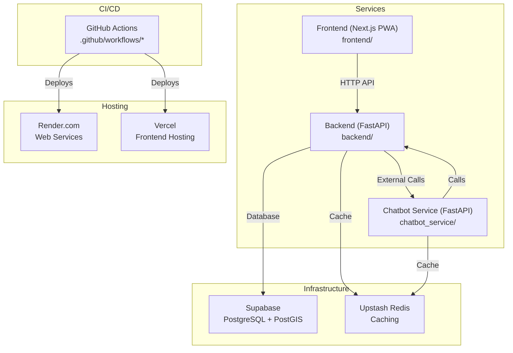
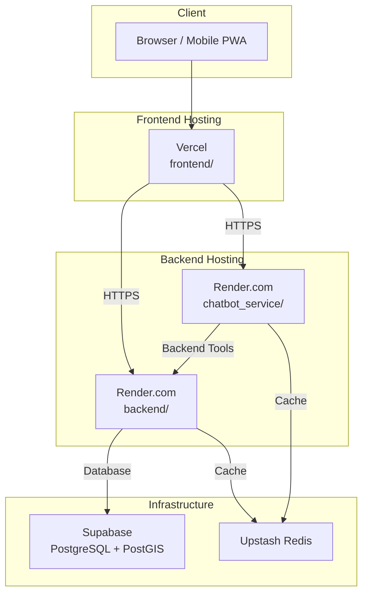
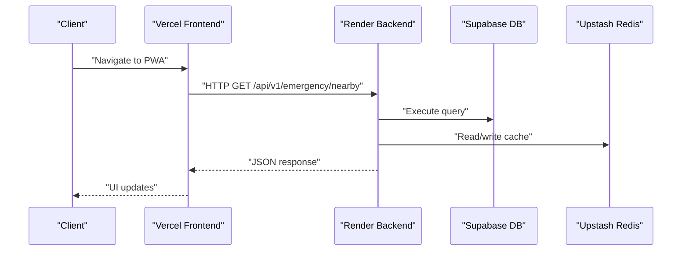
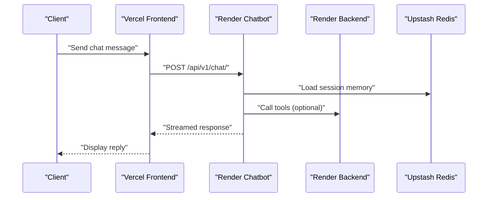
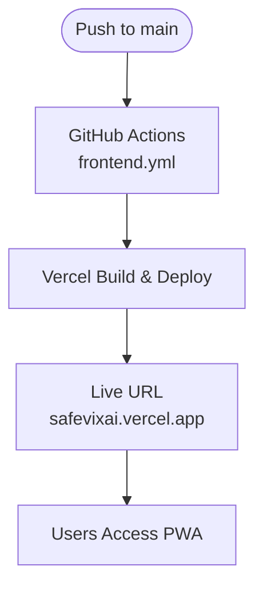
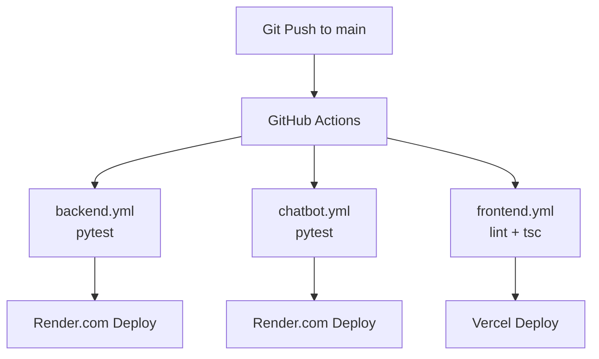
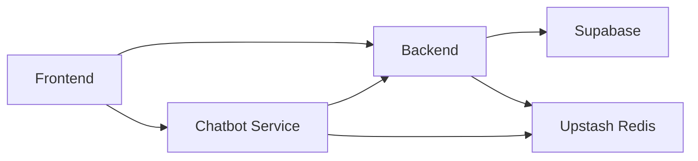

# Deployment and Infrastructure

<cite>
**Referenced Files in This Document**
- [render.yaml](file://render.yaml)
- [chatbot_service/render.yaml](file://chatbot_service/render.yaml)
- [backend/Dockerfile](file://backend/Dockerfile)
- [chatbot_service/Dockerfile](file://chatbot_service/Dockerfile)
- [backend/main.py](file://backend/main.py)
- [chatbot_service/main.py](file://chatbot_service/main.py)
- [backend/core/config.py](file://backend/core/config.py)
- [chatbot_service/config.py](file://chatbot_service/config.py)
- [docs/Deployment.md](file://docs/Deployment.md)
- [SETUP.md](file://SETUP.md)
- [.github/workflows/backend.yml](file://.github/workflows/backend.yml)
- [.github/workflows/chatbot.yml](file://.github/workflows/chatbot.yml)
- [.github/workflows/frontend.yml](file://.github/workflows/frontend.yml)
- [frontend/package.json](file://frontend/package.json)
</cite>

## Table of Contents
1. [Introduction](#introduction)
2. [Project Structure](#project-structure)
3. [Core Components](#core-components)
4. [Architecture Overview](#architecture-overview)
5. [Detailed Component Analysis](#detailed-component-analysis)
6. [Dependency Analysis](#dependency-analysis)
7. [Performance Considerations](#performance-considerations)
8. [Troubleshooting Guide](#troubleshooting-guide)
9. [Conclusion](#conclusion)
10. [Appendices](#appendices)

## Introduction
This document provides a comprehensive deployment and infrastructure guide for SafeVixAI. It covers the multi-service architecture with a FastAPI backend, a dedicated chatbot service (FastAPI), and a Next.js PWA frontend. It explains the hosting strategy on Render.com for backend and chatbot services, Vercel for the frontend, and GitHub Actions CI/CD pipelines. The infrastructure stack leverages Supabase for the database, Upstash Redis for caching, and free tiers across all services. Practical examples demonstrate deployment commands, environment configuration, and monitoring setup. Finally, it outlines the zero-infrastructure cost model and production scalability considerations.

## Project Structure
SafeVixAI is organized into three primary services and supporting CI/CD and documentation assets:
- Backend service (FastAPI): located under backend/
- Chatbot service (FastAPI): located under chatbot_service/
- Frontend (Next.js PWA): located under frontend/
- CI/CD: GitHub Actions workflows under .github/workflows/
- Deployment and environment guidance: docs/Deployment.md and SETUP.md

**Diagram sources**
- [render.yaml](file://render.yaml)
- [chatbot_service/render.yaml](file://chatbot_service/render.yaml)
- [backend/main.py](file://backend/main.py)
- [chatbot_service/main.py](file://chatbot_service/main.py)
- [docs/Deployment.md](file://docs/Deployment.md)

**Section sources**
- [docs/Deployment.md](file://docs/Deployment.md)
- [SETUP.md](file://SETUP.md)

## Core Components
- Backend (FastAPI): Provides system health checks, CORS configuration, static uploads, and API routes. It initializes services for geocoding, routing, emergency locator, roadwatch, and LLM integration, and integrates with Supabase and Upstash.
- Chatbot Service (FastAPI): Implements an agentic RAG pipeline with rate limiting, conversation memory, and multiple LLM provider integrations. It communicates with the backend for specific tools and uses Upstash Redis for session storage.
- Frontend (Next.js PWA): A React-based Progressive Web App with offline capabilities, map rendering, and integration with backend and chatbot endpoints.

Key configuration and runtime behaviors are defined in:
- Backend settings and environment parsing
- Chatbot settings and environment parsing
- Render blueprints for automated deployment
- Dockerfiles for containerization

**Section sources**
- [backend/main.py](file://backend/main.py)
- [chatbot_service/main.py](file://chatbot_service/main.py)
- [backend/core/config.py](file://backend/core/config.py)
- [chatbot_service/config.py](file://chatbot_service/config.py)
- [render.yaml](file://render.yaml)
- [chatbot_service/render.yaml](file://chatbot_service/render.yaml)
- [backend/Dockerfile](file://backend/Dockerfile)
- [chatbot_service/Dockerfile](file://chatbot_service/Dockerfile)

## Architecture Overview
The deployment architecture centers on three independently scalable services behind managed hosting platforms with shared infrastructure:

**Diagram sources**
- [docs/Deployment.md](file://docs/Deployment.md)
- [backend/main.py](file://backend/main.py)
- [chatbot_service/main.py](file://chatbot_service/main.py)
- [render.yaml](file://render.yaml)
- [chatbot_service/render.yaml](file://chatbot_service/render.yaml)

## Detailed Component Analysis

### Backend Service Deployment (Render.com)
- Hosting: Render.com web service configured via render.yaml.
- Root directory: backend/.
- Runtime: Python 3.11.
- Build command: pip install -r requirements.txt.
- Start command: uvicorn main:app with host, port, workers, and keep-alive timeout.
- Health check: /health endpoint.
- Environment variables synchronized from Render dashboard:
  - Database URL (Supabase)
  - Redis URL (Upstash)
  - Supabase credentials
  - CORS origins
  - Chatbot service URL
  - Local upload base URL
  - External API keys (OpenRouteService, OpenWeather, Healthsites)
- Containerization: Dockerfile defines a slim Python image, installs system dependencies, copies dependencies and code, exposes port 8000, and runs Uvicorn as non-root user.

Operational highlights:
- Health endpoint aggregates database availability and cache connectivity.
- CORS origins are configurable and validated at runtime.
- Static uploads served under /uploads.

**Diagram sources**
- [backend/main.py](file://backend/main.py)
- [backend/core/config.py](file://backend/core/config.py)
- [render.yaml](file://render.yaml)
- [backend/Dockerfile](file://backend/Dockerfile)

**Section sources**
- [render.yaml](file://render.yaml)
- [backend/Dockerfile](file://backend/Dockerfile)
- [backend/main.py](file://backend/main.py)
- [backend/core/config.py](file://backend/core/config.py)
- [docs/Deployment.md](file://docs/Deployment.md)

### Chatbot Service Deployment (Render.com)
- Hosting: Separate Render.com web service configured via render.yaml.
- Root directory: chatbot_service/.
- Runtime: Python 3.11.
- Build command: pip install -r requirements.txt.
- Start command: uvicorn main:app with host, port, and keep-alive timeout.
- Health check: /health endpoint.
- Environment variables synchronized from Render dashboard:
  - Redis URL (Upstash)
  - Main backend base URL
  - CORS origins
  - Multiple LLM provider API keys
  - OpenWeather, W3W, OpenCage keys
  - Admin secret
- Containerization: Multi-stage Dockerfile builds dependencies, installs runtime libraries, sets non-root user, exposes port 8010, and adds a health check.

Operational highlights:
- Agentic RAG pipeline with intent detection, safety checking, and provider routing.
- Conversation memory backed by Redis.
- Vectorstore persisted under data/chroma_db and reused on deploy.

**Diagram sources**
- [chatbot_service/main.py](file://chatbot_service/main.py)
- [chatbot_service/config.py](file://chatbot_service/config.py)
- [chatbot_service/render.yaml](file://chatbot_service/render.yaml)
- [chatbot_service/Dockerfile](file://chatbot_service/Dockerfile)

**Section sources**
- [chatbot_service/render.yaml](file://chatbot_service/render.yaml)
- [chatbot_service/Dockerfile](file://chatbot_service/Dockerfile)
- [chatbot_service/main.py](file://chatbot_service/main.py)
- [chatbot_service/config.py](file://chatbot_service/config.py)
- [docs/Deployment.md](file://docs/Deployment.md)

### Frontend Deployment (Vercel)
- Hosting: Vercel with GitHub integration.
- Framework preset: Next.js (auto-detected).
- Root directory: frontend/.
- Environment variables:
  - NEXT_PUBLIC_BACKEND_URL = https://safevixai-api.onrender.com
  - NEXT_PUBLIC_CHATBOT_URL = https://safevixai-chatbot.onrender.com
  - NEXT_PUBLIC_SUPABASE_URL and NEXT_PUBLIC_SUPABASE_ANON_KEY
- Auto-deploy: Vercel watches the main branch and deploys on push.

Operational highlights:
- PWA with offline capabilities and service worker registration in production builds.
- Uses environment variables for API base URLs and Supabase credentials.

**Diagram sources**
- [.github/workflows/frontend.yml](file://.github/workflows/frontend.yml)
- [frontend/package.json](file://frontend/package.json)
- [docs/Deployment.md](file://docs/Deployment.md)

**Section sources**
- [frontend/package.json](file://frontend/package.json)
- [.github/workflows/frontend.yml](file://.github/workflows/frontend.yml)
- [docs/Deployment.md](file://docs/Deployment.md)

### CI/CD Pipelines (GitHub Actions)
- Triggering: Push to main branch and Pull Requests targeting main (path-filtered).
- Workflows:
  - backend.yml: Python 3.11, installs dependencies, runs backend tests.
  - chatbot.yml: Python 3.11, installs dependencies, runs chatbot tests.
  - frontend.yml: Node 20, installs dependencies, runs lint and TypeScript checks.
- Auto-deploy: Vercel and Render monitor the main branch for continuous deployment.

**Diagram sources**
- [.github/workflows/backend.yml](file://.github/workflows/backend.yml)
- [.github/workflows/chatbot.yml](file://.github/workflows/chatbot.yml)
- [.github/workflows/frontend.yml](file://.github/workflows/frontend.yml)

**Section sources**
- [.github/workflows/backend.yml](file://.github/workflows/backend.yml)
- [.github/workflows/chatbot.yml](file://.github/workflows/chatbot.yml)
- [.github/workflows/frontend.yml](file://.github/workflows/frontend.yml)

## Dependency Analysis
- Backend depends on:
  - Supabase for PostgreSQL and PostGIS-backed ORM.
  - Upstash Redis for caching and session storage.
  - External APIs (OpenRouteService, OpenWeather, Healthsites).
  - Chatbot service for specialized tools.
- Chatbot service depends on:
  - Upstash Redis for conversation memory.
  - Backend for tool invocations.
  - Multiple LLM providers (Groq, Gemini, Sarvam, etc.).
- Frontend depends on:
  - Backend and Chatbot services for data and AI assistance.
  - Supabase for identity and data operations.

**Diagram sources**
- [backend/main.py](file://backend/main.py)
- [chatbot_service/main.py](file://chatbot_service/main.py)
- [docs/Deployment.md](file://docs/Deployment.md)

**Section sources**
- [backend/main.py](file://backend/main.py)
- [chatbot_service/main.py](file://chatbot_service/main.py)
- [docs/Deployment.md](file://docs/Deployment.md)

## Performance Considerations
- Render.com free tier:
  - 512 MB RAM: sufficient for FastAPI plus ChromaDB reads; build vectorstore before deploy.
  - 750 hours/month: one service can run 24/7 monthly; plan for cold starts.
  - Cold starts: first request after inactivity may take ~30 seconds; mitigate with periodic /health pings (e.g., UptimeRobot).
- Caching:
  - Use Upstash Redis for cache TTLs and session persistence to reduce latency and external API calls.
- Database:
  - Use asyncpg driver and connection pooling settings to optimize throughput.
- Offloading:
  - Keep heavy RAG indexing pre-built and committed to minimize startup costs on Render.

[No sources needed since this section provides general guidance]

## Troubleshooting Guide
Common issues and resolutions:
- Missing LLM API keys in chatbot service:
  - Ensure at least one provider key is configured; otherwise, the service raises a fatal error during initialization.
- CORS misconfiguration:
  - In production, set CORS_ORIGINS to your frontend domain; wildcard is warned in production.
- Database connectivity:
  - Confirm DATABASE_URL normalization and asyncpg compatibility; verify Supabase extension activation (PostGIS, pg_trgm).
- Health checks failing:
  - Verify /health endpoints on backend and chatbot; confirm Redis connectivity and vectorstore readiness.
- Frontend environment variables:
  - Set NEXT_PUBLIC_BACKEND_URL and NEXT_PUBLIC_CHATBOT_URL to deployed service URLs.

**Section sources**
- [chatbot_service/config.py](file://chatbot_service/config.py)
- [backend/core/config.py](file://backend/core/config.py)
- [docs/Deployment.md](file://docs/Deployment.md)

## Conclusion
SafeVixAI’s deployment model leverages free-tier providers to achieve a zero-infrastructure cost baseline while maintaining a robust, multi-service architecture. Render.com hosts the backend and chatbot services with automated deployments via GitHub Actions, Vercel hosts the Next.js PWA, and Supabase and Upstash provide database and caching layers. The documented environment variables, health checks, and CI/CD workflows enable repeatable setups for developers and DevOps engineers. For production scaling, consider upgrading to paid tiers on Render and Vercel, enabling autoscaling, and implementing proactive uptime monitoring to mitigate cold starts.

[No sources needed since this section summarizes without analyzing specific files]

## Appendices

### Zero Infrastructure Cost Model
- Backend and Chatbot services on Render.com free tier (limited RAM and monthly hours).
- Frontend hosted on Vercel free tier with global CDN.
- Database and caching on Supabase and Upstash free tiers.
- CI/CD via GitHub Actions at no extra cost.

**Section sources**
- [docs/Deployment.md](file://docs/Deployment.md)

### Practical Examples

- Backend health verification:
  - curl https://safevixai-api.onrender.com/health
- Emergency API test:
  - curl "https://safevixai-api.onrender.com/api/v1/emergency/nearby?lat=13.0827&lon=80.2707"
- Challan API test:
  - curl "https://safevixai-api.onrender.com/api/v1/challan/calculate?violation_code=MVA_185"
- Frontend PWA check:
  - Visit safevixai.vercel.app and verify “Add to Home Screen” prompt.

**Section sources**
- [docs/Deployment.md](file://docs/Deployment.md)

### Environment Variables Reference

- Backend (.env):
  - DATABASE_URL: Supabase connection string (asyncpg compatible)
  - REDIS_URL: Upstash Redis URL
  - ENVIRONMENT: production
  - DEFAULT_RADIUS, MAX_RADIUS, CACHE_TTL
  - CHATBOT_SERVICE_URL: chatbot service URL
  - External API keys: OpenRouteService, OpenWeather, Healthsites

- Chatbot Service (.env):
  - DEFAULT_LLM_PROVIDER, DEFAULT_LLM_MODEL
  - Provider API keys: GROQ_API_KEY, GOOGLE_API_KEY, etc.
  - MAIN_BACKEND_BASE_URL: backend service URL
  - REDIS_URL: Upstash Redis URL
  - CHROMA_PERSIST_DIR: ./data/chroma_db

- Frontend (.env.local):
  - NEXT_PUBLIC_BACKEND_URL: https://safevixai-api.onrender.com
  - NEXT_PUBLIC_CHATBOT_URL: https://safevixai-chatbot.onrender.com
  - NEXT_PUBLIC_SUPABASE_URL and NEXT_PUBLIC_SUPABASE_ANON_KEY

**Section sources**
- [docs/Deployment.md](file://docs/Deployment.md)