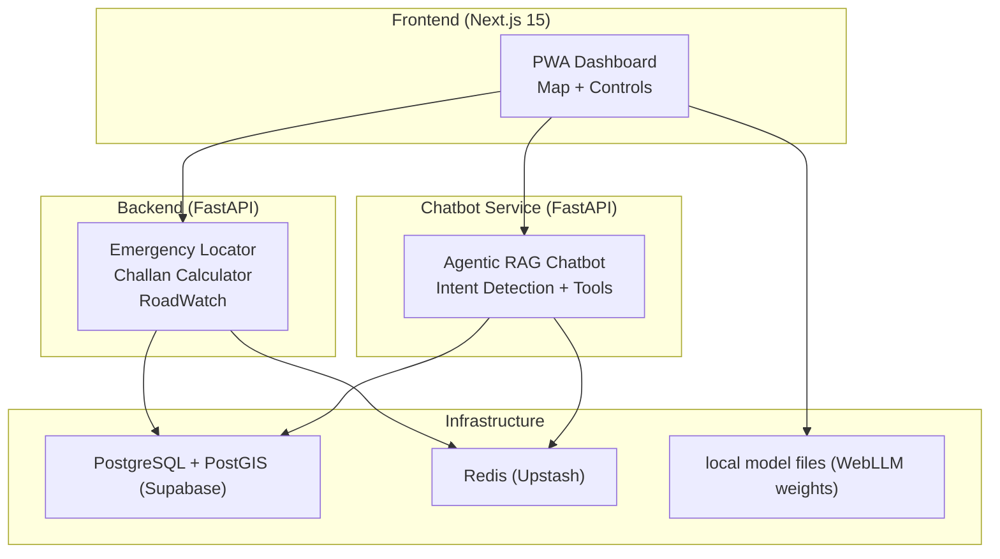
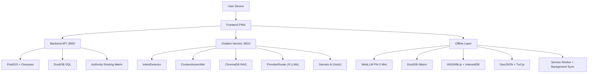
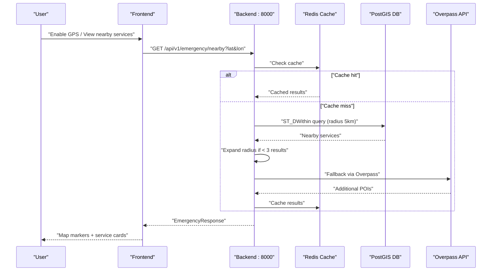
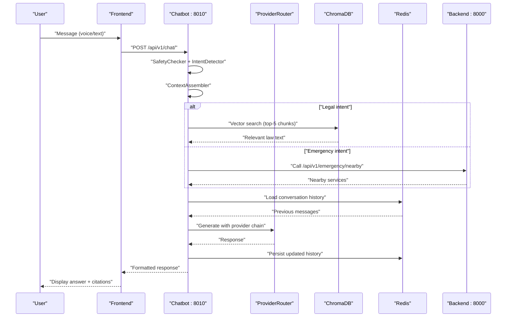
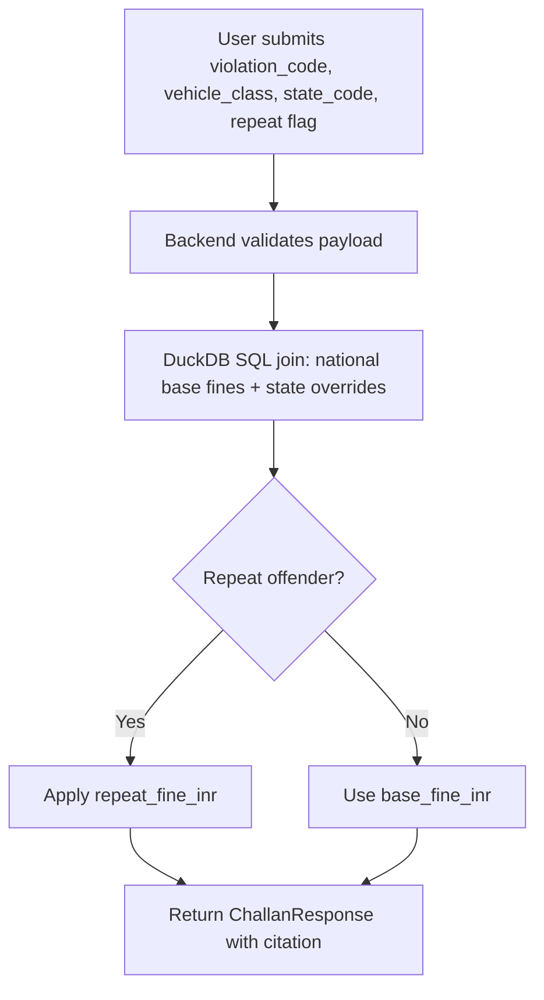
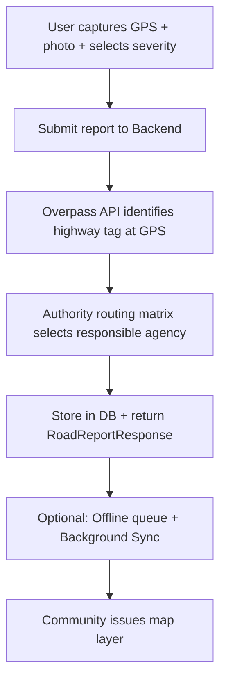
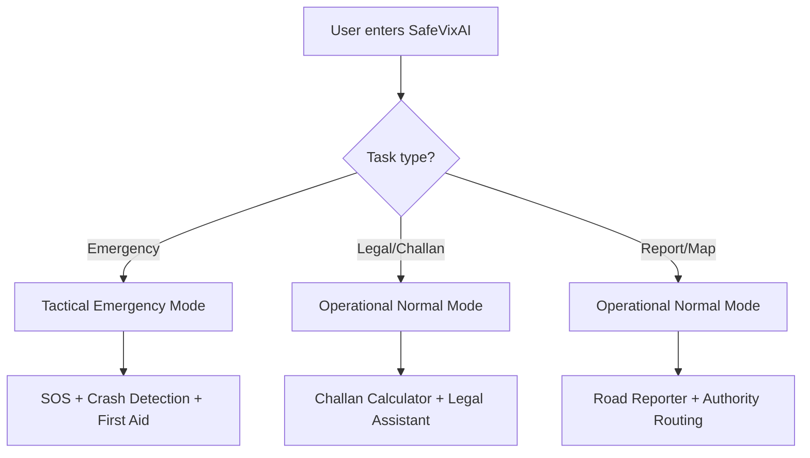
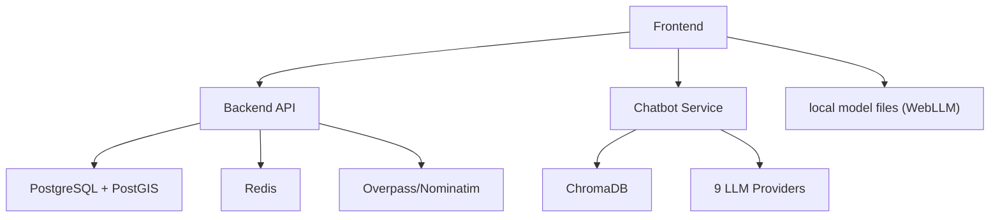

# Introduction and Purpose

<cite>
**Referenced Files in This Document**
- [README.md](file://README.md)
- [DESIGN.md](file://DESIGN.md)
- [docs/PRD.md](file://docs/PRD.md)
- [docs/Features.md](file://docs/Features.md)
- [docs/Architecture.md](file://docs/Architecture.md)
- [docs/Database.md](file://docs/Database.md)
- [docs/Deployment.md](file://docs/Deployment.md)
- [docs/Contributing.md](file://docs/Contributing.md)
- [SETUP.md](file://SETUP.md)
- [backend/main.py](file://backend/main.py)
- [backend/api/v1/emergency.py](file://backend/api/v1/emergency.py)
- [backend/api/v1/challan.py](file://backend/api/v1/challan.py)
- [backend/api/v1/roadwatch.py](file://backend/api/v1/roadwatch.py)
- [chatbot_service/main.py](file://chatbot_service/main.py)
- [frontend/app/page.tsx](file://frontend/app/page.tsx)
</cite>

## Table of Contents
1. [Introduction](#introduction)
2. [Project Structure](#project-structure)
3. [Core Components](#core-components)
4. [Architecture Overview](#architecture-overview)
5. [Detailed Component Analysis](#detailed-component-analysis)
6. [Dependency Analysis](#dependency-analysis)
7. [Performance Considerations](#performance-considerations)
8. [Troubleshooting Guide](#troubleshooting-guide)
9. [Conclusion](#conclusion)
10. [Appendices](#appendices)

## Introduction
SafeVixAI is an AI-powered road safety platform designed to address three critical road safety challenges in India: emergency response, legal assistance, and road infrastructure reporting. Built for the IIT Madras Road Safety Hackathon 2026, the platform integrates a tactical, life-safety-focused UI with robust backend services, an agentic RAG chatbot, and a fully capable frontend PWA. Its mission is to reduce road accident mortality by dramatically improving response times, legal literacy, and transparency around road maintenance.

Key pillars:
- Zero infrastructure cost: 100% free and open source, leveraging free-tier cloud services and browser-based AI.
- Tactical UX: A dark, high-contrast, terminal-inspired interface optimized for emergency and operational tasks.
- Offline-first: Five independent offline layers ensure core features remain functional without connectivity.
- Open-source and community-driven: Transparent development, modular architecture, and contribution guidelines to foster collaboration.

Impact:
- Emergency response: Instant, accurate, and resilient emergency locator with SOS sharing and crash detection.
- Legal assistance: Deterministic challan calculator and a multilingual legal assistant grounded in the Motor Vehicles Act and WHO guidelines.
- Road infrastructure reporting: Intuitive, geotagged reporting with automatic authority routing and transparency into maintenance records.

Scalability:
- Modular microservices architecture supports independent scaling of backend, chatbot, and frontend.
- Free-tier deployment model demonstrates replicability across regions and contexts.
- Community-driven governance and documentation accelerate adoption and contributions.

**Section sources**
- [README.md:1-152](file://README.md#L1-L152)
- [docs/PRD.md:1-118](file://docs/PRD.md#L1-L118)
- [DESIGN.md:13-31](file://DESIGN.md#L13-L31)

## Project Structure
SafeVixAI is organized as a three-service monorepo:
- Backend (FastAPI + PostGIS + Redis): Emergency locator, challan calculator, road reporting, routing, and geocoding.
- Chatbot Service (FastAPI + ChromaDB + 9 LLM providers): Agentic RAG chatbot with intent detection, safety checks, and multilingual routing.
- Frontend (Next.js 15 PWA): Map-centric UI with offline AI, crash detection, and emergency workflows.

**Diagram sources**
- [docs/Architecture.md:5-46](file://docs/Architecture.md#L5-L46)
- [docs/Architecture.md:49-60](file://docs/Architecture.md#L49-L60)

**Section sources**
- [docs/Architecture.md:208-224](file://docs/Architecture.md#L208-L224)
- [docs/Deployment.md:3-16](file://docs/Deployment.md#L3-L16)

## Core Components
SafeVixAI’s modules are engineered to deliver immediate value in high-stakes scenarios:

- Emergency Locator (SafeVixAI Core)
  - GPS auto-detection, tiered radius fallback, SOS WhatsApp share, crash detection, offline emergency map, and first aid guidance.
  - Ensures responders reach victims within the critical first 10 minutes.

- AI Chatbot (DriveLegal + RoadWatch)
  - 9-class intent detection, online RAG with 9-provider fallback, offline WebLLM Phi-3 Mini, multilingual support, and voice I/O.
  - Provides legal answers grounded in the Motor Vehicles Act and WHO guidelines.

- Challan Calculator (DriveLegal)
  - Deterministic MVA 2019 fine calculation with state overrides, offline via DuckDB-Wasm, and citation of legal sections.

- Road Reporter (RoadWatch)
  - Geotagged reporting with severity, in-browser YOLOv8 pothole detection, automatic authority routing, and offline queue with background sync.

**Section sources**
- [docs/Features.md:3-54](file://docs/Features.md#L3-L54)
- [docs/Features.md:57-104](file://docs/Features.md#L57-L104)
- [docs/Features.md:106-122](file://docs/Features.md#L106-L122)
- [docs/Features.md:125-155](file://docs/Features.md#L125-L155)
- [docs/PRD.md:7-14](file://docs/PRD.md#L7-L14)

## Architecture Overview
SafeVixAI employs a dual-layer AI architecture: online RAG with multi-provider fallback and a five-layer offline stack. The system is intentionally modular to maximize resilience and scalability.

**Diagram sources**
- [docs/Architecture.md:67-91](file://docs/Architecture.md#L67-L91)
- [docs/Architecture.md:128-137](file://docs/Architecture.md#L128-L137)

**Section sources**
- [docs/Architecture.md:63-102](file://docs/Architecture.md#L63-L102)
- [docs/Architecture.md:128-137](file://docs/Architecture.md#L128-L137)

## Detailed Component Analysis

### Emergency Locator: Real-Time Response and Resilience
The Emergency Locator module powers instant, accurate emergency service discovery with offline resilience and crash detection.

Practical example:
- Scenario: A car crashes on a remote highway with poor cell reception.
- Outcome: The app’s crash detection triggers an SOS with pre-filled GPS and emergency contacts, while the offline emergency map displays the nearest hospital and police station using cached GeoJSON and Turf.js.

**Diagram sources**
- [docs/Architecture.md:141-165](file://docs/Architecture.md#L141-L165)
- [backend/api/v1/emergency.py:19-40](file://backend/api/v1/emergency.py#L19-L40)

**Section sources**
- [docs/Features.md:3-54](file://docs/Features.md#L3-L54)
- [backend/api/v1/emergency.py:19-76](file://backend/api/v1/emergency.py#L19-L76)
- [frontend/app/page.tsx:77-228](file://frontend/app/page.tsx#L77-L228)

### AI Chatbot: Legal Grounding and Multilingual Assistance
The chatbot combines intent detection, RAG, and a 9-provider fallback chain to deliver accurate, contextual responses.

Practical example:
- Scenario: A driver receives a challan and is unsure about the fine amount and legal section.
- Outcome: The chatbot calculates the exact fine using DuckDB SQL and cites the relevant MVA section, enabling informed legal action.

**Diagram sources**
- [docs/Architecture.md:169-204](file://docs/Architecture.md#L169-L204)
- [chatbot_service/main.py:106-142](file://chatbot_service/main.py#L106-L142)

**Section sources**
- [docs/Features.md:57-104](file://docs/Features.md#L57-L104)
- [chatbot_service/main.py:41-93](file://chatbot_service/main.py#L41-L93)

### Challan Calculator: Deterministic Legal Compliance
Deterministic calculations grounded in the Motor Vehicles Act ensure clarity and fairness.

Practical example:
- Scenario: A Tamil Nadu resident is charged under MVA_185 for drunk driving in a commercial vehicle.
- Outcome: The calculator returns the exact fine amount, the legal section cited, and state-specific adjustments.

**Diagram sources**
- [docs/Architecture.md:93-102](file://docs/Architecture.md#L93-L102)
- [backend/api/v1/challan.py:17-26](file://backend/api/v1/challan.py#L17-L26)

**Section sources**
- [docs/Features.md:106-122](file://docs/Features.md#L106-L122)
- [backend/api/v1/challan.py:17-26](file://backend/api/v1/challan.py#L17-L26)

### Road Reporter: Transparent Infrastructure Accountability
The Road Reporter module enables citizens to report road issues with automatic authority routing and transparency into maintenance records.

Practical example:
- Scenario: A pothole on a state highway causes repeated damage to vehicles.
- Outcome: The report is routed to the appropriate PWD office with transparency into budget and maintenance history, and nearby users receive warnings.

**Diagram sources**
- [docs/Architecture.md:128-137](file://docs/Architecture.md#L128-L137)
- [backend/api/v1/roadwatch.py:73-97](file://backend/api/v1/roadwatch.py#L73-L97)

**Section sources**
- [docs/Features.md:125-155](file://docs/Features.md#L125-L155)
- [backend/api/v1/roadwatch.py:26-97](file://backend/api/v1/roadwatch.py#L26-L97)

### Conceptual Overview
SafeVixAI’s conceptual design emphasizes a “life-safety command terminal” with two operational modes: Tactical Emergency (seconds count) and Operational Normal (research, compliance, reporting). The UI’s dark tactical palette, terminal aesthetics, and high-contrast typography reinforce urgency and clarity.

[No sources needed since this diagram shows conceptual workflow, not actual code structure]

**Section sources**
- [DESIGN.md:13-31](file://DESIGN.md#L13-L31)
- [DESIGN.md:367-555](file://DESIGN.md#L367-L555)

## Dependency Analysis
SafeVixAI’s backend, chatbot, and frontend services depend on shared infrastructure and external datasets. The backend relies on PostGIS for spatial queries, Redis for caching, and Overpass/Nominatim for POI enrichment. The chatbot leverages ChromaDB for RAG and a 9-provider LLM fallback chain. The frontend consumes these services via HTTPS and operates offline through browser-based AI and cached assets.

**Diagram sources**
- [docs/Architecture.md:49-60](file://docs/Architecture.md#L49-L60)
- [docs/Architecture.md:40-45](file://docs/Architecture.md#L40-L45)

**Section sources**
- [docs/Architecture.md:49-60](file://docs/Architecture.md#L49-L60)
- [docs/Database.md:1-18](file://docs/Database.md#L1-L18)

## Performance Considerations
- Backend performance: PostGIS spatial queries (< 50 ms) with GIST indexing and Redis caching minimize latency for emergency services discovery.
- Offline performance: Five-layer offline stack ensures first-load functionality and minimal bandwidth usage.
- Chatbot performance: ProviderRouter auto-selects optimal LLMs; Sarvam AI handles Indian languages; fallback chain maintains reliability.
- Frontend performance: PWA with Service Worker caching, dynamic map loading, and offline AI reduces cold start and improves responsiveness.

[No sources needed since this section provides general guidance]

## Troubleshooting Guide
- Backend health: Verify the health endpoint to confirm database and cache availability.
- API testing: Use curl to test emergency and challan endpoints locally or in production.
- Environment variables: Ensure all keys are configured in .env files and reflected in deployment dashboards.
- Offline verification: Build and start the frontend in production mode, then simulate offline mode to confirm cached features.

**Section sources**
- [backend/main.py:103-125](file://backend/main.py#L103-L125)
- [docs/Deployment.md:230-248](file://docs/Deployment.md#L230-L248)
- [SETUP.md:316-343](file://SETUP.md#L316-L343)

## Conclusion
SafeVixAI advances road safety in India by combining tactical UX, AI-driven legal assistance, and transparent infrastructure reporting—without any infrastructure cost. Its modular architecture, offline-first design, and open-source philosophy enable rapid deployment, community-driven improvements, and scalable impact across diverse geographies and languages.

[No sources needed since this section summarizes without analyzing specific files]

## Appendices

### Hackathon Context and Commitment
- Built for the IIT Madras Road Safety Hackathon 2026.
- Total infrastructure cost: Rs. 0 using free-tier services and open-source stacks.

**Section sources**
- [README.md:5-6](file://README.md#L5-L6)
- [docs/PRD.md:14](file://docs/PRD.md#L14)

### Open-Source Philosophy and Community Approach
- Free-tier deployment model demonstrates replicability and sustainability.
- Comprehensive documentation, contribution guidelines, and CI/CD workflows encourage collaboration.
- Modular services and standardized tooling lower barriers to entry for contributors.

**Section sources**
- [docs/Deployment.md:3-16](file://docs/Deployment.md#L3-L16)
- [docs/Contributing.md:1-208](file://docs/Contributing.md#L1-L208)
- [docs/Architecture.md:49-60](file://docs/Architecture.md#L49-L60)