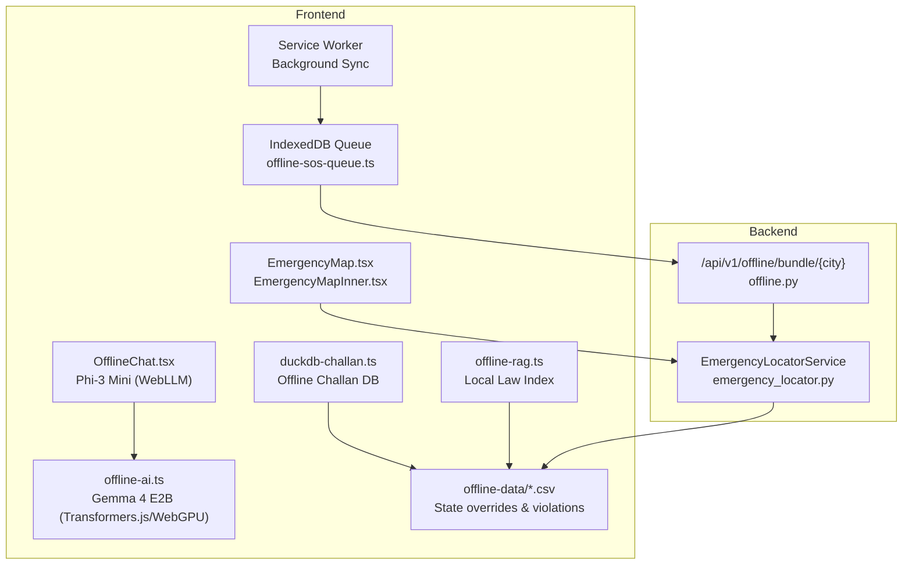
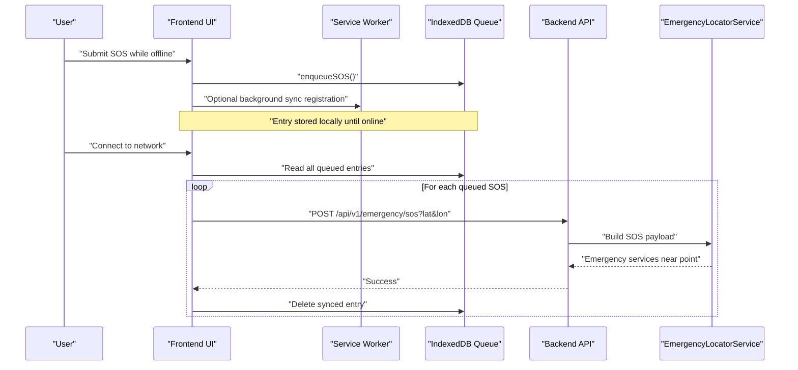
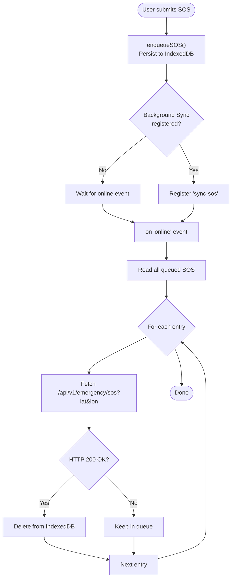
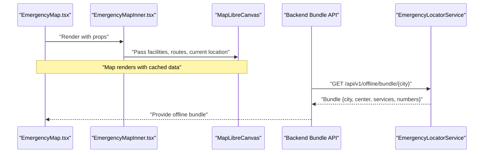
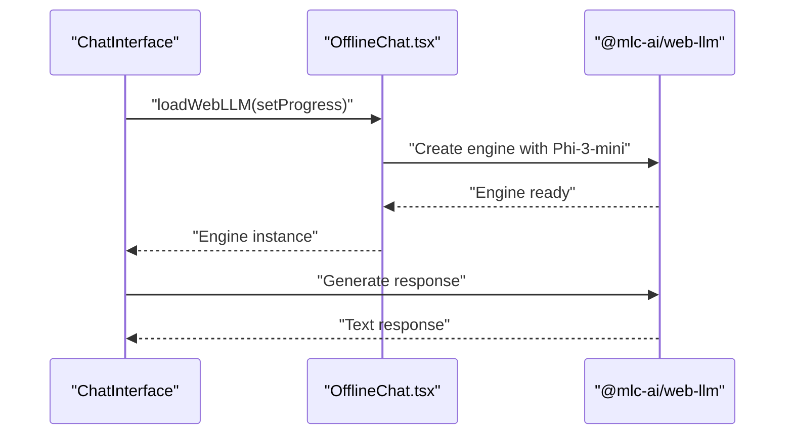
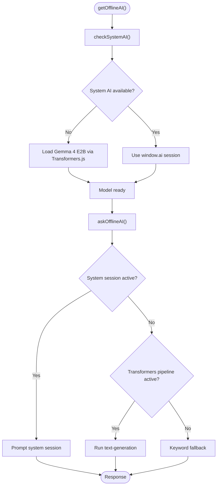
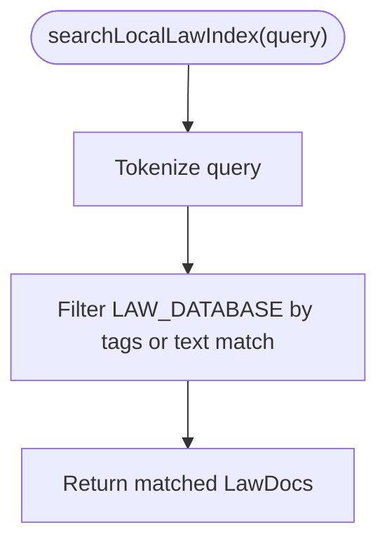
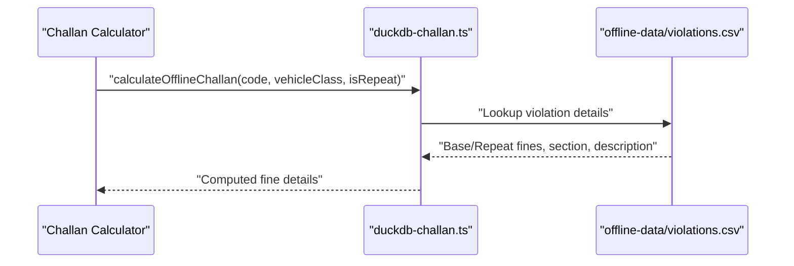
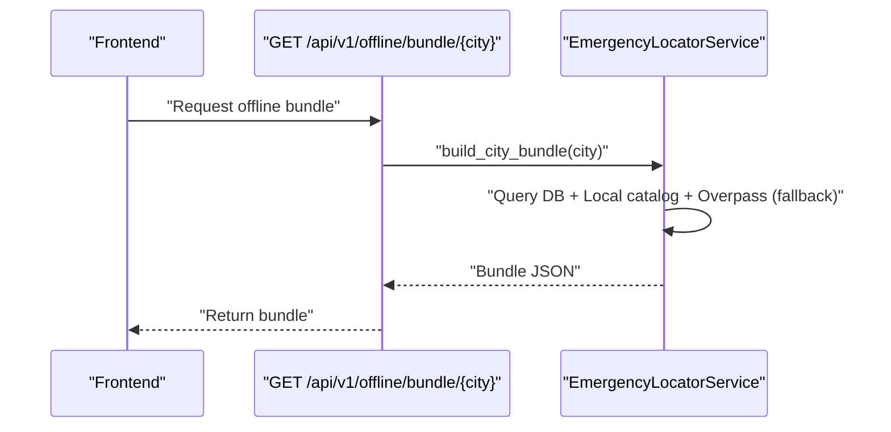
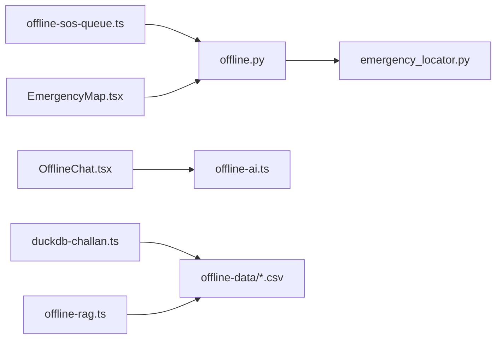

# Offline Capabilities

<cite>
**Referenced Files in This Document**
- [Offline_Architecture.md](file://docs/Offline_Architecture.md)
- [offline-ai.ts](file://frontend/lib/offline-ai.ts)
- [offline-rag.ts](file://frontend/lib/offline-rag.ts)
- [offline-sos-queue.ts](file://frontend/lib/offline-sos-queue.ts)
- [offline-sos-queue.ts](file://frontend/lib/offline-sos-queue.ts)
- [offline-data/state_overrides.csv](file://frontend/public/offline-data/state_overrides.csv)
- [offline-data/violations.csv](file://frontend/public/offline-data/violations.csv)
- [duckdb-challan.ts](file://frontend/lib/duckdb-challan.ts)
- [EmergencyMap.tsx](file://frontend/components/EmergencyMap.tsx)
- [EmergencyMapInner.tsx](file://frontend/components/EmergencyMapInner.tsx)
- [OfflineChat.tsx](file://frontend/components/OfflineChat.tsx)
- [offline.py](file://backend/api/v1/offline.py)
- [emergency_locator.py](file://backend/services/emergency_locator.py)
</cite>

## Table of Contents
1. [Introduction](#introduction)
2. [Project Structure](#project-structure)
3. [Core Components](#core-components)
4. [Architecture Overview](#architecture-overview)
5. [Detailed Component Analysis](#detailed-component-analysis)
6. [Dependency Analysis](#dependency-analysis)
7. [Performance Considerations](#performance-considerations)
8. [Troubleshooting Guide](#troubleshooting-guide)
9. [Conclusion](#conclusion)
10. [Appendices](#appendices)

## Introduction
This document explains SafeVixAI’s offline-first capabilities designed to serve 25 major Indian cities. It covers the service worker and background sync strategy, IndexedDB storage for offline queues, offline data bundling, and progressive enhancement patterns that keep core functionality available without network connectivity. It also documents the offline emergency map, offline chatbot using Phi-3 Mini in-browser, offline Challan Calculator backed by DuckDB-Wasm, and the offline road reporting queue. Practical scenarios and synchronization flows are included, along with trade-offs and limitations.

## Project Structure
The offline capability surface spans frontend libraries and React components, backend APIs and services, and static offline datasets packaged for the browser.

**Diagram sources**
- [offline-sos-queue.ts:1-138](file://frontend/lib/offline-sos-queue.ts#L1-L138)
- [EmergencyMap.tsx:1-58](file://frontend/components/EmergencyMap.tsx#L1-L58)
- [EmergencyMapInner.tsx:1-83](file://frontend/components/EmergencyMapInner.tsx#L1-L83)
- [OfflineChat.tsx:1-22](file://frontend/components/OfflineChat.tsx#L1-L22)
- [offline-ai.ts:1-256](file://frontend/lib/offline-ai.ts#L1-L256)
- [offline-rag.ts:1-35](file://frontend/lib/offline-rag.ts#L1-L35)
- [duckdb-challan.ts:1-51](file://frontend/lib/duckdb-challan.ts#L1-L51)
- [offline-data/state_overrides.csv:1-14](file://frontend/public/offline-data/state_overrides.csv#L1-L14)
- [offline-data/violations.csv:1-27](file://frontend/public/offline-data/violations.csv#L1-L27)
- [offline.py:1-28](file://backend/api/v1/offline.py#L1-L28)
- [emergency_locator.py:1-507](file://backend/services/emergency_locator.py#L1-L507)

**Section sources**
- [Offline_Architecture.md:1-23](file://docs/Offline_Architecture.md#L1-L23)
- [offline-sos-queue.ts:1-138](file://frontend/lib/offline-sos-queue.ts#L1-L138)
- [offline.py:1-28](file://backend/api/v1/offline.py#L1-L28)
- [emergency_locator.py:241-299](file://backend/services/emergency_locator.py#L241-L299)

## Core Components
- Offline SOS queue and sync: IndexedDB-backed queue persists SOS events when offline; background sync triggers when connectivity returns.
- Offline emergency map: Dynamic map rendering with cached emergency facilities and numbers for supported cities.
- Offline chatbot: Phi-3 Mini via WebLLM for conversational assistance; fallbacks to keyword responses.
- Offline AI assistant: Gemma 4 E2B via Transformers.js/WebGPU with a system AI fallback; keyword fallback for deterministic answers.
- Offline Challan Calculator: DuckDB-Wasm abstraction with cached state-specific violation data.
- Offline data bundling: Backend builds and caches offline bundles per city; frontend consumes these bundles for offline map and numbers.

**Section sources**
- [offline-sos-queue.ts:1-138](file://frontend/lib/offline-sos-queue.ts#L1-L138)
- [EmergencyMap.tsx:1-58](file://frontend/components/EmergencyMap.tsx#L1-L58)
- [EmergencyMapInner.tsx:1-83](file://frontend/components/EmergencyMapInner.tsx#L1-L83)
- [OfflineChat.tsx:1-22](file://frontend/components/OfflineChat.tsx#L1-L22)
- [offline-ai.ts:1-256](file://frontend/lib/offline-ai.ts#L1-L256)
- [offline-rag.ts:1-35](file://frontend/lib/offline-rag.ts#L1-L35)
- [duckdb-challan.ts:1-51](file://frontend/lib/duckdb-challan.ts#L1-L51)
- [offline.py:1-28](file://backend/api/v1/offline.py#L1-L28)
- [emergency_locator.py:241-299](file://backend/services/emergency_locator.py#L241-L299)

## Architecture Overview
SafeVixAI’s offline-first architecture combines:
- Progressive enhancement: Core UI loads without network; offline-capable features activate when data is present.
- Service worker and background sync: Queues are persisted locally and flushed when online.
- Offline data bundling: Backend prepares city-specific bundles; frontend caches and renders offline-ready maps and numbers.
- Browser AI: In-browser LLMs and keyword fallbacks ensure conversational assistance remains functional.

**Diagram sources**
- [offline-sos-queue.ts:48-124](file://frontend/lib/offline-sos-queue.ts#L48-L124)
- [emergency_locator.py:218-239](file://backend/services/emergency_locator.py#L218-L239)
- [offline.py:1-28](file://backend/api/v1/offline.py#L1-L28)

## Detailed Component Analysis

### Offline SOS Queue and Sync
- IndexedDB schema stores SOS entries with timestamps and coordinates.
- Enqueue adds entries and optionally registers background sync.
- Sync iterates queued items, sends to backend, and deletes successful entries.
- Listeners trigger sync upon online events.

**Diagram sources**
- [offline-sos-queue.ts:48-124](file://frontend/lib/offline-sos-queue.ts#L48-L124)

**Section sources**
- [offline-sos-queue.ts:1-138](file://frontend/lib/offline-sos-queue.ts#L1-L138)

### Offline Emergency Map
- Dynamic import ensures SSR stability; map initializes only in the browser.
- Facilities are mapped to icons and rendered via a canvas component.
- Numbers and city centers are derived from backend bundles and local defaults.

**Diagram sources**
- [EmergencyMap.tsx:1-58](file://frontend/components/EmergencyMap.tsx#L1-L58)
- [EmergencyMapInner.tsx:1-83](file://frontend/components/EmergencyMapInner.tsx#L1-L83)
- [offline.py:18-27](file://backend/api/v1/offline.py#L18-L27)
- [emergency_locator.py:241-299](file://backend/services/emergency_locator.py#L241-L299)

**Section sources**
- [EmergencyMap.tsx:1-58](file://frontend/components/EmergencyMap.tsx#L1-L58)
- [EmergencyMapInner.tsx:1-83](file://frontend/components/EmergencyMapInner.tsx#L1-L83)
- [offline.py:1-28](file://backend/api/v1/offline.py#L1-L28)
- [emergency_locator.py:241-299](file://backend/services/emergency_locator.py#L241-L299)

### Offline Chatbot with Phi-3 Mini (WebLLM)
- Dynamically loads the WebLLM engine and model on demand.
- Provides progress updates during initialization.
- Integrates with the chat interface when selected.

**Diagram sources**
- [OfflineChat.tsx:1-22](file://frontend/components/OfflineChat.tsx#L1-L22)

**Section sources**
- [OfflineChat.tsx:1-22](file://frontend/components/OfflineChat.tsx#L1-L22)

### Offline AI Assistant (Gemma 4 E2B)
- Checks for system AI (window.ai) first; if unavailable, loads Gemma 4 E2B via Transformers.js with WebGPU acceleration.
- Provides keyword fallback for deterministic answers when models are not available.
- Exposes status and readiness helpers for UI.

**Diagram sources**
- [offline-ai.ts:47-154](file://frontend/lib/offline-ai.ts#L47-L154)
- [offline-ai.ts:160-211](file://frontend/lib/offline-ai.ts#L160-L211)

**Section sources**
- [offline-ai.ts:1-256](file://frontend/lib/offline-ai.ts#L1-L256)

### Offline RAG (Local Law Index)
- Simulates vector-like retrieval using a local keyword index and tags.
- In production, HNSWlib-wasm would enable true similarity search.

**Diagram sources**
- [offline-rag.ts:22-34](file://frontend/lib/offline-rag.ts#L22-L34)

**Section sources**
- [offline-rag.ts:1-35](file://frontend/lib/offline-rag.ts#L1-L35)

### Offline Challan Calculator (DuckDB-Wasm)
- Abstraction simulates DuckDB-Wasm initialization and offline calculations.
- Uses cached state-specific violation data to compute base/repeat fines.

**Diagram sources**
- [duckdb-challan.ts:20-50](file://frontend/lib/duckdb-challan.ts#L20-L50)
- [offline-data/violations.csv:1-27](file://frontend/public/offline-data/violations.csv#L1-L27)
- [offline-data/state_overrides.csv:1-14](file://frontend/public/offline-data/state_overrides.csv#L1-L14)

**Section sources**
- [duckdb-challan.ts:1-51](file://frontend/lib/duckdb-challan.ts#L1-L51)
- [offline-data/violations.csv:1-27](file://frontend/public/offline-data/violations.csv#L1-L27)
- [offline-data/state_overrides.csv:1-14](file://frontend/public/offline-data/state_overrides.csv#L1-L14)

### Offline Data Bundling (Backend)
- Backend builds city-specific bundles containing emergency services, numbers, and source attribution.
- Results are cached and persisted to disk for offline consumption.

**Diagram sources**
- [offline.py:18-27](file://backend/api/v1/offline.py#L18-L27)
- [emergency_locator.py:241-299](file://backend/services/emergency_locator.py#L241-L299)

**Section sources**
- [offline.py:1-28](file://backend/api/v1/offline.py#L1-L28)
- [emergency_locator.py:241-299](file://backend/services/emergency_locator.py#L241-L299)

## Dependency Analysis
- Frontend-to-backend: Offline SOS sync and emergency map rely on backend endpoints and services.
- Data dependencies: Offline bundles and CSV datasets power offline calculators and maps.
- Runtime dependencies: WebGPU/WebLLM/Transformers.js require modern browsers and sufficient resources.

**Diagram sources**
- [offline-sos-queue.ts:1-138](file://frontend/lib/offline-sos-queue.ts#L1-L138)
- [offline.py:1-28](file://backend/api/v1/offline.py#L1-L28)
- [emergency_locator.py:1-507](file://backend/services/emergency_locator.py#L1-L507)
- [EmergencyMap.tsx:1-58](file://frontend/components/EmergencyMap.tsx#L1-L58)
- [OfflineChat.tsx:1-22](file://frontend/components/OfflineChat.tsx#L1-L22)
- [offline-ai.ts:1-256](file://frontend/lib/offline-ai.ts#L1-L256)
- [duckdb-challan.ts:1-51](file://frontend/lib/duckdb-challan.ts#L1-L51)
- [offline-rag.ts:1-35](file://frontend/lib/offline-rag.ts#L1-L35)
- [offline-data/state_overrides.csv:1-14](file://frontend/public/offline-data/state_overrides.csv#L1-L14)
- [offline-data/violations.csv:1-27](file://frontend/public/offline-data/violations.csv#L1-L27)

**Section sources**
- [offline-sos-queue.ts:1-138](file://frontend/lib/offline-sos-queue.ts#L1-L138)
- [offline.py:1-28](file://backend/api/v1/offline.py#L1-L28)
- [emergency_locator.py:1-507](file://backend/services/emergency_locator.py#L1-L507)
- [EmergencyMap.tsx:1-58](file://frontend/components/EmergencyMap.tsx#L1-L58)
- [OfflineChat.tsx:1-22](file://frontend/components/OfflineChat.tsx#L1-L22)
- [offline-ai.ts:1-256](file://frontend/lib/offline-ai.ts#L1-L256)
- [duckdb-challan.ts:1-51](file://frontend/lib/duckdb-challan.ts#L1-L51)
- [offline-rag.ts:1-35](file://frontend/lib/offline-rag.ts#L1-L35)
- [offline-data/state_overrides.csv:1-14](file://frontend/public/offline-data/state_overrides.csv#L1-L14)
- [offline-data/violations.csv:1-27](file://frontend/public/offline-data/violations.csv#L1-L27)

## Performance Considerations
- Model loading: Gemma 4 E2B (~1.3 GB) is cached in browser cache storage after initial load; prefer Wi-Fi for first-time initialization.
- WebGPU acceleration: Prefer GPU-backed inference; fallback to WASM if unavailable.
- IndexedDB throughput: Batch reads/writes and avoid large transactions; limit concurrent sync attempts.
- Map rendering: Defer dynamic imports and use memoization to minimize re-renders.
- DuckDB-Wasm: Initialization requires static assets; simulate or mock during development.

[No sources needed since this section provides general guidance]

## Troubleshooting Guide
- Offline SOS not syncing:
  - Verify online event listener is registered and IndexedDB entries exist.
  - Check network errors during fetch; sync stops on first failure to prevent data loss.
- Model fails to load:
  - Ensure WebGPU is available or accept WASM fallback.
  - Confirm browser cache allows model caching and sufficient storage.
- Emergency map shows no facilities:
  - Confirm offline bundle was fetched for the selected city.
  - Validate city center coordinates and categories.
- Challan calculator returns unknown:
  - Ensure violation code exists in the offline dataset.
  - Verify vehicle class and repeat flag mapping.

**Section sources**
- [offline-sos-queue.ts:75-124](file://frontend/lib/offline-sos-queue.ts#L75-L124)
- [offline-ai.ts:143-153](file://frontend/lib/offline-ai.ts#L143-L153)
- [offline.py:18-27](file://backend/api/v1/offline.py#L18-L27)
- [emergency_locator.py:241-299](file://backend/services/emergency_locator.py#L241-L299)
- [duckdb-challan.ts:20-50](file://frontend/lib/duckdb-challan.ts#L20-L50)
- [offline-data/violations.csv:1-27](file://frontend/public/offline-data/violations.csv#L1-L27)

## Conclusion
SafeVixAI’s offline-first design leverages IndexedDB, offline data bundling, and in-browser AI to deliver resilient experiences across 25 Indian cities. Progressive enhancement ensures core features remain usable without connectivity, while robust sync and fallbacks maintain data integrity and user trust. As the platform scales, the documented architecture provides a foundation for further enhancements such as enterprise-grade object storage and real-time reconciliation.

[No sources needed since this section summarizes without analyzing specific files]

## Appendices

### Practical Offline Scenarios
- Offline SOS submission:
  - Submit SOS while offline; entry is queued locally.
  - Upon reconnect, sync flushes queued SOS to backend.
- Offline emergency map:
  - Open map in a supported city; facilities and numbers render from cached bundle.
- Offline chatbot:
  - Enable Phi-3 Mini; model loads on demand with progress feedback.
- Offline AI assistant:
  - Ask questions; system AI or Gemma responds; keyword fallback if needed.
- Offline Challan calculation:
  - Select violation and vehicle class; compute base/repeat fines from cached data.

**Section sources**
- [offline-sos-queue.ts:48-124](file://frontend/lib/offline-sos-queue.ts#L48-L124)
- [offline.py:18-27](file://backend/api/v1/offline.py#L18-L27)
- [EmergencyMap.tsx:1-58](file://frontend/components/EmergencyMap.tsx#L1-L58)
- [OfflineChat.tsx:1-22](file://frontend/components/OfflineChat.tsx#L1-L22)
- [offline-ai.ts:124-154](file://frontend/lib/offline-ai.ts#L124-L154)
- [duckdb-challan.ts:20-50](file://frontend/lib/duckdb-challan.ts#L20-L50)

### Trade-offs and Limitations
- Model footprint: Large model downloads increase initial load time and storage usage.
- Device compatibility: WebGPU availability varies; WASM fallback reduces performance.
- Data freshness: Offline bundles and CSV datasets require periodic updates to remain accurate.
- Ephemeral storage: Browser cache and IndexedDB can be cleared; implement retry and user prompts.
- Backend constraints: Current deployment uses ephemeral disks; future enterprise designs should leverage object storage and real-time reconciliation.

**Section sources**
- [Offline_Architecture.md:8-23](file://docs/Offline_Architecture.md#L8-L23)
- [offline-ai.ts:1-15](file://frontend/lib/offline-ai.ts#L1-L15)
- [offline-sos-queue.ts:1-138](file://frontend/lib/offline-sos-queue.ts#L1-L138)