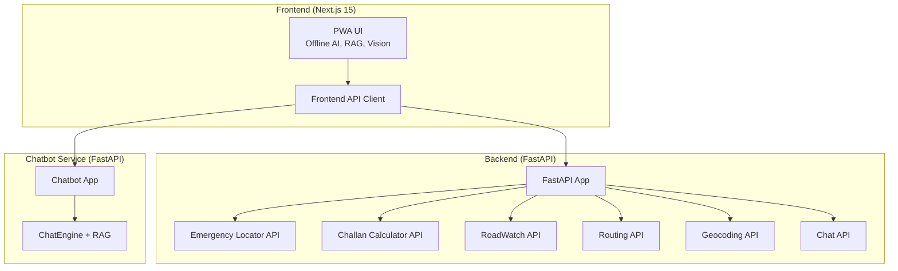
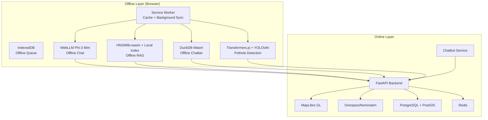
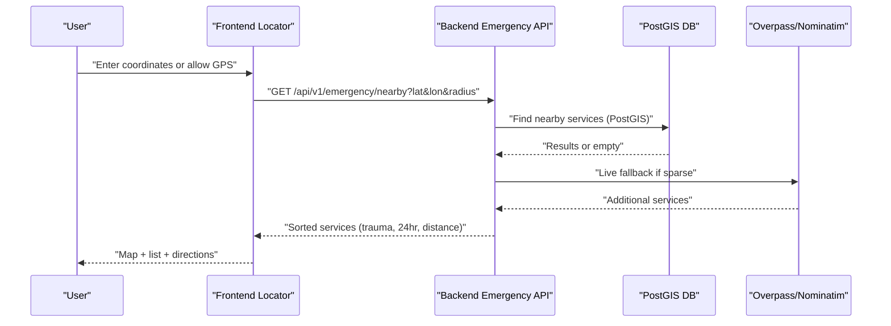
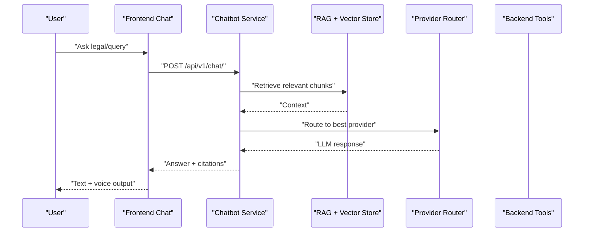
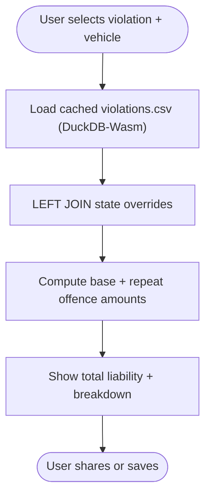
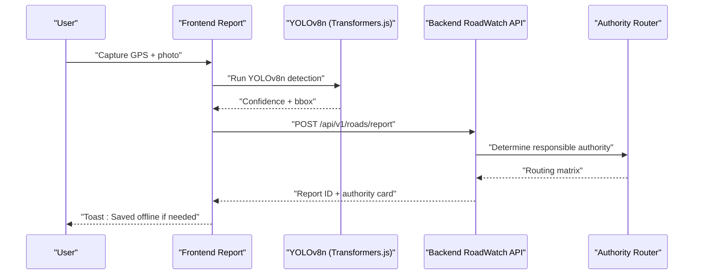
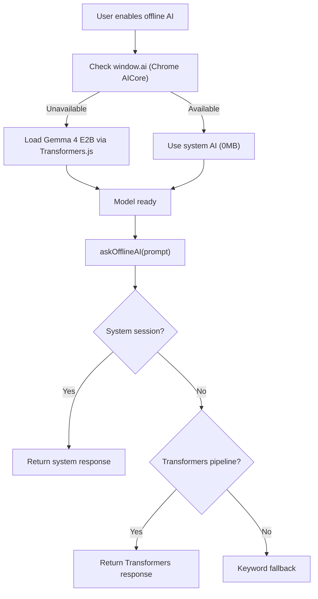
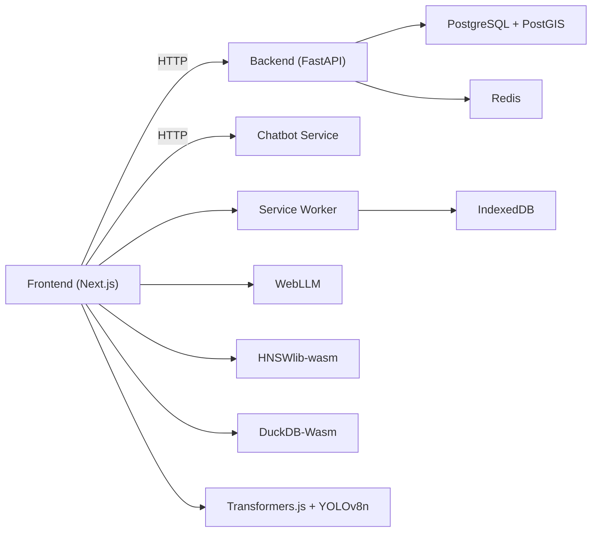

# Project Overview

<cite>
**Referenced Files in This Document**
- [README.md](file://README.md)
- [DESIGN.md](file://DESIGN.md)
- [docs/PRD.md](file://docs/PRD.md)
- [docs/Features.md](file://docs/Features.md)
- [docs/Offline_Architecture.md](file://docs/Offline_Architecture.md)
- [docs/TechStack.md](file://docs/TechStack.md)
- [backend/main.py](file://backend/main.py)
- [backend/api/v1/__init__.py](file://backend/api/v1/__init__.py)
- [backend/api/v1/emergency.py](file://backend/api/v1/emergency.py)
- [backend/api/v1/challan.py](file://backend/api/v1/challan.py)
- [backend/api/v1/roadwatch.py](file://backend/api/v1/roadwatch.py)
- [chatbot_service/main.py](file://chatbot_service/main.py)
- [frontend/package.json](file://frontend/package.json)
- [frontend/lib/offline-ai.ts](file://frontend/lib/offline-ai.ts)
- [frontend/lib/offline-rag.ts](file://frontend/lib/offline-rag.ts)
</cite>

## Table of Contents
1. [Introduction](#introduction)
2. [Project Structure](#project-structure)
3. [Core Modules](#core-modules)
4. [Architecture Overview](#architecture-overview)
5. [Detailed Component Analysis](#detailed-component-analysis)
6. [Dependency Analysis](#dependency-analysis)
7. [Performance Considerations](#performance-considerations)
8. [Troubleshooting Guide](#troubleshooting-guide)
9. [Conclusion](#conclusion)
10. [Appendices](#appendices)

## Introduction
SafeVixAI is an AI-powered road safety platform designed for India’s challenging mobility landscape. It consolidates three critical road safety needs into a single, installable Progressive Web App (PWA):
- Emergency Locator: Instant discovery of nearby hospitals, police, ambulances, and fire services—offline-ready for 25 major Indian cities.
- AI Chatbot: A multilingual, agentic assistant powered by online RAG and a robust offline fallback (Phi-3 Mini in-browser), grounded in legal and first aid knowledge.
- Challan Calculator (DriveLegal): Deterministic fine calculations aligned with the Motor Vehicles (Amendment) Act 2019, with state-specific overrides, fully functional offline.
- Road Reporter (RoadWatch): Geotagged reporting of road hazards with automatic routing to the correct authority, including in-browser pothole detection and offline queuing.

The platform emphasizes zero infrastructure cost, open-source transparency, and real-world impact. It leverages free-tier cloud services, browser-native AI, and offline-first design to ensure reliability even without network connectivity.

Practical examples of impact:
- A truck driver in a remote highway segment triggers crash detection; the app auto-generates an SOS with location and nearest services, then guides first aid steps via the AI chatbot.
- A commuter receives an instant, offline-calculated challan estimate for overspeeding, citing the exact MVA section, enabling informed decisions at the roadside.
- A passenger reports a pothole via camera; the in-browser YOLO model confirms the issue, and the report is routed to the correct authority with a future background-sync submission.

**Section sources**
- [README.md:10-18](file://README.md#L10-L18)
- [docs/PRD.md:3-14](file://docs/PRD.md#L3-L14)

## Project Structure
SafeVixAI follows a three-service architecture:
- Frontend (Next.js 15 PWA): Provides offline-first UI, in-browser AI engines, and integrations with backend APIs.
- Backend (FastAPI): Exposes REST endpoints for emergency locator, road reporting, challan calculation, routing, geocoding, and chat.
- Chatbot Service (FastAPI): A dedicated microservice for agentic RAG chat with 9 LLM providers and conversational memory.

**Diagram sources**
- [backend/main.py:24-128](file://backend/main.py#L24-L128)
- [backend/api/v1/__init__.py:17-27](file://backend/api/v1/__init__.py#L17-L27)
- [chatbot_service/main.py:41-145](file://chatbot_service/main.py#L41-L145)
- [frontend/package.json:14-53](file://frontend/package.json#L14-L53)

**Section sources**
- [README.md:57-70](file://README.md#L57-L70)
- [docs/TechStack.md:7-27](file://docs/TechStack.md#L7-L27)

## Core Modules
- Emergency Locator (SafeVixAI Core)
  - GPS auto-detection, tiered radius search, SOS sharing, crash detection, offline map for 25 cities, and first aid guidance.
- AI Chatbot (SafeVixAI + DriveLegal)
  - Intent detection, online RAG with 9 providers, offline WebLLM Phi-3 Mini, multilingual support, voice I/O, and conversation memory.
- Challan Calculator (DriveLegal)
  - Deterministic MVA 2019 fine calculation with state overrides, offline via DuckDB-Wasm, and legal citations.
- Road Reporter (RoadWatch)
  - Geotagged reporting, in-browser YOLOv8n pothole detection, authority routing, offline queue, and community issues layer.

**Section sources**
- [docs/PRD.md:7-14](file://docs/PRD.md#L7-L14)
- [docs/Features.md:3-185](file://docs/Features.md#L3-L185)

## Architecture Overview
SafeVixAI employs an offline-first, browser-native AI architecture:
- Offline AI and RAG: Phi-3 Mini (WebLLM) and HNSWlib-wasm enable first-load offline capabilities for chat and legal queries.
- Edge SQL and Vision: DuckDB-Wasm for offline challan calculations; Transformers.js + ONNX for YOLOv8n pothole detection.
- Offline Bundles: Service Worker caches emergency GeoJSON, model weights, and offline RAG indices for 25 cities.
- Backend APIs: FastAPI endpoints for emergency services, road reporting, routing, geocoding, and chat.
- Chatbot Service: Separate FastAPI service with RAG, provider routing, and Redis-backed memory.

**Diagram sources**
- [docs/Offline_Architecture.md:1-23](file://docs/Offline_Architecture.md#L1-L23)
- [frontend/lib/offline-ai.ts:1-256](file://frontend/lib/offline-ai.ts#L1-L256)
- [frontend/lib/offline-rag.ts:1-35](file://frontend/lib/offline-rag.ts#L1-L35)
- [docs/TechStack.md:56-68](file://docs/TechStack.md#L56-L68)
- [backend/main.py:24-128](file://backend/main.py#L24-L128)
- [chatbot_service/main.py:41-145](file://chatbot_service/main.py#L41-L145)

**Section sources**
- [docs/Offline_Architecture.md:1-23](file://docs/Offline_Architecture.md#L1-L23)
- [docs/TechStack.md:56-68](file://docs/TechStack.md#L56-L68)

## Detailed Component Analysis

### Emergency Locator (SafeVixAI Core)
- GPS and proximity: High-accuracy GPS with watchPosition updates, tiered radius fallback, and PostGIS-backed results with Overpass live fallback.
- SOS and crash detection: Always-visible emergency numbers bar, crash detection via DeviceMotion API, and SOS WhatsApp share with location and nearest services.
- Offline map: Cached GeoJSON for 25 cities, Turf.js distance filtering, and “Offline Cached Data” banner.
- First aid: Offline-first guidance cards for common scenarios.

**Diagram sources**
- [backend/api/v1/emergency.py:19-40](file://backend/api/v1/emergency.py#L19-L40)
- [docs/Features.md:11-23](file://docs/Features.md#L11-L23)

**Section sources**
- [docs/Features.md:5-54](file://docs/Features.md#L5-L54)
- [backend/api/v1/emergency.py:19-76](file://backend/api/v1/emergency.py#L19-L76)

### AI Chatbot (SafeVixAI + DriveLegal)
- Intent detection: Nine intents mapped to tools (find hospital, police, ambulance, tow, first aid, challan query, road report, legal info, other).
- Online RAG: ChromaDB with LocalHashEmbeddingFunction (hash-based) embeddings, 9-provider fallback chain (Groq, Gemini, Sarvam AI, etc.), and contextual retrieval.
- Offline fallback: WebLLM Phi-3 Mini (WebGPU) or gemma-2b-it (WebAssembly), with HNSWlib-wasm and IndexedDB for local RAG.
- Multilingual and voice: Auto-detect language, route queries to appropriate providers, and support voice input/output.

**Diagram sources**
- [chatbot_service/main.py:41-145](file://chatbot_service/main.py#L41-L145)
- [docs/Features.md:57-103](file://docs/Features.md#L57-L103)

**Section sources**
- [docs/Features.md:57-103](file://docs/Features.md#L57-L103)
- [chatbot_service/main.py:41-145](file://chatbot_service/main.py#L41-L145)

### Challan Calculator (DriveLegal)
- Fine engine: DuckDB SQL join of national violations and state overrides; supports 22+ MVA sections and five vehicle types.
- Offline mode: DuckDB-Wasm in browser against cached violations data.
- Legal grounding: Citations to MVA sections; global traffic law via WHO index.

**Diagram sources**
- [docs/Features.md:106-122](file://docs/Features.md#L106-L122)
- [backend/api/v1/challan.py:17-26](file://backend/api/v1/challan.py#L17-L26)

**Section sources**
- [docs/Features.md:106-122](file://docs/Features.md#L106-L122)
- [backend/api/v1/challan.py:17-26](file://backend/api/v1/challan.py#L17-L26)

### Road Reporter (RoadWatch)
- Reporting workflow: Type, severity, GPS, optional photo, description; AI detects potholes via YOLOv8n; routes to NHAI/PWD/PMGSY.
- Offline queue: IndexedDB + Background Sync posts when connectivity returns.
- Community layer: Toggle to show open/acknowledged/resolved issues near the user.

**Diagram sources**
- [docs/Features.md:125-155](file://docs/Features.md#L125-L155)
- [backend/api/v1/roadwatch.py:73-97](file://backend/api/v1/roadwatch.py#L73-L97)

**Section sources**
- [docs/Features.md:125-155](file://docs/Features.md#L125-L155)
- [backend/api/v1/roadwatch.py:26-97](file://backend/api/v1/roadwatch.py#L26-L97)

### Offline-First Architecture and Offline AI
- Offline AI engine: System AI (Chrome/Android AICore) check, fallback to Transformers.js Gemma 4 E2B, and keyword fallback.
- Offline RAG: HNSWlib-wasm + IndexedDB for vector search and local legal index.
- Offline bundles: Service Worker caches emergency GeoJSON, model weights, and offline RAG indices for 25 cities.

**Diagram sources**
- [frontend/lib/offline-ai.ts:47-154](file://frontend/lib/offline-ai.ts#L47-L154)
- [frontend/lib/offline-rag.ts:22-34](file://frontend/lib/offline-rag.ts#L22-L34)

**Section sources**
- [docs/Offline_Architecture.md:1-23](file://docs/Offline_Architecture.md#L1-L23)
- [frontend/lib/offline-ai.ts:1-256](file://frontend/lib/offline-ai.ts#L1-L256)
- [frontend/lib/offline-rag.ts:1-35](file://frontend/lib/offline-rag.ts#L1-L35)

## Dependency Analysis
- Frontend depends on Next.js 15, React 19, Tailwind CSS, MapLibre GL, DuckDB-Wasm, Transformers.js, WebLLM, and HNSWlib-wasm.
- Backend depends on FastAPI, SQLAlchemy, PostGIS, Redis, Overpass/Nominatim, and DuckDB.
- Chatbot Service depends on FastAPI, ChromaDB, LangChain, 9 LLM providers, and Redis.
- Offline AI and RAG depend on browser-native APIs (Service Worker, Cache Storage, IndexedDB, Background Sync).

**Diagram sources**
- [frontend/package.json:14-53](file://frontend/package.json#L14-L53)
- [backend/main.py:24-128](file://backend/main.py#L24-L128)
- [chatbot_service/main.py:41-145](file://chatbot_service/main.py#L41-L145)
- [docs/TechStack.md:56-68](file://docs/TechStack.md#L56-L68)

**Section sources**
- [docs/TechStack.md:31-189](file://docs/TechStack.md#L31-L189)

## Performance Considerations
- Offline readiness: First-load offline bundles ensure core features (locator, chat, challan, reporter) remain functional immediately.
- Latency: Redis caching and PostGIS indexing keep emergency searches under 50 ms; DuckDB-Wasm and WebLLM provide responsive offline experiences.
- Scalability: Free-tier infrastructure (Vercel, Render, Supabase, Upstash) supports MVP scale; enterprise-grade transitions include object storage and Supabase Realtime for offline resync.

[No sources needed since this section provides general guidance]

## Troubleshooting Guide
- Health checks:
  - Backend: GET /health returns database and cache availability, environment, and version.
  - Chatbot Service: GET /health returns memory availability.
- Offline issues:
  - Verify Service Worker registration and cache population for offline GeoJSON and model weights.
  - Confirm IndexedDB storage for offline queue and RAG index.
- API validation:
  - Challan endpoint validates payload and returns 422 on validation errors.
  - RoadWatch endpoints validate statuses and return 422 for unsupported values.
- Emergency SOS:
  - Ensure database table creation and insert for sos_incidents; confirm Overpass/Nominatim availability if PostGIS results are sparse.

**Section sources**
- [backend/main.py:103-125](file://backend/main.py#L103-L125)
- [chatbot_service/main.py:106-115](file://chatbot_service/main.py#L106-L115)
- [backend/api/v1/challan.py:22-25](file://backend/api/v1/challan.py#L22-L25)
- [backend/api/v1/roadwatch.py:37-42](file://backend/api/v1/roadwatch.py#L37-L42)
- [backend/api/v1/emergency.py:51-67](file://backend/api/v1/emergency.py#L51-L67)

## Conclusion
SafeVixAI delivers a three-in-one road safety solution that is reliable, accessible, and open. Its offline-first design, in-browser AI engines, and deterministic legal calculations make it suitable for India’s diverse connectivity landscape. By leveraging free-tier infrastructure and browser-native capabilities, the platform achieves zero infrastructure costs while maintaining high impact for emergency response, legal education, and road accountability.

[No sources needed since this section summarizes without analyzing specific files]

## Appendices

### Technology Stack and Deployment
- Frontend: Next.js 15, React 19, TypeScript, Tailwind CSS, MapLibre GL, WebLLM, DuckDB-Wasm, Transformers.js, HNSWlib-wasm.
- Backend: FastAPI, SQLAlchemy, PostGIS, Redis, DuckDB, Overpass/Nominatim.
- Chatbot Service: FastAPI, ChromaDB, LangChain, 9 LLM providers, Redis.
- Infrastructure: Vercel, Render.com, Supabase, Upstash, GitHub Actions (all free tiers).
- Zero infrastructure cost: All tiers are free; total cost is zero.

**Section sources**
- [docs/TechStack.md:7-27](file://docs/TechStack.md#L7-L27)
- [README.md:112-121](file://README.md#L112-L121)

### UI/UX Philosophy and Accessibility
- Dark tactical theme with emergency-centric color tokens and terminal-style UI.
- Mobile-first responsive layout with bottom navigation and floating SOS.
- Accessibility: WCAG AA contrast, 44 px touch targets, voice input, and multilingual support.

**Section sources**
- [DESIGN.md:13-31](file://DESIGN.md#L13-L31)
- [DESIGN.md:367-530](file://DESIGN.md#L367-L530)

## HuggingFace Dataset Hub

SafeVixAI publishes its curated datasets on the **[HuggingFace Dataset Hub](https://huggingface.co/datasets/SafeVixAI/SafeVixAI-Dataset-Hub)** for research reproducibility and community collaboration. This includes:

- Emergency service coordinates for 25 Indian cities
- Motor Vehicle Act violation databases with state-specific overrides
- Road infrastructure GeoJSON datasets (PMGSY, NHAI, toll plazas)
- ChromaDB vector store training corpora (legal documents, first aid guides, WHO road safety data)

> **Note**: The HuggingFace Dataset Hub is a *data hosting* layer — models are served via WebLLM CDN and LLM providers (Groq, Gemini, etc.), not from HuggingFace model inference.

## External Service Integrations

| Service | Purpose | Access Method |
|---|---|---|
| **HuggingFace Dataset Hub** | Dataset hosting & research reproducibility | Public download (`huggingface.co/datasets/SafeVixAI`) |
| **HuggingFace Inference API** | Sarvam AI fallback, Whisper ASR, Shuka voice, BharatGen | `HF_TOKEN` env var |
| **@huggingface/transformers** | Browser-side model loading (npm package) | `npm install` |
| **WebLLM CDN** | Phi-3 Mini offline model delivery | Browser Cache Storage |
| **OpenRouter** | LLM provider fallback routing | API key |
| **Supabase** | Auth, PostgreSQL, storage | `SUPABASE_URL` + `SUPABASE_KEY` |
| **Render.com** | Backend + Chatbot deployment | `render.yaml` |
| **Vercel** | Frontend PWA deployment | Git integration |
