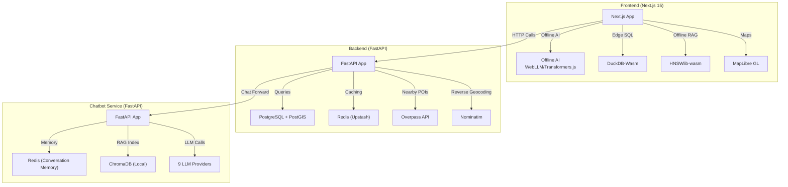
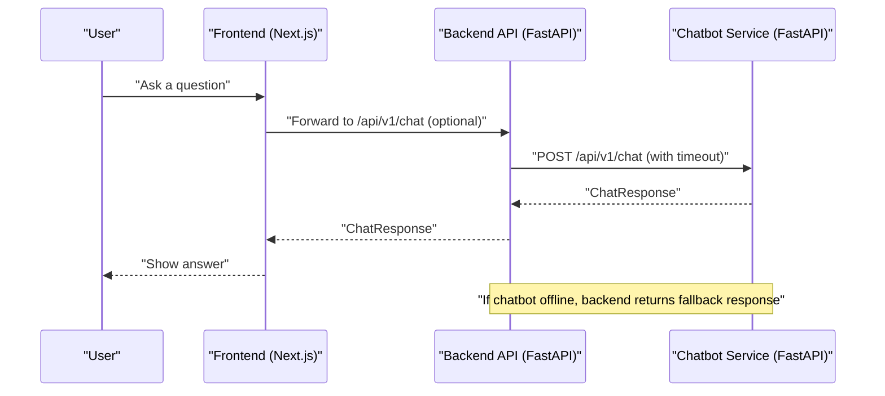
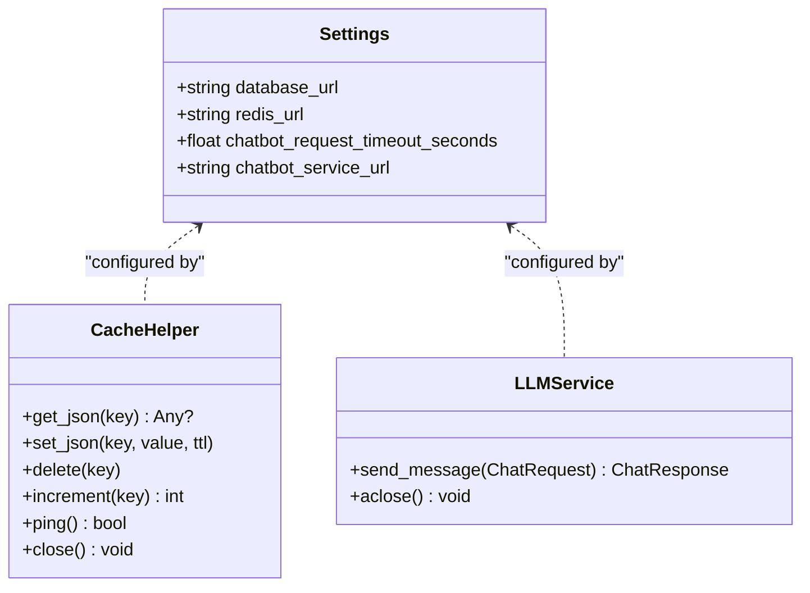
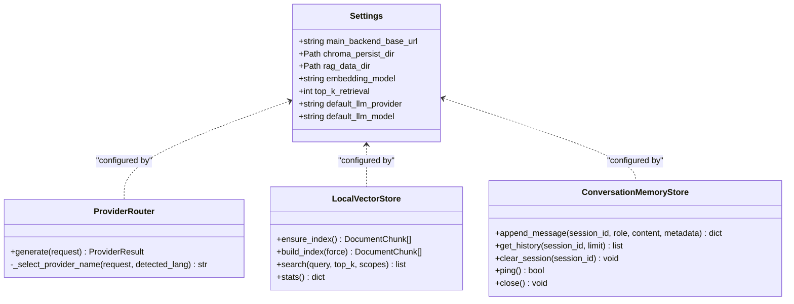
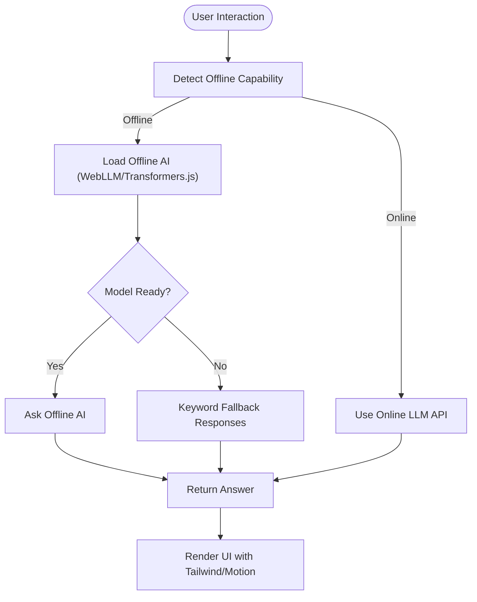
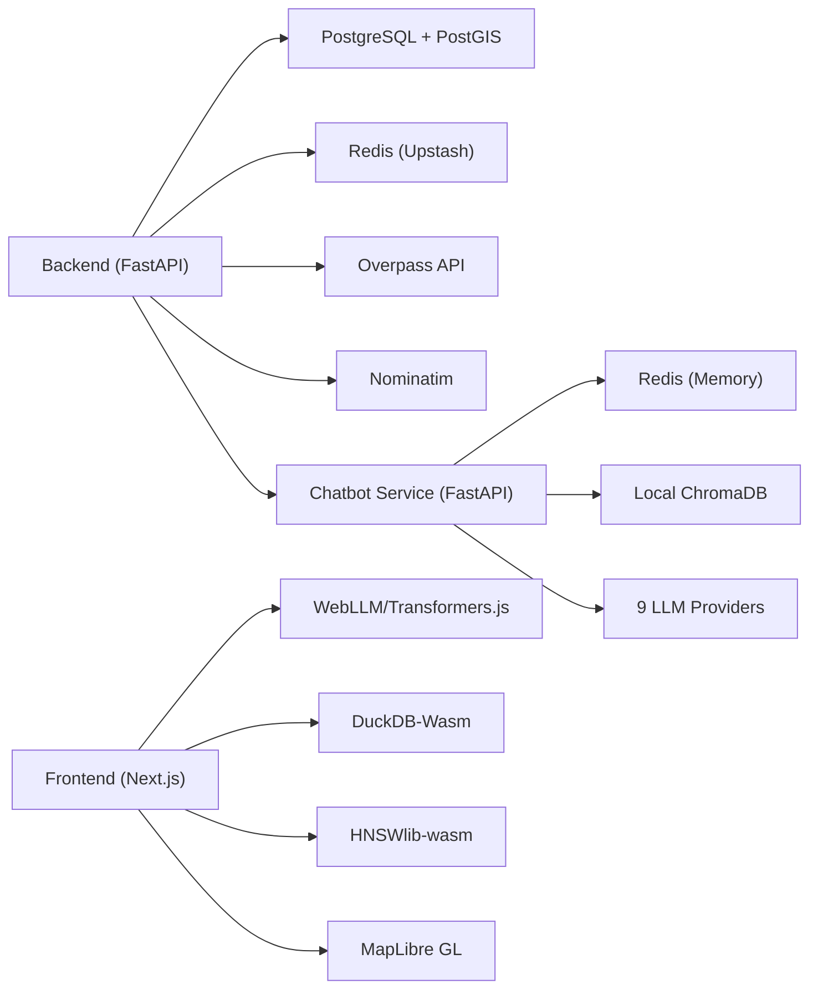

# Technology Stack

<cite>
**Referenced Files in This Document**
- [backend/main.py](file://backend/main.py)
- [chatbot_service/main.py](file://chatbot_service/main.py)
- [backend/core/config.py](file://backend/core/config.py)
- [chatbot_service/config.py](file://chatbot_service/config.py)
- [backend/core/database.py](file://backend/core/database.py)
- [backend/core/redis_client.py](file://backend/core/redis_client.py)
- [backend/services/llm_service.py](file://backend/services/llm_service.py)
- [chatbot_service/providers/router.py](file://chatbot_service/providers/router.py)
- [chatbot_service/memory/redis_memory.py](file://chatbot_service/memory/redis_memory.py)
- [chatbot_service/rag/vectorstore.py](file://chatbot_service/rag/vectorstore.py)
- [frontend/package.json](file://frontend/package.json)
- [frontend/next.config.js](file://frontend/next.config.js)
- [frontend/lib/offline-ai.ts](file://frontend/lib/offline-ai.ts)
- [frontend/lib/edge-ai.ts](file://frontend/lib/edge-ai.ts)
- [backend/models/schemas.py](file://backend/models/schemas.py)
- [backend/requirements.txt](file://backend/requirements.txt)
- [chatbot_service/requirements.txt](file://chatbot_service/requirements.txt)
- [docs/TechStack.md](file://docs/TechStack.md)
</cite>

## Table of Contents
1. [Introduction](#introduction)
2. [Project Structure](#project-structure)
3. [Core Components](#core-components)
4. [Architecture Overview](#architecture-overview)
5. [Detailed Component Analysis](#detailed-component-analysis)
6. [Dependency Analysis](#dependency-analysis)
7. [Performance Considerations](#performance-considerations)
8. [Troubleshooting Guide](#troubleshooting-guide)
9. [Conclusion](#conclusion)
10. [Appendices](#appendices)

## Introduction
This document presents the complete technology stack powering SafeVixAI, focusing on the backend, chatbot service, and frontend. It explains the three-service architecture, the backend’s FastAPI + SQLAlchemy + PostGIS + Redis + DuckDB + Overpass/Nominatim integration, the chatbot service’s FastAPI + ChromaDB + LangChain + 9 LLM providers, and the frontend’s Next.js 15 + React 19 + TypeScript + Tailwind + MapLibre GL + WebLLM + DuckDB-Wasm + Transformers.js. It also covers infrastructure on Vercel, Render.com, Supabase, Upstash, and GitHub Actions with free-tier usage, along with version compatibility, integration patterns, and performance considerations.

## Project Structure
SafeVixAI is organized into three primary services plus shared frontend assets:
- Backend API service (FastAPI) exposing REST endpoints for emergencies, routing, geocoding, roadwatch, challan calculation, and chat delegation.
- Chatbot service (FastAPI) implementing an agentic RAG pipeline with 9 LLM providers and local vector storage.
- Frontend (Next.js 15) with offline-first AI, browser-native DuckDB-Wasm, Transformers.js, and MapLibre GL.

**Diagram sources**
- [backend/main.py:24-128](file://backend/main.py#L24-L128)
- [chatbot_service/main.py:41-145](file://chatbot_service/main.py#L41-L145)
- [frontend/package.json:14-52](file://frontend/package.json#L14-L52)

**Section sources**
- [docs/TechStack.md:1-27](file://docs/TechStack.md#L1-L27)
- [backend/main.py:24-128](file://backend/main.py#L24-L128)
- [chatbot_service/main.py:41-145](file://chatbot_service/main.py#L41-L145)

## Core Components
- Backend API: FastAPI application with lifespan-managed services for emergency locator, routing, geocoding, roadwatch, challan calculation, and chat forwarding to the chatbot service.
- Chatbot Service: FastAPI application with a provider router orchestrating 9 LLM providers, a local ChromaDB vector store, and Redis-backed conversation memory.
- Frontend: Next.js 15 app with offline-first AI using WebLLM and Transformers.js, DuckDB-Wasm for edge SQL, HNSWlib-wasm for vector search, and MapLibre GL for maps.

Key integration points:
- Backend delegates chat requests to the chatbot service via an HTTP client configured with timeouts and user-agent headers.
- Both backend and chatbot services rely on Redis for caching/conversation memory with graceful degradation to in-memory fallback.
- Backend uses SQLAlchemy async ORM with PostGIS for spatial queries and Alembic for migrations.

**Section sources**
- [backend/main.py:24-128](file://backend/main.py#L24-L128)
- [chatbot_service/main.py:41-145](file://chatbot_service/main.py#L41-L145)
- [backend/core/database.py:16-49](file://backend/core/database.py#L16-L49)
- [backend/core/redis_client.py:136-139](file://backend/core/redis_client.py#L136-L139)
- [chatbot_service/memory/redis_memory.py:10-90](file://chatbot_service/memory/redis_memory.py#L10-L90)

## Architecture Overview
The system follows a three-service architecture:
- Frontend (Next.js) handles UI, offline AI, and edge compute.
- Backend (FastAPI) centralizes data access, spatial services, and chat delegation.
- Chatbot (FastAPI) powers agentic RAG with multi-provider LLM fallback.

**Diagram sources**
- [backend/services/llm_service.py:26-67](file://backend/services/llm_service.py#L26-L67)
- [backend/models/schemas.py:226-238](file://backend/models/schemas.py#L226-L238)
- [chatbot_service/main.py:117-142](file://chatbot_service/main.py#L117-L142)

## Detailed Component Analysis

### Backend Stack (FastAPI + SQLAlchemy + PostGIS + Redis + DuckDB + Overpass/Nominatim)
- Web Framework: FastAPI with lifespan lifecycle to initialize services and caches.
- Database: SQLAlchemy async ORM with asyncpg driver and PostGIS geometry types; Alembic for migrations.
- Cache: Redis client abstraction with in-memory fallback and TTL-aware JSON helpers.
- Geospatial: Overpass API and Nominatim for POI discovery and reverse geocoding.
- DuckDB: Used for offline computations and data processing tasks.
- HTTP: httpx for async upstream calls with retry/backoff and timeouts.
- Validation: Pydantic models for request/response schemas.

**Diagram sources**
- [backend/core/config.py:11-181](file://backend/core/config.py#L11-L181)
- [backend/core/redis_client.py:10-139](file://backend/core/redis_client.py#L10-L139)
- [backend/services/llm_service.py:11-25](file://backend/services/llm_service.py#L11-L25)

**Section sources**
- [backend/main.py:24-128](file://backend/main.py#L24-L128)
- [backend/core/config.py:11-181](file://backend/core/config.py#L11-L181)
- [backend/core/database.py:16-49](file://backend/core/database.py#L16-L49)
- [backend/core/redis_client.py:10-139](file://backend/core/redis_client.py#L10-L139)
- [backend/requirements.txt:1-49](file://backend/requirements.txt#L1-L49)

### Chatbot Service Architecture (FastAPI + ChromaDB + LangChain + 9 LLM Providers)
- Web Framework: FastAPI with lifespan to initialize RAG components, tools, and provider router.
- Memory: Redis-backed conversation memory with in-memory fallback and TTL.
- RAG: Local ChromaDB-compatible vector store built from legal and road safety documents.
- LLM Providers: 9-provider fallback chain (Groq, Gemini, Sarvam AI, GitHub Models, NVIDIA NIM, OpenRouter, Mistral, Together) with intelligent routing by language and intent.
- Tools: Integrations for SOS, challan, legal search, first aid, road infrastructure, weather, geocoding, and report submission.

**Diagram sources**
- [chatbot_service/config.py:40-113](file://chatbot_service/config.py#L40-L113)
- [chatbot_service/providers/router.py:75-199](file://chatbot_service/providers/router.py#L75-L199)
- [chatbot_service/rag/vectorstore.py:20-110](file://chatbot_service/rag/vectorstore.py#L20-L110)
- [chatbot_service/memory/redis_memory.py:10-90](file://chatbot_service/memory/redis_memory.py#L10-L90)

**Section sources**
- [chatbot_service/main.py:41-145](file://chatbot_service/main.py#L41-L145)
- [chatbot_service/config.py:40-113](file://chatbot_service/config.py#L40-L113)
- [chatbot_service/providers/router.py:1-199](file://chatbot_service/providers/router.py#L1-L199)
- [chatbot_service/rag/vectorstore.py:1-110](file://chatbot_service/rag/vectorstore.py#L1-L110)
- [chatbot_service/memory/redis_memory.py:1-90](file://chatbot_service/memory/redis_memory.py#L1-L90)
- [chatbot_service/requirements.txt:1-53](file://chatbot_service/requirements.txt#L1-L53)

### Frontend Stack (Next.js 15 + React 19 + TypeScript + Tailwind + MapLibre GL + WebLLM + DuckDB-Wasm + Transformers.js)
- Framework: Next.js 15 with App Router, SSR, PWA, and strict TypeScript.
- UI: Tailwind CSS, shadcn/ui primitives, motion animations, and Zustand for global state.
- Maps: MapLibre GL vector tiles with dynamic SSR disabled for client-only rendering.
- Offline AI: WebLLM and Transformers.js for Phi-3/Gemma offline inference; fallback to keyword responses.
- Edge SQL: DuckDB-Wasm for offline challan calculations and analytics.
- Vector Search: HNSWlib-wasm for offline RAG retrieval.
- Networking: Axios for API calls, SWR for data fetching, and socket.io-client for real-time features.
- Browser APIs: Geolocation, DeviceMotion, Web Speech API, Service Worker + Cache Storage, IndexedDB.

**Diagram sources**
- [frontend/lib/offline-ai.ts:124-211](file://frontend/lib/offline-ai.ts#L124-L211)
- [frontend/package.json:14-52](file://frontend/package.json#L14-L52)
- [frontend/next.config.js:19-40](file://frontend/next.config.js#L19-L40)

**Section sources**
- [frontend/package.json:14-52](file://frontend/package.json#L14-L52)
- [frontend/next.config.js:19-40](file://frontend/next.config.js#L19-L40)
- [frontend/lib/offline-ai.ts:1-256](file://frontend/lib/offline-ai.ts#L1-L256)
- [frontend/lib/edge-ai.ts:1-29](file://frontend/lib/edge-ai.ts#L1-L29)

### Infrastructure and Free-Tier Utilization
- Hosting:
  - Frontend: Vercel (free tier CDN and deployments).
  - Backend: Render.com (free tier hours).
  - Chatbot: Render.com (free tier hours).
- Databases:
  - Primary DB: Supabase (PostgreSQL 16 + PostGIS 3.4) on free tier.
  - Cache: Upstash Redis (free tier commands).
- LLM APIs: Multi-provider chain leveraging free tiers (Groq, Gemini, Sarvam AI, GitHub Models, OpenRouter, Mistral, Together).
- Model CDN: CDN for WebLLM model weights.
- Maps: MapLibre GL + OSM (free).
- Geocoding: Nominatim (1 req/sec).
- CI/CD: GitHub Actions (free minutes).

**Section sources**
- [docs/TechStack.md:170-185](file://docs/TechStack.md#L170-L185)

## Dependency Analysis
- Backend depends on:
  - SQLAlchemy async ORM and asyncpg for database connectivity.
  - Redis for caching and rate limiting.
  - Overpass API and Nominatim for geospatial data.
  - httpx for upstream calls.
- Chatbot service depends on:
  - Redis for conversation memory.
  - ChromaDB-compatible local vector store.
  - LangChain ecosystem and multiple LLM provider SDKs.
  - httpx/requests for external API calls.
- Frontend depends on:
  - Next.js runtime and Webpack configuration for WASM/Workers.
  - DuckDB-Wasm, Transformers.js, and HNSWlib-wasm for offline AI.
  - MapLibre GL for vector maps.
  - Axios/SWR for network and caching.

**Diagram sources**
- [backend/main.py:24-128](file://backend/main.py#L24-L128)
- [chatbot_service/main.py:41-145](file://chatbot_service/main.py#L41-L145)
- [frontend/package.json:14-52](file://frontend/package.json#L14-L52)

**Section sources**
- [backend/requirements.txt:1-49](file://backend/requirements.txt#L1-L49)
- [chatbot_service/requirements.txt:1-53](file://chatbot_service/requirements.txt#L1-L53)
- [frontend/package.json:14-52](file://frontend/package.json#L14-L52)

## Performance Considerations
- Caching and Degradation:
  - Backend and chatbot services use Redis with in-memory fallback to maintain availability under partial outages.
  - Backend’s LLMService forwards to chatbot and returns deterministic fallback responses when the chatbot is unavailable.
- Latency and Throughput:
  - ProviderRouter selects providers by language and intent, prioritizing speed (Groq) and capacity (Gemini) to balance latency and quality.
  - Vector search uses a simple scoring and sorting approach; top-k tuning impacts latency.
- Offline Efficiency:
  - Frontend loads models once and caches them via Service Worker and Cache Storage to minimize repeated downloads.
  - DuckDB-Wasm and HNSWlib-wasm enable efficient offline analytics and retrieval.
- Database and Network:
  - SQLAlchemy async connections with tuned pool sizes and timeouts reduce contention.
  - httpx retries and backoff mitigate upstream API variability.

**Section sources**
- [backend/core/redis_client.py:10-139](file://backend/core/redis_client.py#L10-L139)
- [chatbot_service/memory/redis_memory.py:10-90](file://chatbot_service/memory/redis_memory.py#L10-L90)
- [backend/services/llm_service.py:26-67](file://backend/services/llm_service.py#L26-L67)
- [chatbot_service/providers/router.py:75-199](file://chatbot_service/providers/router.py#L75-L199)
- [frontend/lib/offline-ai.ts:124-211](file://frontend/lib/offline-ai.ts#L124-L211)

## Troubleshooting Guide
- Health Checks:
  - Backend exposes a health endpoint returning database and cache availability, chatbot readiness, and environment/version.
  - Chatbot exposes a lightweight health endpoint checking memory backend availability.
- Common Issues:
  - Redis unavailability: Both services degrade gracefully to in-memory storage; monitor health endpoints for cache_backend status.
  - Chatbot offline: Backend’s LLMService returns fallback responses for emergencies, challan, and general fallback intents.
  - Provider exhaustion: ProviderRouter attempts a predefined fallback chain; ensure at least one provider API key is configured.
- Diagnostics:
  - Verify CORS origins in settings for both services.
  - Confirm Overpass/Nominatim URLs and timeouts in backend settings.
  - Ensure environment variables for chatbot providers are present when running locally.

**Section sources**
- [backend/main.py:103-125](file://backend/main.py#L103-L125)
- [chatbot_service/main.py:106-115](file://chatbot_service/main.py#L106-L115)
- [backend/core/config.py:11-181](file://backend/core/config.py#L11-L181)
- [chatbot_service/config.py:115-126](file://chatbot_service/config.py#L115-L126)
- [backend/services/llm_service.py:37-67](file://backend/services/llm_service.py#L37-L67)

## Conclusion
SafeVixAI’s technology stack balances robust backend services, a powerful agentic chatbot with multi-provider LLM fallback, and a next-generation offline-first frontend. The architecture leverages free-tier infrastructure and modern web technologies to deliver a scalable, resilient, and accessible road safety platform. Version compatibility and integration patterns are grounded in the repository’s configuration and requirements files, ensuring reproducible builds and predictable performance.

## Appendices

### Version Compatibility and Technology Selection
- Backend:
  - FastAPI 0.136.0, SQLAlchemy 2.0.49, asyncpg 0.31.0, GeoAlchemy2 0.19.0, Alembic 1.18.4, Redis 7.4.0, DuckDB 1.5.2, httpx 0.28.1.
  - Selected for async I/O, strong typing, spatial extensions, and mature ecosystem.
- Chatbot Service:
  - FastAPI 0.136.0, torch 2.11.0, transformers 5.5.4, langchain 1.2.15, chromadb 1.5.8, LocalHashEmbeddingFunction (hash-based) 5.4.1, redis 7.4.0.
  - Supports heavy ML workloads and multi-provider LLM orchestration.
- Frontend:
  - Next.js 15.3.1, React 19.1.0, TypeScript 5.5.3, Tailwind CSS 3.4.10, MapLibre GL 5.22.0, @mlc-ai/web-llm 0.2.73, @huggingface/transformers 4.0.1, @duckdb/duckdb-wasm 1.29.0, hnswlib-wasm latest.
  - Enables offline-first AI, vector search, and responsive UI.

**Section sources**
- [backend/requirements.txt:1-49](file://backend/requirements.txt#L1-L49)
- [chatbot_service/requirements.txt:1-53](file://chatbot_service/requirements.txt#L1-L53)
- [frontend/package.json:14-52](file://frontend/package.json#L14-L52)
- [docs/TechStack.md:31-185](file://docs/TechStack.md#L31-L185)

## HuggingFace Dataset Hub

SafeVixAI publishes its curated datasets on the **[HuggingFace Dataset Hub](https://huggingface.co/datasets/SafeVixAI/SafeVixAI-Dataset-Hub)** for research reproducibility and community collaboration. This includes:

- Emergency service coordinates for 25 Indian cities
- Motor Vehicle Act violation databases with state-specific overrides
- Road infrastructure GeoJSON datasets (PMGSY, NHAI, toll plazas)
- ChromaDB vector store training corpora (legal documents, first aid guides, WHO road safety data)

> **Note**: The HuggingFace Dataset Hub is a *data hosting* layer — models are served via WebLLM CDN and LLM providers (Groq, Gemini, etc.), not from HuggingFace model inference.
