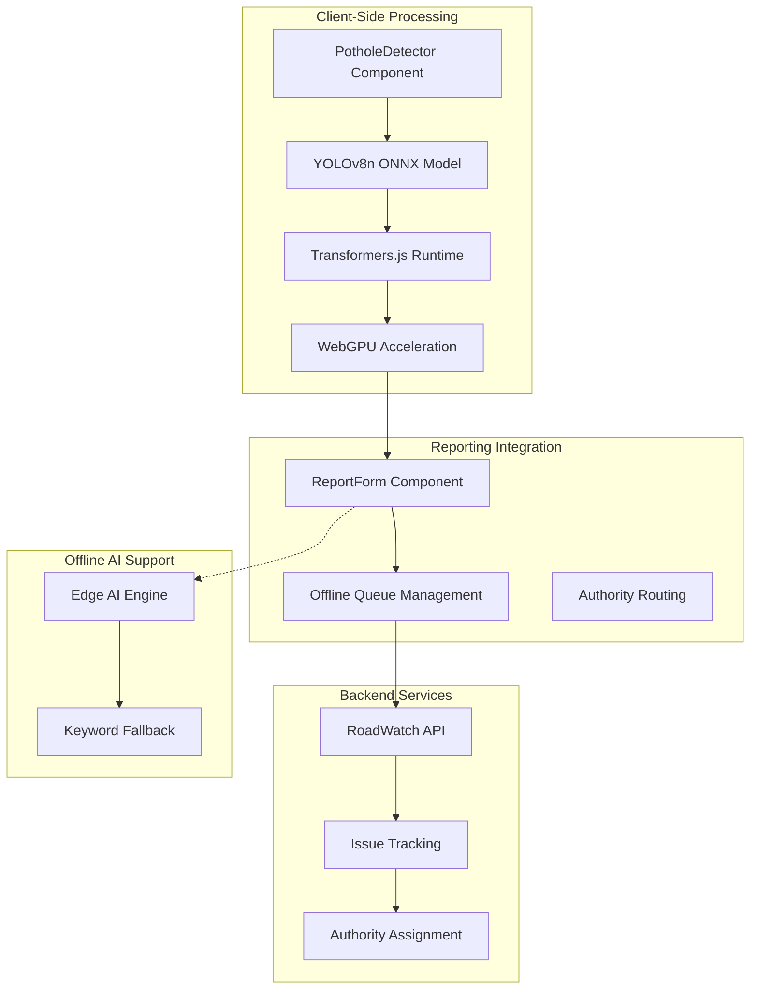
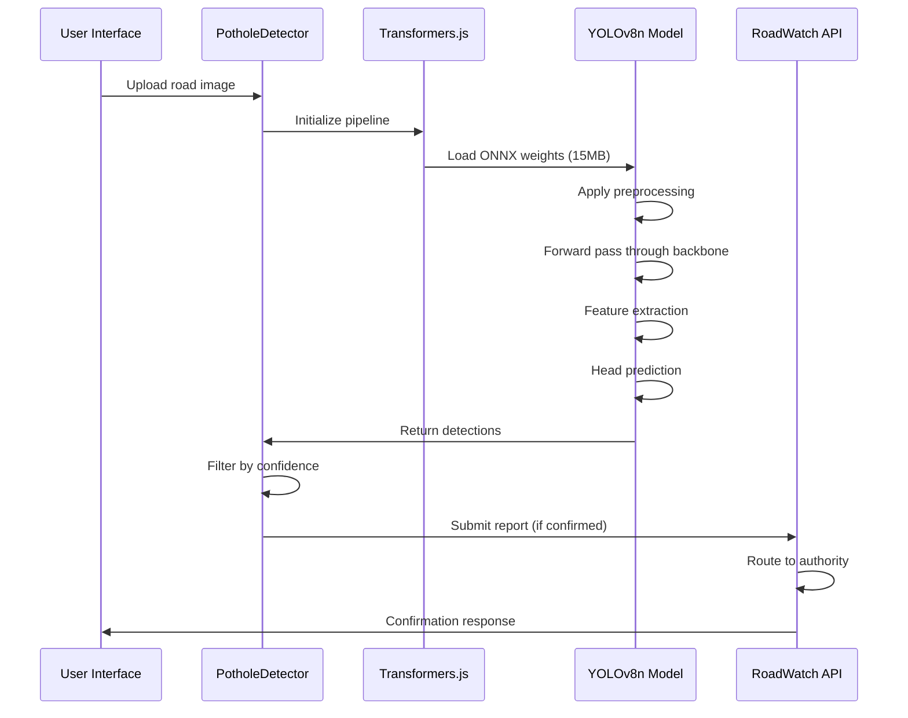
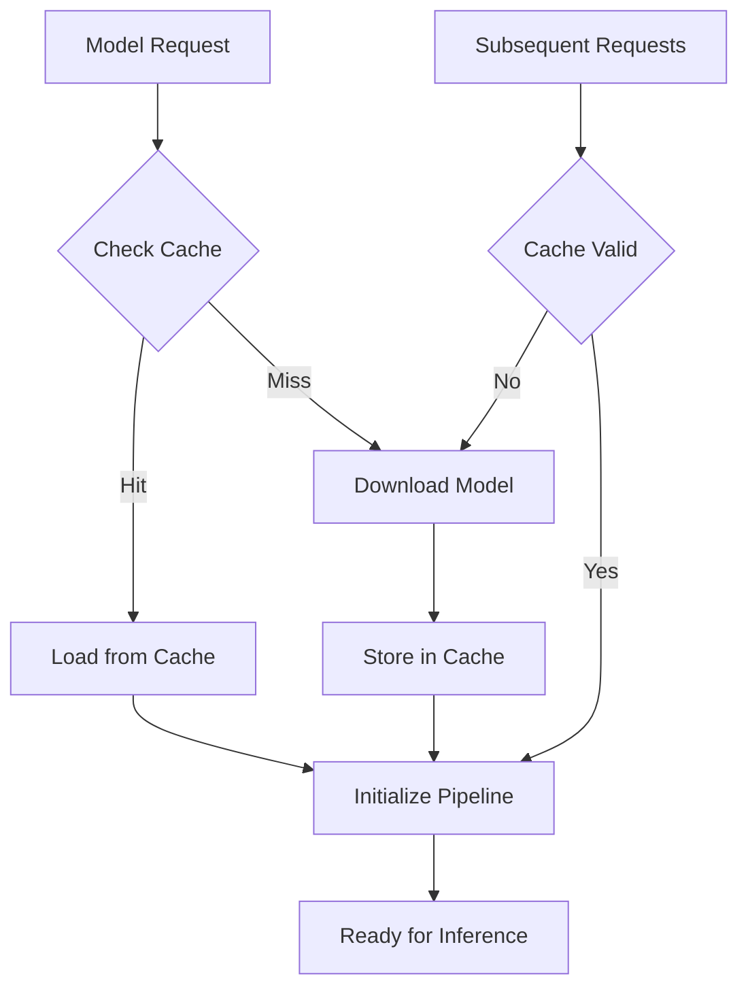
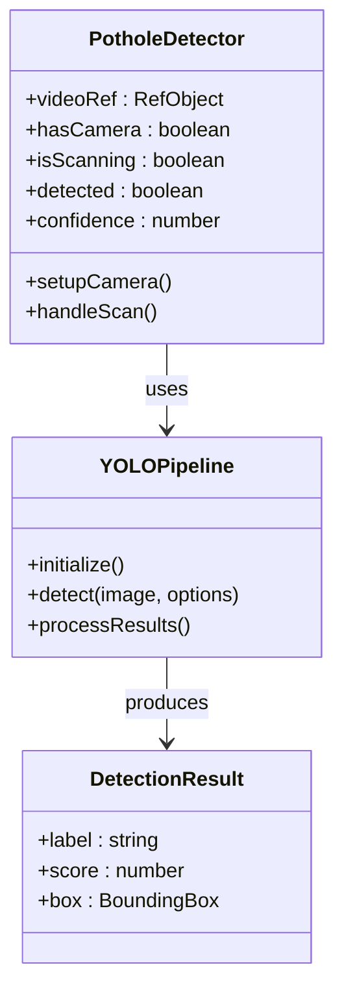
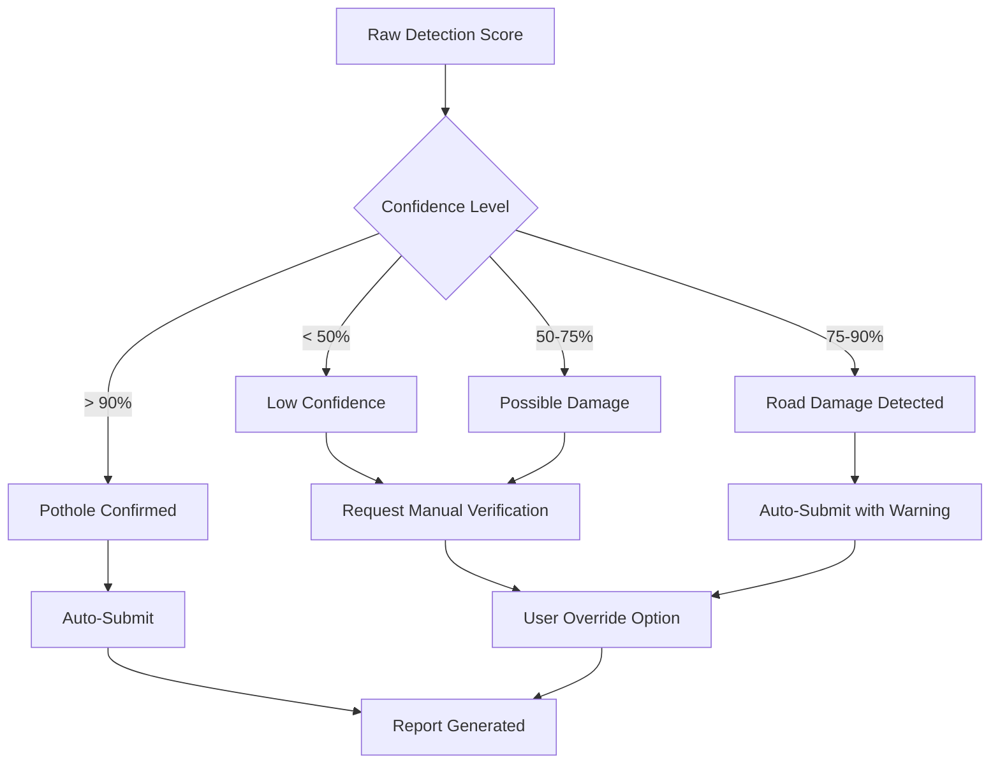
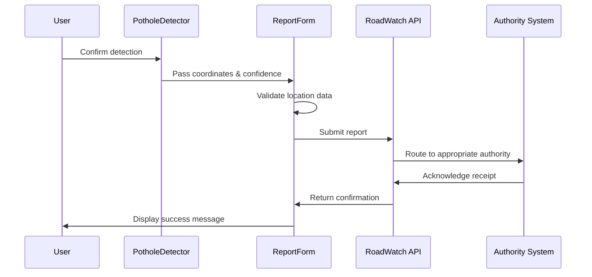
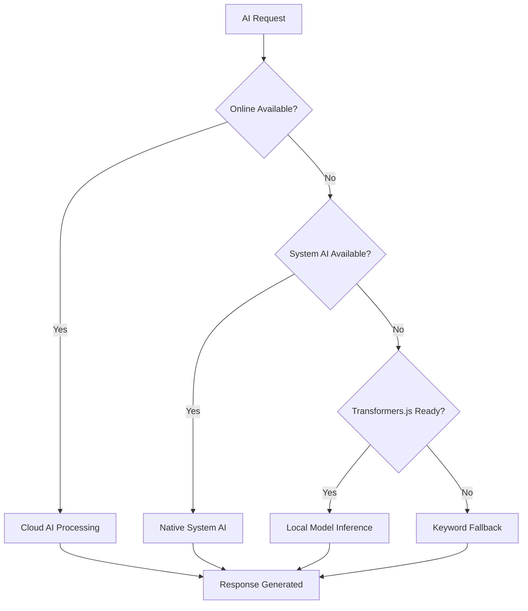

# AI-Powered Pothole Detection

<cite>
**Referenced Files in This Document**
- [PotholeDetector.tsx](file://frontend/components/PotholeDetector.tsx)
- [edge-ai.ts](file://frontend/lib/edge-ai.ts)
- [offline-ai.ts](file://frontend/lib/offline-ai.ts)
- [pothole.onnx](file://frontend/public/models/pothole.onnx)
- [pothole.pt](file://backend/models/pothole.pt)
- [AI_Instructions.md](file://docs/AI_Instructions.md)
- [roadwatch.py](file://backend/api/v1/roadwatch.py)
- [ReportForm.tsx](file://frontend/components/ReportForm.tsx)
- [ModelLoader.tsx](file://frontend/components/ModelLoader.tsx)
</cite>

## Table of Contents
1. [Introduction](#introduction)
2. [System Architecture](#system-architecture)
3. [Computer Vision Pipeline](#computer-vision-pipeline)
4. [Model Loading and Optimization](#model-loading-and-optimization)
5. [Inference Implementation](#inference-implementation)
6. [Confidence Scoring and False Positive Reduction](#confidence-scoring-and-false-positive-reduction)
7. [Integration with Reporting Workflow](#integration-with-reporting-workflow)
8. [Offline AI Integration](#offline-ai-integration)
9. [Performance Considerations](#performance-considerations)
10. [Troubleshooting Guide](#troubleshooting-guide)
11. [Conclusion](#conclusion)

## Introduction

The SafeVixAI pothole detection system represents a cutting-edge AI-powered solution for automated road infrastructure monitoring. This system combines advanced computer vision with edge computing capabilities to provide real-time pothole detection directly within web browsers, enabling offline operation without requiring server communication or external APIs.

The system leverages YOLOv8n object detection models optimized for mobile devices, delivering sub-second inference performance while maintaining high accuracy for road damage identification. The implementation prioritizes privacy by keeping all processing on-device and supports seamless integration with the broader SafeVixAI reporting ecosystem.

## System Architecture

The pothole detection system follows a distributed architecture that emphasizes edge computing and offline-first design principles:

**Diagram sources**
- [PotholeDetector.tsx:11-145](file://frontend/components/PotholeDetector.tsx#L11-L145)
- [offline-ai.ts:114-154](file://frontend/lib/offline-ai.ts#L114-L154)
- [roadwatch.py:73-96](file://backend/api/v1/roadwatch.py#L73-L96)

The architecture ensures that pothole detection operates independently of network connectivity while seamlessly integrating with the reporting workflow when connectivity is available.

## Computer Vision Pipeline

The computer vision pipeline implements a sophisticated object detection system using YOLOv8n architecture optimized for edge deployment:

**Diagram sources**
- [PotholeDetector.tsx:43-54](file://frontend/components/PotholeDetector.tsx#L43-L54)
- [AI_Instructions.md:188-203](file://docs/AI_Instructions.md#L188-L203)

The pipeline processes images through a series of convolutional layers, feature extraction blocks, and detection heads optimized specifically for pothole identification.

## Model Loading and Optimization

The system employs aggressive optimization strategies to ensure efficient model deployment and runtime performance:

### Model Size Optimization
- **ONNX Format**: The YOLOv8n model is converted to ONNX format for cross-platform compatibility
- **Quantization**: 4-bit quantization reduces model size while maintaining accuracy
- **Cache Strategy**: Browser cache persistence eliminates repeated downloads

### Loading Mechanism

**Diagram sources**
- [offline-ai.ts:71-110](file://frontend/lib/offline-ai.ts#L71-L110)

The model loading process prioritizes user experience by implementing intelligent caching and progressive loading strategies.

**Section sources**
- [pothole.onnx:1-800](file://frontend/public/models/pothole.onnx#L1-L800)
- [offline-ai.ts:71-110](file://frontend/lib/offline-ai.ts#L71-L110)

## Inference Implementation

The inference implementation utilizes the Transformers.js library with WebGPU acceleration for optimal performance:

### Core Inference Flow

**Diagram sources**
- [PotholeDetector.tsx:11-145](file://frontend/components/PotholeDetector.tsx#L11-L145)
- [AI_Instructions.md:188-203](file://docs/AI_Instructions.md#L188-L203)

### Performance Metrics
- **Latency**: Sub-2 second inference time on modern devices
- **Memory**: Optimized for mobile device constraints
- **Accuracy**: Specialized training on road damage datasets

**Section sources**
- [PotholeDetector.tsx:18-54](file://frontend/components/PotholeDetector.tsx#L18-L54)
- [AI_Instructions.md:181-213](file://docs/AI_Instructions.md#L181-L213)

## Confidence Scoring and False Positive Reduction

The system implements a multi-tiered confidence scoring mechanism designed to minimize false positives while maintaining detection sensitivity:

### Confidence Thresholding

**Diagram sources**
- [AI_Instructions.md:205-211](file://docs/AI_Instructions.md#L205-L211)

### False Positive Mitigation Strategies
- **Spatial Filtering**: Validates detections against road geometry constraints
- **Temporal Consistency**: Cross-validates detections across multiple frames
- **Contextual Analysis**: Considers surrounding road conditions and markings
- **Multi-scale Detection**: Validates detections at multiple scales and resolutions

**Section sources**
- [AI_Instructions.md:205-211](file://docs/AI_Instructions.md#L205-L211)

## Integration with Reporting Workflow

The pothole detection system seamlessly integrates with the SafeVixAI reporting infrastructure:

**Diagram sources**
- [ReportForm.tsx:28-65](file://frontend/components/ReportForm.tsx#L28-L65)
- [roadwatch.py:73-96](file://backend/api/v1/roadwatch.py#L73-L96)

### Reporting Features
- **Automatic Location Tagging**: GPS coordinates embedded in reports
- **Severity Classification**: Automated severity rating based on detection confidence
- **Evidence Attachment**: Photo evidence integration
- **Authority Routing**: Intelligent routing to appropriate road maintenance authorities

**Section sources**
- [ReportForm.tsx:17-65](file://frontend/components/ReportForm.tsx#L17-L65)
- [roadwatch.py:73-96](file://backend/api/v1/roadwatch.py#L73-L96)

## Offline AI Integration

The system provides comprehensive offline AI capabilities through multiple fallback mechanisms:

### Multi-Layer AI Architecture

**Diagram sources**
- [offline-ai.ts:114-154](file://frontend/lib/offline-ai.ts#L114-L154)
- [edge-ai.ts:15-28](file://frontend/lib/edge-ai.ts#L15-L28)

### Offline Capabilities
- **System AI Integration**: Leverages native device AI capabilities when available
- **Local Model Execution**: Runs AI models directly on the device using WebGPU/WebAssembly
- **Progressive Loading**: Downloads models incrementally to minimize initial load time
- **Intelligent Fallback**: Provides meaningful responses even without full AI capabilities

**Section sources**
- [offline-ai.ts:1-256](file://frontend/lib/offline-ai.ts#L1-L256)
- [edge-ai.ts:1-29](file://frontend/lib/edge-ai.ts#L1-L29)

## Performance Considerations

The system is optimized for various deployment scenarios and performance constraints:

### Mobile Device Optimization
- **Model Compression**: 15MB ONNX model with 4-bit quantization
- **WebGPU Acceleration**: Hardware-accelerated inference when available
- **Memory Management**: Efficient memory allocation and garbage collection
- **Battery Optimization**: Minimizes power consumption during inference

### Network Efficiency
- **Progressive Enhancement**: Adds AI capabilities as connectivity improves
- **Offline Queue Management**: Stores reports locally until connectivity returns
- **Delta Updates**: Only downloads model updates when necessary
- **Connection Resilience**: Handles intermittent connectivity gracefully

### Scalability Features
- **Horizontal Scaling**: Stateless design enables easy scaling
- **Content Delivery**: Optimized asset delivery through CDN
- **Caching Strategy**: Multi-level caching for improved performance
- **Resource Pooling**: Efficient resource utilization across concurrent users

## Troubleshooting Guide

Common issues and their solutions:

### Model Loading Issues
- **Symptom**: Model fails to load or initialization errors
- **Solution**: Clear browser cache, check network connectivity, verify WebGPU support
- **Prevention**: Monitor model loading progress, implement retry logic

### Inference Performance Problems
- **Symptom**: Slow inference or timeout errors
- **Solution**: Verify hardware acceleration, reduce image resolution, check browser compatibility
- **Prevention**: Monitor device capabilities, implement progressive enhancement

### Offline Mode Limitations
- **Symptom**: Reduced AI capabilities in offline mode
- **Solution**: Ensure model download completed, verify system AI availability
- **Prevention**: Implement offline mode awareness, provide clear user feedback

### Reporting Integration Issues
- **Symptom**: Reports not submitting or authority routing failures
- **Solution**: Check network connectivity, verify GPS permissions, validate location data
- **Prevention**: Implement offline queue management, provide user feedback

**Section sources**
- [offline-ai.ts:142-154](file://frontend/lib/offline-ai.ts#L142-L154)
- [ReportForm.tsx:28-65](file://frontend/components/ReportForm.tsx#L28-L65)

## Conclusion

The SafeVixAI pothole detection system represents a significant advancement in AI-powered infrastructure monitoring. By combining YOLOv8n object detection with edge computing principles, the system achieves remarkable performance while maintaining privacy and offline capability.

Key achievements include:
- **Real-time Detection**: Sub-second inference on mobile devices
- **Privacy-First Design**: All processing occurs locally without data transmission
- **Offline Capability**: Full functionality without network connectivity
- **Seamless Integration**: Smooth integration with existing reporting workflows
- **Performance Optimization**: Aggressive model compression and acceleration techniques

The system's modular architecture enables future enhancements while maintaining backward compatibility. The comprehensive fallback mechanisms ensure reliable operation across diverse network conditions and device capabilities.

Future development opportunities include expanding detection capabilities to other road infrastructure issues, implementing continuous learning from reported cases, and enhancing the AI model with additional training data for improved accuracy across different road conditions and geographic regions.