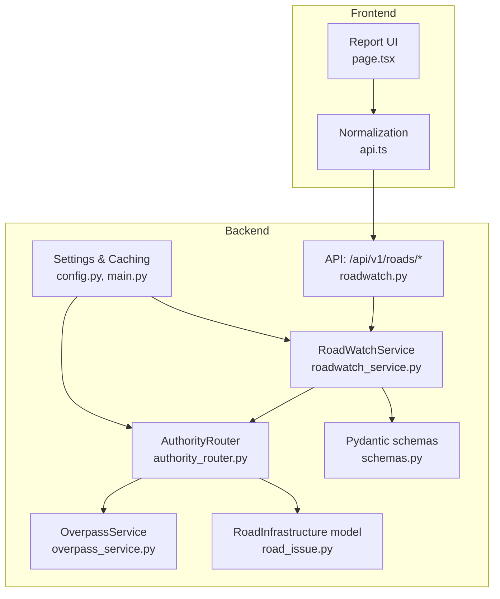
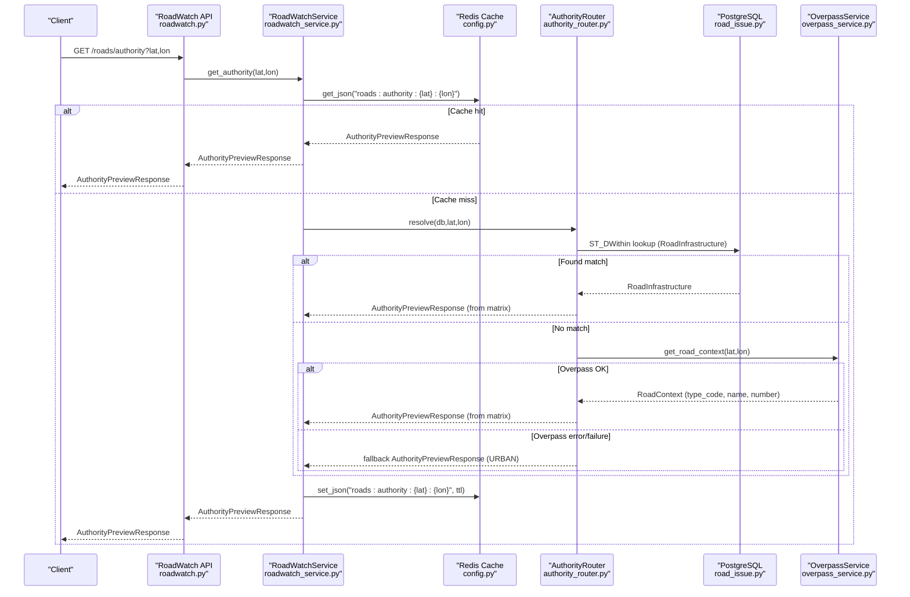
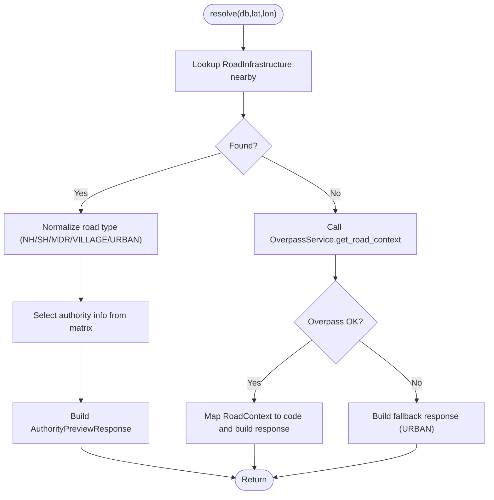
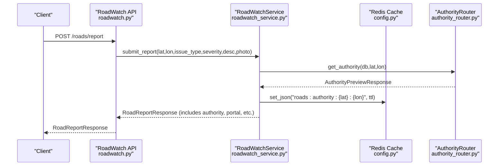
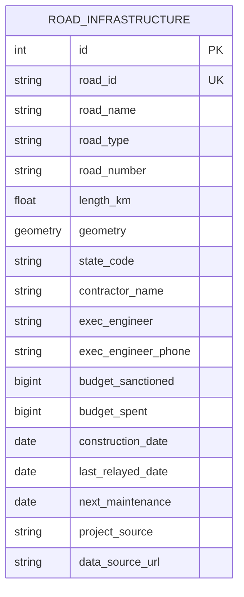
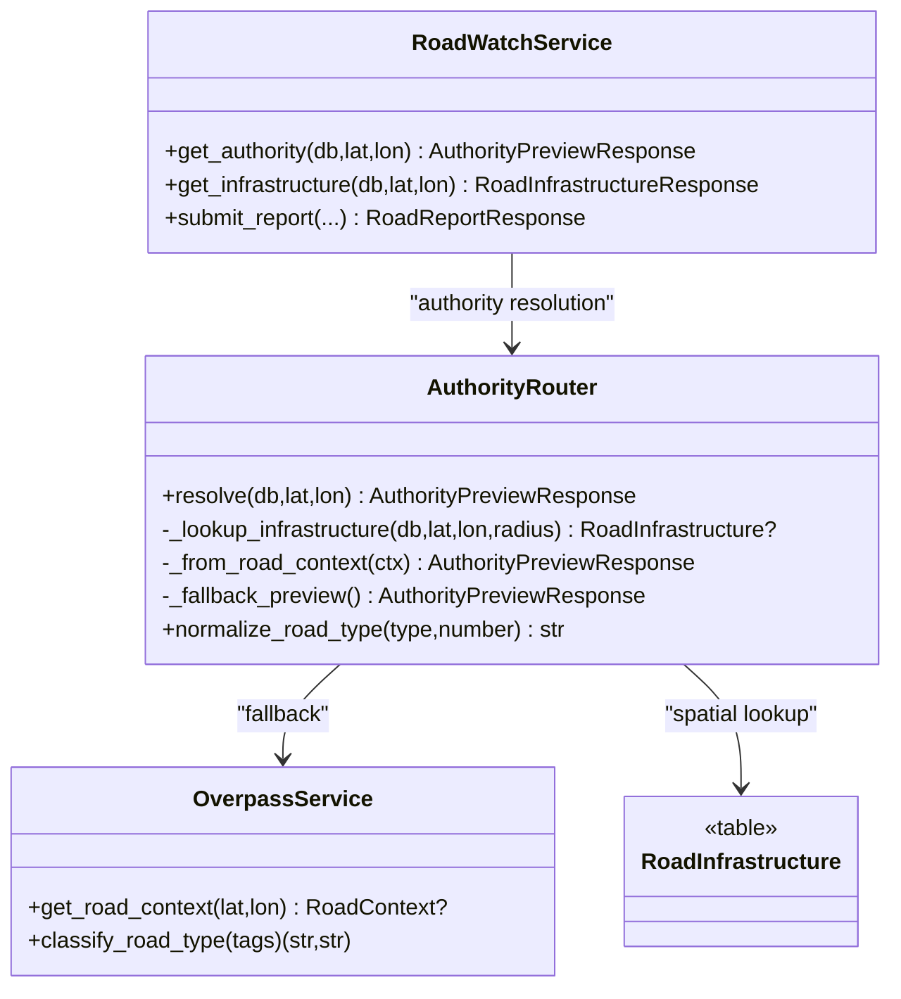

# Automatic Authority Routing

<cite>
**Referenced Files in This Document**
- [authority_router.py](file://backend/services/authority_router.py)
- [roadwatch_service.py](file://backend/services/roadwatch_service.py)
- [roadwatch.py](file://backend/api/v1/roadwatch.py)
- [schemas.py](file://backend/models/schemas.py)
- [road_issue.py](file://backend/models/road_issue.py)
- [overpass_service.py](file://backend/services/overpass_service.py)
- [config.py](file://backend/core/config.py)
- [main.py](file://backend/main.py)
- [road_sources.example.json](file://backend/data/road_sources.example.json)
- [import_official_road_sources.py](file://backend/scripts/app/import_official_road_sources.py)
- [import_road_infrastructure.py](file://backend/scripts/app/import_road_infrastructure.py)
- [page.tsx](file://frontend/app/report/page.tsx)
- [api.ts](file://frontend/lib/api.ts)
</cite>

## Table of Contents
1. [Introduction](#introduction)
2. [Project Structure](#project-structure)
3. [Core Components](#core-components)
4. [Architecture Overview](#architecture-overview)
5. [Detailed Component Analysis](#detailed-component-analysis)
6. [Dependency Analysis](#dependency-analysis)
7. [Performance Considerations](#performance-considerations)
8. [Troubleshooting Guide](#troubleshooting-guide)
9. [Conclusion](#conclusion)

## Introduction
This document explains the automatic authority routing system that matches reported hazards to the correct road-owning authority. It covers:
- Integration with the road ownership database (including PMGSY, NHAI, and PWD jurisdictions)
- Spatial matching algorithm using GPS coordinates to determine responsible authority via road numbering and administrative boundaries
- Escalation path determination, helpline assignment, and complaint portal linking
- Examples of routing logic for national highways, state roads, municipal roads, and fallback mechanisms
- Integration with the backend authority preview service

## Project Structure
The authority routing system spans backend services, APIs, models, and frontend integration:
- Services: Authority routing, roadwatch, overpass integration, caching
- API: RoadWatch endpoints for authority preview and infrastructure lookup
- Models: Road infrastructure and schema definitions
- Frontend: Report UI and normalization of backend responses

**Diagram sources**
- [roadwatch.py:19-97](file://backend/api/v1/roadwatch.py#L19-L97)
- [roadwatch_service.py:56-125](file://backend/services/roadwatch_service.py#L56-L125)
- [authority_router.py:42-143](file://backend/services/authority_router.py#L42-L143)
- [overpass_service.py:24-135](file://backend/services/overpass_service.py#L24-L135)
- [road_issue.py:42-66](file://backend/models/road_issue.py#L42-L66)
- [schemas.py:83-117](file://backend/models/schemas.py#L83-L117)
- [config.py:11-70](file://backend/core/config.py#L11-L70)
- [main.py:24-64](file://backend/main.py#L24-L64)

**Section sources**
- [roadwatch.py:19-97](file://backend/api/v1/roadwatch.py#L19-L97)
- [roadwatch_service.py:56-125](file://backend/services/roadwatch_service.py#L56-L125)
- [authority_router.py:42-143](file://backend/services/authority_router.py#L42-L143)
- [overpass_service.py:24-135](file://backend/services/overpass_service.py#L24-L135)
- [road_issue.py:42-66](file://backend/models/road_issue.py#L42-L66)
- [schemas.py:83-117](file://backend/models/schemas.py#L83-L117)
- [config.py:11-70](file://backend/core/config.py#L11-L70)
- [main.py:24-64](file://backend/main.py#L24-L64)

## Core Components
- AuthorityRouter: Central routing logic that resolves authority, helpline, escalation path, and complaint portal based on road type and number; falls back to Overpass when database lookup fails.
- RoadWatchService: Orchestrates authority preview and infrastructure lookup, caches results, and integrates with geocoding for address context.
- OverpassService: Queries OpenStreetMap Overpass API to infer road context when database lacks precise matches.
- RoadInfrastructure model: Stores road ownership, jurisdiction, and maintenance metadata for spatial queries.
- Pydantic schemas: Define AuthorityPreviewResponse and related responses used across the system.
- Configuration and lifecycle: Settings, Redis cache TTLs, and service wiring in main application.

**Section sources**
- [authority_router.py:42-143](file://backend/services/authority_router.py#L42-L143)
- [roadwatch_service.py:56-125](file://backend/services/roadwatch_service.py#L56-L125)
- [overpass_service.py:24-135](file://backend/services/overpass_service.py#L24-L135)
- [road_issue.py:42-66](file://backend/models/road_issue.py#L42-L66)
- [schemas.py:83-117](file://backend/models/schemas.py#L83-L117)
- [config.py:11-70](file://backend/core/config.py#L11-L70)
- [main.py:24-64](file://backend/main.py#L24-L64)

## Architecture Overview
The authority routing pipeline:
1. Client requests authority preview or infrastructure details near a coordinate.
2. RoadWatchService checks Redis cache; if miss, calls AuthorityRouter.
3. AuthorityRouter attempts spatial lookup in RoadInfrastructure; if found, normalizes road type and selects authority matrix entry.
4. If no database match, AuthorityRouter queries OverpassService for nearby road context and maps it to a road type code.
5. On failure, a fallback authority (urban) is returned.
6. Responses include authority name, helpline, escalation path, and complaint portal.

**Diagram sources**
- [roadwatch.py:53-60](file://backend/api/v1/roadwatch.py#L53-L60)
- [roadwatch_service.py:70-77](file://backend/services/roadwatch_service.py#L70-L77)
- [authority_router.py:48-79](file://backend/services/authority_router.py#L48-L79)
- [road_issue.py:42-66](file://backend/models/road_issue.py#L42-L66)
- [overpass_service.py:80-107](file://backend/services/overpass_service.py#L80-L107)
- [config.py:33-36](file://backend/core/config.py#L33-L36)

## Detailed Component Analysis

### AuthorityRouter
Responsibilities:
- Resolve authority preview for a coordinate using spatial proximity to RoadInfrastructure.
- Normalize road type from road_type and road_number to a canonical code (NH, SH, MDR, VILLAGE, URBAN).
- Map codes to authority metadata (name, helpline, complaint portal, escalation path).
- Fallback to OverpassService when database lookup fails; otherwise fallback to urban authority.

Key behaviors:
- Spatial lookup uses geography distance and DWithin within a small radius.
- Road type normalization supports multiple naming conventions (e.g., “NH”, “SH”, “MDR”, “PMGSY”, “State Highway”).
- Converts Overpass road context to AuthorityPreviewResponse.

**Diagram sources**
- [authority_router.py:48-126](file://backend/services/authority_router.py#L48-L126)
- [overpass_service.py:80-107](file://backend/services/overpass_service.py#L80-L107)

**Section sources**
- [authority_router.py:42-143](file://backend/services/authority_router.py#L42-L143)
- [overpass_service.py:80-107](file://backend/services/overpass_service.py#L80-L107)

### RoadWatchService
Responsibilities:
- Provide cached authority preview and infrastructure details for a coordinate.
- Submit road issues with authority metadata and optional photo upload.
- Integrate with geocoding for reverse-geocoded address context.

Key behaviors:
- Caches authority and infrastructure results using configured TTL.
- Uses AuthorityRouter.normalize_road_type for consistent classification.
- Builds RoadReportResponse with authority name, phone, portal, and road metadata.

**Diagram sources**
- [roadwatch.py:73-96](file://backend/api/v1/roadwatch.py#L73-L96)
- [roadwatch_service.py:186-253](file://backend/services/roadwatch_service.py#L186-L253)
- [authority_router.py:48-79](file://backend/services/authority_router.py#L48-L79)
- [config.py:33-36](file://backend/core/config.py#L33-L36)

**Section sources**
- [roadwatch_service.py:56-125](file://backend/services/roadwatch_service.py#L56-L125)
- [roadwatch_service.py:186-253](file://backend/services/roadwatch_service.py#L186-L253)

### Spatial Matching and Road Ownership Database Integration
- RoadInfrastructure stores LINESTRING geometries with attributes like road_type, road_number, state_code, contractor, executive engineer, budgets, and maintenance dates.
- AuthorityRouter performs a spatial proximity search around the reported coordinate to find the nearest road segment.
- Road type normalization supports multiple conventions to map to NH, SH, MDR, VILLAGE, or URBAN.

Integration with official datasets:
- Official road datasets (NHAI corridors, PMGSY rural roads, state highways, urban streets) are ingested via a manifest-driven importer that normalizes fields and prefixes road IDs for uniqueness.
- The importer supports CSV and GeoJSON sources, applies default metadata (state_code, project_source, data_source_url), and writes normalized records to the database.

**Diagram sources**
- [road_issue.py:42-66](file://backend/models/road_issue.py#L42-L66)

**Section sources**
- [authority_router.py:81-100](file://backend/services/authority_router.py#L81-L100)
- [road_issue.py:42-66](file://backend/models/road_issue.py#L42-L66)
- [import_official_road_sources.py:90-117](file://backend/scripts/app/import_official_road_sources.py#L90-L117)
- [import_road_infrastructure.py:22-40](file://backend/scripts/app/import_road_infrastructure.py#L22-L40)
- [road_sources.example.json:1-69](file://backend/data/road_sources.example.json#L1-L69)

### Escalation Paths, Helplines, and Complaint Portals
- AuthorityRouter maps road type codes to authority metadata including:
  - Authority name
  - Helpline number
  - Official complaint portal URL
  - Escalation path (e.g., Ministry of Road Transport, State Transport Minister, District Magistrate, Municipal Commissioner)
- These fields are included in AuthorityPreviewResponse and RoadReportResponse.

Examples:
- National Highway (NH): Authority name NHAI, helpline 1033, portal nhai.gov.in, escalation path Ministry of Road Transport.
- State Highway (SH): Authority name State PWD, helpline 1800-180-6763, portal pgportal.gov.in, escalation path State Transport Minister.
- Major District Road (MDR): Authority name District Collector / DRDA, helpline 1076, portal pgportal.gov.in, escalation path District Magistrate.
- PMGSY / Village Road (VILLAGE): Authority name PMGSY / Gram Panchayat, helpline 1800-180-6763, portal ommas.nic.in, escalation path Block Development Officer.
- Urban Road (URBAN): Authority name Municipal Corporation, helpline 1800-11-0012, portal pgportal.gov.in, escalation path Municipal Commissioner.

**Section sources**
- [authority_router.py:25-31](file://backend/services/authority_router.py#L25-L31)
- [authority_router.py:102-114](file://backend/services/authority_router.py#L102-L114)
- [schemas.py:83-101](file://backend/models/schemas.py#L83-L101)

### Fallback Mechanisms
- If spatial lookup in RoadInfrastructure yields no result, AuthorityRouter queries OverpassService for nearby roads and infers road type.
- If Overpass is unavailable or returns no context, AuthorityRouter returns a fallback response representing URBAN jurisdiction with default urban helpline and portal.

**Section sources**
- [authority_router.py:73-79](file://backend/services/authority_router.py#L73-L79)
- [authority_router.py:116-126](file://backend/services/authority_router.py#L116-L126)
- [overpass_service.py:123-134](file://backend/services/overpass_service.py#L123-L134)

### Frontend Integration
- The report UI displays authority name, helpline, escalation path, and complaint portal URL.
- The frontend also normalizes backend infrastructure responses for display.

**Section sources**
- [page.tsx:480-508](file://frontend/app/report/page.tsx#L480-L508)
- [api.ts:432-462](file://frontend/lib/api.ts#L432-L462)

## Dependency Analysis
- AuthorityRouter depends on:
  - Settings for timeouts and cache TTLs
  - OverpassService for fallback road context
  - CacheHelper for caching authority previews
  - RoadInfrastructure model for spatial queries
- RoadWatchService depends on:
  - AuthorityRouter for authority resolution
  - GeocodingService for reverse-geocoding addresses
  - CacheHelper for caching infrastructure and issues
- API layer depends on RoadWatchService for endpoints.

**Diagram sources**
- [authority_router.py:42-143](file://backend/services/authority_router.py#L42-L143)
- [roadwatch_service.py:56-125](file://backend/services/roadwatch_service.py#L56-L125)
- [overpass_service.py:24-135](file://backend/services/overpass_service.py#L24-L135)
- [road_issue.py:42-66](file://backend/models/road_issue.py#L42-L66)

**Section sources**
- [authority_router.py:42-143](file://backend/services/authority_router.py#L42-L143)
- [roadwatch_service.py:56-125](file://backend/services/roadwatch_service.py#L56-L125)
- [overpass_service.py:24-135](file://backend/services/overpass_service.py#L24-L135)
- [road_issue.py:42-66](file://backend/models/road_issue.py#L42-L66)

## Performance Considerations
- Spatial indexing: RoadInfrastructure geometry is indexed as a spatial index to accelerate ST_DWithin and distance calculations.
- Caching: Authority and infrastructure lookups are cached with configurable TTLs to reduce repeated database and external API calls.
- Overpass retries: OverpassService retries across multiple endpoints with backoff to improve resilience.
- Radius tuning: AuthorityRouter uses a small radius for precise matching; RoadWatchService uses a larger radius for infrastructure to increase hit rate.

Recommendations:
- Monitor cache hit rates and adjust TTLs based on update frequency of road ownership data.
- Consider increasing radius for infrastructure lookup if false negatives are frequent in sparse regions.
- Ensure Overpass URLs are load-balanced and monitored for availability.

**Section sources**
- [road_issue.py:52-54](file://backend/models/road_issue.py#L52-L54)
- [config.py:33-36](file://backend/core/config.py#L33-L36)
- [overpass_service.py:123-134](file://backend/services/overpass_service.py#L123-L134)
- [authority_router.py:87-99](file://backend/services/authority_router.py#L87-L99)
- [roadwatch_service.py:255-273](file://backend/services/roadwatch_service.py#L255-L273)

## Troubleshooting Guide
Common issues and resolutions:
- Overpass API unavailable:
  - Symptom: AuthorityRouter raises ExternalServiceError and returns fallback urban authority.
  - Resolution: Verify OVERPASS_URLS configuration and network connectivity; confirm retry/backoff behavior.
- No road matches in database:
  - Symptom: AuthorityRouter falls back to Overpass; if still none, fallback urban authority is returned.
  - Resolution: Confirm RoadInfrastructure import includes relevant states and road types; verify road_number and road_type fields are populated.
- Incorrect authority assigned:
  - Symptom: Unexpected authority for a given coordinate.
  - Resolution: Inspect road_type and road_number normalization logic; ensure dataset normalization aligns with expected formats (e.g., “NH”, “SH”, “MDR”, “PMGSY”).
- Cache staleness:
  - Symptom: Outdated authority or infrastructure details.
  - Resolution: Adjust authority_cache_ttl_seconds and infrastructure cache TTLs; invalidate keys if necessary.

**Section sources**
- [authority_router.py:73-79](file://backend/services/authority_router.py#L73-L79)
- [authority_router.py:116-126](file://backend/services/authority_router.py#L116-L126)
- [overpass_service.py:123-134](file://backend/services/overpass_service.py#L123-L134)
- [config.py:33-36](file://backend/core/config.py#L33-L36)

## Conclusion
The automatic authority routing system combines precise spatial matching against a road ownership database with robust fallbacks to OpenStreetMap data. It provides consistent authority metadata (name, helpline, escalation path, complaint portal) across national highways, state roads, district roads, PMGSY rural roads, and urban roads. The design emphasizes reliability, caching, and clear escalation pathways, integrating seamlessly with the backend authority preview service and the frontend reporting UI.