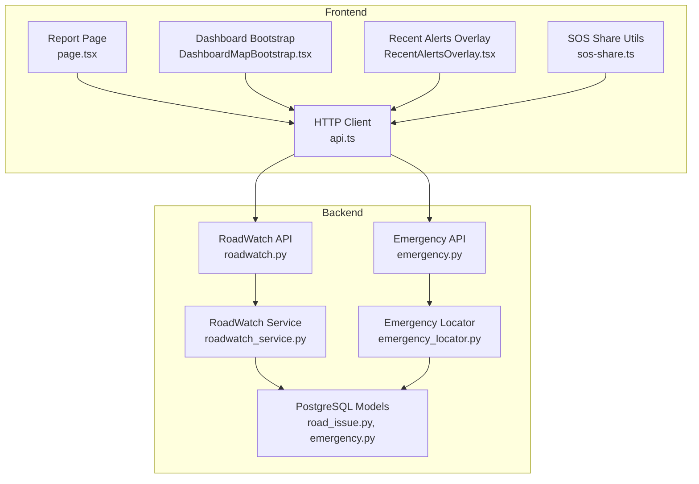
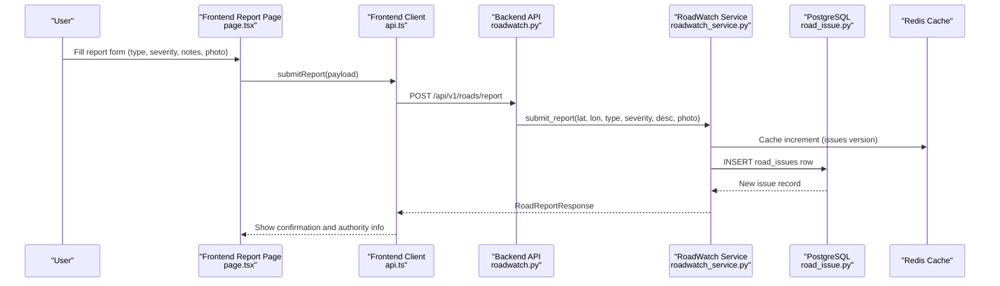
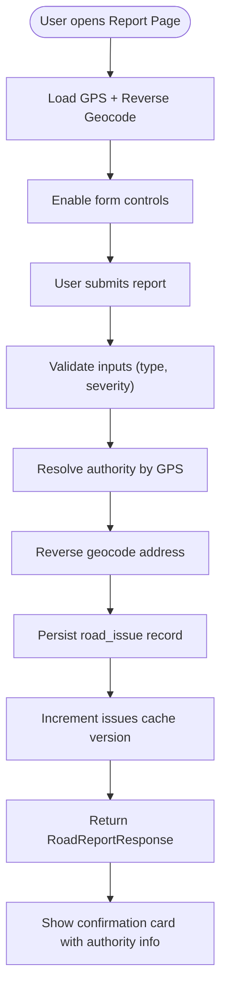
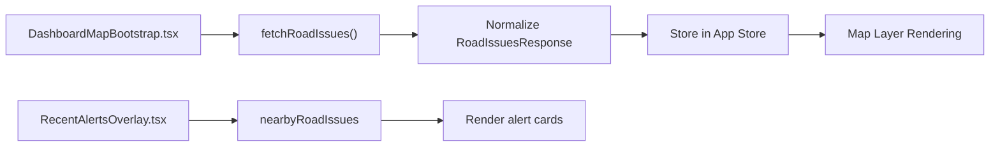
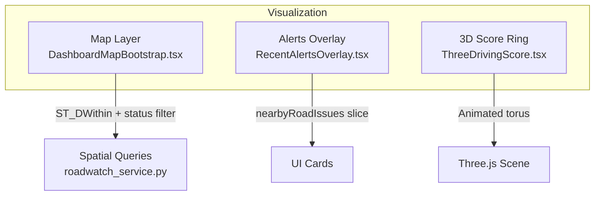
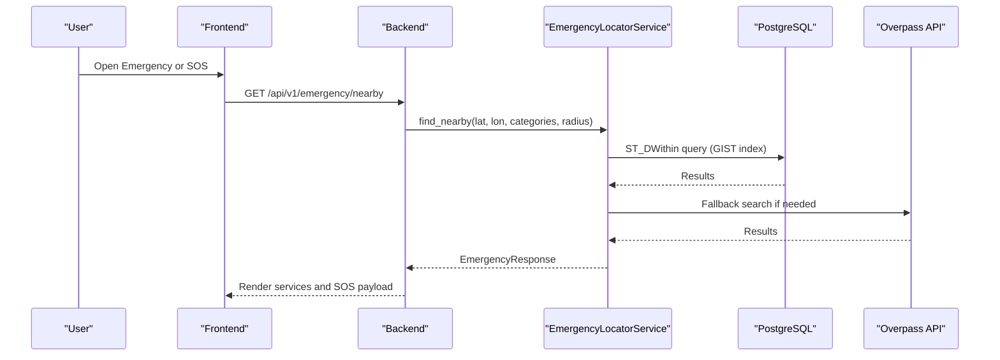
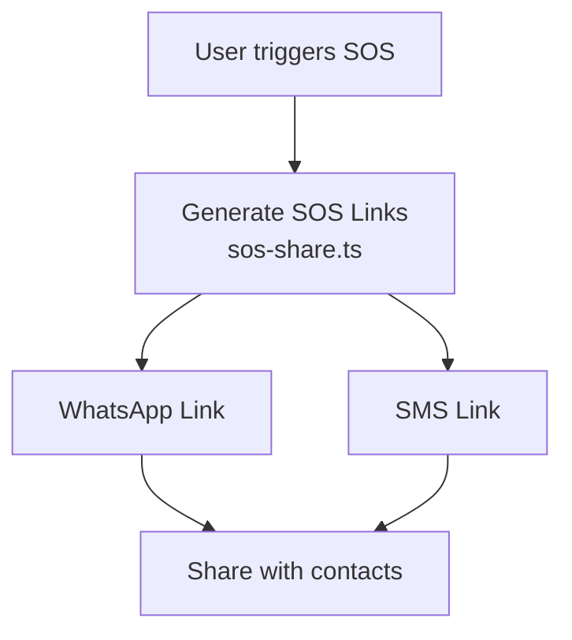
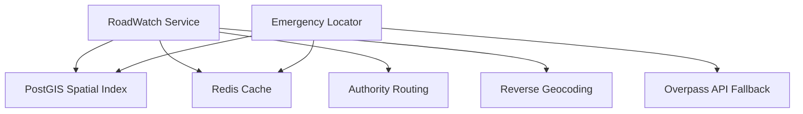

# Community Reporting and Transparency

<cite>
**Referenced Files in This Document**
- [road_issue.py](file://backend/models/road_issue.py)
- [roadwatch.py](file://backend/api/v1/roadwatch.py)
- [roadwatch_service.py](file://backend/services/roadwatch_service.py)
- [api.ts](file://frontend/lib/api.ts)
- [page.tsx](file://frontend/app/report/page.tsx)
- [DashboardMapBootstrap.tsx](file://frontend/components/dashboard/DashboardMapBootstrap.tsx)
- [RecentAlertsOverlay.tsx](file://frontend/components/dashboard/RecentAlertsOverlay.tsx)
- [emergency.py](file://backend/api/v1/emergency.py)
- [emergency_locator.py](file://backend/services/emergency_locator.py)
- [emergency.py](file://backend/models/emergency.py)
- [sos-share.ts](file://frontend/lib/sos-share.ts)
- [Security.md](file://docs/Security.md)
- [Features.md](file://docs/Features.md)
- [Database.md](file://docs/Database.md)
- [Architecture.md](file://docs/Architecture.md)
- [ThreeDrivingScore.tsx](file://frontend/components/dashboard/ThreeDrivingScore.tsx)
</cite>

## Table of Contents
1. [Introduction](#introduction)
2. [Project Structure](#project-structure)
3. [Core Components](#core-components)
4. [Architecture Overview](#architecture-overview)
5. [Detailed Component Analysis](#detailed-component-analysis)
6. [Dependency Analysis](#dependency-analysis)
7. [Performance Considerations](#performance-considerations)
8. [Troubleshooting Guide](#troubleshooting-guide)
9. [Conclusion](#conclusion)
10. [Appendices](#appendices)

## Introduction
This document explains the community reporting and transparency features that enable public participation in road safety monitoring. It covers the public reporting dashboard, community engagement mechanisms, data visualization components, integration with emergency services, escalation pathways for urgent road hazards, and privacy considerations for anonymized public displays.

## Project Structure
The community reporting system spans three primary layers:
- Backend API and services for road issue ingestion, spatial queries, and authority routing
- Frontend pages and components for public reporting, map overlays, and alert dashboards
- Emergency services integration for critical incidents and SOS workflows

**Diagram sources**
- [page.tsx:101-557](file://frontend/app/report/page.tsx#L101-L557)
- [DashboardMapBootstrap.tsx:77-330](file://frontend/components/dashboard/DashboardMapBootstrap.tsx#L77-L330)
- [RecentAlertsOverlay.tsx:47-100](file://frontend/components/dashboard/RecentAlertsOverlay.tsx#L47-L100)
- [api.ts:1-821](file://frontend/lib/api.ts#L1-L821)
- [roadwatch.py:1-97](file://backend/api/v1/roadwatch.py#L1-L97)
- [roadwatch_service.py:1-325](file://backend/services/roadwatch_service.py#L1-L325)
- [emergency.py:1-83](file://backend/api/v1/emergency.py#L1-L83)
- [emergency_locator.py:1-507](file://backend/services/emergency_locator.py#L1-L507)
- [road_issue.py:1-66](file://backend/models/road_issue.py#L1-L66)
- [emergency.py:1-45](file://backend/models/emergency.py#L1-L45)

**Section sources**
- [roadwatch.py:1-97](file://backend/api/v1/roadwatch.py#L1-L97)
- [roadwatch_service.py:1-325](file://backend/services/roadwatch_service.py#L1-L325)
- [api.ts:1-821](file://frontend/lib/api.ts#L1-L821)
- [page.tsx:101-557](file://frontend/app/report/page.tsx#L101-L557)
- [DashboardMapBootstrap.tsx:77-330](file://frontend/components/dashboard/DashboardMapBootstrap.tsx#L77-L330)
- [RecentAlertsOverlay.tsx:47-100](file://frontend/components/dashboard/RecentAlertsOverlay.tsx#L47-L100)
- [emergency.py:1-83](file://backend/api/v1/emergency.py#L1-L83)
- [emergency_locator.py:1-507](file://backend/services/emergency_locator.py#L1-L507)
- [road_issue.py:1-66](file://backend/models/road_issue.py#L1-L66)
- [emergency.py:1-45](file://backend/models/emergency.py#L1-L45)

## Core Components
- Public reporting dashboard: Submits geotagged road issues with severity and optional photos; shows authority preview and infrastructure metadata.
- Community engagement: Live map layer of nearby open/acknowledged issues; recent alerts overlay; social sharing of reports and SOS.
- Transparency indicators: Authority name, helpline, escalation path, executive engineer, contractor, budget, and maintenance schedule.
- Data visualization: Community issues map layer with status-based coloring; recent alerts summary; driving score visualization.
- Emergency integration: Nearby emergency services, SOS payload generation, and emergency numbers.
- Privacy and anonymization: GPS coordinates for road reports are stored; emergency search coordinates are not stored; crash events are anonymized.

**Section sources**
- [page.tsx:101-557](file://frontend/app/report/page.tsx#L101-L557)
- [DashboardMapBootstrap.tsx:77-330](file://frontend/components/dashboard/DashboardMapBootstrap.tsx#L77-L330)
- [RecentAlertsOverlay.tsx:47-100](file://frontend/components/dashboard/RecentAlertsOverlay.tsx#L47-L100)
- [roadwatch.py:73-97](file://backend/api/v1/roadwatch.py#L73-L97)
- [roadwatch_service.py:186-253](file://backend/services/roadwatch_service.py#L186-L253)
- [api.ts:680-750](file://frontend/lib/api.ts#L680-L750)
- [emergency.py:19-83](file://backend/api/v1/emergency.py#L19-L83)
- [emergency_locator.py:161-507](file://backend/services/emergency_locator.py#L161-L507)
- [Security.md:62-87](file://docs/Security.md#L62-L87)

## Architecture Overview
The community reporting pipeline integrates frontend submission, backend processing, spatial indexing, caching, and emergency services.

**Diagram sources**
- [page.tsx:232-258](file://frontend/app/report/page.tsx#L232-L258)
- [api.ts:723-750](file://frontend/lib/api.ts#L723-L750)
- [roadwatch.py:73-97](file://backend/api/v1/roadwatch.py#L73-L97)
- [roadwatch_service.py:186-253](file://backend/services/roadwatch_service.py#L186-L253)
- [road_issue.py:14-40](file://backend/models/road_issue.py#L14-L40)

**Section sources**
- [roadwatch.py:73-97](file://backend/api/v1/roadwatch.py#L73-L97)
- [roadwatch_service.py:186-253](file://backend/services/roadwatch_service.py#L186-L253)
- [road_issue.py:14-40](file://backend/models/road_issue.py#L14-L40)

## Detailed Component Analysis

### Public Reporting Dashboard
The reporting dashboard collects:
- Location lock with accuracy and coordinates
- Hazard type selection (e.g., pothole, debris, waterlogging)
- Severity slider (1–5)
- Optional photo upload
- Notes for the authority desk
- Authority preview and infrastructure metadata

On submit, the frontend posts to the backend, which validates inputs, resolves the owning authority, reverse-geocodes the location, persists the issue, increments the cache version, and returns a structured response with authority contact and infrastructure details.

**Diagram sources**
- [page.tsx:101-272](file://frontend/app/report/page.tsx#L101-L272)
- [api.ts:723-750](file://frontend/lib/api.ts#L723-L750)
- [roadwatch_service.py:186-253](file://backend/services/roadwatch_service.py#L186-L253)

**Section sources**
- [page.tsx:101-557](file://frontend/app/report/page.tsx#L101-L557)
- [api.ts:680-750](file://frontend/lib/api.ts#L680-L750)
- [roadwatch_service.py:186-253](file://backend/services/roadwatch_service.py#L186-L253)

### Community Engagement and Transparency Indicators
- Community issues map layer: Toggle shows open/acknowledged/resolved issues near the user. Colors reflect status.
- Recent alerts overlay: Summarizes nearby active issues and highlights urgency.
- Authority preview: Displays authority name, helpline, escalation path, executive engineer, and contractor.
- Infrastructure transparency: Shows road type, number/name, contractor, budget, and maintenance schedule.

**Diagram sources**
- [DashboardMapBootstrap.tsx:222-272](file://frontend/components/dashboard/DashboardMapBootstrap.tsx#L222-L272)
- [api.ts:680-705](file://frontend/lib/api.ts#L680-L705)
- [RecentAlertsOverlay.tsx:47-99](file://frontend/components/dashboard/RecentAlertsOverlay.tsx#L47-L99)

**Section sources**
- [DashboardMapBootstrap.tsx:77-330](file://frontend/components/dashboard/DashboardMapBootstrap.tsx#L77-L330)
- [RecentAlertsOverlay.tsx:47-100](file://frontend/components/dashboard/RecentAlertsOverlay.tsx#L47-L100)
- [api.ts:680-705](file://frontend/lib/api.ts#L680-L705)

### Data Visualization Components
- Community issues map layer: Uses spatial queries to show nearby open/acknowledged/resolved issues with status-based styling.
- Recent alerts overlay: Presents a horizontal scroll of active issues with severity-driven icons and colors.
- Driving score visualization: 3D animated ring indicating a safety score, useful for community awareness.

**Diagram sources**
- [DashboardMapBootstrap.tsx:222-272](file://frontend/components/dashboard/DashboardMapBootstrap.tsx#L222-L272)
- [roadwatch_service.py:127-184](file://backend/services/roadwatch_service.py#L127-L184)
- [RecentAlertsOverlay.tsx:47-99](file://frontend/components/dashboard/RecentAlertsOverlay.tsx#L47-L99)
- [ThreeDrivingScore.tsx:50-68](file://frontend/components/dashboard/ThreeDrivingScore.tsx#L50-L68)

**Section sources**
- [DashboardMapBootstrap.tsx:77-330](file://frontend/components/dashboard/DashboardMapBootstrap.tsx#L77-L330)
- [roadwatch_service.py:127-184](file://backend/services/roadwatch_service.py#L127-L184)
- [RecentAlertsOverlay.tsx:47-100](file://frontend/components/dashboard/RecentAlertsOverlay.tsx#L47-L100)
- [ThreeDrivingScore.tsx:1-68](file://frontend/components/dashboard/ThreeDrivingScore.tsx#L1-L68)

### Integration with Emergency Services and Escalation Pathways
- Nearby emergency services: Retrieves hospitals, police, ambulances, fire, towing, and other services within configurable radius and categories.
- SOS payload: Builds an emergency payload with nearby services, numbers, and radius used.
- Emergency numbers: Provides national and state-specific emergency numbers.
- Escalation pathways: Authority preview includes escalation path for critical issues.

**Diagram sources**
- [emergency.py:19-40](file://backend/api/v1/emergency.py#L19-L40)
- [emergency_locator.py:187-373](file://backend/services/emergency_locator.py#L187-L373)
- [emergency.py:12-45](file://backend/models/emergency.py#L12-L45)
- [Architecture.md:141-168](file://docs/Architecture.md#L141-L168)

**Section sources**
- [emergency.py:19-83](file://backend/api/v1/emergency.py#L19-L83)
- [emergency_locator.py:161-507](file://backend/services/emergency_locator.py#L161-L507)
- [emergency.py:12-45](file://backend/models/emergency.py#L12-L45)
- [Architecture.md:141-168](file://docs/Architecture.md#L141-L168)

### Social Sharing and Public Road Condition Maps
- Social sharing: Generates pre-filled WhatsApp/SMS SOS links with location, readable address, and user profile details.
- Public maps: Community issues map layer toggles on/off to visualize hotspots and recent activity around the user.

**Diagram sources**
- [sos-share.ts:9-68](file://frontend/lib/sos-share.ts#L9-L68)

**Section sources**
- [sos-share.ts:1-69](file://frontend/lib/sos-share.ts#L1-L69)
- [DashboardMapBootstrap.tsx:77-330](file://frontend/components/dashboard/DashboardMapBootstrap.tsx#L77-L330)

### Examples of Feedback Loops Improving Maintenance Prioritization and Accountability
- Hotspot identification: Frequent reports of potholes or waterlogging increase visibility and pressure on maintenance schedules.
- Severity distribution: Higher severity reports (4–5) trigger faster authority response and escalate pathways.
- Transparency: Display of contractor, budget, and maintenance dates increases public accountability and encourages timely repairs.

[No sources needed since this section synthesizes behavioral outcomes without quoting specific code]

### Privacy Considerations and Data Anonymization
- Road report coordinates are stored in the database for routing and transparency.
- Emergency search coordinates are not stored; only cached keys are used.
- Crash detection events are anonymized by rounding coordinates and truncating timestamps.
- User profile data (blood group, emergency contacts, vehicle number) remains in IndexedDB and is not uploaded unless explicitly consented.

**Section sources**
- [Security.md:62-87](file://docs/Security.md#L62-L87)
- [Database.md:210-223](file://docs/Database.md#L210-L223)

## Dependency Analysis
The reporting system relies on:
- Spatial queries with PostGIS for proximity and distance calculations
- Redis caching for performance and reduced database load
- Authority routing and infrastructure metadata for transparency
- Emergency services catalog with fallbacks to Overpass API

**Diagram sources**
- [roadwatch_service.py:127-184](file://backend/services/roadwatch_service.py#L127-L184)
- [emergency_locator.py:301-373](file://backend/services/emergency_locator.py#L301-L373)
- [Database.md:227-236](file://docs/Database.md#L227-L236)

**Section sources**
- [roadwatch_service.py:127-184](file://backend/services/roadwatch_service.py#L127-L184)
- [emergency_locator.py:301-373](file://backend/services/emergency_locator.py#L301-L373)
- [Database.md:227-236](file://docs/Database.md#L227-L236)

## Performance Considerations
- Caching: Extensive use of Redis for emergency services, reverse geocoding, authority previews, and road issues to minimize latency.
- Spatial indexing: PostGIS indexes and GIST indices ensure fast ST_DWithin queries.
- Client-side normalization: Frontend normalizes backend responses to typed interfaces, reducing parsing overhead.
- Emergency radius expansion: Iterative radius steps reduce repeated network calls and improve hit rates.

[No sources needed since this section provides general guidance]

## Troubleshooting Guide
Common issues and resolutions:
- Report submission errors: Validate GPS availability, required fields, and file types. Check service validation errors and retry.
- No nearby issues shown: Increase search radius or adjust statuses filter; verify cache freshness.
- Emergency services not found: Verify categories and radius; fallback to larger radius or Overpass if database results are insufficient.
- SOS link generation: Ensure location is available; fallback to approximate coordinates if needed.

**Section sources**
- [page.tsx:232-258](file://frontend/app/report/page.tsx#L232-L258)
- [DashboardMapBootstrap.tsx:171-300](file://frontend/components/dashboard/DashboardMapBootstrap.tsx#L171-L300)
- [emergency_locator.py:187-373](file://backend/services/emergency_locator.py#L187-L373)

## Conclusion
The community reporting and transparency system empowers citizens to report road hazards with geolocation, severity, and optional evidence. It surfaces authority and infrastructure details, visualizes community hotspots, integrates with emergency services, and maintains strong privacy safeguards. These capabilities collectively improve maintenance prioritization, public accountability, and responsive governance for safer roads.

## Appendices
- Feature highlights: See module descriptions for geotagged reporting, automatic authority routing, and offline queue.
- Data privacy policy: See dedicated security documentation for what is stored and how data is anonymized.

**Section sources**
- [Features.md:125-185](file://docs/Features.md#L125-L185)
- [Security.md:62-87](file://docs/Security.md#L62-L87)