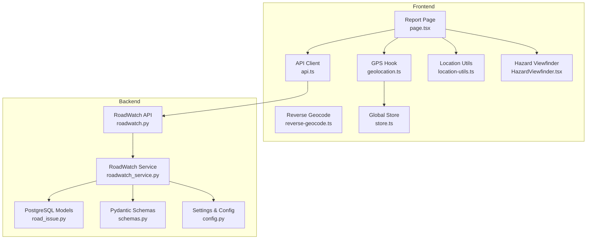
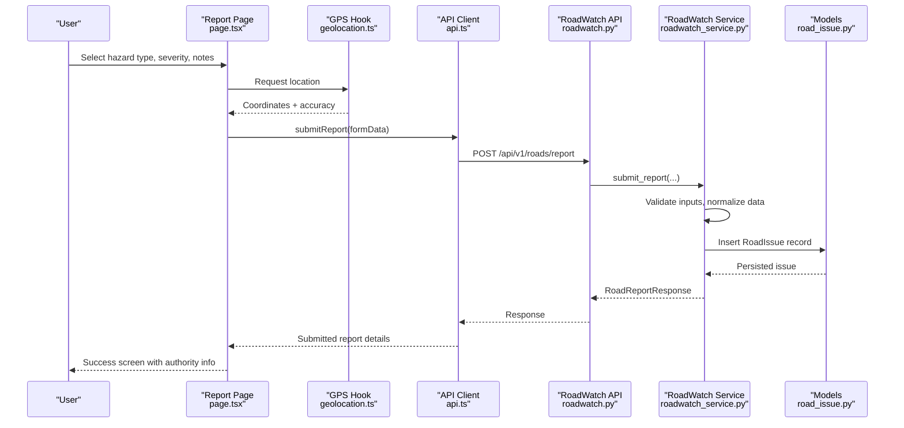
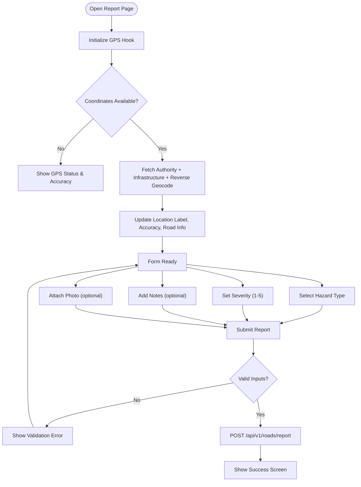
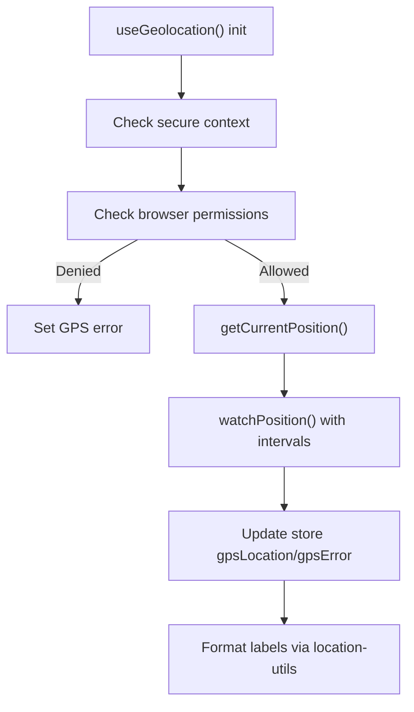
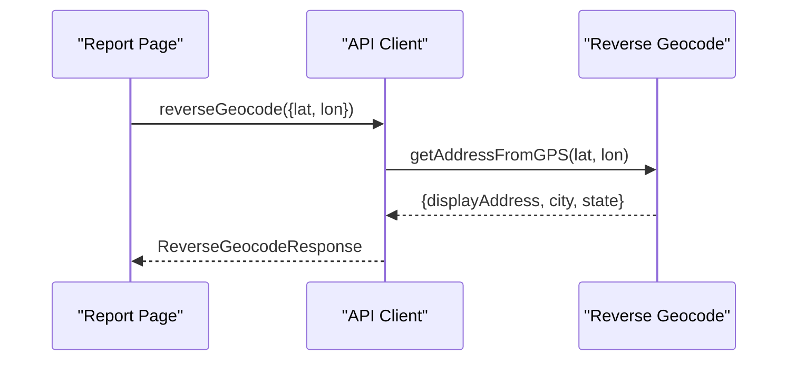
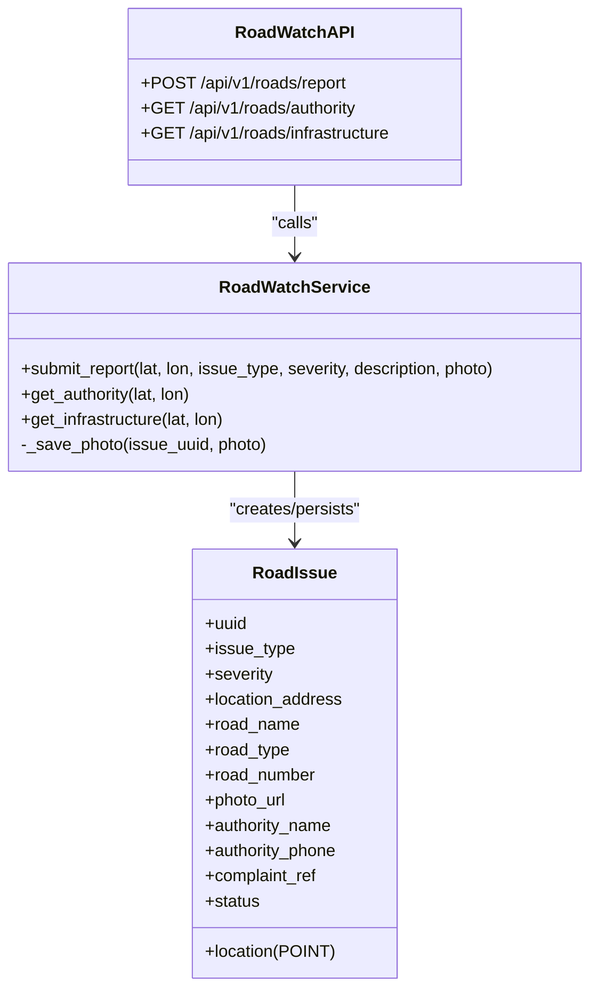
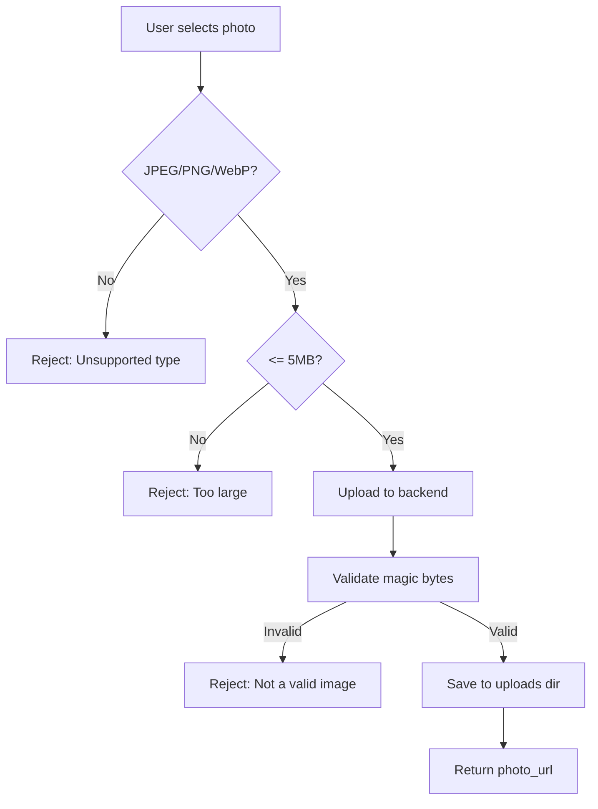
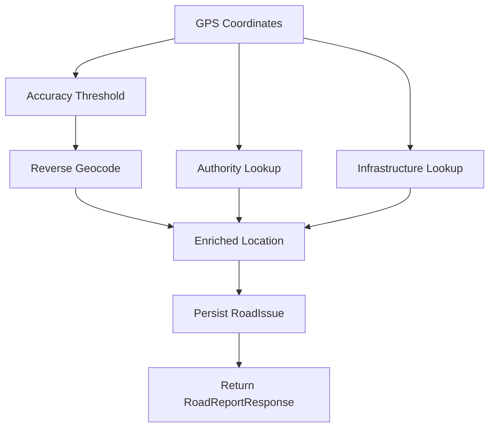
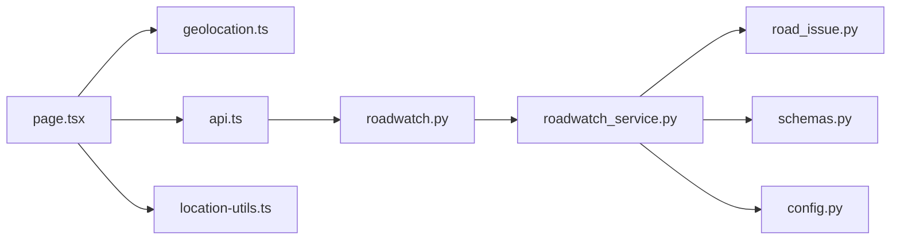

# Geotagged Issue Reporting

<cite>
**Referenced Files in This Document**
- [page.tsx](file://frontend/app/report/page.tsx)
- [ReportForm.tsx](file://frontend/components/ReportForm.tsx)
- [geolocation.ts](file://frontend/lib/geolocation.ts)
- [reverse-geocode.ts](file://frontend/lib/reverse-geocode.ts)
- [api.ts](file://frontend/lib/api.ts)
- [location-utils.ts](file://frontend/lib/location-utils.ts)
- [store.ts](file://frontend/lib/store.ts)
- [HazardViewfinder.tsx](file://frontend/components/report/HazardViewfinder.tsx)
- [roadwatch.py](file://backend/api/v1/roadwatch.py)
- [roadwatch_service.py](file://backend/services/roadwatch_service.py)
- [road_issue.py](file://backend/models/road_issue.py)
- [schemas.py](file://backend/models/schemas.py)
- [config.py](file://backend/core/config.py)
</cite>

## Table of Contents
1. [Introduction](#introduction)
2. [Project Structure](#project-structure)
3. [Core Components](#core-components)
4. [Architecture Overview](#architecture-overview)
5. [Detailed Component Analysis](#detailed-component-analysis)
6. [Dependency Analysis](#dependency-analysis)
7. [Performance Considerations](#performance-considerations)
8. [Troubleshooting Guide](#troubleshooting-guide)
9. [Conclusion](#conclusion)

## Introduction
This document describes the geotagged issue reporting system that captures real-time road hazards using GPS coordinates, allows users to select hazard types and severity ratings, optionally attach photos, and dispatch reports to the appropriate road authority. The system integrates frontend location detection, reverse geocoding, and backend validation and persistence to deliver a seamless reporting experience.

## Project Structure
The reporting system spans the frontend Next.js application and the backend FastAPI service:
- Frontend: A dedicated report page with a form, GPS integration, reverse geocoding, and photo upload handling.
- Backend: API endpoints for issuing reports, authority and infrastructure lookups, and robust validation and storage.

**Diagram sources**
- [page.tsx:101-557](file://frontend/app/report/page.tsx#L101-L557)
- [geolocation.ts:13-124](file://frontend/lib/geolocation.ts#L13-L124)
- [reverse-geocode.ts:25-48](file://frontend/lib/reverse-geocode.ts#L25-L48)
- [api.ts:654-750](file://frontend/lib/api.ts#L654-L750)
- [location-utils.ts:1-57](file://frontend/lib/location-utils.ts#L1-L57)
- [HazardViewfinder.tsx:17-105](file://frontend/components/report/HazardViewfinder.tsx#L17-L105)
- [store.ts:129-226](file://frontend/lib/store.ts#L129-L226)
- [roadwatch.py:73-97](file://backend/api/v1/roadwatch.py#L73-L97)
- [roadwatch_service.py:186-253](file://backend/services/roadwatch_service.py#L186-L253)
- [road_issue.py:14-66](file://backend/models/road_issue.py#L14-L66)
- [schemas.py:142-161](file://backend/models/schemas.py#L142-L161)
- [config.py:55-63](file://backend/core/config.py#L55-L63)

**Section sources**
- [page.tsx:101-557](file://frontend/app/report/page.tsx#L101-L557)
- [geolocation.ts:13-124](file://frontend/lib/geolocation.ts#L13-L124)
- [api.ts:654-750](file://frontend/lib/api.ts#L654-L750)
- [roadwatch.py:73-97](file://backend/api/v1/roadwatch.py#L73-L97)

## Core Components
- Report page form: Collects hazard type, severity, notes, and optional photo; displays real-time GPS status and accuracy; submits via API.
- GPS hook: Handles browser geolocation permissions, accuracy thresholds, and continuous updates.
- Reverse geocoding: Converts coordinates to human-readable labels client-side.
- API client: Encapsulates backend endpoints for authority preview, infrastructure data, reverse geocoding, and report submission.
- Backend service: Validates inputs, resolves road authority and infrastructure, persists reports, and manages photo uploads.

**Section sources**
- [page.tsx:46-61](file://frontend/app/report/page.tsx#L46-L61)
- [page.tsx:101-272](file://frontend/app/report/page.tsx#L101-L272)
- [geolocation.ts:13-124](file://frontend/lib/geolocation.ts#L13-L124)
- [reverse-geocode.ts:25-48](file://frontend/lib/reverse-geocode.ts#L25-L48)
- [api.ts:654-750](file://frontend/lib/api.ts#L654-L750)
- [roadwatch_service.py:186-253](file://backend/services/roadwatch_service.py#L186-L253)

## Architecture Overview
The system follows a client-server pattern:
- Frontend captures GPS coordinates and optional photo, then posts to backend.
- Backend validates inputs, enriches with authority and infrastructure data, stores the report, and returns a structured response.

**Diagram sources**
- [page.tsx:232-258](file://frontend/app/report/page.tsx#L232-L258)
- [geolocation.ts:30-108](file://frontend/lib/geolocation.ts#L30-L108)
- [api.ts:723-750](file://frontend/lib/api.ts#L723-L750)
- [roadwatch.py:73-97](file://backend/api/v1/roadwatch.py#L73-L97)
- [roadwatch_service.py:186-253](file://backend/services/roadwatch_service.py#L186-L253)
- [road_issue.py:14-40](file://backend/models/road_issue.py#L14-L40)

## Detailed Component Analysis

### Frontend Report Page
The report page orchestrates the entire workflow:
- Hazard type selection: six predefined categories (pothole, debris, waterlogging, signage, streetlight, collision scene).
- Severity rating: 1–5 scale with contextual labels.
- Notes: Up to 480 characters for additional context.
- Photo upload: Optional JPEG/PNG/WebP with client-side hints.
- GPS integration: Real-time location with accuracy indicators and approximate location warnings.
- Authority and infrastructure preview: Loaded concurrently with reverse geocoding.
- Submission: Validates presence of coordinates and hazard type, then posts to backend.

**Diagram sources**
- [page.tsx:101-272](file://frontend/app/report/page.tsx#L101-L272)
- [page.tsx:232-258](file://frontend/app/report/page.tsx#L232-L258)
- [geolocation.ts:30-108](file://frontend/lib/geolocation.ts#L30-L108)
- [api.ts:723-750](file://frontend/lib/api.ts#L723-L750)

**Section sources**
- [page.tsx:46-61](file://frontend/app/report/page.tsx#L46-L61)
- [page.tsx:101-272](file://frontend/app/report/page.tsx#L101-L272)
- [page.tsx:232-258](file://frontend/app/report/page.tsx#L232-L258)

### GPS and Location Utilities
- GPS hook requests high-accuracy location with timeouts and watches for continuous updates.
- Location utilities compute approximate location thresholds, format accuracy labels, and derive display labels.
- The store maintains global GPS state and errors.

**Diagram sources**
- [geolocation.ts:30-108](file://frontend/lib/geolocation.ts#L30-L108)
- [location-utils.ts:17-56](file://frontend/lib/location-utils.ts#L17-L56)
- [store.ts:63-68](file://frontend/lib/store.ts#L63-L68)

**Section sources**
- [geolocation.ts:13-124](file://frontend/lib/geolocation.ts#L13-L124)
- [location-utils.ts:1-57](file://frontend/lib/location-utils.ts#L1-L57)
- [store.ts:129-226](file://frontend/lib/store.ts#L129-L226)

### Reverse Geocoding
- The frontend uses a client-side reverse geocoder to convert coordinates to a readable address without hitting the backend.
- The API client wraps this to return a normalized response.

**Diagram sources**
- [api.ts:654-671](file://frontend/lib/api.ts#L654-L671)
- [reverse-geocode.ts:25-48](file://frontend/lib/reverse-geocode.ts#L25-L48)

**Section sources**
- [api.ts:654-671](file://frontend/lib/api.ts#L654-L671)
- [reverse-geocode.ts:25-48](file://frontend/lib/reverse-geocode.ts#L25-L48)

### Backend API and Service
- API endpoint validates coordinates, severity range, and issue type; accepts optional photo.
- Service layer:
  - Normalizes inputs and validates content types and sizes.
  - Resolves authority and infrastructure data.
  - Persists the report with a generated complaint reference and optional photo URL.
  - Returns a standardized response.

**Diagram sources**
- [roadwatch.py:73-97](file://backend/api/v1/roadwatch.py#L73-L97)
- [roadwatch_service.py:186-253](file://backend/services/roadwatch_service.py#L186-L253)
- [road_issue.py:14-40](file://backend/models/road_issue.py#L14-L40)

**Section sources**
- [roadwatch.py:73-97](file://backend/api/v1/roadwatch.py#L73-L97)
- [roadwatch_service.py:186-253](file://backend/services/roadwatch_service.py#L186-L253)
- [road_issue.py:14-40](file://backend/models/road_issue.py#L14-L40)
- [schemas.py:142-161](file://backend/models/schemas.py#L142-L161)

### Photo Upload Validation
- Frontend enforces file type and size constraints before submission.
- Backend validates content type via magic bytes and enforces maximum size.

**Diagram sources**
- [ReportForm.tsx:9-10](file://frontend/components/ReportForm.tsx#L9-L10)
- [ReportForm.tsx:28-65](file://frontend/components/ReportForm.tsx#L28-L65)
- [config.py:59-63](file://backend/core/config.py#L59-L63)
- [roadwatch_service.py:275-324](file://backend/services/roadwatch_service.py#L275-L324)

**Section sources**
- [ReportForm.tsx:9-10](file://frontend/components/ReportForm.tsx#L9-L10)
- [ReportForm.tsx:28-65](file://frontend/components/ReportForm.tsx#L28-L65)
- [config.py:59-63](file://backend/core/config.py#L59-L63)
- [roadwatch_service.py:275-324](file://backend/services/roadwatch_service.py#L275-L324)

### Spatial Data Processing Workflow
- Coordinate capture: High-accuracy GPS with continuous watching.
- Reverse geocoding: Client-side conversion to readable address.
- Authority and infrastructure matching: Backend resolves road ownership and asset metadata near the point.
- Persistence: Report stored with geometry and enriched attributes.

**Diagram sources**
- [geolocation.ts:74-85](file://frontend/lib/geolocation.ts#L74-L85)
- [api.ts:654-721](file://frontend/lib/api.ts#L654-L721)
- [roadwatch_service.py:70-125](file://backend/services/roadwatch_service.py#L70-L125)
- [roadwatch_service.py:186-253](file://backend/services/roadwatch_service.py#L186-L253)

**Section sources**
- [geolocation.ts:74-85](file://frontend/lib/geolocation.ts#L74-L85)
- [api.ts:654-721](file://frontend/lib/api.ts#L654-L721)
- [roadwatch_service.py:70-125](file://backend/services/roadwatch_service.py#L70-L125)
- [roadwatch_service.py:186-253](file://backend/services/roadwatch_service.py#L186-L253)

## Dependency Analysis
- Frontend depends on:
  - GPS hook for location acquisition.
  - API client for backend communication.
  - Location utilities for UX labeling.
  - Store for shared state.
- Backend depends on:
  - Pydantic schemas for request/response validation.
  - SQLAlchemy models for persistence.
  - Settings for configuration (upload limits, allowed types).

**Diagram sources**
- [page.tsx:101-557](file://frontend/app/report/page.tsx#L101-L557)
- [geolocation.ts:13-124](file://frontend/lib/geolocation.ts#L13-L124)
- [api.ts:654-750](file://frontend/lib/api.ts#L654-L750)
- [roadwatch.py:73-97](file://backend/api/v1/roadwatch.py#L73-L97)
- [roadwatch_service.py:186-253](file://backend/services/roadwatch_service.py#L186-L253)
- [road_issue.py:14-40](file://backend/models/road_issue.py#L14-L40)
- [schemas.py:142-161](file://backend/models/schemas.py#L142-L161)
- [config.py:59-63](file://backend/core/config.py#L59-L63)

**Section sources**
- [page.tsx:101-557](file://frontend/app/report/page.tsx#L101-L557)
- [api.ts:654-750](file://frontend/lib/api.ts#L654-L750)
- [roadwatch_service.py:186-253](file://backend/services/roadwatch_service.py#L186-L253)

## Performance Considerations
- Concurrency: The frontend fetches authority, infrastructure, and reverse geocoding in parallel to minimize latency.
- Caching: Backend caches authority and infrastructure lookups to reduce repeated computations.
- Image handling: Backend validates magic bytes and enforces size limits early to prevent wasted I/O.
- GPS accuracy: Users with approximate locations are warned; sharper fixes improve road ownership matching.

[No sources needed since this section provides general guidance]

## Troubleshooting Guide
Common issues and resolutions:
- GPS permission denied: Prompt users to enable location in browser settings; the hook surfaces explicit error messages.
- Low accuracy: Approximate location warnings are shown; advise moving to an open area for better satellite reception.
- Photo rejected:
  - Unsupported type: Ensure JPEG/PNG/WebP.
  - Too large: Reduce image size to under 5 MB.
  - Invalid image: Verify the file is a valid image and not corrupted.
- Backend validation errors: Ensure hazard type length and severity range are valid; check network connectivity and CORS settings.
- Authority/infrastructure not found: Occasional upstream service delays; retry after a moment.

**Section sources**
- [geolocation.ts:63-71](file://frontend/lib/geolocation.ts#L63-L71)
- [location-utils.ts:17-19](file://frontend/lib/location-utils.ts#L17-L19)
- [ReportForm.tsx:28-38](file://frontend/components/ReportForm.tsx#L28-L38)
- [config.py:59-63](file://backend/core/config.py#L59-L63)
- [roadwatch_service.py:275-324](file://backend/services/roadwatch_service.py#L275-L324)
- [roadwatch.py:95-96](file://backend/api/v1/roadwatch.py#L95-L96)

## Conclusion
The geotagged issue reporting system combines precise GPS capture, real-time reverse geocoding, and robust backend validation to deliver accurate, actionable reports. Its modular frontend and backend components ensure scalability, maintainability, and a smooth user experience across devices and connection states.