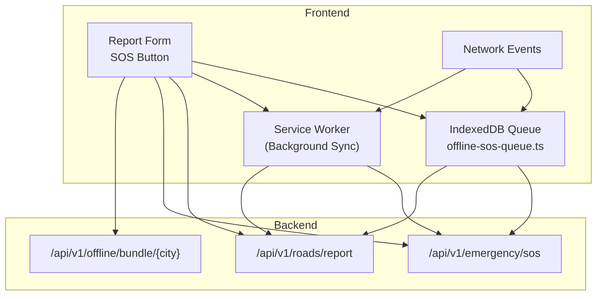
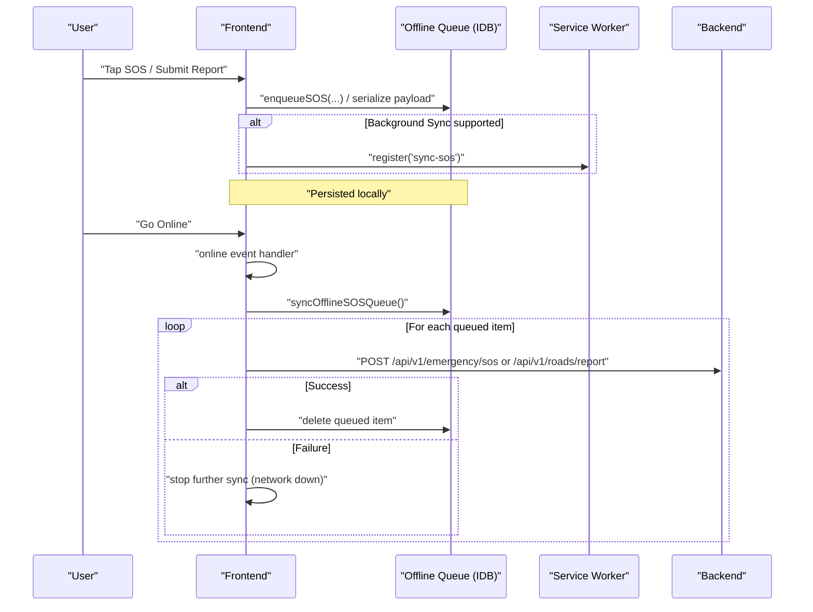
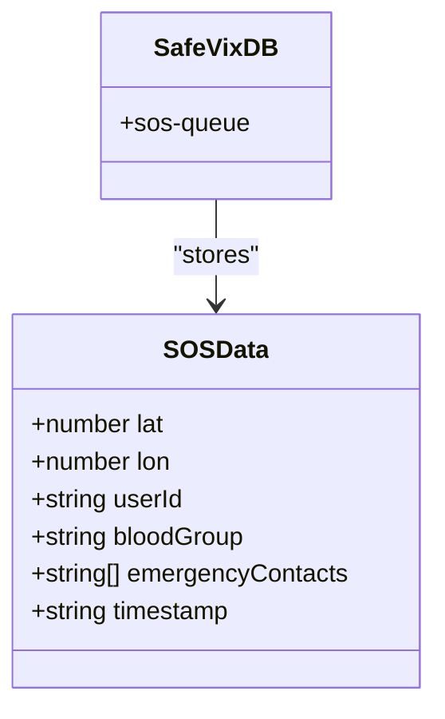
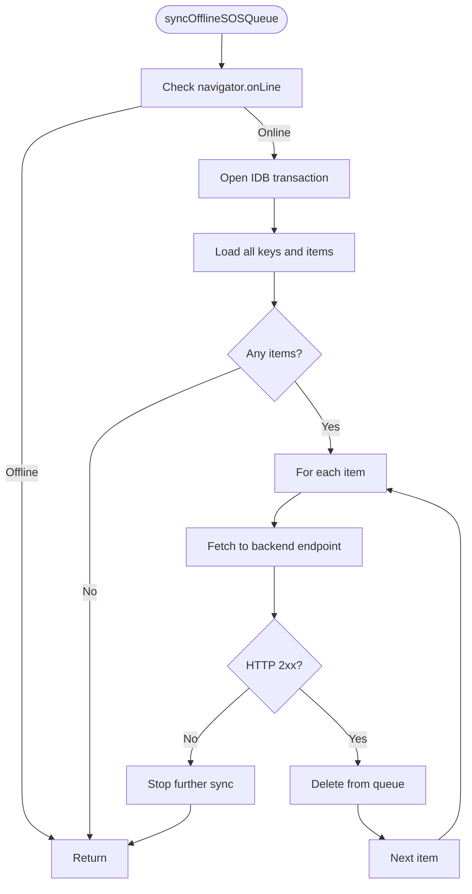
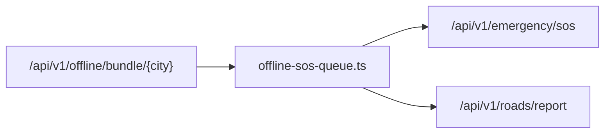

# Offline Report Queue

<cite>
**Referenced Files in This Document**
- [offline-sos-queue.ts](file://frontend/lib/offline-sos-queue.ts)
- [offline-ai.ts](file://frontend/lib/offline-ai.ts)
- [offline-rag.ts](file://frontend/lib/offline-rag.ts)
- [roadwatch.py](file://backend/api/v1/roadwatch.py)
- [emergency.py](file://backend/api/v1/emergency.py)
- [offline.py](file://backend/api/v1/offline.py)
- [Offline_Architecture.md](file://docs/Offline_Architecture.md)
- [Features.md](file://docs/Features.md)
</cite>

## Table of Contents
1. [Introduction](#introduction)
2. [Project Structure](#project-structure)
3. [Core Components](#core-components)
4. [Architecture Overview](#architecture-overview)
5. [Detailed Component Analysis](#detailed-component-analysis)
6. [Dependency Analysis](#dependency-analysis)
7. [Performance Considerations](#performance-considerations)
8. [Troubleshooting Guide](#troubleshooting-guide)
9. [Conclusion](#conclusion)
10. [Appendices](#appendices)

## Introduction
This document explains the offline reporting queue system that enables road hazard reporting and emergency SOS submission even without internet connectivity. It covers IndexedDB-backed temporary caching, synchronization on connectivity restoration, offline-first patterns, and the integration points with backend APIs. It also outlines the current architecture’s limitations and a proposed enterprise-grade migration path.

## Project Structure
The offline reporting queue spans the frontend and backend:
- Frontend: IndexedDB-backed queue for SOS events, offline AI and RAG for local assistance, and integration hooks to synchronize when online.
- Backend: REST endpoints for SOS ingestion, road hazard reporting, and offline bundles for emergency data.

**Diagram sources**
- [offline-sos-queue.ts:25-42](file://frontend/lib/offline-sos-queue.ts#L25-L42)
- [offline-sos-queue.ts:75-124](file://frontend/lib/offline-sos-queue.ts#L75-L124)
- [emergency.py:42-71](file://backend/api/v1/emergency.py#L42-L71)
- [roadwatch.py:73-96](file://backend/api/v1/roadwatch.py#L73-L96)
- [offline.py:18-27](file://backend/api/v1/offline.py#L18-L27)

**Section sources**
- [offline-sos-queue.ts:1-138](file://frontend/lib/offline-sos-queue.ts#L1-L138)
- [emergency.py:1-83](file://backend/api/v1/emergency.py#L1-L83)
- [roadwatch.py:1-97](file://backend/api/v1/roadwatch.py#L1-L97)
- [offline.py:1-28](file://backend/api/v1/offline.py#L1-L28)

## Core Components
- IndexedDB queue for SOS events with timestamp indexing and auto-incremented keys.
- Offline synchronization routine that drains the queue when online.
- Event listener to trigger sync upon network restoration.
- Optional background sync registration via Service Worker SyncManager.
- Backend endpoints for SOS ingestion and road hazard reporting.
- Offline bundle endpoint to provision city-specific emergency resources.

Key responsibilities:
- Persist user actions offline and retry later.
- Maintain ordering via insertion timestamp.
- Provide a seamless user experience by deferring submission until connectivity returns.

**Section sources**
- [offline-sos-queue.ts:12-18](file://frontend/lib/offline-sos-queue.ts#L12-L18)
- [offline-sos-queue.ts:25-42](file://frontend/lib/offline-sos-queue.ts#L25-L42)
- [offline-sos-queue.ts:48-69](file://frontend/lib/offline-sos-queue.ts#L48-L69)
- [offline-sos-queue.ts:75-124](file://frontend/lib/offline-sos-queue.ts#L75-L124)
- [offline-sos-queue.ts:130-137](file://frontend/lib/offline-sos-queue.ts#L130-L137)
- [emergency.py:42-71](file://backend/api/v1/emergency.py#L42-L71)
- [roadwatch.py:73-96](file://backend/api/v1/roadwatch.py#L73-L96)
- [offline.py:18-27](file://backend/api/v1/offline.py#L18-L27)

## Architecture Overview
The offline-first flow:
- User submits an SOS or road hazard report while offline.
- The action is serialized and stored in IndexedDB.
- Optionally, the browser attempts to schedule background sync via Service Worker.
- When connectivity returns, the app drains the queue by sending requests to backend endpoints.
- Successful submissions are removed from the queue; failures remain for later retry.

**Diagram sources**
- [offline-sos-queue.ts:48-69](file://frontend/lib/offline-sos-queue.ts#L48-L69)
- [offline-sos-queue.ts:75-124](file://frontend/lib/offline-sos-queue.ts#L75-L124)
- [emergency.py:42-71](file://backend/api/v1/emergency.py#L42-L71)
- [roadwatch.py:73-96](file://backend/api/v1/roadwatch.py#L73-L96)

## Detailed Component Analysis

### IndexedDB Queue Implementation
The queue stores SOS entries with a generated timestamp and auto-incremented primary key. It creates an object store on first use and an index on timestamp for ordering.

- Initialization: Opens a database with a single object store for SOS entries.
- Indexing: Timestamp index supports ordered retrieval.
- Persistence: Uses auto-incremented numeric keys for uniqueness and ordering.

Operational behavior:
- Enqueue: Adds a normalized SOS record with current timestamp.
- Sync: Iterates items in insertion order, sends to backend, deletes on success.
- Retry: Stops on first failure to avoid repeated retries during ongoing outages.

**Diagram sources**
- [offline-sos-queue.ts:12-18](file://frontend/lib/offline-sos-queue.ts#L12-L18)
- [offline-sos-queue.ts:25-42](file://frontend/lib/offline-sos-queue.ts#L25-L42)
- [offline-sos-queue.ts:48-69](file://frontend/lib/offline-sos-queue.ts#L48-L69)

**Section sources**
- [offline-sos-queue.ts:12-18](file://frontend/lib/offline-sos-queue.ts#L12-L18)
- [offline-sos-queue.ts:25-42](file://frontend/lib/offline-sos-queue.ts#L25-L42)
- [offline-sos-queue.ts:48-69](file://frontend/lib/offline-sos-queue.ts#L48-L69)

### Synchronization Mechanism
The sync routine:
- Checks online status before attempting sync.
- Retrieves all queued items and iterates in insertion order.
- Sends requests to backend endpoints.
- Deletes items from the queue on successful responses.
- Stops early on network errors to prevent repeated failures.

**Diagram sources**
- [offline-sos-queue.ts:75-124](file://frontend/lib/offline-sos-queue.ts#L75-L124)
- [emergency.py:42-71](file://backend/api/v1/emergency.py#L42-L71)

**Section sources**
- [offline-sos-queue.ts:75-124](file://frontend/lib/offline-sos-queue.ts#L75-L124)

### Background Sync and Service Worker Integration
- Optional registration of a background sync tag when Service Worker and SyncManager are available.
- The frontend logs a message when an item is enqueued, indicating potential background sync scheduling.
- The current implementation relies primarily on online event-driven sync; background sync acts as a complementary mechanism.

Limitations:
- Background sync availability depends on browser support and platform constraints.
- The current code does not define a dedicated service worker script or background sync handler.

**Section sources**
- [offline-sos-queue.ts:60-69](file://frontend/lib/offline-sos-queue.ts#L60-L69)
- [Offline_Architecture.md:4-6](file://docs/Offline_Architecture.md#L4-L6)

### Relationship Between Offline Queues and Online Workflows
- Offline queue complements online reporting by deferring submission until connectivity returns.
- Online reporting workflows remain unchanged: the app posts directly to backend endpoints when online.
- Priority handling: queued items are processed in insertion order; no explicit prioritization is implemented.
- Batch processing: the sync routine processes items sequentially, stopping on the first failure.

**Section sources**
- [offline-sos-queue.ts:75-124](file://frontend/lib/offline-sos-queue.ts#L75-L124)
- [roadwatch.py:73-96](file://backend/api/v1/roadwatch.py#L73-L96)
- [emergency.py:42-71](file://backend/api/v1/emergency.py#L42-L71)

### Offline AI and RAG Support
While not part of the queue itself, the offline AI and RAG modules support offline-first experiences:
- Offline AI: Provides multilingual, localized responses using system AI or a downloaded model, with a keyword fallback.
- Offline RAG: Performs local law index searches for road safety citations.

These components enhance user experience during offline periods and complement the queue by reducing reliance on online resources.

**Section sources**
- [offline-ai.ts:1-256](file://frontend/lib/offline-ai.ts#L1-L256)
- [offline-rag.ts:1-35](file://frontend/lib/offline-rag.ts#L1-L35)

## Dependency Analysis
- Frontend queue depends on IndexedDB for persistence and on network events for synchronization.
- Backend depends on FastAPI routers for SOS and road report endpoints.
- Offline bundle endpoint supports provisioning city-specific emergency data for offline use.

**Diagram sources**
- [offline-sos-queue.ts:75-124](file://frontend/lib/offline-sos-queue.ts#L75-L124)
- [emergency.py:42-71](file://backend/api/v1/emergency.py#L42-L71)
- [roadwatch.py:73-96](file://backend/api/v1/roadwatch.py#L73-L96)
- [offline.py:18-27](file://backend/api/v1/offline.py#L18-L27)

**Section sources**
- [offline-sos-queue.ts:75-124](file://frontend/lib/offline-sos-queue.ts#L75-L124)
- [emergency.py:1-83](file://backend/api/v1/emergency.py#L1-L83)
- [roadwatch.py:1-97](file://backend/api/v1/roadwatch.py#L1-L97)
- [offline.py:1-28](file://backend/api/v1/offline.py#L1-L28)

## Performance Considerations
- IndexedDB operations: Batch reads and writes are efficient; however, iterating all items on every sync can be costly with large queues. Consider pruning old items or limiting batch sizes.
- Network retries: The current implementation stops on the first failure. Introducing exponential backoff and per-item retry limits would improve resilience.
- Background sync: While optional, enabling it reduces manual polling and improves reliability across sessions.
- Model downloads: Offline AI and RAG rely on cached assets; ensure cache policies support long-term availability.

[No sources needed since this section provides general guidance]

## Troubleshooting Guide
Common issues and remedies:
- Items not syncing after reconnection:
  - Verify online event listener is registered and reachable.
  - Confirm the queue is not empty and items are present.
  - Check backend endpoint availability and CORS configuration.
- Frequent failures:
  - Implement per-item retry with backoff and error logging.
  - Limit batch size to reduce contention.
- Background sync not triggering:
  - Ensure Service Worker and SyncManager are available.
  - Confirm the sync tag is registered and the service worker is active.
- Data loss concerns:
  - The current architecture persists data in IndexedDB. For enterprise-grade durability, migrate to cloud storage and centralized conflict resolution as outlined in the architecture document.

**Section sources**
- [offline-sos-queue.ts:130-137](file://frontend/lib/offline-sos-queue.ts#L130-L137)
- [offline-sos-queue.ts:75-124](file://frontend/lib/offline-sos-queue.ts#L75-L124)
- [Offline_Architecture.md:8-23](file://docs/Offline_Architecture.md#L8-L23)

## Conclusion
The offline reporting queue provides a robust offline-first mechanism for SOS and road hazard reporting. IndexedDB ensures persistence, and the online-driven sync routine reliably transmits queued items when connectivity returns. For enterprise-scale deployments, the project’s documentation outlines a migration path toward durable object storage and centralized conflict resolution to eliminate ephemeral disk risks and enable distributed backend scaling.

[No sources needed since this section summarizes without analyzing specific files]

## Appendices

### Backend Endpoints Involved in Offline Sync
- Emergency SOS: GET /api/v1/emergency/sos
- Road report: POST /api/v1/roads/report
- Offline bundle: GET /api/v1/offline/bundle/{city}

**Section sources**
- [emergency.py:42-71](file://backend/api/v1/emergency.py#L42-L71)
- [roadwatch.py:73-96](file://backend/api/v1/roadwatch.py#L73-L96)
- [offline.py:18-27](file://backend/api/v1/offline.py#L18-L27)

### Offline Features and Capabilities
- Offline report queue: serializes to IndexedDB, supports background sync, and shows user feedback.
- Offline AI and RAG: provide localized, multilingual assistance and law citations without online access.

**Section sources**
- [Features.md:146-150](file://docs/Features.md#L146-L150)
- [offline-ai.ts:1-256](file://frontend/lib/offline-ai.ts#L1-L256)
- [offline-rag.ts:1-35](file://frontend/lib/offline-rag.ts#L1-L35)